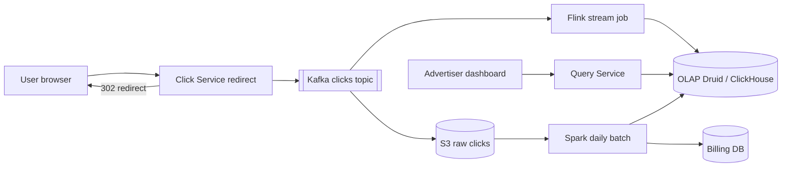
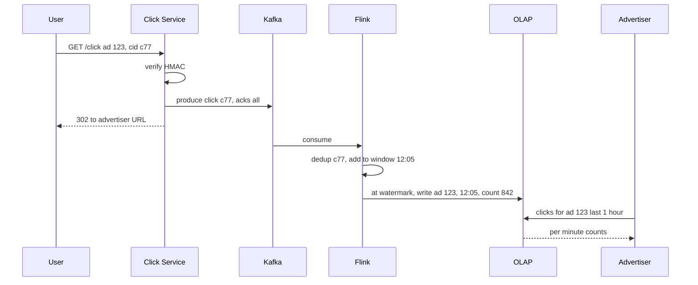

# Design Ad Click Aggregator

**Ek line me:** har ad click ko capture karo, user ko advertiser ki site pe redirect karo, aur advertisers ko per-ad, per-minute click counts dikhao. Ye counts **billing** me jaate hain, isliye galat count = galat paisa.

**Is question me interviewer kya check karta hai:** high QPS ingestion, stream processing (windows, watermarks), exactly-once counting, OLAP store choice, aur batch reconciliation se accuracy guarantee.

---

## Step 1: Interviewer se ye confirm karo (3–5 min)

| Tum poochho | Typical jawab | Design pe asar |
|---|---|---|
| "Click kitne per second?" | ~10K avg, peak 50K QPS | Kafka + stream processor, DB direct nahi |
| "Query granularity? Per minute?" | Per ad per minute, aur hour/day rollups | 1 min tumbling window |
| "Kitna fresh chahiye dashboard?" | ~1 min delay chalega | Streaming, batch nahi |
| "Billing ke liye accuracy?" | Exact chahiye, 100% | Dedup + daily batch reconciliation |
| "Redirect bhi hum karenge?" | Haan, click hamare server se hoke jaayega | Click server fast hona chahiye, < 50ms |
| "Fraud detection, impressions?" | Basic dedup haan, ML fraud out of scope | Click dedup by click_id |

> **Bolo:** "Main do paths banaunga: ek fast streaming path jo 1 minute me dashboard update kare, aur ek batch path jo raat ko raw data se exact count nikal ke streaming ko reconcile kare. Billing batch numbers se hogi."

## Step 2: Requirements

**Functional**
1. Users should be able to ad pe click karke advertiser URL pe redirect hon (click record ho)
2. Advertisers should be able to ad X ke clicks per minute query kar sakein (last 1 hour, ya hour/day rollup)
3. Advertisers should be able to campaign, country, device se filter kar sakein
4. Advertisers should be able to campaign ke top N ads (last 1 hour) dekh sakein

**Out of scope:** impressions/CTR, ML fraud detection, ad serving/auction, invoice generation UI.

**Non-functional (priority order me)**
1. **Accuracy:** har click exactly-once count (billing), click kabhi lost na ho
2. **Latency:** redirect p99 < 50 ms; dashboard query p99 < 1 sec
3. **Freshness:** dashboard ~1 min purana max
4. **Scale:** 50K QPS peak, ~1B clicks/day, data 1 saal retain

**CAP choice:** click ingestion pe availability (Kafka down ho to bhi redirect karo, local buffer), aur dashboard eventual (~1 min). Billing numbers pe strong correctness, isliye batch recount ke baad hi final.

## Step 3: Estimation (sirf jo design badle)

- 1B clicks/day ≈ **12K QPS avg, 50K peak**. Kisi bhi OLTP DB me har click ka `UPDATE count+1` = hot rows, possible nahi. Isliye pre-aggregation. 50K/sec akela Kafka justify nahi karta; **replay + 2 consumers** karte hain (Step 6).
- Raw event ~200 bytes → **200 GB/day** raw. S3 me raw, OLAP me aggregated.
- Aggregated: 10M ads × 1440 min = max 14B rows/day, par sirf active ads ke rows → realistic ~100M rows/day. OLAP store chahiye.

> **Bolo:** "Raw click har ek ko DB me count karna possible nahi. Stream processor 1 minute windows me aggregate karega, toh OLAP me per ad per minute (country, device) ek row jaayegi: 50K writes/sec se ghat ke ~1K rows/sec."

## Step 4: Core entities

- **ClickEvent**: click_id (unique, impression time pe generated), ad_id, campaign_id, user_id, ip, country, device, ts
- **AdAggregate**: ad_id, minute_bucket, country, device, click_count
- **Ad**: ad_id, campaign_id, advertiser_id, target_url

## Step 5: APIs

```http
GET /click?ad=123&cid=<click_id>&sig=<hmac>   → 302 Location: advertiser URL
GET /ads/{adId}/clicks?from=..&to=..&granularity=minute&country=IN
                                              → [{minute, count}]
GET /campaigns/{id}/top-ads?window=1h&n=10    → [{adId, count}]
```

> **Bolo:** "Click URL me `click_id` aur HMAC signature hai, jo ad serve karte waqt banta hai. Isse dedup bhi hota hai aur koi fake URL banake clicks inflate nahi kar sakta."

## Step 6: High-level design

**Simple v1 pehle:** Click Service har click Postgres me insert kare, dashboard `GROUP BY ad_id, minute` chalaye. Hazaar clicks/sec tak ye kaam karta hai. Numbers isko todte hain: 50K inserts/sec + 1B rows/day pe `GROUP BY` seconds le leta hai (→ pre-aggregation: Flink + OLAP), click lose nahi ho sakta aur Flink restart/recount pe replay chahiye (→ Kafka), billing exact chahiye (→ S3 raw + Spark recount).



**Har component kyun:** (FR1 → Click Service + Kafka, FR2/FR3/FR4 → Flink + OLAP + Query Service; accuracy NFR → S3 + Spark)
- **Click Service:** stateless, Kafka me event likhe (acks=all) phir 302. Redirect latency NFR.
- **Kafka:** 50K/sec peak, **2 independent consumers** (Flink aur S3 sink), aur **7 din replay** (Flink crash/bug fix pe recount). Simpler SQS me ek message ek hi consumer, replay nahi.
- **Flink:** 1 min event-time windows, watermarks, exactly-once checkpoints. Simpler "raw clicks seedha ClickHouse + materialized views" chal sakta hai, par click_id dedup aur late events ka control kamzor.
- **OLAP (ClickHouse/Druid/Pinot):** ~100M aggregated rows/day pe slice-and-dice < 1 sec. Postgres isme slow.
- **S3 + Spark:** raw ka sasta permanent copy (200 GB/day), raat ko exact recount, billing truth.
- **Query Service:** dashboard APIs, rollup (minute/hour/day) choose karta hai. Thin layer.

## Step 7: Main flow: click se dashboard tak



## Step 8: Data model & DB choice

```sql
-- OLAP (ClickHouse / Druid)
ad_clicks_1m(ad_id, campaign_id, minute_ts, country, device, clicks)
  PARTITION BY day, ORDER BY (ad_id, minute_ts)
-- rollups
ad_clicks_1h, ad_clicks_1d   -- materialized views
```

- **OLAP column store:** time + ad_id pe sorted, columnar compression, aggregates ms me.
- **S3 (Parquet):** raw clicks, 1 saal, batch ke liye.
- **Billing DB (Postgres):** daily final numbers per advertiser, invoices.

## Step 9: Deep dives (interviewer yahin pressure dalega)

### 9.1 Exactly-once counting
**NFR:** accuracy, har click ek hi baar count.

Teen jagah duplicate aa sakta hai:
1. **User double click / bot refresh:** `click_id` se dedup. Flink me keyed state `seen(click_id)` TTL 10 min ke saath.
2. **Click Service retry:** Kafka idempotent producer (`enable.idempotence=true`).
3. **Flink restart:** checkpoints (Kafka offset + window state ek saath) aur OLAP sink idempotent ya transactional. Row key `(ad_id, minute)` pe upsert, toh replay pe overwrite, double add nahi.
> Saath me batch reconciliation hai, isliye agar streaming me kuch slip hua to raat ko fix ho jaayega.

**Trade-off:** dedup state + checkpoints Flink ko heavy aur restart slow banate hain; badle me billing safe.

### 9.2 Windows, late events aur watermarks
**NFR:** freshness ~1 min aur sahi minute me count.
- **Tumbling window 1 min**, **event time** (click ka ts), processing time nahi. Warna Kafka lag ke time counts galat minute me jaayenge.
- **Watermark** = "is time tak ke events aa gaye". Jaise `max_event_ts - 30 sec`. Watermark 12:06 cross kare to 12:05 ka window close aur emit.
- **Late events** (mobile offline tha): `allowedLateness 5 min` tak window update karo (upsert). Usse bhi late → side output → S3, batch job inhe count kar lega.
- **Trade-off:** bada watermark delay = zyada accurate par dashboard late; chhota = fresh par late events zyada.

### 9.3 Hot ad partitioning
**NFR:** freshness, ek viral ad poori pipeline ko lag na kare.
- Ek viral ad (IPL ka ad) pe 20K QPS → `ad_id` partition wala ek Kafka partition aur ek Flink task overload.
- Fix: key = `ad_id + random(0..N-1)` salt. Flink pehle salted key pe partial count kare, phir doosri stage me `ad_id` pe sum.
- Sirf known hot ads pe salting (config list ya dynamic detection), baaki pe normal key.
- **Trade-off:** hot ads ke liye do-stage aggregation = thoda extra latency aur code.

### 9.4 Batch reconciliation (Lambda style)
**NFR:** billing accuracy 100%.
- Kafka → S3 raw (Kafka Connect, hourly Parquet files).
- Raat ko **Spark job**: raw clicks, `click_id` pe distinct, `ad_id, minute` pe group by. Ye exact truth hai.
- Streaming result se compare karo. Farak > threshold to alert, aur OLAP rows batch value se overwrite. Billing hamesha batch numbers se.
- Interviewer Kappa poochhe: "Sirf Flink se bhi chal sakta hai agar replay aur exactly-once strong ho, par billing me double check sasta insurance hai."
- **Trade-off:** do pipelines maintain karni padti hain, aur final billing number next day milta hai.

## Step 10: Decision table (kya chuna, kyun, kya nahi)

| Decision | Kyun chuna | Kya nahi chuna, kyun |
|---|---|---|
| **Kafka** for ingestion | 50K QPS, 2 consumers (Flink, S3), 7 din replay | **Direct DB write:** hot rows, DB down. **SQS:** ek consumer per message, replay nahi. Sacrifice: Kafka cluster ops |
| **Flink** for aggregation | Event-time windows, watermarks, exactly-once checkpoints | **ClickHouse materialized views:** simpler, par dedup/late events kamzor. **Spark micro-batch:** latency zyada. Sacrifice: stateful job chalana mushkil |
| **Tumbling 1 min window** | Simple, dashboard granularity match | **Sliding window:** har event kai windows me, compute zyada. Sacrifice: 1 min se fine granularity nahi |
| **OLAP (ClickHouse/Druid/Pinot)** | ~100M rows/day pe group by < 1 sec, rollups | **Postgres:** billions rows pe slow. **Cassandra:** ad-hoc group by nahi. Sacrifice: updates/deletes mehnge, ek aur store |
| **Spark batch reconciliation** | Raw data se exact truth, billing safe | **Sirf streaming (Kappa):** bug ho to paisa galat aur pata nahi chalega. Sacrifice: do pipelines, next-day billing |
| **click_id + HMAC** | Dedup aur fake click URLs se bachav | **IP + ad_id dedup:** NAT ke peeche asli clicks drop. Sacrifice: ad serving pe signing ka kaam |
| **Salted keys for hot ads** | Ek partition pe load nahi | **Har ad pe salting:** bekaar do-stage overhead. Sacrifice: hot ads ki list maintain karni |

## Step 11: Failures & bottlenecks

| Kya fail hua | Kya hoga | Handle kaise |
|---|---|---|
| Kafka slow / down | Click record nahi hua | Click Service local disk buffer, phir bhi redirect karo. Kafka replication factor 3 |
| Flink job crash | Dashboard ruk gaya | Last checkpoint se restart, Kafka offsets se replay, idempotent sink |
| OLAP down | Dashboard down | Flink sink backpressure, Kafka me data safe. Query Service stale cache dikhaye |
| Hot ad | Ek task lag kar raha | Salting + two-stage aggregation |
| Bot click flood | Advertiser ko fake bill | Rate limit per IP/user, click_id dedup, batch me fraud filter before billing |

## Step 12: "Isko aur better kaise karein" (end me khud bolo)

> "Agar aur time ho to main ye improve karunga:"
- **Fraud detection stage** Flink me: same user 1 min me 20 clicks → flag
- **Top-K ads** real-time Flink me Count-Min Sketch + heap se
- Data retention tiers: 1-min data 30 din, phir sirf hourly rollups (cost kam)
- **Data quality alerts:** stream vs batch farak > 0.1% to page on-call

## Step 13: Interviewer ke likely follow-up sawal

- "Click lost na ho iske liye redirect se pehle Kafka ack ka wait kyun?" → billing data hai. Latency budget me Kafka ack ~5–10ms
- "Late event 1 din baad aaya?" → streaming me drop, batch job count karegi
- "Exactly-once end-to-end kaise?" → idempotent producer + Flink checkpoint + upsert sink + click_id dedup
- "Advertiser 1 saal ka data query kare?" → day rollup table se, minute table se nahi
- "Kappa vs Lambda?" → Step 9.4
- **Senior signal:** khud bolo: Kafka ack redirect ke critical path pe hai, toh Kafka slow = har user ka redirect slow. Click Service me local disk buffer + timeout pe redirect, aur stream vs batch drift ko metric bana ke alert, warna billing galti chupchap hoti rahegi.

## 2-minute recap (interview se pehle ye padho)

> Click Service signed `click_id` verify karke event Kafka me likhta hai (acks=all) aur 302 redirect karta hai. Kafka `ad_id` se partitioned (2 consumers + 7 din replay ki wajah se, sirf 50K/sec ki wajah se nahi). Flink event-time 1 min tumbling windows me aggregate karta hai, watermark se window close, 5 min allowed lateness, aur usse late events side output me. Exactly-once: click_id dedup state + idempotent producer + checkpoints + `(ad_id, minute)` upsert sink. Results ClickHouse/Druid me, hourly/daily rollups ke saath, dashboard wahi se. Raw clicks S3 me, raat ko Spark exact recount karke OLAP aur billing reconcile karta hai. Hot ads ke liye salted keys aur two-stage aggregation.

## Checklist

- [ ] Click → redirect → Kafka flow aur kyun ack ke baad redirect bata sakta hoon
- [ ] Tumbling window, event time aur watermark samjha sakta hoon
- [ ] Exactly-once ke 3 layers (dedup, checkpoint, idempotent sink) bata sakta hoon
- [ ] OLAP store kyun, Postgres kyun nahi bata sakta hoon
- [ ] Batch reconciliation (Lambda) ka role explain kar sakta hoon
- [ ] Hot ad ke liye salting aur two-stage aggregation bata sakta hoon
- [ ] Decision table ke 3 trade-offs bina dekhe bol sakta hoon
