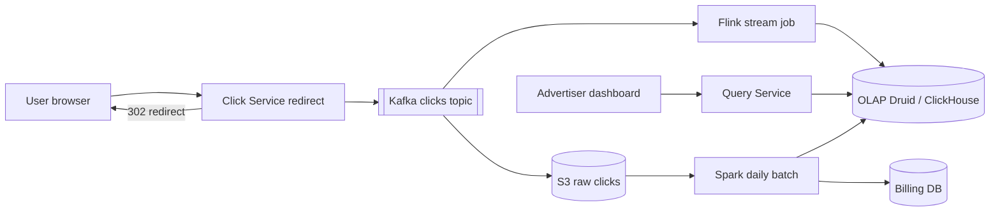
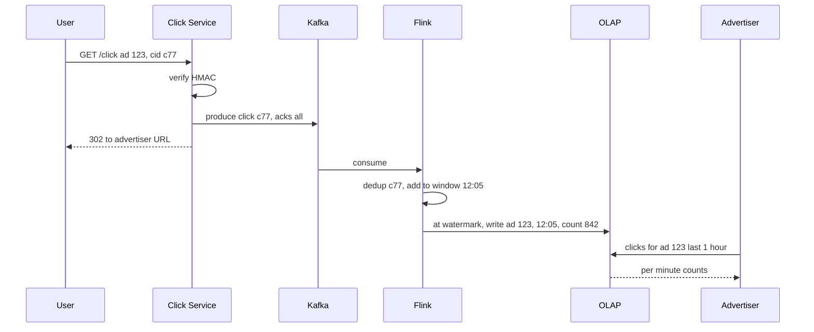

# Design Ad Click Aggregator

**Ek line me:** har ad click capture karo, advertiser site pe redirect karo, advertisers ko per-ad per-minute counts dikhao. Counts **billing** me jaate hain: galat count = galat paisa.

**Interviewer kya check karta hai:** ingestion, windows/watermarks, exactly-once, OLAP, batch reconciliation.

---

## Step 1: Interviewer se ye confirm karo (3–5 min)

| Tum poochho | Typical jawab | Design pe asar |
|---|---|---|
| "Clicks per second?" | ~10K avg, peak 50K | Kafka + stream processor, DB direct nahi |
| "Granularity?" | Per ad per minute + hour/day rollups | 1 min tumbling window |
| "Billing accuracy?" | Exact, 100% | Dedup + daily batch reconciliation |
| "Redirect bhi hum?" | Haan, hamare server se | Click server < 50ms |

> **Bolo:** "Do paths: streaming jo 1 min me dashboard update kare, aur raat ka batch jo raw se exact count karke reconcile kare. Billing batch numbers se."

## Step 2: Requirements

**Functional**
1. Users should be able to ad click karke advertiser URL pe redirect hon (click record ho)
2. Advertisers should be able to ad ke clicks per minute query karein (last 1 hour, ya hour/day rollup)
3. Advertisers should be able to campaign, country, device se filter karein
4. Advertisers should be able to campaign ke top N ads (last 1 hour) dekhein

**Out of scope:** impressions/CTR, ML fraud (basic `click_id` dedup in scope), ad serving/auction, invoice UI.

**Non-functional (priority order me)**
1. **Accuracy:** exactly-once count (billing), click kabhi lost nahi
2. **Latency:** redirect p99 < 50 ms; dashboard query p99 < 1 sec
3. **Freshness:** dashboard max ~1 min purana → streaming
4. **Scale:** 50K QPS peak, ~1B clicks/day, 1 saal retention

**CAP choice:** ingestion → availability (Kafka down ho to bhi redirect, local buffer); dashboard eventual (~1 min). Billing → strong, batch recount ke baad hi final.

## Step 3: Estimation (sirf jo design badle)

- 1B/day ≈ **12K QPS avg, 50K peak**. Har click pe `UPDATE count+1` = hot rows → pre-aggregation. Kafka 50K/sec se nahi, **replay + 2 consumers** se justify (Step 6).
- ~200 bytes/event → **200 GB/day** raw → S3; aggregates OLAP me.
- 10M ads × 1440 min = max 14B rows/day; sirf active ads → ~100M rows/day → OLAP store.

> **Bolo:** "1 min windows me aggregate: per ad per minute (country, device) ek row, 50K writes/sec → ~1K rows/sec."

## Step 4: Core entities

- **ClickEvent**: click_id (unique, impression time pe generated), ad_id, campaign_id, user_id, ip, country, device, ts
- **AdAggregate**: ad_id, minute_bucket, country, device, click_count
- **Ad**: ad_id, campaign_id, advertiser_id, target_url

## Step 5: APIs

```http
GET /click?ad=123&cid=<click_id>&sig=<hmac>   → 302 Location: advertiser URL
GET /ads/{adId}/clicks?from=..&to=..&granularity=minute&country=IN
                                              → [{minute, count}]
GET /campaigns/{id}/top-ads?window=1h&n=10    → [{adId, count}]
```

> **Bolo:** "`click_id` + HMAC ad serve pe bante hain: dedup bhi, aur fake URL se clicks inflate nahi."

## Step 6: High-level design

**Simple v1:** har click Postgres me, dashboard `GROUP BY ad_id, minute`; ~1K/sec tak ok. 50K/sec + 1B rows/day pe `GROUP BY` seconds → neeche ke components.



**Har component kyun:** (FR1 → Click Service + Kafka, FR2/FR3/FR4 → Flink + OLAP + Query Service; accuracy NFR → S3 + Spark)
- **Click Service:** stateless; Kafka write (acks=all), phir 302.
- **Kafka:** **2 consumers** (Flink, S3 sink) + **7 din replay** (Flink crash/bug fix pe recount). SQS: ek consumer, replay nahi.
- **Flink:** event-time windows, watermarks, exactly-once checkpoints.
- **OLAP:** ~100M rows/day pe slice-and-dice < 1 sec.
- **S3 + Spark:** sasta raw copy, raat ko exact recount = billing truth.
- **Query Service:** thin; rollup (minute/hour/day) chunta hai.

## Step 7: Main flow: click se dashboard tak



## Step 8: Data model & DB choice

```sql
-- OLAP (ClickHouse / Druid)
ad_clicks_1m(ad_id, campaign_id, minute_ts, country, device, clicks)
  PARTITION BY day, ORDER BY (ad_id, minute_ts)
-- rollups
ad_clicks_1h, ad_clicks_1d   -- materialized views
```

- **OLAP:** time + ad_id sorted, columnar, aggregates ms me.
- **S3 (Parquet):** raw clicks, 1 saal, batch ke liye.
- **Billing DB (Postgres):** daily final numbers per advertiser, invoices.

## Step 9: Deep dives (interviewer yahin pressure dalega)

### 9.1 Exactly-once counting
**NFR:** har click ek hi baar count.
1. **Double click / bot refresh:** Flink keyed state `seen(click_id)`, TTL 10 min.
2. **Click Service retry:** idempotent producer (`enable.idempotence=true`).
3. **Flink restart:** checkpoints (offset + window state saath) + `(ad_id, minute)` upsert sink → replay pe overwrite, double add nahi.
- Streaming me kuch slip ho to raat ka batch fix karega.
- **Trade-off:** dedup state + checkpoints = heavy job, slow restart; badle me billing safe.

### 9.2 Windows, late events aur watermarks
**NFR:** ~1 min freshness, sahi minute me count.
- **Tumbling 1 min**, **event time** (processing time nahi, warna Kafka lag pe galat minute).
- **Watermark** = `max_event_ts - 30 sec`; 12:06 cross → 12:05 window emit.
- **Late events:** `allowedLateness 5 min` tak upsert; usse late → side output → S3 → batch count.
- **Trade-off:** bada watermark = accurate par late dashboard; chhota = fresh par late events zyada.

### 9.3 Hot ad partitioning
**NFR:** ek viral ad poori pipeline lag na kare.
- Viral ad (IPL) 20K QPS → ek partition + ek Flink task overload.
- Key = `ad_id + random(0..N-1)` salt → partial count, phir stage 2 me `ad_id` pe sum.
- Salting sirf known hot ads pe (config ya dynamic detection).
- **Trade-off:** two-stage = thoda latency + code.

### 9.4 Batch reconciliation (Lambda style)
**NFR:** billing 100% accurate.
- Kafka → S3 (Kafka Connect, hourly Parquet).
- Raat ko **Spark:** `click_id` distinct, `ad_id, minute` group by = exact truth.
- Streaming se compare; farak > threshold → alert + OLAP overwrite. Billing hamesha batch se.
- Kappa? "Sirf Flink bhi chalega agar replay + exactly-once strong ho, par billing me double check sasta insurance."
- **Trade-off:** do pipelines, final billing next day.

## Step 10: Decision table (kya chuna, kyun, kya nahi)

| Decision | Kyun chuna | Kya nahi chuna, kyun |
|---|---|---|
| **Kafka** ingestion | 50K QPS, 2 consumers, 7 din replay | **Direct DB:** hot rows. **SQS:** ek consumer, no replay. Sacrifice: Kafka ops |
| **Flink** aggregation | Event-time windows, watermarks, exactly-once | **ClickHouse MVs:** dedup/late kamzor. **Spark micro-batch:** latency. Sacrifice: stateful job mushkil |
| **Tumbling 1 min** | Simple, dashboard granularity | **Sliding:** event kai windows me. Sacrifice: < 1 min nahi |
| **OLAP (ClickHouse/Druid/Pinot)** | ~100M rows/day group by < 1 sec | **Postgres:** slow. **Cassandra:** ad-hoc group by nahi. Sacrifice: updates mehnge, extra store |
| **Spark reconciliation** | Raw se exact truth | **Sirf Kappa:** bug = galat paisa, pata bhi nahi. Sacrifice: do pipelines, next-day billing |
| **click_id + HMAC** | Dedup + fake URLs se bachav | **IP + ad_id dedup:** NAT ke peeche asli clicks drop. Sacrifice: ad serving pe signing |
| **Salted keys** (hot ads) | Ek partition pe load nahi | **Har ad salt:** bekaar overhead. Sacrifice: hot list maintain |

## Step 11: Failures & bottlenecks

| Kya fail hua | Kya hoga | Handle kaise |
|---|---|---|
| Kafka slow / down | Click record nahi | Local disk buffer, redirect phir bhi; RF 3 |
| Flink crash | Dashboard ruka | Checkpoint se restart, offset replay, idempotent sink |
| OLAP down | Dashboard down | Sink backpressure, data Kafka me safe; stale cache dikhao |
| Hot ad | Ek task lag | Salting + two-stage |
| Bot click flood | Fake bill | Per IP/user rate limit, dedup, batch fraud filter before billing |

## Step 12: "Isko aur better kaise karein" (end me khud bolo)

- **Fraud stage** Flink me: 1 min me 20 clicks → flag
- **Real-time top-K:** Count-Min Sketch + heap
- **Retention tiers:** 1-min data 30 din, phir sirf hourly
- **Drift alert:** stream vs batch > 0.1% → page on-call

## Step 13: Interviewer ke likely follow-up sawal

- "Redirect se pehle Kafka ack ka wait kyun?" → billing data; ack ~5–10ms, budget me
- "1 din late event?" → streaming drop, batch count karega
- "End-to-end exactly-once?" → idempotent producer + checkpoint + upsert sink + click_id dedup
- "1 saal ka query?" → day rollup table se
- "Kappa vs Lambda?" → 9.4
- **Senior signal:** Kafka ack redirect ke critical path pe hai → Kafka slow = har redirect slow. Local disk buffer + timeout pe redirect; stream vs batch drift ko alert metric banao, warna billing galti chupchap.

## 2-minute recap (interview se pehle ye padho)

> Click Service signed `click_id` verify → Kafka (acks=all) → 302. Kafka `ad_id` partitioned (2 consumers + 7 din replay ke liye). Flink: event-time 1 min tumbling, watermark close, 5 min lateness, baaki side output. Exactly-once = dedup state + idempotent producer + checkpoints + `(ad_id, minute)` upsert. OLAP (ClickHouse/Druid) + hourly/daily rollups. Raw S3, raat ko Spark recount → OLAP + billing reconcile. Hot ads: salting + two-stage.

## Checklist

- [ ] Click → redirect → Kafka flow aur kyun ack ke baad redirect bata sakta hoon
- [ ] Tumbling window, event time aur watermark samjha sakta hoon
- [ ] Exactly-once ke 3 layers (dedup, checkpoint, idempotent sink) bata sakta hoon
- [ ] OLAP store kyun, Postgres kyun nahi bata sakta hoon
- [ ] Batch reconciliation (Lambda) ka role explain kar sakta hoon
- [ ] Hot ad ke liye salting aur two-stage aggregation bata sakta hoon
- [ ] Decision table ke 3 trade-offs bina dekhe bol sakta hoon
