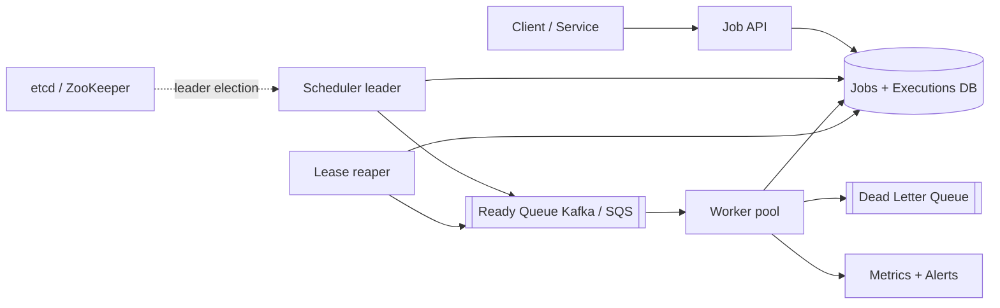
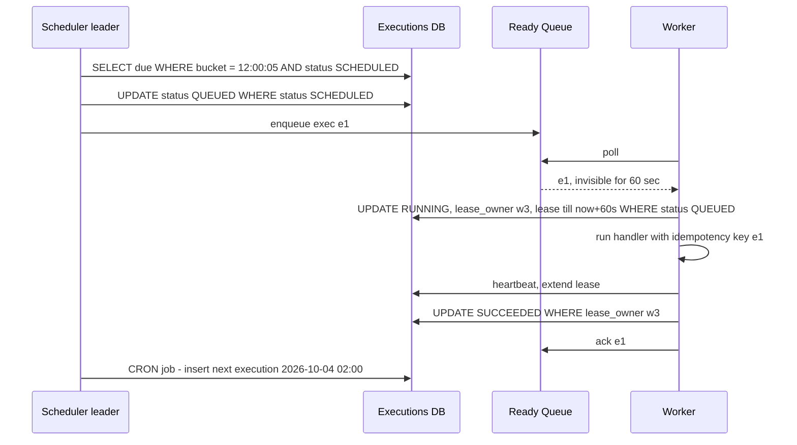

# Design Distributed Job Scheduler (Cron at Scale)

**Ek line me:** users jobs register karte hain (ek baar, delayed, ya cron jaise "har din 2 baje"), aur system unhe sahi time pe workers pe chalata hai, retries ke saath, bina miss kiye aur bina do baar chalaye (jitna possible ho).

**Is question me interviewer kya check karta hai:** due jobs ko efficiently kaise dhoondhoge, workers crash ho to job kaise recover hogi (leases), at-least-once + idempotency, retries/DLQ, aur scheduler khud single point of failure na bane.

---

## Step 1: Interviewer se ye confirm karo (3–5 min)

| Tum poochho | Typical jawab | Design pe asar |
|---|---|---|
| "Job types: one-time, delayed, recurring cron?" | Teeno | Recurring ke liye next_run compute karke naya execution |
| "Job khud kya hai? Code ya HTTP call?" | Container image / handler name + payload | Worker generic executor hai |
| "Time precision?" | ~1 sec delay chalega | Second-level buckets, ms nahi |
| "Exactly-once chahiye?" | At-least-once + idempotent jobs OK | Leases + retries, job idempotency key |
| "Scale?" | 10M jobs/day, peak 10K jobs/sec (midnight cron) | Time-bucketed partitioned table, scheduler sharding |
| "Job kitni lambi chalti hai?" | Seconds se 1 hour tak | Lease heartbeat chahiye |

> **Bolo:** "Main job definition aur job execution ko alag rakhunga. Scheduler sirf due executions ko queue me daalega, aur workers pull karke lease ke saath chalayenge. Guarantee at-least-once hogi, isliye jobs idempotent honi chahiye."

## Step 2: Requirements

**Functional**
1. Job create/update/delete: one-time, delayed (`run_at`), cron (`0 2 * * *`)
2. Due time pe job execute ho, payload ke saath
3. Fail hone pe retry with backoff, max retries ke baad DLQ
4. Job status aur execution history dekh sakein

**Non-functional**
- **Reliability:** koi due job miss nahi (durable)
- **Timeliness:** due time se < 2 sec me start
- **At-least-once** execution, duplicates rare
- **Scale:** 10M executions/day, midnight pe 10K/sec burst
- **HA:** scheduler ya worker crash pe system chalta rahe

## Step 3: Estimation (sirf jo design badle)

- 10M/day ≈ **120/sec avg**, par cron jobs round times pe (00:00, har ghante) → **10K/sec peak**. Burst design karna hai, average nahi.
- Job record ~1 KB → 10M executions/day ≈ 10 GB/day history. 30 din retain → 300 GB, partition by day.
- Due jobs query har second: `WHERE run_at <= now()` full table pe slow, isliye time-bucket index.

> **Bolo:** "Average load kuch nahi hai. Problem midnight burst aur ye guarantee hai ki crash pe job miss na ho aur do baar na chale."

## Step 4: Core entities

- **Job** (definition): job_id, owner, type (`ONCE`, `CRON`), cron_expr, handler, payload, max_retries, timeout
- **Execution** (har run): exec_id, job_id, scheduled_at, status (`SCHEDULED`, `QUEUED`, `RUNNING`, `SUCCEEDED`, `FAILED`, `DEAD`), attempt, lease_owner, lease_expires_at
- **Worker**: worker_id, capacity, last_heartbeat

## Step 5: APIs

```http
POST   /jobs {handler, payload, schedule: {cron | runAt | delaySec}, maxRetries, timeoutSec}
       Header: Idempotency-Key: <uuid>                 → {jobId}
GET    /jobs/{jobId}                                   → definition + next_run
DELETE /jobs/{jobId}                                   → 204
GET    /jobs/{jobId}/executions?limit=20               → history + status
POST   /executions/{execId}/heartbeat   (worker)       → extend lease
POST   /executions/{execId}/complete {status, output}  (worker)
```

## Step 6: High-level design



**Har component kyun:**
- **Job API:** definitions validate karta hai, pehla execution `scheduled_at` ke saath likhta hai.
- **DB (Postgres sharded / Cassandra):** durable source of truth for jobs aur executions.
- **Scheduler leader:** har second due executions uthata hai aur ready queue me daalta hai. Leader election se ek hi active per shard.
- **Ready Queue:** workers ke liye buffer, burst absorb, visibility timeout.
- **Workers:** pull, lease lo, chalao, heartbeat, complete.
- **Lease reaper:** expired leases wale executions ko wapas queue me.
- **DLQ:** max retries ke baad, manual inspection.

## Step 7: Main flow: due job se completion tak



## Step 8: Data model & DB choice

```sql
jobs(job_id PK, owner, type, cron_expr, handler, payload, max_retries, timeout_sec, enabled)
executions(exec_id PK, job_id, time_bucket, scheduled_at, status, attempt,
           lease_owner, lease_expires_at, last_error,
           UNIQUE(job_id, scheduled_at))
INDEX (shard_id, time_bucket, status)
```

- `time_bucket` = `scheduled_at` ko minute/second me round. Scheduler sirf current bucket padhta hai, poori table nahi.
- `UNIQUE(job_id, scheduled_at)`: same cron run do baar create nahi ho sakta, chahe do schedulers galti se chal jaayein.
- Chhote scale pe Postgres (conditional updates, `SKIP LOCKED`). Bahut bade scale pe Cassandra with partition key `(shard_id, time_bucket)`, jaisa Airbnb/Uber karte hain.

## Step 9: Deep dives (interviewer yahin pressure dalega)

### 9.1 Due jobs kaise dhoondhoge?
- **Time-bucketed table:** partition key `(shard, minute_bucket)`. Scheduler har second current bucket query kare. Index scan chhota, poori table kabhi nahi.
- **Alternative: Redis ZSET** `ZADD due <run_at_epoch> exec_id`, phir `ZRANGEBYSCORE due 0 now LIMIT 1000`. Fast hai, par Redis durability kamzor, isliye DB truth rakho aur Redis sirf next 1 hour ka index.
- **Delayed jobs** (jaise "30 min baad reminder") bhi same: `scheduled_at = now + delay`.
- **Cron:** execution complete (ya queue) hone pe next run cron expression se compute karke naya execution row insert. Timezone aur DST ka dhyaan.

### 9.2 Workers: pull, lease, visibility timeout
- Workers **pull** karte hain (push nahi), taaki apni capacity ke hisaab se lein.
- Queue (SQS) visibility timeout = lease. Worker crash → message wapas visible → doosra worker uthayega.
- Lambi jobs: worker har 20 sec **heartbeat** karke lease badhaye. Heartbeat ruka → lease expire → reaper re-queue.
- **Zombie worker** (network partition, purana worker abhi bhi chal raha): complete karte waqt `WHERE lease_owner = me AND attempt = n` check. Fencing token = attempt number. Purana worker ka result reject.
- Postgres-only design me queue ki jagah `SELECT ... FOR UPDATE SKIP LOCKED LIMIT 10` bhi chalta hai.

### 9.3 At-least-once, idempotency, retries, DLQ
- Crash/timeout pe job dobara chal sakti hai, isliye **exactly-once nahi, at-least-once**. Har run ko `exec_id` idempotency key ke roop me do. Job handler (jaise "send invoice") is key se dedup kare.
- Fail → `attempt++`, `scheduled_at = now + backoff` (exponential: 10s, 30s, 2m, 10m + jitter), status `SCHEDULED`.
- `attempt > max_retries` → `DEAD`, DLQ me, owner ko alert. DLQ se manual replay API.
- Job ka `timeout_sec` cross → worker kill kare, failed maan ke retry.

### 9.4 Scheduler HA aur scale
- Do schedulers same bucket uthayein to duplicate enqueue. Isliye **leader election** (etcd/ZooKeeper lease). Leader mara → 5–10 sec me naya leader, missed bucket catch-up kare (`bucket <= now AND status SCHEDULED`).
- Duplicate enqueue phir bhi ho jaaye to: `UPDATE ... SET status='QUEUED' WHERE status='SCHEDULED'` sirf ek jeetega, aur worker `WHERE status='QUEUED'` se claim karega.
- **Scale:** executions ko N shards me baanto (`hash(job_id) % N`). Har shard ka alag leader (consistent hashing se schedulers me assign). Midnight burst N schedulers me bant jaata hai.
- Midnight thundering herd: small random **jitter** (0–30 sec) un jobs pe jo exact time sensitive nahi.

## Step 10: Decision table (kya chuna, kyun, kya nahi)

| Decision | Kyun chuna | Kya nahi chuna, kyun |
|---|---|---|
| **Time-bucketed executions table** | Har second sirf chhota bucket scan, durable | **`WHERE run_at <= now()` full table:** table badi hone pe slow. **Sirf in-memory priority queue:** crash pe saare jobs gaye |
| **Workers pull + lease** | Backpressure natural, crash pe auto recovery | **Scheduler push to worker:** worker capacity pata nahi, crash detection mushkil |
| **At-least-once + idempotent jobs** | Practical aur achievable | **Exactly-once:** distributed system me crash ke beech guarantee nahi kar sakte, 2PC mehnga aur slow |
| **Leader election (etcd/ZK)** | Ek active scheduler per shard, duplicate kam | **Sab schedulers active bina coordination:** duplicate enqueue har bucket pe. **Single scheduler bina failover:** SPOF |
| **Queue (Kafka/SQS) between scheduler aur workers** | Burst absorb, visibility timeout built-in | **Workers seedha DB poll:** 1000 workers ka polling DB pe load, lock contention |
| **Exponential backoff + DLQ** | Downstream ko saans lene ka time, poison jobs alag | **Immediate retry loop:** failing downstream pe aur load, poison job queue block kare |
| **Fencing token (attempt) on complete** | Zombie worker ka purana result reject | **Sirf lease TTL:** GC pause ke baad purana worker galat status likh dega |

## Step 11: Failures & bottlenecks

| Kya fail hua | Kya hoga | Handle kaise |
|---|---|---|
| Scheduler leader crash | Due jobs queue me nahi ja rahe | Naya leader 10 sec me, missed buckets catch-up scan |
| Worker crash mid-job | Job adhoori | Lease expire, reaper re-queue, idempotency se safe retry |
| Midnight burst | Queue lag, jobs late | Shards + more schedulers, worker autoscale on queue depth, jitter |
| DB slow | Scheduling ruk gayi | Read replicas for history, partition by day, purana data archive |
| Poison job | Har baar crash | max_retries → DLQ, owner alert |
| Clock skew | Job jaldi/late | NTP, scheduling decision sirf leader ke clock / DB time se |

## Step 12: "Isko aur better kaise karein" (end me khud bolo)

> "Agar aur time ho to main ye improve karunga:"
- **Job dependencies (DAG)** jaise Airflow: job B tabhi chale jab A succeed ho
- **Priority queues**: critical jobs (payments) aur batch jobs (reports) alag queues
- **Per-tenant rate limits** taaki ek customer ke 1 lakh jobs baaki sab ko starve na karein
- Execution history ko 7 din baad **S3 me archive**, DB chhota
- **Observability:** schedule lag (actual start - scheduled_at) ka p99 dashboard aur alert

## Step 13: Interviewer ke likely follow-up sawal

- "Job do baar chal gayi to?" → at-least-once accept, handler `exec_id` se idempotent (Step 9.3)
- "1 hour ki job, worker beech me mar gaya?" → heartbeat ruka, lease expire, re-run. Lambi jobs checkpoint karein
- "Cron job ka previous run abhi chal raha hai aur next time aa gaya?" → policy: skip, queue, ya parallel allow. Job config me rakho
- "Leader election kaise?" → etcd lease / ZK ephemeral node, fencing ke saath
- "Delayed job 30 din baad?" → same table, bucket 30 din baad ka. Redis me nahi, DB me

## 2-minute recap (interview se pehle ye padho)

> Job definition aur execution alag. Har execution ek row: `scheduled_at`, `time_bucket`, status, lease. `UNIQUE(job_id, scheduled_at)` duplicate runs rokta hai. Scheduler leader (etcd/ZK se elected, har shard ka ek) har second current bucket ke due executions ko conditional update se `QUEUED` karke ready queue me daalta hai. Workers pull karte hain, lease lete hain (visibility timeout), heartbeat se badhate hain, aur complete pe fencing token check hota hai. Crash pe lease expire → reaper re-queue. Guarantee at-least-once, isliye `exec_id` idempotency key handlers ko. Fail pe exponential backoff + jitter, max retries ke baad DLQ. Cron ke liye next run compute karke naya row. Midnight burst ke liye sharding, worker autoscale aur jitter.

## Checklist

- [ ] Job definition vs execution model samjha sakta hoon
- [ ] Time-bucketed table se due jobs kaise milte hain bata sakta hoon
- [ ] Lease, heartbeat aur visibility timeout se crash recovery explain kar sakta hoon
- [ ] At-least-once kyun aur idempotency kaise bata sakta hoon
- [ ] Retries, backoff aur DLQ ka flow bata sakta hoon
- [ ] Scheduler leader election aur fencing token samjha sakta hoon
- [ ] Decision table ke 3 trade-offs bina dekhe bol sakta hoon
