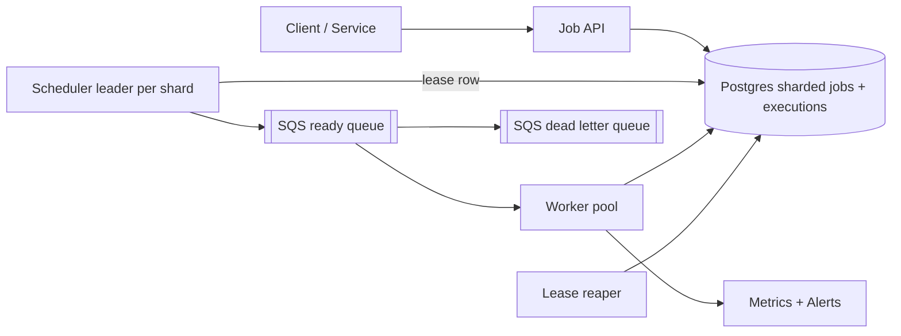
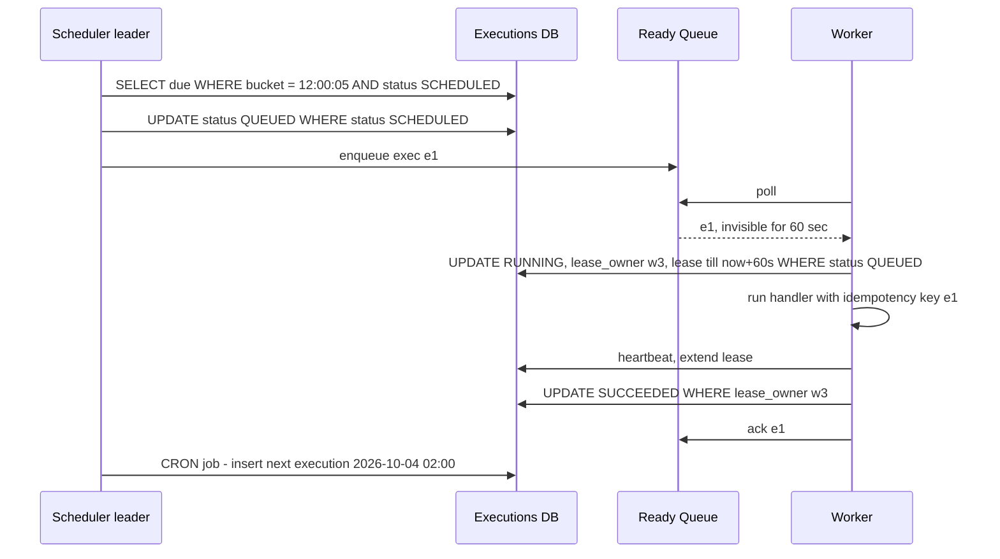

# Design Distributed Job Scheduler (Cron at Scale)

**Ek line me:** jobs (one-time, delayed, cron "har din 2 baje") sahi time pe workers pe chalao, retries ke saath, na miss, na (jitna ho sake) double.

**Interviewer kya check karta hai:** due jobs dhoondhna, crash recovery (leases), at-least-once + idempotency, retries/DLQ, scheduler SPOF nahi.

---

## Step 1: Interviewer se ye confirm karo (3–5 min)

| Tum poochho | Typical jawab | Design pe asar |
|---|---|---|
| "One-time, delayed, cron?" | Teeno | Cron: next_run compute → naya execution |
| "Job kya hai?" | Container image / handler + payload | Generic executor |
| "Time precision?" | ~1 sec chalega | Second-level buckets, ms nahi |
| "Exactly-once?" | At-least-once + idempotent OK | Leases + retries, idempotency key |
| "Scale?" | 10M jobs/day, peak 10K/sec (midnight) | Time-bucketed partitioned table, scheduler sharding |
| "Job duration?" | Seconds se 1 hour | Lease heartbeat |

> **Bolo:** "Job definition aur execution alag. Scheduler sirf due executions queue me daale, workers pull karke lease ke saath chalayein. At-least-once, isliye jobs idempotent."

## Step 2: Requirements

**Functional**
1. Users should be able to job create/update/delete karein: one-time, delayed (`run_at`), cron (`0 2 * * *`)
2. Users should be able to job due time pe payload ke saath chalti paayein
3. Users should be able to fail pe retry (backoff), max retries ke baad DLQ paayein
4. Users should be able to status aur execution history dekhein

**Out of scope:** job DAG/dependencies, job code build/deploy, multi-region active-active.

**Non-functional (priority order me)**
1. **Reliability:** due job miss nahi (durable), at-least-once, duplicates rare
2. **Timeliness:** due time se p99 < 2 sec me start
3. **HA:** 99.99%, scheduler/worker crash pe chalta rahe
4. **Scale:** 10M executions/day, midnight 10K/sec burst

**CAP choice:** scheduling → consistency: partition me scheduler ruke (job late) chalega, do schedulers ek bucket nahi → leader lease strongly consistent store me.

## Step 3: Estimation (sirf jo design badle)

- 10M/day ≈ **120/sec avg**, par cron round times pe (00:00, har ghanta) → **10K/sec peak**. Burst ke liye design.
- ~1 KB/record → 10 GB/day history; 30 din → 300 GB, partition by day.
- Har second `WHERE run_at <= now()` full table pe slow → time-bucket index.

> **Bolo:** "Average kuch nahi; problem midnight burst aur crash pe no miss, no double."

## Step 4: Core entities

- **Job** (definition): job_id, owner, type (`ONCE`, `CRON`), cron_expr, handler, payload, max_retries, timeout
- **Execution** (har run): exec_id, job_id, scheduled_at, status (`SCHEDULED`, `QUEUED`, `RUNNING`, `SUCCEEDED`, `FAILED`, `DEAD`), attempt, lease_owner, lease_expires_at
- **Worker**: worker_id, capacity, last_heartbeat

## Step 5: APIs

```http
POST   /jobs {handler, payload, schedule: {cron | runAt | delaySec}, maxRetries, timeoutSec}
       Header: Idempotency-Key: <uuid>                 → {jobId}
GET    /jobs/{jobId}                                   → definition + next_run
DELETE /jobs/{jobId}                                   → 204
GET    /jobs/{jobId}/executions?limit=20               → history + status
POST   /executions/{execId}/heartbeat   (worker)       → extend lease
POST   /executions/{execId}/complete {status, output}  (worker)
```

## Step 6: High-level design

**Simple v1:** Postgres + workers seedha `SELECT ... WHERE scheduled_at <= now() FOR UPDATE SKIP LOCKED LIMIT 10` poll; hazaar jobs/min tak kaafi. 10K/sec burst + ~1000 workers polling → scheduler + SQS; 40K writes/sec → shards.



**Har component kyun:** (FR1/FR4 → Job API + Postgres, FR2 → Scheduler + SQS + Workers, FR3 → backoff rows + DLQ)
- **Postgres, `hash(job_id)` sharded:** conditional updates (status, fencing) + `UNIQUE`. ~4 writes/execution × 10K/sec = 40K/sec → kuch shards.
- **Scheduler leader per shard:** har second current bucket ke due rows `QUEUED` → SQS. Leader **DB lease row** se (`UPDATE shard_leases SET owner=me, expires=now()+10s WHERE expires < now()`); Postgres strongly consistent hai, alag etcd/ZK nahi.
- **SQS (Kafka nahi):** task distribution → per-message visibility timeout (= lease), retries, DLQ built-in.
- **Lease reaper:** expired lease wale `RUNNING` rows → `SCHEDULED`.
- **DLQ:** SQS redrive, manual inspection.

## Step 7: Main flow: due job se completion tak



## Step 8: Data model & DB choice

```sql
jobs(job_id PK, owner, type, cron_expr, handler, payload, max_retries, timeout_sec, enabled)
executions(exec_id PK, job_id, time_bucket, scheduled_at, status, attempt,
           lease_owner, lease_expires_at, last_error,
           UNIQUE(job_id, scheduled_at))
INDEX (shard_id, time_bucket, status)
```

- `time_bucket` = `scheduled_at` minute/second me round; scheduler sirf current bucket padhe.
- `UNIQUE(job_id, scheduled_at)`: do schedulers galti se chalein tab bhi same cron run do baar nahi.
- Cassandra `(shard_id, time_bucket)` sirf lakhs writes/sec pe (Airbnb/Uber scale), 40K/sec pe nahi.

## Step 9: Deep dives (interviewer yahin pressure dalega)

### 9.1 Due jobs kaise dhoondhoge?
**NFR:** due time se < 2 sec.
- **Time-bucketed:** partition key `(shard, minute_bucket)`, har second chhota index scan.
- **Alt: Redis ZSET** `ZADD due <run_at_epoch> exec_id` + `ZRANGEBYSCORE due 0 now LIMIT 1000`: fast, durability kamzor → sirf next 1 hour ka index, DB truth.
- **Delayed:** `scheduled_at = now + delay`, same path.
- **Cron:** complete/queue pe next run ka naya row; timezone + DST.
- **Trade-off:** second-level polling = constant DB load, chhote buckets, ms precision nahi.

### 9.2 Workers: pull, lease, visibility timeout
**NFR:** worker crash pe job miss nahi.
- **Pull** (capacity se) + SQS visibility timeout = lease. Crash → message visible → doosra worker.
- Lambi jobs: har 20 sec **heartbeat**; ruka → expire → reaper re-queue.
- **Zombie worker:** complete pe `WHERE lease_owner = me AND attempt = n`; fencing token = attempt → purana result reject.
- **Trade-off:** chhoti lease = jaldi detect, zyada heartbeats; lambi = kam traffic, slow recovery.

### 9.3 At-least-once, idempotency, retries, DLQ
**NFR:** duplicates rare aur harmless.
- Crash/timeout → re-run, isliye **at-least-once**. `exec_id` = idempotency key, handler ("send invoice") dedup kare.
- Fail → `attempt++`, `scheduled_at = now + backoff` (10s, 30s, 2m, 10m + jitter), `SCHEDULED`.
- `attempt > max_retries` → `DEAD`, DLQ, owner alert, manual replay API.
- `timeout_sec` cross → kill, retry.
- **Trade-off:** idempotency ka bojh job author pe; system simple (2PC nahi).

### 9.4 Scheduler HA aur scale
**NFR:** no SPOF, midnight burst sambhle.
- Per-shard **leader election** (warna duplicate enqueue): Postgres lease row, 10 sec lease, 3 sec renew. Leader mara → ~10 sec me naya, catch-up `bucket <= now AND status SCHEDULED`. Bahut shards / slow DB failover → etcd/ZooKeeper.
- Duplicate phir bhi: `UPDATE ... SET status='QUEUED' WHERE status='SCHEDULED'` ek jeetega; worker `WHERE status='QUEUED'` se claim.
- **Scale:** N shards, leaders consistent hashing se schedulers pe → burst N me bant jaata hai.
- Thundering herd: non-critical jobs pe 0–30 sec **jitter**.
- **Trade-off:** failover ke ~10 sec shard ke jobs late (consistency > availability).

## Step 10: Decision table (kya chuna, kyun, kya nahi)

| Decision | Kyun chuna | Kya nahi chuna, kyun |
|---|---|---|
| **Time-bucketed sharded Postgres** | Chhota scan, durable, conditional updates | **Full scan:** slow. **In-memory PQ:** crash = loss. **Cassandra:** LWT slow. Sacrifice: sharding ops, cross-shard queries |
| **Workers pull + lease** | Natural backpressure, auto recovery | **Push to worker:** capacity pata nahi, crash detect mushkil |
| **At-least-once + idempotent** | Practical, achievable | **Exactly-once:** crash ke beech guarantee nahi, 2PC mehnga |
| **Postgres lease row leader** | Ek scheduler per shard, naya cluster nahi | **etcd/ZK:** robust par ek aur cluster. **No coordination:** duplicates. Sacrifice: ~10 sec failover, DB failover pe leader atke |
| **SQS ready queue** | Burst, visibility timeout, retries, DLQ | **Kafka:** per-message ack nahi, replay bekaar. **DB poll:** 1000 workers = lock contention. Sacrifice: no ordering, extra hop |
| **Exponential backoff + DLQ** | Downstream ko saans, poison jobs alag | **Immediate retry:** failing downstream pe load, poison job queue block |
| **Fencing token (attempt)** | Zombie ka purana result reject | **Sirf lease TTL:** GC pause ke baad galat status |

## Step 11: Failures & bottlenecks

| Kya fail hua | Kya hoga | Handle kaise |
|---|---|---|
| Scheduler leader crash | Due jobs queue me nahi | 10 sec me naya leader, catch-up scan |
| Worker crash mid-job | Job adhoori | Lease expire, reaper re-queue, idempotent retry |
| Midnight burst | Queue lag, jobs late | Shards, schedulers, queue-depth autoscale, jitter |
| DB slow | Scheduling ruki | History read replicas, day partitions, archive |
| Poison job | Har baar crash | max_retries → DLQ, owner alert |
| Clock skew | Jaldi/late | NTP; decision sirf leader / DB time se |

## Step 12: "Isko aur better kaise karein" (end me khud bolo)

- **DAG dependencies** (Airflow jaisa): B tabhi jab A succeed
- **Priority queues:** payments vs reports alag
- **Per-tenant rate limits:** ek customer ke 1 lakh jobs baaki ko starve na karein
- **Schedule lag** (start - scheduled_at) p99 dashboard + alert

## Step 13: Interviewer ke likely follow-up sawal

- "Job do baar chali?" → at-least-once accept, handler `exec_id` se idempotent (9.3)
- "1 hour job, worker mara?" → heartbeat ruka, lease expire, re-run; lambi jobs checkpoint karein
- "Previous cron run chal raha, next aa gaya?" → skip / queue / parallel, job config me
- "Leader election?" → Postgres lease row (bade setup me etcd lease / ZK ephemeral node) + fencing
- "30 din baad delayed job?" → same table, future bucket; DB me, Redis nahi
- **Senior signal:** asli risk midnight pe **schedule lag**. p99 metric, queue depth pe autoscale, non-critical jitter, Postgres primary failover ko leader lease timing se align.

## 2-minute recap (interview se pehle ye padho)

> Definition vs execution alag; execution row = `scheduled_at`, `time_bucket`, status, lease; `UNIQUE(job_id, scheduled_at)`. Sharded Postgres. Per-shard leader (Postgres lease row) har second due rows conditional update se `QUEUED` → SQS (task distribution, Kafka nahi). Workers pull, lease (visibility timeout), heartbeat, complete pe fencing check; crash → reaper re-queue. At-least-once → `exec_id` idempotency key. Backoff + jitter, phir DLQ. Cron: next run ka naya row. Burst: sharding, autoscale, jitter.

## Checklist

- [ ] Job definition vs execution model samjha sakta hoon
- [ ] Time-bucketed table se due jobs kaise milte hain bata sakta hoon
- [ ] Lease, heartbeat aur visibility timeout se crash recovery explain kar sakta hoon
- [ ] At-least-once kyun aur idempotency kaise bata sakta hoon
- [ ] Retries, backoff aur DLQ ka flow bata sakta hoon
- [ ] Scheduler leader election aur fencing token samjha sakta hoon
- [ ] Decision table ke 3 trade-offs bina dekhe bol sakta hoon
