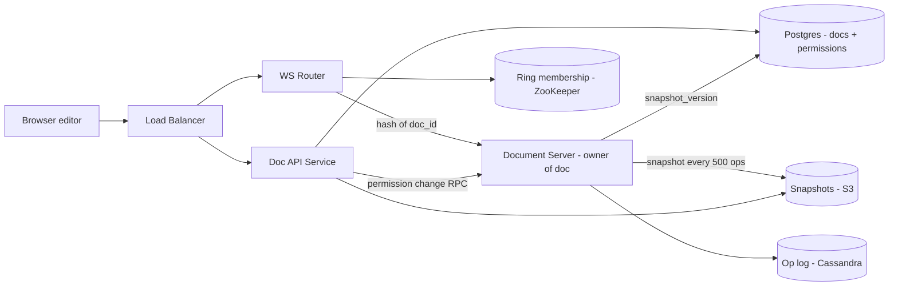
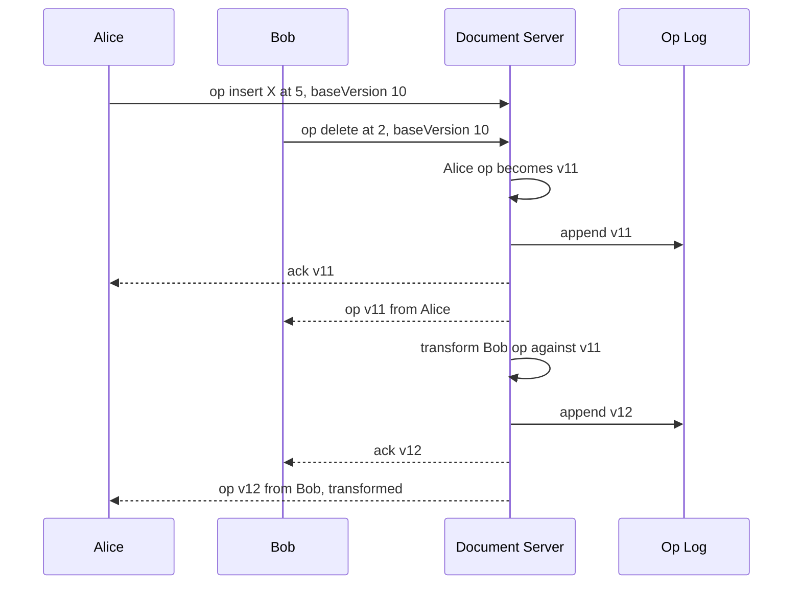

# Design Google Docs (Collaborative Editing)

**Ek line me:** kai log ek doc ek saath edit karein, changes ~100ms me sabko dikhein, aur end me **sabke paas exactly same document** ho.

**Is question me interviewer kya check karta hai:** concurrent edit conflicts (OT vs CRDT), WebSocket routing, document history/storage.

---

## Step 1: Interviewer se ye confirm karo (3–5 min)

| Tum poochho | Typical jawab | Design pe asar |
|---|---|---|
| "Sirf text docs? Sheets/Slides?" | Sirf rich text | Ek data model: characters + formatting |
| "Ek doc pe max kitne editors?" | ~100 editors, 1000 viewers | Ek doc ek server pe fit |
| "Edits kitni jaldi dikhein?" | < 200ms | WebSocket, polling nahi |
| "Offline editing?" | Haan, basic | Client pending ops queue + reconnect pe rebase |
| "Version history, cursors/presence?" | Haan | Op log + snapshots, presence alag ephemeral channel |

> **Bolo:** "Focus real-time concurrent editing pe: changes jaldi dikhein, sab ek state pe converge karein. Saath me presence, history, permissions."

## Step 2: Requirements

**Functional**
1. Doc create, open, edit, share (owner / editor / viewer)
2. Ek doc ko ek saath edit karna, changes live dikhna
3. Doosron ke cursors aur "kaun online hai"
4. Version history dekhna aur purana version restore karna

**Out of scope:** comments, suggestions mode, PDF export, Sheets/Slides.

**Non-functional (priority order)**
1. **Convergence:** sab clients end me exactly same doc dekhein
2. **Durability:** acknowledged edit kabhi lose na ho (0 acked-op loss)
3. **Latency:** p99 edit propagation < 200ms (same region), doc open p99 < 1s
4. **Availability:** 99.9% doc open. Owner server down → failover < 5s
5. **Scale:** 100M DAU, ~10M concurrent WebSockets, ek doc pe ≤ 100 editors + 1000 viewers

**CAP choice:** doc edits → **consistency** (ek owner order de; partition me purane owner ke writes reject, edits rukte hain par diverge nahi). Presence + offline local edits → **availability** (eventual).

## Step 3: Estimation (sirf jo design badle)

- 100M DAU, peak ~10M docs open → **~10M concurrent WebSockets**. ~50K connections/server → **~200+ WebSocket servers**.
- Active editor ~2–5 ops/sec. 10M editors → **~20–50M ops/sec** total, par per doc sirf kuch hundred ops/sec.
- Op ~100 bytes. Busy doc ka log mahine me MBs → **snapshots** chahiye, load pe poora log replay nahi.

> **Bolo:** "Total ops bahut, per-doc load chhota. Isliye document = unit of sharding: ek doc ka traffic ek server pe."

## Step 4: Core entities

- **Document**: doc_id, title, owner_id, latest_snapshot_version, created_at
- **Operation**: doc_id, version (monotonic), user_id, op (insert/delete/format at position), timestamp
- **Snapshot**: doc_id, version, full content (blob)
- **Permission**: doc_id, user_id, role (`OWNER`, `EDITOR`, `VIEWER`)
- **Presence** (ephemeral): doc_id, user_id, cursor position, color

## Step 5: APIs

```http
POST /docs                               → {docId}
GET  /docs/{docId}                        → {snapshot, version}
GET  /docs/{docId}/history?before=v500    → list of versions
POST /docs/{docId}/restore {version}      → new version
POST /docs/{docId}/share {userId, role}

WS   /docs/{docId}/live
  client → server: {type: "op", baseVersion: 120, op: {insert "a" at 15}}
  server → client: {type: "ack", version: 121}
  server → client: {type: "op", version: 122, op: {...}, userId}
  client ↔ server: {type: "cursor", pos: 40}
```

> **Bolo:** "Har op ke saath client `baseVersion` bhejta hai. Isse server jaanta hai beech ke kaunse ops miss hue aur kis ke against transform karna hai."

## Step 6: High-level design

**Simple v1:** client → ek Doc Service (WebSocket) → ek Postgres `operations` table + broadcast. FRs pure. Kahan tootega:
- **10M WebSockets** ek server pe nahi → ~200 servers + doc_id routing
- **20–50M ops/sec** ek Postgres nahi → Cassandra op log
- Lamba log replay slow → S3 snapshots



**Har component kyun:**
- **WS Router:** consistent hashing se `doc_id` → ek Document Server; saare editors **same server** pe. Round-robin → cross-server pub/sub + distributed ordering.
- **Document Server:** doc ka single owner. Order, OT transform, version, broadcast. **Presence bhi yahin memory me** (saare editors yahin), Redis nahi chahiye.
- **ZooKeeper/etcd:** ring membership + owner lease/epoch → "ek doc = ek owner". Static config se failover nahi.
- **Op log (Cassandra):** **20–50M appends/sec**, `doc_id` partition, `version` clustering key. Postgres → bahut manual sharding.
- **Snapshots (S3):** doc already memory me → owner har 500 ops pe async S3 me likhe + `snapshot_version` update. **Kafka nahi**: ek producer/consumer, replay nahi.
- **Postgres:** doc metadata + permissions. Chhota, relational, strong consistency.

**FR → component:** FR1 → Doc API + Postgres, FR2 → WS Router + Document Server + Cassandra, FR3 → Document Server memory, FR4 → S3 snapshots + Cassandra op log.

## Step 7: Main flow: do log ek saath type karte hain



Client bhi incoming ops pe same transform karta hai.

## Step 8: Data model & DB choice

```sql
-- Cassandra
operations(doc_id, version, user_id, op_blob, ts, PRIMARY KEY (doc_id, version))

-- Postgres
documents(doc_id PK, title, owner_id, snapshot_version, snapshot_url, updated_at)
permissions(doc_id, user_id, role, PRIMARY KEY (doc_id, user_id))
```

Doc load: S3 se latest snapshot + Cassandra se `WHERE doc_id = ? AND version > snapshot_version` → sirf kuch hundred ops replay.

## Step 9: Deep dives (interviewer yahin pressure dalega)

### 9.1 OT vs CRDT: conflict kaise resolve karoge?
**NFR: convergence.**

Problem: doc "CAT". Alice position 0 pe "S" daale ("SCAT"), Bob ek saath position 2 ("T") delete kare. As-is apply → "SCT" (galat). Sahi: "SCA".
- **OT (Operational Transformation):** server order kare, late op ko pehle ke ops ke against shift kare: "delete at 2" → "delete at 3". Idea: **position adjust karo**.
- **CRDT:** har char ka unique ID (`userId + counter`), position ID se, index se nahi. Kisi bhi order me merge → same result, central server nahi.

**OT chunte hain:** central owner ordering deta hai, data chhota (text + ops). CRDT → per-char metadata + tombstones, memory 2–10x.

> **Bolo:** "Google Docs OT + central server use karta hai. Central server se OT ka hard part simple ho jaata hai: sirf client-server transform chahiye."

**Trade-off:** OT light par central server pe depend. Heavy P2P/offline-first (Figma, Notion jaise kuch cases) → CRDT.

### 9.2 Document server ownership aur failover
**NFR: durability (acked op lose nahi) + failover < 5s.**

- Owner (`hash(doc_id)`, ring ZooKeeper/etcd me) memory me doc state + version rakhta hai.
- Server down → naya owner snapshot + op log se rebuild (kuch hundred ms); clients un-acked ops `baseVersion` ke saath resend.
- Op log write **ack se pehle** → acked op kabhi lose nahi.
- Op log write me owner **epoch** check (Cassandra LWT / conditional write) → purana owner zinda ho to bhi writes reject.

**Trade-off:** failover me kuch second edits rukte hain (consistency > availability), doc diverge nahi hota.

### 9.3 Offline edits
**NFR: availability (offline bhi edit) + convergence.**

- Client pending ops ki local queue (IndexedDB); offline me local apply.
- Reconnect: `baseVersion` ke baad ke ops lo → pending ops transform → bhejo. Bahut purane edits (1 hafta) → "conflicting changes" dikhao.

**Trade-off:** offline jitna lamba, rebase utna mehenga aur result utna surprising.

### 9.4 Cursors, presence aur version history
**NFR: p99 < 200ms bina op log bhare.**

- **Cursors:** same WebSocket, **op log me nahi**, throttle ~50ms. "Online users" = owner pe open connections. Crash → reconnect pe presence resend.
- **Version history:** snapshots + ops se koi bhi version. UI me 5-min edit groups, har op nahi. Restore = purana content naye ops ke roop me (history delete nahi).
- **Permissions:** connect pe check + server cache; viewer ops reject. Change → Doc API owner ko RPC → connection downgrade. RPC miss → cache 60s TTL pe refresh.

## Step 10: Decision table (kya chuna, kyun, kya nahi)

| Decision | Kyun chuna | Kya nahi chuna, kyun |
|---|---|---|
| **OT + central server** | Server ordering, data chhota, proven | **CRDT:** memory 2–10x. Sacrifice: owner dependency, true P2P nahi |
| **WebSocket** | Bi-directional, low latency | **Polling:** bahut requests. **SSE:** sirf server → client. Sacrifice: sticky connections, deploy pe reconnect storm |
| **Ek doc = ek owner (hashing + ZooKeeper lease)** | Simple ordering, in-memory state, no lock | **Koi bhi server:** har op pe lock/DB ordering. Sacrifice: failover me kuch second edit-unavailable, ZooKeeper chalana |
| **Cassandra** for op log | 20–50M appends/sec, doc_id partition, linear scale | **Postgres:** manual sharding. **Kafka as store:** per-doc range read awkward. Sacrifice: no joins, epoch check LWT (slower write) |
| **Snapshots S3 me, owner khud likhe** | State memory me, ek hop kam | **Kafka + Snapshot Worker:** extra infra. Sacrifice: owner pe thoda CPU |
| **Presence owner memory me** | Editors same server, cursors temporary | **Redis:** hop + cost. **Op log me:** history ganda. Sacrifice: crash pe reconnect tak gayab |
| **Postgres** for metadata + permissions | Chhota, relational, strong consistent | **Cassandra/DynamoDB:** sharing queries, transactions mushkil. Sacrifice: single-primary, read replicas |

## Step 11: Failures & bottlenecks

| Kya fail hua | Kya hoga | Handle kaise |
|---|---|---|
| Crash / split brain | Editors disconnect, do owners | 9.2 dekho: rebuild + resend, epoch fencing |
| Viral doc (10K viewers) | Ek server pe broadcast load | Viewers read-only fan-out tier pe, editors owner pe |
| Op log lamba | Load slow | 500-op snapshots, purane ops cold storage |
| S3 snapshot write fail | Load thoda slow, data safe | Op log source of truth; agle 500 ops pe retry, tab tak purana snapshot + zyada ops replay |
| Client bug, galat transform | Client doc diverge | Periodic checksum; mismatch pe fresh snapshot reload |

## Step 12: "Isko aur better kaise karein" (end me khud bolo)

> "Agar aur time ho to main ye improve karunga:"
- **Multi-region:** owner us region me jahan zyada editors; editors shift ho to migrate
- **Op compaction:** "a", "b", "c" inserts ko ek op me merge, log chhota
- **Comments/suggestions:** text-range anchor, OT ke saath shift
- **End-to-end checksum** har N ops pe, silent divergence turant pakdo

## Step 13: Interviewer ke likely follow-up sawal

- "Do log same jagah ek saath type karein?" → server pe pehle aaya op pehle; tie pe userId se deterministic order
- "Crash pe edits lose?" → acked log me; un-acked client resend
- "10 lakh log ek doc dekhein?" → viewers ke liye read-only fan-out + CDN snapshot, editors limited
- "Undo?" → apne last op ka inverse naye op ki tarah bhejo (transform ke saath)
- "Kafka kyun nahi?" → ek consumer, replay nahi. Kai consumers (analytics, search) aayein tab Kafka
- **Senior signal:** khud bolo ki single owner hi bottleneck aur risk hai: failover me split brain (epoch fencing on Cassandra writes) aur deploy/ring rebalance pe lakhon WebSockets ka reconnect storm (graceful drain + jittered reconnect)

## 2-minute recap (interview se pehle ye padho)

> `hash(doc_id)` se har doc ka ek owner Document Server; editors WebSocket se wahin. Op `baseVersion` ke saath aata hai; server order + OT transform, Cassandra append (20–50M ops/sec), ack, broadcast. OT kyunki central ordering hai, CRDT ka memory overhead nahi. Owner har 500 ops pe S3 snapshot (Kafka nahi). History = snapshot + ops. Presence owner memory me (Redis nahi). Offline → client queue, reconnect pe rebase. Crash → naya owner log se rebuild; fencing token split brain roke.

## Checklist

- [ ] OT ka "CAT" wala example position adjust karke samjha sakta hoon
- [ ] OT vs CRDT ka farak aur OT kyun chuna bata sakta hoon
- [ ] Doc_id se owner server ka routing (consistent hashing) explain kar sakta hoon
- [ ] HLD diagram 5 min me bana sakta hoon
- [ ] Op log + snapshot se doc load aur version history samjha sakta hoon
- [ ] Server crash aur offline edits ka recovery flow bata sakta hoon
- [ ] Decision table ke 3 trade-offs bina dekhe bol sakta hoon
