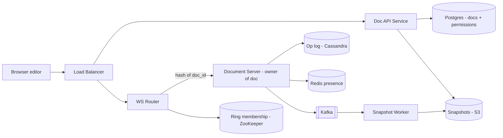
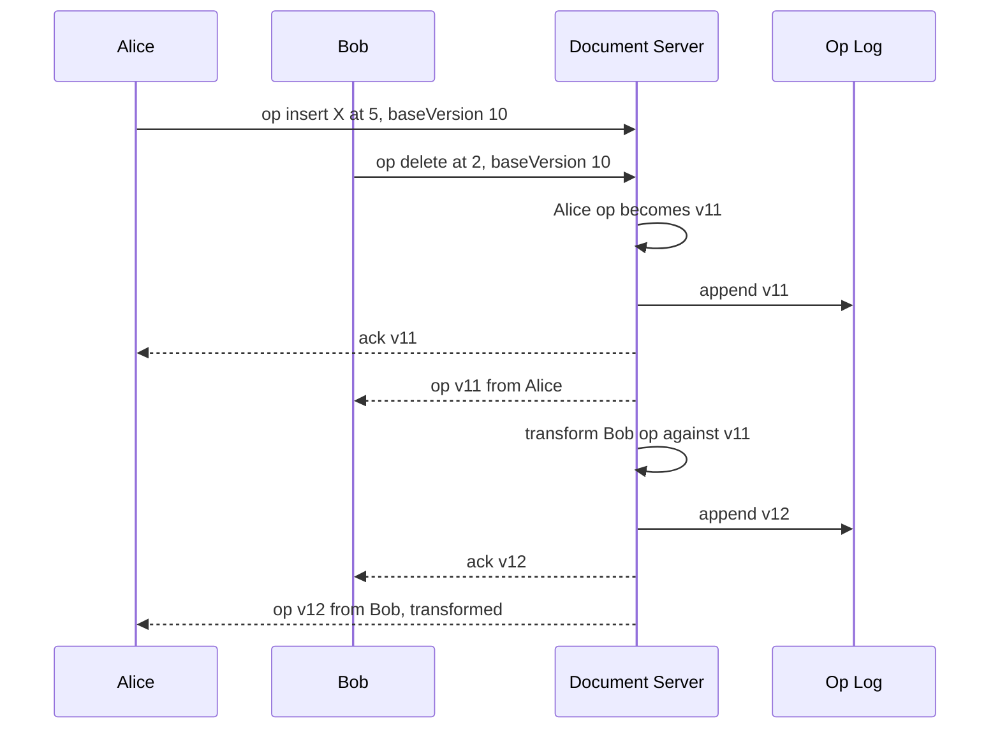

# Design Google Docs (Collaborative Editing)

**Ek line me:** kai log ek hi document ko ek saath edit karte hain, sabko ek doosre ke changes ~100ms me dikhte hain, aur aakhir me **sabke paas exactly same document** hota hai.

**Is question me interviewer kya check karta hai:** concurrent edits ka conflict kaise resolve karoge (OT vs CRDT), WebSocket connections ko kaise route karoge, aur document history/storage kaise rakhoge.

---

## Step 1: Interviewer se ye confirm karo (3–5 min)

| Tum poochho | Typical jawab | Design pe asar |
|---|---|---|
| "Sirf text documents? Sheets/Slides scope me nahi?" | Sirf rich text | Ek hi data model: characters + formatting |
| "Ek document pe max kitne log ek saath edit karte hain?" | ~100 editors, 1000 viewers tak | Ek doc ek server pe fit ho jayega |
| "Edits kitni jaldi dusron ko dikhne chahiye?" | < 200ms | WebSocket chahiye, polling nahi |
| "Offline editing chahiye?" | Haan, basic | Client pe pending ops queue + reconnect pe rebase |
| "Version history aur cursors/presence chahiye?" | Haan | Op log + snapshots, presence alag ephemeral channel |
| "Comments, suggestions mode, export to PDF?" | Out of scope | Mention karke chhod do |

> **Bolo:** "Main focus karunga real-time concurrent editing pe: har editor ka change sabko jaldi dikhe, aur sab ek hi final state pe converge karein. Iske saath presence, version history aur permissions."

## Step 2: Requirements

**Functional**
1. Document create, open, edit karna
2. Multiple users ek saath edit karein aur ek doosre ke changes live dekhein
3. Doosre users ke cursors aur "kaun online hai" dikhe
4. Version history dekh sakein aur purana version restore kar sakein
5. Sharing: owner / editor / viewer permissions

**Non-functional**
- **Convergence:** sab clients aakhir me same document dekhein (sabse important)
- **Low latency:** edit propagation < 200ms
- **Durability:** acknowledged edit kabhi lose na ho
- **Availability:** doc open hona chahiye. Ek doc ka server down ho to jaldi failover

## Step 3: Estimation (sirf jo design badle)

- 100M DAU, peak pe ~10M documents open → **~10M concurrent WebSockets**. Ek server ~50K connections → **~200+ WebSocket servers**.
- Typing: ek active editor ~2–5 ops/sec. 10M active editors → **~20–50M ops/sec** total, par har doc pe sirf kuch hundred ops/sec. Isliye **per-doc** load chhota hai, total bada.
- Ek op ~100 bytes. Ek busy doc ka op log mahine me MBs me jaata hai, isliye **snapshots** chahiye taaki load ke time poora log replay na karna pade.

> **Bolo:** "Total ops bahut zyada hain, par ek document ka load chhota hai. Isliye main document ko unit of sharding banaunga: ek doc ka saara traffic ek server pe."

## Step 4: Core entities

- **Document**: doc_id, title, owner_id, latest_snapshot_version, created_at
- **Operation**: doc_id, version (monotonic), user_id, op (insert/delete/format at position), timestamp
- **Snapshot**: doc_id, version, full content (blob)
- **Permission**: doc_id, user_id, role (`OWNER`, `EDITOR`, `VIEWER`)
- **Presence** (ephemeral): doc_id, user_id, cursor position, color

## Step 5: APIs

```http
POST /docs                               → {docId}
GET  /docs/{docId}                        → {snapshot, version}
GET  /docs/{docId}/history?before=v500    → list of versions
POST /docs/{docId}/restore {version}      → new version
POST /docs/{docId}/share {userId, role}

WS   /docs/{docId}/live
  client → server: {type: "op", baseVersion: 120, op: {insert "a" at 15}}
  server → client: {type: "ack", version: 121}
  server → client: {type: "op", version: 122, op: {...}, userId}
  client ↔ server: {type: "cursor", pos: 40}
```

> **Bolo:** "Har op ke saath client apna `baseVersion` bhejta hai, yaani kis version pe dekh ke edit kiya. Server isi se pata lagata hai ki beech me kaunse ops miss hue aur transform karna hai."

## Step 6: High-level design



**Har component kyun:**
- **WS Router:** `doc_id` ko consistent hashing se ek Document Server pe map karta hai. Same doc ke saare editors **same server** pe aate hain.
- **Document Server:** us doc ka single owner. Ops ko order karta hai, OT transform karta hai, version number deta hai, aur sabko broadcast karta hai.
- **Op log (Cassandra):** append-only, `doc_id` partition, `version` clustering key. Write-heavy aur sequential, Cassandra best fit.
- **Snapshot Worker:** har N ops (jaise 500) pe full document snapshot S3 me likhta hai.
- **Postgres:** doc metadata aur permissions. Relational, chhota, strong consistency chahiye.
- **Redis presence:** cursors aur online users. Ephemeral, TTL ke saath.

## Step 7: Main flow: do log ek saath type karte hain



Bob ka op `baseVersion 10` pe tha par server pe ab v11 hai. Server Bob ke op ko Alice ke op ke against **transform** karta hai, fir apply karta hai. Client side pe bhi same transform hota hai incoming ops ke liye.

## Step 8: Data model & DB choice

```sql
-- Cassandra
operations(doc_id, version, user_id, op_blob, ts, PRIMARY KEY (doc_id, version))

-- Postgres
documents(doc_id PK, title, owner_id, snapshot_version, snapshot_url, updated_at)
permissions(doc_id, user_id, role, PRIMARY KEY (doc_id, user_id))
```

Doc load: latest snapshot S3 se lo + uske baad ke ops Cassandra se `WHERE doc_id = ? AND version > snapshot_version`. Bas kuch hundred ops replay karne padte hain.

## Step 9: Deep dives (interviewer yahin pressure dalega)

### 9.1 OT vs CRDT: conflict kaise resolve karoge?
Problem: doc "CAT". Alice position 0 pe "S" daalti hai ("SCAT"). Bob ek saath position 2 ("T") delete karta hai. Agar Bob ka op as-is apply kiya to "SCT" ban jayega, galat. Sahi hai "SCA".
- **OT (Operational Transformation):** server ops ko ek order me lagata hai. Late op ko pehle aaye ops ke against shift karta hai. Bob ka "delete at 2" → Alice ne pehle 1 char daala, to "delete at 3". Simple idea: **position adjust karo**.
- **CRDT:** har character ko unique ID milti hai (jaise `userId + counter`) aur position ID se decide hoti hai, index se nahi. Koi bhi order me merge karo, result same. Central server ki zarurat nahi.

**Hum OT chunte hain** kyunki humare paas har doc ka central owner server hai jo ordering de deta hai. OT ka data chhota rehta hai (plain text + ops). CRDT me har character ke saath metadata aur tombstones, memory 2–10x. CRDT tab chuno jab peer-to-peer ya offline-first bahut heavy ho (Figma, Notion jaise kuch cases).

> **Bolo:** "Google Docs khud OT use karta hai central server ke saath. Central server hone se OT ka hard part (sab orderings ke liye transform sahi rakhna) simple ho jaata hai, kyunki sirf client-server transform chahiye."

### 9.2 Document server ownership aur failover
- Consistent hashing ring (ZooKeeper/etcd me membership). `hash(doc_id)` → owner server. Saare editors wahin connect hote hain.
- Owner server memory me doc ka current state + version rakhta hai.
- Server mar gaya → ring update, doc naye server pe chala jaata hai. Naya server snapshot + op log se state rebuild karta hai (kuch hundred ms). Clients reconnect karke apne un-acked ops `baseVersion` ke saath dobara bhejte hain.
- Op log me write **ack se pehle** hota hai. Isliye acked op kabhi lose nahi hota.

### 9.3 Offline edits
- Client pending ops ki local queue rakhta hai (IndexedDB). Offline me local apply hota rehta hai.
- Reconnect pe: server se `baseVersion` ke baad ke saare ops lo, apne pending ops ko unke against transform karo, fir bhejo. Bahut purane offline edits (jaise 1 hafta) ho to conflict zyada, user ko "conflicting changes" dikhao.

### 9.4 Cursors, presence aur version history
- **Cursors:** same WebSocket pe `cursor` messages, par **op log me nahi** jaate. Throttle karo (~50ms). Redis me TTL 30s ke saath "online users".
- **Version history:** snapshots + ops se kisi bhi version ko rebuild kar sakte hain. UI me har op nahi, balki "5 min ke edits ka group" dikhao. Restore = purana content naye ops ke roop me apply karna (history delete nahi hoti).
- **Permissions:** WebSocket connect ke time check karo aur server pe cache karo. Viewer ke ops server reject kare. Permission change pe Kafka event → document server connection downgrade kare.

## Step 10: Decision table (kya chuna, kyun, kya nahi)

| Decision | Kyun chuna | Kya nahi chuna, kyun |
|---|---|---|
| **OT + central server** | Ordering server deta hai, data chhota, proven (Google Docs) | **CRDT:** har char pe ID + tombstones, memory zyada. Central server hai to iska main fayda (no coordinator) chahiye hi nahi |
| **WebSocket** | Bi-directional, low latency, ops + cursors dono | **Polling:** 200ms latency ke liye bahut requests. **SSE:** sirf server → client, edits bhejne ke liye alag HTTP chahiye |
| **Ek doc = ek owner server (consistent hashing)** | Ordering simple, in-memory state, no distributed lock | **Koi bhi server koi bhi doc:** har op pe distributed lock ya DB se ordering, slow |
| **Op log + snapshots** | History free me milti hai, fast load, durable | **Sirf latest doc save karna:** history nahi, aur har keystroke pe poora doc rewrite mehenga |
| **Cassandra** for op log | Append-heavy, partition by doc_id, linear scale | **Postgres:** itne ops/sec ke liye bahut sharding karni padegi. **Kafka as store:** per-doc range read awkward |
| **Presence alag aur ephemeral** | Cursor updates bahut zyada aur temporary | **Op log me cursor:** log bekar bharega, history ganda |

## Step 11: Failures & bottlenecks

| Kya fail hua | Kya hoga | Handle kaise |
|---|---|---|
| Document server crash | Us doc ke editors disconnect | Ring se naya owner, snapshot + log se rebuild, clients reconnect karke un-acked ops resend |
| Network partition, do servers khud ko owner samjhein | Do alag orderings, split brain | Lease/fencing token: op log write me owner epoch check karo, purane owner ke writes reject |
| Viral doc (10K viewers) | Ek server pe broadcast load | Viewers ko read-only fan-out tier pe bhejo, editors owner pe |
| Op log bahut lamba | Doc load slow | Har 500 ops pe snapshot, purane ops cold storage me |
| Client ka bug, galat transform | Client ka doc diverge | Periodic checksum compare. Mismatch pe client fresh snapshot reload kare |

## Step 12: "Isko aur better kaise karein" (end me khud bolo)

> "Agar aur time ho to main ye improve karunga:"
- **Read-only fan-out tier:** bade docs ke viewers ke liye alag broadcast servers, owner pe load kam
- **Multi-region:** doc ka owner us region me jahan zyada editors hain. Owner region change karna (migration) jab editors shift ho
- **Op compaction:** "a", "b", "c" jaise continuous inserts ko ek op me merge karke log chhota karna
- **Suggestions mode aur comments:** comments ko text range ke anchor se jodna, jo OT ke saath shift hote rahein
- **End-to-end checksum** har N ops pe, taaki silent divergence turant pakda jaye

## Step 13: Interviewer ke likely follow-up sawal

- "OT aur CRDT me farak simple words me?" → OT position adjust karta hai aur central order chahiye. CRDT har char ko unique ID deta hai, kisi bhi order me merge same
- "Do log same jagah ek saath type karein to?" → server jo pehle receive kare uska op pehle. Tie pe userId se deterministic order
- "Server crash ho jaye to edits lose honge?" → acked op log me hai, lose nahi. Un-acked client resend karega
- "10 lakh log ek doc dekhein to?" → viewers ke liye read-only fan-out + CDN snapshot, editors limited
- "Undo kaise?" → user ke apne last op ka inverse op banake naye op ki tarah bhejo (transform ke saath)

## 2-minute recap (interview se pehle ye padho)

> Google Docs me har document ka ek owner Document Server hota hai, jo consistent hashing (`hash(doc_id)`) se chuna jaata hai. Saare editors WebSocket se usi server se judte hain. Client har op `baseVersion` ke saath bhejta hai. Server ops ko order karta hai, OT se late ops transform karta hai, Cassandra op log me append karke ack deta hai, aur sabko broadcast karta hai. OT isliye kyunki central server ordering de deta hai aur CRDT ka memory overhead nahi chahiye. Load fast karne ke liye har 500 ops pe snapshot S3 me. Version history snapshot + ops se. Cursors/presence ephemeral Redis me, op log me nahi. Offline edits client queue me, reconnect pe rebase. Server crash pe naya owner log se rebuild karta hai, fencing token se split brain rokte hain.

## Checklist

- [ ] OT ka "CAT" wala example position adjust karke samjha sakta hoon
- [ ] OT vs CRDT ka farak aur OT kyun chuna bata sakta hoon
- [ ] Doc_id se owner server ka routing (consistent hashing) explain kar sakta hoon
- [ ] HLD diagram 5 min me bana sakta hoon
- [ ] Op log + snapshot se doc load aur version history samjha sakta hoon
- [ ] Server crash aur offline edits ka recovery flow bata sakta hoon
- [ ] Decision table ke 3 trade-offs bina dekhe bol sakta hoon
