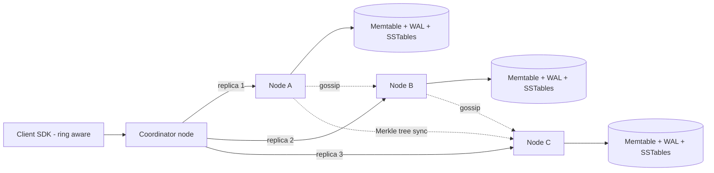
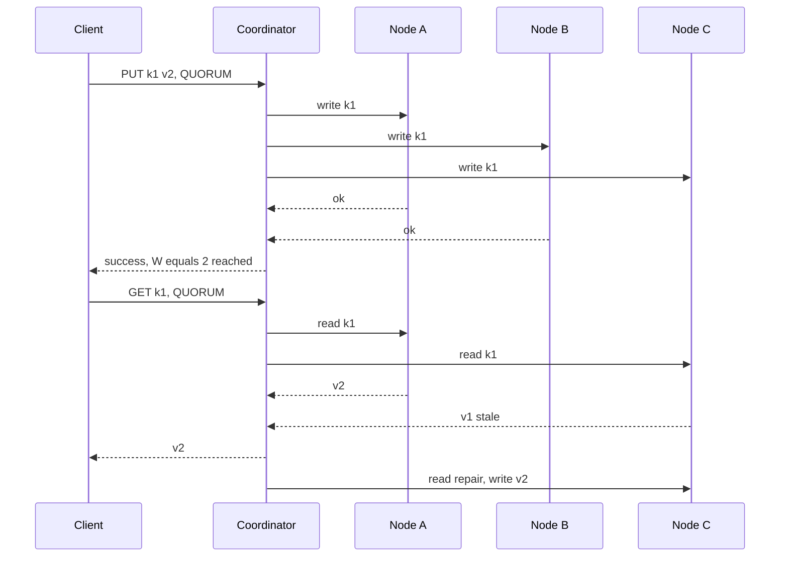

# Design a Distributed Key-Value Store / Distributed Cache

**Ek line me:** `put(key, value)` / `get(key)` hazaaron machines pe: data **kabhi lose na ho**, machine gire to bhi chale, latency single-digit ms (DynamoDB / Cassandra / Redis Cluster jaisa).

**Is question me interviewer kya check karta hai:** partitioning (consistent hashing), replication + quorum maths, CAP trade-off, node fail/join pe self-healing.

---

## Step 1: Interviewer se ye confirm karo (3–5 min)

| Tum poochho | Typical jawab | Design pe asar |
|---|---|---|
| "Store (DynamoDB) ya cache (Redis)?" | Store pehle, cache variant bhi | Store: durability + replication. Cache: eviction + TTL |
| "Strong ya eventual consistency?" | Tunable, default eventual | Quorum N/R/W configurable |
| "Key/value size?" | Key < 256B, value < 1MB | Simple KV, no query/index |
| "Scale?" | ~100TB, 1M QPS, read:write 4:1 | Sharding + bahut nodes |
| "Multi-datacenter?" | Haan, ek DC fail ho to bhi chale | Replicas alag racks/DCs |
| "Range scans, transactions?" | Nahi | Hash partitioning chalega |

> **Bolo:** "Dynamo-style leaderless design: consistent hashing, N replicas, tunable R/W quorum. Availability high, consistency client choose kare."

## Step 2: Requirements

**Functional**
1. `put(key, value)`, `get(key)`, `delete(key)`
2. Har key pe optional TTL
3. Har request pe consistency level (ONE, QUORUM, ALL)

**Out of scope:** range scans, transactions, secondary indexes, multi-key ops.

**Non-functional (priority order)**
1. **Availability:** 99.99% reads/writes, node/rack/AZ down ho tab bhi
2. **Durability:** acked write lose na ho (N=3, alag AZs)
3. **Latency:** p99 < 10ms (same DC)
4. **Scale:** 100TB, 1M QPS, read:write 4:1. Naye nodes → auto rebalance
5. **Self-healing:** failure daily hai, koi manual fix nahi

**CAP choice:** default **AP** (Dynamo): partition me dono taraf writes, baad me converge. Consistency → QUORUM/ALL (W=ALL/R=ALL → CP ki taraf), latency/availability ki keemat pe.

## Step 3: Estimation (sirf jo design badle)

- 100TB × RF 3 → **300TB raw**. ~2TB SSD/node → **~150 nodes**.
- 1M QPS = 800K reads + 200K writes. QUORUM: read → 2 replicas, write → 3 → ~2.2M replica ops/sec / 150 ≈ **~15K ops/sec/node**. SSD + memory cache se easy.
- 150 nodes → roz koi node fail. **Failure normal case hai**, exception nahi.

> **Bolo:** "Failure daily hai, isliye detection, hinted handoff aur repair built-in, koi manual step nahi."

## Step 4: Core entities

- **Key / Value**: key, value bytes, version (vector clock ya timestamp), TTL, tombstone flag
- **Node**: node_id, address, tokens (vnodes), status (UP, DOWN, JOINING)
- **Ring**: token → node mapping, sabke paas same copy (gossip se)
- **Hint**: target_node, key, value, version (jab replica down ho)

## Step 5: APIs

```http
PUT    /kv/{key}   {value, ttl?}   Header: Consistency: QUORUM   → {version}
GET    /kv/{key}                   Header: Consistency: ONE      → {value, version} or conflicting versions
DELETE /kv/{key}                                                 → tombstone written
```

> **Bolo:** "Vector clocks se `get` conflicting versions de sakta hai; client merge karke agle `put` me context ke saath likhe."

## Step 6: High-level design

**Simple v1:** ek node, memory hash map + disk WAL. FRs pure. Kahan tootega:
- **100TB** ek machine me nahi → consistent hashing partitioning
- Node gira → data + availability gayi → N=3 replicas alag AZs
- **150 nodes** ki membership ek master se bottleneck → gossip
- Replicas drift → hinted handoff + Merkle repair



**Har component kyun:**
- **Client SDK / Coordinator:** key hash → owner nodes. Koi bhi node coordinator → 99.99%. Router tier nahi: extra hop + fleet.
- **Consistent hashing ring + vnodes:** 100TB → 150 nodes, ~256 tokens/node. **hash mod N** → node add pe almost saara data move; yahan sirf ~1/N.
- **LSM tree:** 200K writes/sec × 3 → sequential appends. Reads: bloom filter + row cache.
- **Gossip:** 150 nodes ki membership/health bina master (ZooKeeper → bottleneck/SPOF).
- **Merkle tree sync:** bina full scan replicas theek (self-healing).

**FR → component:** FR1 → coordinator + ring + LSM, FR2 → TTL value ke saath (read pe check, compaction me purge), FR3 → coordinator quorum logic.

## Step 7: Main flow: quorum write aur read



N=3, W=2, R=2 → **R + W > N** (2+2 > 3) → read/write sets me kam se kam ek common node, latest value ke saath.

## Step 8: Data model & DB choice

Har node pe LSM-tree storage:
```
WAL (append-only log on disk)   → crash recovery
Memtable (sorted, in memory)    → recent writes
SSTables (immutable, on disk)   → flush hone ke baad, bloom filter + index ke saath
Compaction                      → purane SSTables merge, tombstones hatao
```

Read path: memtable → bloom filter ("pakka nahi hai" → disk read skip) → SSTable.

## Step 9: Deep dives (interviewer yahin pressure dalega)

### 9.1 Consistent hashing + vnodes + replication
**NFR: scale (auto rebalance) + availability (rack/AZ loss).**

- `hash(key)` → clockwise pehla node = owner, agle **N-1 distinct physical nodes** = replicas (preference list).
- **Vnodes:** bina vnodes, gire node ka load ek padosi pe. Vnodes → sab nodes me bikhre; bada node zyada tokens le.
- **Rack-aware placement:** replicas alag racks/AZs, ek rack se saare na jaayein.

**Trade-off:** rebalancing smooth, par ring metadata bada aur repair me zyada ranges compare.

### 9.2 Quorum aur tunable consistency
**NFR: p99 < 10ms vs consistency, per request.**

| Setting | Matlab | Use case |
|---|---|---|
| W=1, R=1 | Sabse fast, stale reads possible | Cache, analytics counters |
| W=2, R=2 (N=3) | R+W>N, latest read (normal case) | Default |
| W=3, R=1 | Fast reads, slow/fragile writes | Read-heavy config data |
| W=1, R=3 | Fast writes | Write-heavy logs |

> **Bolo:** "Quorum strong jaisa dikhta hai, par sloppy quorum + concurrent writes me linearizable nahi. Linearizable chahiye to per-shard Raft leader (etcd, Spanner)."

**Trade-off:** QUORUM pe p99 = do replicas me slowest.

### 9.3 Conflicts: vector clocks vs last-write-wins
**NFR: durability (concurrent writes me valid write chupchap lose na ho).**

- **LWW (timestamp, Cassandra):** bada timestamp jeete. Simple, par clock skew → valid write silently lose.
- **Vector clocks (Dynamo paper):** write ke saath `{nodeA: 3, nodeB: 1}`. Ek bada → naya. Incomparable → **conflict**: client dono versions merge kare (cart union).
- **Choice:** default LWW; jahan loss bilkul nahi chahiye (cart) → vector clocks ya CRDT counters/sets.

### 9.4 Failures: hinted handoff, read repair, anti-entropy, gossip
**NFR: availability + self-healing (150 nodes, daily failure).**

- **Gossip detection:** heartbeat counters gossip; ~10s na badhe → SUSPECT/DOWN. Phi-accrual → kam false alarms.
- **Hinted handoff (temporary failure):** C down → write D pe "hint" ke saath (sloppy quorum); C wapas → D hint deliver kare.
- **Read repair:** read pe stale replica → coordinator latest likh de (Step 7).
- **Merkle anti-entropy (long failure):** leaf = keys ka hash, parent = children ka hash. Roots compare → alag subtree me hi neeche → sirf diff ranges sync.
- **Delete:** tombstone likho, warna repair purani value "zinda" kar de. `gc_grace` (jaise 10 din) ke baad compaction me hatao.

**Trade-off:** sloppy quorum → availability up, par R+W>N overlap tootta hai (stale read possible).

### 9.5 Cache variant (Redis/Memcached jaisa) aur hot keys
**NFR: sub-ms latency, ek hot key se node na gire.**

- Memory me, disk optional, replication 1 ya nahi.
- **Eviction:** **LRU** (Redis: approximate sampling); always-hot keys → LFU. TTL expiry lazy (access pe) + periodic sampling.
- **Hot key** (IPL final score) → ek node pe load. Fix: client cache (1–2 sec), `score#1..score#10` me replicate + random read, ya read replicas badhao.

**Trade-off:** durability chhod ke speed. Node gaya → cold misses DB pe.

## Step 10: Decision table (kya chuna, kyun, kya nahi)

| Decision | Kyun chuna | Kya nahi chuna, kyun |
|---|---|---|
| **Consistent hashing + vnodes** | ~1/N data move, even load | **hash mod N:** saara reshuffle. **Range partitioning:** hotspots. Sacrifice: range scans impossible |
| **Leaderless, N=3** | Koi bhi replica write le, 99.99% | **Raft leader per shard:** failover tak writes band. Sacrifice: no linearizability, conflicts resolve karo |
| **Tunable quorum R/W** | Har use case apna latency vs consistency | **ALL:** ek slow → sab slow. **ONE:** stale. Sacrifice: clients ko trade-off samajhna |
| **LWW default, vector clocks optional** | Simple, cheap; critical data pe vector clocks | **Sirf vector clocks:** har client merge likhe. Sacrifice: skew pe rare silent loss |
| **Gossip membership** | Decentralized, 150+ nodes scale | **ZooKeeper per heartbeat:** bottleneck, SPOF. Sacrifice: membership change seconds me pahunche |
| **Merkle tree anti-entropy** | Sirf alag ranges sync, kam network | **Full compare:** TBs transfer. Sacrifice: tree CPU/IO, periodic repair chalana |
| **LSM tree storage** | 600K replica writes/sec sequential, bloom filter reads | **B-tree:** reads 4:1 pe valid, par random writes + page splits. Sacrifice: compaction IO, read amplification |

## Step 11: Failures & bottlenecks

| Kya fail hua | Kya hoga | Handle kaise |
|---|---|---|
| Node hamesha ke liye gaya | Replicas 3 → 2 | Naya node join, ranges stream, Merkle verify |
| Compaction storm | Latency spike | Throttle, off-peak schedule |
| Clock skew | LWW me galat write jeete | NTP monitoring, critical keys pe vector clocks |

## Step 12: "Isko aur better kaise karein" (end me khud bolo)

> "Agar aur time ho to main ye improve karunga:"
- **Strong consistency mode:** linearizable keys (locks, counters) ke liye per-shard Raft group
- **Multi-DC:** `LOCAL_QUORUM`: sirf local DC quorum ka wait, remote async
- **Speculative reads:** slow replica → doosre ko bhi bhejo (p99)
- **Tiered storage:** cold keys S3, hot SSD/memory, cost kam
- **Observability:** per-node p99, hint queue size, repair lag, hot key detection

## Step 13: Interviewer ke likely follow-up sawal

- "Naya node join?" → gossip announce → tokens → padosiyon se ranges stream → reads
- "Delete ke baad data wapas kyun?" → tombstone nahi rakha ya gc_grace se pehle hataya; repair ne purani value copy kar di
- "Redis Cluster vs Dynamo?" → Redis: 16384 hash slots, har slot ka ek master (leader-based). Dynamo: leaderless quorum
- **Senior signal:** khud bolo ki QUORUM "strong" nahi hai: sloppy quorum + LWW me stale/lost writes possible. Aur repair debt: agar anti-entropy `gc_grace` ke andar har replica pe nahi chala to deleted data wapas aa jaata hai, isliye repair lag ko alert pe rakho

## 2-minute recap (interview se pehle ye padho)

> Ring + ~256 vnodes/node, N=3 replicas alag racks, leaderless coordinator. R + W > N → latest read (sloppy quorum me nahi), W=1/R=1 → speed. Default AP. Conflicts: LWW, cart pe vector clocks. Failures: gossip, hinted handoff, read repair, Merkle anti-entropy. LSM: WAL, memtable, SSTables, bloom filter. Deletes = tombstones. Cache: LRU + TTL; hot keys → client cache / key splitting.

## Checklist

- [ ] Consistent hashing + vnodes aur replica placement samjha sakta hoon
- [ ] R + W > N ka logic example ke saath bata sakta hoon
- [ ] LWW vs vector clocks ka trade-off bata sakta hoon
- [ ] Hinted handoff, read repair aur Merkle tree anti-entropy ka farak bata sakta hoon
- [ ] Gossip se failure detection explain kar sakta hoon
- [ ] HLD diagram 5 min me bana sakta hoon
- [ ] Cache variant me eviction aur hot key handling bata sakta hoon
- [ ] Decision table ke 3 trade-offs bina dekhe bol sakta hoon
