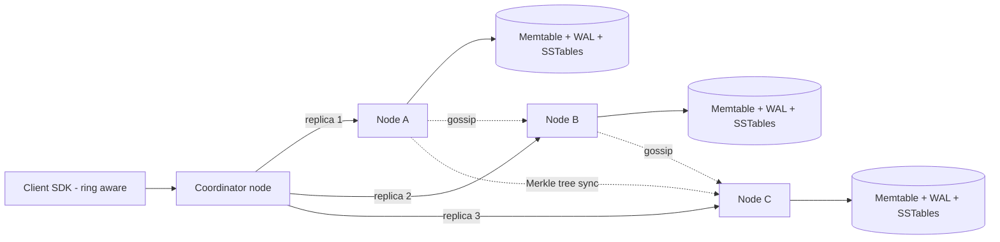
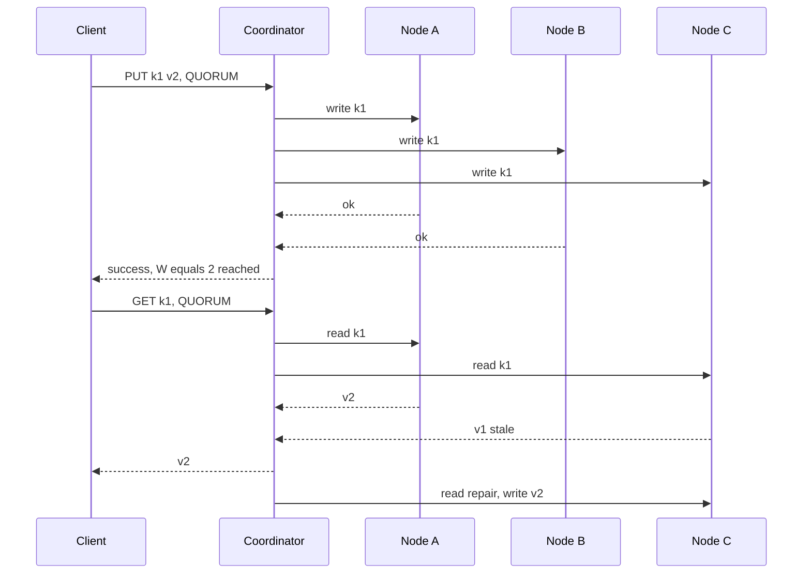

# Design a Distributed Key-Value Store / Distributed Cache

**Ek line me:** `put(key, value)` aur `get(key)` ko hazaaron machines pe chalana, taaki data **kabhi lose na ho**, machine girne pe bhi system chalta rahe, aur latency single-digit ms rahe (DynamoDB / Cassandra / Redis Cluster jaisa).

**Is question me interviewer kya check karta hai:** data ko nodes me kaise baantoge (consistent hashing), replication aur quorum ka maths, CAP trade-off, aur nodes fail/join hone pe system kaise khud theek hota hai.

---

## Step 1: Interviewer se ye confirm karo (3–5 min)

| Tum poochho | Typical jawab | Design pe asar |
|---|---|---|
| "Persistent store (DynamoDB) ya cache (Redis/Memcached)?" | Store pehle, cache variant bhi batao | Store me durability + replication. Cache me eviction + TTL |
| "Consistency kya chahiye: strong ya eventual?" | Tunable, default eventual | Quorum N/R/W configurable |
| "Key aur value ka size?" | Key < 256B, value < 1MB | Simple KV, koi query/index nahi |
| "Scale?" | ~100TB data, 1M QPS, read:write 4:1 | Sharding + bahut nodes |
| "Multi-datacenter chahiye?" | Haan, ek DC fail ho to bhi chale | Replicas alag racks/DCs me |
| "Range scans, transactions?" | Nahi | Hash partitioning chalega |

> **Bolo:** "Main Dynamo-style leaderless design karunga: consistent hashing se partitioning, N replicas, aur tunable R/W quorum. Isse availability high rahegi aur consistency client choose kar payega."

## Step 2: Requirements

**Functional**
1. `put(key, value)`, `get(key)`, `delete(key)`
2. Optional TTL per key
3. Per-request consistency level choose kar sakein (ONE, QUORUM, ALL)

**Non-functional**
- **High availability:** node ya rack down ho tab bhi reads/writes chalein (AP by default)
- **Durability:** acked write lose na ho
- **Low latency:** p99 < 10ms
- **Horizontal scale:** naye nodes add karo, data khud rebalance ho
- **Fault tolerance:** khud heal ho (no manual fix)

## Step 3: Estimation (sirf jo design badle)

- 100TB data, replication factor 3 → **300TB raw**. Ek node ~2TB SSD → **~150 nodes**.
- 1M QPS / 150 nodes ≈ **~7K QPS per node**. SSD + memory cache se easy.
- 150 nodes me roz koi na koi node fail hoga. Isliye **failure normal case hai**, exception nahi.

> **Bolo:** "Itne nodes pe failure daily hoga, isliye design me failure detection, hinted handoff aur repair built-in hone chahiye. Koi manual step nahi."

## Step 4: Core entities

- **Key / Value**: key, value bytes, version (vector clock ya timestamp), TTL, tombstone flag
- **Node**: node_id, address, tokens (vnodes), status (UP, DOWN, JOINING)
- **Ring**: token → node mapping, sabke paas same copy (gossip se)
- **Hint**: target_node, key, value, version (jab replica down ho)

## Step 5: APIs

```http
PUT    /kv/{key}   {value, ttl?}   Header: Consistency: QUORUM   → {version}
GET    /kv/{key}                   Header: Consistency: ONE      → {value, version} or conflicting versions
DELETE /kv/{key}                                                 → tombstone written
```

> **Bolo:** "Agar vector clocks use kiye to `get` multiple conflicting versions return kar sakta hai, aur client agle `put` me unhe merge karke context ke saath likhta hai."

## Step 6: High-level design



**Har component kyun:**
- **Client SDK / Coordinator:** key ka hash nikaal ke ring pe owner nodes dhoondhta hai. Koi bhi node coordinator ban sakta hai (leaderless), koi single point of failure nahi.
- **Consistent hashing ring with vnodes:** har physical node ring pe ~256 tokens leta hai. Node add/remove pe sirf thoda data move hota hai, aur load even rehta hai.
- **Storage engine (LSM tree):** WAL (durability) → memtable (memory) → SSTables (disk). Writes sequential aur fast.
- **Gossip:** har node har second 2–3 random nodes se membership aur health share karta hai. Central master nahi chahiye.
- **Merkle tree sync:** background me replicas compare karke missing data theek karta hai.

## Step 7: Main flow: quorum write aur read



N=3, W=2, R=2. **R + W > N** (2+2 > 3), isliye read aur write sets me kam se kam ek node common hota hai, jiske paas latest value hai.

## Step 8: Data model & DB choice

Har node pe LSM-tree storage:
```
WAL (append-only log on disk)   → crash recovery
Memtable (sorted, in memory)    → recent writes
SSTables (immutable, on disk)   → flush hone ke baad, bloom filter + index ke saath
Compaction                      → purane SSTables merge, tombstones hatao
```

Read path: memtable → bloom filter check → SSTable. Bloom filter bata deta hai "key is SSTable me pakka nahi hai", isse disk reads bachti hain.

## Step 9: Deep dives (interviewer yahin pressure dalega)

### 9.1 Consistent hashing + vnodes + replication
- `hash(key)` ring pe ek point. Clockwise pehla node = owner. Agle **N-1 distinct physical nodes** = replicas (preference list).
- **Vnodes kyun:** bina vnodes ke ek node ka saara load sirf ek padosi pe jaata hai. Vnodes se data aur load sab nodes me bikhar jaata hai, aur bada node zyada tokens le sakta hai.
- Replicas ko **alag racks/AZs** me rakho (rack-aware placement), taaki ek rack girne pe saare replicas na jaayein.

### 9.2 Quorum aur tunable consistency
| Setting | Matlab | Use case |
|---|---|---|
| W=1, R=1 | Sabse fast, stale reads possible | Cache, analytics counters |
| W=2, R=2 (N=3) | R+W>N, latest read milega (normal case me) | Default |
| W=3, R=1 | Fast reads, slow/fragile writes | Read-heavy config data |
| W=1, R=3 | Fast writes | Write-heavy logs |

> **Bolo:** "Quorum strong consistency jaisa behave karta hai, par sloppy quorum aur concurrent writes ke saath ye linearizable nahi hai. Sach me linearizable chahiye to Raft based per-shard leader lena padega, jaise etcd ya Spanner."

### 9.3 Conflicts: vector clocks vs last-write-wins
- **LWW (timestamp):** simple. Bada timestamp jeetega. Problem: clock skew se ek valid write chupchap lose ho sakta hai. Cassandra ye karta hai.
- **Vector clocks:** har write ke saath `{nodeA: 3, nodeB: 1}`. Agar ek clock doosre se bada hai to woh naya hai. Dono incomparable hain to **conflict**, dono versions client ko do, client merge kare (jaise shopping cart union). Dynamo paper ka approach.
- **Choice:** default LWW (simple, most use cases ok), aur jahan data lose bilkul nahi chahiye (cart) wahan vector clocks ya CRDT counters/sets.

### 9.4 Failures handle karna: hinted handoff, read repair, anti-entropy, gossip
- **Gossip + failure detection:** har node heartbeat counters gossip karta hai. Kisi node ka counter ~10s tak na badhe to SUSPECT/DOWN mark. Phi-accrual detector se false alarms kam.
- **Hinted handoff (temporary failure):** Node C down hai to write Node D pe "hint" ke saath jaata hai (sloppy quorum). C wapas aaye to D hint deliver kar deta hai. Availability bani rehti hai.
- **Read repair:** read ke time stale replica mila to coordinator usko latest value likh deta hai (Step 7).
- **Anti-entropy with Merkle trees (long failure):** har node apne key range ka Merkle tree banata hai (leaf = keys ka hash, parent = children ka hash). Do replicas root compare karein. Same to done. Alag to sirf alag subtree me neeche jao. Poora data compare kiye bina sirf diff ranges sync hote hain.
- **Delete:** tombstone likho, turant delete nahi. Warna repair ke time purani value "zinda" ho jayegi. Tombstone `gc_grace` (jaise 10 din) ke baad compaction me hatao.

### 9.5 Cache variant (Redis/Memcached jaisa) aur hot keys
- Data memory me, disk optional. Replication chhota (1 replica) ya nahi.
- **Eviction:** memory full pe **LRU** (ya approximate LRU sampling, jaise Redis), TTL expiry lazy (access pe check) + periodic sampling. LFU tab jab kuch keys hamesha hot ho.
- **Hot key** (jaise IPL final ka score key): ek node pe saara load. Fix: client side local cache (1–2 sec), key ko `score#1..score#10` me replicate karke random read, ya us key ke read replicas badhao.

## Step 10: Decision table (kya chuna, kyun, kya nahi)

| Decision | Kyun chuna | Kya nahi chuna, kyun |
|---|---|---|
| **Consistent hashing + vnodes** | Node add/remove pe sirf ~1/N data move, even load | **hash mod N:** node count badla to almost saara data reshuffle. **Range partitioning:** hotspots, aur range scan chahiye hi nahi |
| **Leaderless replication, N=3** | Koi bhi replica write le sakta hai, high availability | **Single leader per shard:** leader down to failover tak writes band. Strong consistency ke liye hi worth it |
| **Tunable quorum R/W** | Har use case apna latency vs consistency choose kare | **Fixed ALL:** ek node slow to sab slow. **Fixed ONE:** stale reads hamesha possible |
| **LWW default, vector clocks optional** | LWW simple aur cheap. Critical data ke liye vector clocks | **Sirf vector clocks:** har client ko merge logic likhna padega, complexity zyada |
| **Gossip membership** | Decentralized, hazaar nodes tak scale | **Central master/ZooKeeper har heartbeat ke liye:** bottleneck aur SPOF |
| **Merkle tree anti-entropy** | Sirf alag ranges sync, network kam | **Full data compare:** TBs ka transfer, impractical |
| **LSM tree storage** | Write-heavy ke liye sequential writes | **B-tree:** random writes, write amplification zyada for this workload |

## Step 11: Failures & bottlenecks

| Kya fail hua | Kya hoga | Handle kaise |
|---|---|---|
| Ek node kuch minute down | Uske writes miss | Hinted handoff + sloppy quorum, wapas aane pe hints replay |
| Node hamesha ke liye gaya | Replicas 3 se 2 | Naya node join, vnodes ke ranges stream ho, Merkle se verify |
| Network partition | Dono taraf writes, conflicts | AP mode me dono accept, baad me LWW ya vector clock se resolve |
| Hot key | Ek node overloaded | Client cache, key splitting, extra read replicas |
| Compaction storm | Latency spike | Compaction throttle, off-peak schedule |
| Clock skew | LWW me galat write jeete | NTP monitoring, critical keys pe vector clocks |

## Step 12: "Isko aur better kaise karein" (end me khud bolo)

> "Agar aur time ho to main ye improve karunga:"
- **Strong consistency mode:** per-shard Raft group, jin keys pe linearizable chahiye (jaise locks, counters)
- **Multi-DC:** `LOCAL_QUORUM` taaki write sirf local DC ke quorum ka wait kare, remote async
- **Speculative reads:** p99 ke liye, ek replica slow ho to doosre ko bhi request bhejo, jo pehle aaye
- **Tiered storage:** cold keys S3 pe, hot SSD/memory pe, cost kam
- **Observability:** per-node p99, hinted handoff queue size, repair lag, hot key detection dashboard

## Step 13: Interviewer ke likely follow-up sawal

- "R + W > N kyun?" → read aur write sets overlap karenge, kam se kam ek node latest value dega
- "CAP me ye kahan hai?" → default AP. Partition me available, baad me converge. W=ALL/R=ALL karke CP ki taraf ja sakte ho
- "Naya node kaise join karta hai?" → gossip se announce, tokens leta hai, padosi nodes se ranges stream, phir reads lene lagta hai
- "Delete ke baad data wapas kyun aa jaata hai?" → tombstone nahi rakha ya gc_grace se pehle hata diya, repair ne purani value wapas copy kar di
- "Redis Cluster aur Dynamo me farak?" → Redis Cluster me 16384 hash slots aur har slot ka ek master (leader-based), Dynamo leaderless quorum

## 2-minute recap (interview se pehle ye padho)

> Distributed KV store me data consistent hashing ring pe baanta jaata hai, har node ~256 vnodes leta hai taaki load even rahe aur rebalancing kam ho. Har key N=3 replicas pe, alag racks me. Leaderless: koi bhi node coordinator. Tunable quorum: R + W > N se latest read milta hai, W=1/R=1 se speed. Conflicts ke liye default last-write-wins, aur cart jaise data ke liye vector clocks. Failures normal hain: gossip se detection, hinted handoff temporary failure ke liye, read repair read ke time, aur Merkle tree anti-entropy background me. Storage LSM tree: WAL, memtable, SSTables, bloom filter. Deletes tombstone se. Cache variant me LRU eviction + TTL, aur hot keys ke liye client cache ya key splitting.

## Checklist

- [ ] Consistent hashing + vnodes aur replica placement samjha sakta hoon
- [ ] R + W > N ka logic example ke saath bata sakta hoon
- [ ] LWW vs vector clocks ka trade-off bata sakta hoon
- [ ] Hinted handoff, read repair aur Merkle tree anti-entropy ka farak bata sakta hoon
- [ ] Gossip se failure detection explain kar sakta hoon
- [ ] HLD diagram 5 min me bana sakta hoon
- [ ] Cache variant me eviction aur hot key handling bata sakta hoon
- [ ] Decision table ke 3 trade-offs bina dekhe bol sakta hoon
