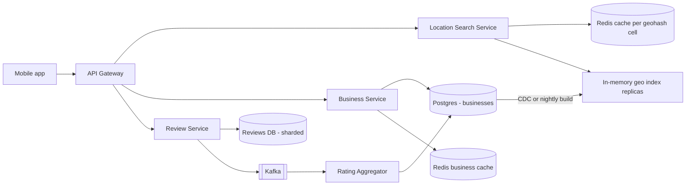
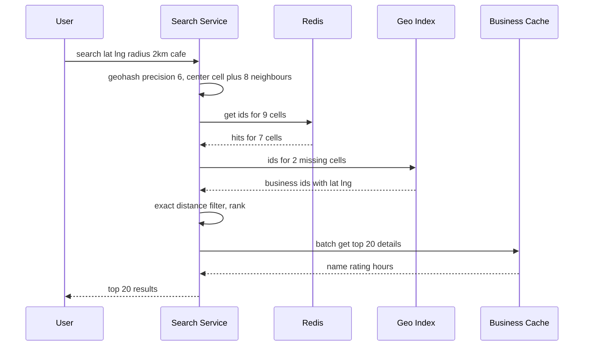

# Design Yelp / Nearby Places (Proximity Service)

**Ek line me:** user ki location ke paas restaurants/shops dhoondhna ("mere 2km me coffee shops"), distance aur rating se rank karke. Business data **bahut kam badalta hai**, par search **bahut zyada** hota hai.

**Is question me interviewer kya check karta hai:** geospatial index (geohash vs quadtree), read-heavy system ki caching, radius expand karna, aur ranking.

---

## Step 1: Interviewer se ye confirm karo (3–5 min)

| Tum poochho | Typical jawab | Design pe asar |
|---|---|---|
| "Core feature: location + radius pe nearby search, aur business detail page?" | Haan | Do main APIs: search aur detail |
| "Business owners kitni baar info update karte hain? Turant dikhna chahiye?" | Kam, next day tak chalega | Geo index batch me rebuild ho sakta hai |
| "Radius kitna? Filters?" | 0.5–20 km, category/open now/rating | Geo index + filter |
| "Scale?" | 200M businesses, 100M DAU | Read-heavy, cache + replicas |
| "Reviews likhne aur photos?" | Reviews haan, photos basic | Alag Review Service, photos S3 |
| "Real-time moving objects (Uber jaisa)?" | Nahi, businesses static | Static index chalega, frequent updates nahi |

> **Bolo:** "Businesses static hain aur reads bahut zyada, isliye main geo index ko read-optimized rakhunga, heavily cache karunga, aur updates async/batch me apply karunga."

## Step 2: Requirements

**Functional**
1. Lat/long + radius + filters se nearby businesses dhoondhna
2. Business detail page (info, rating, reviews)
3. User review aur rating de sake
4. Business owner listing add/update kare

**Non-functional**
- **Low latency:** search < 200ms
- **High availability:** search kabhi down nahi
- **Read-heavy:** search:write ~1000:1
- **Eventual consistency:** naya business kuch ghante baad dikhe to chalega

## Step 3: Estimation (sirf jo design badle)

- 100M DAU × 5 search = 500M/day ≈ **~6K QPS avg, peak ~20K QPS**.
- 200M businesses × ~1KB = **200GB** business data. Geo index sirf `(id, lat, long, geohash)` ≈ 200M × ~30B = **~6GB**, **ek machine ki memory me fit**.
- Writes: ~1 lakh business updates/day, ~1 QPS. Negligible.

> **Bolo:** "Geo index sirf ~6GB hai, isliye pura index memory me rakh sakte hain aur read replicas se scale kar sakte hain. Sharding index ke liye zaroori nahi, business data aur reviews ke liye hai."

## Step 4: Core entities

- **Business**: id, name, category, lat, long, geohash, address, hours, avg_rating, review_count
- **Review**: id, business_id, user_id, rating, text, created_at
- **User**: id, name
- **GeoIndex entry**: geohash, business_id (derived data)

## Step 5: APIs

```http
GET  /search?lat=18.52&lng=73.85&radius=2000&category=cafe&openNow=true&cursor=...
     → [{businessId, name, distance, rating}], nextCursor
GET  /businesses/{id}                      → details
POST /businesses        {name, lat, lng, ...}   (owner)
PUT  /businesses/{id}   {...}
POST /businesses/{id}/reviews {rating, text}
GET  /businesses/{id}/reviews?cursor=...
```

## Step 6: High-level design



**Har component kyun:**
- **Location Search Service:** stateless. Geohash cells nikaalta hai, geo index se candidate ids laata hai, filter + rank karta hai.
- **In-memory geo index:** ~6GB, har search node ke paas full copy (ya alag replicas). Horizontal read scaling.
- **Business Service + Postgres:** source of truth. Write kam, read replicas + Redis cache detail page ke liye.
- **Review Service:** write zyada (reviews), `business_id` se sharded DB.
- **Rating Aggregator:** naye review pe avg_rating async update. Har review pe business row lock nahi.

## Step 7: Main flow: nearby search



## Step 8: Data model & DB choice

```sql
businesses(id PK, name, category, lat, lng, geohash, hours JSONB, avg_rating, review_count, updated_at)
INDEX (geohash)   -- prefix search: geohash LIKE 'tek5%'

reviews(id, business_id, user_id, rating, text, created_at)   -- shard by business_id
UNIQUE(business_id, user_id)   -- ek user ek business pe ek review
```

Postgres business data ke liye (200GB, read replicas easy, strong schema). Agar team pehle se use karti hai to PostGIS bhi option hai, par in-memory geohash index search path ko DB se alag rakhta hai.

## Step 9: Deep dives (interviewer yahin pressure dalega)

### 9.1 Geohash vs Quadtree
- **Geohash:** duniya ko grid me baanto, har cell ko string do. Prefix same = paas paas. Precision 6 ≈ 1.2km × 0.6km, precision 5 ≈ 5km × 5km.
- **Quadtree:** map ko 4 parts me todo jab tak har node me ≤ 100 businesses na ho. Dense Mumbai me chhote cells, khaali Rajasthan me bade cells.

| | Geohash | Quadtree (in-memory) |
|---|---|---|
| Implementation | Simple, sirf string column + index | Tree build karna padta hai, custom code |
| Density handle | Fixed cell size, dense area me ek cell me hazaaron | Adaptive, har leaf me ~100 |
| Updates | Easy, row update | Tree rebuild/rebalance, tricky |
| Storage | Redis/DB me directly | Har server ki memory me, startup pe build |
| Cache key | Cell string natural cache key | Node id, utna clean nahi |

**Choice:** geohash, kyunki simple hai, Redis/DB native, aur cell string seedha cache key ban jaata hai. Quadtree tab jab density bahut uneven ho aur "k nearest" chahiye. Dono acceptable hain, trade-off bolna important hai.

### 9.2 Boundary problem aur radius expansion
- User cell ke kinare pe ho to paas ka business padosi cell me ho sakta hai. Isliye **center cell + 8 neighbours** query karo.
- Radius se precision choose karo: 500m → precision 7, 2km → 6, 20km → 5.
- Results kam aaye (gaon me 2km me sirf 3 cafe) to **radius expand** karo: precision ek kam karo (bada cell) aur dobara query, jab tak min results (jaise 20) na mil jaayein ya max radius na ho.
- Geohash cell ek rectangle hai, isliye last me **exact haversine distance** se filter karo.

### 9.3 Ranking: distance + rating
- Candidates (jaise 500) pe score: `score = w1 × (1 - distance/radius) + w2 × (avg_rating/5) + w3 × log(review_count)`.
- Filters (category, open now) pehle lagao, fir rank. Top 20 return, cursor se pagination.
- Personalization (user ki past pasand) baad me ML ranker se, interview me mention kar do.

### 9.4 Caching aur sharding
- **Cache per geohash cell:** key `geo:tek5x2:cafe` → business ids list. TTL 1 ghanta ya business update pe invalidate. Popular cells (CP, Koramangala) almost hamesha hit.
- **Business detail cache:** `biz:{id}` Redis me, detail page aur search result enrichment dono ke liye.
- **Sharding:** geo index chhota hai, replicate karo, shard nahi. Agar shard karna hi pade to **region/geohash prefix** se, par hot cities skew karengi. Reviews `business_id` se shard.

## Step 10: Decision table (kya chuna, kyun, kya nahi)

| Decision | Kyun chuna | Kya nahi chuna, kyun |
|---|---|---|
| **Geohash index** | Simple, prefix query, cell = cache key | **Quadtree:** adaptive hai par build/update complex. **Plain lat/lng index:** 2D range query slow, ek dimension pe hi index lagta hai |
| **Pura geo index memory me + replicas** | Sirf ~6GB, latency < 10ms, reads linearly scale | **Geo index ko shard karna:** itne chhote data ke liye extra complexity, cross-shard queries |
| **Redis cache per cell** | Read:write 1000:1, popular areas ka almost 100% hit | **Har search DB pe:** 20K QPS DB pe, latency aur cost dono zyada |
| **Batch/CDC se index update** | Business data rarely badalta, eventual chalega | **Sync update har write pe:** bekar complexity, koi requirement nahi |
| **Async rating aggregation** | Review write fast, business row pe contention nahi | **Har review pe avg update in same txn:** popular business pe row lock contention |
| **Elasticsearch sirf text search ke liye (optional)** | "biryani near me" jaise text + geo combined | **Sirf ES pe sab:** chal jaata, par core proximity ke liye in-memory geohash sasta aur fast |

## Step 11: Failures & bottlenecks

| Kya fail hua | Kya hoga | Handle kaise |
|---|---|---|
| Redis down | Cache miss, load index pe | Index memory me hai, phir bhi fast. Redis replica |
| Geo index node crash | Kuch requests fail | Stateless, LB doosre replica pe bheje. Startup pe snapshot se index load |
| Dense cell (Mumbai station) | Ek cell me hazaaron results | Higher precision ya quadtree split, top-K pre-sorted per cell |
| Index stale | Naya business nahi dikh raha | Acceptable. Owner ko "24 ghante me live" message |
| Fake reviews spike | Rating manipulation | Rate limit per user, spam ML, verified visits ko zyada weight |

## Step 12: "Isko aur better kaise karein" (end me khud bolo)

> "Agar aur time ho to main ye improve karunga:"
- **Pre-computed top-K per cell per category:** popular cells ke liye ranking pehle se ready, search almost O(1)
- **Personalized ranking:** user history aur time of day (subah breakfast) se ML ranker
- **Multi-region:** geo index har region me, user ke nearest region se serve
- **Hybrid geohash + quadtree:** dense cities me adaptive split
- **Elasticsearch** combined text + geo query ke liye ("veg thali under 200 near me")

## Step 13: Interviewer ke likely follow-up sawal

- "Cell boundary pe business miss ho gaya to?" → 8 neighbour cells bhi query karo, fir exact distance filter
- "Geohash aur quadtree me kya chunoge?" → geohash for simplicity aur caching, quadtree for uneven density. Step 9.1 table
- "Naya restaurant turant dikhna chahiye to?" → CDC se geo index aur cell cache ko incremental update
- "Results bahut kam aaye to?" → radius expand, precision kam karke dobara query
- "Uber jaise moving drivers ho to?" → tab Redis GEO me har 4 sec update, ye static design nahi chalega

## 2-minute recap (interview se pehle ye padho)

> Yelp read-heavy hai (1000:1) aur business data rarely badalta hai. Geo index sirf ~6GB, isliye pura memory me rakh ke replicate karte hain. Geohash use karte hain: radius se precision chuno, center + 8 neighbour cells query karo, fir exact haversine distance se filter. Kam results aaye to precision kam karke radius expand. Ranking distance + rating + review count ka weighted score. Har geohash cell ka result Redis me cache, popular cells almost hamesha hit. Business data Postgres me, CDC/batch se index update. Reviews alag service, business_id se sharded, aur rating async aggregate hoti hai. Quadtree alternative hai jo uneven density me better, par complex.

## Checklist

- [ ] Geohash aur quadtree ka comparison table bina dekhe bana sakta hoon
- [ ] Boundary problem aur 8 neighbour cells wala fix samjha sakta hoon
- [ ] Radius expansion aur precision choice bata sakta hoon
- [ ] Geo index memory me fit hone ka estimation kar sakta hoon
- [ ] Distance + rating ranking formula bata sakta hoon
- [ ] HLD diagram 5 min me bana sakta hoon
- [ ] Decision table ke 3 trade-offs bina dekhe bol sakta hoon
