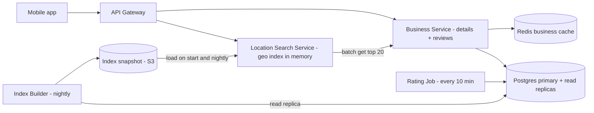
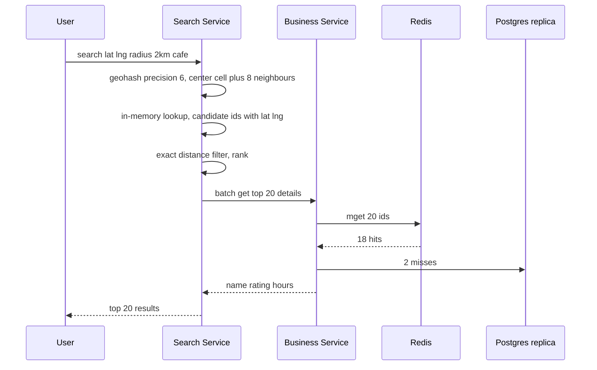

# Design Yelp / Nearby Places (Proximity Service)

**Ek line me:** user ke paas restaurants/shops dhoondhna ("mere 2km me coffee shops"), distance + rating se rank. Business data **bahut kam badalta**, search **bahut zyada**.

**Is question me interviewer kya check karta hai:** geospatial index (geohash vs quadtree), read-heavy caching, radius expansion, ranking.

---

## Step 1: Interviewer se ye confirm karo (3–5 min)

| Tum poochho | Typical jawab | Design pe asar |
|---|---|---|
| "Core: location + radius search aur detail page?" | Haan | Do main APIs: search, detail |
| "Owners kitni baar update karte hain? Turant dikhe?" | Kam, next day chalega | Geo index batch rebuild |
| "Radius? Filters?" | 0.5–20 km, category/open now/rating | Geo index + filter |
| "Scale?" | 200M businesses, 100M DAU | Read-heavy, cache + replicas |
| "Reviews, photos?" | Reviews haan, photos basic | Reviews Postgres me alag table, photos S3 |
| "Moving objects (Uber jaisa)?" | Nahi, businesses static | Static index, frequent updates nahi |

> **Bolo:** "Businesses static, reads bahut zyada: geo index read-optimized, heavy cache, updates async/batch."

## Step 2: Requirements

**Functional**
1. Lat/long + radius + filters se nearby search
2. Business detail page (info, rating, reviews)
3. Review aur rating dena
4. Owners listing add/update karein

**Out of scope:** moving objects (Uber), photo pipeline, personalization, booking/ordering.

**Non-functional (priority order)**
1. **Availability:** search 99.99% (stale chalega, error nahi)
2. **Latency:** search p99 < 200ms (index lookup < 10ms)
3. **Scale:** 100M DAU, peak ~20K search QPS, search:write ~1000:1
4. **Freshness:** naya/updated business 24 ghante me, rating ~10 min me
5. **Durability:** acked review lose na ho

**CAP choice:** search **AP** (purana index serve karo, fail nahi). Review write Postgres primary pe **consistent** (ek user ek business pe ek review, unique constraint).

## Step 3: Estimation (sirf jo design badle)

- 100M DAU × 5 search = 500M/day ≈ **~6K QPS avg, peak ~20K QPS**.
- 200M × ~1KB = **200GB** business data. Geo index `(id, lat, long, geohash)` ≈ 200M × ~30B = **~6GB** → **ek machine ki memory me fit**.
- Writes: ~1 lakh business updates/day (~1 QPS). Reviews ~10 lakh/day ≈ **~12 writes/sec**, ~1KB → ~0.4TB/saal. Ek Postgres primary kaafi; Kafka/sharding nahi.
- Top 20 details per search: 20K × 20 = **~400K lookups/sec** peak → DB pe nahi, business cache.

> **Bolo:** "Index ~6GB → memory me + replicas. Shard kuch nahi; sirf detail lookups ke liye cache."

## Step 4: Core entities

- **Business**: id, name, category, lat, long, geohash, address, hours, avg_rating, review_count
- **Review**: id, business_id, user_id, rating, text, created_at
- **User**: id, name
- **GeoIndex entry**: geohash, business_id (derived data)

## Step 5: APIs

```http
GET  /search?lat=18.52&lng=73.85&radius=2000&category=cafe&openNow=true&cursor=...
     → [{businessId, name, distance, rating}], nextCursor
GET  /businesses/{id}                      → details
POST /businesses        {name, lat, lng, ...}   (owner)
PUT  /businesses/{id}   {...}
POST /businesses/{id}/reviews {rating, text}
GET  /businesses/{id}/reviews?cursor=...
```

## Step 6: High-level design

**Simple v1:** app → ek Business Service → Postgres (PostGIS / geohash index); search, detail, reviews sab ek DB. FRs pure. Kahan tootega:
- **20K search QPS** pe 2D geo query DB p99 todti hai → in-memory geo index, alag Search Service
- **400K detail lookups/sec** → Redis business cache
- Reviews sirf ~12 writes/sec → Postgres me hi



**Har component kyun:**
- **Location Search Service:** stateless, pura ~6GB index har node ki memory me → < 10ms, replicas se scale. Alag Redis "cell cache" nahi: extra hop.
- **Business Service + Postgres:** source of truth. Alag Review Service/sharded DB tab jab kai TB ya alag team.
- **Redis business cache:** `biz:{id}`, ~400K lookups/sec.
- **Index Builder (nightly) + S3 snapshot:** 24h freshness → batch kaafi; naya node bina DB scan seconds me start.
- **Rating Job (cron, 10 min):** naye reviews se `avg_rating`, `review_count` recompute; cron + `created_at` index kaafi.

**FR → component:** FR1 → Search Service + snapshot, FR2 → Business Service + Redis + Postgres, FR3 → Business Service + Postgres + Rating Job, FR4 → Business Service + Postgres (index me agli nightly build se).

## Step 7: Main flow: nearby search



## Step 8: Data model & DB choice

```sql
businesses(id PK, name, category, lat, lng, geohash, hours JSONB, avg_rating, review_count, updated_at)
INDEX (geohash)   -- prefix search: geohash LIKE 'tek5%'

reviews(id, business_id, user_id, rating, text, created_at)
UNIQUE(business_id, user_id)   -- ek user ek business pe ek review
INDEX (business_id, created_at), INDEX (created_at)   -- detail page + Rating Job
```

Postgres dono ke liye: replicas easy, strong schema. PostGIS option hai, par in-memory index search path ko DB se alag rakhta hai.

## Step 9: Deep dives (interviewer yahin pressure dalega)

### 9.1 Geohash vs Quadtree
**NFR: search p99 < 200ms at 20K QPS.**

- **Geohash:** duniya ko grid, har cell ek string. Same prefix = paas. Precision 6 ≈ 1.2km × 0.6km, 5 ≈ 5km × 5km.
- **Quadtree:** map ko 4 me todo jab tak node me ≤ 100 businesses. Dense Mumbai → chhote cells, khaali Rajasthan → bade.

| | Geohash | Quadtree (in-memory) |
|---|---|---|
| Implementation | Simple: string column + index | Tree build, custom code |
| Density | Fixed cell, dense me hazaaron | Adaptive, leaf me ~100 |
| Updates | Easy, row update | Rebuild/rebalance, tricky |
| Storage | Redis/DB me directly | Har server memory, startup pe build |
| Cache key | Cell string natural key | Node id, kam clean |

**Choice:** geohash. Quadtree jab density bahut uneven + "k nearest" chahiye. Dono valid; trade-off bolna important.

### 9.2 Boundary problem aur radius expansion
**NFR: correctness (paas ka business miss na ho) + latency.**

- Cell ke kinare pe user → business padosi cell me ho sakta hai → **center + 8 neighbours** query.
- Radius → precision: 500m → 7, 2km → 6, 20km → 5.
- Kam results (gaon me 2km me 3 cafe) → **radius expand**: precision ek kam karke dobara query, jab tak min results (jaise 20) ya max radius.
- Cell rectangle hai → last me **exact haversine distance** filter.

**Trade-off:** 9 cells + expansion → extra candidates scan, par edge pe miss nahi.

### 9.3 Ranking: distance + rating
**NFR: latency (rank sirf ~500 candidates pe, in-memory).**

- Score: `score = w1 × (1 - distance/radius) + w2 × (avg_rating/5) + w3 × log(review_count)`.
- Filters (category, open now) pehle, fir rank. Top 20, cursor pagination.
- Personalization baad me ML ranker se (mention kar do).

**Trade-off:** weighted score explainable aur fast, par personalized nahi.

### 9.4 Caching aur sharding
**NFR: 400K detail lookups/sec + 99.99% availability.**

- Popular cells (CP, Koramangala) ke liye top-K per category in-process precompute.
- **Detail cache:** `biz:{id}` TTL 1 ghanta + owner update pe invalidate; detail page + search enrichment.
- **Sharding:** index chhota → replicate, shard nahi. Shard karna pade to **region/geohash prefix**, par hot cities skew. Reviews bade hon to `business_id` se shard.

## Step 10: Decision table (kya chuna, kyun, kya nahi)

| Decision | Kyun chuna | Kya nahi chuna, kyun |
|---|---|---|
| **Geohash index** | Simple, prefix query, cell = key | **Quadtree:** build/update complex. **Plain lat/lng index:** 2D range slow. Sacrifice: dense cells me zyada candidates |
| **Pura geo index memory me + replicas** | ~6GB, < 10ms, linear read scale | **PostGIS per search:** 20K QPS pe p99 tootega. **Shard:** cross-shard queries. Sacrifice: 6GB RAM/node, nightly reload |
| **Redis business cache** | ~400K lookups/sec, popular ~100% hit | **Read replicas:** bahut replicas, latency zyada. Sacrifice: TTL tak stale |
| **Nightly index build + S3 snapshot** | Freshness 24 ghante, ~1 update/sec | **CDC + Kafka:** real-time ki requirement nahi. Sacrifice: naya business agle din |
| **Rating Job (cron) for avg_rating** | ~12 reviews/sec, idempotent recompute | **Kafka + aggregator:** replay nahi chahiye. **Same txn update:** row contention. Sacrifice: rating ~10 min late |
| **Ek Postgres (primary + replicas)** | 200GB + ~0.4TB/saal, joins, unique constraint | **Cassandra / sharded reviews:** sirf ops cost. Sacrifice: kuch saal baad sharding planning |
| **Elasticsearch nahi (abhi)** | In-memory geohash sasta, fast | **ES:** text + geo ("biryani near me") chahiye tab. Sacrifice: free-text search nahi |

## Step 11: Failures & bottlenecks

| Kya fail hua | Kya hoga | Handle kaise |
|---|---|---|
| Redis down | Lookups DB pe | Replica failover; beech me read replicas + short timeouts, ya sirf top 10 enrich |
| Search node crash | Kuch requests fail | Stateless, LB doosre replica pe; naya node S3 snapshot se |
| Kharab nightly index | Galat/khaali results | Canary node pe pehle, count check, purana snapshot rollback |
| Dense cell (Mumbai station) | Hazaaron candidates | Higher precision / quadtree split, top-K pre-sorted per cell |
| Index stale | Naya business missing | Acceptable; owner ko "24 ghante me live" |
| Rating Job fail | Rating purani | Retry; idempotent, agla run catch up |
| Fake reviews spike | Rating manipulation | Per-user rate limit, spam ML, verified visits ko zyada weight |

## Step 12: "Isko aur better kaise karein" (end me khud bolo)

> "Agar aur time ho to main ye improve karunga:"
- **Pre-computed top-K per cell per category:** popular cells pe search almost O(1)
- **Personalized ranking:** user history + time of day (subah breakfast) se ML ranker
- **Multi-region:** har region me index, nearest region se serve
- **Hybrid geohash + quadtree:** dense cities me adaptive split
- **Elasticsearch:** text + geo ("veg thali under 200 near me")

## Step 13: Interviewer ke likely follow-up sawal

- "Naya restaurant turant dikhe?" → CDC (Debezium) se search nodes pe incremental update. Abhi 24 ghante NFR, nightly kaafi
- "Kafka kyun nahi?" → ~12 reviews/sec, ~1 update/sec; cron + nightly kaafi. Kai consumers ya real-time freshness pe
- "Uber jaise moving drivers?" → Redis GEO me har 4 sec update; ye static design nahi chalega
- **Senior signal:** khud bolo ki risk density skew hai (Mumbai ke ek cell me hazaaron candidates → ranking p99 badhti hai, adaptive split ya precomputed top-K) aur nightly index rollout (sab nodes pe ek saath kharab snapshot = sab search down, isliye canary + rollback)

## 2-minute recap (interview se pehle ye padho)

> Read-heavy (1000:1). ~6GB geo index memory me, replicated. Geohash: radius se precision, center + 8 neighbours, haversine filter; kam results → expand. Rank = distance + rating + review count. ~400K detail lookups/sec → Redis. Ek Postgres (reviews ~12 writes/sec). Nightly index → S3 snapshot (CDC/Kafka nahi). Rating cron 10 min. Quadtree: uneven density me better, complex.

## Checklist

- [ ] Geohash aur quadtree ka comparison table bina dekhe bana sakta hoon
- [ ] Boundary problem aur 8 neighbour cells wala fix samjha sakta hoon
- [ ] Radius expansion aur precision choice bata sakta hoon
- [ ] Geo index memory me fit hone ka estimation kar sakta hoon
- [ ] Distance + rating ranking formula bata sakta hoon
- [ ] HLD diagram 5 min me bana sakta hoon
- [ ] Decision table ke 3 trade-offs bina dekhe bol sakta hoon
