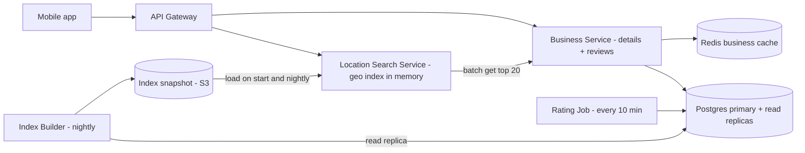
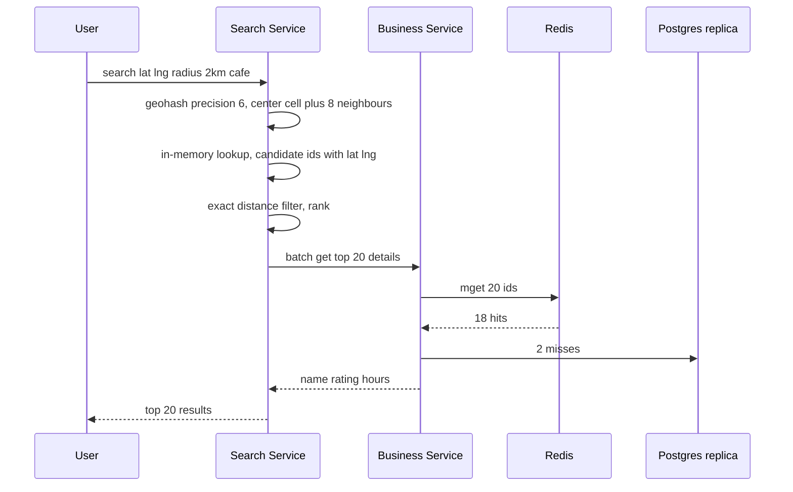

# Design Yelp / Nearby Places (Proximity Service)

**Ek line me:** user ki location ke paas restaurants/shops dhoondhna ("mere 2km me coffee shops"), distance aur rating se rank karke. Business data **bahut kam badalta hai**, par search **bahut zyada** hota hai.

**Is question me interviewer kya check karta hai:** geospatial index (geohash vs quadtree), read-heavy system ki caching, radius expand karna, aur ranking.

---

## Step 1: Interviewer se ye confirm karo (3–5 min)

| Tum poochho | Typical jawab | Design pe asar |
|---|---|---|
| "Core feature: location + radius pe nearby search, aur business detail page?" | Haan | Do main APIs: search aur detail |
| "Business owners kitni baar info update karte hain? Turant dikhna chahiye?" | Kam, next day tak chalega | Geo index batch me rebuild ho sakta hai |
| "Radius kitna? Filters?" | 0.5–20 km, category/open now/rating | Geo index + filter |
| "Scale?" | 200M businesses, 100M DAU | Read-heavy, cache + replicas |
| "Reviews likhne aur photos?" | Reviews haan, photos basic | Reviews Postgres me alag table, photos S3 |
| "Real-time moving objects (Uber jaisa)?" | Nahi, businesses static | Static index chalega, frequent updates nahi |

> **Bolo:** "Businesses static hain aur reads bahut zyada, isliye main geo index ko read-optimized rakhunga, heavily cache karunga, aur updates async/batch me apply karunga."

## Step 2: Requirements

**Functional**
1. Users lat/long + radius + filters se nearby businesses search kar sakein
2. Users business detail page (info, rating, reviews) dekh sakein
3. Users review aur rating de sakein
4. Business owners listing add/update kar sakein

**Out of scope:** moving objects (Uber), photo pipeline, personalization, booking/ordering.

**Non-functional (priority order)**
1. **Availability:** search 99.99% (stale result chalega, error nahi)
2. **Latency:** search p99 < 200ms (index lookup < 10ms)
3. **Scale:** 100M DAU, peak ~20K search QPS, search:write ~1000:1
4. **Freshness:** naya/updated business 24 ghante me, rating ~10 min me
5. **Durability:** acked review lose na ho

**CAP choice:** search **AP** hai: purana index serve karo, fail mat karo. Review write Postgres primary pe **consistent** (ek user ek business pe ek review, unique constraint).

## Step 3: Estimation (sirf jo design badle)

- 100M DAU × 5 search = 500M/day ≈ **~6K QPS avg, peak ~20K QPS**.
- 200M businesses × ~1KB = **200GB** business data. Geo index sirf `(id, lat, long, geohash)` ≈ 200M × ~30B = **~6GB**, **ek machine ki memory me fit**.
- Writes: ~1 lakh business updates/day, ~1 QPS. Reviews ~10 lakh/day ≈ **~12 writes/sec**, ~1KB → ~0.4TB/saal. Ek Postgres primary kaafi, Kafka ya sharding ki zarurat nahi.
- Har search ke top 20 ki details: 20K × 20 = **~400K lookups/sec** peak. Ye DB pe nahi daal sakte → business cache.

> **Bolo:** "Geo index sirf ~6GB hai, isliye pura index memory me rakh sakte hain aur read replicas se scale kar sakte hain. Na index ko shard karna hai, na reviews ko. Sirf detail lookups ke liye cache chahiye."

## Step 4: Core entities

- **Business**: id, name, category, lat, long, geohash, address, hours, avg_rating, review_count
- **Review**: id, business_id, user_id, rating, text, created_at
- **User**: id, name
- **GeoIndex entry**: geohash, business_id (derived data)

## Step 5: APIs

```http
GET  /search?lat=18.52&lng=73.85&radius=2000&category=cafe&openNow=true&cursor=...
     → [{businessId, name, distance, rating}], nextCursor
GET  /businesses/{id}                      → details
POST /businesses        {name, lat, lng, ...}   (owner)
PUT  /businesses/{id}   {...}
POST /businesses/{id}/reviews {rating, text}
GET  /businesses/{id}/reviews?cursor=...
```

## Step 6: High-level design

**Simple v1 pehle:** app → ek Business Service → Postgres (PostGIS / geohash index). Search, detail, reviews sab ek DB se. Ye saare FRs pura karta hai. Par **20K search QPS** pe 2D geo query DB pe p99 tod deti hai (→ in-memory geo index alag Search Service me), aur **400K detail lookups/sec** (→ Redis business cache). Reviews sirf ~12 writes/sec hain, isliye woh Postgres me hi rehte hain.



**Har component kyun:**
- **Location Search Service:** stateless, har node pe pura ~6GB geohash index memory me. Search p99 NFR aur 20K QPS ke liye: DB geo query ki jagah < 10ms in-memory lookup, replicas add karke linear scale. Alag Redis "cell cache" nahi: index already memory me hai, Redis ek extra network hop hota.
- **Business Service + Postgres:** source of truth (businesses + reviews). 200GB + ~0.4TB/saal reviews ek primary + read replicas pe fit. Alag Review Service/sharded DB tab jab data kai TB ho ya team alag ho.
- **Redis business cache:** `biz:{id}`, ~400K lookups/sec peak. Read replicas pe itna load mehenga aur slow.
- **Index Builder (nightly) + S3 snapshot:** freshness NFR 24 ghante hai, isliye batch kaafi. Snapshot se naya node DB scan kiye bina seconds me start. **CDC/Kafka nahi:** ~1 update/sec ke liye real-time pipeline bekar.
- **Rating Job (cron, 10 min):** naye reviews se `avg_rating`, `review_count` recompute. **Kafka nahi:** ~12 reviews/sec, ek hi consumer, replay nahi chahiye. Cron + `created_at` index kaafi.

**FR → component:** FR1 → Location Search Service + index snapshot, FR2 → Business Service + Redis + Postgres, FR3 → Business Service + Postgres + Rating Job, FR4 → Business Service + Postgres (index me agli nightly build se).

## Step 7: Main flow: nearby search



## Step 8: Data model & DB choice

```sql
businesses(id PK, name, category, lat, lng, geohash, hours JSONB, avg_rating, review_count, updated_at)
INDEX (geohash)   -- prefix search: geohash LIKE 'tek5%'

reviews(id, business_id, user_id, rating, text, created_at)
UNIQUE(business_id, user_id)   -- ek user ek business pe ek review
INDEX (business_id, created_at), INDEX (created_at)   -- detail page + Rating Job
```

Postgres businesses aur reviews dono ke liye (200GB + ~0.4TB/saal, read replicas easy, strong schema). Reviews ko `business_id` se shard tab karenge jab ek primary chhota pade. Agar team pehle se use karti hai to PostGIS bhi option hai, par in-memory geohash index search path ko DB se alag rakhta hai.

## Step 9: Deep dives (interviewer yahin pressure dalega)

### 9.1 Geohash vs Quadtree
**NFR: search p99 < 200ms at 20K QPS.**

- **Geohash:** duniya ko grid me baanto, har cell ko string do. Prefix same = paas paas. Precision 6 ≈ 1.2km × 0.6km, precision 5 ≈ 5km × 5km.
- **Quadtree:** map ko 4 parts me todo jab tak har node me ≤ 100 businesses na ho. Dense Mumbai me chhote cells, khaali Rajasthan me bade cells.

| | Geohash | Quadtree (in-memory) |
|---|---|---|
| Implementation | Simple, sirf string column + index | Tree build karna padta hai, custom code |
| Density handle | Fixed cell size, dense area me ek cell me hazaaron | Adaptive, har leaf me ~100 |
| Updates | Easy, row update | Tree rebuild/rebalance, tricky |
| Storage | Redis/DB me directly | Har server ki memory me, startup pe build |
| Cache key | Cell string natural cache key | Node id, utna clean nahi |

**Choice:** geohash, kyunki simple hai, Redis/DB native, aur cell string seedha cache key ban jaata hai. Quadtree tab jab density bahut uneven ho aur "k nearest" chahiye. Dono acceptable hain, trade-off bolna important hai.

**Trade-off:** geohash simple hai par dense cells me candidates zyada, ranking cost badhti hai.

### 9.2 Boundary problem aur radius expansion
**NFR: correctness (paas ka business miss na ho) + latency.**

- User cell ke kinare pe ho to paas ka business padosi cell me ho sakta hai. Isliye **center cell + 8 neighbours** query karo.
- Radius se precision choose karo: 500m → precision 7, 2km → 6, 20km → 5.
- Results kam aaye (gaon me 2km me sirf 3 cafe) to **radius expand** karo: precision ek kam karo (bada cell) aur dobara query, jab tak min results (jaise 20) na mil jaayein ya max radius na ho.
- Geohash cell ek rectangle hai, isliye last me **exact haversine distance** se filter karo.

**Trade-off:** 9 cells + expansion se extra candidates scan hote hain, par edge pe miss nahi hota.

### 9.3 Ranking: distance + rating
**NFR: latency (rank sirf ~500 candidates pe, in-memory).**

- Candidates (jaise 500) pe score: `score = w1 × (1 - distance/radius) + w2 × (avg_rating/5) + w3 × log(review_count)`.
- Filters (category, open now) pehle lagao, fir rank. Top 20 return, cursor se pagination.
- Personalization (user ki past pasand) baad me ML ranker se, interview me mention kar do.

**Trade-off:** simple weighted score explainable aur fast hai, par personalized nahi.

### 9.4 Caching aur sharding
**NFR: 400K detail lookups/sec + 99.99% availability.**

- **Cell cache alag nahi:** geo index khud search node ki memory me hai. Popular cells (CP, Koramangala) ke liye top-K per category in-process precompute kar sakte ho.
- **Business detail cache:** `biz:{id}` Redis me, TTL 1 ghanta + owner update pe invalidate. Detail page aur search enrichment dono.
- **Sharding:** geo index chhota hai, replicate karo, shard nahi. Agar shard karna hi pade to **region/geohash prefix** se, par hot cities skew karengi. Reviews abhi ek primary pe, bade hon to `business_id` se shard.

**Trade-off:** cache se rating/hours thode stale (max TTL), par DB 400K/sec se bachta hai.

## Step 10: Decision table (kya chuna, kyun, kya nahi)

| Decision | Kyun chuna | Kya nahi chuna, kyun |
|---|---|---|
| **Geohash index** | Simple, prefix query, cell = natural key | **Quadtree:** adaptive par build/update complex. **Plain lat/lng index:** 2D range query slow. Sacrifice: dense cells me zyada candidates |
| **Pura geo index memory me + replicas** | Sirf ~6GB, lookup < 10ms, reads linearly scale | **PostGIS pe har search:** 20K QPS pe DB p99 tootega. **Shard karna:** itne chhote data ke liye cross-shard queries. Sacrifice: har node pe 6GB RAM, nightly reload |
| **Redis business cache** | ~400K detail lookups/sec, popular businesses almost 100% hit | **Read replicas se serve:** bahut replicas, latency zyada. Sacrifice: TTL tak stale rating/hours |
| **Nightly index build + S3 snapshot** | Freshness 24 ghante, ~1 update/sec | **CDC + Kafka:** real-time pipeline jiski requirement nahi. Sacrifice: naya business agle din dikhta hai |
| **Rating Job (cron) for avg_rating** | ~12 reviews/sec, ek consumer, idempotent recompute | **Kafka + aggregator:** replay/multi-consumer chahiye hi nahi. **Same txn me update:** popular business pe row contention. Sacrifice: rating ~10 min late |
| **Ek Postgres (primary + replicas) for businesses + reviews** | 200GB + ~0.4TB/saal fit, joins aur unique constraint | **Cassandra / sharded reviews DB:** is volume pe sirf ops cost. Sacrifice: kuch saal baad sharding planning |
| **Elasticsearch nahi (abhi)** | Core proximity ke liye in-memory geohash sasta aur fast | **ES:** "biryani near me" jaisa text + geo chahiye tab add karo. Sacrifice: free-text search abhi nahi |

## Step 11: Failures & bottlenecks

| Kya fail hua | Kya hoga | Handle kaise |
|---|---|---|
| Redis down | Detail lookups DB pe | Redis replica failover. Beech me read replicas + short timeouts, chahe to top 10 hi enrich karo |
| Search node crash | Kuch requests fail | Stateless, LB doosre replica pe bheje. Naya node S3 snapshot se load |
| Kharab nightly index (empty/corrupt) | Galat ya khaali results | Canary node pe pehle load, count check, purana snapshot rollback ke liye rakho |
| Dense cell (Mumbai station) | Ek cell me hazaaron results | Higher precision ya quadtree split, top-K pre-sorted per cell |
| Index stale | Naya business nahi dikh raha | Acceptable. Owner ko "24 ghante me live" message |
| Rating Job fail | Rating purani | Retry. Recompute idempotent hai, agla run catch up kar leta hai |
| Fake reviews spike | Rating manipulation | Rate limit per user, spam ML, verified visits ko zyada weight |

## Step 12: "Isko aur better kaise karein" (end me khud bolo)

> "Agar aur time ho to main ye improve karunga:"
- **Pre-computed top-K per cell per category:** popular cells ke liye ranking pehle se ready, search almost O(1)
- **Personalized ranking:** user history aur time of day (subah breakfast) se ML ranker
- **Multi-region:** geo index har region me, user ke nearest region se serve
- **Hybrid geohash + quadtree:** dense cities me adaptive split
- **Elasticsearch** combined text + geo query ke liye ("veg thali under 200 near me")

## Step 13: Interviewer ke likely follow-up sawal

- "Cell boundary pe business miss ho gaya to?" → 8 neighbour cells bhi query karo, fir exact distance filter
- "Geohash aur quadtree me kya chunoge?" → geohash for simplicity aur caching, quadtree for uneven density. Step 9.1 table
- "Naya restaurant turant dikhna chahiye to?" → tab CDC (Debezium) se search nodes ko incremental update. Abhi 24 ghante NFR hai, isliye nightly kaafi
- "Kafka kyun nahi?" → ~12 reviews/sec aur ~1 update/sec. Cron job aur nightly build kaafi. Kai consumers ya real-time freshness aaye tab
- "Results bahut kam aaye to?" → radius expand, precision kam karke dobara query
- "Uber jaise moving drivers ho to?" → tab Redis GEO me har 4 sec update, ye static design nahi chalega
- **Senior signal:** khud bolo ki risk density skew hai (Mumbai ke ek cell me hazaaron candidates → ranking p99 badhti hai, adaptive split ya precomputed top-K) aur nightly index rollout (sab nodes pe ek saath kharab snapshot = sab search down, isliye canary + rollback)

## 2-minute recap (interview se pehle ye padho)

> Yelp read-heavy hai (1000:1) aur business data rarely badalta hai. Geo index sirf ~6GB, isliye pura memory me rakh ke replicate karte hain. Geohash use karte hain: radius se precision chuno, center + 8 neighbour cells query karo, fir exact haversine distance se filter. Kam results aaye to precision kam karke radius expand. Ranking distance + rating + review count ka weighted score. Alag cell cache nahi, index khud memory me hai. Top 20 ki details ke liye ~400K lookups/sec, isliye Redis business cache. Businesses aur reviews ek Postgres (primary + replicas) me, kyunki reviews sirf ~12 writes/sec. Index nightly build hokar S3 snapshot se load hota hai (freshness 24 ghante, CDC/Kafka ki zarurat nahi). Rating ek cron job har 10 min recompute karta hai. Quadtree alternative hai jo uneven density me better, par complex.

## Checklist

- [ ] Geohash aur quadtree ka comparison table bina dekhe bana sakta hoon
- [ ] Boundary problem aur 8 neighbour cells wala fix samjha sakta hoon
- [ ] Radius expansion aur precision choice bata sakta hoon
- [ ] Geo index memory me fit hone ka estimation kar sakta hoon
- [ ] Distance + rating ranking formula bata sakta hoon
- [ ] HLD diagram 5 min me bana sakta hoon
- [ ] Decision table ke 3 trade-offs bina dekhe bol sakta hoon
