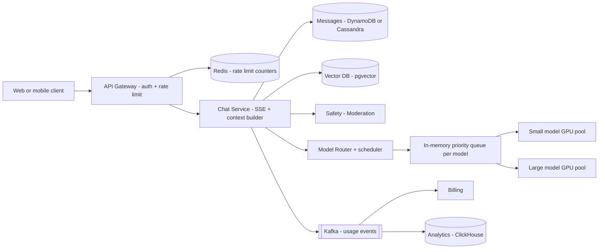
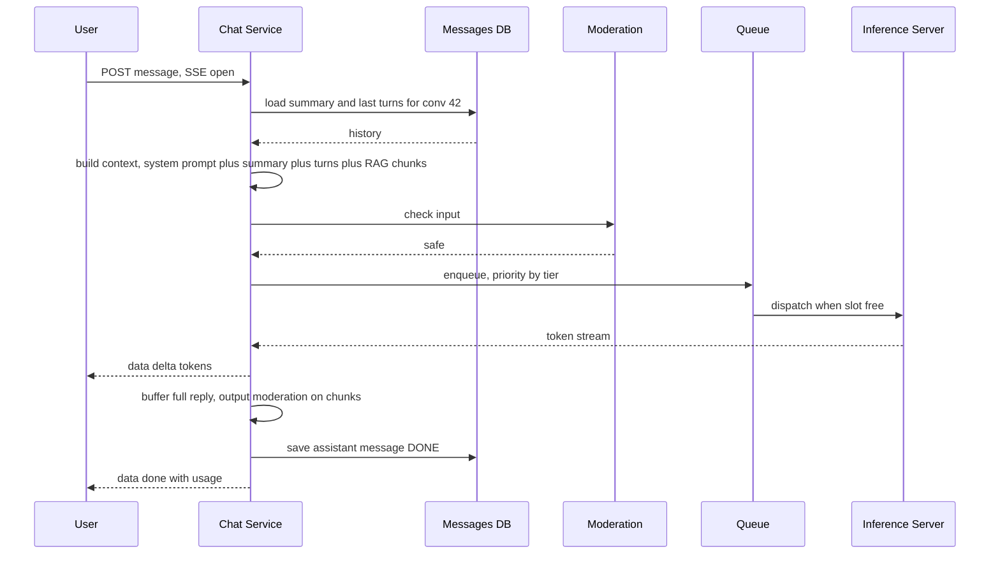

# Design a ChatGPT-style LLM Chat App

**Ek line me:** user message bhejta hai, LLM jawab **token by token stream** karta hai, aur poori conversation save hoti hai. Core challenge ye hai ki **GPU mehenga aur limited hai**, isliye queueing, rate limits, caching aur routing se usse sahi use karna.

**Is question me interviewer kya check karta hai:** streaming (SSE), context window management, GPU fleet pe scheduling aur backpressure, per-tier rate limits, cost control, aur safety layer. Ye 2026 me bahut poocha jaane wala question hai.

---

## Step 1: Interviewer se ye confirm karo (3–5 min)

| Tum poochho | Typical jawab | Design pe asar |
|---|---|---|
| "Model hum khud host karenge ya third-party API?" | Khud host, GPU fleet | Inference scheduling design karna hai |
| "Response stream hona chahiye?" | Haan, token by token | SSE, long-lived connections |
| "Conversation history save karni hai? Kitni lambi?" | Haan, unlimited threads | Context window management chahiye |
| "Free aur paid tiers hain?" | Haan, free/plus/enterprise | Per-tier rate limits aur priority queue |
| "File upload / knowledge base (RAG) chahiye?" | Basic RAG | Vector DB + retrieval step |
| "Images, voice, agents/tools?" | Out of scope | Mention karke chhod do |

> **Bolo:** "Main 3 cheezein focus karunga: chat ka streaming flow, GPU capacity ko fairly aur cheaply use karna, aur conversation + context management. Safety aur observability bhi cover karunga."

## Step 2: Requirements

**Functional**
1. Users naya chat shuru karein, message bhejein, aur jawab stream ho
2. Users purani conversations list aur continue kar sakein
3. Users response beech me stop aur regenerate kar sakein
4. Users documents upload karke unke baare me sawal pooch sakein (basic RAG)

**Out of scope:** images, voice, agents/tools, fine-tuning, chat sharing.

**Non-functional (priority order)**
1. **TTFT (time to first token):** p50 < 1s, p99 < 3s paid tiers ke liye
2. **Streaming:** ~30+ tokens/sec per user, smooth
3. **Availability:** 99.9%. Overload me graceful degrade (queue/smaller model/429), crash nahi
4. **Durability:** completed message history lose na ho
5. **Cost:** GPU utilization high, per-query cost kam (GPU hi bill hai)
6. **Safety:** harmful input/output block ho
7. **Scale:** 50M DAU, peak ~20K messages/sec, ~2 lakh concurrent streams

**CAP choice:** conversation history ke liye **availability** + ek conversation me read-your-writes (same partition key). Usage/billing aur rate-limit counters **eventual/approximate** chalenge: rate limiter down ho to fail-open with local limits.

## Step 3: Estimation (sirf jo design badle)

- 50M DAU × 10 messages = 500M/day ≈ **~6K req/sec avg, peak ~20K**.
- Har response ~500 output tokens, ~10 sec stream. Peak pe **~2 lakh concurrent streams** open.
- Ek GPU (H100 class) batching ke saath ~2–3K output tokens/sec deta hai, yaani ek GPU ~50–100 streams. Peak ke liye **~3,000+ GPUs**. GPU cost hi asli bill hai.
- Conversation storage: 500M user + 500M assistant messages × ~1.5KB ≈ **~1.5TB/day** (~0.5PB/saal), ~12K message writes/sec avg + partial checkpoints. Sasta hai, par ek Postgres ke liye bada → DynamoDB/Cassandra.
- Usage events: ~20K/sec peak, aur unke 3 consumers: billing, analytics, abuse detection.

> **Bolo:** "Storage aur API servers sasta hissa hai. Bottleneck aur cost GPU hai, isliye mera design ka bada hissa GPU ko kam aur smartly use karne pe hai: routing, caching, batching, aur rate limits."

## Step 4: Core entities

- **User**: id, tier (`FREE`, `PLUS`, `ENTERPRISE`), token quota
- **Conversation**: id, user_id, title, model, summary, created_at, updated_at
- **Message**: conversation_id, message_id, role (`user`, `assistant`, `system`), content, token_count, status (`STREAMING`, `DONE`, `STOPPED`, `FAILED`)
- **Document chunk** (RAG): id, user_id, doc_id, text, embedding
- **Usage record**: user_id, model, input_tokens, output_tokens, cost, ts

## Step 5: APIs

```http
POST /conversations                                → {conversationId}
GET  /conversations?cursor=...                     → list
GET  /conversations/{id}/messages?cursor=...       → messages
POST /conversations/{id}/messages {content, model?}
     Accept: text/event-stream
     → SSE stream: data: {"delta":"Hello"} ... data: {"done":true,"usage":{...}}
POST /conversations/{id}/messages/{msgId}/stop
POST /files {file}                                  → {fileId} (async indexing)
```

> **Bolo:** "Message POST ka response hi SSE stream hai. WebSocket ki zarurat nahi kyunki stream ek hi direction me hai: server se client. Stop ke liye alag chhoti API."

## Step 6: High-level design

**Simple v1 pehle:** client → Chat Service (SSE) → ek inference server, history ek Postgres me, usage bhi wahi table. Saare FRs chal jaate hain. Par **~2 lakh concurrent streams = ~3,000 GPUs** (→ Model Router + priority queue + admission control), har sawal large model pe 5–10x mehenga (→ small/large routing), **~1.5TB/day messages** (→ DynamoDB/Cassandra), tiers aur abuse (→ gateway rate limit Redis me), aur usage ke 3 consumers (→ Kafka).



**Har component kyun:**
- **API Gateway + Redis:** auth, per-user/tier rate limit (requests/min aur tokens/day). 20K req/sec kai gateway nodes pe, isliye shared counters Redis me. Local in-memory limit se user alag nodes pe limit bypass kar leta.
- **Chat Service:** SSE hold karta hai, tokens forward karta hai, message save karta hai. **Context builder iske andar ek module hai**, alag service nahi: alag scale karne ki koi wajah nahi, sirf ek extra hop hota.
- **Safety / Moderation:** input/output pe chhota classifier model. Alag service kyunki ye apne GPU/CPU pool pe chalta hai aur alag scale hota hai.
- **Model Router + scheduler:** small ya large model chunta hai, aur pools ki KV-cache capacity dekh ke admission karta hai. Cost NFR (5–10x) aur overload NFR isi se.
- **In-memory priority queue (per model):** tier ke hisaab se priority, wait sirf seconds. **Kafka/SQS nahi:** request interactive hai, client SSE pe wait kar raha hai. Durable queue sirf latency add karti, crash pe client retry kar leta hai.
- **DynamoDB/Cassandra:** ~1.5TB/day, ~12K writes/sec, access sirf "ek conversation ke messages in order". Postgres me heavy sharding karni padti.
- **Vector DB (pgvector):** basic RAG, har query `user_id` filter ke saath chhote set pe. Pehle se Postgres hai (accounts), alag Pinecone/Milvus tab jab chunks billions me hon.
- **Kafka → Billing + ClickHouse:** **~20K usage events/sec, 3 independent consumers** (billing, analytics, abuse detection), aur billing bug pe **replay** chahiye. Isliye Kafka, SQS nahi (ek message ek consumer). Latency metrics (TTFT) Prometheus se, Kafka se nahi.

**FR → component:** FR1 → Gateway + Chat Service + Router + GPU pools, FR2 → DynamoDB/Cassandra, FR3 → Chat Service cancel → Router → GPU, FR4 → pgvector + context builder.

## Step 7: Main flow: message bhejna aur stream karna



## Step 8: Data model & DB choice

```
conversations   PK: user_id, SK: updated_at#conv_id     -- list chats newest first
messages        PK: conversation_id, SK: message_id (time-sortable, ULID)
usage           Kafka → ClickHouse/warehouse (analytics + billing)
doc_chunks      Vector DB (pgvector / Pinecone / Milvus), filter by user_id
```

**DynamoDB/Cassandra** messages ke liye: ~1.5TB/day, ~12K writes/sec, simple access pattern (ek conversation ke messages in order), easy horizontal scale. Transactions ki zarurat nahi. User accounts, billing plans aur pgvector chunks Postgres me (chhota, relational). Billing ke liye `token_count` message pe bhi hai, taaki Kafka se aaye usage ko reconcile kar sakein.

## Step 9: Deep dives (interviewer yahin pressure dalega)

### 9.1 Streaming: SSE aur connection handling
**NFR: TTFT + smooth streaming, partial jawab lose na ho.**

- **SSE** (HTTP response jo khula rehta hai, `text/event-stream`). Proxies/CDN friendly, auto-reconnect built-in, sirf server → client. WebSocket overkill hai.
- Chat Service aur inference server ke beech gRPC stream. Chat Service tokens forward karta hai aur saath me buffer karta hai.
- Har ~N tokens pe partial message DB me checkpoint, taaki client disconnect ho to reload pe partial jawab dikhe. Generation background me poora hota rahe ya stop ho, product decision.
- **Stop button:** stop API → Chat Service inference ko cancel signal → GPU slot turant free. Ye cost bachata hai.

**Trade-off:** ~2 lakh long-lived connections ke liye Chat Service nodes pe connection limits aur graceful drain sambhalna padta hai.

### 9.2 Context window management
**NFR: cost + TTFT (har input token ka paisa aur latency).**

Model ka context limited hai (jaise 128K tokens) aur har input token ka paisa aur latency lagti hai.
- **Sliding window / truncation:** system prompt + last K turns jo token budget me fit hon.
- **Summarization:** purani turns ka running summary banao (chhote model se, async), aur `conversation.summary` me rakho. Context = system prompt + summary + recent turns.
- **RAG:** user ke documents chunk karke embeddings vector DB me. Query aaye to query embedding se top 5 chunks lao aur context me daalo. Poora document context me nahi.
- Token budget order: system prompt > current message > RAG chunks > recent turns > summary. Overflow pe neeche wale kaato.
- File upload: S3 + SQS job → embedding worker (retry + DLQ). Ek consumer, task distribution, isliye Kafka ki zarurat nahi.

**Trade-off:** summary sasta hai par lossy. Purani detail kabhi kabhi model bhool jaata hai.

### 9.3 GPU fleet, queueing aur model routing
**NFR: 99.9% availability under overload + GPU cost.**

- **Continuous batching:** inference server ek saath kai requests ko batch me chalata hai, naye requests beech me join karte hain. GPU utilization 2–5x.
- **Admission control:** har model pool ki capacity (KV cache memory) limited. Queue me wait karao, queue bahut lambi ho to free tier ko "high demand, try later" (429) ya chhota model. Backpressure, crash nahi.
- **Priority:** enterprise > plus > free. Free tier ka max queue wait limit ho.
- **Model routing:** chhota classifier ya rules: "hi", simple factual, title generation → small model (10x sasta). Coding/reasoning/lambe sawal → large model. User ne explicit model chuna ho to woh.
- **Autoscaling:** GPU dheere scale hote hain (model load minutes leta hai), isliye queue depth pe scale + daily pattern pe pre-warm. Peak ke liye reserved capacity.

**Trade-off:** free tier ko peak pe kharab experience (429/small model) dete hain taaki paid users ka TTFT bache.

### 9.4 Caching, rate limits, cost aur safety
**NFR: cost, abuse se GPU waste nahi, safety.**

- **Prompt caching (prefix/KV cache):** system prompt aur conversation ka shuru hissa har turn same hota hai. Inference server us prefix ka KV cache rakhe, to agli turn me sirf naye tokens compute. TTFT aur cost dono kam. Isliye same conversation ko **same GPU node pe sticky route** karo.
- **Response cache:** exact same sawal (jaise "what is GST") ke liye semantic cache sirf generic queries pe. Personal chats pe nahi.
- **Rate limits:** token bucket per user per tier, do dimensions: requests/min aur tokens/day. Gateway pe Redis se. Enterprise ke liye org-level quota.
- **Cost control:** max output tokens per tier, routing to small model, stop button pe cancel, prompt caching, usage dashboards aur per-user cost alerts.
- **Safety:** input pe fast classifier (jailbreak, harmful). Output pe streaming ke saath chunks check, unsafe mila to stream rok ke safe message. Abuse users ko flag/ban. PII ko logs me mask.

**Trade-off:** sticky routing se cache hit badhta hai par kuch GPU nodes hot ho sakte hain. Output moderation thoda latency aur cost add karta hai.

## Step 10: Decision table (kya chuna, kyun, kya nahi)

| Decision | Kyun chuna | Kya nahi chuna, kyun |
|---|---|---|
| **SSE** for streaming | One-way stream, simple HTTP, proxies ke saath chalta, auto-reconnect | **WebSocket:** bi-directional chahiye hi nahi, LB/infra complexity zyada. **Polling:** token-by-token feel nahi. Sacrifice: stop ke liye alag POST |
| **In-memory priority queue + admission control** | GPU limited, overload pe graceful degrade, paid users ko priority | **Seedha GPU pe:** spike pe OOM/timeouts. **Kafka/SQS:** interactive request ke liye durability bekar, latency zyada. Sacrifice: router crash pe queued requests client ko retry karni padti hain |
| **Model routing small vs large** | Bahut se sawal simple, 5–10x cost bachat | **Sab large pe:** bill aur latency zyada. **Sab small pe:** hard sawalon pe quality kharab. Sacrifice: galat routing pe kabhi weak jawab |
| **Summary + recent turns** for context | Token cost kam, lambi chats bhi chalti | **Poori history:** context overflow, har turn mehenga. Sacrifice: summary lossy hai |
| **Prefix/KV cache + sticky routing** | Repeat prefix ka compute bachta, TTFT kam | **Random load balancing:** har turn pe poora prefix dobara compute. Sacrifice: hot nodes, uneven load |
| **DynamoDB/Cassandra** for messages | ~1.5TB/day, ~12K writes/sec, simple key access | **Postgres:** is scale pe heavy sharding, joins chahiye nahi. Sacrifice: ad-hoc queries/joins nahi |
| **Kafka** for usage events | ~20K events/sec, 3 consumers, billing ke liye replay | **SQS:** ek message ek consumer, replay nahi. **Sync billing call:** billing slow to chat slow. Sacrifice: Kafka cluster chalane ka ops cost |
| **Redis** for rate limits | Kai gateway nodes pe shared counters, sub-ms | **Local per-node limits:** user nodes badal ke bypass kare. Sacrifice: Redis down pe fail-open, limits approximate |
| **pgvector** for RAG | Basic RAG, per-user chhota set, Postgres pehle se hai | **Pinecone/Milvus:** billions chunks pe sahi, abhi extra system. Sacrifice: bahut bade scale pe migrate karna padega |

## Step 11: Failures & bottlenecks

| Kya fail hua | Kya hoga | Handle kaise |
|---|---|---|
| GPU pool overload | Queue lambi, TTFT badha | Free tier ko small model ya 429, autoscale, enterprise reserved capacity |
| Inference node crash mid-stream | Jawab beech me ruk gaya | Chat Service retry doosre node pe (partial ke baad continue ya regenerate), message `FAILED` mark |
| Client disconnect | Stream tooti | Partial checkpoint DB me, reconnect pe dikhao. Configurable: generation cancel karke GPU free |
| Moderation service down | Safety risk | Fail closed for high-risk categories, ya simple rule-based fallback |
| Vector DB slow | RAG latency | Timeout, bina RAG ke jawab do aur bata do |
| Ek user bot se spam kare | GPU waste | Token bucket rate limit, CAPTCHA, abuse detection |

## Step 12: "Isko aur better kaise karein" (end me khud bolo)

> "Agar aur time ho to main ye improve karunga:"
- **Speculative decoding:** chhota model draft tokens banaye, bada verify kare, tokens/sec 2–3x
- **Multi-region GPU fleet** aur region-aware routing, ek region ki GPU capacity khatam ho to doosre me spill
- **Batch/offline tier:** non-urgent jobs (summaries, evals) off-peak sasti GPU pe
- **Learned router:** quality feedback (thumbs up/down) se train hua router jo better small vs large decide kare
- **Observability:** TTFT p50/p99, tokens/sec, queue wait, GPU utilization, cost per 1K tokens per tier, cache hit rate, aur quality evals dashboards
- **Memory feature:** user ki long-term preferences alag store, context me chhota sa profile

## Step 13: Interviewer ke likely follow-up sawal

- "SSE vs WebSocket kyun?" → stream one-way hai, SSE simple aur HTTP friendly. Stop ke liye alag POST kaafi
- "Conversation context window se bada ho jaye to?" → summary + recent turns + RAG, token budget order se kaato
- "Traffic 5x ho jaye aur GPU nahi hain to?" → admission control, priority queue, free tier ko small model, rate limits tight
- "Cost kaise kam karoge?" → model routing, prompt caching, max tokens, cancel on stop, batching
- "TTFT kya hai aur kaise kam karoge?" → pehla token aane ka time. Queue wait kam, prefix cache, chhota prompt, nearby region
- "Response me harmful content aa jaye to?" → output moderation streaming chunks pe, stream rok ke safe message
- **Senior signal:** khud bolo ki GPU pe concurrency FLOPs se nahi, **KV-cache memory** se limited hai. Admission control KV-cache headroom pe ho, aur sticky routing se bane hot nodes pe fallback (doosre node pe bhejo, prefix cache miss accept karo)

## 2-minute recap (interview se pehle ye padho)

> ChatGPT jaisa app me asli cost aur bottleneck GPU hai. Client message POST karta hai aur response SSE stream hota hai. Chat Service (andar ke context builder se) system prompt + conversation summary + recent turns + pgvector RAG chunks ka context banata hai, input moderation karata hai, aur Model Router se small ya large model chunta hai. Request Router ki in-memory priority queue me jaati hai (tier ke hisaab se, Kafka nahi kyunki request interactive hai), jahan admission control GPU ko overload se bachata hai. Inference servers continuous batching aur prefix KV cache use karte hain, isliye same conversation sticky route hoti hai. Tokens stream hote hain, output moderation chunks pe, aur message DynamoDB/Cassandra me save. Usage events (~20K/sec, 3 consumers, replay chahiye) Kafka se billing aur ClickHouse me. Rate limits per user per tier Redis me: requests/min aur tokens/day. Overload pe graceful degrade: small model, 429 for free tier.

## Checklist

- [ ] SSE streaming flow aur stop button ka GPU cancel bata sakta hoon
- [ ] GPU count ka estimation aur "GPU hi bottleneck hai" samjha sakta hoon
- [ ] Context window ke liye truncation, summarization aur RAG explain kar sakta hoon
- [ ] Priority queue, admission control aur continuous batching samjha sakta hoon
- [ ] Model routing aur prompt caching se cost control bata sakta hoon
- [ ] Per-tier rate limits aur safety layer explain kar sakta hoon
- [ ] HLD diagram 5 min me bana sakta hoon
- [ ] TTFT aur tokens/sec jaise metrics bata sakta hoon
