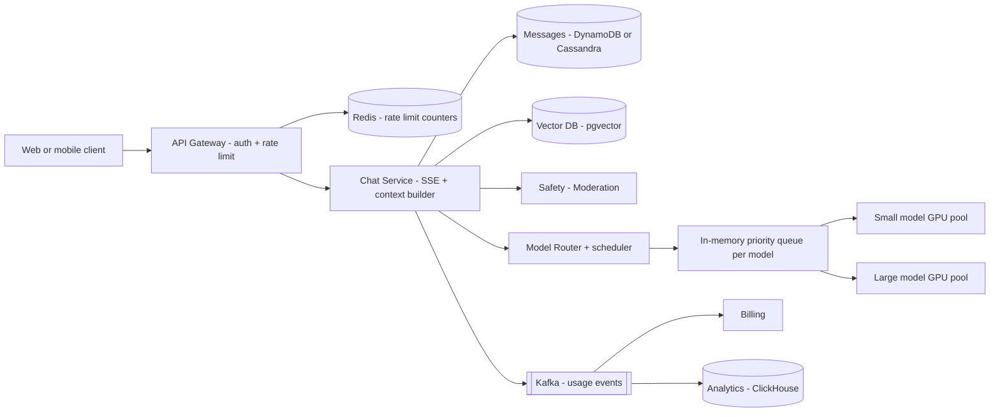
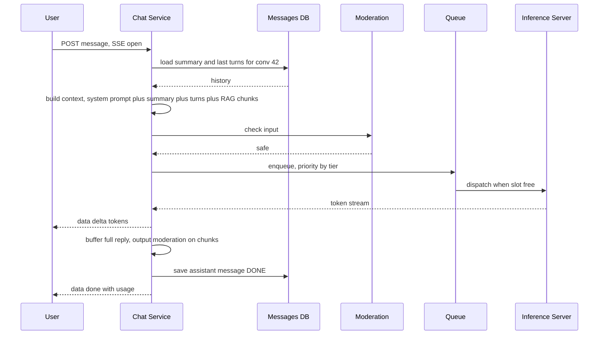

# Design a ChatGPT-style LLM Chat App

**Ek line me:** LLM jawab **token by token stream** kare, conversation save ho. Core challenge: **GPU mehenga aur limited** → queueing, rate limits, caching, routing.

**Is question me interviewer kya check karta hai:** streaming (SSE), context window, GPU scheduling + backpressure, per-tier rate limits, cost control, safety.

---

## Step 1: Interviewer se ye confirm karo (3–5 min)

| Tum poochho | Typical jawab | Design pe asar |
|---|---|---|
| "Model khud host ya third-party API?" | Khud host, GPU fleet | Inference scheduling design karna |
| "Response stream ho?" | Haan, token by token | SSE, long-lived connections |
| "History save? Kitni lambi?" | Haan, unlimited threads | Context window management |
| "Free/paid tiers?" | Haan, free/plus/enterprise | Per-tier rate limits + priority queue |
| "File upload / RAG?" | Basic RAG | Vector DB + retrieval step |

> **Bolo:** "Focus 3 cheezon pe: streaming flow, GPU ka fair aur sasta use, conversation + context management. Saath me safety, observability."

## Step 2: Requirements

**Functional**
1. Naya chat, message bhejna, jawab stream
2. Purani conversations list + continue
3. Response beech me stop + regenerate
4. Documents upload karke sawal (basic RAG)

**Out of scope:** images, voice, agents/tools, fine-tuning, chat sharing.

**Non-functional (priority order)**
1. **TTFT (time to first token):** p50 < 1s, p99 < 3s (paid tiers)
2. **Streaming:** ~30+ tokens/sec per user, smooth
3. **Availability:** 99.9%. Overload → graceful degrade (queue/smaller model/429), crash nahi
4. **Durability:** completed message history lose na ho
5. **Cost:** GPU utilization high, per-query cost kam (GPU hi bill hai)
6. **Safety:** harmful input/output block
7. **Scale:** 50M DAU, peak ~20K messages/sec, ~2 lakh concurrent streams

**CAP choice:** history → **availability** + conversation me read-your-writes (same partition key). Usage/billing + rate-limit counters **eventual/approximate**: rate limiter down → fail-open with local limits.

## Step 3: Estimation (sirf jo design badle)

- 50M DAU × 10 messages = 500M/day ≈ **~6K req/sec avg, peak ~20K**.
- Response ~500 output tokens, ~10 sec stream → peak **~2 lakh concurrent streams**.
- H100-class GPU + batching ≈ 2–3K output tokens/sec ≈ 50–100 streams → peak **~3,000+ GPUs**. GPU hi asli bill.
- Storage: 500M user + 500M assistant messages × ~1.5KB ≈ **~1.5TB/day** (~0.5PB/saal), ~12K writes/sec avg + partial checkpoints. Ek Postgres ke liye bada → DynamoDB/Cassandra.
- Usage events: ~20K/sec peak, 3 consumers: billing, analytics, abuse detection.

> **Bolo:** "Storage, API servers saste hain. GPU bottleneck + cost hai, isliye focus routing, caching, batching, rate limits."

## Step 4: Core entities

- **User**: id, tier (`FREE`, `PLUS`, `ENTERPRISE`), token quota
- **Conversation**: id, user_id, title, model, summary, created_at, updated_at
- **Message**: conversation_id, message_id, role (`user`, `assistant`, `system`), content, token_count, status (`STREAMING`, `DONE`, `STOPPED`, `FAILED`)
- **Document chunk** (RAG): id, user_id, doc_id, text, embedding
- **Usage record**: user_id, model, input_tokens, output_tokens, cost, ts

## Step 5: APIs

```http
POST /conversations                                → {conversationId}
GET  /conversations?cursor=...                     → list
GET  /conversations/{id}/messages?cursor=...       → messages
POST /conversations/{id}/messages {content, model?}
     Accept: text/event-stream
     → SSE stream: data: {"delta":"Hello"} ... data: {"done":true,"usage":{...}}
POST /conversations/{id}/messages/{msgId}/stop
POST /files {file}                                  → {fileId} (async indexing)
```

> **Bolo:** "Message POST ka response hi SSE stream hai. Stream one-way hai, isliye WebSocket nahi; stop ke liye alag chhoti API."

## Step 6: High-level design

**Simple v1:** client → Chat Service (SSE) → ek inference server; history + usage ek Postgres me. FRs chal jaate hain. Kahan tootega:
- **~2 lakh streams = ~3,000 GPUs** → Model Router + priority queue + admission control
- Har sawal large model pe 5–10x mehenga → small/large routing
- **~1.5TB/day messages** → DynamoDB/Cassandra
- Tiers + abuse → gateway rate limit (Redis)
- Usage ke 3 consumers → Kafka



**Har component kyun:**
- **API Gateway + Redis:** auth + per-user/tier limits (requests/min, tokens/day), shared counters across nodes.
- **Chat Service:** SSE hold, tokens forward, message save. **Context builder andar ka module**, alag service nahi (alag scale ki wajah nahi, extra hop).
- **Safety / Moderation:** input/output pe chhota classifier. Alag service: apna GPU/CPU pool, alag scale.
- **Model Router + scheduler:** small vs large chune, pool ki KV-cache capacity dekh ke admission. Cost (5–10x) + overload NFR.
- **In-memory priority queue (per model):** tier priority, wait sirf seconds. **Kafka/SQS nahi:** client SSE pe wait kar raha, crash pe khud retry.
- **Vector DB (pgvector):** RAG, `user_id` filter → chhota set.
- **Kafka → Billing + ClickHouse:** 3 independent consumers + billing bug pe **replay**. TTFT metrics Prometheus se, Kafka se nahi.

**FR → component:** FR1 → Gateway + Chat Service + Router + GPU pools, FR2 → DynamoDB/Cassandra, FR3 → Chat Service cancel → Router → GPU, FR4 → pgvector + context builder.

## Step 7: Main flow: message bhejna aur stream karna



## Step 8: Data model & DB choice

```
conversations   PK: user_id, SK: updated_at#conv_id     -- list chats newest first
messages        PK: conversation_id, SK: message_id (time-sortable, ULID)
usage           Kafka → ClickHouse/warehouse (analytics + billing)
doc_chunks      Vector DB (pgvector / Pinecone / Milvus), filter by user_id
```

- **DynamoDB/Cassandra** messages: access sirf "ek conversation ke messages in order", easy horizontal scale, transactions nahi.
- Accounts, billing plans, pgvector chunks → Postgres (chhota, relational).
- Message pe `token_count` → Kafka usage se billing reconcile.

## Step 9: Deep dives (interviewer yahin pressure dalega)

### 9.1 Streaming: SSE aur connection handling
**NFR: TTFT + smooth streaming, partial jawab lose na ho.**

- **SSE** (`text/event-stream`, khula HTTP response): proxy/CDN friendly, auto-reconnect. Chat Service ↔ inference: gRPC stream, tokens forward + buffer.
- Har ~N tokens pe partial checkpoint → disconnect ke baad reload pe dikhe. Background me poora ya stop: product decision.
- **Stop button:** stop API → inference ko cancel → GPU slot turant free (cost bachat).

**Trade-off:** ~2 lakh long-lived connections → Chat Service nodes pe connection limits + graceful drain.

### 9.2 Context window management
**NFR: cost + TTFT (har input token ka paisa aur latency).**

Context limited (jaise 128K tokens):
- **Sliding window / truncation:** system prompt + last K turns jo budget me fit.
- **Summarization:** purani turns ka running summary (chhota model, async) → `conversation.summary`. Context = system prompt + summary + recent turns.
- **RAG:** docs chunk → embeddings vector DB; query se top 5 chunks context me, poora doc nahi.
- Budget order: system prompt > current message > RAG chunks > recent turns > summary. Overflow → neeche wale kaato.
- File upload: S3 + SQS job → embedding worker (retry + DLQ). Ek consumer, task distribution → Kafka nahi.

**Trade-off:** summary sasta par lossy; purani detail kabhi model bhool jaata hai.

### 9.3 GPU fleet, queueing aur model routing
**NFR: 99.9% availability under overload + GPU cost.**

- **Continuous batching:** kai requests ek batch me, naye beech me join → GPU utilization 2–5x.
- **Admission control:** pool capacity (KV cache memory) limited → queue me wait; bahut lambi → free tier ko 429 ya chhota model. Backpressure, crash nahi.
- **Priority:** enterprise > plus > free; free tier ka max queue wait limit.
- **Model routing:** "hi", simple factual, title generation → small (10x sasta). Coding/reasoning/lambe → large. User ka chuna model → woh.
- **Autoscaling:** model load minutes leta hai → queue depth pe scale, daily pattern pe pre-warm, peak + enterprise ke liye reserved capacity.

**Trade-off:** peak pe free tier ko kharab experience (429/small model), taaki paid TTFT bache.

### 9.4 Caching, rate limits, cost aur safety
**NFR: cost, abuse se GPU waste nahi, safety.**

- **Prompt caching (prefix/KV cache):** system prompt + conversation start har turn same → prefix KV cache, sirf naye tokens compute. Isliye **same GPU node pe sticky route**.
- **Response cache:** semantic, sirf generic queries ("what is GST"), personal chats nahi.
- **Rate limits:** token bucket per user per tier: requests/min + tokens/day, gateway pe Redis. Enterprise → org-level quota.
- **Cost control:** max output tokens per tier, small model routing, stop pe cancel, prompt caching, batching, per-user cost alerts.
- **Safety:** input pe fast classifier (jailbreak, harmful). Output chunks stream ke saath check; unsafe → stream rok, safe message. Abusers flag/ban, logs me PII mask.

**Trade-off:** output moderation → thoda latency + cost.

## Step 10: Decision table (kya chuna, kyun, kya nahi)

| Decision | Kyun chuna | Kya nahi chuna, kyun |
|---|---|---|
| **SSE** for streaming | One-way, simple HTTP, auto-reconnect | **WebSocket:** infra complex. **Polling:** token feel nahi. Sacrifice: stop ke liye alag POST |
| **In-memory priority queue + admission control** | Graceful degrade, paid priority | **Seedha GPU:** spike pe OOM. **Kafka/SQS:** durability bekar, latency. Sacrifice: router crash pe client retry |
| **Model routing small vs large** | 5–10x bachat | **Sab large:** bill + latency. **Sab small:** hard sawal kharab. Sacrifice: galat route → weak jawab |
| **Summary + recent turns** for context | Token cost kam, lambi chats chalein | **Poori history:** overflow, har turn mehenga. Sacrifice: summary lossy |
| **Prefix/KV cache + sticky routing** | Prefix compute bache, TTFT kam | **Random LB:** har turn prefix dobara. Sacrifice: hot nodes |
| **DynamoDB/Cassandra** for messages | ~1.5TB/day, ~12K writes/sec, simple key access | **Postgres:** heavy sharding, joins chahiye nahi. Sacrifice: ad-hoc queries/joins nahi |
| **Kafka** for usage events | ~20K events/sec, 3 consumers, replay | **SQS:** ek consumer, replay nahi. **Sync billing:** billing slow → chat slow. Sacrifice: Kafka ops cost |
| **Redis** for rate limits | Shared counters across gateways, sub-ms | **Local limits:** nodes badal ke bypass. Sacrifice: Redis down → fail-open, approximate |
| **pgvector** for RAG | Per-user chhota set, Postgres pehle se | **Pinecone/Milvus:** billions pe sahi, abhi extra system. Sacrifice: bade scale pe migrate |

## Step 11: Failures & bottlenecks

| Kya fail hua | Kya hoga | Handle kaise |
|---|---|---|
| Inference node crash mid-stream | Jawab beech me ruka | Doosre node pe retry (continue ya regenerate), `FAILED` mark |
| Client disconnect | Stream tooti | Partial checkpoint, reconnect pe dikhao; configurable cancel → GPU free |
| Moderation down | Safety risk | High-risk categories pe fail closed, ya rule-based fallback |
| Vector DB slow | RAG latency | Timeout, bina RAG jawab + user ko batao |
| Bot spam | GPU waste | Token bucket, CAPTCHA, abuse detection |

## Step 12: "Isko aur better kaise karein" (end me khud bolo)

> "Agar aur time ho to main ye improve karunga:"
- **Speculative decoding:** small model draft, large verify → tokens/sec 2–3x
- **Multi-region GPU fleet:** region-aware routing, capacity khatam → doosre region me spill
- **Batch/offline tier:** non-urgent jobs (summaries, evals) off-peak sasti GPU pe
- **Learned router:** thumbs up/down feedback se small vs large better decide
- **Observability:** TTFT p50/p99, tokens/sec, queue wait, GPU utilization, cost per 1K tokens per tier, cache hit rate, quality evals

## Step 13: Interviewer ke likely follow-up sawal

- "Traffic 5x, GPU nahi?" → admission control, priority queue, free tier small model, tight rate limits
- "TTFT kaise kam?" → pehla token ka time: kam queue wait, prefix cache, chhota prompt, nearby region
- **Senior signal:** khud bolo ki GPU pe concurrency FLOPs se nahi, **KV-cache memory** se limited hai. Admission control KV-cache headroom pe ho, aur sticky routing se bane hot nodes pe fallback (doosre node pe bhejo, prefix cache miss accept karo)

## 2-minute recap (interview se pehle ye padho)

> GPU = cost + bottleneck. POST → SSE stream. Chat Service context banaye (system prompt + summary + recent turns + RAG chunks), input moderation, Router small/large chune. In-memory priority queue (tier wise, Kafka nahi) + admission control. Continuous batching + prefix KV cache → sticky routing. Output moderation chunks pe, message DynamoDB/Cassandra me. Usage Kafka → billing + ClickHouse. Redis rate limits: requests/min + tokens/day. Overload → small model, free tier 429.

## Checklist

- [ ] SSE streaming flow aur stop button ka GPU cancel bata sakta hoon
- [ ] GPU count ka estimation aur "GPU hi bottleneck hai" samjha sakta hoon
- [ ] Context window ke liye truncation, summarization aur RAG explain kar sakta hoon
- [ ] Priority queue, admission control aur continuous batching samjha sakta hoon
- [ ] Model routing aur prompt caching se cost control bata sakta hoon
- [ ] Per-tier rate limits aur safety layer explain kar sakta hoon
- [ ] HLD diagram 5 min me bana sakta hoon
- [ ] TTFT aur tokens/sec jaise metrics bata sakta hoon
