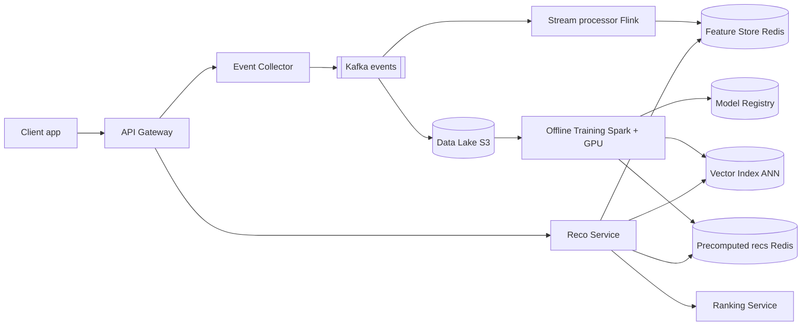
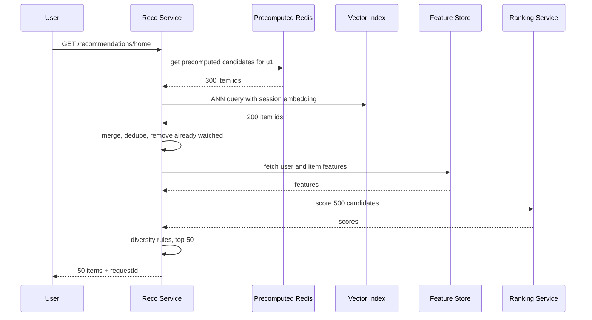
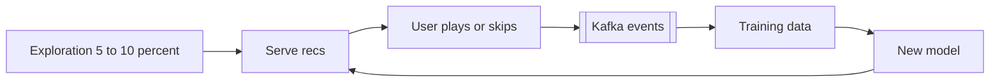

# Design a Recommendation System (YouTube / Spotify / Netflix)

**Ek line me:** user ki history (plays, skips, watch time) se seekh ke usse "aapke liye" list dikhani hai, jo fast ho (< 200ms), fresh ho, aur naye users/naye content ke liye bhi kaam kare.

**Is question me interviewer kya check karta hai:** tum ML ke andar ghuse bina **system parts** design kar sakte ho ya nahi: event pipeline, offline training vs online serving, two-stage architecture (candidate generation → ranking), precompute vs real-time ka trade-off, cold start, aur A/B testing. Interviewer ML PhD nahi dhoondh raha, woh data flow aur latency budget dekhta hai.

---

## Step 1: Interviewer se ye confirm karo (3–5 min)

| Tum poochho | Typical jawab | Design pe asar |
|---|---|---|
| "Kaunsi surface? Home page feed, 'Up next', ya 'similar items'?" | Home feed + Up next | Do alag use-cases: per-user list aur per-item similar list |
| "Catalog kitna bada hai?" | ~10M videos/songs | Saare items rank nahi kar sakte, candidate generation zaroori |
| "Users kitne? Latency target?" | 200M DAU, < 200ms | Precompute + cache + ANN search |
| "Kitna fresh hona chahiye? User ne abhi jo dekha uska asar?" | Session ke andar asar dikhe | Real-time features + online re-ranking |
| "ML model ka internal design karna hai ya system?" | System, model black box maan lo | Training pipeline aur serving pe focus |
| "Experiments chalane hain?" | Haan, A/B testing chahiye | Experiment service + metrics logging |

> **Bolo:** "Main ML model ko black box maan ke chalunga. Focus hoga data pipeline, offline training, two-stage serving (candidates → ranking), caching aur cold start pe. Latency target 200ms rakhunga."

## Step 2: Requirements

**Functional**
1. User home page pe apni personalized list (top 50 items) dekh sake
2. User ek item dekhte waqt "Up next" / similar items dekh sake
3. User ke actions (play, skip, like, watch time) record hon aur usi session me recommendations badlein
4. Naya user aur naya / trending item bhi sensible recommendations me aa sake (cold start)

**Out of scope:** ML model ka internal design, search, ads ranking, content moderation, creator analytics.

**Non-functional (priority order me)**
1. **Latency:** home feed p99 < 200ms at ~40K peak QPS
2. **Availability:** 99.95%, reco fail ho to bhi page khaali na dikhe (popular-items fallback)
3. **Freshness:** session actions ka asar < 1 min me (features), model daily refresh
4. **Scale:** 200M DAU, ~115K events/sec avg, ~300K peak
5. **Consistency:** eventual chalegi, thodi stale list se koi nuksan nahi

**CAP choice:** har jagah **AP**. Stale ya thodi galat list chalegi, khaali page nahi. Koi strong consistency wala data (paisa, booking) is system me nahi hai.

## Step 3: Estimation (sirf jo design badle)

- 200M DAU × ~50 events/day = **10B events/day ≈ 115K events/sec**, peak ~300K/sec. Isliye **Kafka**, direct DB writes nahi.
- Home feed requests: 200M × 5 opens/day = 1B/day ≈ **12K QPS**, peak ~40K. Har request pe heavy model chalana mehenga, isliye **precompute + cache**.
- Catalog 10M items. Har request pe 10M items score karna impossible. **Candidate generation se ~500 items** nikalo, phir unhe rank karo.
- Precomputed list per user: 200M × 100 item IDs × 8 bytes ≈ **160 GB**. Redis cluster me aaram se fit.

> **Bolo:** "10M items ko har request pe score nahi kar sakte. Isliye two-stage design: pehle sasta retrieval 500 candidates nikale, phir heavy ranking model sirf un 500 pe chale."

## Step 4: Core entities

- **User**: id, country, language, signup_time
- **Item**: id (video/song), title, tags, genre, creator_id, duration, upload_time
- **Event**: user_id, item_id, type (`PLAY`, `SKIP`, `LIKE`, `WATCH_PROGRESS`), watch_ms, timestamp, context (device, surface)
- **Embedding**: entity_id, vector (128 floats), model_version
- **Recommendation list**: user_id, item_ids[], scores[], model_version, generated_at
- **Experiment**: id, variants, traffic_split

## Step 5: APIs

```http
GET  /recommendations/home?userId=u1&limit=50       → [{itemId, reason}], requestId
GET  /recommendations/similar?itemId=v9&limit=20    → [{itemId}]
POST /events  [{userId, itemId, type, watchMs, ts, requestId}]   → 202 Accepted
```

> **Bolo:** "Response me `requestId` bhejta hoon. Client wahi events ke saath wapas bhejta hai, taaki pata chale kaunsi recommendation pe click hua. Yahi training ka label banta hai."

## Step 6: High-level design

**Simple v1 pehle:** client → Reco Service → ek Postgres. Events ek table me, raat ko batch job har user ki top 50 ek table me likhe, Reco Service wahi padhe. FR1 chal jaata hai. Par teen numbers isse todte hain: **~300K events/sec peak** (ek DB ka write limit nahi), **session freshness < 1 min** (raat ka batch kaafi nahi), aur **10M items** (har request pe score nahi kar sakte). Neeche har add-on inme se kisi ek ki wajah se hai.



**Har component kyun:**
- **Event Collector + Kafka:** ~300K events/sec peak (NFR4). Kafka isliye ki **teen consumer groups** (Flink, S3 sink, analytics) same stream padhte hain aur feature backfill ke liye **7-day replay** chahiye. SQS me na replay hai na multi-consumer. Collector sirf validate + batch karta hai.
- **Stream processor (Flink):** session freshness < 1 min (NFR3) ke liye real-time features: "last 10 items played", "aaj kitne skips", trending counts. Simpler 15-min batch job session me asar nahi dikhata.
- **Data Lake (S3):** ~1TB/day events (10B × ~100 bytes). Training history sasti storage pe.
- **Offline Training:** daily batch job. Embeddings, ranking model, aur active users ki precomputed list banata hai.
- **Vector Index (FAISS/ScaNN/Milvus):** FR2 aur 10M items. "Is vector ke paas wale items" ANN se ~5ms me. SQL / exact search 10M vectors pe slow.
- **Precomputed recs (Redis):** 40K peak QPS, ~160GB, read < 5ms. Postgres se bhi chalta, par itne QPS pe 30ms retrieval budget Redis safely deta hai.
- **Feature Store (online Redis):** same features training aur serving me (skew nahi). Per-request 500 items ke features batched read, isliye in-memory.
- **Reco Service:** candidates jama karta hai, filter karta hai, ranking ko bhejta hai, fallback sambhalta hai.
- **Ranking Service (alag):** heavy model (GBDT / neural net) 500 candidates score karta hai. Alag kyunki GPU/large-memory machines aur alag model deploys chahiye. Chhote scale pe Reco Service ke andar library kaafi hai.

**FR → component:** FR1 → Reco Service + Precomputed Redis + Ranking. FR2 → Vector Index. FR3 → Kafka + Flink + Feature Store. FR4 → trending (Flink) + content embeddings + exploration slot.

## Step 7: Main flow: home feed serve karna



**Latency budget (200ms):**

| Step | Budget |
|---|---|
| Precomputed fetch + ANN (parallel) | 30ms |
| Filter + dedupe | 10ms |
| Feature fetch (batched) | 30ms |
| Ranking 500 items | 60ms |
| Re-rank + network | 40ms |
| Buffer | 30ms |

## Step 8: Data model & DB choice

```text
events (Kafka → S3 Parquet, partitioned by date/hour)
  user_id, item_id, type, watch_ms, ts, request_id

precomputed recs (Redis)
  key: rec:{user_id}  → list of (item_id, score), TTL 2 days

feature store online (Redis / Cassandra)
  key: uf:{user_id}  → {last_10_items, genre_affinity, skip_rate}
  key: if:{item_id}  → {ctr_24h, avg_watch_pct, age_hours}

item catalog (Postgres / Cassandra) → metadata
vector index (FAISS / Milvus)       → item_id → 128-dim embedding
```

- Events append-only aur huge → Kafka + S3 Parquet. Online features key-value → Redis. Embeddings → ANN index (SQL me "nearest vector" query nahi).

## Step 9: Deep dives (interviewer yahin pressure dalega)

### 9.1 Two-stage: candidate generation → ranking
**NFR:** p99 < 200ms with 10M items.
- **Candidate generation (recall):** sasta, fast, multiple sources se ~500 items. Sources:
  - **Collaborative filtering:** "jinhone tumhare jaisa dekha, unhone ye bhi dekha". User-item interactions se seekhta hai, content ko samajhne ki zarurat nahi.
  - **Content-based:** "tumne Arijit ke gaane sune, ye bhi Arijit ka hai". Item ke tags/genre/audio features se match.
  - **Trending / popular** in user's region.
  - **Subscriptions / followed creators.**
- **Ranking (precision):** heavy model har candidate ka score deta hai: "kitne chance hai user isse 70%+ dekhega". Features: user history, item stats, context (time, device).
- **Re-ranking:** business rules: ek creator ke max 3 items, diversity, already-watched hatao, policy filters.

> **Bolo:** "Retrieval ka kaam hai achhe items miss na hon (recall). Ranking ka kaam hai sahi order (precision). Dono ka cost profile alag hai, isliye alag stages."

**Trade-off:** retrieval me jo item miss hua, ranking use kabhi nahi dekhega. Recall ke liye multiple sources rakhte hain.

### 9.2 Embeddings + ANN search
**NFR:** retrieval < 30ms over 10M items (FR2 + FR1).
- Training me har user aur har item ko ek vector (128 numbers) milta hai. Jo user jo item pasand karta hai, unke vectors paas hote hain (two-tower model).
- Serving pe: user vector lo, vector index me **approximate nearest neighbour** dhoondho. Exact search 10M items pe slow hai, ANN (HNSW / IVF) ~5ms me top 200 de deta hai, thodi accuracy ke badle.
- "Similar items" ke liye: item vector ke paas wale items. Ye bhi precompute karke cache kar sakte ho.
- Item embeddings har training run pe badalte hain. Naya index build karo, phir **atomic swap** (blue-green), taaki serving beech me toote nahi.

**Trade-off:** ~5ms latency ke badle thodi recall loss (ANN kuch true neighbours miss karta hai).

### 9.3 Offline vs online, precompute vs real-time
**NFR:** latency + session freshness dono ek saath.
| Approach | Kaise | Fayda | Nuksan |
|---|---|---|---|
| **Pura precompute** | Raat ko batch job har user ki top 100 Redis me | Serving super fast, sasta | Stale. Aaj ka session ignore |
| **Pura real-time** | Har request pe retrieval + ranking | Fresh | Mehenga, latency risk |
| **Hybrid (chuna)** | Precomputed candidates + session-based ANN + online ranking | Fast + fresh | Thoda complex |

- Inactive users (jo mahine me ek baar aate hain) ke liye precompute waste hai. **Sirf active users** ke liye precompute karo, baaki ke liye on-demand.
- **Feature store** ka main kaam: training aur serving me **same feature logic**. Warna "training-serving skew" hota hai, model offline achha dikhta hai par production me kharab.

**Trade-off:** hybrid me do code paths (batch + online) maintain karne padte hain, badle me speed aur freshness dono.

### 9.4 Cold start, freshness aur feedback loop
**NFR:** freshness < 1 min, aur FR4 (naye users/items).
- **Naya user:** koi history nahi. Signup pe genre/language poochho, region ka trending dikhao, phir pehle 5–10 clicks se session embedding banao.
- **Naya item:** koi interaction nahi, CF kaam nahi karega. **Content-based embedding** (title, tags, audio/video features) se shuru karo, aur **exploration slot** do: har feed me 5–10% jagah naye items ko (bandit style), taaki unhe data mile.
- **Trending:** Flink sliding window (last 1 hour) me per-region play counts, top-K Redis me. Ek candidate source ban jata hai.
- **Feedback loop:** model jo dikhata hai wahi click hota hai, wahi training data banta hai. Popular aur popular hota jata hai. Isliye exploration rakho aur position bias ko training me correct karo.



**Trade-off:** exploration slot short-term watch time thoda kam karta hai, badle me catalog healthy rehta hai.

### 9.5 A/B testing
**NFR:** availability, kharab model se watch time na gire.
- Experiment service user ko hash karke variant deta hai (`hash(userId) % 100 < 5` → model B).
- Reco Service variant ke hisaab se model version chunta hai. Har event me `requestId` + `variant` log hota hai.
- Metrics: watch time per user, CTR, skip rate, 7-day retention. Sirf CTR mat dekho, clickbait jeet jayega.
- Naya model pehle **shadow mode** me (score karo, dikhao mat), phir 1% → 5% → 50% rollout.

**Trade-off:** slow rollout = achha model der se sabko milta hai, par kharab model ka blast radius chhota.

## Step 10: Decision table (kya chuna, kyun, kya nahi)

| Decision | Kyun chuna | Kya nahi chuna, kyun |
|---|---|---|
| **Two-stage** (retrieval → ranking) | 10M items pe heavy model impossible, 500 pe easy | **Single model sab pe:** latency aur cost out of control. Sacrifice: retrieval miss = ranking kabhi nahi dekhegi |
| **Hybrid precompute + online** | Precompute se speed, online se session freshness | **Sirf batch:** stale. **Sirf real-time:** 40K QPS pe mehenga. Sacrifice: do code paths |
| **Kafka** for events | ~300K/sec peak, 3 consumer groups, 7-day replay | **Direct DB writes:** load nahi jhelega. **SQS:** replay aur multi-consumer nahi. Sacrifice: Kafka cluster ops |
| **Flink** real-time features | Session actions ka asar < 1 min | **15-min batch job:** session ke andar asar nahi. Sacrifice: stateful stream job ki complexity |
| **Redis** for precomputed recs + online features | 40K QPS, ~160GB, < 5ms reads | **Postgres:** p99 budget risky. **Cassandra:** sasta par slower tail. Sacrifice: RAM cost, Redis restart pe rebuild |
| **S3 data lake** | ~1TB/day history, sasta, Spark seedha padhe | **Warehouse/DB me raw events:** bahut mehenga. Sacrifice: query ke liye batch latency |
| **ANN vector index** | ms me nearest neighbours, 10M+ items | **Exact search / SQL:** brute force slow. Sacrifice: thodi recall |
| **Feature store** | Training-serving same features | **Har service apna feature code:** skew, bugs. Sacrifice: ek aur platform maintain |
| **Popular-items fallback + exploration slot** | Page kabhi khaali nahi, naye items ko data | **Error dikhana / pure exploitation:** khaali page, naya content upar nahi aata. Sacrifice: thoda kam personalised |

## Step 11: Failures & bottlenecks

| Kya fail hua | Kya hoga | Handle kaise |
|---|---|---|
| Ranking service slow/down | Latency budget toota | Timeout 80ms, phir precomputed order hi return karo |
| Precomputed Redis miss | User ki list nahi mili | On-demand ANN + trending se banao, async precompute trigger |
| Training job fail | Naya model nahi aaya | Purana model chalta rahe (model registry se last good version) |
| Kharab model deploy | Watch time gir gaya | A/B guardrail metrics, auto rollback |
| Kafka lag | Real-time features stale | Consumers scale karo, features me `updated_at` check, purane features pe bhi chalega |
| Hot item (viral video) | Feature store me ek key pe load | Item features local cache me 1 min |

## Step 12: "Isko aur better kaise karein" (end me khud bolo)

> "Agar aur time ho to main ye improve karunga:"
- **Session-based sequence model** (transformer) jo last 20 actions se next item predict kare
- **Multi-objective ranking:** watch time + likes + creator fairness ek saath
- Embeddings ka **incremental update** (hourly) taaki naye items jaldi aayein

## Step 13: Interviewer ke likely follow-up sawal

- "Collaborative filtering aur content-based me farak?" → CF behaviour se seekhta hai (similar users), content-based item ke attributes se. CF cold start me fail, content-based naye items pe kaam karta hai. Dono mix karo.
- "Naya gaana upload hua, kaise recommend hoga?" → content embedding + exploration slot (Step 9.4)
- "User ne abhi 3 songs skip kiye, agla reco badlega?" → haan, Flink real-time feature `recent_skips` update karta hai, ranking usse use karta hai
- "Already watched items kaise hatao?" → user ka recent watched set Redis/bloom filter me, re-ranking me filter
- "Kaise pata naya model behtar hai?" → offline metrics (AUC, recall@K) pehle, phir online A/B test asli judge
- "200ms me kaise fit?" → latency budget table, parallel calls, batched feature fetch, timeouts + fallback
- **Senior signal:** khud bolo ki asli bottleneck ranking compute hai: 40K QPS × 500 candidates = **20M item-scorings/sec** aur utne hi feature lookups. Iska plan: candidates 500 → 300 karna, hot item features local cache me, ranking timeout pe precomputed order fallback, aur inactive users ka precompute band.

## 2-minute recap (interview se pehle ye padho)

> Recommendation system do hisson me bata hai: offline aur online. Client events (play, skip, watch time) Kafka me jaate hain. Kafka se Flink real-time features banata hai (feature store, Redis) aur S3 data lake me history jaati hai. Offline Spark/GPU jobs daily embeddings, ranking model, ANN vector index aur active users ki precomputed lists banate hain. Serving pe two-stage: candidate generation (precomputed list + ANN on session embedding + trending + subscriptions se ~500 items), phir ranking model features ke saath score karta hai, phir re-ranking (diversity, already-watched filter). 200ms latency budget, har stage pe timeout aur popular-items fallback. Cold start ke liye onboarding + content-based embedding + exploration slot. Naye models A/B test aur shadow mode se rollout. Feedback loop ko exploration se todo.

## Checklist

- [ ] Two-stage (candidate generation → ranking) kyun chahiye, numbers ke saath bata sakta hoon
- [ ] Collaborative filtering vs content-based simple words me samjha sakta hoon
- [ ] Event pipeline (Kafka → Flink → feature store, Kafka → S3 → training) draw kar sakta hoon
- [ ] Precompute vs real-time vs hybrid ka trade-off bata sakta hoon
- [ ] Embeddings + ANN search kaise kaam karta hai bata sakta hoon
- [ ] New user aur new item cold start dono handle kar sakta hoon
- [ ] 200ms latency budget aur fallback explain kar sakta hoon
- [ ] A/B testing aur feedback loop ka problem bata sakta hoon
