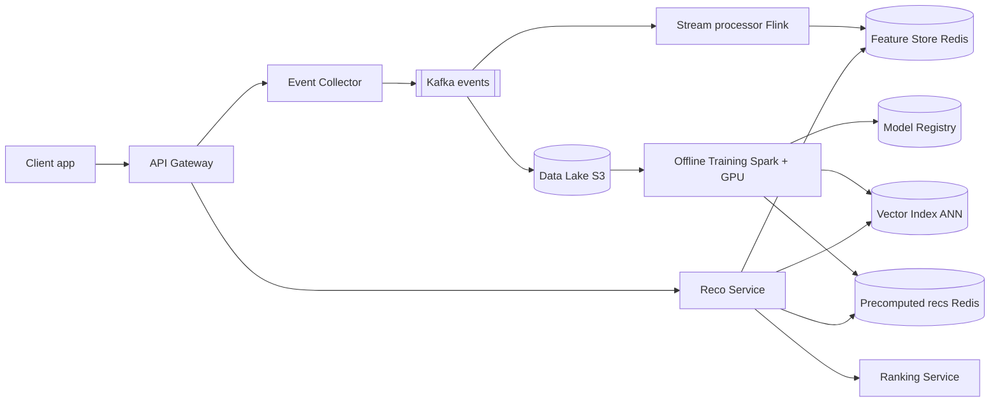
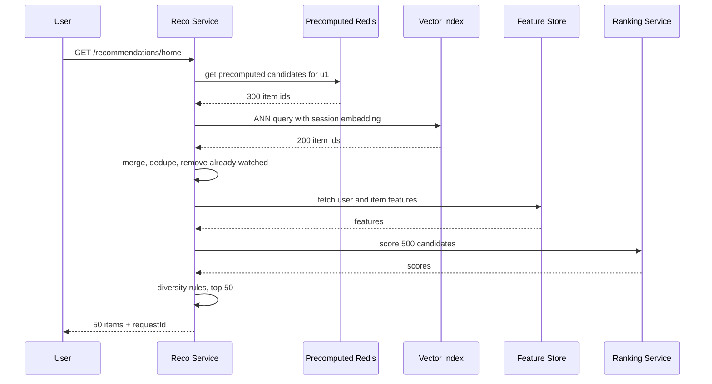
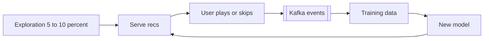

# Design a Recommendation System (YouTube / Spotify / Netflix)

**Ek line me:** history (plays, skips, watch time) se "aapke liye" list: < 200ms, fresh, naye users/content pe bhi.

**Is question me interviewer kya check karta hai:** ML nahi, system: event pipeline, offline training vs online serving, two-stage (candidate generation → ranking), precompute vs real-time, cold start, A/B testing, latency budget.

---

## Step 1: Interviewer se ye confirm karo (3–5 min)

| Tum poochho | Typical jawab | Design pe asar |
|---|---|---|
| "Kaunsi surface? Home feed, 'Up next', 'similar items'?" | Home feed + Up next | Per-user list aur per-item similar list |
| "Catalog kitna bada hai?" | ~10M videos/songs | Sab rank nahi kar sakte → candidate generation |
| "Users kitne? Latency target?" | 200M DAU, < 200ms | Precompute + cache + ANN search |
| "Abhi dekhe item ka asar kab tak?" | Session ke andar | Real-time features + online re-ranking |
| "ML model design karna hai ya system?" | System, model black box | Training pipeline + serving pe focus |
| "Experiments chalane hain?" | Haan, A/B testing | Experiment service + metrics logging |

> **Bolo:** "Model black box. Focus: data pipeline, training, two-stage serving, caching, cold start; target 200ms."

## Step 2: Requirements

**Functional**
1. Home page pe personalized list (top 50 items)
2. Item dekhte waqt "Up next" / similar items
3. Actions (play, skip, like, watch time) record → usi session me recs badlein
4. Naya user aur naya / trending item bhi recs me aaye (cold start)

**Out of scope:** ML model internals, search, ads ranking, content moderation, creator analytics.

**Non-functional (priority order me)**
1. **Latency:** home feed p99 < 200ms at ~40K peak QPS
2. **Availability:** 99.95%, page kabhi khaali nahi (popular-items fallback)
3. **Freshness:** session actions < 1 min (features), model daily
4. **Scale:** 200M DAU, ~115K events/sec avg, ~300K peak
5. **Consistency:** eventual

**CAP choice:** **AP**: stale list chalegi, khaali page nahi (paisa/booking data nahi).

## Step 3: Estimation (sirf jo design badle)

- 200M DAU × ~50 events/day = **10B events/day ≈ 115K/sec**, peak ~300K/sec → **Kafka**, direct DB writes nahi.
- Home feed: 200M × 5 opens/day = 1B/day ≈ **12K QPS**, peak ~40K → har request pe heavy model mehenga → **precompute + cache**.
- Catalog 10M items, har request pe score impossible → **candidate generation se ~500 items**, phir rank.
- Precomputed list: 200M × 100 item IDs × 8 bytes ≈ **160 GB** → Redis cluster me fit.

> **Bolo:** "Two-stage: sasta retrieval 500 candidates, heavy ranking sirf un 500 pe."

## Step 4: Core entities

- **User**: id, country, language, signup_time
- **Item**: id (video/song), title, tags, genre, creator_id, duration, upload_time
- **Event**: user_id, item_id, type (`PLAY`, `SKIP`, `LIKE`, `WATCH_PROGRESS`), watch_ms, timestamp, context (device, surface)
- **Embedding**: entity_id, vector (128 floats), model_version
- **Recommendation list**: user_id, item_ids[], scores[], model_version, generated_at
- **Experiment**: id, variants, traffic_split

## Step 5: APIs

```http
GET  /recommendations/home?userId=u1&limit=50       → [{itemId, reason}], requestId
GET  /recommendations/similar?itemId=v9&limit=20    → [{itemId}]
POST /events  [{userId, itemId, type, watchMs, ts, requestId}]   → 202 Accepted
```

> **Bolo:** "Response me `requestId`; client events ke saath wapas bhejta hai. Isse pata chalta hai kis reco pe click hua, yahi training label hai."

## Step 6: High-level design

**Simple v1:** client → Reco Service → Postgres + nightly top-50 batch. FR1 chalta hai. Todte hain: **~300K events/sec peak**, **freshness < 1 min**, **10M items** per request. Har add-on inme se ek ke liye.



**Har component kyun:**
- **Event Collector + Kafka:** ~300K/sec peak (NFR4), **3 consumer groups** (Flink, S3 sink, analytics), **7-day replay** for backfill. SQS me dono nahi. Collector = validate + batch.
- **Flink:** real-time features (last 10 items, aaj ke skips, trending), < 1 min (NFR3).
- **S3:** ~1TB/day (10B × ~100 bytes), sasti training history.
- **Offline Training:** daily batch → embeddings, ranking model, active users ki precomputed list.
- **Vector Index (FAISS/ScaNN/Milvus):** FR2, ANN ~5ms over 10M.
- **Precomputed recs (Redis):** 40K QPS, ~160GB, < 5ms; 30ms retrieval budget safe.
- **Feature Store (Redis):** training = serving features; 500 items batched, in-memory.
- **Reco Service:** candidates → filter → ranking, fallback.
- **Ranking Service (alag):** GBDT / neural net on 500; GPU/large-memory + alag deploys. Chhote scale pe library kaafi.

**FR → component:** FR1 → Reco Service + Precomputed Redis + Ranking. FR2 → Vector Index. FR3 → Kafka + Flink + Feature Store. FR4 → trending (Flink) + content embeddings + exploration slot.

## Step 7: Main flow: home feed serve karna



**Latency budget (200ms):**

| Step | Budget |
|---|---|
| Precomputed fetch + ANN (parallel) | 30ms |
| Filter + dedupe | 10ms |
| Feature fetch (batched) | 30ms |
| Ranking 500 items | 60ms |
| Re-rank + network | 40ms |
| Buffer | 30ms |

## Step 8: Data model & DB choice

```text
events (Kafka → S3 Parquet, partitioned by date/hour)
  user_id, item_id, type, watch_ms, ts, request_id

precomputed recs (Redis)
  key: rec:{user_id}  → list of (item_id, score), TTL 2 days

feature store online (Redis / Cassandra)
  key: uf:{user_id}  → {last_10_items, genre_affinity, skip_rate}
  key: if:{item_id}  → {ctr_24h, avg_watch_pct, age_hours}

item catalog (Postgres / Cassandra) → metadata
vector index (FAISS / Milvus)       → item_id → 128-dim embedding
```

- Embeddings ANN index me kyunki SQL me "nearest vector" query nahi.

## Step 9: Deep dives (interviewer yahin pressure dalega)

### 9.1 Two-stage: candidate generation → ranking
**NFR:** p99 < 200ms with 10M items.
- **Candidate generation (recall):** sasta, ~500 items from:
  - **Collaborative filtering:** "tumhare jaise users ne ye bhi dekha" (interactions se)
  - **Content-based:** "Arijit sune → ye bhi Arijit ka" (tags/genre/audio)
  - **Trending** in region, **subscriptions / followed creators**
- **Ranking (precision):** P(user 70%+ dekhega). Features: user history, item stats, context (time, device).
- **Re-ranking:** ek creator ke max 3 items, diversity, already-watched hatao, policy filters.

> **Bolo:** "Retrieval = recall, ranking = precision. Cost profile alag, isliye alag stages."

**Trade-off:** retrieval miss = ranking kabhi nahi dekhegi → multiple sources.

### 9.2 Embeddings + ANN search
**NFR:** retrieval < 30ms over 10M items (FR2 + FR1).
- Two-tower model: user/item → 128-dim vector; pasand wale paas.
- User vector → **ANN** (HNSW / IVF): top 200 in ~5ms. Exact search 10M pe slow.
- Similar items = item vector ke neighbours (precompute + cache).
- Har training run: naya index → **atomic swap** (blue-green).

**Trade-off:** ~5ms vs thodi recall loss.

### 9.3 Offline vs online, precompute vs real-time
**NFR:** latency + session freshness ek saath.
| Approach | Kaise | Fayda | Nuksan |
|---|---|---|---|
| **Pura precompute** | Nightly batch, top 100 Redis me | Super fast, sasta | Stale, aaj ka session ignore |
| **Pura real-time** | Har request pe retrieval + ranking | Fresh | Mehenga, latency risk |
| **Hybrid (chuna)** | Precomputed + session ANN + online ranking | Fast + fresh | Thoda complex |

- Precompute **sirf active users**; monthly users on-demand.
- **Feature store:** same feature logic, warna training-serving skew (offline achha, prod kharab).

**Trade-off:** do code paths (batch + online).

### 9.4 Cold start, freshness aur feedback loop
**NFR:** freshness < 1 min, FR4.
- **Naya user:** signup pe genre/language, region trending, pehle 5–10 clicks → session embedding.
- **Naya item:** CF nahi chalega → **content embedding** (title, tags, audio/video) + **exploration slot** (5–10% feed, bandit style).
- **Trending:** Flink 1-hour sliding window, per-region counts, top-K Redis → candidate source.
- **Feedback loop:** jo dikha wahi click → wahi training data → popular aur popular. Fix: exploration + position-bias correction.



**Trade-off:** short-term watch time thoda kam, catalog healthy.

### 9.5 A/B testing
**NFR:** availability, kharab model se watch time na gire.
- Variant by hash: `hash(userId) % 100 < 5` → model B. Reco Service us hisaab se model version chunta hai; har event me `requestId` + `variant`.
- Metrics: watch time per user, CTR, skip rate, 7-day retention. Sirf CTR → clickbait jeetega.
- Naya model pehle **shadow mode** (score, dikhao mat), phir 1% → 5% → 50%.

**Trade-off:** achha model der se, kharab ka blast radius chhota.

## Step 10: Decision table (kya chuna, kyun, kya nahi)

| Decision | Kyun chuna | Kya nahi chuna, kyun |
|---|---|---|
| **Two-stage** (retrieval → ranking) | Heavy model 500 pe, 10M pe nahi | **Single model:** latency/cost. Sacrifice: retrieval miss |
| **Hybrid precompute + online** | Speed + session freshness | **Batch:** stale. **Real-time:** 40K QPS pe mehenga. Sacrifice: do code paths |
| **Kafka** for events | ~300K/sec, 3 consumers, 7-day replay | **Direct DB:** load. **SQS:** no replay. Sacrifice: Kafka ops |
| **Flink** real-time features | Session asar < 1 min | **15-min batch:** session me asar nahi. Sacrifice: stateful job |
| **Redis** for precomputed recs + online features | 40K QPS, ~160GB, < 5ms | **Postgres:** p99 risky. **Cassandra:** slower tail. Sacrifice: RAM, restart pe rebuild |
| **S3 data lake** | ~1TB/day, sasta, Spark-readable | **Warehouse/DB:** mehenga. Sacrifice: batch query latency |
| **ANN vector index** | ms me neighbours, 10M+ | **Exact / SQL:** slow. Sacrifice: thodi recall |
| **Feature store** | Training = serving features | **Per-service code:** skew. Sacrifice: ek aur platform |
| **Popular-items fallback + exploration slot** | Page kabhi khaali nahi, naye items ko data | **Error / pure exploitation:** khaali page, naya content dabta. Sacrifice: kam personalised |

## Step 11: Failures & bottlenecks

| Kya fail hua | Kya hoga | Handle kaise |
|---|---|---|
| Ranking slow/down | Budget toota | Timeout 80ms → precomputed order |
| Precomputed Redis miss | List nahi mili | On-demand ANN + trending, async precompute |
| Training job fail | Naya model nahi | Registry ka last good model |
| Kharab model deploy | Watch time gira | A/B guardrail metrics, auto rollback |
| Kafka lag | Features stale | Consumers scale, `updated_at` check, purane features chalein |
| Hot item (viral video) | Ek key pe load | Item features local cache 1 min |

## Step 12: "Isko aur better kaise karein" (end me khud bolo)

> "Agar aur time ho to main ye improve karunga:"
- **Session-based sequence model** (transformer): last 20 actions se next item
- **Multi-objective ranking:** watch time + likes + creator fairness
- Embeddings ka **incremental update** (hourly), naye items jaldi aayein

## Step 13: Interviewer ke likely follow-up sawal

- "CF vs content-based?" → CF behaviour se, content-based attributes se. CF cold start me fail → dono mix.
- "3 skips ke baad reco badlega?" → haan, Flink `recent_skips` → ranking
- "Already watched kaise hatao?" → Redis/bloom filter set, re-ranking me filter
- "Naya model behtar kaise pata?" → offline (AUC, recall@K) pehle, online A/B asli judge
- **Senior signal:** asli bottleneck ranking: 40K QPS × 500 = **20M item-scorings/sec** + utne feature lookups. Plan: candidates 500 → 300, hot features local cache, timeout pe precomputed order, inactive users ka precompute band.

## 2-minute recap (interview se pehle ye padho)

> Events → Kafka → Flink features (Redis) + S3. Daily Spark/GPU: embeddings, ranking model, ANN index, active users ki precomputed lists. Serving: ~500 candidates (precomputed + session ANN + trending + subs) → ranking → re-ranking. 200ms, har stage timeout + popular fallback. Cold start: onboarding + content embedding + exploration. Models: shadow + A/B.

## Checklist

- [ ] Two-stage (candidate generation → ranking) kyun chahiye, numbers ke saath bata sakta hoon
- [ ] Collaborative filtering vs content-based simple words me samjha sakta hoon
- [ ] Event pipeline (Kafka → Flink → feature store, Kafka → S3 → training) draw kar sakta hoon
- [ ] Precompute vs real-time vs hybrid ka trade-off bata sakta hoon
- [ ] Embeddings + ANN search kaise kaam karta hai bata sakta hoon
- [ ] New user aur new item cold start dono handle kar sakta hoon
- [ ] 200ms latency budget aur fallback explain kar sakta hoon
- [ ] A/B testing aur feedback loop ka problem bata sakta hoon
