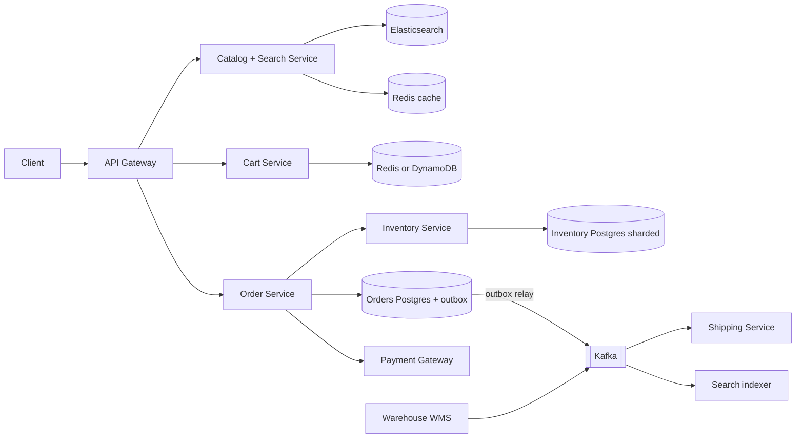
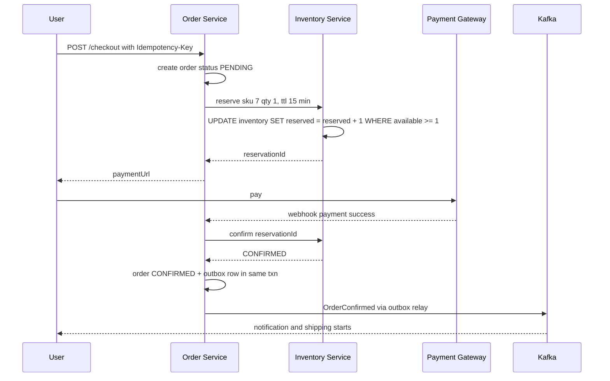
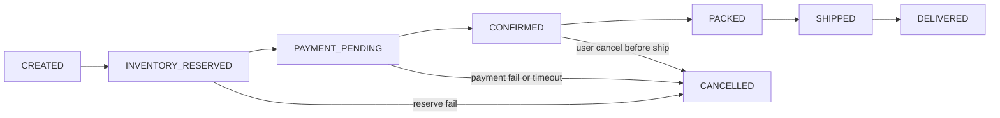

# Design E-commerce Inventory & Orders (Amazon / Flipkart)

**Ek line me:** users products browse karte hain, cart me daalte hain, checkout karte hain. Core challenge ye hai ki **jo stock hai hi nahi woh bik na jaaye (oversell)**, aur order, payment, inventory, shipping jaise alag services ke beech data consistent rahe.

**Is question me interviewer kya check karta hai:** read path (catalog, search, cache) aur write path (inventory, orders) ko alag kaise sochte ho, reservation with TTL, oversell prevention, saga + compensation, outbox pattern, aur kahan eventual consistency chalegi vs kahan strong chahiye.

---

## Step 1: Interviewer se ye confirm karo (3–5 min)

| Tum poochho | Typical jawab | Design pe asar |
|---|---|---|
| "Scope me catalog, cart, checkout, inventory, order tracking? Payment gateway third-party?" | Haan, payment third-party | Payment ka internal design nahi |
| "Multiple warehouses hain? Stock per warehouse track hoga?" | Haan, 50+ warehouses | Inventory key = (sku, warehouse) |
| "Oversell bilkul nahi chalega?" | Nahi chalega (thoda buffer ok) | Checkout pe strong consistency |
| "Product page pe 'In stock' thoda stale chalega?" | Haan, kuch seconds | Cache + search index, eventual |
| "Checkout ke time stock kitni der hold karein?" | 10–15 min | Reservation TTL |
| "Flash sale (Big Billion Days) scope me hai?" | Normal flow pe focus, spike ka mention karo | Flash sale alag deep dive, link karo |

> **Bolo:** "Main read path aur write path alag rakhunga. Browse/search eventual consistent aur cached. Checkout pe inventory reservation strong consistent. Order, payment, inventory, shipping ke beech saga use karunga."

## Step 2: Requirements

**Functional**
1. Product search aur product page (price, details, "In stock" badge)
2. Cart me add/remove
3. Checkout: stock reserve → payment → order confirm
4. Order state track ho (placed, packed, shipped, delivered, cancelled)
5. Warehouse se stock updates (inward, damage, returns) system me aayein

**Non-functional**
- **No oversell:** checkout path pe strong consistency
- **High availability:** browse aur cart hamesha chalein (99.99%)
- **Low latency:** product page < 200ms, checkout < 2s (payment ke alawa)
- **Read-heavy:** ~100:1 browse vs order
- **Durability:** ek bhi confirmed order lost nahi

## Step 3: Estimation (sirf jo design badle)

- 50M DAU × 20 page views = **1B reads/day ≈ 12K QPS**, peak 5x ≈ 60K. Catalog cache + CDN zaroori.
- Orders: 5M/day ≈ **60 orders/sec**, sale day pe 10x ≈ 600/sec. Normal SQL sambhal lega, sharding by sku/warehouse se aur.
- Catalog: 100M SKUs × 5KB ≈ **500 GB**. Elasticsearch + document store.
- Hot SKU (naya iPhone) pe ek hi row pe hazaron writes/sec ho sakte hain. **Asli problem contention hai**, throughput nahi.

> **Bolo:** "Average order rate chhota hai. Do cheezein mushkil hain: read scale, jo cache se solve hota hai, aur ek hot SKU pe contention, jo conditional update aur reservation se."

## Step 4: Core entities

- **Product / SKU**: sku_id, title, attributes, price, seller_id
- **Inventory**: sku_id, warehouse_id, total, reserved, version
- **Reservation**: id, order_id, sku_id, warehouse_id, qty, status (`HELD`, `CONFIRMED`, `RELEASED`), expires_at
- **Cart**: user_id, items[{sku_id, qty}]
- **Order**: id, user_id, items, amount, status, idempotency_key
- **Shipment**: id, order_id, warehouse_id, status, tracking_id

`available = total - reserved` hai, alag column nahi.

## Step 5: APIs

```http
GET    /products/search?q=iphone&pincode=411001       → list + inStock badge
GET    /products/{sku}?pincode=411001                 → details, price, availability
POST   /cart/items        {sku, qty}                  → cart
POST   /checkout          {cartId, addressId}         → {orderId, reservationExpiresAt, paymentUrl}
       Header: Idempotency-Key: <uuid>
POST   /payments/webhook  {orderId, paymentId, status} → 200
GET    /orders/{orderId}                              → status timeline
POST   /orders/{orderId}/cancel                       → status
```

> **Bolo:** "Checkout stock reserve karta hai aur payment URL deta hai. Order confirm payment webhook pe hota hai. Isliye checkout pe Idempotency-Key, taaki double click pe do orders na banein."

## Step 6: High-level design



**Har component kyun:**
- **Catalog + Search:** read-heavy. Elasticsearch me full-text + filters, product page Redis/CDN se.
- **Cart Service:** high-write, low-value data. Redis/DynamoDB, per-user key. Cart me stock reserve **nahi** hota.
- **Order Service:** saga orchestrator. Order state machine yahin.
- **Inventory Service:** stock ka single source of truth. Reservation, confirm, release yahin. Sharded by sku_id.
- **Outbox + Kafka:** DB write aur event publish atomic. Shipping, search indexer, notifications events se chalte hain.
- **Warehouse WMS:** physical stock changes (inward, damage, returns) events bhejta hai.

## Step 7: Main flow: checkout to order confirm



## Step 8: Data model & DB choice

```sql
inventory(sku_id, warehouse_id, total INT, reserved INT, version INT,
          PRIMARY KEY(sku_id, warehouse_id), CHECK (reserved <= total))
reservations(id PK, order_id, sku_id, warehouse_id, qty, status, expires_at,
             INDEX(status, expires_at))
orders(id PK, user_id, status, amount, payment_id UNIQUE, idempotency_key UNIQUE, created_at)
order_items(order_id, sku_id, qty, price)
outbox(id PK, aggregate_id, event_type, payload JSON, created_at, published BOOL)
```

- **Inventory + Orders → Postgres/MySQL:** ACID, conditional updates, unique constraints. Inventory shard key `sku_id`.
- **Catalog → document store (MongoDB/DynamoDB) + Elasticsearch:** flexible attributes, search.
- **Cart → Redis/DynamoDB:** simple key-value, TTL for abandoned carts.

`CHECK (reserved <= total)` aur conditional `WHERE` milke DB level pe oversell rokte hain.

## Step 9: Deep dives (interviewer yahin pressure dalega)

### 9.1 Oversell kaise rokoge?
Option A, **conditional UPDATE** (atomic, simplest):
```sql
UPDATE inventory SET reserved = reserved + :qty
WHERE sku_id = :sku AND warehouse_id = :wh AND total - reserved >= :qty;
-- rows affected = 0  →  out of stock
```
Option B, **optimistic lock** (version column): read row, check, `UPDATE ... SET version = version + 1 WHERE version = :old`. Conflict pe retry. Low contention me achha.

Option C, **pessimistic** `SELECT FOR UPDATE`: chalega par hot SKU pe lock queue lambi ho jaati hai.

> **Bolo:** "Main conditional UPDATE use karunga. Ek hi statement me check aur decrement, DB row lock sirf milliseconds ka. Hot SKU pe bhi safe. Extreme spike (flash sale) ke liye Redis pre-decrement + queue lagaunga, jo [Flash Sale](../02-questions/t2-15-flash-sale.md) me cover hai."

### 9.2 Reservation with TTL: reserve → confirm → release
- **Reserve** (checkout pe): `reserved += qty`, reservation row `HELD`, `expires_at = now + 15 min`.
- **Confirm** (payment success): reservation `CONFIRMED`, `total -= qty`, `reserved -= qty`. Ab stock physically allocated.
- **Release** (payment fail / user cancel / TTL expire): `reserved -= qty`, status `RELEASED`.
- **TTL expiry:** sweeper job har minute `WHERE status = 'HELD' AND expires_at < now()` uthata hai, release karta hai. Ya delay queue (Kafka/SQS delayed message) jo 15 min baad release trigger kare.
- Late payment aaya aur reservation already release ho gaya? Dobara reserve try karo. Stock nahi mila to **auto refund**.
- Cart me reserve kyun nahi? Log hafton tak cart me cheezein rakhte hain. Stock bekar blocked rahega.

### 9.3 Order state machine + saga


Saga (orchestration, Order Service orchestrator hai):

| Step | Action | Compensation agar aage fail ho |
|---|---|---|
| 1 | Order create `CREATED` | Order `CANCELLED` |
| 2 | Inventory reserve | Reservation release |
| 3 | Payment | Refund |
| 4 | Inventory confirm | Stock wapas `total += qty` |
| 5 | Shipment create | Shipment cancel |

- Har step **idempotent** ho (reservationId, paymentId unique), kyunki retries honge.
- Orchestration kyun, choreography kyun nahi? Order flow me 5 steps aur clear order hai. Ek jagah state dikhti hai, debug easy. Choreography me events ka jaal ban jata hai.
- 2PC nahi, kyunki payment gateway external hai aur 2PC me locks lambe pakde rehte hain.

### 9.4 Outbox + events, inventory sync, search updates
- **Dual write problem:** order DB me save hua par Kafka publish fail hua → shipping ko pata hi nahi. Solution **outbox**: same DB transaction me `orders` update + `outbox` row insert. Relay (Debezium CDC ya poller) outbox se Kafka pe publish karta hai. At-least-once, consumers idempotent.
- **Warehouse sync:** WMS events (`STOCK_INWARD`, `DAMAGED`, `RETURN_RESTOCKED`) Kafka pe. Inventory Service apply karta hai (`total += x`) with event id dedupe. Raat ko **reconciliation**: WMS physical count vs DB, mismatch pe alert/adjust.
- **Search index / "In stock" badge:** inventory change pe `StockChanged` event → search indexer Elasticsearch update kare aur Redis cache invalidate. Har unit change pe nahi, sirf **threshold cross** pe (in stock ↔ out of stock ↔ "only 3 left"), warna index pe write storm.

### 9.5 Badge eventual, checkout strong
- Product page ka "In stock" cache/ES se aata hai, kuch seconds stale ho sakta hai. Galat ho to bhi nuksan chhota.
- Checkout pe **final truth Inventory DB** ka conditional update hai. Badge "In stock" bole par reserve fail ho to user ko "Sorry, abhi out of stock ho gaya" dikhao.
- Ye CQRS jaisa hai: write model (inventory DB) strong, read model (ES/cache) eventual.

## Step 10: Decision table (kya chuna, kyun, kya nahi)

| Decision | Kyun chuna | Kya nahi chuna, kyun |
|---|---|---|
| **Conditional UPDATE** for reserve | Atomic check + decrement, short lock, oversell impossible | **Read-then-write app me:** race condition. **SELECT FOR UPDATE:** hot SKU pe lock queue |
| **Reservation with TTL** at checkout | Payment window me stock safe, abandon pe auto release | **Cart me reserve:** stock hafton block. **Payment ke baad check:** oversell + refunds |
| **Saga (orchestration)** | Services alag DB, external payment, compensations clear | **2PC:** external gateway support nahi karta, locks lambe |
| **Outbox + Kafka** | DB update aur event atomic, koi event lost nahi | **Direct publish after commit:** crash pe event miss |
| **Postgres sharded by sku** | ACID + constraints, hot SKUs spread | **Cassandra:** conditional multi-row updates aur constraints kamzor |
| **ES + Redis for catalog** | Search, filters, 60K QPS reads | **Seedha SQL se search:** slow, LIKE typo nahi samajhta |
| **Per-warehouse stock** | Nearest warehouse se ship, accurate allocation | **Single global count:** fulfilment galat, delivery slow |

## Step 11: Failures & bottlenecks

| Kya fail hua | Kya hoga | Handle kaise |
|---|---|---|
| Payment webhook miss | Paisa kata, order PENDING, stock HELD | Reconciliation job gateway se status poochhe, reservation TTL se pehle |
| Inventory Service down | Checkout band | Browse/cart chalte rahein. Multiple replicas, circuit breaker, clear error |
| Sweeper job ruk gaya | Stock bekar HELD | Job ko HA banao, `available` check me expired reservations ignore karo |
| Kafka relay lag | Shipping/search late | Outbox me pending rows ka alert, relay scale |
| Hot SKU | Ek row pe hazaron updates | Stock ko N sub-buckets me split karo, ya flash sale flow (Redis + queue) |
| WMS aur DB mismatch | Oversell ya phantom stock | Nightly reconciliation + safety buffer (1–2 units hold back) |

## Step 12: "Isko aur better kaise karein" (end me khud bolo)

> "Agar aur time ho to main ye improve karunga:"
- **Smart allocation:** pincode ke nearest warehouse se reserve, cost + delivery time ke hisaab se
- **Split shipments:** ek order ke items alag warehouses se
- **Backorder / pre-order** support, jab stock aane wala ho
- Hot SKUs ke liye **inventory buckets** aur Redis front, flash sale pattern
- Order events ka **data warehouse** stream, demand forecasting ke liye

## Step 13: Interviewer ke likely follow-up sawal

- "Do log last unit ek saath kharidein to?" → conditional UPDATE, ek ko 1 row affected, doosre ko 0 → out of stock (Step 9.1)
- "User ne payment nahi kiya to stock ka kya?" → TTL expire, sweeper release, order `CANCELLED`
- "Payment success, par inventory confirm fail?" → saga retry (idempotent). Fir bhi fail to refund + order cancel
- "Order ek warehouse se, doosre me stock tha?" → reserve per (sku, warehouse), allocation logic nearest available chunta hai
- "Order DB save hua, Kafka down tha?" → outbox, relay baad me publish karega
- "Search pe in stock dikha, checkout pe nahi mila?" → expected, badge eventual, checkout strong (Step 9.5)
- "Big Billion Days pe 10 lakh log ek SKU pe?" → [Flash Sale](../02-questions/t2-15-flash-sale.md): Redis atomic decrement, queue, rate limit

## 2-minute recap (interview se pehle ye padho)

> E-commerce me read path aur write path alag hain. Catalog aur search read-heavy: Elasticsearch + Redis + CDN, eventual consistent "In stock" badge. Cart Redis/DynamoDB me, stock reserve nahi karta. Checkout pe Order Service saga chalata hai: order CREATED → Inventory reserve (conditional `UPDATE ... WHERE total - reserved >= qty`, 15 min TTL) → payment → confirm → shipment. Kahin fail ho to compensation: release, refund, cancel. Har step idempotent. Order state machine clear hai. Events outbox pattern se Kafka pe, jisse shipping, search indexer, notifications chalte hain. Inventory per (sku, warehouse), WMS events se sync aur nightly reconciliation. Badge eventual, checkout strong. Extreme spikes ke liye flash sale pattern.

## Checklist

- [ ] Read path (catalog/search) aur write path (inventory/orders) ka split samjha sakta hoon
- [ ] Conditional UPDATE se oversell prevention likh ke dikha sakta hoon
- [ ] Reserve → confirm → release with TTL flow bata sakta hoon
- [ ] Order state machine draw kar sakta hoon
- [ ] Saga steps aur har step ka compensation bata sakta hoon
- [ ] Outbox pattern kyun chahiye aur kaise kaam karta hai bata sakta hoon
- [ ] "In stock" badge eventual vs checkout strong consistency explain kar sakta hoon
- [ ] Warehouse sync aur reconciliation bata sakta hoon
