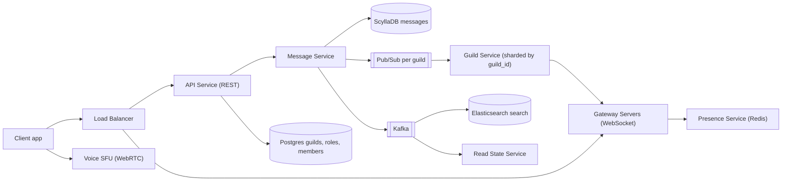
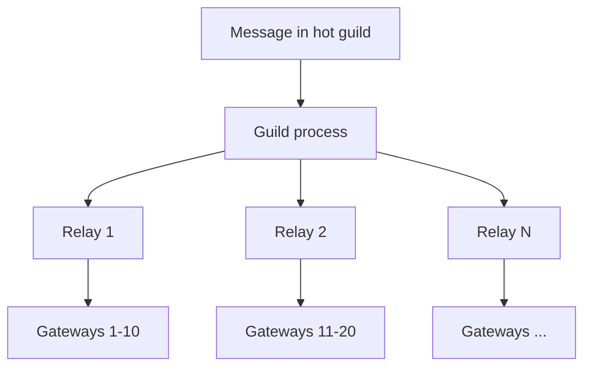

# Design Discord / Slack

**Ek line me:** users servers (guilds) join karte hain, har server me channels hote hain, aur channel me real-time messages aate hain. Core challenge ye hai ki **ek message 1 lakh+ members wale channel me sabko turant dikhe**, aur purani history fast load ho.

**Is question me interviewer kya check karta hai:** WhatsApp se farak samajhna (group bahut bada, history read-heavy), WebSocket gateway design, per-channel fan-out, Cassandra/ScyllaDB partition design, unread counts, aur presence ko scale pe sasta rakhna.

---

## Step 1: Interviewer se ye confirm karo (3–5 min)

| Tum poochho | Typical jawab | Design pe asar |
|---|---|---|
| "Scope me servers, text channels, DMs, mentions? Voice/video?" | Text core, voice high level | Voice ke liye alag SFU path, text pe focus |
| "Ek server me max kitne members? Ek channel kitna bada?" | Kuch servers 10 lakh+ members, channel 1 lakh+ online | WhatsApp jaisa per-user inbox nahi, per-channel fan-out |
| "Message history kitni purani rakhni hai?" | Hamesha, scroll back kar sako | Time-bucketed partitions, cold data cheap storage |
| "Ordering kitni strict?" | Ek channel ke andar ordered | Snowflake ID per message, channel ke andar sort |
| "Unread count aur @mentions chahiye?" | Haan, badge dikhna chahiye | Read state per user per channel |
| "Presence (online/offline) sabka dikhana hai?" | Sirf jo member list visible hai | Lazy presence, sabko broadcast nahi |
| "Search, permissions/roles?" | Haan | Elasticsearch, role bitmask |

> **Bolo:** "Ye WhatsApp se alag hai. WhatsApp me groups chhote hain aur har user ka inbox hota hai. Yahan channels bahut bade hain aur history shared hai, isliye main message ek baar channel me store karunga aur fan-out sirf online logon ko live push ke liye karunga."

## Step 2: Requirements

**Functional**
1. User server banaye/join kare, server me channels hon (text + voice)
2. Channel me message bheje, sabko real-time dikhe
3. Channel history scroll kare (pagination, purana bhi)
4. Unread count aur @mention badges
5. Online presence + typing indicator
6. Roles/permissions (kaun kaunsa channel dekh/likh sakta hai)
7. Message search, voice channels

**Non-functional**
- **Low latency:** message delivery p99 < 300ms
- **Availability > strict consistency:** thoda delay chalega, message khona nahi chahiye
- **Scale:** ~100M MAU, ~10M concurrent WebSocket connections
- **Read-heavy history:** ek message bahut log padhte hain

## Step 3: Estimation (sirf jo design badle)

- ~10M concurrent connections. Ek gateway server ~100K connections → **~100+ gateway servers**. Sticky WebSocket, stateful layer.
- ~5B messages/day ≈ **60K writes/sec** avg, peak 3x. Single SQL DB nahi chalega → Cassandra/ScyllaDB.
- Storage: 5B × 1KB ≈ **5TB/day**, saalon ka data petabytes me. Purana data cold tier pe.
- Fan-out: 1 message × 1 lakh online members = 1 lakh pushes. Ek bada server 1 msg/sec bhi kare to 1 lakh pushes/sec. **Hot guild hi asli problem hai.**

> **Bolo:** "Write throughput ke liye wide-column store chahiye, aur bade channels me fan-out cost message count se nahi, member count se decide hoti hai."

## Step 4: Core entities

- **Guild (server)**: id, name, owner_id, member_count
- **Channel**: id, guild_id, type (`TEXT`, `VOICE`), name, permission_overwrites
- **Member**: guild_id, user_id, role_ids, joined_at
- **Role**: id, guild_id, permissions (bitmask), position
- **Message**: channel_id, bucket, message_id (Snowflake), author_id, content, mentions, attachments
- **ReadState**: user_id, channel_id, last_read_message_id, mention_count

## Step 5: APIs

```http
POST /guilds/{guildId}/channels            {name, type}            → {channelId}
POST /channels/{channelId}/messages        {content, nonce}        → {messageId}
GET  /channels/{channelId}/messages?before=<msgId>&limit=50        → [messages]
POST /channels/{channelId}/ack             {messageId}             → 204
GET  /search?guild=1&q=deploy&author=7                             → [messages]
WS   wss://gateway.app/?v=10   events: MESSAGE_CREATE, TYPING_START, PRESENCE_UPDATE
     client → GUILD_SUBSCRIBE {guildId, channelIds, memberListRange}
```

> **Bolo:** "Send REST se karta hoon (rate limit aur auth simple), aur receive WebSocket gateway se. `nonce` client-generated hai, isse retry pe duplicate message nahi banta."

## Step 6: High-level design



**Har component kyun:**
- **Gateway servers:** long-lived WebSocket connections hold karte hain. Stateful hain, isliye sirf connection + subscription ka kaam, business logic nahi.
- **Message Service:** permission check, Snowflake ID, ScyllaDB me write, fir pub/sub pe publish.
- **Guild Service (sharded by guild_id):** ek guild ka saara state (members, online sessions, kaun kis channel ko dekh raha) ek process me. Yahi decide karta hai kis gateway ko kya bhejna hai.
- **ScyllaDB:** heavy writes, `channel_id + time bucket` partition se history fast.
- **Postgres:** guilds, roles, members. Relational, kam writes.
- **Presence Service:** Redis me user status, sirf subscribed viewers ko push.
- **Kafka → ES / Read State:** search indexing aur mention counts async.
- **Voice SFU:** media alag path pe, text system pe load nahi.

## Step 7: Main flow: channel me message bhejna


Guild Service har gateway ko **ek hi batch** bhejta hai (us gateway ke saare receivers ki list ke saath). 1 lakh individual calls nahi, ~100 calls.

## Step 8: Data model & DB choice

```sql
-- ScyllaDB / Cassandra
messages(
  channel_id bigint, bucket int, message_id bigint,
  author_id bigint, content text, mentions list<bigint>, attachments text,
  PRIMARY KEY ((channel_id, bucket), message_id)
) WITH CLUSTERING ORDER BY (message_id DESC);
-- bucket = message_id timestamp / 10 days

read_states(user_id bigint, channel_id bigint, last_read_id bigint, mention_count int,
  PRIMARY KEY (user_id, channel_id));
```

```sql
-- Postgres
guilds(id PK, name, owner_id)
channels(id PK, guild_id, type, name, position)
members(guild_id, user_id, role_ids[], PRIMARY KEY(guild_id, user_id))
roles(id PK, guild_id, permissions BIGINT, position)
```

- **Snowflake ID** (41-bit time + worker + sequence): globally unique, time-sortable. `ORDER BY message_id` = time order, alag `created_at` index ki zarurat nahi.
- **Time bucket** kyun: bina bucket ke ek busy channel ka partition saalon me GBs ka ho jaata hai (hot, bada partition). 10-day bucket se partition size bounded rehta hai.
- History load: latest bucket se `message_id < before LIMIT 50`, khali ho to pichla bucket.

## Step 9: Deep dives (interviewer yahin pressure dalega)

### 9.1 WhatsApp se kya alag hai? Fan-out kaise?
- WhatsApp: group max ~1K, har message har member ke inbox me copy (fan-out on write). Offline user baad me apna inbox padhta hai.
- Discord: channel me 1 lakh+ members. Har ek ke liye copy = storage explosion. Isliye **message ek baar channel me store**, aur fan-out sirf **online + us guild ke subscribed sessions** ko live push.
- Offline user aaye to channel history `before/after` se padh leta hai. Inbox ki zarurat nahi.
- Guild-based sharding: `guild_id` hash se Guild Service ka ek process (consistent hashing). Saare events us guild ke ek jagah se nikalte hain, ordering simple.

> **Bolo:** "Chhote groups me fan-out on write theek hai, par bade channels me main store once, push to online karta hoon. Offline users pull karte hain."

### 9.2 Hot guilds (10 lakh members wala server)
- Ek Guild process overload ho jaata hai. **Relay layer:** Guild process message ko 10–20 relay nodes ko deta hai, har relay kuch gateways ko sambhalta hai (tree fan-out).
- **Lazy guilds:** bade servers me client ko poori member list nahi bhejte. Client sirf channel aur member list ka visible range subscribe karta hai (`memberListRange 0-99`).
- Typing/presence events bade guilds me **throttle ya band**.
- Per-channel slow mode (1 msg / 10 sec per user) aur message rate limit.



### 9.3 Unread counts aur mentions
- **Unread dot:** client ke paas channel ka `last_message_id` hai. Agar `last_message_id > read_state.last_read_id` to unread. Count store nahi karna padta.
- **Mention badge:** message me `@user` ho to Read State Service (Kafka consumer) us user ka `mention_count++`. `@everyone` bade server me har member ka counter nahi badhate, client side compute ya cap karo.
- User channel kholta hai → `POST /ack` → `last_read_id` update, `mention_count = 0`. Writes batch/debounce karo.

### 9.4 Presence at scale
- Naive: har status change sabke friends + guild members ko → 10 lakh member guild me ek user online hua to 10 lakh events. Impossible.
- **Lazy presence:** sirf un clients ko bhejo jinhone us member list range ko subscribe kiya hai (screen pe dikh raha hai). Baaki ke liye on-demand fetch.
- Heartbeat har ~40 sec. Miss hua to grace period ke baad offline. Redis me `presence:{userId}` with TTL.

### 9.5 Permissions, voice, search (short)
- **Permissions:** role ka `permissions` ek 64-bit bitmask (VIEW_CHANNEL, SEND_MESSAGES...). Effective = guild roles OR, fir channel overwrites (deny/allow) apply. Guild Service me cached, fan-out time pe check.
- **Voice:** client WebRTC se nearest **SFU** media server se connect karta hai. SFU har speaker ka stream forward karta hai (mix nahi karta). Signaling gateway se, media UDP pe SFU se. Text path pe zero load.
- **Search:** Kafka → indexer → Elasticsearch, index sharded by guild_id. Permission filter query time pe (sirf visible channels).

## Step 10: Decision table (kya chuna, kyun, kya nahi)

| Decision | Kyun chuna | Kya nahi chuna, kyun |
|---|---|---|
| **ScyllaDB, partition `(channel_id, bucket)`** | Heavy writes, partition size bounded, range scan fast | **Postgres:** 60K writes/sec aur PBs data pe sharding pain. **Sirf channel_id partition:** hot, unbounded partition |
| **Store once, push to online** | Bade channels me storage aur writes bachte hain | **Per-user inbox (WhatsApp style):** 1 lakh copies per message |
| **Guild-sharded Guild Service** | Ek guild ka state ek jagah, ordering aur permission check simple | **Har gateway sab topics sune:** har gateway pe har message, waste |
| **Snowflake IDs** | Time-sortable, coordination-free, pagination simple | **UUID:** sort nahi hota. **DB auto-increment:** distributed nahi |
| **Lazy presence + member list ranges** | Events sirf visible logon ko | **Broadcast presence:** N² events, bade guild me crash |
| **REST send, WebSocket receive** | Auth, rate limit, retry simple | **Sab WebSocket pe:** gateway stateful aur heavy ho jaata hai |
| **SFU for voice** | Server pe mixing nahi, CPU sasta, scale achha | **MCU:** mixing costly. **P2P mesh:** 5+ log me bandwidth khatam |

## Step 11: Failures & bottlenecks

| Kya fail hua | Kya hoga | Handle kaise |
|---|---|---|
| Gateway server crash | 100K users disconnect | Client exponential backoff + jitter se reconnect, `RESUME` with last sequence se missed events replay |
| Guild Service process down | Us guild ke live events ruk gaye | Dusre node pe restart, state Postgres/cache se rebuild. Clients history fetch karke fill karein |
| Hot guild | Ek process overload | Relay tree, lazy member list, typing/presence off |
| ScyllaDB hot partition | Ek busy channel slow | Time buckets, read cache for latest messages, request coalescing |
| Thundering herd after outage | Sab ek saath reconnect | Jittered backoff, gateway pe connection rate limit |
| Spam / raid | Channel flood | Per-user, per-channel rate limits, slow mode, new-account limits |

## Step 12: "Isko aur better kaise karein" (end me khud bolo)

> "Agar aur time ho to main ye improve karunga:"
- **Data services layer** ScyllaDB ke aage: same channel ki parallel reads ko coalesce karna (Discord ne yahi kiya)
- Purane buckets ko cold storage (S3 + Parquet) pe move karna, latest ScyllaDB me
- Multi-region gateways, users nearest region se connect
- Threads/forum channels: alag sub-channel jaisa model
- Moderation pipeline: Kafka se ML spam/abuse detection
- Mobile push notifications sirf mentions aur DMs ke liye, Notification Service se

## Step 13: Interviewer ke likely follow-up sawal

- "WhatsApp jaisa per-user inbox kyun nahi?" → bade channels me copies explode, store once + online push (Step 9.1)
- "User offline tha, wapas aaya, kya miss hua kaise pata?" → read state ka `last_read_id` vs channel ka latest id, history fetch
- "Message ordering kaise?" → Snowflake ID, ek channel ek guild process se, client ID se sort kare
- "Gateway crash pe events lost?" → session `RESUME` with sequence number, short buffer replay, nahi to history fetch
- "@everyone 10 lakh members pe?" → har counter mat badhao, client compute, bade servers me restrict
- "Partition bada ho gaya to?" → time bucket, 10 din ka
- "Voice kaise scale?" → SFU nodes regionally, ek voice channel ek SFU pe

## 2-minute recap (interview se pehle ye padho)

> Discord ka model guild → channel → message hai. WhatsApp se farak: channels bahut bade aur history shared, isliye message ek baar ScyllaDB me `(channel_id, bucket)` partition aur Snowflake `message_id` clustering ke saath store hota hai. Send REST se, receive WebSocket gateways se. Message Service store karke guild topic pe publish karta hai. Guild Service (sharded by guild_id) jaanta hai kaun online hai aur kaun channel dekh sakta hai, aur har gateway ko batch bhejta hai. Hot guilds ke liye relay tree, lazy member list, typing/presence throttle. Unread = last_message_id > last_read_id, mentions counter Kafka consumer se. Presence lazy, sirf visible members ki. Permissions role bitmask + channel overwrites. Search Elasticsearch via Kafka. Voice WebRTC SFU se, alag path.

## Checklist

- [ ] Discord aur WhatsApp ke fan-out ka farak samjha sakta hoon
- [ ] ScyllaDB partition key `(channel_id, bucket)` aur Snowflake ID kyun, bata sakta hoon
- [ ] Gateway → Guild Service → gateway batch fan-out flow bana sakta hoon
- [ ] Hot guild ke liye relay tree aur lazy member list explain kar sakta hoon
- [ ] Unread count aur mention badge ka logic bata sakta hoon
- [ ] Lazy presence kyun zaroori hai samjha sakta hoon
- [ ] Gateway crash pe RESUME aur reconnect strategy bata sakta hoon
- [ ] Voice ke liye SFU vs MCU vs P2P trade-off bol sakta hoon
