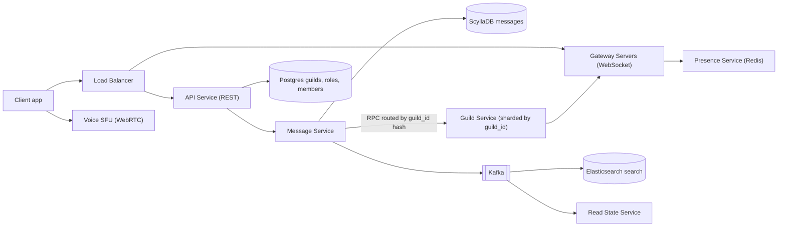
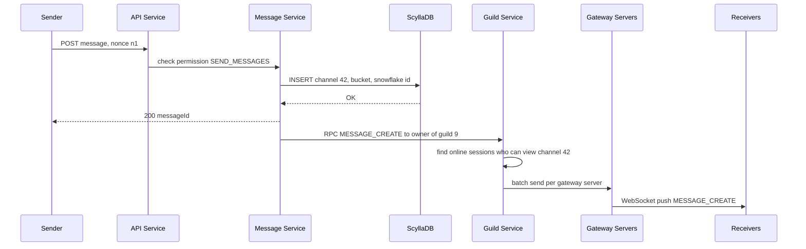
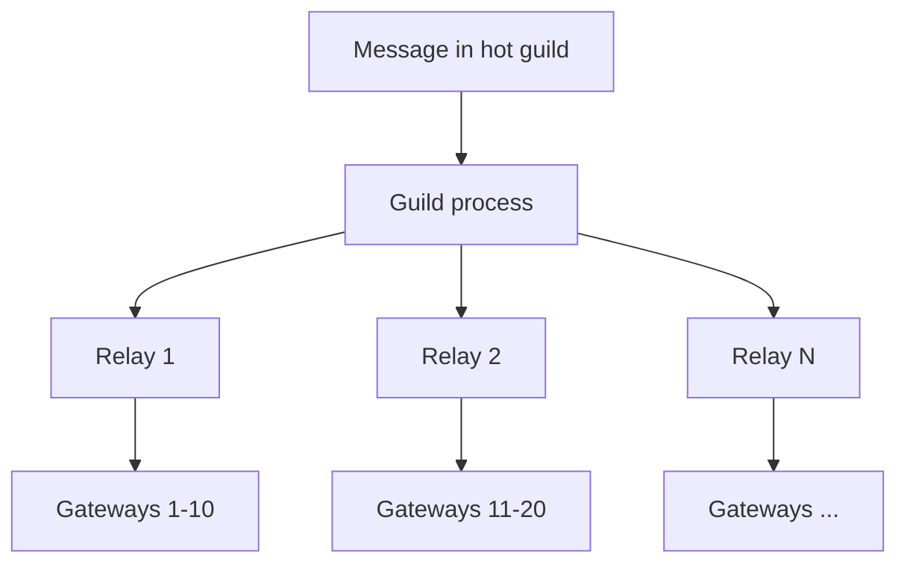

# Design Discord / Slack

**Ek line me:** guild (server) → channels → real-time messages. Core challenge: **1 lakh+ members wale channel me message sabko turant dikhe**, aur purani history fast load ho.

**Is question me interviewer kya check karta hai:** WhatsApp se farak, WebSocket gateway, per-channel fan-out, ScyllaDB partitions, unread counts, sasti presence.

---

## Step 1: Interviewer se ye confirm karo (3–5 min)

| Tum poochho | Typical jawab | Design pe asar |
|---|---|---|
| "Servers, text channels, DMs, mentions? Voice/video?" | Text core, voice high level | Voice ka alag SFU path |
| "Max members per server / channel?" | Kuch servers 10 lakh+, channel 1 lakh+ online | Per-user inbox nahi, per-channel fan-out |
| "History kitni purani?" | Hamesha, scroll back | Time-bucketed partitions, cold data sasta |
| "Ordering kitni strict?" | Channel ke andar ordered | Snowflake ID, channel me sort |
| "Unread aur @mentions?" | Haan, badge chahiye | Read state per user per channel |
| "Sabki presence dikhani hai?" | Sirf visible member list | Lazy presence, broadcast nahi |
| "Search, permissions/roles?" | Haan | Elasticsearch, role bitmask |

> **Bolo:** "WhatsApp me groups chhote, har user ka inbox. Yahan channels bade aur history shared, isliye message ek baar store, live push sirf online logon ko."

## Step 2: Requirements

**Functional**
1. Channel me message bhejo; permission wale sabko real-time dikhe
2. Channel history scroll (pagination, purana bhi)
3. Unread / @mention badges + visible members ki presence
4. Apne servers me search (sirf visible channels)

**Out of scope:** voice/video internals (SFU high level), DMs, threads, bots, file upload, moderation ML.

**Non-functional (priority order me)**
1. **Durability:** acked message kabhi lost nahi
2. **Latency:** online members tak p99 < 300ms
3. **Availability:** 99.99% send/receive, history read-heavy
4. **Scale:** ~100M MAU, ~10M concurrent WebSockets, ~60K msgs/sec avg (peak ~180K)
5. **Ordering:** sirf channel ke andar

**CAP choice:** **AP** + per-channel ordering. Partition me late message chalega, failed send nahi. Strong consistency sirf Postgres metadata (roles, membership).

## Step 3: Estimation (sirf jo design badle)

- ~10M connections ÷ ~100K per gateway → **~100+ gateway servers** (sticky, stateful).
- ~5B msgs/day ≈ **60K writes/sec**, peak 3x → single SQL nahi, Cassandra/ScyllaDB.
- 5B × 1KB ≈ **5TB/day**, saalon me PBs → cold tier.
- Fan-out: 1 msg × 1 lakh online = 1 lakh pushes; 1 msg/sec pe 1 lakh pushes/sec. **Hot guild asli problem.**

> **Bolo:** "Writes ke liye wide-column store; bade channels me fan-out cost member count se tay hoti hai, message count se nahi."

## Step 4: Core entities

- **Guild (server)**: id, name, owner_id, member_count
- **Channel**: id, guild_id, type (`TEXT`, `VOICE`), name, permission_overwrites
- **Member**: guild_id, user_id, role_ids, joined_at
- **Role**: id, guild_id, permissions (bitmask), position
- **Message**: channel_id, bucket, message_id (Snowflake), author_id, content, mentions, attachments
- **ReadState**: user_id, channel_id, last_read_message_id, mention_count

## Step 5: APIs

```http
POST /guilds/{guildId}/channels            {name, type}            → {channelId}
POST /channels/{channelId}/messages        {content, nonce}        → {messageId}
GET  /channels/{channelId}/messages?before=<msgId>&limit=50        → [messages]
POST /channels/{channelId}/ack             {messageId}             → 204
GET  /search?guild=1&q=deploy&author=7                             → [messages]
WS   wss://gateway.app/?v=10   events: MESSAGE_CREATE, TYPING_START, PRESENCE_UPDATE
     client → GUILD_SUBSCRIBE {guildId, channelIds, memberListRange}
```

> **Bolo:** "Send REST se (auth, rate limit simple), receive WebSocket se. Client ka `nonce` retry pe duplicate rokta hai."

## Step 6: High-level design

**Simple v1:** API → Postgres + ek WebSocket server (chhote Slack workspace ke liye theek). Todte hain: **10M connections** → Guild Service routing, **60K writes/sec + PBs** → ScyllaDB, **1 lakh member channels** → store once, **search** → ES.



**Har component kyun:**
- **Gateways:** stateful → sirf connections + subscriptions.
- **Message Service:** permission check, Snowflake ID, ScyllaDB write, Guild Service ko RPC.
- **Guild Service (sharded by guild_id):** guild state (online sessions, kaun kya dekh raha) ek process me, routing yahin. "Har gateway sab sune" = 60K × 100+, waste. Pub/sub nahi: owner consistent hashing se pata, direct RPC.
- **ScyllaDB:** 60K writes/sec (peak 180K), 5TB/day; Postgres = manual sharding pain.
- **Postgres:** guilds, roles, members (relational, strong).
- **Presence (Redis):** 10M × heartbeat/40s ≈ 250K writes/sec, TTL wala ephemeral data.
- **Kafka → ES / Read State:** ~180K/sec, **2 consumer groups** (indexer, mentions), reindex **replay**; SQS me nahi. Produce after Scylla write, retry (ya CDC).
- **Elasticsearch:** full-text over PBs (Scylla nahi karta).
- **Voice SFU:** media alag path.

## Step 7: Main flow: channel me message bhejna



Guild Service har gateway ko **ek batch** (saare receivers ke saath) bhejta hai: 1 lakh calls nahi, ~100.

## Step 8: Data model & DB choice

```sql
-- ScyllaDB / Cassandra
messages(
  channel_id bigint, bucket int, message_id bigint,
  author_id bigint, content text, mentions list<bigint>, attachments text,
  PRIMARY KEY ((channel_id, bucket), message_id)
) WITH CLUSTERING ORDER BY (message_id DESC);
-- bucket = message_id timestamp / 10 days

read_states(user_id bigint, channel_id bigint, last_read_id bigint, mention_count int,
  PRIMARY KEY (user_id, channel_id));
```

```sql
-- Postgres
guilds(id PK, name, owner_id)
channels(id PK, guild_id, type, name, position)
members(guild_id, user_id, role_ids[], PRIMARY KEY(guild_id, user_id))
roles(id PK, guild_id, permissions BIGINT, position)
```

- **Snowflake ID** (41-bit time + worker + sequence): unique + time-sortable, alag `created_at` index nahi chahiye.
- **Time bucket:** bina bucket busy channel ka partition GBs ka; 10-day bucket = bounded.
- History: latest bucket me `message_id < before LIMIT 50`, khali → pichla bucket.

## Step 9: Deep dives (interviewer yahin pressure dalega)

### 9.1 WhatsApp se kya alag hai? Fan-out kaise?
**NFR:** p99 < 300ms, 1 lakh member channels.
- WhatsApp: group ~1K, har inbox me copy (fan-out on write). Discord: 1 lakh+ copies = explosion → **store once**, push sirf **online + subscribed sessions** ko.
- Offline user → history `before/after` se pull.
- `guild_id` hash → ek Guild process; ordering simple.

> **Bolo:** "Chhote groups me fan-out on write; bade channels me store once, push to online. Offline users pull."

**Trade-off:** offline ko inbox nahi; storage N → 1 copy.

### 9.2 Hot guilds (10 lakh members wala server)
**NFR:** hot guild load me bhi latency + availability.
- **Relay layer:** Guild process → 10–20 relays → gateways (tree fan-out).
- **Lazy guilds:** client sirf visible range subscribe kare (`memberListRange 0-99`).
- Bade guilds me typing/presence **throttle ya band**.
- Slow mode (1 msg / 10 sec per user) + rate limit.



**Trade-off:** extra hop (thodi latency), bade guilds me kam typing/presence.

### 9.3 Unread counts aur mentions
**NFR:** badges ke liye har member pe write nahi.
- **Unread dot:** `last_message_id > read_state.last_read_id` → unread; count store nahi.
- **Mention badge:** `@user` → Read State Service (Kafka consumer) `mention_count++`. `@everyone` (bade server): client compute ya cap.
- Channel khola → `POST /ack` → `last_read_id` update, `mention_count = 0`, writes batch/debounce.

**Trade-off:** mention badge async, kuch seconds late.

### 9.4 Presence at scale
**NFR:** presence events N² na hon.
- Naive: 10 lakh guild me ek user online = 10 lakh events.
- **Lazy presence:** sirf visible range subscribers ko; baaki on-demand.
- Heartbeat ~40 sec; miss → grace period ke baad offline. Redis `presence:{userId}` with TTL.

**Trade-off:** off-screen status live nahi.

### 9.5 Permissions, voice, search (short)
**NFR:** sirf allowed log dekhein + FR4.
- **Permissions:** role = 64-bit bitmask (VIEW_CHANNEL, SEND_MESSAGES...). Effective = roles ka OR, phir channel overwrites (deny/allow). Guild Service me cached, fan-out pe check.
- **Voice:** WebRTC se nearest **SFU**; SFU streams forward karta hai, mix nahi. Signaling gateway se, media UDP pe SFU se.
- **Search:** Kafka → indexer → ES (sharded by guild_id), query time pe permission filter.

**Trade-off:** search index seconds peeche.

## Step 10: Decision table (kya chuna, kyun, kya nahi)

| Decision | Kyun chuna | Kya nahi chuna, kyun |
|---|---|---|
| **ScyllaDB, `(channel_id, bucket)`** | 60K writes/sec, bounded, fast range scan | **Postgres:** manual sharding. **Sirf channel_id:** unbounded. Sacrifice: no joins/txns |
| **Store once, push to online** | Storage + writes bachte | **Per-user inbox:** 1 lakh copies. Sacrifice: offline pull |
| **Guild-sharded Guild Service, direct RPC** | State ek jagah, simple ordering | **Sab gateways sunein:** waste. **Pub/sub:** extra hop. Sacrifice: hot guild → relay tree |
| **Kafka for search + mentions** | 180K/sec, 2 consumers, replay | **SQS:** no replay. **Sync:** latency. Sacrifice: Kafka ops |
| **Redis for presence** | 250K heartbeats/sec, TTL offline | **Postgres/Scylla:** durable waste. Sacrifice: restart pe rebuild |
| **Snowflake IDs** | Time-sortable, coordination-free | **UUID:** sort nahi. **Auto-increment:** distributed nahi. Sacrifice: clock skew |
| **Lazy presence + member list ranges** | Events sirf visible logon ko | **Broadcast:** N² events. Sacrifice: off-screen stale |
| **REST send, WebSocket receive** | Auth, rate limit, retry simple | **Sab WebSocket:** gateway heavy. Sacrifice: send pe thodi latency |
| **SFU for voice** | No mixing, CPU sasta | **MCU:** costly. **P2P:** 5+ pe bandwidth khatam. Sacrifice: client download |

## Step 11: Failures & bottlenecks

| Kya fail hua | Kya hoga | Handle kaise |
|---|---|---|
| Gateway crash | 100K disconnect | Jitter backoff, `RESUME` with last sequence → replay |
| Guild process down | Live events ruke | Dusre node pe, Postgres/cache se state; clients history fetch |
| ScyllaDB hot partition | Busy channel slow | Time buckets, latest messages read cache, request coalescing |
| Outage ke baad thundering herd | Sab ek saath reconnect | Jittered backoff, gateway connection rate limit |
| Spam / raid | Flood | Rate limits, slow mode, new-account limits |

## Step 12: "Isko aur better kaise karein" (end me khud bolo)

> "Agar aur time ho to main ye improve karunga:"
- ScyllaDB ke aage **data services layer**: same channel ki parallel reads coalesce (Discord ne yahi kiya)
- Purane buckets cold storage (S3 + Parquet), latest ScyllaDB me
- Multi-region gateways, nearest region
- Kafka se ML spam/abuse moderation

## Step 13: Interviewer ke likely follow-up sawal

- "Offline user ne kya miss kiya?" → `last_read_id` vs channel latest id, phir history fetch
- "Ordering kaise?" → Snowflake ID, channel ek guild process se, client ID se sort
- "Gateway crash pe events lost?" → `RESUME` with sequence, short buffer replay, warna history fetch
- "@everyone 10 lakh members pe?" → har counter nahi, client compute, bade servers me restrict
- "Voice kaise scale?" → regional SFU nodes, ek voice channel ek SFU pe
- **Senior signal:** asli bottleneck **hot guild fan-out** (1 msg × 1 lakh online, ek process pe) + outage ke baad **10M clients ka reconnect storm**. Plan: relay tree, lazy member lists, typing/presence off, jittered backoff + gateway connection rate limit.

## 2-minute recap (interview se pehle ye padho)

> ScyllaDB me store once (`(channel_id, bucket)`, Snowflake). Send REST, receive WebSocket. Message Service → Guild Service (by guild_id) → gateway batches. Hot guilds: relay tree, lazy lists. Unread = id compare, mentions via Kafka. Presence lazy. Search ES. Voice SFU.

## Checklist

- [ ] Discord aur WhatsApp ke fan-out ka farak samjha sakta hoon
- [ ] ScyllaDB partition key `(channel_id, bucket)` aur Snowflake ID kyun, bata sakta hoon
- [ ] Gateway → Guild Service → gateway batch fan-out flow bana sakta hoon
- [ ] Hot guild ke liye relay tree aur lazy member list explain kar sakta hoon
- [ ] Unread count aur mention badge ka logic bata sakta hoon
- [ ] Lazy presence kyun zaroori hai samjha sakta hoon
- [ ] Gateway crash pe RESUME aur reconnect strategy bata sakta hoon
- [ ] Voice ke liye SFU vs MCU vs P2P trade-off bol sakta hoon
