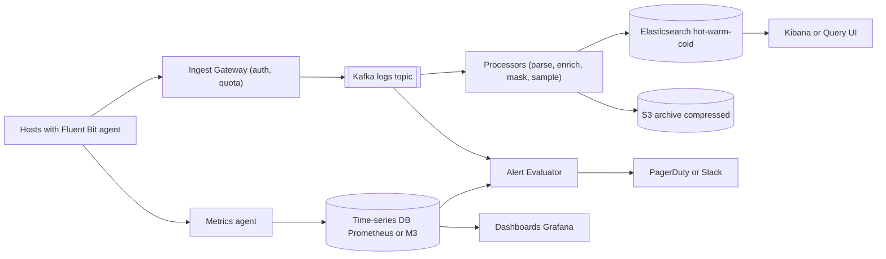
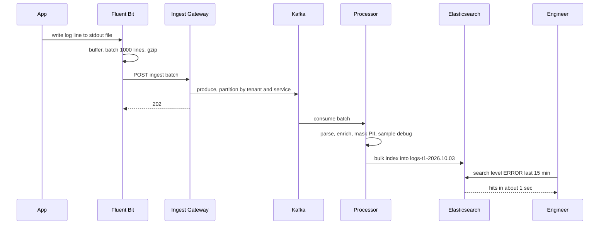
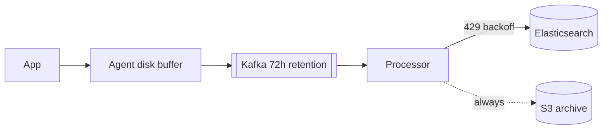

# Design Distributed Logging & Monitoring (ELK / Datadog)

**Ek line me:** hazaron servers ke logs + metrics: collect, search, alert. Challenge: **TBs/day volume**, app pe zero impact, cost control.

**Is question me interviewer kya check karta hai:** Kafka buffer + back-pressure, ES time-based indices, cost tiers, metrics vs logs vs traces, high cardinality.

---

## Step 1: Interviewer se ye confirm karo (3–5 min)

| Tum poochho | Typical jawab | Design pe asar |
|---|---|---|
| "Logs, metrics, traces?" | Logs core + metrics/alerting | Search store + TSDB |
| "Kitne hosts, kitna volume?" | 50K hosts, ~10TB logs/day | Kafka buffer, sharded ES |
| "Search latency? Ingest lag?" | < 2-5 sec, lag < 30 sec | Refresh ~5-10 sec |
| "Retention?" | 7 din fast, 30 din slow, 1 saal archive | Hot/warm/cold + S3 |
| "Kuch logs drop ho sakte?" | Debug haan, error/audit nahi | Level-based sampling |
| "Multi-tenant (Datadog jaisa)?" | Haan | Per-tenant quotas |
| "PII aa sakta hai?" | Haan | Pipeline masking |

> **Bolo:** "Write-heavy, read-light, reads mostly recent. Kafka se decouple, storage time-tiered."

## Step 2: Requirements

**Functional**
1. Agent se logs → parse + enrich → store
2. Search: full-text + fields (service=payments AND level=ERROR, last 15 min)
3. Metrics dashboards (CPU, latency, error rate)
4. Alerts → PagerDuty/Slack (error rate > 5% for 5 min)

**Out of scope:** deep tracing (sirf trace_id link), APM profiling, billing, query UI, ML anomaly detection.

**Non-functional (priority order me)**
1. **App pe zero impact:** logging slow → app slow nahi
2. **Durability:** error/audit kabhi lost nahi (debug sample ho sakta)
3. **Freshness + latency:** lag < 30 sec, last-15-min search p95 < 5 sec
4. **Scale:** ~10TB/day, ~250K events/sec avg, incident pe 5-10x
5. **Cost:** 7 din hot, 30 din slow searchable, 1 saal S3 archive

**CAP choice:** **AP**: ingest hamesha accept, search 10-30 sec late chalega; drop stale se bura.

## Step 3: Estimation (sirf jo design badle)

- 10TB/day ≈ **~120MB/sec** avg, peak ~400MB/sec; 500 bytes/log → **~250K events/sec**, peak ~800K.
- ES overhead ~1.2–1.5x + 1 replica → **~25-30TB/day disk**; 7 din hot ≈ 200TB → 1 saal ES me impossible, S3 archive.
- S3 compressed (~10x) → 1TB/day, 1 saal ≈ 365TB, sasta.
- Kafka 72h: 120MB/sec × 72h ≈ 31TB raw, compressed (~5x) × RF 3 ≈ **~20TB** → 72h, 7 din nahi.
- Incident pe 5-10x volume, tabhi ES pe bhi load → **buffer zaroori.**

> **Bolo:** "Storage cost design drive karta hai: hot SSD, purana sasti disk, saal bhar S3 compressed."

## Step 4: Core entities

- **LogEvent**: timestamp, tenant_id, service, host, level, message, trace_id, attributes (key-value)
- **Metric point**: name, tags (service, host, region), timestamp, value
- **Span (trace)**: trace_id, span_id, parent_id, service, duration
- **Index**: `logs-{tenant}-{yyyy.MM.dd}`, tier (hot/warm/cold)
- **AlertRule**: id, query, threshold, window, channel
- **Tenant**: id, daily_quota, retention_days

## Step 5: APIs

```http
POST /v1/logs/ingest      [ {ts, service, level, msg, attrs} ... ]    → 202
     Header: X-API-Key: <tenant key>, Content-Encoding: gzip
POST /v1/metrics          [ {name, tags, ts, value} ... ]             → 202
GET  /v1/logs/search?q=level:ERROR AND service:payments&from=-15m      → {hits, aggs}
POST /v1/alerts           {query, threshold, window: 5m, notify}      → {alertId}
```

> **Bolo:** "Ingest batch + gzip leta hai, turant 202. Agent ek-ek line nahi bhejta."

## Step 6: High-level design

**Simple v1:** Filebeat → Elasticsearch → Kibana (kuch sau hosts). Todte hain: **800K/sec + incident burst** → Kafka, **10TB/day × 1 saal** → tiers + S3, **metrics** → TSDB, **tenant quotas** → Gateway.



**Har component kyun:**
- **Agent (Filebeat/Fluent Bit):** NFR1: file tail, disk buffer, batch + gzip; app network ka wait nahi karti.
- **Ingest Gateway:** API key auth, per-tenant quota + rate limit.
- **Kafka:** 800K/sec peak, ES down → **72h** safe + **replay**, **2 consumer groups** (processors, alerts).
- **Processors (Vector/Logstash):** CPU-heavy parse/mask/sample, ES se alag scale.
- **Elasticsearch:** 7-30 din search; S3 grep / Athena = minutes.
- **S3 archive:** ES se ~10x sasta. **TSDB:** numbers aggregate ES se sasta + fast.
- **Alert Evaluator:** thresholds TSDB pe, log patterns Kafka stream pe.

## Step 7: Main flow: log line se search tak



## Step 8: Data model & DB choice

```json
// ES index template: logs-{tenant}-{date}
{
  "@timestamp": "date", "tenant_id": "keyword", "service": "keyword",
  "host": "keyword", "level": "keyword", "trace_id": "keyword",
  "message": "text", "attrs": "flattened"
}
// settings: shards based on size (~30-50GB per shard), refresh_interval 10s
```

- **Time-based indices** (daily / 50GB rollover): retention = index drop, doc delete costly.
- `message` = `text`, baaki `keyword` (filter, aggregation). Sab text = double disk.
- **Metrics:** TSDB (Prometheus/M3/VictoriaMetrics), series = name + tags, Gorilla compression. **Traces:** Jaeger/Tempo on object storage.

## Step 9: Deep dives (interviewer yahin pressure dalega)

### 9.1 Back-pressure: ES slow ho gaya to?
**NFR:** app pe zero impact + error logs durable.
- ES slow → Kafka lag badhta; **data safe**, bas late. Processors adaptive bulk; ES `429` → exponential backoff.
- Kafka full → Gateway 429 → agent disk buffer → full → **debug/info pehle drop**, error/audit last.
- App kabhi block nahi: bounded buffer, drop + counter metric.



> **Bolo:** "Har layer pe buffer: agent, Kafka, processor retry. ES down = delayed, lost nahi; S3 se reindex bhi."

**Trade-off:** lambi outage me search late, bahut lambi me debug drop.

### 9.2 Storage tiers, ILM aur cost
**NFR:** cost, 7 din fast + 1 saal archive.
- **Hot (0-2 din):** SSD, indexing + most queries. **Warm (3-7):** HDD, read-only, force-merge 1 segment, kam replicas.
- **Cold/Frozen (7-30):** S3 searchable snapshots. **Archive:** 30 din baad ES se drop, S3 Glacier 1 saal.
- ILM: rollover → move → delete automatic.
- Cost levers: **sampling** (debug 10%, info 50%, error 100%), **compression** (zstd/best_compression), **field drop**, **logs → metrics** (har request log ki jagah count).

**Trade-off:** purane logs slow (cold) ya rehydrate; badle me 5-10x kam cost.

### 9.3 Metrics vs logs vs traces
**NFR:** cost + FR3, har sawal ke liye sasta store.
| | Metrics | Logs | Traces |
|---|---|---|---|
| Kya hai | Numbers over time | Event ka text detail | Request ka services ke across path |
| Sawal | "Error rate badha?" | "Kyun fail hua?" | "Kaunsi service slow?" |
| Cost | Sabse sasta | Mehenga (volume) | Sampled, medium |
| Store | TSDB | Elasticsearch | Jaeger/Tempo |

- `trace_id` se jodo: alert (metric) → trace → us request ke logs. Datadog ki main value yahi.

**Trade-off:** ek ki jagah teen stores operate.

### 9.4 High cardinality aur multi-tenancy
**NFR:** ek tenant ya bura tag sabko down na kare.
- **Cardinality:** tag me `user_id`/`request_id` → crore series → TSDB memory blast. Tags bounded (service, region, status_code); IDs logs/traces me. Per-tenant **series limit** + new-tag alert.
- ES dynamic fields → mapping explosion → `flattened` / field limit (1000).
- **Multi-tenant:** chhote shared indices + `tenant_id`, bade dedicated. Ingest quota + query timeout (noisy neighbour).

**Trade-off:** limits kabhi genuine data/query reject karenge.

### 9.5 Alerting pipeline
**NFR:** alert 1-2 min me, false pages kam.
- **Metric:** har 30-60 sec TSDB query (`error_rate > 5% for 5m`), `for` window = less flapping.
- **Log:** Kafka streaming match (Flink), per-minute ES query se sasta.
- Dedup + grouping (100 hosts → 1 incident), silences, team routing.
- Dead man's switch: heartbeat alert na aaye → page.

**Trade-off:** `for` + dedup se alert ~5 min late, par flapping pages nahi.

## Step 10: Decision table (kya chuna, kyun, kya nahi)

| Decision | Kyun chuna | Kya nahi chuna, kyun |
|---|---|---|
| **Kafka buffer** | 800K/sec, 72h replay, 2 consumers | **Agent → ES:** block/loss. **SQS/RabbitMQ:** mehenga, no replay. Sacrifice: ~20TB Kafka ops |
| **Elasticsearch** for logs | Search in seconds | **ClickHouse/Loki:** sasta, weak free-text. **Athena:** minutes. Sacrifice: indexing cost, disk |
| **Time-based indices + ILM** | Index drop, simple tiering | **Ek bada index:** slow delete. Sacrifice: kai indices |
| **Hot/warm/cold + S3 archive** | 5-10x sasta, recent fast | **Sab SSD 1 saal:** bahut mehenga. Sacrifice: purana slow |
| **Alag TSDB for metrics** | Compressed, fast aggregation | **Metrics ES me:** costly, slow. Sacrifice: ek aur store |
| **Level-based sampling** | Volume kam, errors poore | **Sab rakho:** cost explode. **Random drop:** errors bhi. Sacrifice: kam debug detail |
| **Agent with local buffer** | Zero app impact | **Direct HTTP:** app latency. Sacrifice: host disk |
| **Per-tenant quotas** | Noisy neighbour | **No limits:** ek bug sabko roke. Sacrifice: burst pe 429 |

## Step 11: Failures & bottlenecks

| Kya fail hua | Kya hoga | Handle kaise |
|---|---|---|
| Incident pe log storm | 10x volume | Kafka absorb, info/debug dynamic sampling, tenant 429 |
| Kafka broker down | Partition unavailable | RF 3, error logs ke liye `acks=all` |
| Hot shard (ek service) | ES node overload | Tenant+service partition, alag index, more primaries |
| Mapping explosion | ES master slow | Field limit, `flattened`, schema validation |
| Agent disk full | Logs drop | Low-priority pehle drop, agent health metric |
| Bada query (30 din regex) | Sab slow | Timeout, per-tenant concurrency, cold tier async |

## Step 12: "Isko aur better kaise karein" (end me khud bolo)

> "Agar aur time ho to main ye improve karunga:"
- Columnar log store (ClickHouse/Loki style), sirf labels index; full-text ES se sasta
- Log-to-metric automatic + pattern clustering (ek jaise logs group)
- Tail-based trace sampling: sirf slow/error traces poore
- S3 archive pe on-demand query (Athena jaisa), rehydrate nahi

## Step 13: Interviewer ke likely follow-up sawal

- "Metrics me user_id tag kyun nahi?" → high cardinality, series explosion
- "Logs ka order?" → per host/service approx, timestamp se sort; global order zaroori nahi
- "PII?" → processor me regex/field mask (card, phone, email), allowlist
- "Noisy tenant?" → quotas, dedicated index, query limits
- "30 din purane logs?" → cold tier searchable snapshot ya S3 se rehydrate
- **Senior signal:** worst time = **incident**: 5-10x volume jab search bhi peak, hot nodes pe indexing vs search. Plan: error priority, dynamic sampling, ingest/search capacity alag, logging stack monitored systems pe depend na kare.

## 2-minute recap (interview se pehle ye padho)

> Agent → Gateway (auth, quota) → Kafka (shock absorber) → processors (parse, mask, sample) → ES + S3. ILM: hot → warm → cold → delete. Metrics TSDB, traces Jaeger, trace_id se jude. Alerts TSDB + Kafka, dedup. No high-cardinality tags; tenant quotas.

## Checklist

- [ ] Agent → Kafka → Processor → ES/S3 pipeline bina dekhe bana sakta hoon
- [ ] Kafka buffer aur back-pressure ka poora chain explain kar sakta hoon
- [ ] Time-based indices aur hot/warm/cold ILM kyun, bata sakta hoon
- [ ] Logging cost kam karne ke 4 tareeke bol sakta hoon
- [ ] Metrics vs logs vs traces ka farak aur unhe jodne ka tareeka bata sakta hoon
- [ ] High cardinality problem aur uska fix samjha sakta hoon
- [ ] Multi-tenant isolation (quotas, dedicated indices) explain kar sakta hoon
- [ ] Alerting pipeline me dedup aur flapping handling bata sakta hoon
