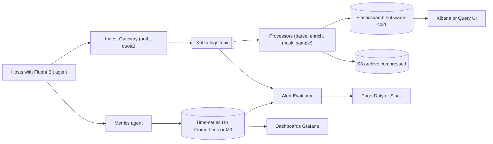
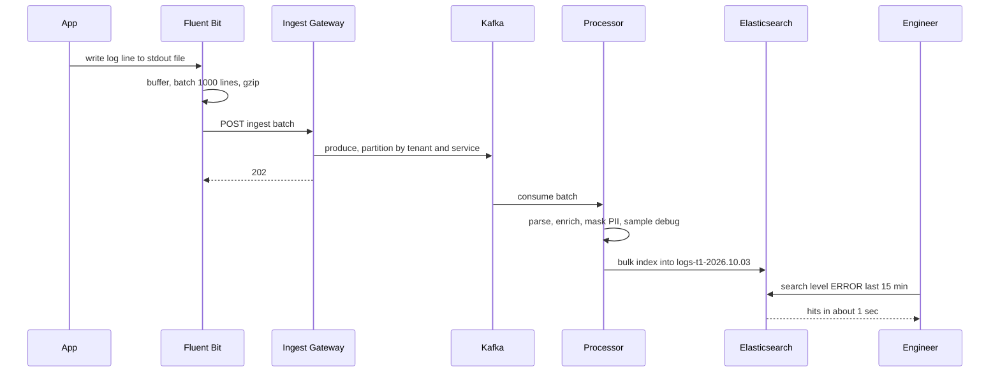
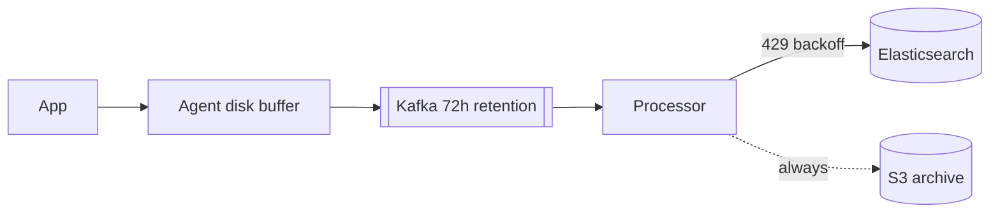

# Design Distributed Logging & Monitoring (ELK / Datadog)

**Ek line me:** hazaron servers se logs aur metrics collect karo, ek jagah store karo, engineers search kar sakein aur kuch galat ho to alert aaye. Core challenge ye hai ki **data volume bahut bada hai (TBs/day)**, ingestion kabhi app ko slow na kare, aur cost control me rahe.

**Is question me interviewer kya check karta hai:** write-heavy pipeline design, Kafka buffer aur back-pressure, Elasticsearch indexing aur time-based indices, hot/warm/cold tiers se cost, metrics vs logs vs traces ka farak, aur high cardinality ki problem.

---

## Step 1: Interviewer se ye confirm karo (3–5 min)

| Tum poochho | Typical jawab | Design pe asar |
|---|---|---|
| "Sirf logs, ya metrics aur traces bhi?" | Logs core, metrics + alerting bhi | Do storage paths: search store + time-series DB |
| "Kitne hosts, kitna volume?" | 50K hosts, ~10TB logs/day | Kafka buffer, sharded ES cluster |
| "Search latency kya chahiye? Log aane ke kitni der baad dikhe?" | Search < 2-5 sec, ingestion lag < 30 sec | Near real-time, refresh interval ~5-10 sec |
| "Retention?" | 7 din fast search, 30 din tak slow search ok, 1 saal archive (compliance) | Hot/warm/cold + S3 archive |
| "Kuch logs drop ho sakte hain?" | Debug logs haan, error/audit nahi | Level-based sampling |
| "Multi-tenant hai (Datadog jaisa) ya internal?" | Multi-tenant | Per-tenant quotas, isolation |
| "PII logs me aa sakta hai?" | Haan | Pipeline me masking |

> **Bolo:** "Ye write-heavy, read-light system hai. Log likhne wale bahut hain, padhne wale kam aur zyada tar recent data padhte hain. Isliye main ingestion ko Kafka se decouple karunga aur storage ko time ke hisaab se tier karunga."

## Step 2: Requirements

**Functional**
1. Services apne logs bhej sakein (agent se), parse + enrich hokar store hon
2. Engineer logs full-text + field se search kar sake (service=payments AND level=ERROR, last 15 min)
3. Engineer metrics dashboards (CPU, latency, error rate) dekh sake
4. Engineer alert rules bana sake aur breach pe PagerDuty/Slack pe notify ho (error rate > 5% for 5 min)

**Out of scope:** tracing ka deep design (sirf trace_id se link), APM profiling, billing, query UI design, ML anomaly detection.

**Non-functional (priority order me)**
1. **App pe zero impact:** logging slow ho to app slow nahi
2. **Durability:** error/audit logs kabhi lost nahi (debug sample ho sakte hain)
3. **Freshness + latency:** ingestion lag < 30 sec, last-15-min search p95 < 5 sec
4. **Scale:** ~10TB/day, ~250K events/sec avg, incident pe 5-10x
5. **Cost:** 7 din hot, 30 din slow searchable, 1 saal S3 archive

**CAP choice:** **AP**. Ingest hamesha accept kare (buffer me), search 10-30 sec peeche ho to chalega. Log drop karna stale search se bura hai.

## Step 3: Estimation (sirf jo design badle)

- 10TB/day ÷ 86,400 ≈ **~120MB/sec** avg, peak ~400MB/sec. Avg log 500 bytes → **~250K events/sec**, peak ~800K/sec.
- ES me index overhead ~1.2–1.5x, replica 1 → 10TB raw ≈ **~25-30TB/day ES disk**. 7 din hot = ~200TB. Isliye 1 saal ES me rakhna impossible, S3 archive.
- S3 compressed (~10x) → 1TB/day, 1 saal ≈ 365TB, sasta.
- Kafka buffer 72h: 120MB/sec × 72h ≈ 31TB raw, compressed (~5x) × RF 3 ≈ **~20TB**. Isliye 72h, 7 din nahi.
- Incident ke time logs 5-10x ho jaate hain, jab ES pe bhi load hota hai. **Buffer zaroori.**

> **Bolo:** "Storage cost hi design drive karta hai. Hot data SSD pe, purana sasti disk pe, aur saal bhar ka data S3 pe compressed."

## Step 4: Core entities

- **LogEvent**: timestamp, tenant_id, service, host, level, message, trace_id, attributes (key-value)
- **Metric point**: name, tags (service, host, region), timestamp, value
- **Span (trace)**: trace_id, span_id, parent_id, service, duration
- **Index**: `logs-{tenant}-{yyyy.MM.dd}`, tier (hot/warm/cold)
- **AlertRule**: id, query, threshold, window, channel
- **Tenant**: id, daily_quota, retention_days

## Step 5: APIs

```http
POST /v1/logs/ingest      [ {ts, service, level, msg, attrs} ... ]    → 202
     Header: X-API-Key: <tenant key>, Content-Encoding: gzip
POST /v1/metrics          [ {name, tags, ts, value} ... ]             → 202
GET  /v1/logs/search?q=level:ERROR AND service:payments&from=-15m      → {hits, aggs}
POST /v1/alerts           {query, threshold, window: 5m, notify}      → {alertId}
```

> **Bolo:** "Ingest API batch aur gzip leta hai aur turant 202 deta hai. Agent ek-ek line nahi bhejta."

## Step 6: High-level design

**Simple v1 pehle:** har host pe Filebeat → seedha Elasticsearch → Kibana. Chhote setup (kuch sau hosts) ke liye yahi kaafi hai. Ise todte hain: **~800K events/sec peak aur incident burst**, jab ES hi slow hota hai (buffer → Kafka), **10TB/day × 1 saal** (tiers + S3), **metrics aggregation** (TSDB), aur **multi-tenant quotas** (Ingest Gateway).



**Har component kyun:**
- **Agent (Filebeat/Fluent Bit):** NFR1. File tail, local disk buffer, batch + gzip. App sirf stdout/file me likhti hai, network ka wait nahi. Simpler "app se direct HTTP" app ko slow karta hai.
- **Ingest Gateway:** multi-tenant API key auth, per-tenant quota aur rate limit. Iske bina ek tenant ka bug sabka ingestion rok de.
- **Kafka:** ~250K events/sec avg, ~800K peak (NFR4). ES slow/down ho to data **72h** tak Kafka me safe, baad me **replay**. **Do consumer groups** (processors, alert stream) same data padhte hain. SQS/RabbitMQ is throughput aur replay ke liye fit nahi.
- **Processors (Vector/Logstash):** CPU-heavy parse, enrich, PII mask, sampling. ES se alag isliye ki inhe independently scale kar sakein.
- **Elasticsearch:** FR2, full-text + field search last 7-30 din. Simpler option (grep on S3 / Athena) minutes leta hai, NFR3 fail.
- **S3 archive:** 1 saal ≈ 365TB compressed, ES pe ye ~10x mehenga.
- **Time-series DB:** FR3. Numbers aggregate karna ES se bahut sasta aur fast.
- **Alert Evaluator:** FR4. Threshold rules TSDB pe, log-pattern rules Kafka stream pe (har minute ES query se sasta).

**FR → component:** FR1 → Agent + Gateway + Kafka + Processors. FR2 → Elasticsearch (+ S3 for old). FR3 → Metrics agent + TSDB + Grafana. FR4 → Alert Evaluator + PagerDuty/Slack.

## Step 7: Main flow: log line se search tak



## Step 8: Data model & DB choice

```json
// ES index template: logs-{tenant}-{date}
{
  "@timestamp": "date", "tenant_id": "keyword", "service": "keyword",
  "host": "keyword", "level": "keyword", "trace_id": "keyword",
  "message": "text", "attrs": "flattened"
}
// settings: shards based on size (~30-50GB per shard), refresh_interval 10s
```

- **Time-based indices** (daily ya rollover at 50GB): purana data delete = poora index drop. Document-by-document delete bahut costly hai.
- `message` = `text` (full-text), baaki = `keyword` (exact filter, aggregation). Har field ko text mat banao, disk double hoti hai.
- **Metrics:** TSDB (Prometheus/M3/VictoriaMetrics). Series = name + tag set, compressed (Gorilla encoding) values.
- **Traces:** Jaeger/Tempo, store by trace_id, object storage pe.

## Step 9: Deep dives (interviewer yahin pressure dalega)

### 9.1 Back-pressure: ES slow ho gaya to?
**NFR:** app pe zero impact + error logs durable.
- ES slow → processors bulk index slow → Kafka consumer lag badhta hai. **Data Kafka me safe hai**, bas search me late dikhega.
- Processors bulk size aur concurrency adaptive rakhte hain. ES `429 Too Many Requests` de to exponential backoff.
- Kafka bhi bhar jaaye (lambi outage) → Gateway tenant ko 429 deta hai → agent local disk buffer me rakhta hai → disk bhi full ho to **debug/info pehle drop**, error/audit last tak rakho.
- App kabhi block nahi honi chahiye. Agent ka buffer bounded, full ho to drop + counter metric.



> **Bolo:** "Har layer pe buffer hai: agent disk, Kafka, processor retry. ES down ho tab bhi logs lost nahi, sirf delayed hain. Aur S3 archive ES se independent hai, wahan se reindex bhi kar sakte hain."

**Trade-off:** lambi outage me search minutes/hours peeche, aur bahut lambi me debug logs drop.

### 9.2 Storage tiers, ILM aur cost
**NFR:** cost, 7 din fast + 1 saal archive.
- **Hot (0-2 din):** SSD nodes, recent data, sabse zyada queries. Indexing yahin hoti hai.
- **Warm (3-7 din):** HDD nodes, read-only, force-merge to 1 segment, replicas kam.
- **Cold/Frozen (7-30 din):** searchable snapshots S3 pe, slow par sasta.
- **Delete / Archive:** 30 din ke baad ES se drop, S3 (Glacier) me 1 saal.
- ILM (Index Lifecycle Management) ye rollover → move → delete automatic karta hai.
- Cost levers: **sampling** (debug 10%, info 50%, error 100%), **compression** (zstd/best_compression), **field drop** (useless fields hatao), **logs se metrics banao** (har request log rakhne ke bajaye count metric).

**Trade-off:** purane logs ki search slow (cold tier) ya rehydrate karni padti hai. Badle me cost 5-10x kam.

### 9.3 Metrics vs logs vs traces
**NFR:** cost + FR3, har sawal ke liye sasta store.
| | Metrics | Logs | Traces |
|---|---|---|---|
| Kya hai | Numbers over time | Event ka text detail | Ek request ka services ke across path |
| Sawal | "Error rate badha?" | "Kyun fail hua?" | "Kaunsi service slow hai?" |
| Cost | Sabse sasta | Mehenga (volume) | Sampled, medium |
| Store | TSDB | Elasticsearch | Jaeger/Tempo |

- Teeno ko `trace_id` se jodo: alert (metric) → trace → us request ke logs. Yahi Datadog ka main value hai.

**Trade-off:** teen alag stores operate karne padte hain, ek ki jagah.

### 9.4 High cardinality aur multi-tenancy
**NFR:** availability, ek tenant ya ek bura tag sabko down na kare.
- **Cardinality:** metric tags me `user_id` ya `request_id` daala → har value ek nayi series → TSDB memory blast (crore series). Rule: metrics tags me sirf bounded values (service, region, status_code). Unbounded IDs logs/traces me.
- Gateway pe per-tenant **series limit** aur naye tags ka alert.
- ES me bhi bahut saare dynamic fields → mapping explosion. `flattened` type ya field limit (1000).
- **Multi-tenant:** chhote tenants shared indices me `tenant_id` filter ke saath, bade tenants ke dedicated indices/cluster. Per-tenant ingest quota + query timeout, taaki ek tenant ka bada query sabko slow na kare (noisy neighbour).

**Trade-off:** limits se kabhi genuine data ya query reject hogi. Isolation ke badle flexibility kam.

### 9.5 Alerting pipeline
**NFR:** alert < 1-2 min me, false pages kam.
- **Metric alerts:** evaluator har 30-60 sec TSDB query chalata hai (`error_rate > 5% for 5m`). `for` window se flapping kam.
- **Log alerts:** Kafka pe streaming match (Flink), ES pe har minute query chalane se sasta.
- Dedup + grouping (same alert 100 hosts se → ek incident), silence/maintenance windows, routing by team.
- Alerting system khud monitored ho (dead man's switch: heartbeat alert na aaye to page karo).

**Trade-off:** `for` window aur dedup se alert 5 min late aata hai, badle me flapping pages nahi.

## Step 10: Decision table (kya chuna, kyun, kya nahi)

| Decision | Kyun chuna | Kya nahi chuna, kyun |
|---|---|---|
| **Kafka buffer** beech me | ~800K events/sec peak, 72h replay, 2 consumer groups | **Agent → ES seedha:** ES slow to agents block ya data lost. **SQS/RabbitMQ:** itne throughput pe mehenga, replay nahi. Sacrifice: ~20TB Kafka cluster ka ops |
| **Elasticsearch** for logs | Full-text + field search seconds me | **ClickHouse/Loki:** sasta, par free-text search kamzor. **S3 + Athena:** minutes. Sacrifice: indexing cost aur bada disk |
| **Time-based indices + ILM** | Retention = index drop, tiering simple | **Ek bada index:** delete by query slow, shards bade. Sacrifice: bahut saare chhote indices manage |
| **Hot/warm/cold + S3 archive** | Cost 5-10x kam, recent data fast | **Sab SSD pe 1 saal:** bahut mehenga. Sacrifice: purana data slow |
| **Alag TSDB for metrics** | Compressed numbers, fast aggregation | **Metrics bhi ES me:** costly aur slow. Sacrifice: ek aur store |
| **Level-based sampling** | Volume aur cost kam, errors poore | **Sab rakho:** cost explode. **Random drop:** errors bhi jaate. Sacrifice: debug detail kam |
| **Agent with local buffer** | App pe zero impact, network blip pe data safe | **App se direct HTTP push:** app latency badhti. Sacrifice: host disk use |
| **Per-tenant quotas** | Noisy neighbour se bachao | **Shared bina limit:** ek tenant ka bug sabko rok de. Sacrifice: burst pe tenant ko 429 |

## Step 11: Failures & bottlenecks

| Kya fail hua | Kya hoga | Handle kaise |
|---|---|---|
| ES cluster slow/down | Search me logs late | Kafka me buffer, consumer lag alert, baad me catch up |
| Incident pe log storm | 10x volume | Kafka absorb, dynamic sampling of info/debug, tenant 429 |
| Kafka broker down | Partition unavailable | Replication factor 3, `acks=all` for error logs |
| Hot shard (ek service bahut logs) | Ek ES node overload | Partition by tenant+service, index per big service, more primary shards |
| Mapping explosion | ES master slow | Field limit, `flattened`, schema validation |
| Agent disk full | Logs drop | Bounded buffer, drop low-priority pehle, agent health metric |
| Bada query (30 din regex) | Cluster slow sabke liye | Query timeout, per-tenant concurrency limit, cold tier pe async query |

## Step 12: "Isko aur better kaise karein" (end me khud bolo)

> "Agar aur time ho to main ye improve karunga:"
- Columnar log store (ClickHouse/Loki style) jo sirf labels index kare, full-text ES se sasta
- Logs se automatic metrics (log-to-metric) aur pattern clustering (ek jaise logs group karna)
- Tail-based trace sampling: sirf slow/error traces poore rakhna
- S3 archive pe on-demand query (Athena jaisa) taaki rehydrate na karna pade

## Step 13: Interviewer ke likely follow-up sawal

- "ES down ho gaya to logs ka kya?" → Kafka buffer, lag badhega, data lost nahi (Step 9.1)
- "Cost kaise kam karoge?" → tiers, sampling, compression, field drop, S3 archive (Step 9.2)
- "Metrics me user_id tag kyun nahi?" → high cardinality, series explosion
- "Logs ka order guarantee?" → per host/service approx, timestamp se sort. Global order zaroori nahi
- "PII kaise rokoge?" → processor me regex/field-based mask (card, phone, email), allowlist fields
- "Ek tenant baaki ko slow kar raha?" → quotas, dedicated index, query limits
- "30 din purane logs search karne hain?" → cold tier searchable snapshot ya S3 se rehydrate
- **Senior signal:** khud bolo ki sabse bura waqt **incident** hai: log volume 5-10x hota hai thik tab jab engineers sabse zyada search karte hain, aur hot ES nodes pe indexing aur search ladte hain. Plan: error logs ko priority, info/debug dynamic sampling, ingest aur search capacity alag, aur logging stack un systems pe depend na kare jinhe woh monitor karta hai.

## 2-minute recap (interview se pehle ye padho)

> Logging system write-heavy hai aur cost se driven hai. Har host pe agent (Fluent Bit) file tail karke batch + gzip karke Ingest Gateway ko bhejta hai, jo auth aur tenant quota check karke Kafka me daalta hai. Kafka shock absorber hai: ES slow ho to data wahan rukta hai. Processors parse, enrich, PII mask aur debug sampling karke Elasticsearch me bulk index karte hain aur saath me S3 pe compressed archive. ES me time-based indices aur ILM: hot SSD, warm HDD, cold snapshots, fir delete. Metrics alag TSDB me, traces Jaeger me, teeno trace_id se jude. Alerts TSDB pe threshold rules aur Kafka pe streaming rules se, dedup aur routing ke saath. High cardinality tags metrics me nahi, aur per-tenant quotas se noisy neighbour control.

## Checklist

- [ ] Agent → Kafka → Processor → ES/S3 pipeline bina dekhe bana sakta hoon
- [ ] Kafka buffer aur back-pressure ka poora chain explain kar sakta hoon
- [ ] Time-based indices aur hot/warm/cold ILM kyun, bata sakta hoon
- [ ] Logging cost kam karne ke 4 tareeke bol sakta hoon
- [ ] Metrics vs logs vs traces ka farak aur unhe jodne ka tareeka bata sakta hoon
- [ ] High cardinality problem aur uska fix samjha sakta hoon
- [ ] Multi-tenant isolation (quotas, dedicated indices) explain kar sakta hoon
- [ ] Alerting pipeline me dedup aur flapping handling bata sakta hoon
