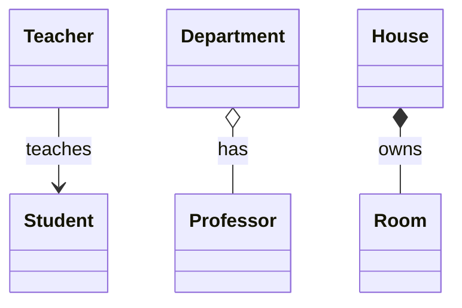

# OOP Basics

Har LLD round ki neev yahi hai. Interviewer Parking Lot ya Splitwise poochhe, wo actually check karta hai ki tum class, interface, inheritance aur composition sahi jagah use karte ho ya nahi.

## ⭐ Class & Object

**Ek line me:** class ek blueprint hai (kya data, kya behaviour), object us blueprint se bani asli cheez hai.

**Real example:** "Car" ek class hai. Tumhari Maruti aur dost ki Tata Nexon uske do alag objects hain, dono ki apni speed.

**Kab use karo / kab nahi:**
- Har real-world entity (User, Vehicle, Booking) ke liye class banao, jisme data aur uspe chalne wale methods saath hon.
- Sirf data hold karna ho, koi logic nahi, to Java me `record` / C++ me `struct` kaafi hai.

```java
class Car {
    private final String brand;   // state
    private int speed;

    Car(String brand) {           // constructor: object banate waqt chalta hai
        this.brand = brand;
        this.speed = 0;
    }

    void accelerate(int delta) {  // behaviour
        speed += delta;
    }

    void show() {
        System.out.println(brand + " @ " + speed + " km/h");
    }
}

public class Main {
    public static void main(String[] args) {
        Car c1 = new Car("Maruti");   // object 1
        Car c2 = new Car("Tata");     // object 2, apni alag state
        c1.accelerate(40);
        c2.accelerate(60);
        c1.show();
        c2.show();
    }
}
```

```cpp
#include <iostream>
#include <string>
#include <utility>

class Car {
    std::string brand;   // state
    int speed;

public:
    explicit Car(std::string b) : brand(std::move(b)), speed(0) {}  // constructor

    void accelerate(int delta) { speed += delta; }  // behaviour

    void show() const {
        std::cout << brand << " @ " << speed << " km/h\n";
    }
};

int main() {
    Car c1("Maruti");   // object 1 (stack pe)
    Car c2("Tata");     // object 2, apni alag state
    c1.accelerate(40);
    c2.accelerate(60);
    c1.show();
    c2.show();
}
```

**LLD problems me kahan:** har jagah. Parking Lot me `Vehicle`, `ParkingSpot`, `Ticket` sab classes hain.

**Interview me bolo:** "Pehle main nouns se entities nikalunga (classes), phir verbs se unke methods."

**Common galti:**
- Ek hi `Manager` class me saara data aur logic daal dena (God class).

## ⭐ Encapsulation

**Ek line me:** data ko `private` rakho aur bahar sirf controlled methods do, taaki koi galat state set na kar sake.

**Real example:** Paytm wallet ka balance tum seedha edit nahi kar sakte. Sirf `addMoney()` / `pay()` se badalta hai, aur wahan checks lagte hain.

**Kab use karo / kab nahi:**
- Jab bhi koi rule (invariant) ho: balance negative na ho, seat do baar book na ho.
- Har field ke liye blindly getter + setter banana encapsulation nahi hai. Setter tabhi do jab zaroorat ho.

```java
class Wallet {
    private double balance;   // bahar se direct access nahi

    void addMoney(double amount) {
        if (amount <= 0) throw new IllegalArgumentException("Amount positive hona chahiye");
        balance += amount;
    }

    boolean pay(double amount) {
        if (amount > balance) {
            System.out.println("Insufficient balance");
            return false;
        }
        balance -= amount;
        return true;
    }

    double getBalance() { return balance; }   // read-only access
}

public class Main {
    public static void main(String[] args) {
        Wallet w = new Wallet();
        w.addMoney(500);
        w.pay(200);
        w.pay(1000);              // reject ho jayega
        // w.balance = -100;      // compile error: private hai
        System.out.println("Balance: " + w.getBalance());
    }
}
```

```cpp
#include <iostream>
#include <stdexcept>

class Wallet {
    double balance = 0;   // private by default (class me)

public:
    void addMoney(double amount) {
        if (amount <= 0) throw std::invalid_argument("Amount positive hona chahiye");
        balance += amount;
    }

    bool pay(double amount) {
        if (amount > balance) {
            std::cout << "Insufficient balance\n";
            return false;
        }
        balance -= amount;
        return true;
    }

    double getBalance() const { return balance; }   // read-only access
};

int main() {
    Wallet w;
    w.addMoney(500);
    w.pay(200);
    w.pay(1000);           // reject ho jayega
    // w.balance = -100;   // compile error: private hai
    std::cout << "Balance: " << w.getBalance() << "\n";
}
```

**LLD problems me kahan:** Splitwise me `balance`, Vending Machine me `stock`, BookMyShow me `seatStatus`. Sab private, sirf methods se change.

**Interview me bolo:** "State private hai aur saare changes methods se jaate hain, isliye invariants ek hi jagah enforce hote hain."

**Common galti:**
- Fields `public` rakhna ya har field ka setter de dena. Phir validation kahin nahi hoti.

## ⭐ Abstraction

**Ek line me:** user ko sirf "kya karta hai" dikhao, "kaise karta hai" chhupa do.

**Real example:** Swiggy pe "Place Order" dabate ho. Payment, restaurant ko notify, delivery partner assign, sab andar hota hai, tumhe nahi dikhta.

**Kab use karo / kab nahi:**
- Jab caller ko internal steps se koi lena-dena na ho. Ek simple public method do, baaki private.
- Abstraction ke naam pe har cheez ke upar interface mat banao jab ek hi implementation ho aur aage bhi rahegi.

```java
abstract class PaymentGateway {
    // Public contract: bas "pay" karo
    public final void pay(double amount) {
        validate(amount);
        process(amount);
        System.out.println("Receipt sent");
    }

    private void validate(double amount) {   // hidden detail
        if (amount <= 0) throw new IllegalArgumentException("Invalid amount");
    }

    protected abstract void process(double amount);  // har gateway ka apna tareeka
}

class UpiGateway extends PaymentGateway {
    @Override
    protected void process(double amount) {
        System.out.println("UPI collect request for Rs " + amount);
    }
}

class CardGateway extends PaymentGateway {
    @Override
    protected void process(double amount) {
        System.out.println("Card OTP + charge Rs " + amount);
    }
}

public class Main {
    public static void main(String[] args) {
        PaymentGateway g = new UpiGateway();
        g.pay(499);                // caller ko andar ka kuch nahi pata
        new CardGateway().pay(999);
    }
}
```

```cpp
#include <iostream>
#include <memory>
#include <stdexcept>

class PaymentGateway {
public:
    virtual ~PaymentGateway() = default;
    void pay(double amount) {   // public contract
        validate(amount);
        process(amount);
        std::cout << "Receipt sent\n";
    }

protected:
    virtual void process(double amount) = 0;   // har gateway ka apna tareeka

private:
    void validate(double amount) {   // hidden detail
        if (amount <= 0) throw std::invalid_argument("Invalid amount");
    }
};

class UpiGateway : public PaymentGateway {
protected:
    void process(double amount) override { std::cout << "UPI collect request for Rs " << amount << "\n"; }
};

class CardGateway : public PaymentGateway {
protected:
    void process(double amount) override { std::cout << "Card OTP + charge Rs " << amount << "\n"; }
};

int main() {
    std::unique_ptr<PaymentGateway> g = std::make_unique<UpiGateway>();
    g->pay(499);   // caller ko andar ka kuch nahi pata
    std::make_unique<CardGateway>()->pay(999);
}
```

**LLD problems me kahan:** Payment, Notification (Email/SMS), Parking Lot me `PaymentProcessor`, Elevator me `ElevatorController.request()`.

**Interview me bolo:** "Client sirf `pay()` call karta hai. UPI hai ya card, ye detail gateway ke andar band hai."

**Common galti:**
- Abstraction aur Encapsulation ko same bolna. Encapsulation = data chhupana, Abstraction = complexity chhupana.

## ⭐ Inheritance

**Ek line me:** child class parent ka code aur behaviour le leti hai (IS-A relation), aur apna extra add karti hai.

**Real example:** Car IS-A Vehicle, Bike IS-A Vehicle. Dono me number plate aur `park()` common hai.

**Kab use karo / kab nahi:**
- Jab sach me IS-A relation ho aur parent ka contract child pe poora fit ho.
- Sirf code reuse ke liye inheritance mat lo. Wahan composition better hai.
- Hierarchy 2–3 level se gehri mat karo.

```java
class Vehicle {
    protected final String number;

    Vehicle(String number) { this.number = number; }

    void park() { System.out.println(number + " parked"); }

    int wheels() { return 0; }
}

class Car extends Vehicle {
    Car(String number) { super(number); }   // parent constructor call

    @Override
    int wheels() { return 4; }
}

class Bike extends Vehicle {
    Bike(String number) { super(number); }

    @Override
    int wheels() { return 2; }

    void wheelie() { System.out.println(number + " doing wheelie"); }  // extra
}

public class Main {
    public static void main(String[] args) {
        Car car = new Car("KA01AB1234");
        Bike bike = new Bike("DL3CXY9876");
        car.park();                          // parent se mila
        bike.park();
        System.out.println(car.wheels() + " " + bike.wheels());
        bike.wheelie();
    }
}
```

```cpp
#include <iostream>
#include <string>
#include <utility>

class Vehicle {
protected:
    std::string number;

public:
    explicit Vehicle(std::string n) : number(std::move(n)) {}
    virtual ~Vehicle() = default;
    void park() const { std::cout << number << " parked\n"; }
    virtual int wheels() const { return 0; }
};

class Car : public Vehicle {
public:
    explicit Car(std::string n) : Vehicle(std::move(n)) {}   // parent constructor call
    int wheels() const override { return 4; }
};

class Bike : public Vehicle {
public:
    explicit Bike(std::string n) : Vehicle(std::move(n)) {}
    int wheels() const override { return 2; }
    void wheelie() const { std::cout << number << " doing wheelie\n"; }  // extra
};

int main() {
    Car car("KA01AB1234");
    Bike bike("DL3CXY9876");
    car.park();    // parent se mila
    bike.park();
    std::cout << car.wheels() << " " << bike.wheels() << "\n";
    bike.wheelie();
}
```

**LLD problems me kahan:** Parking Lot (`Vehicle` → `Car`, `Bike`, `Truck`), Chess (`Piece` → `King`, `Queen`), Elevator me `Request` types.

**Interview me bolo:** "Inheritance sirf tab lunga jab IS-A sach me ho. Baaki jagah composition."

**Common galti:**
- C++ me base class ka destructor `virtual` na rakhna. Base pointer se delete karne pe child ka destructor nahi chalega.
- Java me multiple class inheritance nahi hota (`extends` sirf ek). Multiple interfaces `implements` ho sakte hain.

## ⭐ Polymorphism (compile-time vs runtime)

**Ek line me:** ek hi naam, alag behaviour. Compile-time = overloading (compiler decide karta hai), runtime = overriding (object ka asli type decide karta hai).

**Real example:** "Pay" button same hai, par UPI, Card, Wallet sabka andar ka kaam alag (runtime). Calculator ka `add(2,3)` aur `add(2.5,3.5)` alag methods (compile-time).

**Kab use karo / kab nahi:**
- Runtime polymorphism: jab type ke hisaab se `if-else` / `switch` likhne ka mann kare. Wahi jagah hai.
- Overloading: same kaam, alag input types. Bahut zyada overloads confuse karte hain, mat karo.

| | Compile-time | Runtime |
|---|---|---|
| Kaise | Method overloading (C++ me operator overloading bhi) | Method overriding |
| Kaun decide karta hai | Compiler, parameters dekh ke | JVM / vtable, object dekh ke |
| C++ me zaroori | Kuch nahi | `virtual` keyword |

```java
import java.util.List;

abstract class Shape {
    abstract double area();
}

class Circle extends Shape {
    private final double r;
    Circle(double r) { this.r = r; }
    @Override double area() { return Math.PI * r * r; }
}

class Square extends Shape {
    private final double side;
    Square(double side) { this.side = side; }
    @Override double area() { return side * side; }
}

class Calculator {
    // Compile-time: same naam, alag parameters (overloading)
    int add(int a, int b) { return a + b; }
    double add(double a, double b) { return a + b; }
}

public class Main {
    public static void main(String[] args) {
        Calculator calc = new Calculator();
        System.out.println(calc.add(2, 3));       // int version
        System.out.println(calc.add(2.5, 3.5));   // double version

        // Runtime: reference Shape ka, method object ke type se chalega (overriding)
        List<Shape> shapes = List.of(new Circle(1), new Square(2));
        for (Shape s : shapes) {
            System.out.println(s.getClass().getSimpleName() + " area = " + s.area());
        }
    }
}
```

```cpp
#include <iostream>
#include <memory>
#include <vector>

class Shape {
public:
    virtual ~Shape() = default;
    virtual double area() const = 0;   // virtual = runtime polymorphism
    virtual const char* name() const = 0;
};

class Circle : public Shape {
    double r;
public:
    explicit Circle(double r) : r(r) {}
    double area() const override { return 3.14159 * r * r; }
    const char* name() const override { return "Circle"; }
};

class Square : public Shape {
    double side;
public:
    explicit Square(double s) : side(s) {}
    double area() const override { return side * side; }
    const char* name() const override { return "Square"; }
};

// Compile-time: same naam, alag parameters (overloading)
int add(int a, int b) { return a + b; }
double add(double a, double b) { return a + b; }

int main() {
    std::cout << add(2, 3) << "\n";       // int version
    std::cout << add(2.5, 3.5) << "\n";   // double version

    std::vector<std::unique_ptr<Shape>> shapes;
    shapes.push_back(std::make_unique<Circle>(1));
    shapes.push_back(std::make_unique<Square>(2));
    for (const auto& s : shapes)          // runtime pe sahi area() chalega
        std::cout << s->name() << " area = " << s->area() << "\n";
}
```

**LLD problems me kahan:** Parking Lot me `vehicle.getSpotType()`, Chess me `piece.canMove()`, Notification me `sender.send()`, Vending Machine ke states.

**Interview me bolo:** "Type ke hisaab se `switch` ki jagah main polymorphism use karunga, taaki naya type aaye to purana code na chhedna pade."

**Common galti:**
- C++ me `virtual` bhoolna. Tab base pointer pe base ka hi method chalega (static binding).
- Return type badalne ko overloading samajhna. Sirf return type alag ho to overload nahi hota, compile error aata hai.

## ⭐ Interface vs Abstract class

**Ek line me:** interface = sirf contract ("kya kar sakta hai"), abstract class = contract + common code + state ("kya hai").

**Real example:** `Flyable` ek capability hai: Sparrow, Drone, Plane sab fly kar sakte hain. `Bird` ek abstract base hai jisme naam aur `eat()` common hai.

**Kab use karo / kab nahi:**
- **Interface:** alag-alag unrelated classes ko same capability deni ho, ya multiple types chahiye. LLD me default choice yahi rakho.
- **Abstract class:** related classes me common state / code share karna ho (constructor, fields).

| | Interface | Abstract class |
|---|---|---|
| State (fields) | Nahi (sirf constants) | Haan |
| Constructor | Nahi | Haan |
| Multiple | Ek class kai implement kar sakti hai | Sirf ek extend |
| Methods | abstract + `default` + `static` (Java 8+) | abstract + concrete |
| C++ me | Sirf pure virtual methods wali class | Pure virtual + normal members |

```java
interface Flyable {
    void fly();                                    // contract
    default void land() { System.out.println("Landing..."); }  // Java 8+ default
}

abstract class Bird {
    protected final String name;                   // state rakh sakta hai
    Bird(String name) { this.name = name; }        // constructor bhi
    abstract void makeSound();
    void eat() { System.out.println(name + " is eating"); }  // common code
}

class Sparrow extends Bird implements Flyable {
    Sparrow() { super("Sparrow"); }
    @Override void makeSound() { System.out.println("Chirp"); }
    @Override public void fly() { System.out.println(name + " is flying"); }
}

class Penguin extends Bird {                       // fly nahi karta, Flyable nahi liya
    Penguin() { super("Penguin"); }
    @Override void makeSound() { System.out.println("Squawk"); }
}

public class Main {
    public static void main(String[] args) {
        Sparrow s = new Sparrow();
        s.eat();
        s.fly();
        s.land();
        Bird p = new Penguin();
        p.makeSound();
    }
}
```

```cpp
#include <iostream>
#include <memory>
#include <string>
#include <utility>

class Flyable {                    // "interface": sirf pure virtual, koi state nahi
public:
    virtual ~Flyable() = default;
    virtual void fly() = 0;
};

class Bird {                       // abstract class: state + common code
protected:
    std::string name;
public:
    explicit Bird(std::string n) : name(std::move(n)) {}
    virtual ~Bird() = default;
    virtual void makeSound() = 0;
    void eat() const { std::cout << name << " is eating\n"; }
};

class Sparrow : public Bird, public Flyable {   // C++ me multiple inheritance
public:
    Sparrow() : Bird("Sparrow") {}
    void makeSound() override { std::cout << "Chirp\n"; }
    void fly() override { std::cout << name << " is flying\n"; }
};

class Penguin : public Bird {
public:
    Penguin() : Bird("Penguin") {}
    void makeSound() override { std::cout << "Squawk\n"; }
};

int main() {
    Sparrow s;
    s.eat();
    s.fly();
    std::unique_ptr<Bird> p = std::make_unique<Penguin>();
    p->makeSound();
}
```

**LLD problems me kahan:** `PaymentStrategy`, `NotificationSender`, `PricingStrategy` interfaces. Parking Lot me abstract `Vehicle`, Chess me abstract `Piece`.

**Interview me bolo:** "Capability ke liye interface, shared state ke liye abstract class. By default main interface se start karta hoon."

**Common galti:**
- Java me interface method implement karte waqt `public` bhoolna. Compile error aata hai.

## ⭐ Composition over Inheritance

**Ek line me:** behaviour ko parent se "inherit" karne ki jagah, ek object ke andar dusra object rakho (HAS-A) aur kaam usko delegate karo.

**Real example:** Car ke andar Engine hai. Petrol se EV banana ho to poori car nahi badalte, engine swap karte ho.

**Kab use karo / kab nahi:**
- Jab behaviour runtime pe badalna ho, ya combinations bahut hon (engine x gearbox x fuel).
- Jab relation HAS-A ho, IS-A nahi.
- Jab sach me IS-A ho aur hierarchy chhoti ho, inheritance theek hai.

```java
// Inheritance se: PetrolManualCar, PetrolAutoCar, ElectricAutoCar ... class explosion.
// Composition se: Car + pluggable Engine.
interface Engine {
    void start();
}

class PetrolEngine implements Engine {
    public void start() { System.out.println("Petrol engine: vroom"); }
}

class ElectricEngine implements Engine {
    public void start() { System.out.println("Electric engine: silent start"); }
}

class Car {
    private Engine engine;                       // Car HAS-A Engine

    Car(Engine engine) { this.engine = engine; }

    void setEngine(Engine engine) { this.engine = engine; }  // runtime pe swap

    void drive() {
        engine.start();                          // kaam delegate kiya
        System.out.println("Car chal padi");
    }
}

public class Main {
    public static void main(String[] args) {
        Car car = new Car(new PetrolEngine());
        car.drive();
        car.setEngine(new ElectricEngine());     // bina nayi class banaye behaviour badla
        car.drive();
    }
}
```

```cpp
#include <iostream>
#include <memory>
#include <utility>

// Inheritance se: PetrolManualCar, PetrolAutoCar ... class explosion.
// Composition se: Car + pluggable Engine.
class Engine {
public:
    virtual ~Engine() = default;
    virtual void start() = 0;
};

class PetrolEngine : public Engine {
public:
    void start() override { std::cout << "Petrol engine: vroom\n"; }
};

class ElectricEngine : public Engine {
public:
    void start() override { std::cout << "Electric engine: silent start\n"; }
};

class Car {
    std::unique_ptr<Engine> engine;   // Car HAS-A Engine (owns it)
public:
    explicit Car(std::unique_ptr<Engine> e) : engine(std::move(e)) {}
    void setEngine(std::unique_ptr<Engine> e) { engine = std::move(e); }  // runtime swap
    void drive() {
        engine->start();              // kaam delegate kiya
        std::cout << "Car chal padi\n";
    }
};

int main() {
    Car car(std::make_unique<PetrolEngine>());
    car.drive();
    car.setEngine(std::make_unique<ElectricEngine>());
    car.drive();
}
```

**LLD problems me kahan:** Strategy pattern isi pe bana hai. Parking Lot me `PricingStrategy`, Elevator me `SchedulingStrategy`, Logger me `Appender`.

**Interview me bolo:** "Main composition prefer karunga. Behaviour interface ke peeche rahega aur constructor se inject hoga, to runtime pe swap bhi ho sakta hai aur test bhi easy hai."

**Common galti:**
- "Code reuse chahiye" bol ke `Stack extends ArrayList` jaisa design. Ab stack pe `add(index, x)` bhi call ho sakta hai, jo galat hai.

## Association / Aggregation / Composition

**Ek line me:** teeno "objects ek dusre ko jaante hain" ke levels hain. Farak ownership aur lifetime ka hai.

**Real example:** Teacher student ko padhata hai (association). Department me professors hain, department band ho to bhi professor rehte hain (aggregation). Ghar ke kamre ghar ke saath hi tootenge (composition).

**Kab use karo / kab nahi:**
- **Association:** bas use karta hai, own nahi karta (method parameter / reference).
- **Aggregation:** HAS-A, par part bahar se aata hai aur independently zinda reh sakta hai.
- **Composition:** HAS-A, part andar hi banta hai aur owner ke saath marta hai. Sabse strong.



```java
import java.util.ArrayList;
import java.util.List;

class Student { final String name; Student(String n) { name = n; } }

class Teacher {   // Association: student ko sirf use kiya, own nahi kiya
    void teach(Student s) { System.out.println("Teaching " + s.name); }
}

class Professor { final String name; Professor(String n) { name = n; } }

class Department {   // Aggregation: professor bahar se aaya
    private final List<Professor> profs = new ArrayList<>();
    void add(Professor p) { profs.add(p); }
}

class Room { final String type; Room(String t) { type = t; } }

class House {   // Composition: rooms andar hi bane, House ke saath khatam
    private final List<Room> rooms = List.of(new Room("Bedroom"), new Room("Kitchen"));
    int roomCount() { return rooms.size(); }
}

public class Main {
    public static void main(String[] args) {
        new Teacher().teach(new Student("Rahul"));

        Professor p = new Professor("Dr. Sharma");
        Department cs = new Department();
        cs.add(p);
        cs = null;                     // department gaya, p abhi bhi zinda
        System.out.println(p.name + " still exists");

        System.out.println("Rooms: " + new House().roomCount());
    }
}
```

```cpp
#include <iostream>
#include <memory>
#include <string>
#include <utility>
#include <vector>

struct Student { std::string name; };

struct Teacher {   // Association: reference se use kiya, own nahi kiya
    void teach(const Student& s) const { std::cout << "Teaching " << s.name << "\n"; }
};

struct Professor { std::string name; };

class Department {   // Aggregation: shared_ptr, professor bahar bhi zinda
    std::vector<std::shared_ptr<Professor>> profs;
public:
    void add(std::shared_ptr<Professor> p) { profs.push_back(std::move(p)); }
};

struct Room { std::string type; };

class House {   // Composition: rooms by value, House ke saath destroy
    std::vector<Room> rooms{{"Bedroom"}, {"Kitchen"}};
public:
    std::size_t roomCount() const { return rooms.size(); }
};

int main() {
    Teacher{}.teach(Student{"Rahul"});

    auto p = std::make_shared<Professor>(Professor{"Dr. Sharma"});
    {
        Department cs;
        cs.add(p);
    }                                  // department gaya, p abhi bhi zinda
    std::cout << p->name << " still exists\n";

    std::cout << "Rooms: " << House{}.roomCount() << "\n";
}
```

**LLD problems me kahan:** Parking Lot `ParkingLot *-- Floor *-- Spot` (composition), `Spot --> Vehicle` (association). Splitwise `Group o-- User` (aggregation).

**Interview me bolo:** "Floor ParkingLot ke bina exist nahi karta, isliye composition hai. User group chhod de to bhi user rehta hai, isliye aggregation hai."

**Common galti:**
- Class diagram me teeno ke arrows mix karna. Hollow diamond (`o--`) = aggregation, filled diamond (`*--`) = composition.

## Access modifiers

**Ek line me:** kaun kis member ko dekh/use kar sakta hai, ye control karte hain. Encapsulation inhi se lagti hai.

**Real example:** Bank me cashier ka counter `public` hai, staff room `protected` (sirf staff), aur vault `private` (sirf manager).

**Kab use karo / kab nahi:**
- Default soch: fields `private`, methods jitne zaroori utne hi `public`.
- `protected` sirf tab jab child class ko sach me chahiye. Zyada `protected` = encapsulation weak.

| Modifier | Java | C++ |
|---|---|---|
| `public` | Sab jagah se | Sab jagah se |
| `protected` | Same package + subclasses | Sirf subclasses (aur khud) |
| default (kuch na likho) | Sirf same package | `class` me private, `struct` me public |
| `private` | Sirf usi class me | Sirf usi class me (aur `friend`) |

```java
class Account {
    public String owner;            // sab jagah se
    protected double interestRate;  // same package + subclasses
    String branch;                  // default: sirf same package
    private double balance;         // sirf isi class ke andar

    Account(String owner, String branch) {
        this.owner = owner;
        this.branch = branch;
    }

    public void deposit(double amt) { balance += amt; }
    public double getBalance() { return balance; }
}

class SavingsAccount extends Account {
    SavingsAccount(String owner) { super(owner, "Andheri"); }

    void setRate() {
        interestRate = 4.0;         // protected: child me OK
        // balance = 10;            // compile error: private hai
    }
}

public class Main {
    public static void main(String[] args) {
        SavingsAccount acc = new SavingsAccount("Priya");
        acc.setRate();
        acc.deposit(1000);
        System.out.println(acc.owner + " " + acc.branch + " " + acc.getBalance());
    }
}
```

```cpp
#include <iostream>
#include <string>
#include <utility>

class Account {
public:
    std::string owner;          // sab jagah se
    explicit Account(std::string o) : owner(std::move(o)) {}
    void deposit(double amt) { balance += amt; }
    double getBalance() const { return balance; }
    friend void audit(const Account& a);   // friend ko private bhi dikhta hai

protected:
    double interestRate = 0;    // sirf child classes

private:
    double balance = 0;         // sirf isi class ke andar
};

class SavingsAccount : public Account {
public:
    explicit SavingsAccount(std::string o) : Account(std::move(o)) {}
    void setRate() {
        interestRate = 4.0;     // protected: child me OK
        // balance = 10;        // compile error: private hai
    }
};

void audit(const Account& a) { std::cout << "Audit balance: " << a.balance << "\n"; }

int main() {
    SavingsAccount acc("Priya");
    acc.setRate();
    acc.deposit(1000);
    std::cout << acc.owner << " " << acc.getBalance() << "\n";
    audit(acc);
}
```

**LLD problems me kahan:** har class me. Interview me code likhte waqt fields `private` dikhana hi signal deta hai ki tum encapsulation samajhte ho.

**Interview me bolo:** "Saare fields private hain, bahar sirf woh methods public hain jo use case ko chahiye."

**Common galti:**
- Java ka default (package-private) aur C++ ka default (`class` me private) same samajhna.

## Checklist

- [ ] Class vs object ek example se samjha sakta hoon
- [ ] Encapsulation aur Abstraction ka farak ek line me bata sakta hoon
- [ ] Compile-time vs runtime polymorphism ka code likh sakta hoon, aur C++ me `virtual` kyun chahiye bata sakta hoon
- [ ] Interface vs abstract class kab kaunsa, table ke saath bata sakta hoon
- [ ] Composition over inheritance ka example (Car + Engine) likh sakta hoon aur kyun better hai bata sakta hoon
- [ ] Association, aggregation, composition ka farak lifetime se samjha sakta hoon
- [ ] Java aur C++ ke access modifiers ka farak bata sakta hoon
