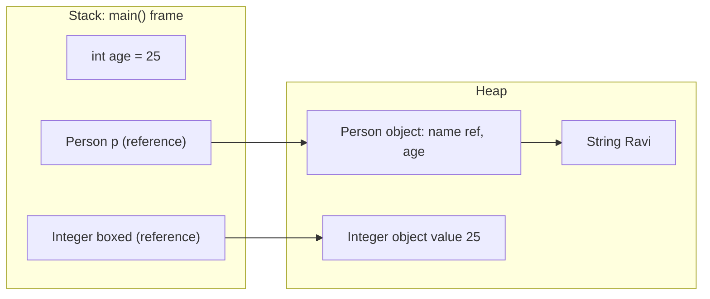

# Java Basics: primitives & types

Interview me Java ke basic sawal "easy" lagte hain, par wahi pakadte hain: `Integer` cache, overflow, pass-by-value, autoboxing NPE. Ye file wahi gaps band karti hai.

## ⭐ 8 Primitive types

**Ek line me:** Java me 8 primitive types hain jo value seedha store karte hain (object nahi), aur unka size har platform pe fixed hai.

| Type | Size | Range | Default (field/array) |
|---|---|---|---|
| `byte` | 8 bit | -128 to 127 | `0` |
| `short` | 16 bit | -32,768 to 32,767 | `0` |
| `int` | 32 bit | -2^31 to 2^31-1 (~±2.1 × 10^9) | `0` |
| `long` | 64 bit | -2^63 to 2^63-1 (~±9.2 × 10^18) | `0L` |
| `float` | 32 bit | ~7 decimal digits precision | `0.0f` |
| `double` | 64 bit | ~15-16 decimal digits precision | `0.0d` |
| `char` | 16 bit | 0 to 65,535 (unsigned, UTF-16 unit) | `'\u0000'` |
| `boolean` | JVM pe depend | `true` / `false` | `false` |

- Default value sirf **fields aur array elements** ko milti hai. Local variable bina assign kiye use kiya to compile error.
- Integer literal default `int` hota hai, decimal literal default `double`. Isliye `long x = 3_000_000_000L;` me `L` aur `float f = 1.5f;` me `f` zaroori.
- `char` Java me unsigned hai, baaki saare integer types signed.

```java
public class Main {
    static int count;       // field: default 0
    static boolean done;    // field: default false

    public static void main(String[] args) {
        int local;
        // System.out.println(local); // compile error: might not have been initialized
        long big = 3_000_000_000L;      // L ke bina "integer number too large"
        float price = 99.5f;            // f ke bina double -> float error
        char c = 'A';
        System.out.println(count + " " + done + " " + big + " " + price + " " + (int) c); // 0 false 3000000000 99.5 65
        System.out.println(Integer.MAX_VALUE + " " + Long.MAX_VALUE);
    }
}
```

**Interview tip:** "Paise (money) ke liye `double` kyun nahi?" Jawab: binary floating point exact nahi hota (`0.1 + 0.2 != 0.3`). Money ke liye `long` paise me ya `BigDecimal` use karo.

**Common galti:** LeetCode me `int` sum overflow ho jaana jab constraint 10^5 elements × 10^9 value ho. Aise me `long` lo.

## Wrapper classes

**Ek line me:** har primitive ka ek object version hai (`Integer`, `Long`, `Double`, `Character`, `Boolean`...), taaki collections aur generics me use ho sake.

- `List<int>` allowed nahi, `List<Integer>` chahiye. Generics sirf objects ke saath kaam karte hain.
- Wrapper **immutable** hote hain aur `null` ho sakte hain. Primitive kabhi `null` nahi hota.
- Mapping: `byte→Byte`, `short→Short`, `int→Integer`, `long→Long`, `float→Float`, `double→Double`, `char→Character`, `boolean→Boolean`.

**Important methods:**

| Method | Kya karta hai | Time complexity |
|---|---|---|
| `Integer.parseInt("42")` | String se `int` (galat input pe `NumberFormatException`) | O(n) |
| `Integer.valueOf(42)` | `Integer` object deta hai, cache use karta hai | O(1) |
| `Integer.MAX_VALUE / MIN_VALUE` | range ki limits | O(1) |
| `Integer.compare(a, b)` | overflow-safe compare (-1/0/1 jaisa) | O(1) |
| `Integer.toBinaryString(n)` | binary string | O(32) |
| `Integer.bitCount(n)` | set bits gino | O(1) |
| `Character.isDigit(c) / isLetter(c)` | char type check | O(1) |
| `Character.getNumericValue('7')` | `7` deta hai | O(1) |

**Interview tip:** `parseInt` primitive deta hai, `valueOf` object deta hai. Loop me `valueOf` se unnecessary objects ban sakte hain.

**Common galti:** `Integer.parseInt(" 42")` space ke saath fail hota hai. Pehle `trim()` karo.

## ⭐ Autoboxing & unboxing

**Ek line me:** compiler primitive ↔ wrapper conversion khud karta hai: `int → Integer` (autoboxing) aur `Integer → int` (unboxing).

Andar se `Integer x = 5;` ban jaata hai `Integer.valueOf(5)`, aur `int y = x;` ban jaata hai `x.intValue()`. Agar `x` null hai to **NullPointerException**.

```java
import java.util.HashMap;
import java.util.Map;

public class Main {
    public static void main(String[] args) {
        Map<String, Integer> stock = new HashMap<>();
        stock.put("biryani", 10);

        int a = stock.get("biryani");     // unboxing, chalega
        // int b = stock.get("pizza");    // get() null deta hai -> unboxing pe NPE

        int safe = stock.getOrDefault("pizza", 0); // sahi tareeka
        stock.merge("biryani", 1, Integer::sum);   // count badhane ka clean tareeka

        boolean flag = true;
        // Ternary trap: ek side int hai to poora expression int ban jaata hai
        // Integer x = flag ? stock.get("pizza") : 0; // NPE! null unbox hota hai

        Long total = 0L;
        for (int i = 0; i < 1000; i++) total += i; // har step pe naya Long object: slow
        System.out.println(a + " " + safe + " " + total);
    }
}
```

**Interview tip:** "Autoboxing ka cost kya hai?" Har box pe object allocation (cache range ke bahar), extra memory aur GC pressure. Hot loop me primitive use karo.

**Common galti:**
- `map.get(key)` ko seedha `int` me daalna. Key na ho to NPE.
- `Long sum` ko loop me accumulator banana. `long` lo.

## ⭐ Integer cache (== vs equals)

**Ek line me:** `Integer.valueOf()` (aur autoboxing) -128 se 127 tak ke values ke liye **same cached object** deta hai, isliye `==` us range me true aur bahar false.

- `==` objects pe **reference** compare karta hai, `equals()` **value**.
- Cache: `Byte`, `Short`, `Integer`, `Long` (-128..127), `Character` (0..127), `Boolean` (TRUE/FALSE). `Float`/`Double` ka cache nahi.
- `Integer` ki upper limit JVM flag `-XX:AutoBoxCacheMax` se badha sakte ho.

```java
public class Main {
    public static void main(String[] args) {
        Integer a = 127, b = 127;
        System.out.println(a == b);       // true: dono cache ka same object
        Integer c = 128, d = 128;
        System.out.println(c == d);       // false: do alag objects
        System.out.println(c.equals(d));  // true: value same
        System.out.println(c.intValue() == d); // true: ek side primitive -> unboxing

        Long big = 127L;
        System.out.println(big.equals(127));   // false: Integer vs Long, type alag
        System.out.println(big.equals(127L));  // true
    }
}
```

**Interview tip:** LeetCode me do `HashMap<Character, Integer>` ke counts `map1.get(c) == map2.get(c)` se compare kiye to chhote test pass, bade (count > 127) fail. Hamesha `equals()` ya `Objects.equals()` use karo.

**Common galti:** `Long.equals(Integer)` ko true samajhna. `equals` pehle type check karta hai.

## ⭐ Type casting: widening & narrowing

**Ek line me:** chhote type se bade me jaana (widening) automatic hai, bade se chhote (narrowing) me explicit cast chahiye aur data kat sakta hai.

Widening order: `byte → short → int → long → float → double`, aur `char → int`.

```java
public class Main {
    public static void main(String[] args) {
        int i = 100;
        long l = i;              // widening: automatic
        double d = l;            // widening

        double price = 3.99;
        int rupees = (int) price;        // narrowing: 3 (truncate, round nahi)
        byte b = (byte) 200;             // -56: upar ke bits kat gaye
        long round = Math.round(price);  // 4

        int big = 123_456_789;
        float f = big;                   // widening par precision loss: 1.23456792E8
        System.out.println(rupees + " " + b + " " + round + " " + f);

        byte x = 10;
        // x = x + 5;    // compile error: x + 5 ka type int hai
        x += 5;          // chalega: compound assignment me hidden cast hai
        char next = (char) ('a' + 1);    // 'b'
        System.out.println(x + " " + next);
    }
}
```

**Interview tip:** arithmetic me `byte`, `short`, `char` pehle `int` me promote hote hain (binary numeric promotion). Isliye `byte + byte` ka result `int` hai.

**Common galti:** `(int) 3.99` ko 4 samajhna. Cast hamesha zero ki taraf truncate karta hai. Rounding ke liye `Math.round`.

## var (local type inference)

**Ek line me:** Java 10 se local variable ka type compiler right side se infer kar leta hai: `var list = new ArrayList<String>();`.

- Sirf **local variables** (aur for-loop, try-with-resources) me. Fields, method parameters, return type me nahi.
- Initializer zaroori: `var x;` error, `var y = null;` error.
- Type compile time pe fix hai. Ye JavaScript ka dynamic `var` nahi hai.

```java
import java.util.ArrayList;
import java.util.HashMap;
import java.util.List;
import java.util.Map;

public class Main {
    public static void main(String[] args) {
        var orders = new HashMap<String, List<Integer>>(); // lamba type nahi likhna pada
        orders.put("Ravi", new ArrayList<>(List.of(101, 102)));
        for (var e : orders.entrySet()) {
            System.out.println(e.getKey() + " -> " + e.getValue());
        }
        var n = 10;          // int
        // n = "ten";        // compile error: type int fix ho chuka
        var mixed = new ArrayList<>(); // ArrayList<Object> ban gaya, dhyan rakho
        mixed.add(1);
        System.out.println(n + " " + mixed);
    }
}
```

**Interview tip:** `var` readability ke liye hai jab type right side se obvious ho. Jab type clear na ho (`var x = service.process();`), explicit type likho.

**Common galti:** `var list = new ArrayList<>();` likhna. Diamond ke saath type `Object` infer hota hai.

## ⭐ final

**Ek line me:** `final` variable ek baar assign hota hai, `final` method override nahi hota, `final` class extend nahi hoti.

- `final` reference ka matlab reference nahi badlega. **Object ke andar ka data badal sakta hai.**
- `String`, `Integer` jaisi classes `final` hain, taaki koi subclass bana ke immutability na tode.
- Lambda/anonymous class sirf **effectively final** local variables use kar sakti hai (assign ke baad kabhi change nahi hua).

```java
import java.util.ArrayList;
import java.util.List;

public class Main {
    static final int MAX_SEATS = 100;     // constant

    public static void main(String[] args) {
        final List<String> cart = new ArrayList<>();
        cart.add("Paneer Tikka");         // chalega: object mutate ho raha hai
        // cart = new ArrayList<>();      // error: reference final hai

        final int gst;
        gst = 18;                         // blank final: ek baar assign
        // gst = 5;                       // error

        int discount = 10;                // effectively final
        Runnable r = () -> System.out.println("Discount " + discount);
        // discount = 20;                 // ye line hoti to upar lambda compile nahi hota
        r.run();
        System.out.println(cart + " " + gst + " " + MAX_SEATS);
    }
}
```

**Interview tip:** "final vs finally vs finalize?" `final` = keyword (variable/method/class), `finally` = try ke baad hamesha chalne wala block, `finalize()` = GC se pehle wala method (Java 9 se deprecated, use mat karo).

**Common galti:** `final List` ko immutable list samajhna. Immutable chahiye to `List.of(...)` ya `Collections.unmodifiableList`.

## ⭐ Operators gotchas

**Ek line me:** integer overflow chupchaap wrap hota hai, `/` integer pe truncate karta hai, `%` ka sign dividend se aata hai, aur `i++` vs `++i` me value alag milti hai.

```java
public class Main {
    public static void main(String[] args) {
        // 1. Overflow: koi exception nahi, wrap ho jaata hai
        int max = Integer.MAX_VALUE;
        System.out.println(max + 1);                 // -2147483648
        long wrong = 1_000_000 * 1_000_000;          // int me multiply, phir long: -727379968
        long right = 1_000_000L * 1_000_000;         // 1000000000000
        // Math.addExact(max, 1);                    // ArithmeticException: overflow pakdo
        System.out.println(Math.abs(Integer.MIN_VALUE)); // -2147483648 (abs bhi fail)

        // Binary search mid: (lo + hi) / 2 overflow kar sakta hai
        int lo = 2_000_000_000, hi = 2_100_000_000;
        int mid = lo + (hi - lo) / 2;                // safe

        // 2. Division aur modulo
        System.out.println(7 / 2 + " " + -7 / 2);    // 3 -3 (zero ki taraf truncate)
        System.out.println(-7 % 3);                  // -1 (sign dividend ka)
        System.out.println(Math.floorMod(-7, 3));    // 2 (hamesha non-negative, mod ke liye)
        System.out.println(5.0 / 0 + " " + 0.0 / 0); // Infinity NaN
        // System.out.println(5 / 0);                // ArithmeticException: / by zero

        // 3. ++ ka chakkar
        int i = 5;
        int j = i++ + ++i;                           // 5 + 7 = 12, i ab 7
        int k = 5;
        k = k++;                                     // k abhi bhi 5
        System.out.println(mid + " " + j + " " + i + " " + k);
        System.out.println(0.1 + 0.2 == 0.3);        // false
    }
}
```

**Interview tip:** "`1_000_000 * 1_000_000` ko `long` me daala, galat kyun aaya?" Right side pehle `int` me evaluate hoti hai, overflow ho jaata hai, phir widening hoti hai. Ek operand ko `L` banao.

**Common galti:**
- Negative number pe `n % k` se array index nikalna (negative index aa jaata hai). `Math.floorMod` ya `((n % k) + k) % k`.
- `&&`/`||` short-circuit hain, `&`/`|` dono side evaluate karte hain. Null check me `&` lagaya to NPE.

## ⭐ Pass-by-value (objects bhi)

**Ek line me:** Java **hamesha pass-by-value** hai. Object ke case me **reference ki copy** pass hoti hai, isliye object mutate ho sakta hai par caller ka reference badla nahi ja sakta.

```java
public class Main {
    static void change(int x) { x = 100; }                       // copy badli
    static void addSurname(StringBuilder sb) { sb.append(" Kumar"); } // same object mutate
    static void reassign(StringBuilder sb) { sb = new StringBuilder("New"); } // local copy badli
    static void swap(Integer a, Integer b) { Integer t = a; a = b; b = t; }  // bekaar

    public static void main(String[] args) {
        int n = 5;
        change(n);
        StringBuilder name = new StringBuilder("Ravi");
        addSurname(name);
        reassign(name);
        Integer p = 1, q = 2;
        swap(p, q);
        System.out.println(n + " | " + name + " | " + p + " " + q); // 5 | Ravi Kumar | 1 2
    }
}
```

**Interview tip:** ek line me: "Java reference ko by value pass karta hai. Method object ki state badal sakta hai, par caller ka variable kis object ko point kare ye nahi badal sakta. Isliye Java me swap function nahi likh sakte."

**Common galti:** "Objects pass-by-reference hote hain" bolna. Interviewer isi pe pakadta hai. Reassign wala example de do.

## ⭐ static vs instance

**Ek line me:** `static` member class ka hota hai (ek hi copy), instance member har object ka apna.

- `static` method me `this` nahi hota, isliye instance fields/methods seedha access nahi kar sakte.
- `static` block class load hone pe ek baar chalta hai.
- Static method override nahi hota, **hide** hota hai (compile-time binding).

```java
public class Main {
    static class Order {
        static int totalOrders = 0;      // sab objects share karte hain
        static final String APP;         // static block me set
        final int orderId;               // har object ka apna

        static { APP = "Zomato"; }       // class load pe ek baar

        Order() { totalOrders++; orderId = totalOrders; }

        static void report() {
            System.out.println(APP + " total: " + totalOrders);
            // System.out.println(orderId); // error: static context me instance field nahi
        }
    }

    public static void main(String[] args) {
        Order o1 = new Order();
        Order o2 = new Order();
        System.out.println(o1.orderId + " " + o2.orderId); // 1 2
        Order.report();                                    // Zomato total: 2
    }
}
```

**Interview tip:** "Static method override ho sakta hai?" Nahi. Subclass same signature ka static method bana sakti hai, par woh hiding hai. Call reference ke declared type se decide hota hai, object se nahi.

**Common galti:** mutable `static` field ko shared state ki tarah use karna multi-threaded code me. Bina synchronization ke race condition.

## main method

**Ek line me:** `public static void main(String[] args)` JVM ka entry point hai.

- `public`: JVM bahar se call kare. `static`: bina object banaye call ho. `void`: JVM ko kuch return nahi. `String[] args`: command line arguments.
- `String... args` (varargs) bhi valid hai. `final` ya `synchronized` lagana bhi allowed.
- `main` overload kar sakte ho, par JVM sirf `String[]` wala chalata hai.
- Java 21 me instance `main` aur bina class ke file preview thi; Java 25 me final hui. Interview me classic signature hi bolo.

```java
public class Main {
    public static void main(String[] args) {
        System.out.println("Args: " + args.length);   // koi arg nahi to 0, null nahi
        main(5);                                      // overload: normal method ki tarah
    }
    static void main(int x) { System.out.println("Overloaded " + x); }
}
```

**Interview tip:** "main static kyun hai?" Kyunki JVM ke paas us waqt koi object nahi hota. Static hone se class load karke seedha call ho jaata hai.

**Common galti:** `args` ko kabhi `null` samajhna. Arguments na hon to empty array milta hai.

## Memory: primitives vs objects

**Ek line me:** local primitive aur references **stack** pe (method frame me), objects hamesha **heap** pe; object ke andar ke primitive fields bhi heap pe object ke saath rehte hain.



- `int` = 4 bytes. `Integer` object = header (~12 bytes) + 4 bytes value + padding ≈ 16 bytes, plus reference ka 4–8 bytes.
- `int[1000]` ek continuous block hai. `Integer[1000]` = 1000 references + 1000 alag objects (cache range ke bahar). Cache-friendly bhi nahi.
- Har thread ka apna stack hota hai, heap sab threads share karte hain. Isliye local primitives thread-safe hain.

**Interview tip:** "`ArrayList<Integer>` vs `int[]` memory?" `int[]` ~4 bytes/element, `ArrayList<Integer>` ~20 bytes/element (reference + boxed object). Bade data pe primitive array lo.

**Common galti:** "primitives hamesha stack pe" bolna. Field ya array element ke roop me primitive heap pe hota hai.

## Checklist

- [ ] 8 primitive types ka size, range aur default value bata sakta hoon
- [ ] Autoboxing/unboxing samjha sakta hoon aur `map.get()` / ternary wala NPE bata sakta hoon
- [ ] Integer cache (-128..127) ki wajah se `==` ka output predict kar sakta hoon
- [ ] Widening vs narrowing cast, aur `(int) 3.99` / `(byte) 200` ka result bata sakta hoon
- [ ] Integer overflow, `/`, `%` aur `i++` ke gotchas code me pakad sakta hoon
- [ ] Java pass-by-value kyun hai, swap example ke saath samjha sakta hoon
- [ ] `final`, `var`, `static` vs instance ke rules bata sakta hoon
- [ ] Primitive vs object memory (stack vs heap) diagram bana ke samjha sakta hoon
