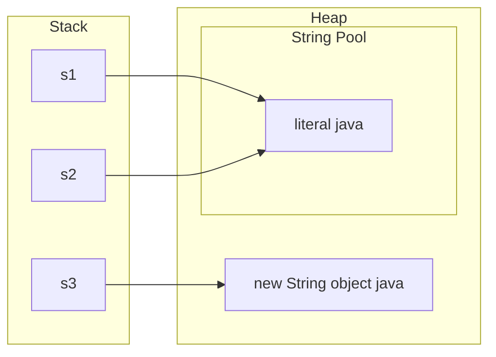

# Strings

Java interview ka sabse common topic. Theory (immutability, pool, `==`) bhi poochte hain aur coding round ke aadhe sawal strings pe hote hain. Dono yahan cover hain.

## ⭐ Immutability aur kyun

**Ek line me:** `String` object ek baar bana to uska content kabhi nahi badalta; har "change" (`toUpperCase`, `replace`, `concat`) naya object banata hai.

**Kyun immutable banaya:**
- **String pool:** same literal kai jagah share hota hai. Mutable hota to ek jagah badalne se sab jagah badal jaata.
- **Security:** file path, DB URL, class name strings me jaate hain. Check ke baad koi badal na sake.
- **hashCode cache:** hash ek baar compute hoke store hota hai. Isliye `String` best `HashMap` key hai.
- **Thread-safe:** bina lock ke threads share kar sakte hain.
- Class `final` hai aur andar ka array `private final`, isliye subclass bana ke bhi nahi tod sakte. (Java 9+ me andar `byte[]` + coder hai, Compact Strings: Latin-1 text 1 byte/char.)

```java
public class Main {
    public static void main(String[] args) {
        String s = "swiggy";
        s.toUpperCase();            // naya object bana aur phenk diya
        System.out.println(s);      // swiggy (original same)

        s = s.toUpperCase();        // ab s naye object ko point karta hai
        System.out.println(s);      // SWIGGY

        String a = "pay";
        String b = a;               // dono same object
        a = a + "tm";               // a ab naya object "paytm"
        System.out.println(b);      // pay (b pe koi asar nahi)
    }
}
```

**Interview tip:** "String immutable kyun hai?" Chaar points bolo: pool sharing, security, hashCode caching, thread safety.

**Common galti:** `s.trim();` ya `s.replace(...)` likh ke result assign na karna. Return value pakdo: `s = s.trim();`.

## ⭐ String pool aur intern()

**Ek line me:** string literals heap ke andar ek special area (String pool) me ek hi baar store hote hain; `new String()` hamesha pool ke bahar naya object banata hai.



- Java 7 se pool **heap** me hai (pehle PermGen me tha), isliye pool ke strings bhi GC ho sakte hain.
- `new String("java")` = 1 ya 2 objects: literal pool me pehle se nahi tha to woh bhi banega, plus heap me naya object.
- `intern()` pool wala reference deta hai (pool me nahi hai to daal deta hai).
- Compile-time constants (`"ja" + "va"`, ya `final` variable + literal) compiler pehle hi jod deta hai, woh pool me jaate hain. Runtime concat naya object.

```java
public class Main {
    public static void main(String[] args) {
        String s1 = "java";
        String s2 = "java";
        String s3 = new String("java");
        String s4 = s3.intern();
        String s5 = "ja" + "va";        // compile-time constant -> pool

        String part = "ja";
        String s6 = part + "va";        // runtime concat -> naya heap object
        final String fpart = "ja";
        String s7 = fpart + "va";       // final hai, constant ban gaya -> pool

        System.out.println(s1 == s2);       // true
        System.out.println(s1 == s3);       // false
        System.out.println(s1 == s4);       // true
        System.out.println(s1 == s5);       // true
        System.out.println(s1 == s6);       // false
        System.out.println(s1 == s7);       // true
        System.out.println(s1.equals(s3));  // true
    }
}
```

**Interview tip:** "`String s = new String("abc")` kitne objects banata hai?" Jawab: do tak. Ek pool me literal (agar pehle se nahi hai), ek heap me `new` wala.

**Common galti:** `intern()` ko har jagah performance trick samajhna. Bahut saare unique strings intern karoge to pool bada aur lookup slow.

## ⭐ == vs equals()

**Ek line me:** `==` reference (same object?) compare karta hai, `equals()` content compare karta hai. Strings ke liye **hamesha `equals()`**.

```java
import java.util.Objects;

public class Main {
    public static void main(String[] args) {
        String input = new String("UPI");       // jaise user input / network se aaya
        System.out.println(input == "UPI");      // false: alag object
        System.out.println(input.equals("UPI")); // true

        String mode = null;
        // mode.equals("UPI");                   // NPE
        System.out.println("UPI".equals(mode));  // false, NPE-safe (literal pehle)
        System.out.println(Objects.equals(mode, "UPI")); // false, dono null-safe

        System.out.println("upi".equalsIgnoreCase("UPI")); // true
        System.out.println("apple".compareTo("banana"));   // -1 ('a' - 'b')
        System.out.println("app".compareTo("apple"));      // -2 (length ka farak)
    }
}
```

**Interview tip:** `compareTo` lexicographic hai: pehle mismatch char ka difference, warna length ka difference. Sorting ke liye 0 / negative / positive dekho, exact number pe depend mat karo.

**Common galti:** test me `==` chal gaya kyunki dono literals pool se the; production me input runtime se aaya aur fail. Isliye `==` kabhi nahi.

## ⭐ StringBuilder vs StringBuffer

**Ek line me:** dono mutable strings hain; `StringBuilder` fast aur not thread-safe, `StringBuffer` synchronized (thread-safe) aur slow.

| | `String` | `StringBuilder` | `StringBuffer` |
|---|---|---|---|
| Mutable | Nahi | Haan | Haan |
| Thread-safe | Haan (immutable) | Nahi | Haan (synchronized methods) |
| Speed | Change pe naya object | Sabse fast | Lock ki wajah se slow |
| Kab | Fixed text, map key | Single thread me string banana (99% cases) | Legacy code, rare |

- Default capacity 16. Full hone pe ~2x + 2 grow karta hai (array copy). Size pata ho to `new StringBuilder(n)`.
- `StringBuilder` `equals()` override nahi karta. Compare karne ke liye `sb1.toString().equals(sb2.toString())` ya `sb1.compareTo(sb2) == 0` (Java 11+).

**Important methods:**

| Method | Kya karta hai | Time complexity |
|---|---|---|
| `append(x)` | end me jodo | O(1) amortized |
| `insert(i, x)` | index pe daalo | O(n) |
| `deleteCharAt(i)` | ek char hatao | O(n) (end pe O(1)) |
| `setCharAt(i, c)` | char badlo | O(1) |
| `reverse()` | ulta karo (in place) | O(n) |
| `setLength(0)` | reuse ke liye clear | O(1) |
| `toString()` | `String` banao | O(n) |

```java
public class Main {
    public static void main(String[] args) {
        StringBuilder sb = new StringBuilder("racecar");
        sb.reverse();
        System.out.println(sb.toString().equals("racecar")); // true: palindrome

        StringBuilder path = new StringBuilder();
        path.append("a").append("b").append("c");   // backtracking me common
        path.deleteCharAt(path.length() - 1);       // last char hatao (undo)
        path.insert(0, '/');
        System.out.println(path);                   // /ab
    }
}
```

**Interview tip:** "StringBuffer kab?" Practically kabhi nahi. Shared mutable string chahiye hi kyun? Thread ke andar local `StringBuilder` lo.

**Common galti:** `new StringBuilder('a')` likhna. `char` `int` capacity ban jaata hai (97), content empty. Likho `new StringBuilder("a")` ya `.append('a')`.

## ⭐ Loop me concatenation

**Ek line me:** loop me `s += x` har baar naya string copy karta hai, total **O(n²)**; `StringBuilder` se **O(n)**.

- Single expression `a + b + c` theek hai. Java 9+ me compiler `invokedynamic` (StringConcatFactory) se optimize karta hai.
- Problem sirf loop me hai: har iteration me poora purana string copy hota hai.

```java
import java.util.List;
import java.util.stream.Collectors;

public class Main {
    public static void main(String[] args) {
        int n = 10_000;

        String slow = "";
        for (int i = 0; i < n; i++) slow += i;          // O(n^2): har baar naya copy

        StringBuilder sb = new StringBuilder();
        for (int i = 0; i < n; i++) sb.append(i);       // O(n)
        String fast = sb.toString();
        System.out.println(slow.equals(fast));          // true, bas time ka farak

        List<String> items = List.of("Dosa", "Idli", "Vada");
        System.out.println(String.join(", ", items));  // Dosa, Idli, Vada
        System.out.println(items.stream().collect(Collectors.joining(" | ", "[", "]")));
    }
}
```

**Interview tip:** coding round me result string bana rahe ho to seedha `StringBuilder` lo aur bolo "loop me `+=` O(n²) hota hai".

**Common galti:** `sb.append(a + " " + b)` jaisa likhna. Andar phir temporary string banti hai. `sb.append(a).append(' ').append(b)` better.

## ⭐ Important methods

**Ek line me:** ye methods coding round me baar baar lagte hain; inka complexity aur edge case yaad rakho.

| Method | Kya karta hai | Time complexity |
|---|---|---|
| `length()` | char count (method hai, array ka `length` field hai) | O(1) |
| `charAt(i)` | i-th char, galat index pe `StringIndexOutOfBoundsException` | O(1) |
| `substring(a, b)` | `[a, b)` part, naya string (copy) | O(b - a) |
| `indexOf(str)` / `lastIndexOf` | pehli / last position, nahi mila to -1 | O(n·m) worst |
| `contains(str)` / `startsWith` / `endsWith` | check | O(n·m) / O(m) |
| `split(regex)` | regex se tod ke `String[]` | O(n) |
| `trim()` / `strip()` | dono side whitespace hatao (`strip` Java 11, Unicode aware) | O(n) |
| `replace(a, b)` | saare occurrences replace (regex nahi) | O(n) |
| `replaceAll(regex, b)` | regex se replace | O(n) + regex |
| `toCharArray()` | naya `char[]` copy | O(n) |
| `chars()` | `IntStream` of chars | O(n) |
| `compareTo(s)` | lexicographic compare | O(min(n, m)) |
| `equalsIgnoreCase(s)` | case ignore karke equals | O(n) |
| `String.join(sep, parts)` | parts ko separator se jodo | O(total) |
| `repeat(k)` | k baar repeat (Java 11) | O(n·k) |
| `isEmpty()` / `isBlank()` | length 0? / sirf whitespace? (`isBlank` Java 11) | O(1) / O(n) |
| `String.format(...)` / `formatted(...)` | template se string (`formatted` Java 15) | O(n), slow-ish |
| `toLowerCase()` / `toUpperCase()` | case badlo, naya string | O(n) |

```java
import java.util.Arrays;

public class Main {
    public static void main(String[] args) {
        String s = "  Hello World  ";
        System.out.println(s.trim().length());              // 11
        System.out.println("Hello".substring(1, 3));        // el
        System.out.println("banana".indexOf("an"));         // 1
        System.out.println("banana".indexOf('z'));          // -1

        System.out.println(Arrays.toString("a.b.c".split(".")));    // [] : "." regex hai!
        System.out.println(Arrays.toString("a.b.c".split("\\.")));  // [a, b, c]
        System.out.println(Arrays.toString("a,b,,".split(",")));    // [a, b] : trailing empty hat gaye
        System.out.println(Arrays.toString(" hi  there".split("\\s+"))); // [, hi, there] : leading empty

        System.out.println("ab".repeat(3));                 // ababab
        System.out.println("   ".isBlank() + " " + "   ".isEmpty()); // true false
        System.out.println("hello".chars().filter(c -> c == 'l').count()); // 2
        System.out.println(String.format("%s ordered %d items, Rs %.2f", "Ravi", 3, 249.5));
    }
}
```

**Interview tip:** "`substring` ka complexity?" Java 7u6 se O(k) hai kyunki naya array copy hota hai. Pehle original array share hota tha (memory leak issue tha).

**Common galti:**
- `split(".")`, `split("|")`, `split("+")` bina escape ke. Ye regex special chars hain.
- Leading space wali string pe `split("\\s+")` se pehla element empty aata hai. Pehle `trim()` karo.

## ⭐ char arithmetic

**Ek line me:** `char` andar se 16-bit number hai; arithmetic me `int` ban jaata hai, isliye `c - 'a'` index deta hai aur `'a' + 'b'` number.

```java
public class Main {
    public static void main(String[] args) {
        char c = 'd';
        int idx = c - 'a';                  // 3 : freq array ka index
        char next = (char) (c + 1);         // 'e' : cast zaroori
        int digit = '7' - '0';              // 7 : char digit se int
        char back = (char) ('a' + 2);       // 'c'
        c++;                                // allowed: c ab 'e' (hidden cast)

        System.out.println('a' + 'b');      // 195 : int addition
        System.out.println("" + 'a' + 'b'); // ab  : string concat
        System.out.println('a' + 1 + "x");  // 98x : left se right evaluate
        System.out.println(idx + " " + next + " " + digit + " " + back + " " + c);

        System.out.println(Character.isLetterOrDigit('_')); // false
        System.out.println(Character.toUpperCase('q'));     // Q
        System.out.println((int) 'A' + " " + (int) 'a' + " " + (int) '0'); // 65 97 48
    }
}
```

**Interview tip:** ASCII values yaad rakho: `'0'` = 48, `'A'` = 65, `'a'` = 97. Case badalne ke liye `Character.toLowerCase` use karo, `+32` trick sirf English letters pe chalti hai.

**Common galti:** `char next = c + 1;` likhna. Compile error, kyunki `c + 1` `int` hai. Cast lagao.

## ⭐ Common interview patterns

**Ek line me:** zyada tar string problems in 4 patterns se bante hain: frequency count (`int[26]`), two pointers (palindrome/reverse), `StringBuilder` se build, aur sliding window.

- **Frequency count:** sirf lowercase letters hain to `int[26]`, warna `int[128]` (ASCII) ya `HashMap<Character, Integer>`. Array fast hai aur boxing nahi.
- **Two pointers:** `i` start se, `j` end se. Palindrome, reverse, valid palindrome with skips.
- **Reverse words:** `trim` + `split("\\s+")` + ulta jodo.

```java
public class Main {
    // Anagram: O(n) time, O(1) space (26 fixed)
    static boolean isAnagram(String s, String t) {
        if (s.length() != t.length()) return false;
        int[] freq = new int[26];
        for (int i = 0; i < s.length(); i++) {
            freq[s.charAt(i) - 'a']++;
            freq[t.charAt(i) - 'a']--;
        }
        for (int f : freq) if (f != 0) return false;
        return true;
    }

    // Palindrome: sirf letters/digits, case ignore (LeetCode 125)
    static boolean isPalindrome(String s) {
        int i = 0, j = s.length() - 1;
        while (i < j) {
            char a = s.charAt(i), b = s.charAt(j);
            if (!Character.isLetterOrDigit(a)) { i++; continue; }
            if (!Character.isLetterOrDigit(b)) { j--; continue; }
            if (Character.toLowerCase(a) != Character.toLowerCase(b)) return false;
            i++; j--;
        }
        return true;
    }

    // Reverse string in place: char[] pe two pointers
    static String reverse(String s) {
        char[] arr = s.toCharArray();
        for (int i = 0, j = arr.length - 1; i < j; i++, j--) {
            char tmp = arr[i]; arr[i] = arr[j]; arr[j] = tmp;
        }
        return new String(arr);
    }

    // "  the sky  is blue " -> "blue is sky the"
    static String reverseWords(String s) {
        String[] words = s.trim().split("\\s+");
        StringBuilder sb = new StringBuilder();
        for (int i = words.length - 1; i >= 0; i--) {
            sb.append(words[i]);
            if (i > 0) sb.append(' ');
        }
        return sb.toString();
    }

    public static void main(String[] args) {
        System.out.println(isAnagram("listen", "silent"));                 // true
        System.out.println(isPalindrome("A man, a plan, a canal: Panama")); // true
        System.out.println(reverse("zomato"));                             // otamoz
        System.out.println(reverseWords("  the sky  is blue "));           // blue is sky the
    }
}
```

**Interview tip:** frequency ke liye `int[26]` bolo aur reason do: "fixed size, O(1) space, HashMap ka hashing aur boxing overhead nahi".

**Common galti:** uppercase ya space wale input pe `c - 'a'` lagana. Negative index aur `ArrayIndexOutOfBoundsException`. Constraints pehle confirm karo.

## String.valueOf() vs toString()

**Ek line me:** `String.valueOf(obj)` null pe `"null"` deta hai, `obj.toString()` null pe NPE; primitive ke liye `String.valueOf(42)` ya `Integer.toString(42)`.

```java
public class Main {
    public static void main(String[] args) {
        Object o = null;
        System.out.println(String.valueOf(o));   // null (string)
        // System.out.println(o.toString());     // NPE

        char[] arr = {'h', 'i'};
        System.out.println(String.valueOf(arr)); // hi
        System.out.println(new String(arr));     // hi
        System.out.println(arr.toString());      // [C@1b6d3586 jaisa : type + hash, content nahi

        int n = 42;
        String a = String.valueOf(n);            // "42"
        String b = Integer.toString(n);          // "42"
        String c = "" + n;                       // "42", chalta hai par intent clear nahi
        System.out.println(a + b + c);

        // String.valueOf(null);                 // NPE! compiler char[] wala overload chunta hai
    }
}
```

**Interview tip:** API boundary pe jahan value null ho sakti hai, `String.valueOf` ya `Objects.toString(o, "default")` use karo.

**Common galti:** `char[]` ko print karne ke liye `arr.toString()` likhna. `new String(arr)` ya `Arrays.toString(arr)` lo.

## Text blocks (Java 15+)

**Ek line me:** `"""` se multi-line string, bina `\n` aur escape ke; JSON, SQL, HTML ke liye.

- Opening `"""` ke baad newline zaroori. Common indentation automatically hat jaata hai.
- Result normal `String` hai, pool me jaata hai, saare methods chalte hain.

```java
public class Main {
    public static void main(String[] args) {
        String json = """
            {
              "user": "Ravi",
              "city": "Pune"
            }
            """;
        String sql = """
            SELECT id, name FROM orders
            WHERE city = '%s'
            """.formatted("Pune");
        System.out.print(json);
        System.out.print(sql);
    }
}
```

**Interview tip:** Modern Java sawal me bolo: "Java 15 me text blocks standard hue, multi-line SQL/JSON readable ho jaata hai."

**Common galti:** `"""` ke turant baad usi line pe content likhna. Compile error aata hai.

## Checklist

- [ ] String immutable kyun hai, 4 reasons ke saath bata sakta hoon
- [ ] String pool, `new String()`, `intern()` ke saath `==` ka output predict kar sakta hoon
- [ ] Strings ko hamesha `equals()` se compare karta hoon aur null-safe tareeka jaanta hoon
- [ ] StringBuilder vs StringBuffer vs String ka farak aur loop concat ka O(n²) samjha sakta hoon
- [ ] `substring`, `split`, `indexOf`, `compareTo` ka behaviour aur complexity bata sakta hoon
- [ ] `split` ke regex aur empty-string pitfalls jaanta hoon
- [ ] `c - 'a'`, `'7' - '0'` jaisi char arithmetic sahi likh sakta hoon
- [ ] Anagram (`int[26]`), palindrome aur reverse words bina dekhe likh sakta hoon
