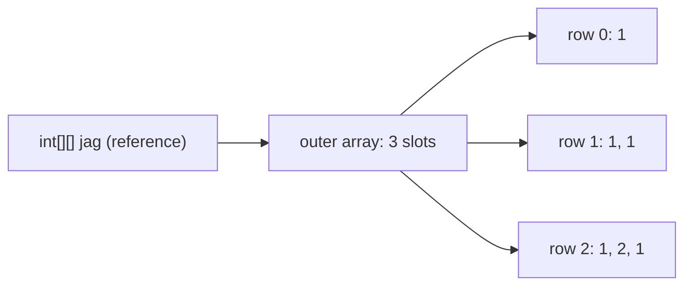

# Arrays

Coding round ka base. Syntax galat hua ya `Arrays` utility ka pitfall pata nahi to simple sawal me bhi time jaata hai. Yahan declaration se le kar sorting internals tak sab hai.

## ⭐ Declaration aur initialization

**Ek line me:** array ek fixed-size, same-type elements ka **object** hai jo heap pe continuous memory me rehta hai; index se access O(1).

- Size ek baar fix, baad me badal nahi sakta. Badhana hai to naya array + copy (ya `ArrayList`).
- `length` ek **field** hai (`arr.length`), method nahi. String me `length()` method hai.
- Array variable ek reference hai. `int[] b = a;` copy nahi banata, same array share hota hai.

```java
import java.util.Arrays;

public class Main {
    static int sum(int[] nums) { return Arrays.stream(nums).sum(); }

    public static void main(String[] args) {
        int[] a = new int[5];              // size 5, sab 0
        int[] b = {10, 20, 30};            // literal, sirf declaration ke time
        int[] c = new int[]{1, 2, 3};      // anonymous array, method me pass karne ke liye
        int d[] = new int[2];              // C-style, valid par avoid karo
        // int[] e = new int[3]{1, 2, 3};  // error: size aur values dono nahi de sakte
        // b = {4, 5};                     // error: literal sirf declaration pe

        int[] alias = b;                   // same object
        alias[0] = 99;
        int[] copy = b.clone();            // naya array (primitives ke liye full copy)
        copy[1] = 0;

        System.out.println(b.length + " " + Arrays.toString(b)); // 3 [99, 20, 30]
        System.out.println(sum(new int[]{4, 5, 6}));             // 15
        System.out.println(b);             // [I@... : reference print hua, content nahi
        System.out.println(a.length + " " + c.length + " " + d.length);
    }
}
```

**Interview tip:** "Array object hai?" Haan. Heap pe banta hai, `Object` ke methods hain (`clone`, `getClass`), aur runtime pe apna type jaanta hai (`int[]`, `String[]`).

**Common galti:** `System.out.println(arr)` se content dekhna. `Arrays.toString(arr)` lo.

## ⭐ Default values

**Ek line me:** `new` se bane array ke saare elements apne type ki default value se bhar jaate hain.

| Array type | Default |
|---|---|
| `int[]`, `long[]`, `short[]`, `byte[]` | `0` |
| `double[]`, `float[]` | `0.0` |
| `boolean[]` | `false` |
| `char[]` | `'\u0000'` (null char, print me blank) |
| `String[]`, `Integer[]`, koi bhi object array | `null` |

```java
import java.util.Arrays;

public class Main {
    public static void main(String[] args) {
        boolean[] visited = new boolean[4];      // graph BFS/DFS me ready-made
        String[] names = new String[2];
        Integer[] boxed = new Integer[2];

        System.out.println(Arrays.toString(visited)); // [false, false, false, false]
        System.out.println(Arrays.toString(names));   // [null, null]
        // System.out.println(names[0].length());     // NPE: element null hai
        // int x = boxed[0];                          // NPE: null unboxing

        int[] dp = new int[5];
        Arrays.fill(dp, -1);                          // memoization ke liye "not computed"
        System.out.println(Arrays.toString(dp));      // [-1, -1, -1, -1, -1]
    }
}
```

**Interview tip:** DP memo me `0` valid answer ho sakta hai, isliye `-1` se fill karo ya `Integer[]` lo jahan `null` = not computed.

**Common galti:** `Integer[]` ko `int[]` jaisa samajh ke seedha arithmetic karna. Elements `null` hain, NPE.

## 2D aur jagged arrays

**Ek line me:** Java me 2D array asal me **array of arrays** hai: outer array me har row ka reference, aur har row alag size ki ho sakti hai (jagged).



```java
import java.util.Arrays;

public class Main {
    public static void main(String[] args) {
        int[][] grid = new int[3][4];          // 3 rows x 4 cols, sab 0
        System.out.println(grid.length + " x " + grid[0].length); // 3 x 4

        int[][] jag = new int[3][];            // sirf rows fix, columns baad me
        jag[0] = new int[]{1};
        jag[1] = new int[]{1, 1};
        jag[2] = new int[]{1, 2, 1};           // Pascal triangle jaisa
        // int[][] bad = new int[][3];         // error: pehla dimension zaroori

        int[][] dirs = {{0, 1}, {1, 0}, {0, -1}, {-1, 0}}; // grid BFS ke 4 directions

        for (int[] row : grid) Arrays.fill(row, -1);       // 2D fill: row by row
        System.out.println(Arrays.deepToString(jag));      // [[1], [1, 1], [1, 2, 1]]
        System.out.println(Arrays.deepToString(grid));
        System.out.println(dirs.length);
    }
}
```

**Interview tip:** `grid[r][c]` me pehle row, phir column. Bounds check: `r >= 0 && r < grid.length && c >= 0 && c < grid[0].length`.

**Common galti:**
- `Arrays.fill(grid, new int[4])` likhna. Saari rows **same** array object ban jaati hain, ek badlo to sab badlega.
- Jagged array me `grid[0].length` ko har row ki length samajhna. Har row ka `grid[i].length` lo.

## ⭐ Arrays utility methods

**Ek line me:** `java.util.Arrays` class me sort, search, fill, copy, compare aur print ke ready-made static methods hain.

**Important methods:**

| Method | Kya karta hai | Time complexity |
|---|---|---|
| `Arrays.sort(a)` | ascending sort (primitives: dual-pivot quicksort, objects: TimSort) | O(n log n) |
| `Arrays.sort(a, from, to)` | sirf `[from, to)` range sort | O(k log k) |
| `Arrays.sort(objArr, comparator)` | custom order (sirf object arrays) | O(n log n) |
| `Arrays.binarySearch(a, key)` | sorted array me search; nahi mila to `-(insertionPoint) - 1` | O(log n) |
| `Arrays.fill(a, val)` | sab elements ek value | O(n) |
| `Arrays.copyOf(a, newLen)` | naya array; bada ho to defaults se pad, chhota ho to cut | O(n) |
| `Arrays.copyOfRange(a, from, to)` | `[from, to)` ka copy | O(k) |
| `Arrays.asList(arr)` | fixed-size `List` view (pitfalls neeche) | O(1) |
| `Arrays.equals(a, b)` | content compare (1D) | O(n) |
| `Arrays.deepEquals(a, b)` | 2D/nested content compare | O(total) |
| `Arrays.toString(a)` | `[1, 2, 3]` jaisa string | O(n) |
| `Arrays.deepToString(a)` | 2D array print | O(total) |
| `Arrays.stream(a)` | `IntStream`/`Stream` (sum, max, map...) | O(n) |
| `Arrays.setAll(a, i -> ...)` | index se value banao | O(n) |
| `System.arraycopy(src, sp, dst, dp, len)` | fast native copy | O(len) |

```java
import java.util.Arrays;

public class Main {
    public static void main(String[] args) {
        int[] a = {5, 3, 8, 1};
        Arrays.sort(a);
        System.out.println(Arrays.toString(a));          // [1, 3, 5, 8]
        System.out.println(Arrays.binarySearch(a, 5));   // 2
        System.out.println(Arrays.binarySearch(a, 4));   // -3 : insertion point 2 -> -(2)-1

        int[] bigger = Arrays.copyOf(a, 6);              // [1, 3, 5, 8, 0, 0]
        int[] part = Arrays.copyOfRange(a, 1, 3);        // [3, 5]
        System.out.println(Arrays.toString(bigger) + " " + Arrays.toString(part));

        int[] same = {1, 3, 5, 8};
        System.out.println((a == same) + " " + Arrays.equals(a, same)); // false true

        int[][] g = {{1, 2}, {3, 4}};
        System.out.println(Arrays.toString(g));          // [[I@..., [I@...] : kaam ka nahi
        System.out.println(Arrays.deepToString(g));      // [[1, 2], [3, 4]]

        System.out.println(Arrays.stream(a).sum() + " " + Arrays.stream(a).max().getAsInt()); // 17 8
        int[] squares = new int[5];
        Arrays.setAll(squares, i -> i * i);              // [0, 1, 4, 9, 16]
        System.out.println(Arrays.toString(squares));
    }
}
```

**Interview tip:** `binarySearch` ka negative return value insertion point batata hai: `ins = -(result) - 1`. "Lower bound" type problems me kaam aata hai. Duplicates ho to kaunsa index milega guaranteed nahi.

**Common galti:**
- Unsorted array pe `binarySearch`. Result undefined hai, error nahi aayega.
- 2D array pe `Arrays.equals` ya `Arrays.toString`. `deepEquals` / `deepToString` chahiye.

## ⭐ Arrays.asList pitfalls

**Ek line me:** `Arrays.asList` original array ka **fixed-size view** deta hai: `set` chalta hai (array bhi badalta hai), `add`/`remove` pe `UnsupportedOperationException`, aur `int[]` pe galat type.

```java
import java.util.ArrayList;
import java.util.Arrays;
import java.util.List;

public class Main {
    public static void main(String[] args) {
        String[] arr = {"Pune", "Delhi", "Goa"};
        List<String> view = Arrays.asList(arr);
        view.set(0, "Mumbai");                   // chalega
        System.out.println(arr[0]);              // Mumbai : write-through, array bhi badla
        // view.add("Agra");                     // UnsupportedOperationException
        // view.remove(0);                       // UnsupportedOperationException

        List<String> mutable = new ArrayList<>(Arrays.asList(arr)); // asli resizable list
        mutable.add("Agra");

        int[] nums = {1, 2, 3};
        List<int[]> wrong = Arrays.asList(nums);  // List<int[]>, size 1!
        List<Integer> right = Arrays.stream(nums).boxed().toList(); // [1, 2, 3] (Java 16+)
        System.out.println(wrong.size() + " " + right);  // 1 [1, 2, 3]

        List<String> fixed = List.of("a", "b");  // fully immutable, set bhi nahi, null bhi nahi
        System.out.println(mutable + " " + fixed);
    }
}
```

**Interview tip:** teen options ka farak bolo: `Arrays.asList` = fixed-size view (set allowed), `List.of` = fully immutable (null not allowed), `new ArrayList<>(...)` = poori mutable copy.

**Common galti:** `Arrays.asList(intArray)` se `List<Integer>` expect karna. Primitive array generic `T` nahi ban sakta, poora array ek element ban jaata hai.

## ⭐ Sorting: primitives vs objects

**Ek line me:** `Arrays.sort(int[])` **Dual-Pivot Quicksort** use karta hai (stable nahi), `Arrays.sort(Object[])` **TimSort** (stable, merge sort + insertion sort hybrid).

| | Primitives (`int[]`, `double[]`) | Objects (`Integer[]`, `String[]`, custom) |
|---|---|---|
| Algorithm | Dual-Pivot Quicksort | TimSort |
| Stable | Nahi (zaroorat bhi nahi) | Haan |
| Time | O(n log n) average; JDK 14+ me heapsort fallback se worst bhi O(n log n) | O(n log n) worst, nearly sorted pe ~O(n) |
| Extra space | O(log n) | O(n) worst |
| Comparator | Nahi le sakta | Le sakta hai |

- **Stability kyun objects me?** Equal primitives me farak nahi pata chalta. Par objects me (jaise orders pehle time se sorted, phir amount se) equal amount wale ka purana order bana rehna chahiye.
- `Collections.sort(list)` / `list.sort()` bhi andar TimSort hi hai.
- Bade arrays pe `Arrays.parallelSort` multi-core use karta hai.

```java
import java.util.Arrays;
import java.util.Collections;
import java.util.Comparator;

public class Main {
    public static void main(String[] args) {
        int[] a = {5, 2, 9, 1};
        Arrays.sort(a);                                    // ascending
        // Arrays.sort(a, Collections.reverseOrder());     // compile error: int[] pe comparator nahi

        Integer[] b = {5, 2, 9, 1};
        Arrays.sort(b, Collections.reverseOrder());        // [9, 5, 2, 1]

        // int[] descending: box karo, ya sort karke reverse
        int[] desc = Arrays.stream(a).boxed()
                .sorted(Comparator.reverseOrder())
                .mapToInt(Integer::intValue).toArray();
        for (int i = 0, j = a.length - 1; i < j; i++, j--) { // in-place reverse, no boxing
            int t = a[i]; a[i] = a[j]; a[j] = t;
        }
        System.out.println(Arrays.toString(b) + " " + Arrays.toString(desc) + " " + Arrays.toString(a));
    }
}
```

**Interview tip:** "Java primitives ke liye quicksort aur objects ke liye merge-type sort kyun?" Objects ko stability chahiye; primitives me stability ka matlab nahi, aur quicksort kam memory aur better cache use deta hai.

**Common galti:** `int[]` ko comparator se descending sort karne ki koshish. Comparator sirf object arrays pe chalta hai.

## ⭐ Object arrays ke liye Comparator

**Ek line me:** `Comparator` batata hai do objects me kaun pehle aayega; `Arrays.sort(arr, comparator)` se custom order milta hai.

- `Comparator.comparingInt(...)`, `.reversed()`, `.thenComparing(...)` chain readable hai.
- `(x, y) -> x - y` mat likho: bade/negative values pe overflow. `Integer.compare(x, y)` lo.

```java
import java.util.Arrays;
import java.util.Comparator;

public class Main {
    record Player(String name, int runs) {}

    public static void main(String[] args) {
        // Merge intervals se pehle start se sort
        int[][] intervals = {{5, 8}, {1, 3}, {2, 6}};
        Arrays.sort(intervals, (x, y) -> Integer.compare(x[0], y[0]));
        System.out.println(Arrays.deepToString(intervals)); // [[1, 3], [2, 6], [5, 8]]

        // IPL leaderboard: runs desc, tie pe name asc
        Player[] ps = {
            new Player("Rohit", 450), new Player("Virat", 520), new Player("Gill", 450)
        };
        Arrays.sort(ps, Comparator.comparingInt(Player::runs).reversed()
                                  .thenComparing(Player::name));
        System.out.println(Arrays.toString(ps)); // order: Virat (520), Gill (450), Rohit (450)

        // Length se, phir alphabetical
        String[] names = {"Ravi", "Bo", "Amit", "Zoya"};
        Arrays.sort(names, Comparator.comparingInt(String::length)
                                     .thenComparing(Comparator.naturalOrder()));
        System.out.println(Arrays.toString(names)); // [Bo, Amit, Ravi, Zoya]
    }
}
```

**Interview tip:** `Comparable` = class ka natural order (`compareTo` class ke andar). `Comparator` = bahar se alag-alag order. Ek class ke kai sort orders chahiye to `Comparator`.

**Common galti:** `(a, b) -> a[0] - b[0]` likhna. `Integer.MIN_VALUE` jaise values pe overflow se galat order. `Integer.compare` safe hai.

## ⭐ Array vs ArrayList

**Ek line me:** array fixed-size aur primitives rakh sakta hai; `ArrayList` dynamic size wala hai par sirf objects (boxed) rakhta hai.

| | Array | ArrayList |
|---|---|---|
| Size | Fixed | Dynamic (full hone pe ~1.5x grow) |
| Primitives | Haan (`int[]`) | Nahi, `Integer` boxing |
| Length | `arr.length` | `list.size()` |
| Access | `arr[i]` | `list.get(i)` |
| Memory/speed | Kam memory, fast | Boxing + object overhead |
| Generics | Covariant, runtime check | Invariant, compile-time type safety |
| Utility class | `Arrays` | `Collections` |
| Multi-dim | `int[][]` | `List<List<Integer>>` |

**Interview tip:** size pata hai aur primitives hain (DP table, freq count) to array. Size nahi pata ya insert/remove chahiye to `ArrayList`.

**Common galti:** `list.remove(1)` ko value 1 hatana samajhna. `List<Integer>` pe ye **index** 1 hatata hai. Value ke liye `list.remove(Integer.valueOf(1))`.

## Common patterns (short)

**Ek line me:** array problems me sabse common do tricks: **two pointers** (sorted array, O(n)) aur **prefix sum** (range sum O(1)).

```java
import java.util.Arrays;

public class Main {
    // Sorted array me do numbers jinka sum target ho: O(n)
    static int[] pairSum(int[] a, int target) {
        int i = 0, j = a.length - 1;
        while (i < j) {
            int s = a[i] + a[j];
            if (s == target) return new int[]{i, j};
            if (s < target) i++; else j--;
        }
        return new int[]{-1, -1};
    }

    // p[i] = pehle i elements ka sum; sum(l..r) = p[r + 1] - p[l]
    static long[] prefix(int[] a) {
        long[] p = new long[a.length + 1];                // long: overflow se bachao
        for (int i = 0; i < a.length; i++) p[i + 1] = p[i] + a[i];
        return p;
    }

    public static void main(String[] args) {
        int[] a = {1, 3, 4, 6, 9};
        System.out.println(Arrays.toString(pairSum(a, 10))); // [0, 4]
        long[] p = prefix(a);
        System.out.println(p[4] - p[1]);                     // 3 + 4 + 6 = 13
    }
}
```

**Interview tip:** brute force O(n²) bolke turant optimize karo: "array sorted hai to two pointers", "baar baar range sum chahiye to prefix sum".

**Common galti:** prefix array size `n` rakhna aur `l = 0` pe `p[l - 1]` access karna. Size `n + 1` lo, edge case khud handle ho jaata hai.

## ⭐ ArrayIndexOutOfBoundsException

**Ek line me:** valid index `0` se `length - 1` tak; iske bahar access pe runtime pe `ArrayIndexOutOfBoundsException`.

```java
public class Main {
    public static void main(String[] args) {
        int[] a = new int[3];
        try {
            for (int i = 0; i <= a.length; i++) a[i] = i;  // <= : off-by-one bug
        } catch (ArrayIndexOutOfBoundsException e) {
            System.out.println(e.getMessage());   // Index 3 out of bounds for length 3
        }
        int[] empty = new int[0];                 // valid: length 0
        // empty[0] = 1;                          // AIOOBE: empty input ka edge case
        // int[] neg = new int[-1];               // NegativeArraySizeException
        System.out.println(empty.length);
    }
}
```

**Interview tip:** code likhte hi edge cases khud bolo: empty array, single element, `i + 1` / `i - 1` access pe boundary.

**Common galti:** loop me `a[i + 1]` access karna aur condition `i < n` rakhna. `i < n - 1` chahiye.

## Arrays covariant hain (ArrayStoreException)

**Ek line me:** `String[]` ek `Object[]` bhi hai (covariance), isliye galat type store karna compile ho jaata hai par runtime pe `ArrayStoreException` aata hai.

- Array runtime pe apna element type jaanta hai (reified), isliye JVM har store pe check karta hai.
- Generics **invariant** hain aur type erase ho jaata hai: `List<Object> l = new ArrayList<String>();` compile error. Isliye generics compile time pe hi bacha lete hain.
- Isi wajah se `new T[n]` ya `new List<String>[n]` (generic array creation) allowed nahi.

```java
public class Main {
    public static void main(String[] args) {
        Object[] objs = new String[2];   // compile ho jaata hai: covariance
        objs[0] = "ok";
        try {
            objs[1] = 42;                // runtime pe pakda gaya
        } catch (ArrayStoreException e) {
            System.out.println("ArrayStoreException: " + e.getMessage()); // java.lang.Integer
        }
        // java.util.List<Object> list = new java.util.ArrayList<String>(); // compile error
    }
}
```

**Interview tip:** "Arrays covariant aur generics invariant kyun?" Arrays generics se pehle aaye, runtime type check se safety milti hai. Generics erasure use karte hain, runtime pe type nahi pata, isliye compile-time pe hi invariant rakhe.

**Common galti:** `Object[]` parameter wale method me kuch bhi store karna aur maan lena safe hai. Caller ne `String[]` diya ho to runtime pe crash.

## Checklist

- [ ] Array declare/initialize karne ke saare valid tareeke aur `length` field jaanta hoon
- [ ] Har type ke array ki default value aur `Integer[]` ka null pitfall bata sakta hoon
- [ ] 2D aur jagged arrays bana sakta hoon aur `Arrays.fill` wala shared-row bug samjha sakta hoon
- [ ] `Arrays` ke main methods (sort, binarySearch, copyOf, equals, deepToString) aur complexity bata sakta hoon
- [ ] `Arrays.asList` vs `List.of` vs `new ArrayList<>()` ka farak bata sakta hoon
- [ ] Primitives (dual-pivot quicksort) vs objects (TimSort) sorting aur stability samjha sakta hoon
- [ ] Comparator se intervals / custom objects sort kar sakta hoon bina overflow bug ke
- [ ] Array vs ArrayList aur covariance (`ArrayStoreException`) samjha sakta hoon
