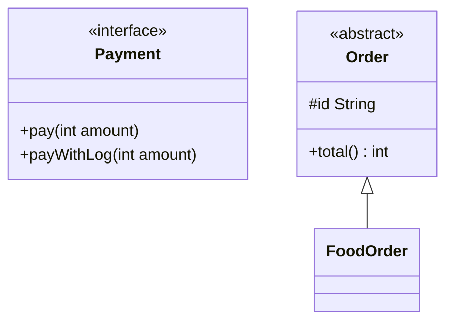

# OOP in Java

OOP ke 4 pillars (encapsulation, inheritance, polymorphism, abstraction) sab jaante hain. Java interview me asli sawal unke **Java-specific rules** pe hote hain: constructor chaining, overriding rules, default methods ka diamond, `equals`/`hashCode` contract, immutable class. Ye file wahi cover karti hai.

## ⭐ Class, object & constructor

**Ek line me:** class blueprint hai, object uska heap pe bana instance hai, aur constructor object ko valid state me initialize karta hai.

- Constructor ka naam class jaisa, koi return type nahi. Inherit nahi hota.
- Tumne koi constructor nahi likha to compiler **default no-arg constructor** daal deta hai. Ek bhi likh diya to default gayab.
- `this(...)` same class ka dusra constructor call karta hai, `super(...)` parent ka. Dono **pehla statement** hone chahiye, isliye ek constructor me dono saath nahi aa sakte.
- `super(...)` nahi likha to compiler `super()` khud daalta hai. Parent me no-arg constructor nahi hai to **compile error**.
- Object banne ka order: parent pehle, child baad me (upar se neeche).

```java
public class Main {
    static class Vehicle {
        protected final String brand;
        Vehicle(String brand) {
            this.brand = brand;                // this = current object
            System.out.println("Vehicle ctor");
        }
    }

    static class Car extends Vehicle {
        private final int seats;
        Car(String brand) {
            this(brand, 4);                    // same class ka dusra ctor (chaining)
        }
        Car(String brand, int seats) {
            super(brand);                      // parent ctor, pehli line
            this.seats = seats;
            System.out.println("Car ctor");
        }
    }

    public static void main(String[] args) {
        Car c = new Car("Tata");               // Vehicle ctor -> Car ctor
        System.out.println(c.brand + " " + c.seats); // Tata 4
    }
}
```

**Interview tip:** "Constructor me `this()` aur `super()` dono kyun nahi?" → dono ko first statement hona hai. `this()` wala constructor aage chalke `super()` call karega hi, isliye parent ek hi baar banta hai.

**Common galti:** parameterized constructor likh ke maan lena ki `new Car()` ab bhi chalega. Default constructor tab gayab ho jaata hai.

## ⭐ Encapsulation

**Ek line me:** data `private` rakho aur bahar sirf controlled methods do, taaki object kabhi invalid state me na jaaye.

Getter/setter sirf "fields public karne ka lamba tareeka" nahi hain. Asli faayda: **validation** aur **invariant** ek jagah. Jahan setter ki zarurat nahi, mat do.

```java
public class Main {
    static class Wallet {                      // Paytm wallet jaisa
        private long balance;                  // bahar se direct touch nahi

        public long getBalance() { return balance; }

        public void add(long amount) {
            if (amount <= 0) throw new IllegalArgumentException("amount > 0 chahiye");
            balance += amount;
        }

        public void pay(long amount) {
            if (amount > balance) throw new IllegalStateException("balance kam hai");
            balance -= amount;
        }
        // setBalance() jaan-bujh ke nahi diya
    }

    public static void main(String[] args) {
        Wallet w = new Wallet();
        w.add(500);
        w.pay(200);
        System.out.println(w.getBalance()); // 300
    }
}
```

**Access modifiers:** `private` (sirf class) < default/package-private (same package) < `protected` (package + subclasses) < `public` (sab).

**Interview tip:** "Encapsulation aur abstraction me farak?" → encapsulation **data chhupata** hai (kaise store hai), abstraction **complexity chhupati** hai (kya karta hai, kaise nahi).

**Common galti:** getter se andar ki mutable `List` seedha return karna. Caller bahar se list badal dega, encapsulation toot gaya.

## ⭐ Inheritance

**Ek line me:** `extends` se child class parent ka code reuse karti hai ("is-a" relation).

- Java me class ka **sirf single inheritance** hai: ek class ek hi class ko extend kar sakti hai.
- **Multiple class inheritance kyun nahi?** Diamond problem: do parents me same method ya same field ho to kaunsa? State (fields) do jagah se aaye to confusion. Java ne class level pe ye band rakha.
- Interfaces multiple implement ho sakte hain. Java 8 ke `default` methods ke baad interfaces me bhi diamond aa gaya, uske rules fix hain:
  1. **Class jeetti hai:** class (ya superclass) me method hai to wahi chalega.
  2. **Zyada specific interface jeetta hai:** `B extends A` aur dono me default hai to `B` ka.
  3. Phir bhi conflict ho to class ko **override karna padega**, warna compile error. Kisi ek ko `X.super.method()` se call kar sakte ho.

```java
public class Main {
    interface Camera { default String click() { return "Camera click"; } }
    interface Scanner { default String click() { return "Scanner click"; } }

    // Dono me same default method -> override karna zaroori
    static class Phone implements Camera, Scanner {
        @Override
        public String click() {
            return Camera.super.click() + " + " + Scanner.super.click();
        }
    }

    public static void main(String[] args) {
        System.out.println(new Phone().click()); // Camera click + Scanner click
    }
}
```

**Interview tip:** "Java me multiple inheritance hai?" → "Class ka nahi, type ka hai. Interfaces multiple implement kar sakte hain. Default methods ka conflict compile time pe pakda jaata hai aur class ko resolve karna padta hai."

**Common galti:** sirf code reuse ke liye inheritance lena jabki "is-a" relation hi nahi hai. Neeche composition wala section dekho.

## ⭐ Polymorphism: overloading vs overriding

**Ek line me:** ek naam, alag behaviour. Overloading compile time pe decide hota hai, overriding runtime pe (object ka actual type dekh ke).

| | Overloading | Overriding |
|---|---|---|
| Kahan | same class (ya subclass) | parent-child |
| Signature | parameter list **alag** | **same** naam + params |
| Return type | kuch bhi (sirf return type badalna kaafi nahi) | same ya **covariant** (subtype) |
| Access | kuch bhi | same ya **zyada wide** (protected → public OK, ulta nahi) |
| Checked exceptions | kuch bhi | same, narrower ya koi nahi. Naya/broader checked nahi |
| Binding | compile time (static) | runtime (dynamic dispatch) |
| static / private / final | overload ho sakte hain | override **nahi** hote |

`static` method child me same signature se likha to wo **method hiding** hai, overriding nahi: call reference type se decide hota hai. Fields bhi polymorphic nahi hote, wo bhi reference type se aate hain.

```java
import java.io.FileNotFoundException;
import java.io.IOException;

public class Main {
    static class Animal {
        protected String sound() { return "..."; }
        Animal copy() throws IOException { return new Animal(); }
        static String type() { return "Animal"; }
    }

    static class Dog extends Animal {
        @Override public String sound() { return "Bhow"; }   // protected -> public: OK
        @Override Dog copy() throws FileNotFoundException {  // covariant return + narrower exception
            return new Dog();
        }
        static String type() { return "Dog"; }               // hiding, overriding nahi
    }

    // Overloading: params alag
    static int add(int a, int b) { return a + b; }
    static long add(long a, long b) { return a + b; }
    static int add(int a, int b, int c) { return a + b + c; }

    public static void main(String[] args) {
        Animal a = new Dog();
        System.out.println(a.sound());     // Bhow   (runtime object Dog)
        System.out.println(Animal.type()); // Animal (static: koi dispatch nahi)
        System.out.println(add(2, 3));     // 5 -> int version
        System.out.println(add(2, 3L));    // 5 -> long version (2 widen hua)
    }
}
```

**Interview tip:** "Kya static method override hota hai?" → "Nahi, hide hota hai. `Animal a = new Dog(); a.type()` Animal ka chalega kyunki static calls reference type pe compile time pe bind hote hain."

**Common galti:**
- `@Override` na lagana. Typo ya galat param type se overload ban jaata hai aur bug chupa rehta hai. Annotation compile error de deta.
- `equals(Dog d)` likhna. Ye `equals(Object)` ka overload hai, override nahi.

## ⭐ Abstraction: abstract class vs interface

**Ek line me:** "kya karna hai" batao, "kaise" subclass pe chhodo. Java me do tools: abstract class aur interface.

| Point | Abstract class | Interface (Java 8+) |
|---|---|---|
| Methods | abstract + concrete | abstract, `default` (8), `static` (8), `private` (9) |
| State | instance fields rakh sakta hai | sirf `public static final` constants |
| Constructor | haan (subclass `super()` se call karti hai) | nahi |
| Inheritance | ek hi extend | multiple implement |
| Access | koi bhi modifier | methods by default `public` |
| Kab | related classes, common state + code | capability / contract ("can-do"), alag-alag classes pe |

```java
public class Main {
    interface Payment {
        void pay(int amount);                          // abstract

        default void payWithLog(int amount) {          // Java 8 default
            log("start " + amount);
            pay(amount);
            log("done");
        }

        static Payment upi() {                         // Java 8 static factory
            return amt -> System.out.println("UPI se paid " + amt);
        }

        private void log(String msg) {                 // Java 9 private helper
            System.out.println("[LOG] " + msg);
        }
    }

    static abstract class Order {
        protected final String id;                     // state
        Order(String id) { this.id = id; }             // constructor
        abstract int total();                          // subclass batayegi
        void print() { System.out.println(id + " -> Rs " + total()); }
    }

    static class FoodOrder extends Order {
        FoodOrder(String id) { super(id); }
        @Override int total() { return 350; }
    }

    public static void main(String[] args) {
        Payment.upi().payWithLog(350);
        new FoodOrder("SWG-101").print();              // SWG-101 -> Rs 350
    }
}
```



**Interview tip:** "Java 8 ke baad interface me default methods hain, to abstract class ki zarurat kyun?" → "Interface me instance state aur constructor nahi ho sakte. Shared state + common logic chahiye to abstract class, sirf contract ya multiple types chahiye to interface."

**Common galti:** interface ke default method me heavy business logic daal dena. Default methods ka asli use backward compatibility hai (jaise `List.sort` Java 8 me add hua bina purani classes tode).

## ⭐ final & static

**Ek line me:** `final` = badal nahi sakte, `static` = class ka hai, object ka nahi.

| Keyword | Variable | Method | Class |
|---|---|---|---|
| `final` | ek baar assign (reference fixed, object mutable ho sakta hai) | override nahi ho sakta | extend nahi ho sakti (`String`, `Integer`) |
| `static` | sab objects me ek copy | bina object call, `this` nahi | sirf nested class `static` ho sakti hai |

- **Blank final:** declare pe value nahi di to har constructor me assign karna zaroori.
- `static` method instance fields/methods directly access nahi kar sakta.
- `static` block class load hone pe ek baar chalta hai.

```java
import java.util.ArrayList;
import java.util.List;

public class Main {
    static class Ticket {
        static int counter = 0;                 // sab tickets me shared
        static final String PREFIX;             // constant
        static { PREFIX = "BMS-"; }             // class load pe ek baar

        private final String id;                // blank final, ctor me set
        Ticket() { id = PREFIX + (++counter); }
        String getId() { return id; }
    }

    public static void main(String[] args) {
        System.out.println(new Ticket().getId()); // BMS-1
        System.out.println(new Ticket().getId()); // BMS-2

        final List<String> seats = new ArrayList<>();
        seats.add("A1");                        // OK: object badal sakte ho
        // seats = new ArrayList<>();           // compile error: reference final
    }
}
```

**Interview tip:** "`final` list me add kar sakte hain?" → "Haan. `final` reference ko lock karta hai, object ko nahi. Content lock karna hai to `List.of` ya `Collections.unmodifiableList`."

**Common galti:** `static` mutable field ko shared cache ki tarah use karna multi-threaded code me bina synchronization ke.

## Nested, inner, local & anonymous classes

**Ek line me:** class ke andar class. Static nested ko outer object nahi chahiye, inner class ko chahiye.

| Type | Kahan likhte hain | Outer instance chahiye? | Use |
|---|---|---|---|
| Static nested | class ke andar, `static` | nahi | Builder, `Map.Entry`, helper |
| Inner (non-static) | class ke andar | haan (`outer.new Inner()`) | iterator jo outer ka data padhe |
| Local | method ke andar | method ke context me | ek method ka helper |
| Anonymous | expression me, bina naam | context pe depend | ek baar ka implementation (lambda se pehle) |

Local aur anonymous classes sirf **effectively final** local variables capture kar sakti hain.

```java
public class Main {
    private int x = 10;

    static class StaticNested { int get() { return 1; } }   // outer object nahi chahiye
    class Inner { int get() { return x; } }                 // outer ka x padhta hai

    public static void main(String[] args) {
        StaticNested sn = new StaticNested();
        Main outer = new Main();
        Main.Inner in = outer.new Inner();                  // outer instance se banta hai

        int base = 5;                                        // effectively final
        class Local { int get() { return base * 2; } }       // local class

        Runnable r = new Runnable() {                        // anonymous class
            @Override public void run() { System.out.println("run " + base); }
        };

        System.out.println(sn.get() + " " + in.get() + " " + new Local().get()); // 1 10 10
        r.run();                                             // run 5
    }
}
```

**Interview tip:** "Static nested ko prefer kyun?" → inner class ke andar outer object ka hidden reference hota hai. Lambi life wali inner class outer ko GC hone nahi deti (memory leak). Outer ki zarurat nahi to `static` banao.

**Common galti:** anonymous class ke andar captured variable ko baad me badalna. Compile error: "must be final or effectively final".

## ⭐ equals & hashCode contract

**Ek line me:** agar `a.equals(b)` true hai to `a.hashCode() == b.hashCode()` hona hi chahiye. Ulta zaroori nahi (same hash, alag objects = collision, allowed).

**equals ke rules:** reflexive (`a.equals(a)`), symmetric, transitive, consistent, aur `a.equals(null)` hamesha `false`.

Default `Object.equals` sirf reference compare karta hai (`==`). `HashSet`/`HashMap` pehle `hashCode` se bucket dhoondhte hain, phir `equals` se match. `equals` override kiya aur `hashCode` nahi, to equal objects alag buckets me jaate hain.

```java
import java.util.HashSet;
import java.util.Objects;
import java.util.Set;

public class Main {
    static class Point {
        final int x, y;
        Point(int x, int y) { this.x = x; this.y = y; }

        @Override
        public boolean equals(Object o) {
            if (this == o) return true;
            if (!(o instanceof Point p)) return false;   // Java 16 pattern matching
            return x == p.x && y == p.y;
        }
        // hashCode override NAHI kiya -> contract toota
    }

    static class GoodPoint extends Point {
        GoodPoint(int x, int y) { super(x, y); }
        @Override public int hashCode() { return Objects.hash(x, y); }
    }

    public static void main(String[] args) {
        Set<Point> bad = new HashSet<>();
        bad.add(new Point(1, 2));
        System.out.println(bad.contains(new Point(1, 2))); // false (alag bucket)
        bad.add(new Point(1, 2));
        System.out.println(bad.size());                    // 2 -> "duplicate" aa gaya

        Set<Point> good = new HashSet<>();
        good.add(new GoodPoint(1, 2));
        System.out.println(good.contains(new GoodPoint(1, 2))); // true
    }
}
```

**Interview tip:** "Sirf hashCode override kiya, equals nahi to?" → same bucket me jaayenge par `equals` reference compare karega, to phir bhi duplicates. **Dono saath override karo**, same fields use karke. Java 16+ me `record` dono khud generate karta hai.

**Common galti:**
- Mutable field pe hashCode banana aur object ko HashSet me daalne ke baad field badalna. Object "kho" jaata hai: `contains` false, `remove` kaam nahi karta.
- `equals` me `instanceof` vs `getClass()`: subclass extra field add kare to `instanceof` symmetry tod sakta hai. Value classes ko `final` rakho.

## toString & Object class methods

**Ek line me:** har class implicitly `Object` extend karti hai, uske methods sabko milte hain.

| Method | Kya karta hai | Note |
|---|---|---|
| `equals(Object)` | logical equality | default `==` |
| `hashCode()` | hash bucket ke liye int | equals ke saath override |
| `toString()` | readable string | default `ClassName@hexHash` |
| `getClass()` | runtime class | final, override nahi hota |
| `clone()` | copy (protected) | `Cloneable` chahiye, default shallow copy. Copy constructor better |
| `wait()` / `notify()` / `notifyAll()` | thread coordination | `synchronized` block ke andar hi call karo |
| `finalize()` | GC se pehle hook | Java 9 se deprecated, use mat karo |

```java
public class Main {
    static class Order {
        private final String id;
        private final int amount;
        Order(String id, int amount) { this.id = id; this.amount = amount; }

        @Override
        public String toString() {
            return "Order{id=" + id + ", amount=" + amount + "}";
        }
    }

    public static void main(String[] args) {
        Order o = new Order("ZOM-7", 499);
        System.out.println(o);              // Order{id=ZOM-7, amount=499}
        System.out.println(o.getClass().getSimpleName()); // Order
    }
}
```

**Interview tip:** "Object class ke methods gino" → equals, hashCode, toString, getClass, clone, finalize, wait (3 overloads), notify, notifyAll.

**Common galti:** `toString()` me password ya card number print kar dena. Logs me leak ho jaata hai.

## ⭐ Immutable class kaise banaye

**Ek line me:** object ban gaya to uski state kabhi nahi badlegi. `String`, `Integer`, `LocalDate` isi tarah bane hain.

**Steps:**
1. Class ko `final` banao (subclass mutable behaviour na laaye).
2. Saare fields `private final`.
3. Koi setter nahi.
4. Constructor me mutable inputs ki **defensive copy**.
5. Getter me mutable field ki copy ya unmodifiable view do.
6. "Change" chahiye to naya object return karo (`withX()` style).

**Faayde:** thread-safe bina lock, HashMap key ke liye safe, cache kar sakte ho.

```java
import java.util.ArrayList;
import java.util.List;

public class Main {
    static final class Cart {                            // 1. final
        private final String userId;                     // 2. private final
        private final List<String> items;

        Cart(String userId, List<String> items) {
            this.userId = userId;
            this.items = List.copyOf(items);             // 4. defensive copy (immutable)
        }

        String getUserId() { return userId; }
        List<String> getItems() { return items; }        // 5. already unmodifiable

        Cart withItem(String item) {                     // 6. naya object
            List<String> copy = new ArrayList<>(items);
            copy.add(item);
            return new Cart(userId, copy);
        }
    }

    public static void main(String[] args) {
        List<String> input = new ArrayList<>(List.of("Milk"));
        Cart c1 = new Cart("u1", input);
        input.add("Bread");                              // c1 pe asar nahi
        Cart c2 = c1.withItem("Eggs");
        System.out.println(c1.getItems());               // [Milk]
        System.out.println(c2.getItems());               // [Milk, Eggs]
        // c1.getItems().add("X");                       // UnsupportedOperationException
    }
}
```

**Interview tip:** "`record` immutable hai?" → "Shallowly. Fields final hain, par record me `List` hai to list ke andar badlav ho sakta hai. Compact constructor me `List.copyOf` karo."

**Common galti:** sirf `final` fields bana ke immutable samajh lena, jabki andar mutable `List`/`Date` ka reference bahar leak ho raha hai.

## Composition vs inheritance

**Ek line me:** "is-a" ho tabhi inheritance, warna "has-a" yaani composition (object ke andar dusra object rakho aur kaam delegate karo). Default choice: **composition**.

| | Inheritance | Composition |
|---|---|---|
| Relation | is-a (Dog is an Animal) | has-a (Car has an Engine) |
| Coupling | tight: parent badla to child toot sakta hai | loose: interface ke through |
| Runtime change | nahi | haan (dusra Engine inject karo) |
| Testing | mushkil | mock inject karna easy |

Classic bug: `HashSet` extend karke `add` aur `addAll` dono me counter badhao. `HashSet.addAll` andar `add` call karta hai, count double ho jaata hai. Parent ke internals pe depend karna = fragile base class problem. JDK ki apni galti: `Stack extends Vector`, isliye Stack me beech me insert bhi ho jaata hai.

```java
public class Main {
    interface Engine { void start(); }
    static class PetrolEngine implements Engine {
        public void start() { System.out.println("Petrol engine on"); }
    }
    static class ElectricEngine implements Engine {
        public void start() { System.out.println("EV motor on"); }
    }

    static class Car {
        private final Engine engine;                 // has-a
        Car(Engine engine) { this.engine = engine; }
        void drive() {
            engine.start();                          // kaam delegate kiya
            System.out.println("Car chal rahi hai");
        }
    }

    public static void main(String[] args) {
        new Car(new PetrolEngine()).drive();
        new Car(new ElectricEngine()).drive();       // bina Car badle engine badla
    }
}
```

**Interview tip:** "Favor composition over inheritance" bolo aur example do: Strategy pattern, ya `Stack extends Vector` wali JDK galti.

**Common galti:** sirf 2 methods reuse karne ke liye badi class extend kar lena, aur saath me uska poora public API bhi expose kar dena.

## Checklist

- [ ] Constructor chaining (`this()` / `super()`) ke rules aur object banne ka order bata sakta hoon
- [ ] Java me multiple class inheritance kyun nahi aur default methods ka diamond kaise resolve hota hai, bata sakta hoon
- [ ] Overriding ke rules (access, checked exceptions, covariant return) aur static method hiding samjha sakta hoon
- [ ] Java 8+ me abstract class vs interface ka farak aur kab kya use karna hai, bata sakta hoon
- [ ] `final` aur `static` ka variable, method, class pe asar bata sakta hoon
- [ ] Static nested, inner, local aur anonymous class ka farak bata sakta hoon
- [ ] `equals`/`hashCode` contract likh sakta hoon aur HashSet todne wala example de sakta hoon
- [ ] Immutable class step by step bana sakta hoon (defensive copy ke saath)
- [ ] Composition vs inheritance ka trade-off example ke saath samjha sakta hoon
