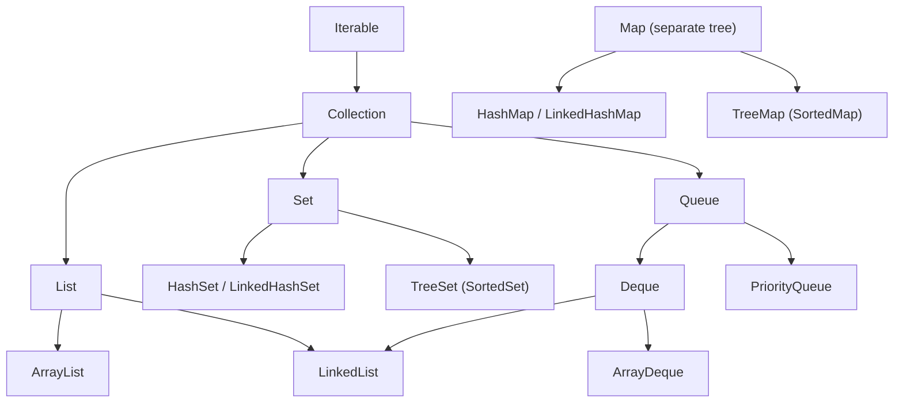

# Collections Framework

`java.util` ka Collections Framework = **interfaces** (List, Set, Queue, Map) + unki **implementations** (ArrayList, HashSet, HashMap...) + **utility** (`Collections`, `Arrays`). Interview me sabse zyada poocha jaata hai: hierarchy, kaunsa collection kab, complexities, iterators aur Comparable vs Comparator.

## ⭐ Collections hierarchy

**Ek line me:** `Iterable` sabse upar, uske neeche `Collection` aur phir `List`, `Set`, `Queue`. `Map` alag tree hai, `Collection` extend nahi karta.



- **List:** ordered, index se access, duplicates allowed.
- **Set:** duplicates nahi. Order implementation pe depend (Hash = koi order nahi, Linked = insertion order, Tree = sorted).
- **Queue / Deque:** ek ya dono end se add/remove. `PriorityQueue` heap order me deta hai.
- **Map:** key → value. Keys unique. `Map` Iterable nahi hai, `keySet()`, `values()`, `entrySet()` se iterate karte ho.
- Java 21 me `SequencedCollection` / `SequencedMap` aaye: `getFirst()`, `getLast()`, `reversed()` List, Deque, LinkedHashSet, LinkedHashMap sab pe.

**Interview tip:** "Map Collection kyun nahi extend karta?" → Collection single elements ka group hai (`add(E)`), Map pairs ka. `add(E)` ka Map pe koi matlab nahi banta.

**Common galti:** `Collection` (interface) aur `Collections` (utility class) ko mix karna.

## Interfaces vs implementations

**Ek line me:** variable ka type interface rakho, object implementation ka banao. Kal implementation badalni ho to ek line badlegi.

```java
import java.util.*;

public class Main {
    // Method interface leta hai -> ArrayList, LinkedList, List.of sab chalenge
    static int total(List<Integer> prices) {
        int sum = 0;
        for (int p : prices) sum += p;
        return sum;
    }

    public static void main(String[] args) {
        List<Integer> cart = new ArrayList<>();      // "program to interface"
        cart.add(120);
        cart.add(80);
        Map<String, Integer> stock = new HashMap<>(); // kal TreeMap chahiye to sirf yahan badlo
        stock.put("Maggi", 40);
        System.out.println(total(cart) + " " + stock); // 200 {Maggi=40}
    }
}
```

**Interview tip:** "`List<String> l = new ArrayList<>()` aur `ArrayList<String> l = ...` me kya better?" → interface wala. Loose coupling, testing easy, aur method signatures flexible.

**Common galti:** public API me `ArrayList`/`HashMap` concrete type return/accept karna.

## ⭐ Kaunsa collection kab (decision table)

**Ek line me:** pehle poocho: duplicates? order? sorted? key-value? index access? thread-safe? Jawab se collection mil jaata hai.

| Zarurat | Choose | Key operations ki complexity |
|---|---|---|
| Index se access, mostly end me add | `ArrayList` | get O(1), add end O(1) amortized, beech me insert/remove O(n) |
| Unique elements, fast lookup | `HashSet` | add / contains / remove O(1) avg |
| Unique + insertion order yaad rahe | `LinkedHashSet` | O(1) avg |
| Sorted unique, range / floor / ceiling | `TreeSet` | O(log n) |
| Key-value, fast lookup | `HashMap` | get / put O(1) avg, worst O(log n) (treeified bucket) |
| Key-value + insertion/access order (LRU) | `LinkedHashMap` | O(1) avg |
| Sorted keys, floorKey / ceilingKey | `TreeMap` | O(log n) |
| Stack ya queue ya dono end | `ArrayDeque` | push / pop / offer / poll O(1) |
| Bar bar min/max nikalna (top-K, Dijkstra) | `PriorityQueue` | offer / poll O(log n), peek O(1) |
| Multi-thread map | `ConcurrentHashMap` | O(1) avg, fine-grained locking |
| Multi-thread list, reads bahut, writes kam | `CopyOnWriteArrayList` | read O(1), write O(n) (copy) |

**Interview tip:** "Stack ke liye kya use karoge?" → "`ArrayDeque`, legacy `Stack` nahi. Stack `Vector` pe bana hai, har method synchronized hai."

**Common galti:** `contains` bar bar `List` pe call karna (O(n) har baar). Lookups zyada hain to `HashSet` banao.

## ⭐ Iterable, Iterator & ListIterator

**Ek line me:** `Iterable` ka matlab "for-each me chal sakta hai". Wo ek `Iterator` deta hai jo `hasNext()` / `next()` / `remove()` karta hai. `ListIterator` sirf List pe, dono direction me chalta hai aur `set`/`add` bhi karta hai.

| Method | Kya karta hai | Kahan |
|---|---|---|
| `hasNext()` / `next()` | aage ka element | Iterator |
| `remove()` | last `next()` wala element hatao (safe) | Iterator |
| `hasPrevious()` / `previous()` | peeche chalo | ListIterator |
| `nextIndex()` / `previousIndex()` | current index | ListIterator |
| `set(e)` | last returned element replace | ListIterator |
| `add(e)` | cursor pe insert | ListIterator |

```java
import java.util.*;

public class Main {
    // Apni class ko for-each me chalana hai to Iterable implement karo
    static class Range implements Iterable<Integer> {
        private final int from, to;
        Range(int from, int to) { this.from = from; this.to = to; }

        @Override
        public Iterator<Integer> iterator() {
            return new Iterator<>() {
                int cur = from;
                public boolean hasNext() { return cur < to; }
                public Integer next() {
                    if (!hasNext()) throw new NoSuchElementException();
                    return cur++;
                }
            };
        }
    }

    public static void main(String[] args) {
        for (int i : new Range(1, 4)) System.out.print(i + " "); // 1 2 3
        System.out.println();

        List<Integer> nums = new ArrayList<>(List.of(1, 2, 3, 4, 5));
        Iterator<Integer> it = nums.iterator();
        while (it.hasNext()) {
            if (it.next() % 2 == 0) it.remove();   // safe removal
        }
        System.out.println(nums);                  // [1, 3, 5]

        ListIterator<Integer> li = nums.listIterator();
        while (li.hasNext()) {
            int n = li.next();
            li.set(n * 10);                        // replace
            if (n == 3) li.add(99);                // current ke baad insert
        }
        System.out.println(nums);                  // [10, 30, 99, 50]
        while (li.hasPrevious()) System.out.print(li.previous() + " "); // 50 99 30 10
    }
}
```

**Interview tip:** for-each loop compile hoke `iterator()` + `hasNext()`/`next()` ban jaata hai. Isliye for-each ke andar `list.remove()` CME deta hai, `it.remove()` nahi.

**Common galti:** `it.remove()` ko `next()` se pehle ya ek `next()` pe do baar call karna → `IllegalStateException`.

## ⭐ Fail-fast vs fail-safe iterators

**Ek line me:** fail-fast iterator iteration ke beech structural change dekhte hi `ConcurrentModificationException` (CME) phenkta hai. Fail-safe (weakly consistent) iterator copy ya snapshot pe chalta hai aur CME nahi deta.

**Andar kaise:** `ArrayList` ek `modCount` rakhta hai (har add/remove pe ++). Iterator banate waqt `expectedModCount = modCount` save hota hai. Har `next()` pe compare hota hai, alag mila to CME. Ye best-effort check hai, thread-safety guarantee nahi.

| | Fail-fast | Fail-safe / weakly consistent |
|---|---|---|
| Examples | `ArrayList`, `HashMap`, `HashSet` ke iterators | `CopyOnWriteArrayList`, `ConcurrentHashMap` |
| Beech me modify | CME | koi exception nahi |
| Kis data pe chalta hai | original collection | snapshot (COW) ya live data, latest changes dikhe ya na dikhe |
| Memory cost | nahi | COW me har write pe poori array copy |

```java
import java.util.*;
import java.util.concurrent.*;

public class Main {
    public static void main(String[] args) {
        List<String> list = new ArrayList<>(List.of("a", "b", "c"));
        try {
            for (String s : list) {
                if (s.equals("a")) list.remove(s);   // structural change
            }
        } catch (ConcurrentModificationException e) {
            System.out.println("CME!");
        }

        List<String> cow = new CopyOnWriteArrayList<>(List.of("a", "b", "c"));
        for (String s : cow) {
            if (s.equals("a")) cow.add("d");        // CME nahi, iterator purana snapshot dekhta hai
        }
        System.out.println(cow);                    // [a, b, c, d]

        Map<String, Integer> chm = new ConcurrentHashMap<>(Map.of("x", 1, "y", 2));
        for (String k : chm.keySet()) {
            if (k.equals("x")) chm.remove(k);       // safe
        }
        System.out.println(chm);                    // {y=2}
    }
}
```

**Interview tip:** trick sawal: `[a, b, c]` me for-each ke andar `"b"` (second last) remove karo to CME **nahi** aata. Remove ke baad size 2 ho gaya aur cursor bhi 2 pe hai, `hasNext()` false deta hai, loop chupchaap khatam aur `"c"` kabhi check hi nahi hua. Isliye CME pe bharosa mat karo, sahi tareeka use karo.

**Common galti:** CME ko sirf multi-threading ka issue samajhna. Single thread me bhi for-each ke andar `list.remove()` se aata hai.

## Collections utility class

**Ek line me:** `java.util.Collections` me static helper methods: sort, reverse, wrappers, empty/singleton collections.

**Important methods**

| Method | Kya karta hai | Time complexity |
|---|---|---|
| `sort(list)` / `sort(list, cmp)` | stable sort (TimSort) | O(n log n) |
| `reverse(list)` | order ulta | O(n) |
| `shuffle(list)` | random order | O(n) |
| `frequency(c, o)` | `o` kitni baar hai | O(n) |
| `max(c)` / `min(c)` (cmp ke saath bhi) | sabse bada / chhota | O(n) |
| `binarySearch(list, key)` | sorted list me search | O(log n) (RandomAccess list pe) |
| `swap(list, i, j)` | do index swap | O(1) |
| `nCopies(n, o)` | n same elements ki immutable list | O(1) |
| `unmodifiableList(list)` | read-only **view** | O(1) |
| `synchronizedList(list)` | har method pe lock wala wrapper | O(1) |
| `emptyList()` / `singletonList(o)` | chhoti immutable lists | O(1) |

```java
import java.util.*;

public class Main {
    public static void main(String[] args) {
        List<Integer> nums = new ArrayList<>(List.of(5, 3, 8, 3, 1));
        Collections.sort(nums);                              // [1, 3, 3, 5, 8]
        System.out.println(Collections.binarySearch(nums, 5)); // 3
        Collections.reverse(nums);                           // [8, 5, 3, 3, 1]
        System.out.println(Collections.frequency(nums, 3));  // 2
        System.out.println(Collections.max(nums) + " " + Collections.min(nums)); // 8 1
        Collections.shuffle(nums);                           // random order
        System.out.println(Collections.nCopies(3, "-"));     // [-, -, -]

        List<Integer> view = Collections.unmodifiableList(nums);
        // view.add(9);                                      // UnsupportedOperationException
        nums.add(9);                                         // original badla...
        System.out.println(view.contains(9));                // true -> view me bhi dikha

        List<Integer> sync = Collections.synchronizedList(new ArrayList<>());
        sync.add(1);
        synchronized (sync) {                                // iterate pe manual lock zaroori
            for (int x : sync) System.out.println(x);
        }
    }
}
```

**Interview tip:** "`unmodifiableList` aur `List.of` me farak?" → `unmodifiableList` sirf ek **view** hai, original badla to view me dikhega. `List.of` / `List.copyOf` sach me immutable copy hai.

**Common galti:** `synchronizedList` pe bina `synchronized(list)` block ke iterate karna. Single calls safe hain, iteration nahi.

## ⭐ Immutable collections: List.of, Set.of, Map.of (Java 9+)

**Ek line me:** factory methods jo chhoti, truly immutable collections banate hain.

- Koi bhi modify (`add`, `remove`, `set`, `put`) → `UnsupportedOperationException`.
- **`null` allowed nahi**: `List.of(1, null)` → NPE. `List.of(1).contains(null)` bhi NPE deta hai.
- `Set.of` me duplicate ya `Map.of` me duplicate key → `IllegalArgumentException`.
- `Set.of` / `Map.of` ka iteration order **fixed nahi** (har JVM run me badal sakta hai).
- `Map.of` max 10 pairs. Zyada ke liye `Map.ofEntries(Map.entry(k, v), ...)`.
- `List.copyOf(coll)`: immutable copy. Java 16 `stream.toList()` bhi unmodifiable deta hai.

| | `Arrays.asList` | `Collections.unmodifiableList` | `List.of` |
|---|---|---|---|
| add/remove | nahi | nahi | nahi |
| set | **haan** (array me bhi likhta hai) | nahi | nahi |
| null | allowed | allowed | NPE |
| Original change dikhega? | haan (array-backed) | haan (view) | nahi (apni copy) |

```java
import java.util.*;

public class Main {
    public static void main(String[] args) {
        List<String> cities = List.of("Delhi", "Mumbai");
        Set<Integer> ids = Set.of(1, 2, 3);
        Map<String, Integer> price = Map.of("Tea", 10, "Coffee", 25);
        Map<String, Integer> big = Map.ofEntries(Map.entry("Samosa", 15), Map.entry("Vada", 20));

        try {
            cities.add("Pune");
        } catch (UnsupportedOperationException e) {
            System.out.println("immutable!");
        }
        // Set.of(1, 1);          // IllegalArgumentException: duplicate
        // List.of("a", null);    // NullPointerException

        List<String> mutable = new ArrayList<>(cities);   // badalna hai to copy banao
        mutable.add("Pune");
        System.out.println(mutable + " " + ids.size() + " " + price.get("Tea") + " " + big.size());
    }
}
```

**Interview tip:** constants, config, test data aur method se "safe" return ke liye `List.of` / `List.copyOf` use karo.

**Common galti:** `List.of(...)` return karke caller ka `add` karna. Runtime pe UOE, compile time pe koi warning nahi.

## ⭐ Comparable vs Comparator

**Ek line me:** `Comparable` class ka **natural order** khud class ke andar (`compareTo`). `Comparator` bahar se **custom order** (`compare`), jitne chahe utne.

| | Comparable | Comparator |
|---|---|---|
| Package | `java.lang` | `java.util` |
| Method | `compareTo(T o)` | `compare(T a, T b)` |
| Kahan likha | class ke andar | alag (lambda / method ref) |
| Kitne order | ek (natural) | kai |
| Use | `Collections.sort(list)`, `TreeSet` default | `list.sort(cmp)`, `new TreeSet<>(cmp)` |

Return: negative = pehla chhota, 0 = barabar, positive = pehla bada.

```java
import java.util.*;

public class Main {
    record Player(String name, int runs, int age) implements Comparable<Player> {
        @Override
        public int compareTo(Player o) {
            return Integer.compare(o.runs, runs);    // natural order: runs desc
        }
    }

    public static void main(String[] args) {
        List<Player> team = new ArrayList<>(List.of(
                new Player("Rohit", 82, 37),
                new Player("Gill", 45, 24),
                new Player("Virat", 82, 35)));

        Collections.sort(team);                       // Comparable use hua
        team.sort(Comparator.comparing(Player::name)); // name A-Z: Gill, Rohit, Virat

        // runs desc, phir age asc
        team.sort(Comparator.comparingInt(Player::runs).reversed()
                .thenComparingInt(Player::age));
        team.forEach(p -> System.out.print(p.name() + " ")); // Virat Rohit Gill
        System.out.println();

        // TreeSet compareTo se duplicate decide karta hai, equals se nahi!
        Set<Player> set = new TreeSet<>(team);
        System.out.println(set.size());               // 2 -> Rohit/Virat same runs = "duplicate"
    }
}
```

**Interview tip:** chains yaad rakho: `Comparator.comparing(...)`, `.thenComparing(...)`, `.reversed()`, `Comparator.reverseOrder()`, `Comparator.nullsFirst(...)`. Primitives ke liye `comparingInt` (boxing bachata hai).

**Common galti:**
- `return a.runs - b.runs;` likhna. Bade numbers pe int overflow se galat sign. `Integer.compare` use karo.
- `compareTo` ko `equals` se inconsistent rakhna. `TreeSet`/`TreeMap` chupchaap elements drop kar dete hain (upar wala example).

## equals & hashCode ki collections me importance

**Ek line me:** har collection elements ko compare karne ke liye kisi method pe depend karta hai. Galat implement kiya to collection galat behave karega, exception bhi nahi aayega.

| Collection | Kis method pe depend |
|---|---|
| `List.contains` / `indexOf` / `remove(Object)` | `equals` |
| `HashSet` / `HashMap` / `LinkedHashMap` | `hashCode` + `equals` |
| `TreeSet` / `TreeMap` | `compareTo` / `compare` (equals nahi) |
| `IdentityHashMap` | `==` (reference) |

```java
import java.util.*;

public class Main {
    record Seat(String row, int no) {}               // record: equals/hashCode free

    public static void main(String[] args) {
        Set<Seat> booked = new HashSet<>();
        booked.add(new Seat("A", 5));
        System.out.println(booked.contains(new Seat("A", 5))); // true

        Map<List<Integer>, String> map = new HashMap<>();
        List<Integer> key = new ArrayList<>(List.of(1, 2));
        map.put(key, "v");
        key.add(3);                                   // mutable key badal di -> hashCode badla
        System.out.println(map.get(key));             // null -> entry "kho" gayi (stored hash purana hai)
    }
}
```

**Interview tip:** "HashMap key ke liye best class?" → immutable class with proper `equals`/`hashCode`: `String`, `Integer`, `record`. String ka hashCode cache bhi hota hai.

**Common galti:** mutable object ko HashMap key ya HashSet element banake baad me badalna.

## Checklist

- [ ] Collections hierarchy (Iterable → Collection → List/Set/Queue, Map alag) bana sakta hoon
- [ ] Zarurat ke hisaab se sahi collection aur uski complexity bata sakta hoon
- [ ] Iterator aur ListIterator se safe remove / set / add kar sakta hoon
- [ ] Fail-fast vs fail-safe iterator aur modCount wala mechanism samjha sakta hoon
- [ ] `Collections` ke main methods aur `unmodifiableList` vs `List.of` ka farak bata sakta hoon
- [ ] `List.of` / `Set.of` / `Map.of` ke rules (null, duplicates, UOE) bata sakta hoon
- [ ] Comparable aur Comparator likh sakta hoon, `comparing().thenComparing().reversed()` chain ke saath
- [ ] Kaunsa collection equals, hashCode ya compareTo pe depend karta hai, bata sakta hoon
