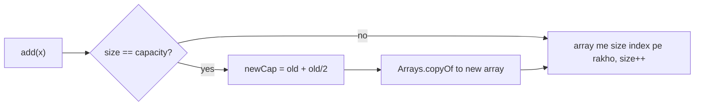
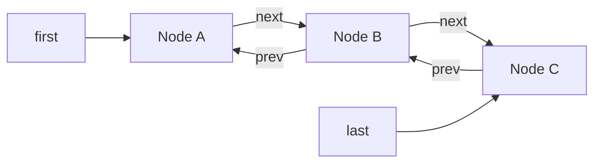

# ArrayList & LinkedList

`List` = ordered collection, index se access, duplicates allowed. Real code me 95% time `ArrayList` hi chahiye. Interview me poochte hain: ArrayList andar kaise badhta hai, LinkedList kab jeetta hai (lagbhag kabhi nahi), `remove(int)` vs `remove(Object)`, CME aur `Arrays.asList` ke pitfalls.

## ⭐ ArrayList internals

**Ek line me:** `ArrayList` andar ek `Object[] elementData` hai. Bhar gaya to ~1.5x badi nayi array banti hai aur purane elements copy hote hain.

- `new ArrayList<>()` shuru me empty shared array rakhta hai. **Pehle `add` pe capacity 10** banti hai (lazy).
- Growth: `newCapacity = old + (old >> 1)` yaani 1.5x. Sequence: 10 → 15 → 22 → 33 → 49...
- Copy `Arrays.copyOf` (andar `System.arraycopy`) se, jo O(n) hai. Par resize kabhi-kabhi hota hai, isliye `add` **amortized O(1)**: n adds me total copies ~3n.
- `size` = kitne elements hain, `capacity` = array kitni badi hai. `remove` se array **shrink nahi** hoti. `trimToSize()` manually karo.
- Size pata ho to `new ArrayList<>(n)` ya `ensureCapacity(n)`. Baar baar resize bach jaata hai.
- `RandomAccess` marker interface implement karta hai: `get(i)` O(1).



```java
import java.util.ArrayList;
import java.util.List;

public class Main {
    public static void main(String[] args) {
        List<Integer> orders = new ArrayList<>();        // capacity abhi 0, pehle add pe 10
        for (int i = 0; i < 11; i++) orders.add(i);      // 11th add pe grow: 10 -> 15
        System.out.println(orders.size());               // 11 (capacity 15 hai, dikhti nahi)

        List<Integer> big = new ArrayList<>(100_000);    // presize: resize + copy bacha
        for (int i = 0; i < 100_000; i++) big.add(i);

        ArrayList<Integer> tmp = new ArrayList<>(big);
        tmp.clear();                                     // size 0, par array abhi bhi badi
        tmp.trimToSize();                                // ab memory free
    }
}
```

**Interview tip:** "ArrayList ka add O(1) kaise jab resize O(n) hai?" → "Amortized. Capacity har baar 1.5x hoti hai, to resize geometric gaps pe hota hai. n adds ka total kaam O(n), yaani per add O(1)."

**Common galti:** `new ArrayList<>(n)` ko "n elements wali list" samajhna. Ye sirf capacity hai, `size()` 0 hi hai, `get(0)` → `IndexOutOfBoundsException`.

## LinkedList internals

**Ek line me:** doubly linked list. Har element ek `Node { item, prev, next }`, aur list `first`, `last`, `size` rakhti hai.

- Dono ends pe add/remove O(1). `List` aur `Deque` dono implement karti hai.
- `get(i)` O(n): index ke paas wale end (first ya last) se walk karti hai, max n/2 steps.
- Har node ek alag object: ~24 bytes header/fields + element. ArrayList ke ek reference (4-8 bytes) se kaafi zyada.
- Nodes memory me bikhre hote hain, **CPU cache locality kharab**, isliye iteration bhi ArrayList se slow.



```java
import java.util.LinkedList;

public class Main {
    public static void main(String[] args) {
        LinkedList<String> songs = new LinkedList<>();
        songs.add("Kesariya");             // end me
        songs.addFirst("Tum Hi Ho");       // O(1) front
        songs.addLast("Apna Bana Le");     // O(1) back
        System.out.println(songs.getFirst() + " | " + songs.getLast());
        System.out.println(songs.get(1));  // Kesariya, par O(n) walk
        songs.removeFirst();               // O(1)
        System.out.println(songs);         // [Kesariya, Apna Bana Le]
    }
}
```

**Interview tip:** "LinkedList me beech me insert O(1) hai na?" → "Sirf tab jab node pe already ho (ListIterator ke through). `add(i, e)` pehle index tak walk karta hai, wo O(n) hai."

**Common galti:** LinkedList pe `for (int i = 0; i < list.size(); i++) list.get(i)` chalana. Har `get` O(n), poora loop **O(n²)**. Iterator / for-each use karo.

## ⭐ Important methods & complexities

**Ek line me:** wahi `List` methods dono pe hain, complexity alag hai.

| Method | Kya karta hai | ArrayList | LinkedList |
|---|---|---|---|
| `add(e)` | end me add | O(1) amortized | O(1) |
| `add(i, e)` | index pe insert, baaki shift | O(n) | O(n) walk (ends pe O(1)) |
| `get(i)` | index se padho | O(1) | O(n) |
| `set(i, e)` | replace, purana return | O(1) | O(n) |
| `remove(int i)` | index se hatao, element return | O(n) (end pe O(1)) | O(n) walk (ends pe O(1)) |
| `remove(Object o)` | pehla matching hatao, boolean return | O(n) | O(n) |
| `contains(o)` / `indexOf(o)` | `equals` se linear search | O(n) | O(n) |
| `subList(from, to)` | original ka **view** (to exclusive) | O(1) | O(1) |
| `sort(cmp)` | stable TimSort (`null` = natural order) | O(n log n) | O(n log n) |
| `removeIf(pred)` | condition wale sab hatao | O(n) | O(n) |
| `iterator().remove()` | iterate karte hue hatao | O(n) per remove (shift) | O(1) |
| `addFirst` / `removeFirst` | front pe | O(n) (Java 21) | O(1) |
| `size()` / `isEmpty()` | count | O(1) | O(1) |

```java
import java.util.*;

public class Main {
    public static void main(String[] args) {
        List<String> list = new ArrayList<>(List.of("Delhi", "Mumbai", "Pune"));
        list.add("Chennai");                   // [Delhi, Mumbai, Pune, Chennai]
        list.add(1, "Agra");                   // [Delhi, Agra, Mumbai, Pune, Chennai]
        String old = list.set(0, "Noida");     // old = Delhi
        System.out.println(old + " " + list.get(2));                          // Delhi Mumbai
        System.out.println(list.indexOf("Pune") + " " + list.contains("Goa")); // 3 false

        list.removeIf(c -> c.startsWith("P")); // [Noida, Agra, Mumbai, Chennai]
        list.sort(null);                       // natural: [Agra, Chennai, Mumbai, Noida]

        List<String> sub = list.subList(0, 2); // [Agra, Chennai] -> view hai, copy nahi
        sub.clear();                           // original se bhi hat gaye!
        System.out.println(list);              // [Mumbai, Noida]
    }
}
```

**Interview tip:** `subList` view hai. Copy chahiye to `new ArrayList<>(list.subList(a, b))`. Range delete ka shortcut: `list.subList(a, b).clear()`.

**Common galti:** `subList` banane ke baad original list me add/remove karna, phir subList use karna → `ConcurrentModificationException`.

## ⭐ remove(int) vs remove(Object) pitfall

**Ek line me:** `List<Integer>` pe `list.remove(1)` **index 1** hatata hai, value 1 nahi. Overload resolution `int` wala exact match pehle chunta hai, boxing baad me.

```java
import java.util.*;

public class Main {
    public static void main(String[] args) {
        List<Integer> nums = new ArrayList<>(List.of(10, 20, 30, 1));
        nums.remove(1);                    // index 1 hata -> [10, 30, 1]
        nums.remove(Integer.valueOf(1));   // value 1 hata -> [10, 30]
        System.out.println(nums);          // [10, 30]
        // nums.remove(30);                // IndexOutOfBoundsException: 30 ko index samjha

        // Related pitfall: Integer ko == se compare
        List<Integer> big = List.of(1000, 1000);
        System.out.println(big.get(0) == big.get(1));      // false (cache sirf -128..127)
        System.out.println(big.get(0).equals(big.get(1))); // true
    }
}
```

**Interview tip:** value hatani hai to `remove(Integer.valueOf(x))` ya `remove((Integer) x)`. Sab occurrences hatani hain to `removeIf(v -> v == x)` (yahan `x` int hai to unboxing se sahi compare hota hai).

**Common galti:** `remove(Object)` sirf **pehla** match hatata hai, sab nahi.

## ⭐ ArrayList vs LinkedList: kab kya

**Ek line me:** default `ArrayList`. Queue/stack chahiye to `ArrayDeque`. `LinkedList` bahut rare case me.

| Point | ArrayList | LinkedList |
|---|---|---|
| Storage | contiguous `Object[]` | bikhre hue nodes |
| `get(i)` | O(1) | O(n) |
| End pe add | O(1) amortized | O(1) |
| Front pe add/remove | O(n) | O(1) |
| Beech me insert | O(n) shift (par `arraycopy` bahut fast) | O(n) walk + O(1) link |
| Memory per element | ek reference (+ spare capacity) | node object (~24+ bytes) |
| Cache locality | achhi | kharab |

**LinkedList practically kyun nahi jeetta:** beech me insert ke liye bhi pehle walk karna padta hai, aur walk ArrayList ke memory shift se slow hai. Front/back operations ke liye `ArrayDeque` LinkedList se fast aur kam memory wala hai.

**LinkedList kab theek:** iterator ke saath chalte hue bahut saare inserts/removes (`ListIterator.add/remove` O(1)), ya `null` elements wali queue chahiye (`ArrayDeque` null allow nahi karta).

```java
import java.util.*;

public class Main {
    public static void main(String[] args) {
        Deque<String> queue = new ArrayDeque<>();   // BFS / order queue
        queue.offer("order-1");
        queue.offer("order-2");
        System.out.println(queue.poll());           // order-1 (FIFO)

        Deque<Character> stack = new ArrayDeque<>(); // brackets check / undo
        stack.push('(');
        stack.push('[');
        System.out.println(stack.pop());            // [ (LIFO)
    }
}
```

**Interview tip:** "LinkedList kab use karoge?" → "Lagbhag kabhi nahi. Random access ke liye ArrayList, dono ends ke liye ArrayDeque. LinkedList sirf jab iterator se chalte hue bahut saare inserts/removes ho."

**Common galti:** "insert/delete zyada hain isliye LinkedList" bina ye soche ki position tak pahunchne ka cost O(n) hai.

## ⭐ ConcurrentModificationException & safe removal

**Ek line me:** for-each chalte hue list ko `list.add` / `list.remove` se badla to agle `next()` pe CME. Safe tareeke: `Iterator.remove()`, `removeIf`, ya ulta index loop.

```java
import java.util.*;

public class Main {
    public static void main(String[] args) {
        List<Integer> nums = new ArrayList<>(List.of(1, 2, 3, 4, 5, 6));

        // Galat: CME
        // for (Integer n : nums) if (n % 2 == 0) nums.remove(n);

        // Sahi 1: Iterator.remove
        Iterator<Integer> it = nums.iterator();
        while (it.hasNext()) {
            if (it.next() % 2 == 0) it.remove();
        }
        System.out.println(nums);                  // [1, 3, 5]

        // Sahi 2: removeIf (Java 8), ek pass me O(n)
        nums.removeIf(n -> n > 3);
        System.out.println(nums);                  // [1, 3]

        // Sahi 3: index loop ulta (shift se element skip nahi hota)
        for (int i = nums.size() - 1; i >= 0; i--) {
            if (nums.get(i) == 1) nums.remove(i);  // remove(int) -> index
        }
        System.out.println(nums);                  // [3]
    }
}
```

**Interview tip:** ArrayList pe bahut saare elements hatane hain to `removeIf` best hai: ek hi pass me compact karta hai, O(n). Iterator.remove har remove pe shift karta hai, worst O(n²).

**Common galti:** seedha index loop `i++` ke saath remove karna. Remove ke baad agla element `i` pe shift ho jaata hai aur `i++` use skip kar deta hai. CME nahi aata, bas chupchaap galat result.

## ⭐ Arrays.asList pitfall

**Ek line me:** `Arrays.asList(arr)` ek **fixed-size** list deta hai jo original array pe hi bani hai. `set` chalta hai, `add`/`remove` → `UnsupportedOperationException`.

```java
import java.util.*;

public class Main {
    public static void main(String[] args) {
        String[] arr = {"a", "b", "c"};
        List<String> fixed = Arrays.asList(arr);
        fixed.set(0, "z");                       // OK, aur arr[0] bhi "z" (write-through)
        System.out.println(arr[0]);              // z
        // fixed.add("d");                       // UnsupportedOperationException
        // fixed.remove(0);                      // UnsupportedOperationException

        List<String> real = new ArrayList<>(Arrays.asList(arr)); // resizable copy
        real.add("d");

        int[] prim = {1, 2, 3};
        List<int[]> oops = Arrays.asList(prim);  // size 1! ek int[] element
        List<Integer> ok = Arrays.stream(prim).boxed().toList();  // [1, 2, 3]
        System.out.println(oops.size() + " " + ok);              // 1 [1, 2, 3]
    }
}
```

**Interview tip:** "`Arrays.asList` ArrayList return karta hai?" → "Class ka naam `ArrayList` hi hai, par wo `java.util.Arrays` ki private nested class hai, `java.util.ArrayList` nahi. Wo seedha array wrap karti hai, isliye fixed size."

**Common galti:** primitive array (`int[]`) ko `Arrays.asList` me dena aur `List<Integer>` expect karna.

## Vector, Stack (legacy) & CopyOnWriteArrayList

**Ek line me:** `Vector`/`Stack` Java 1.0 ke synchronized classes hain, naye code me mat use karo. Thread-safe list chahiye to `CopyOnWriteArrayList` (read-heavy) ya `Collections.synchronizedList`.

| Class | Kya hai | Kab |
|---|---|---|
| `Vector` | synchronized ArrayList, default 2x grow | legacy, avoid |
| `Stack` | `Vector` extend karta hai, push/pop/peek | avoid → `ArrayDeque` |
| `Collections.synchronizedList` | har method pe ek lock | kam contention, simple case |
| `CopyOnWriteArrayList` | har write pe poori array copy, reads bina lock | listeners / config list: reads bahut, writes kam |

```java
import java.util.*;
import java.util.concurrent.CopyOnWriteArrayList;

public class Main {
    public static void main(String[] args) {
        List<Runnable> listeners = new CopyOnWriteArrayList<>();
        listeners.add(() -> System.out.println("SMS bhejo"));
        listeners.add(() -> System.out.println("Email bhejo"));

        for (Runnable r : listeners) {      // snapshot pe iterate, CME nahi
            r.run();
            listeners.add(() -> {});        // write -> nayi array copy
        }
        System.out.println(listeners.size()); // 4
    }
}
```

**Interview tip:** "Stack class kyun avoid?" → Vector extend karti hai, to `stack.add(0, x)` / `get(i)` jaise non-stack operations bhi allowed (galat abstraction), aur har call pe unnecessary lock.

**Common galti:** `CopyOnWriteArrayList` ke iterator pe `remove()` call karna → `UnsupportedOperationException`. Aur write-heavy case me COW use karna: har add O(n).

## List ↔ array conversion

**Ek line me:** list se array: `toArray(new T[0])` ya `toArray(T[]::new)`. Array se list: `new ArrayList<>(Arrays.asList(arr))`, `List.of(arr)`, ya primitives ke liye stream.

```java
import java.util.*;

public class Main {
    public static void main(String[] args) {
        List<String> list = new ArrayList<>(List.of("x", "y"));

        String[] a1 = list.toArray(new String[0]);   // preferred, typed array
        String[] a2 = list.toArray(String[]::new);   // Java 11
        Object[] a3 = list.toArray();                // Object[] milta hai
        // String[] bad = (String[]) list.toArray(); // ClassCastException

        List<Integer> nums = List.of(4, 5, 6);
        int[] prim = nums.stream().mapToInt(Integer::intValue).toArray(); // unboxing

        List<String> back1 = new ArrayList<>(Arrays.asList(a1)); // mutable
        List<String> back2 = List.of(a1);                        // immutable
        Collections.addAll(list, "z", "w");                      // varargs se add

        System.out.println(a2.length + " " + a3.length + " " + prim.length
                + " " + back1 + " " + back2 + " " + list);
        // 2 2 3 [x, y] [x, y] [x, y, z, w]
    }
}
```

**Interview tip:** `toArray(new String[0])` `toArray(new String[size])` se slow nahi hai. Modern JVM pe zero-size wala barabar ya fast hai, aur thread-safe collections ke saath safer.

**Common galti:** `(String[]) list.toArray()` cast karna. Runtime type `Object[]` hai, `ClassCastException`.

## Checklist

- [ ] ArrayList ki backing array, lazy capacity 10, 1.5x growth aur amortized O(1) add samjha sakta hoon
- [ ] LinkedList ka node structure aur `get(i)` O(n) kyun hai, bata sakta hoon
- [ ] Har common List method ki complexity ArrayList aur LinkedList dono ke liye bata sakta hoon
- [ ] `remove(int)` vs `remove(Object)` pitfall `List<Integer>` pe samjha sakta hoon
- [ ] ArrayList vs LinkedList vs ArrayDeque me sahi choice justify kar sakta hoon
- [ ] Iteration ke dauran safe removal (Iterator.remove, removeIf, ulta loop) likh sakta hoon
- [ ] `Arrays.asList` ka fixed-size aur `int[]` pitfall bata sakta hoon
- [ ] Vector/Stack kyun legacy hain aur CopyOnWriteArrayList kab use karna hai, bata sakta hoon
- [ ] List ↔ array conversion (objects aur primitives dono) likh sakta hoon
