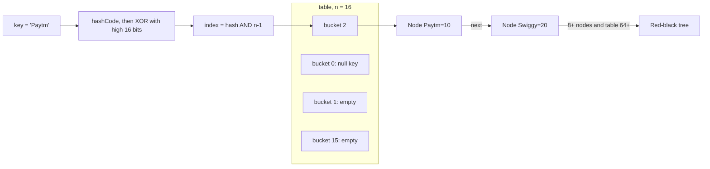

# HashMap, TreeMap & Sets

Map = key se value tak O(1) ya O(log n) me pahunchna. Interview me HashMap internals (hash, bucket, treeify, resize) almost har baar poocha jaata hai. Sets andar se Maps hi hain, isliye dono saath padho.

## ⭐ HashMap internals: buckets and hashing

**Ek line me:** HashMap ek array of buckets hai; key ka `hashCode()` spread karke bucket index nikalta hai, aur us bucket me entry (Node) rakhta hai.

Steps jab `put(key, value)` hota hai:
1. `hash(key)` = `h ^ (h >>> 16)` jahan `h = key.hashCode()`. Upar ke 16 bits ko neeche ke bits me mix karta hai, taaki chhoti table me bhi high bits ka asar aaye.
2. `index = hash & (n - 1)`. `n` hamesha power of 2 hai, isliye ye `hash % n` jaisa hai par fast (bitwise AND).
3. Bucket khaali hai to naya Node daal do. Nahi to chain me `equals()` se same key dhoondho: mili to value replace, nahi to end me add.
4. `size > capacity * loadFactor` ho gaya to resize.

- Default capacity 16, load factor 0.75, yaani 12 entries ke baad resize. Table lazy banti hai, pehle `put` pe.
- `null` key allowed (ek hi). `hash(null) = 0`, to wo bucket 0 me jaati hai. `null` values kitni bhi.
- Har Node me `hash`, `key`, `value`, `next` hota hai.



```java
import java.util.*;

public class Main {
    // HashMap ka asli hash() aisa hi dikhta hai
    static int spread(Object key) {
        int h;
        return (key == null) ? 0 : (h = key.hashCode()) ^ (h >>> 16);
    }

    public static void main(String[] args) {
        int n = 16;
        for (String k : List.of("Paytm", "Swiggy", "Zomato")) {
            int idx = spread(k) & (n - 1);   // bucket index
            System.out.println(k + " -> bucket " + idx);
        }
        Map<String, Integer> m = new HashMap<>();
        m.put(null, 0);                      // null key allowed
        System.out.println(m.get(null));     // 0
    }
}
```

**Interview tip:** "Capacity power of 2 kyun?" Taaki `hash & (n-1)` modulo ka kaam kare, aur resize pe har entry ya to same index pe rahe ya `index + oldCap` pe jaaye. Rehash ka poora `%` nahi lagta.

**Common galti:** ye bolna ki get hamesha O(1) hai. Average O(1) hai; bahut collisions me tree ki wajah se worst O(log n) (Java 8+), pehle O(n) tha.

## ⭐ Collisions, treeify and resize

**Ek line me:** same bucket me aayi keys pehle linked list banti hain; list lambi ho to red-black tree ban jaati hai; entries zyada ho to table double hoti hai.

| Constant | Value | Matlab |
|---|---|---|
| `DEFAULT_INITIAL_CAPACITY` | 16 | shuru ki table size |
| `DEFAULT_LOAD_FACTOR` | 0.75 | kitna bhar ke resize |
| `TREEIFY_THRESHOLD` | 8 | bucket me 8+ nodes to tree |
| `MIN_TREEIFY_CAPACITY` | 64 | table 64 se chhoti ho to treeify ki jagah resize |
| `UNTREEIFY_THRESHOLD` | 6 | tree 6 ya kam pe wapas list |

- **Treeify:** bucket ki chain 8 se upar jaaye aur table size >= 64 ho, tab red-black tree. Table chhoti hai to pehle resize karte hain, kyunki problem shayad sirf chhoti table hai.
- **Resize:** capacity double (16 → 32 → 64). Har entry ka naya index ya to `i` ya `i + oldCap`, `hash & oldCap` bit dekh ke. O(n) kaam, par amortized put O(1) hi rehta hai.
- Java 8 me list ke **tail** pe insert hota hai. Java 7 head pe karta tha, aur concurrent resize me infinite loop ho sakta tha.
- 0.75 load factor = time aur memory ka balance. Kam load factor = kam collisions, zyada memory.

```java
import java.util.*;

public class Main {
    // Bura hashCode: sab keys ek hi bucket me
    record BadKey(int id) {
        @Override public int hashCode() { return 42; }
    }

    public static void main(String[] args) {
        // Expected size pata hai to pehle se capacity do, resize bachao
        int expected = 1000;
        Map<Integer, String> orders = new HashMap<>((int) (expected / 0.75f) + 1);
        for (int i = 0; i < expected; i++) orders.put(i, "order-" + i);

        Map<BadKey, Integer> bad = new HashMap<>();
        for (int i = 0; i < 100; i++) bad.put(new BadKey(i), i); // ek bucket, tree banega
        System.out.println(bad.get(new BadKey(50)));              // 50, par slow path
    }
}
```

**Interview tip:** "Tree ke liye keys comparable honi chahiye?" Nahi zaroori. Tree pehle hash se order karta hai, phir `Comparable` ho to `compareTo`, warna tie-break (`System.identityHashCode`). Comparable keys pe tree best kaam karta hai.

**Common galti:** sochna ki treeify 8 nodes pe hamesha hota hai. Table 64 se chhoti ho to pehle resize hota hai.

## ⭐ equals() and hashCode() contract

**Ek line me:** jo do objects `equals()` me barabar hain, unka `hashCode()` same hona hi chahiye; warna HashMap unhe alag buckets me dhoondhega.

Rules:
- `a.equals(b)` true ⇒ `a.hashCode() == b.hashCode()`.
- Same hashCode ⇒ equals true, ye zaroori **nahi** (collision allowed).
- Sirf `equals` override kiya, `hashCode` nahi ⇒ `map.get(sameLookingKey)` null dega.
- **Key immutable rakho.** Key map me daalne ke baad uska field badla to hashCode badla, entry purane bucket me phans gayi. Isliye `String`, `Integer`, `record` best keys hain.

```java
import java.util.*;

public class Main {
    static class Seat {               // hashCode override nahi kiya: bug
        final String id;
        Seat(String id) { this.id = id; }
        @Override public boolean equals(Object o) {
            return o instanceof Seat s && s.id.equals(id);
        }
    }

    record SeatKey(String screen, String seat) {} // equals + hashCode auto

    public static void main(String[] args) {
        Map<Seat, String> m1 = new HashMap<>();
        m1.put(new Seat("A1"), "booked");
        System.out.println(m1.get(new Seat("A1")));  // null (alag hashCode)

        Map<SeatKey, String> m2 = new HashMap<>();
        m2.put(new SeatKey("S1", "A1"), "booked");
        System.out.println(m2.get(new SeatKey("S1", "A1"))); // booked

        // Mutable key ka problem
        List<Integer> key = new ArrayList<>(List.of(1, 2));
        Map<List<Integer>, String> m3 = new HashMap<>();
        m3.put(key, "x");
        key.add(3);                                 // hashCode badal gaya
        System.out.println(m3.get(key));            // null
        System.out.println(m3.containsKey(List.of(1, 2))); // false: hash match, equals fail
    }
}
```

**Interview tip:** "String HashMap key ke liye best kyun?" Immutable hai, aur hashCode cache hota hai (ek baar calculate).

**Common galti:** `hashCode` me mutable field ya random value use karna.

## ⭐ HashMap important methods

**Ek line me:** Java 8 ke `merge`, `computeIfAbsent`, `getOrDefault` se if-else wala boilerplate khatam.

| Method | Kya karta hai | Time complexity |
|---|---|---|
| `put(k, v)` | insert ya replace, purani value return | O(1) avg |
| `get(k)` | value ya `null` | O(1) avg |
| `getOrDefault(k, d)` | value ya default (map me daalta **nahi**) | O(1) avg |
| `putIfAbsent(k, v)` | sirf tab daale jab key absent ya null value | O(1) avg |
| `computeIfAbsent(k, fn)` | absent ho to `fn(k)` bana ke daale, value return | O(1) avg |
| `merge(k, v, fn)` | absent to `v`, warna `fn(old, v)`; result null to remove | O(1) avg |
| `containsKey(k)` | key hai ya nahi | O(1) avg |
| `containsValue(v)` | saari values scan | O(n) |
| `remove(k)` | hata do, value return | O(1) avg |
| `keySet()` / `values()` / `entrySet()` | views (copy nahi) | O(1) view, iterate O(n + capacity) |
| `forEach((k, v) -> ...)` | har entry pe action | O(n + capacity) |

```java
import java.util.*;

public class Main {
    public static void main(String[] args) {
        Map<String, List<String>> graph = new HashMap<>();
        // Adjacency list: list absent ho to bana do
        graph.computeIfAbsent("Delhi", k -> new ArrayList<>()).add("Mumbai");
        graph.computeIfAbsent("Delhi", k -> new ArrayList<>()).add("Pune");

        Map<String, Integer> stock = new HashMap<>();
        stock.put("pizza", 5);
        stock.merge("pizza", 3, Integer::sum);      // 8
        stock.putIfAbsent("burger", 2);             // 2
        int x = stock.getOrDefault("dosa", 0);      // 0, map me dosa nahi aaya

        // entrySet se iterate: key + value ek saath, extra get() nahi
        for (Map.Entry<String, Integer> e : stock.entrySet()) {
            System.out.println(e.getKey() + "=" + e.getValue());
        }
        stock.forEach((k, v) -> System.out.println(k + ":" + v));
        stock.entrySet().removeIf(e -> e.getValue() < 3); // safe removal
        System.out.println(graph + " " + stock + " " + x);
    }
}
```

**Interview tip:** iterate karte waqt `map.remove()` call kiya to `ConcurrentModificationException`. `iterator.remove()` ya `entrySet().removeIf()` use karo.

**Common galti:** `keySet()` pe loop karke har key ka `get()` karna. `entrySet()` use karo.

## ⭐ Frequency count pattern

**Ek line me:** har element kitni baar aaya, ye map me `merge(x, 1, Integer::sum)` se ek line me.

DSA ka sabse common pattern: anagram check, first unique char, top-K frequent, two-sum, subarray sum = k (prefix sum count).

```java
import java.util.*;

public class Main {
    public static void main(String[] args) {
        String s = "bookmyshow";
        Map<Character, Integer> freq = new HashMap<>();
        for (char c : s.toCharArray()) freq.merge(c, 1, Integer::sum);
        System.out.println(freq.get('o'));            // 3

        // First non-repeating char: LinkedHashMap order rakhta hai
        Map<Character, Integer> ordered = new LinkedHashMap<>();
        for (char c : s.toCharArray()) ordered.merge(c, 1, Integer::sum);
        for (var e : ordered.entrySet()) {
            if (e.getValue() == 1) { System.out.println(e.getKey()); break; } // b
        }

        // Subarray sum = k: prefix sum ki frequency
        int[] a = {1, 1, 1}; int k = 2, sum = 0, count = 0;
        Map<Integer, Integer> seen = new HashMap<>(Map.of(0, 1));
        for (int v : a) {
            sum += v;
            count += seen.getOrDefault(sum - k, 0);
            seen.merge(sum, 1, Integer::sum);
        }
        System.out.println(count);                    // 2
    }
}
```

**Interview tip:** sirf lowercase letters hain to `int[26]` array HashMap se fast hai. Bolo ye tradeoff.

**Common galti:** `map.get(c) + 1` jab key absent ho: `null` unbox hoke NPE.

## ⭐ LinkedHashMap and LRU cache

**Ek line me:** HashMap + doubly linked list jo order yaad rakhti hai: insertion order (default) ya access order.

- `new LinkedHashMap<>(cap, 0.75f, true)`: teesra arg `true` = access order. `get`/`put` se entry end me chali jaati hai.
- `removeEldestEntry` override karo to har `put` ke baad sabse purani entry hat sakti hai. Yahi LRU cache hai.
- Ops O(1), memory thodi zyada (before/after pointers).

```java
import java.util.*;

public class Main {
    static class LRUCache<K, V> extends LinkedHashMap<K, V> {
        private final int capacity;
        LRUCache(int capacity) {
            super(capacity, 0.75f, true);   // access order
            this.capacity = capacity;
        }
        @Override
        protected boolean removeEldestEntry(Map.Entry<K, V> eldest) {
            return size() > capacity;       // limit cross to oldest hatao
        }
    }

    public static void main(String[] args) {
        LRUCache<String, String> cache = new LRUCache<>(2);
        cache.put("u1", "Rahul");
        cache.put("u2", "Priya");
        cache.get("u1");                    // u1 ab most recent
        cache.put("u3", "Amit");            // u2 evict
        System.out.println(cache.keySet()); // [u1, u3]
    }
}
```

**Interview tip:** interviewer aksar bolega "LinkedHashMap mat use karo". Tab HashMap<K, Node> + apni doubly linked list banao (head/tail sentinel). Pehle ye short version bolo, phir manual.

**Common galti:** constructor me `accessOrder = true` bhool jaana. Tab ye FIFO cache ban jaata hai, LRU nahi.

## ⭐ TreeMap

**Ek line me:** sorted keys wala Map, andar red-black tree; har op O(log n), aur floor/ceiling jaise range queries free me.

- Keys `Comparable` honi chahiye ya constructor me `Comparator` do.
- `null` key allowed nahi (natural ordering me NPE).
- Use: leaderboard, time-based lookup ("is time pe kaunsa price tha"), calendar booking overlap, interval problems.

```java
import java.util.*;

public class Main {
    public static void main(String[] args) {
        TreeMap<Integer, String> slabs = new TreeMap<>();
        slabs.put(0, "koi offer nahi");
        slabs.put(199, "Rs 20 off");
        slabs.put(499, "free delivery");

        int cart = 350;
        System.out.println(slabs.floorEntry(cart).getValue()); // Rs 20 off
        System.out.println(slabs.ceilingKey(400));             // 499
        System.out.println(slabs.headMap(199));                // {0=...} (199 exclusive)
        System.out.println(slabs.tailMap(199).keySet());       // [199, 499] (inclusive)
        System.out.println(slabs.firstKey() + " " + slabs.lastKey());

        TreeMap<String, Integer> desc = new TreeMap<>(Comparator.reverseOrder());
        desc.put("a", 1); desc.put("c", 3); desc.put("b", 2);
        System.out.println(desc);                              // {c=3, b=2, a=1}
    }
}
```

| Method | Kya karta hai | Time complexity |
|---|---|---|
| `put` / `get` / `remove` | basic ops | O(log n) |
| `floorKey(k)` / `ceilingKey(k)` | `<= k` sabse bada / `>= k` sabse chhota | O(log n) |
| `lowerKey(k)` / `higherKey(k)` | strictly `<` / `>` | O(log n) |
| `firstKey()` / `lastKey()` | min / max | O(log n) |
| `pollFirstEntry()` | min nikal ke hatao | O(log n) |
| `headMap(k)` / `tailMap(k)` / `subMap(a, b)` | range view | O(log n) view banana |
| `descendingMap()` | ulta order view | O(1) |

**Interview tip:** "HashMap vs TreeMap?" HashMap O(1) avg, koi order nahi. TreeMap O(log n), sorted order aur range queries. Order chahiye to TreeMap.

**Common galti:** Comparator jo `equals` se consistent nahi. TreeMap uniqueness `compare() == 0` se decide karta hai, `equals` se nahi. Do alag objects jinka compare 0 hai, ek hi key ban jaayenge.

## ⭐ HashSet, LinkedHashSet, TreeSet

**Ek line me:** Set = duplicate-free collection; andar se har Set ek Map hai jisme element key hai aur value ek dummy `PRESENT` object.

| Set | Backed by | Order | add/contains/remove |
|---|---|---|---|
| `HashSet` | `HashMap` | koi nahi | O(1) avg |
| `LinkedHashSet` | `LinkedHashMap` | insertion order | O(1) avg |
| `TreeSet` | `TreeMap` | sorted | O(log n) |

```java
import java.util.*;

public class Main {
    public static void main(String[] args) {
        Set<String> cities = new HashSet<>(List.of("Delhi", "Pune"));
        System.out.println(cities.add("Delhi"));   // false, duplicate

        Set<Integer> seen = new LinkedHashSet<>();
        for (int x : new int[]{3, 1, 3, 2, 1}) seen.add(x);
        System.out.println(seen);                  // [3, 1, 2] dedupe + order

        TreeSet<Integer> ts = new TreeSet<>(List.of(10, 40, 20, 30));
        System.out.println(ts.floor(25) + " " + ts.ceiling(25)); // 20 30
        System.out.println(ts.headSet(30));        // [10, 20]
        System.out.println(ts.first() + " " + ts.pollLast());   // 10 40

        // Set operations
        Set<Integer> a = new HashSet<>(List.of(1, 2, 3));
        Set<Integer> b = Set.of(2, 3, 4);
        a.retainAll(b);                            // intersection
        System.out.println(a);                     // [2, 3]
    }
}
```

**Interview tip:** "HashSet duplicate kaise rokta hai?" `add(e)` andar `map.put(e, PRESENT) == null` karta hai. Key pehle se thi to false.

**Common galti:** custom class HashSet me daali bina `equals`/`hashCode` ke. Duplicates aa jaayenge.

## EnumMap and EnumSet

**Ek line me:** key enum ho to `EnumMap` use karo: andar sirf ek array hai jo `ordinal()` se index hota hai, HashMap se fast aur compact.

- `EnumMap` order = enum declaration order. `null` key nahi.
- `EnumSet` bit vector hai (64 tak constants ek `long` me). `EnumSet.of`, `allOf`, `range`.

```java
import java.util.*;

public class Main {
    enum Status { PLACED, PREPARING, OUT_FOR_DELIVERY, DELIVERED }

    public static void main(String[] args) {
        Map<Status, Integer> counts = new EnumMap<>(Status.class);
        counts.merge(Status.PLACED, 1, Integer::sum);
        counts.merge(Status.DELIVERED, 1, Integer::sum);
        System.out.println(counts);   // {PLACED=1, DELIVERED=1}

        Set<Status> active = EnumSet.range(Status.PLACED, Status.OUT_FOR_DELIVERY);
        System.out.println(active.contains(Status.DELIVERED)); // false
    }
}
```

**Interview tip:** state machine (order status, elevator state) me EnumMap transitions ke liye natural fit hai.

**Common galti:** enum keys ke liye HashMap use karna jab EnumMap available hai.

## ⭐ Hashtable vs HashMap vs ConcurrentHashMap

**Ek line me:** HashMap thread-safe nahi; Hashtable har method pe lock (purana, slow); ConcurrentHashMap fine-grained locking + CAS (multi-threaded ke liye sahi choice).

| | HashMap | Hashtable | ConcurrentHashMap |
|---|---|---|---|
| Thread-safe | Nahi | Haan, poore object pe `synchronized` | Haan, bucket-level |
| `null` key/value | 1 null key, null values ok | Nahi | Nahi |
| Iterator | fail-fast (CME) | fail-fast | weakly consistent, CME nahi |
| Performance | fastest single-thread | slow under contention | high concurrency |
| Status | default | legacy, mat use karo | concurrent default |

- ConcurrentHashMap (Java 8+): khaali bucket me CAS se insert, bhari bucket ke head node pe `synchronized`. Reads mostly lock-free.
- `null` kyun nahi? `get(k)` ne null diya to "key nahi" ya "value null" pata nahi chalega, aur concurrent me `containsKey` + `get` atomic nahi hai.
- Atomic updates ke liye `compute`/`merge` use karo, `get` phir `put` nahi.
- `Collections.synchronizedMap(map)` bhi Hashtable jaisa ek lock wala hai.

Details: [Concurrency](14-concurrency.md).

```java
import java.util.concurrent.*;

public class Main {
    public static void main(String[] args) throws InterruptedException {
        ConcurrentHashMap<String, Integer> views = new ConcurrentHashMap<>();
        Runnable task = () -> {
            for (int i = 0; i < 1000; i++) views.merge("ipl-final", 1, Integer::sum); // atomic
        };
        Thread t1 = new Thread(task), t2 = new Thread(task);
        t1.start(); t2.start();
        t1.join(); t2.join();
        System.out.println(views.get("ipl-final"));   // 2000 hamesha
    }
}
```

**Interview tip:** "HashMap ko multi-thread me use kiya to kya hoga?" Lost updates, galat size, Java 7 me resize pe infinite loop. ConcurrentHashMap lo.

**Common galti:** ConcurrentHashMap me `if (!map.containsKey(k)) map.put(k, v)` likhna. Ye check-then-act race hai; `putIfAbsent` ya `computeIfAbsent` use karo.

## Checklist

- [ ] HashMap ka `hash()` spreading aur `index = hash & (n-1)` samjha sakta hoon
- [ ] Collision, treeify (8 aur 64) aur untreeify (6) bata sakta hoon
- [ ] Load factor 0.75 aur resize doubling ka logic, `i` ya `i + oldCap`, samjha sakta hoon
- [ ] equals/hashCode contract aur mutable key ka bug code se dikha sakta hoon
- [ ] `merge`, `computeIfAbsent`, `getOrDefault`, `putIfAbsent` ka sahi use aur complexity bata sakta hoon
- [ ] LinkedHashMap se LRU cache `removeEldestEntry` ke saath likh sakta hoon
- [ ] TreeMap ke `floorKey`/`ceilingKey`/`headMap`/`tailMap` use karke range problem solve kar sakta hoon
- [ ] HashSet/LinkedHashSet/TreeSet ka backing Map aur complexity bata sakta hoon
- [ ] Hashtable vs HashMap vs ConcurrentHashMap ka fark (null, locking, iterator) bata sakta hoon
