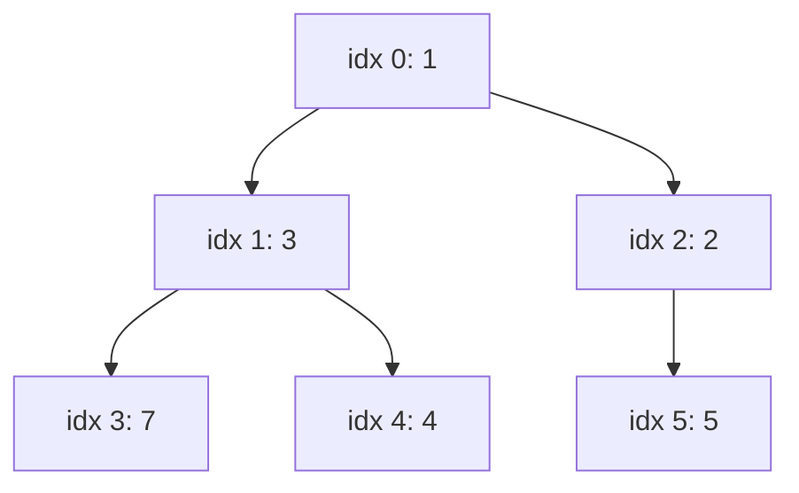

# Queue, Deque & PriorityQueue

BFS, sliding window, top-K, scheduling, producer-consumer: sab queues pe chalte hain. Java me roz ke kaam ke liye sirf do class yaad rakho: `ArrayDeque` (stack + queue) aur `PriorityQueue` (heap).

## ⭐ Queue interface: offer/poll/peek vs add/remove/element

**Ek line me:** Queue ke har operation ke do version hain: ek fail hone pe exception phenkta hai, doosra `false`/`null` return karta hai.

| Operation | Exception phenkta hai | Special value return |
|---|---|---|
| Insert (tail) | `add(e)`: full ho to `IllegalStateException` | `offer(e)`: full ho to `false` |
| Remove (head) | `remove()`: empty ho to `NoSuchElementException` | `poll()`: empty ho to `null` |
| Dekho (head) | `element()`: empty ho to `NoSuchElementException` | `peek()`: empty ho to `null` |

- "Full" sirf capacity-bounded queues me hota hai (jaise `ArrayBlockingQueue`). `ArrayDeque`/`LinkedList` me `add` aur `offer` same behave karte hain.
- Interview code me `offer`/`poll`/`peek` likho. Clean hai aur empty check `null` se ho jaata hai.

```java
import java.util.*;
import java.util.concurrent.ArrayBlockingQueue;

public class Main {
    public static void main(String[] args) {
        Queue<String> q = new ArrayDeque<>();
        q.offer("Rahul");
        q.offer("Priya");
        System.out.println(q.peek());   // Rahul (hataya nahi)
        System.out.println(q.poll());   // Rahul
        q.poll();                       // Priya
        System.out.println(q.poll());   // null, queue khaali
        try {
            q.remove();
        } catch (NoSuchElementException e) {
            System.out.println("remove() on empty: exception");
        }

        Queue<Integer> bounded = new ArrayBlockingQueue<>(1); // capacity 1
        bounded.offer(1);
        System.out.println(bounded.offer(2)); // false
        try {
            bounded.add(2);
        } catch (IllegalStateException e) {
            System.out.println("add() on full: Queue full");
        }
    }
}
```

**Interview tip:** "offer vs add?" Dono insert karte hain; bounded queue full ho to `offer` false deta hai, `add` exception phenkta hai.

**Common galti:** `while (q.poll() != null)` jab queue me `null` daal sakte ho (LinkedList allow karta hai). Isliye queue me null kabhi mat daalo.

## ⭐ ArrayDeque as stack and queue

**Ek line me:** `ArrayDeque` ek resizable circular array hai; dono ends pe add/remove amortized O(1); Java me stack aur queue dono ka default.

**`Stack` kyun nahi:**
- `Stack` `Vector` ko extend karta hai: har method `synchronized`, bina zarurat ka lock overhead.
- `Vector` se inherit hone ki wajah se beech me `add(index, e)` jaise methods bhi khule hain, stack ka contract tootta hai.
- Java docs khud bolte hain: stack ke liye `Deque` use karo.

**`LinkedList` kyun nahi:**
- Har element ke liye alag Node object: zyada memory, cache-unfriendly, GC pressure.
- `ArrayDeque` contiguous array hai, practically zyada fast.

**Dhyan rakho:** `ArrayDeque` me `null` allowed nahi (NPE), aur thread-safe nahi.

```java
import java.util.*;

public class Main {
    // Stack use: balanced brackets
    static boolean isValid(String s) {
        Deque<Character> st = new ArrayDeque<>();
        for (char c : s.toCharArray()) {
            if (c == '(') st.push(')');
            else if (c == '[') st.push(']');
            else if (c == '{') st.push('}');
            else if (st.isEmpty() || st.pop() != c) return false;
        }
        return st.isEmpty();
    }

    public static void main(String[] args) {
        System.out.println(isValid("{[()]}"));  // true
        System.out.println(isValid("(]"));      // false

        // Queue use: BFS levels
        Map<Integer, List<Integer>> g = Map.of(1, List.of(2, 3), 2, List.of(4), 3, List.of(), 4, List.of());
        Deque<Integer> q = new ArrayDeque<>();
        Set<Integer> seen = new HashSet<>(List.of(1));
        q.offer(1);
        while (!q.isEmpty()) {
            int u = q.poll();
            System.out.print(u + " ");          // 1 2 3 4
            for (int v : g.get(u)) if (seen.add(v)) q.offer(v);
        }
    }
}
```

**Interview tip:** "Stack class kyun avoid karte ho?" Synchronized Vector pe bana legacy class hai; `Deque<Integer> st = new ArrayDeque<>()` fast aur clean hai.

**Common galti:** `Stack` ko iterate karna aur expect karna top se aayega. `Stack` bottom se iterate karta hai, `ArrayDeque` (push wala) top se. Order alag hai.

## ⭐ Deque methods

**Ek line me:** Deque = double-ended queue; dono taraf insert/remove/peek, har ek ke exception aur null wale version.

| Method | Kya karta hai | Time complexity |
|---|---|---|
| `offerFirst(e)` / `addFirst(e)` | aage daalo | O(1) amortized |
| `offerLast(e)` / `addLast(e)` | peeche daalo | O(1) amortized |
| `pollFirst()` / `removeFirst()` | aage se nikalo (null / exception) | O(1) |
| `pollLast()` / `removeLast()` | peeche se nikalo | O(1) |
| `peekFirst()` / `getFirst()` | aage wala dekho | O(1) |
| `peekLast()` / `getLast()` | peeche wala dekho | O(1) |
| `push(e)` / `pop()` / `peek()` | stack: `addFirst` / `removeFirst` / `peekFirst` | O(1) |
| `offer(e)` / `poll()` | queue: `offerLast` / `pollFirst` | O(1) |
| `contains(o)` / `remove(o)` | linear scan | O(n) |
| `descendingIterator()` | peeche se aage iterate | O(n) total |

```java
import java.util.*;

public class Main {
    public static void main(String[] args) {
        Deque<String> dq = new ArrayDeque<>();
        dq.offerLast("B");
        dq.offerFirst("A");
        dq.offerLast("C");              // [A, B, C]
        System.out.println(dq.peekFirst() + " " + dq.peekLast()); // A C
        dq.pollLast();                  // [A, B]
        dq.push("Z");                   // stack push = aage: [Z, A, B]
        System.out.println(dq.pop());   // Z
        System.out.println(dq);         // [A, B]
    }
}
```

**Interview tip:** `push`/`pop` hamesha **front** pe kaam karte hain. Stack aur queue ek hi deque me mix karoge to ye yaad rakhna.

**Common galti:** stack ke liye `push` aur queue ke liye `poll` ek hi deque pe mix karna, phir order ka confusion.

## ⭐ PriorityQueue (binary heap)

**Ek line me:** `PriorityQueue` array me bana binary heap hai; default **min-heap**; sabse chhota (ya comparator ke hisaab se sabse "pehla") element head pe.

- Array layout: index `i` ke children `2i+1`, `2i+2`; parent `(i-1)/2`.
- `offer`: end me daalo, upar **sift up**. `poll`: last ko root pe laao, neeche **sift down**. Dono O(log n).
- `new PriorityQueue<>(collection)` = **heapify**, O(n), n baar offer (O(n log n)) se better.
- Iterator / `toString` **sorted order nahi** deta. Sorted chahiye to baar-baar `poll()`.
- `null` allowed nahi. Thread-safe nahi (uske liye `PriorityBlockingQueue`).



```java
import java.util.*;

public class Main {
    record Order(String id, int etaMins) {}

    public static void main(String[] args) {
        PriorityQueue<Integer> minHeap = new PriorityQueue<>(List.of(5, 1, 7, 3)); // heapify O(n)
        System.out.println(minHeap.poll());          // 1

        PriorityQueue<Integer> maxHeap = new PriorityQueue<>(Comparator.reverseOrder());
        maxHeap.addAll(List.of(5, 1, 7, 3));
        System.out.println(maxHeap.peek());          // 7

        // Custom objects: Swiggy orders, kam ETA pehle, tie pe id
        PriorityQueue<Order> pq = new PriorityQueue<>(
            Comparator.comparingInt(Order::etaMins).thenComparing(Order::id));
        pq.offer(new Order("o2", 30));
        pq.offer(new Order("o1", 15));
        pq.offer(new Order("o3", 15));
        while (!pq.isEmpty()) System.out.print(pq.poll().id() + " "); // o1 o3 o2
    }
}
```

| Method | Kya karta hai | Time complexity |
|---|---|---|
| `offer(e)` / `add(e)` | insert + sift up | O(log n) |
| `poll()` / `remove()` | head nikalo + sift down | O(log n) |
| `peek()` | head dekho | O(1) |
| `remove(Object o)` | dhoondho + hatao | O(n) |
| `contains(o)` | linear scan | O(n) |
| `new PriorityQueue<>(coll)` | heapify | O(n) |
| `size()` / `isEmpty()` | count | O(1) |

**Interview tip:** max-heap ke liye `Comparator.reverseOrder()` ya `(a, b) -> Integer.compare(b, a)` likho. `(a, b) -> b - a` bade/negative numbers pe overflow karta hai.

**Common galti:** `System.out.println(pq)` dekh ke sochna ye sorted hai. Ye sirf heap array hai.

## ⭐ Top-K pattern with heap

**Ek line me:** K sabse bade chahiye to size K ka **min-heap** rakho; naya element aaye, heap K se bada ho to sabse chhota nikal do. O(n log k).

- K largest → min-heap size K. K smallest → max-heap size K.
- Kth largest = heap ka `peek()` end me.
- Poora sort O(n log n) hai; heap O(n log k) aur sirf O(k) memory, streaming data pe bhi chalta hai (trending hashtags, top sellers).

```java
import java.util.*;

public class Main {
    static int kthLargest(int[] nums, int k) {
        PriorityQueue<Integer> heap = new PriorityQueue<>(); // min-heap
        for (int x : nums) {
            heap.offer(x);
            if (heap.size() > k) heap.poll();                // sabse chhota bahar
        }
        return heap.peek();
    }

    static List<String> topKFrequent(String[] words, int k) {
        Map<String, Integer> freq = new HashMap<>();
        for (String w : words) freq.merge(w, 1, Integer::sum);
        PriorityQueue<Map.Entry<String, Integer>> heap =
            new PriorityQueue<>((a, b) -> Integer.compare(a.getValue(), b.getValue())); // freq pe min-heap
        for (var e : freq.entrySet()) {
            heap.offer(e);
            if (heap.size() > k) heap.poll();
        }
        List<String> res = new ArrayList<>();
        while (!heap.isEmpty()) res.add(heap.poll().getKey());
        Collections.reverse(res);                            // zyada freq pehle
        return res;
    }

    public static void main(String[] args) {
        System.out.println(kthLargest(new int[]{3, 2, 1, 5, 6, 4}, 2)); // 5
        String[] tags = {"ipl", "csk", "ipl", "rcb", "ipl", "csk"};
        System.out.println(topKFrequent(tags, 2));           // [ipl, csk]
    }
}
```

**Interview tip:** pehle bolo "sort karke O(n log n)", phir "heap se O(n log k)", aur bonus: "Quickselect se average O(n)".

**Common galti:** K largest ke liye max-heap me saare n daal dena. Kaam karta hai par O(n) memory aur point miss.

## Monotonic deque: sliding window max

**Ek line me:** deque me indices aise rakho ki unki values decreasing rahein; front hamesha current window ka max. O(n) total.

Har naye index pe:
1. Front window se bahar ho gaya (`<= i - k`) to `pollFirst`.
2. Peeche se chhote values hatao (`pollLast`), wo kabhi max nahi banenge.
3. Current index `offerLast`. Window poori ho to front ka value answer.

```java
import java.util.*;

public class Main {
    static int[] maxSlidingWindow(int[] nums, int k) {
        int n = nums.length;
        int[] res = new int[n - k + 1];
        Deque<Integer> dq = new ArrayDeque<>();        // indices, values decreasing
        for (int i = 0; i < n; i++) {
            if (!dq.isEmpty() && dq.peekFirst() <= i - k) dq.pollFirst(); // window se bahar
            while (!dq.isEmpty() && nums[dq.peekLast()] <= nums[i]) dq.pollLast();
            dq.offerLast(i);
            if (i >= k - 1) res[i - k + 1] = nums[dq.peekFirst()];
        }
        return res;
    }

    public static void main(String[] args) {
        int[] a = {1, 3, -1, -3, 5, 3, 6, 7};
        System.out.println(Arrays.toString(maxSlidingWindow(a, 3))); // [3, 3, 5, 5, 6, 7]
    }
}
```

**Interview tip:** "O(n) kaise?" Har index deque me ek baar aata hai aur ek baar jaata hai.

**Common galti:** deque me values store karna, indices nahi. Tab pata nahi chalta element window se bahar hua ya nahi.

## BlockingQueue and producer-consumer

**Ek line me:** `BlockingQueue` thread-safe queue hai jisme `put` full pe ruk jaata hai aur `take` empty pe; producer-consumer bina manual `wait/notify` ke.

| Method | Full/empty pe kya | Use |
|---|---|---|
| `put(e)` / `take()` | block karta hai | normal producer-consumer |
| `offer(e)` / `poll()` | turant `false` / `null` | non-blocking try |
| `offer(e, t, unit)` / `poll(t, unit)` | timeout tak wait | timeout chahiye |
| `add(e)` / `remove()` | exception | rare |

- `ArrayBlockingQueue`: fixed capacity, array. `LinkedBlockingQueue`: optional bound (default `Integer.MAX_VALUE`, khatarnaak). `PriorityBlockingQueue`: heap. `DelayQueue`: delay ke baad milta hai. `SynchronousQueue`: capacity 0, direct handoff.
- `ThreadPoolExecutor` andar BlockingQueue hi use karta hai. Details: [Concurrency](14-concurrency.md).

```java
import java.util.concurrent.*;

public class Main {
    public static void main(String[] args) throws InterruptedException {
        BlockingQueue<String> q = new ArrayBlockingQueue<>(2); // backpressure: max 2
        Thread producer = new Thread(() -> {
            try {
                for (int i = 1; i <= 5; i++) q.put("order-" + i); // full to ruko
                q.put("DONE");                                    // poison pill
            } catch (InterruptedException e) { Thread.currentThread().interrupt(); }
        });
        Thread consumer = new Thread(() -> {
            try {
                String s;
                while (!(s = q.take()).equals("DONE")) System.out.println("Processing " + s);
            } catch (InterruptedException e) { Thread.currentThread().interrupt(); }
        });
        producer.start(); consumer.start();
        producer.join(); consumer.join();
    }
}
```

**Interview tip:** "Producer-consumer likho" pe pehle BlockingQueue wala bolo; agar `wait/notify` maange to wo manual version likho.

**Common galti:** unbounded `LinkedBlockingQueue` jab consumer slow ho. Queue badhti rahegi, OOM.

## Checklist

- [ ] `offer/poll/peek` vs `add/remove/element` aur unke exceptions bata sakta hoon
- [ ] Stack aur LinkedList ki jagah ArrayDeque kyun, ye explain kar sakta hoon
- [ ] Deque ke methods se stack aur queue dono chala sakta hoon (push/pop front pe hote hain)
- [ ] PriorityQueue ka heap layout, sift up/down aur complexities bata sakta hoon
- [ ] Comparator se max-heap aur custom-object heap bina overflow ke likh sakta hoon
- [ ] Top-K / Kth largest O(n log k) me heap se likh sakta hoon
- [ ] Monotonic deque se sliding window max O(n) me likh sakta hoon
- [ ] BlockingQueue se producer-consumer likh sakta hoon aur put/take vs offer/poll bata sakta hoon
