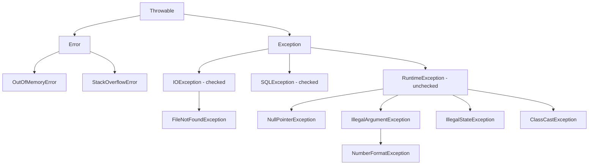

# Exceptions

Exception matlab program chalte waqt kuch galat hua (file nahi mili, null pe method call, galat input). Java me exception ek **object** hai jo stack ke upar "throw" hota hai jab tak koi `catch` na kare. Koi nahi pakadta to thread mar jaata hai aur stack trace print hota hai.

## ⭐ Exception hierarchy

**Ek line me:** sab kuch `Throwable` se nikalta hai. Uske do bachche: `Error` (JVM ki problem, mat pakdo) aur `Exception` (app ki problem, handle karo).



- **Error:** `OutOfMemoryError`, `StackOverflowError`. Recover karna practically possible nahi. Catch mat karo.
- **Exception (checked):** `RuntimeException` ko chhod ke baaki sab. Compiler force karta hai: ya `catch` karo ya `throws` likho.
- **RuntimeException (unchecked):** programming bugs. Compiler force nahi karta.

**Interview tip:** "Error bhi unchecked hai." Unchecked = `RuntimeException` + `Error` aur unke subclasses. Baaki sab checked.

**Common galti:** `catch (Throwable t)` likh dena. Isse `OutOfMemoryError` bhi pakad loge aur app zombie state me chalta rahega.

## ⭐ Checked vs Unchecked

**Ek line me:** checked = compile time pe handle karna padega (recoverable, bahar ki duniya), unchecked = runtime bug (code theek karo).

| | Checked | Unchecked |
|---|---|---|
| Parent | `Exception` (RuntimeException nahi) | `RuntimeException`, `Error` |
| Compiler check | Haan, catch ya `throws` zaroori | Nahi |
| Kab aata hai | Bahar ki cheez fail: file, network, DB | Code ka bug: null, galat index, galat argument |
| Example | `IOException`, `SQLException`, `InterruptedException` | `NullPointerException`, `ArrayIndexOutOfBoundsException` |

```java
import java.io.*;

public class Main {
    // Checked: throws likhna padega, warna compile error
    static String readFirstLine(String path) throws IOException {
        try (BufferedReader br = new BufferedReader(new FileReader(path))) {
            return br.readLine();
        }
    }

    // Unchecked: compiler kuch nahi bolega
    static int divide(int a, int b) {
        return a / b; // b == 0 to ArithmeticException
    }

    public static void main(String[] args) {
        try {
            System.out.println(readFirstLine("missing.txt"));
        } catch (FileNotFoundException e) {
            System.out.println("File nahi mili: " + e.getMessage());
        } catch (IOException e) {
            System.out.println("IO problem: " + e.getMessage());
        }
        System.out.println(divide(10, 2)); // 5
    }
}
```

**Interview tip:** Spring/Hibernate jaise modern frameworks mostly unchecked use karte hain kyunki har layer pe `throws` likhna noise hai. Bolo: "Caller kuch meaningful recover kar sakta hai to checked, warna unchecked."

**Common galti:** catch blocks ka order: specific pehle, general baad me. `catch (IOException)` ko `FileNotFoundException` se pehle likha to compile error (unreachable catch).

## ⭐ try / catch / finally

**Ek line me:** `try` me risky code, `catch` me handling, `finally` hamesha chalega (exception aaye ya na aaye, `return` ho tab bhi).

`finally` sirf tab nahi chalta jab `System.exit()` call ho, JVM crash ho, ya thread kill ho jaaye.

**Gotcha: finally me return.** `finally` ka `return` try ke `return` ko override kar deta hai, aur exception ko bhi nigal jaata hai.

```java
public class Main {
    static int test1() {
        try {
            return 1;
        } finally {
            return 2;          // try ka 1 overwrite, answer 2
        }
    }

    static int test2() {
        int x = 10;
        try {
            return x;          // 10 yahin save ho gaya
        } finally {
            x = 20;            // returned value pe asar nahi
        }
    }

    static int test3() {
        try {
            throw new RuntimeException("boom");
        } finally {
            return 3;          // exception gayab! caller ko pata hi nahi chalega
        }
    }

    public static void main(String[] args) {
        System.out.println(test1()); // 2
        System.out.println(test2()); // 10
        System.out.println(test3()); // 3
    }
}
```

**Interview tip:** `test2` sabse common trick question hai. Primitive ki value return se pehle copy ho jaati hai, isliye 10. Agar object return karte (jaise `StringBuilder`) aur finally me uska content badalte, to change dikhta (reference same hai).

**Common galti:** `finally` me `return` ya `throw` likhna. Original exception kho jaata hai. Finally sirf cleanup ke liye.

## ⭐ try-with-resources & AutoCloseable

**Ek line me:** jo bhi `AutoCloseable` implement kare, use `try (...)` me khol do, Java khud `close()` call karega (Java 7+).

- Multiple resources ho to **ulte order** me close hote hain (jo baad me khula, woh pehle band).
- Agar `try` body bhi throw kare aur `close()` bhi throw kare, to body wala exception main rehta hai, close wala **suppressed** ban ke uske andar chala jaata hai (`e.getSuppressed()`).

```java
public class Main {
    static class Conn implements AutoCloseable {
        private final String name;
        Conn(String name) { this.name = name; System.out.println("open " + name); }
        @Override
        public void close() throws Exception {
            System.out.println("close " + name);
            throw new IllegalStateException("close fail " + name);
        }
    }

    public static void main(String[] args) {
        try (Conn db = new Conn("db"); Conn cache = new Conn("cache")) {
            throw new RuntimeException("query fail");
        } catch (Exception e) {
            System.out.println("main: " + e.getMessage());          // query fail
            for (Throwable s : e.getSuppressed()) {
                System.out.println("suppressed: " + s.getMessage()); // close fail cache, close fail db
            }
        }
    }
}
// Output: open db, open cache, close cache, close db, main: query fail, ...
```

**Interview tip:** "Purane `finally { conn.close(); }` style me agar close bhi fail ho to original exception kho jaata tha. try-with-resources suppressed exceptions se dono bachata hai."

**Common galti:** `AutoCloseable` vs `Closeable`: `Closeable` (java.io) `IOException` throw karta hai aur idempotent hona chahiye. `AutoCloseable` generic hai, `Exception` throw kar sakta hai.

## Multi-catch

**Ek line me:** ek `catch` me kai exceptions `|` se pakdo jab handling same ho (Java 7+).

```java
try {
    int n = Integer.parseInt(args[0]);
    System.out.println(100 / n);
} catch (NumberFormatException | ArithmeticException e) {
    System.out.println("Galat input: " + e);
    // e = ...;  compile error: multi-catch variable implicitly final hai
}
```

**Common galti:** ek hi hierarchy ke types saath likhna: `catch (IOException | FileNotFoundException e)` compile error deta hai, kyunki ek doosre ka subclass hai.

## ⭐ throw vs throws

**Ek line me:** `throw` = abhi exception phenko (statement, method body ke andar). `throws` = method signature me declare karo ki ye method ye exception phenk sakta hai.

| | `throw` | `throws` |
|---|---|---|
| Kahan | Method body me | Method signature me |
| Kya leta hai | Ek exception object | Ek ya zyada exception classes |
| Example | `throw new IllegalArgumentException("amount < 0");` | `void pay() throws PaymentException` |

```java
static void withdraw(double balance, double amount) throws InsufficientFundsException {
    if (amount <= 0) throw new IllegalArgumentException("amount must be > 0"); // unchecked, declare nahi
    if (amount > balance) throw new InsufficientFundsException(amount - balance); // checked, declare kiya
}
```

**Interview tip:** unchecked exceptions ko `throws` me likhna allowed hai (documentation ke liye) par zaroori nahi.

## ⭐ Custom exceptions & chaining

**Ek line me:** domain ki galti ko naam do (`InsufficientFundsException`), aur neeche wali technical galti ko **cause** ke roop me andar rakho taaki root cause na khoye.

**Checked ya unchecked?**
- Checked (`extends Exception`): caller ko sach me kuch karna chahiye. Jaise Paytm wallet me balance kam: UI "Add money" dikhaye.
- Unchecked (`extends RuntimeException`): validation/bug, ya jab har layer pe `throws` noise ho. Aaj kal default yahi.

```java
class InsufficientFundsException extends Exception {
    private final double shortBy;
    InsufficientFundsException(double shortBy) {
        super("Balance kam hai, short by " + shortBy);
        this.shortBy = shortBy;
    }
    double getShortBy() { return shortBy; }
}

class OrderServiceException extends RuntimeException {
    OrderServiceException(String msg, Throwable cause) { super(msg, cause); } // chaining
}

public class Main {
    static void saveOrder(String id) {
        try {
            throw new java.sql.SQLException("connection timeout"); // DB layer fail
        } catch (java.sql.SQLException e) {
            throw new OrderServiceException("Order save fail: " + id, e); // cause pass kiya
        }
    }

    public static void main(String[] args) {
        try {
            saveOrder("ORD-42");
        } catch (OrderServiceException e) {
            System.out.println(e.getMessage());            // Order save fail: ORD-42
            System.out.println(e.getCause().getMessage()); // connection timeout
        }
    }
}
```

**Interview tip:** "Layer boundary pe exception translate karta hoon (SQLException → domain exception) par cause hamesha pass karta hoon. Stack trace me `Caused by:` se root cause milta hai."

**Common galti:** `throw new MyException(e.getMessage())` likhna. Original stack trace kho gaya. Hamesha `new MyException(msg, e)`.

## ⭐ Best practices

- **Swallow mat karo:** khaali `catch (Exception e) {}` sabse bura code hai. Kam se kam log karo, ya rethrow karo.
- **Broad catch mat karo:** `catch (Exception e)` har jagah likhoge to bugs (NPE) bhi chhup jaayenge. Specific exception pakdo. Broad catch sirf top level pe (request handler, thread boundary).
- **Fail fast:** method ke start me hi input validate karo: `Objects.requireNonNull(user, "user")`, `if (qty <= 0) throw new IllegalArgumentException(...)`.
- **Log ya rethrow, dono nahi:** dono karoge to ek hi error logs me 3-4 baar dikhega.
- **Exceptions control flow ke liye nahi:** loop todne ke liye exception throw karna slow hai (stack trace banana mehenga).
- **Meaningful message:** `"Invalid amount: -50 for user 123"`, na ki `"error"`.
- **Resources:** hamesha try-with-resources.
- `InterruptedException` pakdo to `Thread.currentThread().interrupt()` karke flag wapas set karo.

## Overriding rules with exceptions

**Ek line me:** child method parent se **zyada ya broader checked** exception throw nahi kar sakta. Kam, narrower, ya koi bhi unchecked chalega.

```java
class Parent {
    void load() throws java.io.IOException {}
}
class Child1 extends Parent {
    @Override void load() throws java.io.FileNotFoundException {} // OK: narrower
}
class Child2 extends Parent {
    @Override void load() {}                                       // OK: kuch nahi
}
class Child3 extends Parent {
    @Override void load() throws IllegalStateException {}         // OK: unchecked
}
// class Child4 extends Parent {
//     @Override void load() throws Exception {}                  // compile error: broader
// }
```

**Interview tip:** reason Liskov substitution hai. Caller `Parent p` pe sirf `IOException` handle kar raha hai. Child ne `Exception` phenka to caller unprepared hoga.

## ⭐ Common runtime exceptions

| Exception | Kab aata hai | Example |
|---|---|---|
| `NullPointerException` | null reference pe method/field access | `String s = null; s.length();` |
| `ClassCastException` | galat type me cast | `Object o = "hi"; Integer i = (Integer) o;` |
| `IllegalArgumentException` | method ko galat argument | `Thread.sleep(-1)` |
| `IllegalStateException` | object galat state me hai is call ke liye | `iterator.remove()` bina `next()` ke |
| `ConcurrentModificationException` | collection ko iterate karte waqt modify kiya | for-each me `list.remove(x)` |
| `NumberFormatException` | string number nahi hai | `Integer.parseInt("12a")` |
| `ArrayIndexOutOfBoundsException` | galat index | `arr[arr.length]` |
| `ArithmeticException` | integer divide by zero | `5 / 0` |
| `UnsupportedOperationException` | immutable collection modify | `List.of(1).add(2)` |

```java
import java.util.*;

public class Main {
    public static void main(String[] args) {
        List<Integer> list = new ArrayList<>(List.of(1, 2, 3, 4));
        // for (Integer x : list) if (x % 2 == 0) list.remove(x); // ConcurrentModificationException
        list.removeIf(x -> x % 2 == 0);   // sahi tareeka
        System.out.println(list);          // [1, 3]

        Integer boxed = null;
        // int n = boxed;                  // NPE: auto-unboxing null
    }
}
```

**Common galti:** `5.0 / 0` exception nahi deta, `Infinity` deta hai. `ArithmeticException` sirf integer division me.

## Optional se NPE avoid karo (brief)

**Ek line me:** jo method "value ho bhi sakti hai, nahi bhi" return kare, woh `null` ki jagah `Optional<T>` return kare (Java 8+).

```java
import java.util.*;

public class Main {
    static Optional<String> findCity(String userId) {
        return "u1".equals(userId) ? Optional.of("Pune") : Optional.empty();
    }

    public static void main(String[] args) {
        String city = findCity("u2").orElse("Unknown");
        System.out.println(city);                                    // Unknown
        findCity("u1").map(String::toUpperCase).ifPresent(System.out::println); // PUNE
        // findCity("u2").orElseThrow(); // NoSuchElementException
    }
}
```

Detail me Optional [Lambdas & Streams](12-streams-lambdas.md) file me hai.

**Common galti:** `opt.get()` bina check ke. Woh bhi NPE jaisa hi crash hai, bas naam alag (`NoSuchElementException`).

## Checklist

- [ ] Throwable → Error / Exception → RuntimeException hierarchy draw kar sakta hoon
- [ ] Checked vs unchecked ka difference 2-2 examples ke saath bata sakta hoon
- [ ] finally me return wale trick questions (override, primitive copy, swallowed exception) ka output bata sakta hoon
- [ ] try-with-resources ka close order aur suppressed exceptions samjha sakta hoon
- [ ] throw vs throws aur multi-catch ke rules bata sakta hoon
- [ ] Custom exception likh sakta hoon aur checked vs unchecked choice justify kar sakta hoon
- [ ] Exception chaining (cause) kyun zaroori hai bata sakta hoon
- [ ] Overriding me exception rules aur unka reason (LSP) bata sakta hoon
- [ ] Common runtime exceptions aur unke causes bina soche bol sakta hoon
