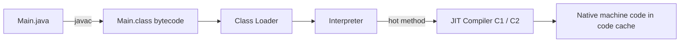
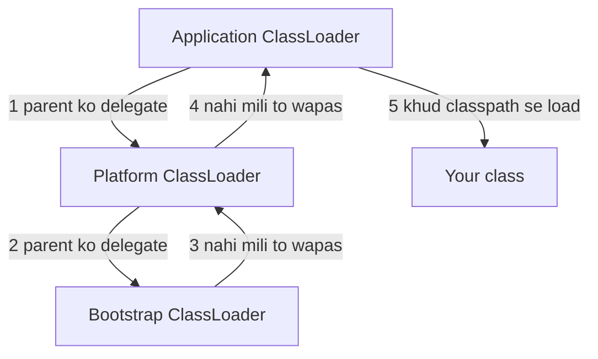
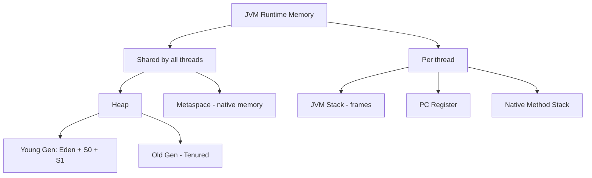
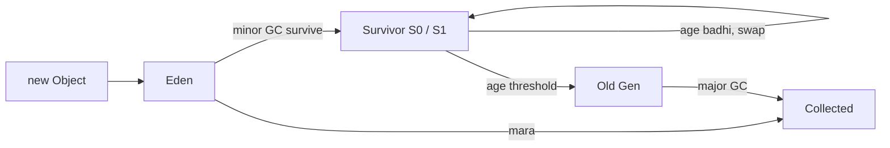

# JVM & Memory

Java code seedha machine pe nahi chalta. `javac` use **bytecode** me badalta hai, aur JVM us bytecode ko chalata hai, memory sambhalta hai, aur garbage khud saaf karta hai. Interview me "object kahan rehta hai", "GC kaise kaam karta hai", "memory leak Java me kaise" ye sab isi file se aata hai.

## ⭐ JDK vs JRE vs JVM

**Ek line me:** JVM bytecode chalata hai, JRE = JVM + standard libraries (chalane ke liye), JDK = JRE + developer tools (banane ke liye).

| | Kya hai | Kisko chahiye |
|---|---|---|
| JVM | Bytecode interpreter + JIT + GC + memory manager | Har Java program ko |
| JRE | JVM + core libraries (`java.lang`, `java.util`...) | Sirf app chalane wale ko |
| JDK | JRE + `javac`, `jar`, `jdb`, `jshell`, `jcmd`... | Developer ko |

**Interview tip:** "Platform independent" bytecode hai, JVM nahi. Har OS ka apna JVM hota hai, bytecode same rehta hai: "write once, run anywhere". Java 11 se Oracle alag JRE ship nahi karta, `jlink` se custom runtime banate hain.

## ⭐ Compilation: bytecode + JIT

**Ek line me:** `javac` → `.class` (bytecode) → JVM pehle interpret karta hai → jo code baar baar chalta hai (hot code) use JIT native machine code me compile kar deta hai.



- **Interpreter:** turant start, par slow.
- **JIT (Just-In-Time):** HotSpot me C1 (jaldi, kam optimize) aur C2 (dheere, heavy optimize). Ise **tiered compilation** kehte hain.
- JIT optimizations: method inlining, escape analysis (object stack pe ya scalar me), loop unrolling, dead code removal.

**Interview tip:** "Isliye Java app ka warm-up time hota hai. Pehle kuch seconds slow, phir JIT ke baad fast." AOT/GraalVM native image startup fast karte hain.

## ⭐ Class loading

**Ek line me:** class pehli baar use hone pe load hoti hai (lazy), aur loaders **parent delegation** follow karte hain: pehle parent se poochho, woh na de paaye tab khud load karo.

Teen built-in loaders (Java 9+):
1. **Bootstrap:** native code, `java.base` jaise core classes (`String`, `Object`). Java me iska reference `null` dikhta hai.
2. **Platform** (pehle Extension): baaki Java SE modules (`java.sql` etc).
3. **Application / System:** tumhara classpath / module path.



Phases: **Loading** (bytes padho) → **Linking** (verify, prepare: static fields default values, resolve) → **Initialization** (static blocks aur static initializers chalte hain).

```java
public class Main {
    public static void main(String[] args) {
        System.out.println(String.class.getClassLoader());   // null (bootstrap)
        System.out.println(java.sql.Connection.class.getClassLoader()); // PlatformClassLoader
        System.out.println(Main.class.getClassLoader());     // AppClassLoader
    }
}
```

**Interview tip:** delegation kyun? **Security + uniqueness.** Koi apni fake `java.lang.String` classpath pe daale to bhi bootstrap wali hi load hogi. Aur JVM me class ki identity = class name + loader, isliye do loaders se same class do alag types ban jaati hai (`ClassCastException` aa sakta hai, app servers me common).

## ⭐ Runtime memory areas

**Ek line me:** heap aur metaspace sab threads me shared hain; stack, PC register aur native stack har thread ka apna.



| Area | Kya rakhta hai | Error |
|---|---|---|
| Heap | Saare objects aur arrays, String pool (Java 7+) | `OutOfMemoryError: Java heap space` |
| Metaspace | Class metadata, method bytecode, constant pool (Java 8+, PermGen ki jagah) | `OutOfMemoryError: Metaspace` |
| JVM Stack | Har method call ka frame: local variables, operand stack, return address | `StackOverflowError` |
| PC Register | Current bytecode instruction ka address | - |
| Native Method Stack | JNI / native methods ke liye | - |

**Interview tip:** "PermGen Java 8 me hata ke Metaspace aaya. Metaspace native memory me hai aur default me auto-grow karta hai, isliye `MaxMetaspaceSize` set karna achha hai."

## ⭐ Stack vs Heap

**Ek line me:** stack me primitives aur references (method ke local), heap me actual objects. Stack automatic saaf (method khatam), heap GC saaf karta hai.

```java
public class Main {
    static int orderCount = 0;          // static field: Class object ke saath heap me (metadata Metaspace me)
    int price = 100;                    // instance field: object ke andar, heap me

    public static void main(String[] args) {
        int qty = 2;                    // primitive local: main ke stack frame me
        Main order = new Main();        // 'order' reference stack me, Main object heap me
        String city = "Pune";           // reference stack me, "Pune" heap ke String pool me
        int total = calc(order, qty);   // naya frame stack pe push
        System.out.println(total);      // 200
    }                                   // main ka frame pop, Main object ab unreachable

    static int calc(Main o, int q) {    // o aur q is frame ke locals (o heap object ko point karta hai)
        return o.price * q;
    }
}
```

| | Stack | Heap |
|---|---|---|
| Kya | Frames, primitives locals, references | Objects, arrays |
| Scope | Ek thread | Saare threads |
| Size | Chhota (`-Xss`, aksar 512KB-1MB) | Bada (`-Xmx`) |
| Cleanup | Method return pe automatic | GC |
| Speed | Bahut fast (LIFO) | Allocation fast (TLAB), GC cost |
| Thread safe | Haan (private) | Nahi, sync chahiye |

**Common galti:** "primitives hamesha stack pe" kehna. Galat. Object ka `int` field heap me hi rehta hai. Sirf **local** primitives stack pe.

## ⭐ Garbage Collection

**Ek line me:** GC un objects ko hataata hai jo kisi **GC root** se reachable nahi hain. Reference counting nahi, isliye cycles bhi saaf ho jaate hain.

**GC roots:** active threads ke stack ke local variables, static fields, JNI references, active threads khud, synchronized monitors.

**Generational hypothesis:** zyada tar objects jaldi mar jaate hain (request ke temp objects). Isliye heap ko young aur old me baanto:
- Naya object **Eden** me banta hai.
- Eden full → **Minor GC**: zinda objects Survivor (S0/S1) me copy, har survive pe age +1.
- Age threshold (max 15) cross → **Old Gen** me promote.
- Old Gen full → **Major / Full GC**: mehenga, lamba pause.



**Stop-the-world (STW):** GC ke kuch phases me saare application threads ruk jaate hain. Interview me latency ki baat hamesha pause time pe aati hai.

| Collector | Kab | Note |
|---|---|---|
| Serial | Chhote heap, single core | Ek thread, STW |
| Parallel | Throughput chahiye (batch jobs) | Multiple threads, STW |
| **G1** | **Java 9+ default** | Heap ko regions me baant ke, pause target (`-XX:MaxGCPauseMillis=200`) |
| ZGC | Bahut bade heap, under 1ms pause | Mostly concurrent, Java 15 se production, Java 21 me generational |
| Shenandoah | Low pause (Red Hat) | Concurrent compaction |

**Interview tip:** "System.gc() sirf request hai, guarantee nahi. Production code me call mat karo."

**Common galti:** "GC hai to Java me memory leak nahi hota." Hota hai: agar object reachable hai par kaam ka nahi, GC use nahi hata sakta.

## ⭐ Memory leaks in Java

**Ek line me:** leak = object kaam ka nahi par koi reference abhi bhi pakde baitha hai, isliye GC chhoota nahi.

Common sources:
- **Static collections:** `static Map cache` jisme sirf `put` hota hai, `remove` kabhi nahi.
- **Listeners / callbacks:** register kiya, unregister bhool gaye.
- **ThreadLocal in thread pools:** pool ke threads kabhi nahi marte, `remove()` nahi kiya to value hamesha rahegi (aur agle request me galat data bhi mil sakta hai).
- **Unclosed resources:** streams, connections, `ResultSet`.
- **Inner class:** non-static inner class outer object ka hidden reference rakhti hai.
- **Bad `equals`/`hashCode` key:** HashMap me mutable key, baad me change, entry kabhi mil nahi paati.

```java
import java.util.*;

public class Main {
    private static final Map<String, byte[]> CACHE = new HashMap<>(); // leak: kabhi clear nahi
    private static final ThreadLocal<StringBuilder> BUF = ThreadLocal.withInitial(StringBuilder::new);

    static void handle(String reqId) {
        CACHE.put(reqId, new byte[1024 * 1024]); // har request pe 1MB, kabhi nahi hata
        try {
            BUF.get().append(reqId);
        } finally {
            BUF.remove();                         // ThreadLocal hamesha finally me remove
        }
    }

    public static void main(String[] args) {
        for (int i = 0; i < 100; i++) handle("req-" + i);
        System.out.println(CACHE.size()); // 100 -> badhta hi jaayega
    }
}
```

Fix: bounded cache (LRU via `LinkedHashMap.removeEldestEntry`, Caffeine), TTL, `WeakHashMap` jahan key ki life outside decide ho.

**Interview tip:** debug kaise karoge: "`-XX:+HeapDumpOnOutOfMemoryError` on rakhta hoon, heap dump ko Eclipse MAT / VisualVM me khol ke dominator tree dekhta hoon ki kaunsa object sabse zyada memory retain kar raha hai."

## ⭐ OutOfMemoryError vs StackOverflowError

| | `OutOfMemoryError` | `StackOverflowError` |
|---|---|---|
| Kahan | Heap / Metaspace / native | Thread ka stack |
| Cause | Bahut objects, leak, heap chhota | Bahut gehri / infinite recursion |
| Fix | Leak dhundho, `-Xmx` badhao | Base case theek karo, iterative banao, `-Xss` badhao |

```java
public class Main {
    static int depth = 0;
    static void recurse() { depth++; recurse(); } // base case nahi

    public static void main(String[] args) {
        try {
            recurse();
        } catch (StackOverflowError e) {
            System.out.println("Depth reached: " + depth); // ~10-20k, -Xss pe depend
        }
    }
}
```

OOM ke variants: `Java heap space`, `Metaspace`, `GC overhead limit exceeded` (98% time GC me jaa raha, phir bhi 2% se kam heap recover), `unable to create new native thread`.

## Strong / Soft / Weak / Phantom references

**Ek line me:** reference ki strength decide karti hai ki GC object ko kab hata sakta hai.

| Type | GC kab hataayega | Use |
|---|---|---|
| Strong (`Obj o = new Obj()`) | Kabhi nahi, jab tak reachable | Normal code |
| `SoftReference` | Sirf jab memory kam ho (OOM se pehle) | Memory-sensitive cache |
| `WeakReference` | Agle GC me hi (agar sirf weak refs bache) | `WeakHashMap`, metadata, listeners |
| `PhantomReference` | `get()` hamesha `null`; enqueue hota hai collect hone ke baad | Cleanup tracking (`Cleaner`) |

```java
import java.lang.ref.WeakReference;

public class Main {
    public static void main(String[] args) {
        Object strong = new Object();
        WeakReference<Object> weak = new WeakReference<>(strong);
        System.out.println(weak.get() != null); // true
        strong = null;                           // ab sirf weak ref bacha
        System.gc();                             // sirf hint
        System.out.println(weak.get());          // aksar null
    }
}
```

## ⭐ JVM flags

| Flag | Kya karta hai |
|---|---|
| `-Xms512m` | Initial heap size |
| `-Xmx2g` | Max heap size |
| `-Xss1m` | Har thread ka stack size |
| `-Xmn256m` | Young gen size |
| `-XX:MaxMetaspaceSize=256m` | Metaspace limit |
| `-XX:+UseG1GC` / `-XX:+UseZGC` | Collector choose karo |
| `-XX:+HeapDumpOnOutOfMemoryError` | OOM pe heap dump |
| `-Xlog:gc` | GC logs (Java 9+) |

**Interview tip:** "Production me `-Xms` aur `-Xmx` same rakhte hain taaki heap resize ka cost na lage. Container me `-XX:MaxRAMPercentage=75` use karta hoon."

**Common galti:** `-Xss` badhane se bahut threads wale app me native memory khatam ho sakti hai (har thread ka stack us size ka).

## finalize() deprecated

**Ek line me:** `finalize()` Java 9 me deprecated, Java 18 me "for removal". Kab chalega pata nahi, chalega bhi ya nahi pata nahi, GC slow karta hai, object resurrect kar sakta hai.

Alternative: **try-with-resources** (`AutoCloseable`) deterministic cleanup ke liye, aur safety net ke liye `java.lang.ref.Cleaner`.

## ⭐ String pool location

**Ek line me:** String pool (interned strings) Java 7 se **heap** me hai. Java 6 tak PermGen me tha, isliye bahut `intern()` se PermGen OOM aata tha.

```java
public class Main {
    public static void main(String[] args) {
        String a = "Swiggy";                 // pool me
        String b = "Swiggy";                 // pool se same object
        String c = new String("Swiggy");     // naya heap object
        System.out.println(a == b);          // true
        System.out.println(a == c);          // false
        System.out.println(a == c.intern()); // true
    }
}
```

**Interview tip:** heap me hone ka fayda: pool ki unused strings bhi GC ho sakti hain. Detail [Strings](02-strings.md) file me hai.

## Checklist

- [ ] JDK vs JRE vs JVM aur bytecode + JIT ka flow bata sakta hoon
- [ ] Teen class loaders aur parent delegation (aur kyun) samjha sakta hoon
- [ ] JVM memory areas draw kar sakta hoon aur bata sakta hoon kaunsa shared, kaunsa per-thread
- [ ] Ek code snippet me bata sakta hoon kaunsa variable stack pe aur kaunsa object heap pe
- [ ] GC roots, generational hypothesis, minor vs major GC samjha sakta hoon
- [ ] G1 default kyun, aur ZGC/Shenandoah kab, bata sakta hoon
- [ ] Java me memory leak ke 4 real causes aur debug karne ka tareeka bata sakta hoon
- [ ] OOM vs StackOverflowError aur soft/weak/phantom references ka difference bata sakta hoon
- [ ] -Xms, -Xmx, -Xss flags aur String pool ki location bata sakta hoon
