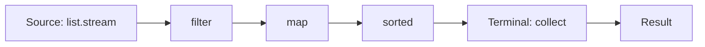

# Lambdas & Streams

Java 8 ne functional style laaya: **lambda** (chhota anonymous function) aur **Stream API** (collection pe declarative pipeline: "kya chahiye" bolo, "kaise loop karna hai" nahi). Interview me aksar seedha bolte hain: "Ye stream se ek line me likho."

## ⭐ Functional interfaces

**Ek line me:** jis interface me **sirf ek abstract method** ho, woh functional interface hai, aur lambda usi ka object banata hai.

`@FunctionalInterface` annotation optional hai, par lagao: koi doosra abstract method add kare to compile error dega. `default` aur `static` methods allowed hain.

| Interface | Method | Input → Output | Example |
|---|---|---|---|
| `Function<T, R>` | `apply` | T → R | `s -> s.length()` |
| `Predicate<T>` | `test` | T → boolean | `n -> n % 2 == 0` |
| `Consumer<T>` | `accept` | T → void | `s -> System.out.println(s)` |
| `Supplier<T>` | `get` | () → T | `() -> new ArrayList<>()` |
| `BiFunction<T, U, R>` | `apply` | (T, U) → R | `(a, b) -> a + b` |
| `UnaryOperator<T>` | `apply` | T → T | `s -> s.trim()` |
| `BinaryOperator<T>` | `apply` | (T, T) → T | `Integer::sum` |

```java
import java.util.function.*;

public class Main {
    @FunctionalInterface
    interface DiscountRule {
        double apply(double amount);           // ek hi abstract method
        default DiscountRule then(DiscountRule next) {
            return amt -> next.apply(apply(amt));
        }
    }

    public static void main(String[] args) {
        Function<String, Integer> len = s -> s.length();
        Predicate<Integer> isEven = n -> n % 2 == 0;
        Consumer<String> printer = s -> System.out.println("Order: " + s);
        Supplier<Double> random = Math::random;
        BiFunction<Integer, Integer, Integer> add = (a, b) -> a + b;
        UnaryOperator<String> upper = String::toUpperCase;

        System.out.println(len.apply("Zomato"));          // 6
        System.out.println(isEven.and(n -> n > 10).test(12)); // true
        printer.accept("ORD-1");
        System.out.println(add.andThen(x -> x * 10).apply(2, 3)); // 50
        System.out.println(upper.apply("paytm"));         // PAYTM

        DiscountRule flat50 = amt -> amt - 50;
        DiscountRule tenPct = amt -> amt * 0.9;
        System.out.println(flat50.then(tenPct).apply(500)); // 405.0
    }
}
```

**Interview tip:** primitive versions bhi hain (`IntPredicate`, `IntFunction`, `ToIntFunction`, `IntUnaryOperator`) jo boxing avoid karte hain. `Runnable` aur `Comparator` bhi functional interfaces hain.

**Common galti:** "Comparator me do abstract methods hain (`compare`, `equals`)". `equals` `Object` ka public method hai, woh count nahi hota.

## ⭐ Lambda syntax & effectively final

**Ek line me:** `(params) -> expression` ya `(params) -> { statements; }`. Lambda bahar ke local variable ko use kar sakta hai, par sirf agar woh **effectively final** ho (assign ke baad kabhi change na ho).

```java
import java.util.*;

public class Main {
    public static void main(String[] args) {
        Runnable r = () -> System.out.println("no args");
        Comparator<String> byLen = (a, b) -> Integer.compare(a.length(), b.length());
        java.util.function.BiFunction<Integer, Integer, Integer> max = (a, b) -> {
            if (a > b) return a;
            return b;
        };

        int gst = 18;                         // effectively final
        java.util.function.Function<Integer, Integer> withTax = p -> p + p * gst / 100;
        // gst = 12;                           // isse upar wala lambda compile error dega
        System.out.println(withTax.apply(100)); // 118

        // Counter workaround: array/AtomicInteger (par streams me side effects avoid karo)
        int[] count = {0};
        List.of("a", "b", "c").forEach(s -> count[0]++);
        System.out.println(count[0]);          // 3
        r.run();
    }
}
```

**Interview tip:** kyun effectively final? Lambda local variable ki **copy** capture karta hai (stack frame method ke baad khatam ho sakta hai, aur lambda baad me / doosre thread me chal sakta hai). Agar change allowed hota to copy aur original alag hote, confusing + race condition. Instance fields pe ye rule nahi hai (woh `this` ke through heap pe hain).

**Common galti:** lambda ke andar `this` anonymous class jaisa nahi hai. Lambda me `this` = enclosing class ka object. Anonymous class me `this` = anonymous object khud.

## ⭐ Method references

**Ek line me:** jab lambda sirf ek existing method call kar raha ho, to `Class::method` likh do. Chaar kinds hain.

| Kind | Syntax | Lambda equivalent |
|---|---|---|
| Static method | `Integer::parseInt` | `s -> Integer.parseInt(s)` |
| Bound instance (specific object) | `System.out::println` | `x -> System.out.println(x)` |
| Unbound instance (arbitrary object of type) | `String::toUpperCase` | `s -> s.toUpperCase()` |
| Constructor | `ArrayList::new` | `() -> new ArrayList<>()` |

```java
import java.util.*;
import java.util.function.*;

public class Main {
    public static void main(String[] args) {
        Function<String, Integer> parse = Integer::parseInt;            // static
        Consumer<String> print = System.out::println;                   // bound
        BiFunction<String, String, Boolean> eq = String::equalsIgnoreCase; // unbound: pehla arg object banta hai
        Supplier<List<String>> listMaker = ArrayList::new;              // constructor
        Function<Integer, int[]> arrMaker = int[]::new;                 // array constructor

        print.accept(String.valueOf(parse.apply("42") + 1)); // 43
        System.out.println(eq.apply("IPL", "ipl"));            // true
        List<String> l = listMaker.get();
        l.add("x");
        System.out.println(l + " " + arrMaker.apply(3).length); // [x] 3
    }
}
```

**Common galti:** unbound reference me pehla parameter hi woh object hota hai jis pe method chalega. `String::compareTo` ek `BiFunction<String,String,Integer>` / `Comparator<String>` hai, `Function` nahi.

## ⭐ Stream pipeline

**Ek line me:** **source → zero ya zyada intermediate ops → ek terminal op**. Intermediate ops **lazy** hain: jab tak terminal op na lage, kuch nahi chalta.



- Stream data store nahi karta, source ko modify nahi karta.
- Elements ek ek karke poori pipeline se guzarte hain (vertical), har op poori list pe alag loop nahi chalata. Stateful ops (`sorted`, `distinct`) exception hain, unhe sab dekhna padta hai.
- **Short-circuit** ops (`findFirst`, `anyMatch`, `limit`) baaki elements process hi nahi karte.

```java
import java.util.*;

public class Main {
    public static void main(String[] args) {
        List<String> names = List.of("amit", "bhavna", "chirag", "deepa");
        var stream = names.stream()
            .filter(n -> { System.out.println("filter " + n); return n.length() > 4; })
            .map(n -> { System.out.println("map " + n); return n.toUpperCase(); });
        System.out.println("Abhi tak kuch print nahi hua (lazy)");

        Optional<String> first = stream.findFirst();   // ab chalega
        System.out.println(first.get());
        // filter amit, filter bhavna, map bhavna, BHAVNA  -> chirag/deepa touch hi nahi hue
    }
}
```

**Interview tip:** "Stream ek baar hi consume hota hai." Dobara terminal op lagaya to `IllegalStateException: stream has already been operated upon or closed`. Baar baar chahiye to `Supplier<Stream<T>>` rakho ya `list.stream()` dobara call karo.

## ⭐ Important operations

| Method | Kya karta hai | Type |
|---|---|---|
| `filter(Predicate)` | Condition match wale rakho | Intermediate |
| `map(Function)` | Har element ko transform | Intermediate |
| `flatMap(Function)` | Har element se stream, phir sab ko flatten | Intermediate |
| `distinct()` | Duplicates hatao (`equals`/`hashCode`) | Intermediate, stateful |
| `sorted()` / `sorted(Comparator)` | Sort | Intermediate, stateful |
| `limit(n)` / `skip(n)` | Pehle n lo / pehle n chhodo | Intermediate, short-circuit (limit) |
| `peek(Consumer)` | Debug ke liye dekho, change mat karo | Intermediate |
| `mapToInt` / `boxed()` | `Stream<T>` ↔ `IntStream` | Intermediate |
| `reduce(identity, op)` | Sab ko combine karke ek value | Terminal |
| `collect(Collector)` | List/Set/Map me jama karo | Terminal |
| `toList()` | Unmodifiable list (Java 16+) | Terminal |
| `count()` | Kitne elements | Terminal |
| `anyMatch` / `allMatch` / `noneMatch` | Boolean check | Terminal, short-circuit |
| `findFirst` / `findAny` | `Optional` me ek element | Terminal, short-circuit |
| `min` / `max(Comparator)` | `Optional` me min/max | Terminal |
| `forEach(Consumer)` | Har element pe action | Terminal |

```java
import java.util.*;
import java.util.stream.*;

public class Main {
    public static void main(String[] args) {
        List<Integer> nums = List.of(5, 3, 8, 3, 1, 9, 8);

        System.out.println(nums.stream().distinct().sorted().toList());        // [1, 3, 5, 8, 9]
        System.out.println(nums.stream().map(n -> n * n).limit(3).toList());   // [25, 9, 64]
        System.out.println(nums.stream().skip(5).toList());                     // [9, 8]
        System.out.println(nums.stream().reduce(0, Integer::sum));              // 37
        System.out.println(nums.stream().mapToInt(Integer::intValue).sum());    // 37
        System.out.println(nums.stream().anyMatch(n -> n > 8));                 // true
        System.out.println(nums.stream().allMatch(n -> n > 0));                 // true
        System.out.println(nums.stream().max(Comparator.naturalOrder()).get()); // 9
        System.out.println(nums.stream().filter(n -> n > 100).findFirst());     // Optional.empty

        List<List<String>> orders = List.of(List.of("pizza", "coke"), List.of("burger"));
        System.out.println(orders.stream().flatMap(List::stream).toList());     // [pizza, coke, burger]

        List<Integer> squares = IntStream.rangeClosed(1, 5).map(i -> i * i).boxed().toList();
        System.out.println(squares);                                            // [1, 4, 9, 16, 25]
        System.out.println(IntStream.range(0, 5).sum());                        // 10 (0..4)
    }
}
```

**Interview tip:** `map` vs `flatMap`: `map` one-to-one (`Stream<List<String>>` hi rahega), `flatMap` one-to-many aur flatten (`Stream<String>`).

**Common galti:** `peek` se state change karna ya `forEach` me bahar ki list me `add` karna. Side effects parallel me toot jaate hain. `collect` use karo.

## ⭐ Collectors

**Ek line me:** `collect(...)` ke andar `Collectors` batate hain ki result kis shape me chahiye: List, Set, Map, group, string.

```java
import java.util.*;
import java.util.function.Function;
import java.util.stream.*;

public class Main {
    record Order(String city, String item, int amount) {}

    public static void main(String[] args) {
        List<Order> orders = List.of(
            new Order("Pune", "pizza", 300), new Order("Delhi", "biryani", 250),
            new Order("Pune", "burger", 150), new Order("Mumbai", "pizza", 400));

        List<String> items = orders.stream().map(Order::item).collect(Collectors.toList());
        Set<String> cities = orders.stream().map(Order::city).collect(Collectors.toSet());

        // toMap: duplicate key pe merge function zaroori, warna IllegalStateException
        Map<String, Integer> amountByCity = orders.stream()
            .collect(Collectors.toMap(Order::city, Order::amount, Integer::sum));
        System.out.println(amountByCity);   // Pune=450, Delhi=250, Mumbai=400 (HashMap order)

        Map<String, Long> countByCity = orders.stream()
            .collect(Collectors.groupingBy(Order::city, Collectors.counting()));

        Map<String, List<String>> itemsByCity = orders.stream()
            .collect(Collectors.groupingBy(Order::city, TreeMap::new,
                     Collectors.mapping(Order::item, Collectors.toList())));
        System.out.println(itemsByCity);    // {Delhi=[biryani], Mumbai=[pizza], Pune=[pizza, burger]}

        Map<Boolean, List<Order>> bigSmall = orders.stream()
            .collect(Collectors.partitioningBy(o -> o.amount() >= 300));
        System.out.println(bigSmall.get(true).size()); // 2

        String csv = orders.stream().map(Order::item).distinct()
            .collect(Collectors.joining(", ", "[", "]"));
        System.out.println(csv);            // [pizza, biryani, burger]

        Map<String, Integer> sumByCity = orders.stream()
            .collect(Collectors.groupingBy(Order::city, Collectors.summingInt(Order::amount)));
        System.out.println(countByCity + " " + sumByCity);  // Pune=2 ... Pune=450 ...
        System.out.println(items.size() + " items, " + cities.size() + " cities"); // 4 items, 3 cities
    }
}
```

| Collector | Result |
|---|---|
| `toList()` / `toSet()` | List / Set |
| `toMap(k, v, merge)` | Map, duplicate key pe merge |
| `groupingBy(k)` | `Map<K, List<T>>` |
| `groupingBy(k, counting())` | `Map<K, Long>` |
| `groupingBy(k, mapping(f, toList()))` | Group ke andar transform |
| `partitioningBy(pred)` | `Map<Boolean, List<T>>` (hamesha dono keys) |
| `joining(sep, prefix, suffix)` | String |
| `summingInt`, `averagingInt`, `maxBy` | Aggregates |

**Common galti:** `toMap` bina merge function ke jab keys repeat ho sakti hain: `IllegalStateException: Duplicate key`. Aur `toMap` me null value bhi NPE deti hai.

## ⭐ Optional: do's & don'ts

**Ek line me:** `Optional` return type ke liye bana hai, taaki caller ko clearly pata ho ki "value nahi bhi ho sakti".

```java
import java.util.*;

public class Main {
    static Optional<String> findCoupon(String user) {
        return user.startsWith("vip") ? Optional.of("FLAT100") : Optional.empty();
    }
    static String expensiveDefault() { System.out.println("called!"); return "NONE"; }

    public static void main(String[] args) {
        String c1 = findCoupon("vip_amit").orElse(expensiveDefault());      // "called!" print hoga phir bhi
        String c2 = findCoupon("vip_amit").orElseGet(Main::expensiveDefault); // call nahi hoga
        System.out.println(c1 + " " + c2);                                  // FLAT100 FLAT100

        findCoupon("ravi").map(String::toLowerCase).ifPresentOrElse(
            System.out::println, () -> System.out.println("no coupon"));    // no coupon

        Optional<String> maybeNull = Optional.ofNullable(null);              // of(null) NPE deta
        System.out.println(maybeNull.isPresent());                          // false
        // findCoupon("ravi").orElseThrow(() -> new IllegalStateException("no coupon"));
    }
}
```

**Do:** return type me use karo, `map`/`flatMap`/`filter`/`orElse`/`orElseGet`/`orElseThrow` se chain karo, `ofNullable` jab value null ho sakti ho.

**Don't:**
- Field, method parameter, ya collection element ke liye `Optional` mat use karo (serializable nahi, overhead).
- `Optional` khud `null` return mat karo.
- `isPresent()` + `get()` combo mat likho, `map`/`orElse` use karo.
- `Optional<List<T>>` mat lo, empty list return karo.
- `orElse(expensiveCall())` mat likho, `orElseGet` lo (orElse ka argument hamesha evaluate hota hai).

## Parallel streams: caution

**Ek line me:** `parallelStream()` common `ForkJoinPool` pe kaam baant deta hai. Fast tabhi jab data bada ho, kaam CPU-heavy ho, aur koi shared state na ho.

Kab avoid karo:
- Chhota data (thread coordination ka overhead zyada).
- IO / blocking calls (common pool ke saare threads block, poori app slow).
- Shared mutable state (`ArrayList.add` from many threads = race condition).
- Order chahiye (`forEach` order guarantee nahi karta, `forEachOrdered` karta hai par speed kam).
- `LinkedList` ya `Stream.iterate` jaise source jo achhe se split nahi hote.

```java
import java.util.*;
import java.util.stream.*;

public class Main {
    public static void main(String[] args) {
        List<Integer> unsafe = new ArrayList<>();
        IntStream.range(0, 10_000).parallel().forEach(unsafe::add);   // race condition
        System.out.println(unsafe.size());                            // aksar < 10000 ya exception

        List<Integer> safe = IntStream.range(0, 10_000).parallel().boxed().toList();
        System.out.println(safe.size());                              // 10000
    }
}
```

**Interview tip:** "Default me sequential rakhta hoon. Parallel sirf measure karke, CPU-bound bade data pe."

## ⭐ Common interview stream questions

```java
import java.util.*;
import java.util.function.Function;
import java.util.stream.*;

public class Main {
    record Emp(String name, String dept, double salary) {}

    public static void main(String[] args) {
        // 1. Word frequency map
        String text = "ipl csk mi csk rcb mi csk";
        Map<String, Long> freq = Arrays.stream(text.split(" "))
            .collect(Collectors.groupingBy(Function.identity(), Collectors.counting()));
        System.out.println(freq.get("csk"));                                // 3

        // 2. Second highest (distinct)
        List<Integer> nums = List.of(10, 40, 30, 40, 20);
        Optional<Integer> second = nums.stream().distinct()
            .sorted(Comparator.reverseOrder()).skip(1).findFirst();
        System.out.println(second.orElse(-1));                              // 30

        // 3. First non-repeated character
        String s = "swiss";
        Character firstUnique = s.chars().mapToObj(c -> (char) c)
            .collect(Collectors.groupingBy(Function.identity(), LinkedHashMap::new, Collectors.counting()))
            .entrySet().stream().filter(e -> e.getValue() == 1)
            .map(Map.Entry::getKey).findFirst().orElse(null);
        System.out.println(firstUnique);                                    // w

        // 4. Group by dept, highest paid per dept, average salary per dept
        List<Emp> emps = List.of(new Emp("Amit", "Eng", 90), new Emp("Neha", "Eng", 120),
                                 new Emp("Ravi", "HR", 60));
        Map<String, Optional<Emp>> topByDept = emps.stream().collect(Collectors.groupingBy(
            Emp::dept, Collectors.maxBy(Comparator.comparingDouble(Emp::salary))));
        System.out.println(topByDept.get("Eng").get().name());              // Neha
        Map<String, Double> avg = emps.stream()
            .collect(Collectors.groupingBy(Emp::dept, Collectors.averagingDouble(Emp::salary)));
        System.out.println(avg.get("Eng"));                                 // 105.0

        // 5. Duplicates in a list
        Set<Integer> seen = new HashSet<>();
        Set<Integer> dups = nums.stream().filter(n -> !seen.add(n)).collect(Collectors.toSet());
        System.out.println(dups);                                           // [40]

        // 6. Top 2 salaries ke naam
        System.out.println(emps.stream().sorted(Comparator.comparingDouble(Emp::salary).reversed())
            .limit(2).map(Emp::name).toList());                             // [Neha, Amit]
    }
}
```

**Interview tip:** Q5 me `seen.add` ek side effect hai, sequential stream me chalta hai, parallel me nahi. Interviewer pooche to bolo, aur alternative do: `groupingBy(identity, counting())` phir `count > 1` filter.

## Checklist

- [ ] 6 core functional interfaces (Function, Predicate, Consumer, Supplier, BiFunction, UnaryOperator) aur unke method naam bata sakta hoon
- [ ] Effectively final rule aur uska reason samjha sakta hoon
- [ ] Method references ke 4 kinds example ke saath likh sakta hoon
- [ ] Stream pipeline (source, intermediate, terminal) aur laziness ek example se dikha sakta hoon
- [ ] map vs flatMap, findFirst vs findAny, reduce ka use bata sakta hoon
- [ ] toMap with merge, groupingBy + counting, partitioningBy, joining likh sakta hoon
- [ ] Optional ke do's & don'ts aur orElse vs orElseGet ka difference bata sakta hoon
- [ ] Parallel stream kab use nahi karna, bata sakta hoon
- [ ] Frequency map, second highest, group by wale stream questions bina dekhe likh sakta hoon
