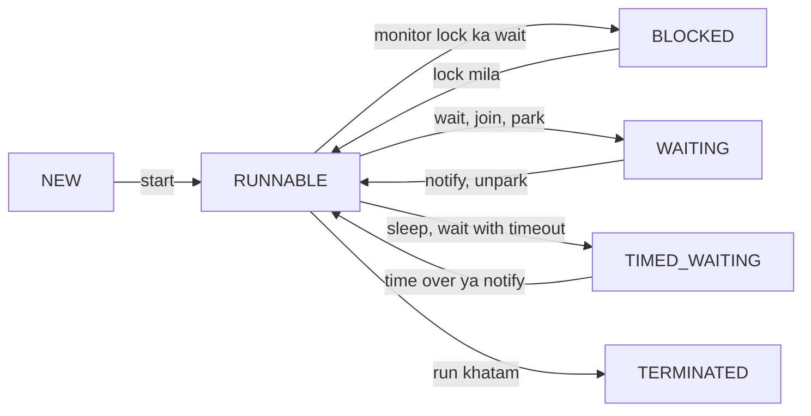

# Concurrency

Concurrency matlab ek saath kai kaam. Java me ye threads se hota hai. SDE-1/SDE-2 interview me yahan se pakka sawal aata hai: race condition, `synchronized` vs `volatile`, deadlock, thread pool, `CompletableFuture`, `ConcurrentHashMap`.

## Thread vs process

**Ek line me:** process = alag memory wala chalta program, thread = process ke andar ka halka execution unit jo memory share karta hai.

| | Process | Thread |
|---|---|---|
| Memory | apna address space | process ka heap share, apna stack |
| Banana / switch karna | mehenga | sasta |
| Communication | IPC (socket, pipe) | shared objects (isliye locks chahiye) |
| Crash | dusre process safe | ek thread ka OOM poore JVM ko gira sakta hai |

**Interview tip:** "Chrome har tab ke liye process banata hai (isolation), Tomcat har request ke liye thread (speed)." Ye example yaad rakho.

## ⭐ Creating threads: Thread, Runnable, Callable

**Ek line me:** `Runnable` = kaam jo kuch return nahi karta, `Callable` = kaam jo value return kare aur checked exception throw kar sake. `Thread` = jo usse chalata hai.

```java
import java.util.concurrent.*;

public class Main {
    static class MyThread extends Thread {               // Tareeka 1: extend (kam flexible)
        public void run() { System.out.println("extends Thread"); }
    }

    public static void main(String[] args) throws Exception {
        new MyThread().start();

        Runnable task = () -> System.out.println("Runnable on " + Thread.currentThread().getName());
        Thread t = new Thread(task, "worker-1");          // Tareeka 2: Runnable (preferred)
        t.start();
        t.join();                                         // t khatam hone tak wait

        Callable<Integer> price = () -> 499;              // Tareeka 3: Callable + executor
        ExecutorService pool = Executors.newSingleThreadExecutor();
        Future<Integer> f = pool.submit(price);
        System.out.println(f.get());                      // 499 (block karta hai)
        pool.shutdown();
    }
}
```

**Interview tip:** "`start()` vs `run()`?" `start()` naya thread banata hai jo `run()` chalata hai. Seedha `run()` call kiya to wahi current thread me normal method call hai. Ek thread pe `start()` do baar = `IllegalThreadStateException`.

**Common galti:** `Thread` extend karna jab sirf kaam define karna ho. Java me single inheritance hai, `Runnable` lo.

## ⭐ Thread lifecycle

**Ek line me:** `Thread.State` me 6 states hain: NEW, RUNNABLE, BLOCKED, WAITING, TIMED_WAITING, TERMINATED.



- RUNNABLE me "ready" aur "actually running on CPU" dono aate hain. Java alag state nahi deta.
- BLOCKED sirf `synchronized` lock ke wait pe. `ReentrantLock` pe wait karta thread WAITING dikhta hai (andar `LockSupport.park`).

**Interview tip:** "`sleep` vs `wait`?" `sleep` lock **nahi chhodta**, `Thread` ka static method hai. `wait` lock **chhod deta hai**, `Object` ka method hai, `synchronized` ke andar hi call hota hai.

## ⭐ Race condition

**Ek line me:** jab do threads shared data ko bina coordination ke read-modify-write karein aur result timing pe depend kare.

```java
public class Main {
    static int count = 0;

    public static void main(String[] args) throws InterruptedException {
        Runnable inc = () -> { for (int i = 0; i < 100_000; i++) count++; };
        Thread a = new Thread(inc), b = new Thread(inc);
        a.start(); b.start();
        a.join(); b.join();
        System.out.println(count); // 200000 expected, aksar kam aata hai
    }
}
```

`count++` ek step nahi, teen hain: read, +1, write. Do threads same value padh ke dono likh dein to ek increment kho jaata hai (lost update). Fix: `synchronized`, `AtomicInteger`, ya lock.

**Interview tip:** BookMyShow seat booking ya Paytm wallet balance ka example do: do requests ne same balance padha, dono ne deduct kiya, ek deduction kho gaya.

## ⭐ synchronized

**Ek line me:** ek time pe sirf ek thread us block/method me ghus sake. Har Java object ka ek **intrinsic lock (monitor)** hota hai, `synchronized` wahi lock leta hai.

```java
class Wallet {
    private int balance = 1000;
    private final Object lock = new Object();

    public synchronized void add(int amt) { balance += amt; }       // lock: this

    public static synchronized void audit() { }                     // lock: Wallet.class

    public boolean pay(int amt) {
        synchronized (lock) {                                        // block: sirf zaroori hissa lock
            if (balance < amt) return false;
            balance -= amt;
            return true;
        }
    }

    public synchronized void refundAndAdd(int amt) {
        add(amt);   // reentrant: same thread ke paas 'this' lock already hai, phir se le sakta hai
    }
}
```

- **Reentrancy:** jis thread ke paas lock hai woh dobara le sakta hai (counter badhta hai). Isliye synchronized method se dusra synchronized method call karne pe deadlock nahi hota.
- `synchronized` **visibility** bhi deta hai: lock chhodne se pehle ke writes agla lock lene wale ko dikhte hain.
- Exception aaye to lock automatically release hota hai.

**Interview tip:** method level ki jagah chhota block lock karo, aur `private final Object lock` pe lock karo taaki bahar ka code tumhara lock na le sake.

**Common galti:** `synchronized` instance method aur `static synchronized` method ko same lock samajhna. Ek `this` pe hai, ek `Class` object pe, dono ek saath chal sakte hain.

## ⭐ volatile aur happens-before

**Ek line me:** `volatile` **visibility** guarantee karta hai (har read main memory ka latest value dekhe) aur reordering rokta hai, par **atomicity nahi** deta.

```java
class Worker implements Runnable {
    private volatile boolean running = true;   // volatile ke bina loop kabhi ruk bhi na sake
    public void stop() { running = false; }
    public void run() { while (running) { /* kaam */ } }
}
```

- Sahi use: ek thread likhta hai, baaki padhte hain (stop flag, config refresh, DCL singleton ka `instance`).
- Galat use: `volatile int count; count++;` abhi bhi race hai. `AtomicInteger` lo.

**Happens-before (short):** agar A happens-before B, to A ke writes B ko dikhenge. Main rules:
- Monitor unlock → usi monitor ka agla lock.
- `volatile` write → usi variable ka baad ka read.
- `thread.start()` → us thread ke andar ke actions.
- Thread ke saare actions → dusre thread me `join()` return hona.

**Interview tip:** "volatile vs synchronized?" volatile = sirf visibility, no locking, no atomic compound ops. synchronized = mutual exclusion + visibility.

## wait / notify

**Ek line me:** threads ke beech signal bhejne ka low-level tareeka. Thread condition ke liye `wait()` karta hai, dusra `notify()`/`notifyAll()` se jagata hai.

```java
class OrderBox {
    private String order;

    public synchronized void put(String o) throws InterruptedException {
        while (order != null) wait();      // box bhara hai, wait
        order = o;
        notifyAll();
    }
    public synchronized String take() throws InterruptedException {
        while (order == null) wait();      // hamesha while, if nahi (spurious wakeup)
        String o = order; order = null;
        notifyAll();
        return o;
    }
}
```

**Interview tip:** teen rules: (1) `synchronized` ke andar call karo, warna `IllegalMonitorStateException`, (2) condition `while` me check karo, (3) jab ek se zyada type ke waiters hon to `notifyAll` safe hai. Real code me `BlockingQueue` ya `Condition` prefer karo.

## ⭐ Deadlock

**Ek line me:** do (ya zyada) threads ek dusre ke lock ka hamesha ke liye wait karein.

```java
public class Main {
    static final Object A = new Object(), B = new Object();

    public static void main(String[] args) {
        new Thread(() -> {
            synchronized (A) { sleep(); synchronized (B) { System.out.println("T1 done"); } }
        }).start();
        new Thread(() -> {
            synchronized (B) { sleep(); synchronized (A) { System.out.println("T2 done"); } } // ulta order
        }).start();
        // T1 ke paas A hai, B chahiye. T2 ke paas B hai, A chahiye. Dono atak gaye.
    }
    static void sleep() { try { Thread.sleep(100); } catch (InterruptedException e) { } }
}
```

**4 conditions (Coffman):** mutual exclusion, hold and wait, no preemption, circular wait. Ek tod do, deadlock gaya.

**Prevention:**
- **Lock ordering:** sab threads locks ek fixed order me lein (jaise account id chhota pehle). Bank transfer me yahi bolo.
- **`tryLock` with timeout:** lock na mile to chhod ke retry.
- Nested locks kam karo, lock ke andar external call mat karo.

```java
// Transfer: lock ordering by id
void transfer(Account from, Account to, int amt) {
    Account first = from.id < to.id ? from : to;
    Account second = from.id < to.id ? to : from;
    synchronized (first) { synchronized (second) { from.balance -= amt; to.balance += amt; } }
}
```

**Interview tip:** "Deadlock detect kaise karoge?" `jstack <pid>` thread dump me "Found one Java-level deadlock" dikhata hai, ya `ThreadMXBean.findDeadlockedThreads()`.

## ReentrantLock aur ReadWriteLock

**Ek line me:** `synchronized` ka flexible version: `tryLock`, timeout, interruptible lock, fairness aur multiple `Condition`.

```java
import java.util.concurrent.TimeUnit;
import java.util.concurrent.locks.*;

class Inventory {
    private final ReentrantLock lock = new ReentrantLock();
    private int stock = 10;

    boolean reserve() throws InterruptedException {
        if (lock.tryLock(500, TimeUnit.MILLISECONDS)) {   // 500ms me lock na mile to give up
            try {
                if (stock == 0) return false;
                stock--; return true;
            } finally {
                lock.unlock();                             // hamesha finally me
            }
        }
        return false;
    }
}

class PriceCache {
    private final ReadWriteLock rw = new ReentrantReadWriteLock();
    private int price = 100;
    int get() { rw.readLock().lock(); try { return price; } finally { rw.readLock().unlock(); } }   // kai readers ek saath
    void set(int p) { rw.writeLock().lock(); try { price = p; } finally { rw.writeLock().unlock(); } } // writer akela
}
```

**Interview tip:** read-heavy data (config, price cache) ke liye `ReadWriteLock`. Bahut read-heavy ho to `StampedLock` (optimistic read) bhi option hai.

**Common galti:** `unlock()` ko `finally` me na rakhna. Exception aaya to lock kabhi release nahi hoga.

## Atomic classes aur CAS

**Ek line me:** `AtomicInteger`, `AtomicLong`, `AtomicReference` bina lock ke thread-safe update karte hain, **CAS (compare-and-swap)** CPU instruction se.

CAS: "agar value abhi bhi X hai to Y kar do, warna fail". Fail hua to latest value padh ke retry (spin loop).

```java
import java.util.concurrent.atomic.*;

AtomicInteger hits = new AtomicInteger();
hits.incrementAndGet();                       // ++hits, atomic
hits.updateAndGet(x -> Math.min(x * 2, 100));  // custom update

// CAS loop haath se
int old, next;
do { old = hits.get(); next = old + 5; } while (!hits.compareAndSet(old, next));

LongAdder views = new LongAdder();            // high contention counter, fast
views.increment();
System.out.println(views.sum());
```

**Interview tip:** **ABA problem:** value A se B hua phir A, CAS ko pata nahi chala. Fix: `AtomicStampedReference` (version stamp). High contention counter ke liye `LongAdder` (alag cells, end me sum).

## ⭐ ExecutorService aur thread pools

**Ek line me:** threads baar baar banane ki jagah ek pool rakho jo tasks queue se utha ke chalaye.

| Factory | Andar kya | Kab |
|---|---|---|
| `newFixedThreadPool(n)` | n threads, **unbounded** queue | steady load |
| `newCachedThreadPool()` | 0 se unlimited threads, 60s idle pe kill | chhote short-lived tasks |
| `newScheduledThreadPool(n)` | delay / periodic tasks | cron jaisa kaam, heartbeat |
| `newSingleThreadExecutor()` | 1 thread, order maintain | sequential tasks |
| `newVirtualThreadPerTaskExecutor()` (21) | har task naya virtual thread | I/O-bound |

**ThreadPoolExecutor params:** `corePoolSize`, `maximumPoolSize`, `keepAliveTime`, `workQueue`, `threadFactory`, `RejectedExecutionHandler`.

Flow: naya task → core threads free nahi → queue me → queue full → max tak naye threads → phir bhi full → **reject**.

```java
import java.util.concurrent.*;

ThreadPoolExecutor pool = new ThreadPoolExecutor(
    4, 8,                                   // core, max
    60, TimeUnit.SECONDS,                   // extra threads ka idle timeout
    new ArrayBlockingQueue<>(100),          // bounded queue
    new ThreadPoolExecutor.CallerRunsPolicy() // full hone pe caller khud chalaye (backpressure)
);
pool.submit(() -> System.out.println("order processed"));

ScheduledExecutorService sch = Executors.newScheduledThreadPool(1);
sch.scheduleAtFixedRate(() -> System.out.println("heartbeat"), 0, 5, TimeUnit.SECONDS);

pool.shutdown();                                      // naye task band, purane khatam honge
if (!pool.awaitTermination(30, TimeUnit.SECONDS)) {
    pool.shutdownNow();                               // running ko interrupt
}
```

Rejection policies: `AbortPolicy` (default, exception), `CallerRunsPolicy`, `DiscardPolicy`, `DiscardOldestPolicy`.

**Interview tip:** pool size: CPU-bound ≈ cores, I/O-bound ≈ cores × (1 + wait time / compute time). Production me `Executors.newFixedThreadPool` avoid karte hain kyunki unbounded queue OOM la sakti hai. Bounded queue wala `ThreadPoolExecutor` banao.

**Common galti:** `shutdown()` bhool jaana. Non-daemon threads JVM ko exit nahi hone dete.

## ⭐ Future vs CompletableFuture

**Ek line me:** `Future` sirf `get()` pe block karke result deta hai. `CompletableFuture` callbacks chain kar sakta hai, combine kar sakta hai aur exceptions handle kar sakta hai, bina block kiye.

```java
import java.util.concurrent.*;

public class Main {
    static String fetchUser(int id) { return "user" + id; }
    static String fetchCart(String user) { return user + "-cart"; }

    public static void main(String[] args) {
        ExecutorService pool = Executors.newFixedThreadPool(4);

        CompletableFuture<String> cartF = CompletableFuture
            .supplyAsync(() -> fetchUser(1), pool)
            .thenCompose(u -> CompletableFuture.supplyAsync(() -> fetchCart(u), pool)); // async ke baad async: flat
        CompletableFuture<Integer> priceF = CompletableFuture
            .supplyAsync(() -> 499, pool)
            .thenApply(p -> p * 2);                          // value transform

        CompletableFuture.allOf(cartF, priceF).join();      // dono ka wait
        System.out.println(cartF.join() + " " + priceF.join()); // user1-cart 998

        CompletableFuture<Integer> safe = CompletableFuture
            .supplyAsync(() -> Integer.parseInt("abc"), pool)
            .exceptionally(ex -> -1);                        // error pe fallback
        System.out.println(safe.join());                     // -1
        pool.shutdown();
    }
}
```

| Method | Kya karta hai |
|---|---|
| `thenApply(f)` | result ko transform (`map` jaisa) |
| `thenCompose(f)` | f khud CompletableFuture deta hai, flatten (`flatMap` jaisa) |
| `thenCombine(other, f)` | do independent futures ka result jodo |
| `allOf` / `anyOf` | sab / koi ek complete hone ka wait |
| `exceptionally(f)` | sirf error pe fallback value |
| `handle((res, ex) -> ...)` | success aur error dono handle |

**Interview tip:** executor pass karo. Bina executor ke `supplyAsync` common `ForkJoinPool` use karta hai, jo blocking I/O se jaam ho sakta hai.

**Common galti:** `thenApply` me future return karna aur `CompletableFuture<CompletableFuture<T>>` ban jaana. Wahan `thenCompose` chahiye.

## ⭐ Concurrent collections

**Ek line me:** multi-threaded use ke liye bane collections, jo `Collections.synchronizedMap` jaise poore-collection lock se fast hain.

**ConcurrentHashMap internals (Java 8+):**
- Java 7 me 16 segments (alag locks) the. Java 8 me segments hata diye.
- Khaali bucket me insert = **CAS**, bina lock. Bhari bucket me sirf us bucket ke first node pe `synchronized`. Matlab lock bucket-level pe.
- Reads lock-free (`volatile` reads). Bucket me 8+ entries pe red-black tree (treeify), HashMap jaisa.
- **null key/value allowed nahi:** `get()` null de to "key nahi hai" ya "value null hai" pata nahi chal sakta, aur concurrent me `containsKey` se check karte waqt value badal sakti hai.
- Iterators **weakly consistent** hain: `ConcurrentModificationException` nahi phenkte.

```java
ConcurrentHashMap<String, Integer> clicks = new ConcurrentHashMap<>();
clicks.merge("ad-42", 1, Integer::sum);                 // atomic increment
clicks.computeIfAbsent("ad-7", k -> 0);
// galat: if (!map.containsKey(k)) map.put(k, v);  check-then-act race hai
```

**CopyOnWriteArrayList:** har write pe poori array copy. Reads bina lock. Kab: reads bahut, writes kam (listeners list, config). Write heavy me bahut slow.

**BlockingQueue: producer-consumer**

```java
import java.util.concurrent.*;

public class Main {
    public static void main(String[] args) {
        BlockingQueue<Integer> q = new ArrayBlockingQueue<>(5);   // bounded
        Thread producer = new Thread(() -> {
            try {
                for (int i = 1; i <= 10; i++) q.put(i);   // full ho to wait
                q.put(-1);                                // poison pill: "kaam khatam"
            } catch (InterruptedException e) { Thread.currentThread().interrupt(); }
        });
        Thread consumer = new Thread(() -> {
            try {
                while (true) {
                    int order = q.take();                 // khaali ho to wait
                    if (order == -1) break;
                    System.out.println("processed order " + order);
                }
            } catch (InterruptedException e) { Thread.currentThread().interrupt(); }
        });
        producer.start(); consumer.start();
    }
}
```

Types: `ArrayBlockingQueue` (bounded, array), `LinkedBlockingQueue` (optionally bounded), `PriorityBlockingQueue`, `DelayQueue`, `SynchronousQueue` (capacity 0, direct handoff).

**Interview tip:** "Producer-consumer likho" pe pehle `BlockingQueue` wala do, phir bolo "wait/notify se bhi kar sakta hoon" aur upar wala `OrderBox` dikhao.

## CountDownLatch, Semaphore, CyclicBarrier

| Utility | Kya karta hai | Example |
|---|---|---|
| `CountDownLatch(n)` | ek ya zyada threads tab tak wait jab tak count 0 na ho. Reset nahi hota | app start se pehle 3 services ready hon |
| `Semaphore(n)` | ek time pe max n permits | DB pe max 10 concurrent calls, rate limit |
| `CyclicBarrier(n)` | n threads ek point pe milte hain, phir sab aage. Reuse hota hai | parallel simulation ke har round ke baad sync |

```java
CountDownLatch ready = new CountDownLatch(3);
for (String s : List.of("db", "cache", "kafka")) {
    new Thread(() -> { System.out.println(s + " up"); ready.countDown(); }).start();
}
ready.await();                         // teeno ke baad hi aage
System.out.println("server started");

Semaphore permits = new Semaphore(10);
permits.acquire();
try { /* DB call */ } finally { permits.release(); }
```

**Interview tip:** "Latch vs barrier?" Latch one-time hai aur waiting thread alag ho sakta hai (main thread workers ka wait). Barrier reusable hai aur saare threads ek dusre ka wait karte hain.

## ThreadLocal

**Ek line me:** har thread ki apni alag copy wala variable. Locking ki zarurat nahi.

```java
private static final ThreadLocal<SimpleDateFormat> FMT =
    ThreadLocal.withInitial(() -> new SimpleDateFormat("yyyy-MM-dd")); // SimpleDateFormat thread-safe nahi

private static final ThreadLocal<String> REQUEST_ID = new ThreadLocal<>();
void handle(String reqId) {
    REQUEST_ID.set(reqId);
    try { /* logs me REQUEST_ID.get() */ } finally { REQUEST_ID.remove(); } // pool me zaroori
}
```

Use: request context (user id, trace id), per-thread non-thread-safe objects. Spring ka `@Transactional` aur security context bhi isi pe chalte hain.

**Common galti:** thread pool me `remove()` na karna. Thread reuse hota hai, to agli request ko pichhli request ka user dikh sakta hai, aur memory leak bhi.

## Virtual threads

Java 21 ke virtual threads (lakhon halke threads, I/O-bound kaam ke liye) aur pinning issue ke liye dekho: [Modern Java 8–21](13-modern-java.md).

## ⭐ Common interview coding sawal

**1. Do threads se odd/even order me print karo (1 se 10).**

```java
public class Main {
    private int n = 1;
    private final int max = 10;
    private final Object lock = new Object();

    void print(boolean odd) {
        synchronized (lock) {
            while (n <= max) {
                if ((n % 2 == 1) == odd) {                 // meri baari
                    System.out.println(Thread.currentThread().getName() + ": " + n++);
                    lock.notify();                         // dusre ko jagao
                } else {
                    try { lock.wait(); }                   // lock chhodo, wait
                    catch (InterruptedException e) { Thread.currentThread().interrupt(); return; }
                }
            }
            lock.notifyAll();                              // dusra thread bhi exit kar sake
        }
    }

    public static void main(String[] args) {
        Main p = new Main();
        new Thread(() -> p.print(true), "odd").start();
        new Thread(() -> p.print(false), "even").start();
    }
}
```

Variant: `Semaphore` se bhi hota hai (odd ka permit 1, even ka 0; print ke baad dusre ka release).

**2. Thread-safe singleton.** Teen safe tareeke: enum singleton, double-checked locking with `volatile`, aur holder idiom:

```java
class Config {
    private Config() {}
    private static class Holder { static final Config INSTANCE = new Config(); } // lazy, class load pe JVM thread-safe
    static Config get() { return Holder.INSTANCE; }
}
```

DCL me `volatile` kyun: bina iske `instance = new Config()` reorder ho sakta hai (reference pehle assign, constructor baad), aur dusra thread half-built object dekh sakta hai. Detail: [Creational Patterns](../03-lld/03-creational.md).

**Aur aksar poochhe jaate hain:** `ConcurrentHashMap` vs `Hashtable` vs `synchronizedMap`, `Runnable` vs `Callable`, `shutdown` vs `shutdownNow`, thread pool ka size kaise decide karoge, `notify` vs `notifyAll`.

## Checklist

- [ ] Race condition ka example aur 3 fixes (`synchronized`, `AtomicInteger`, lock) bata sakta hoon
- [ ] Thread lifecycle ki 6 states aur `sleep` vs `wait` ka farak samjha sakta hoon
- [ ] `synchronized` (intrinsic lock, reentrancy) vs `volatile` (sirf visibility) samjha sakta hoon
- [ ] Deadlock code likh ke lock ordering ya `tryLock` se fix kar sakta hoon
- [ ] `ThreadPoolExecutor` ke params, task flow aur rejection policies bata sakta hoon
- [ ] `CompletableFuture` me `thenApply`, `thenCompose`, `allOf`, `exceptionally` use kar sakta hoon
- [ ] `ConcurrentHashMap` internals (CAS, bucket lock, no null) samjha sakta hoon
- [ ] `BlockingQueue` se producer-consumer likh sakta hoon
- [ ] Do threads se odd/even print aur thread-safe singleton likh sakta hoon
