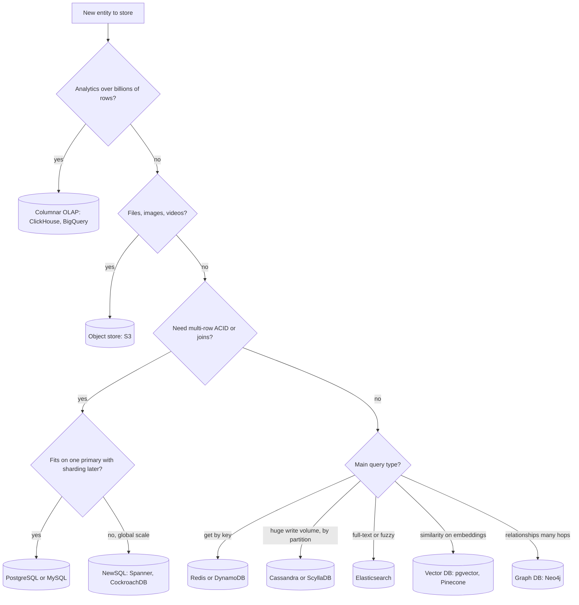
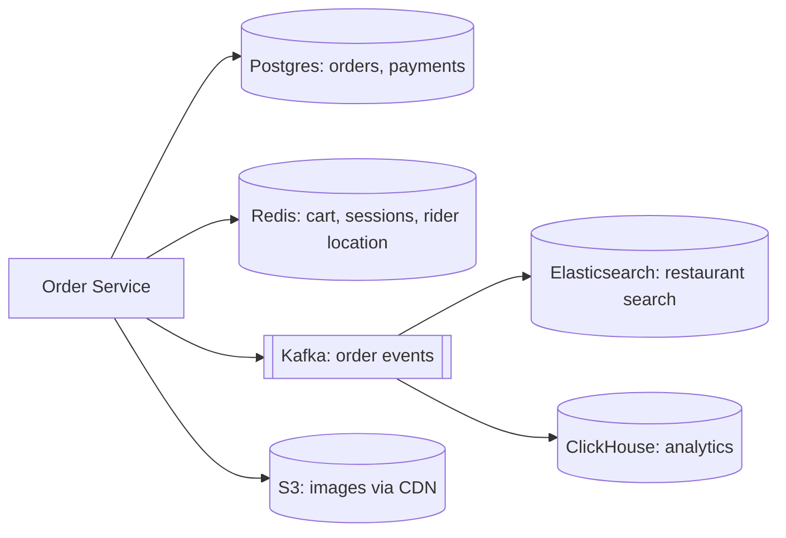

# Choosing a Database

System design interview me har design ke beech ek moment aata hai: "Data kahan rakhoge?" Yahan galat jawab ya bina reason ka jawab sabse jaldi pakda jaata hai. Ye page ek decision framework deta hai: data ka shape, query pattern, consistency need, scale aur analytics vs transactions. Isse tum har DB choice 2–3 lines me justify kar paoge.

## ⭐ 5 sawal jo DB decide karte hain

**Ek line me:** DB "popular" hone se nahi, data aur access pattern se choose hota hai.

Har entity ke liye ye 5 sawal poochho:

| Sawal | Options | Kis taraf le jaata hai |
|---|---|---|
| **Data ka shape** kya hai? | tables with relations / nested JSON / key → blob / graph / vectors / time-stamped points | relational / document / KV / graph / vector / time-series |
| **Query pattern** kya hai? | key lookup / range scan / joins + ad-hoc filters / full-text / similarity / aggregates | KV / wide-column / SQL / search / vector / columnar |
| **Consistency** kitni chahiye? | strong + multi-row transactions / eventual chalega | SQL, NewSQL / Cassandra, DynamoDB |
| **Scale** kitna hai? | GBs, hazaron QPS / TBs-PBs, lakhon writes/sec | single Postgres + replicas / sharded ya distributed DB |
| **OLTP ya OLAP?** | chhoti fast transactions / bade scans aur aggregates | row store (Postgres) / columnar (ClickHouse, BigQuery) |

Read/write ratio bhi dekho. Write-heavy (logs, chat, metrics) → LSM-tree wale DB (Cassandra, ScyllaDB). Read-heavy + complex queries → B-tree wale relational DB + cache.

**Interview tip:** Pehle access patterns likho ("user ke last 50 orders", "order by id"), phir DB bolo. Interviewer ko process dikhna chahiye, sirf naam nahi.

**Common galti:** poore system ke liye ek hi DB bol dena. Har entity alag ho sakti hai.

## ⭐ Decision flowchart

**Ek line me:** upar se neeche chalo, pehla "haan" tumhara starting point hai.

Ye flowchart sab cover nahi karta:
- **Time-stamped metrics** (CPU, latency, prices) → time-series DB (Prometheus, InfluxDB, TimescaleDB).
- **Flexible nested JSON** jahan schema har record me alag ho → document DB (MongoDB), ya Postgres JSONB.
- Shak ho to **PostgreSQL se shuru karo**. Ye relational, JSONB, full-text, pgvector, PostGIS sab thoda-thoda kar leta hai.

**Interview tip:** flowchart ko zor se mat padho. Bas bolo: "Is data pe multi-row transaction chahiye, isliye Postgres" ya "Ye pure key lookups hain, high write, isliye DynamoDB."

**Common galti:** "NoSQL scale karta hai, SQL nahi" bolna. Postgres sharding (Citus) aur read replicas ke saath bahut door jaata hai. Reason access pattern hona chahiye.

## ⭐ Cheat table: use case → DB → kyun

**Ek line me:** ye table yaad karo, 80% interview DB choices isme aa jaate hain.

| Use case | DB | Kyun |
|---|---|---|
| **Payments, wallet, ledger** (Paytm, Razorpay) | PostgreSQL / MySQL | ACID, multi-row transaction (debit + credit ek saath), constraints, audit. Paisa me eventual consistency nahi chalti |
| **Product catalog** (Flipkart) | MongoDB / Postgres JSONB + Elasticsearch for search | har category ke alag attributes (phone ka RAM, shirt ka size), nested docs; search alag index me |
| **Shopping cart** | Redis (active) + DynamoDB / Postgres (persist) | key = user_id, bahut fast read/write, TTL; checkout pe SQL me order |
| **Sessions, OTP, rate limit counters** | Redis | in-memory, TTL built-in, `INCR` atomic |
| **Chat messages** (WhatsApp, Discord) | Cassandra / ScyllaDB / HBase | huge write volume, partition = chat_id, clustering = time; "last 50 messages" ek partition scan |
| **News feed / timeline** | Redis (precomputed feed lists) + Cassandra (posts) | fan-out on write se feed ready; read O(1) |
| **Search, autocomplete** | Elasticsearch / OpenSearch | inverted index, relevance scoring, fuzzy match |
| **Metrics, monitoring** | Prometheus / InfluxDB / TimescaleDB | time-ordered writes, downsampling, retention, time-window aggregates |
| **Social graph** (followers, mutual friends) | Neo4j / adjacency in Cassandra or MySQL | multi-hop traversal; simple follow list ke liye KV/wide-column bhi chalta hai |
| **Recommendations / semantic search / RAG** | Vector DB (pgvector, Pinecone, Milvus) | embeddings pe ANN search (HNSW) |
| **Analytics, dashboards, BI** | ClickHouse / BigQuery / Redshift / Snowflake | columnar storage, compression, billions rows scan fast |
| **Files, images, videos, backups** | S3 / GCS + CDN | sasta, durable (11 nines), metadata alag DB me |
| **Inventory, seat booking** (BookMyShow) | PostgreSQL | row locks, `SELECT ... FOR UPDATE`, oversell nahi hona chahiye |
| **Ride location updates** (Uber) | Redis (GEO) / in-memory + Cassandra for history | har 4 sec update, latest location chahiye, geo query |
| **URL shortener mappings** | DynamoDB / Cassandra / Redis cache | pure key lookup, read-heavy, horizontal scale |
| **Leaderboard** | Redis Sorted Set | `ZADD`, `ZREVRANGE` O(log n) |

**Interview tip:** jab bhi DB bolo, "kyun" ke saath ek access pattern bolo: "chat ke liye Cassandra, kyunki query hamesha `chat_id` pe hai aur latest messages chahiye, partition key `chat_id`, clustering key `message_time desc`."

**Common galti:** product catalog ke liye sirf MongoDB bolna aur search bhool jaana. Catalog search hamesha Elasticsearch jaisa alag index maangta hai.

## ⭐ DB families overview

**Ek line me:** har family ek specific access pattern ke liye optimized hai; family pehchano, product baad me.

| Family | Ek line | Examples | Detail page |
|---|---|---|---|
| **Relational (SQL)** | tables + joins + ACID, default choice | PostgreSQL, MySQL | [Relational SQL](02-relational-sql.md), [Transactions](03-transactions-acid.md), [Indexes](04-indexes.md) |
| **Key-Value** | key se value, sabse fast, simple | Redis, DynamoDB, Memcached | [Key-Value](05-key-value.md) |
| **Document** | JSON documents, flexible schema, nested data | MongoDB, Firestore | [Document](06-document.md) |
| **Wide-column** | partition key + sorted rows, massive writes | Cassandra, ScyllaDB, HBase | [Wide-column](07-wide-column.md) |
| **Search** | inverted index, full-text, relevance | Elasticsearch, OpenSearch | [Search](08-search.md) |
| **Time-series** | timestamped points, retention, downsampling | Prometheus, InfluxDB, TimescaleDB | [Time-series](09-time-series.md) |
| **Graph** | nodes + edges, multi-hop queries | Neo4j, Neptune | [Graph](10-graph.md) |
| **Vector** | embeddings, nearest-neighbour search | Pinecone, Milvus, pgvector | [Vector](11-vector.md) |
| **Columnar / OLAP** | column-wise storage, analytics scans | ClickHouse, BigQuery, Snowflake | [Columnar / OLAP](12-columnar-olap.md) |
| **NewSQL** | SQL + ACID + horizontal scale | Spanner, CockroachDB, TiDB, YugabyteDB | [NewSQL](13-newsql.md) |
| **Object store** | files/blobs by key, cheap and durable | S3, GCS, Azure Blob | [Object Storage](15-object-storage.md) |

Scaling (replication, sharding, partitioning) ke liye [Scaling Databases](14-scaling-databases.md), aur last-minute revision ke liye [Database Interview Rapid-fire](16-interview-qa.md).

### Storage engine ka asar

| Engine | Kaun use karta hai | Achha kis me | Kamzor kis me |
|---|---|---|---|
| **B-tree** | Postgres, MySQL InnoDB, MongoDB WiredTiger | reads, range queries, in-place update | random heavy writes (page splits, random IO) |
| **LSM-tree** | Cassandra, ScyllaDB, RocksDB, HBase | write-heavy (sequential append) | reads ko multiple SSTables check karne padte (bloom filters help) |

**Interview tip:** "Cassandra write me fast kyun?" Write pehle commit log (append) aur memtable (memory) me jaata hai, baad me SSTable flush. Koi random disk seek nahi.

**Common galti:** document DB aur KV ko same samajhna. Document DB andar ke fields pe query aur index kar sakta hai; pure KV sirf key se.

## ⭐ SQL vs NoSQL: seedha comparison

**Ek line me:** SQL = structure + transactions + flexible queries; NoSQL = specific access pattern pe horizontal scale.

| Point | SQL (Postgres/MySQL) | NoSQL (Dynamo/Cassandra/Mongo) |
|---|---|---|
| Schema | fixed, migrations | flexible / schema-on-read |
| Queries | ad-hoc, joins, aggregates | mostly key / partition based, joins nahi |
| Transactions | multi-row ACID | single item/partition (kuch me limited multi-doc) |
| Scale | vertical + read replicas, sharding manual | horizontal built-in |
| Consistency | strong by default | tunable / eventual by default |
| Data modeling | entities pehle, queries baad me | queries pehle, table unke hisaab se |

Detail: [SQL vs NoSQL](../01-topics/02-sql-vs-nosql.md), [CAP & Consistency](../01-topics/06-cap-consistency.md).

**Interview tip:** NoSQL me "query-first modeling" bolo. Cassandra/DynamoDB me ek query = ek table design. Naya query pattern aaya to naya table ya GSI.

**Common galti:** NoSQL ko "schema-less" bolke modeling skip karna. Schema app code me shift hota hai, khatam nahi hota.

## ⭐ Polyglot persistence

**Ek line me:** ek system me alag-alag data ke liye alag DB use karna, har ek apne kaam ka best.

> **Example:** Swiggy order flow. Orders aur payments Postgres me (ACID). Restaurant + dish search Elasticsearch me. Delivery partner ki live location Redis GEO me. Order events Kafka se ClickHouse me analytics ke liye. Dish images S3 + CDN pe.

**Sync kaise rakhein:**
- **Source of truth ek rakho** (yahan Postgres). Baaki derived stores hain.
- **CDC (Change Data Capture)**: Debezium Postgres WAL padh ke Kafka me events daalta hai, consumers ES/ClickHouse update karte hain.
- **Outbox pattern**: same transaction me outbox table me event likho, relay usse Kafka pe bhejta hai. Dual-write ka problem khatam. Detail: [Distributed transactions](../01-topics/16-distributed-transactions.md).

**Kimat (tradeoffs):**
- Har naya DB = naya ops burden (backup, monitoring, on-call, upgrades).
- Derived stores eventually consistent hote hain (search me naya restaurant 1–2 sec baad dikhega).
- Team ko har DB ki expertise chahiye.

**Interview tip:** bolo "Postgres source of truth hai, Elasticsearch aur ClickHouse CDC se derived hain, isliye unka thoda lag acceptable hai."

**Common galti:** app se dono DBs me direct likhna (dual write). Ek fail hua to data mismatch. CDC ya outbox use karo.

## ⭐ Interview me DB choice kaise justify karein (ready script)

**Ek line me:** access pattern → requirement → DB → tradeoff → mitigation, is order me bolo.

Template:

> "**[Entity]** ke liye main access patterns hain: **[pattern 1]**, **[pattern 2]**. Isme **[requirement: ACID / high write / full-text / low latency]** chahiye. Isliye main **[DB]** lunga, kyunki **[ek technical reason]**. Tradeoff ye hai ki **[weakness]**, jise main **[mitigation]** se handle karunga."

**Example 1 (BookMyShow seats):**
> "Seat booking ke main patterns hain: show ke saare seats padhna aur 2–6 seats atomically book karna. Double booking bilkul nahi honi chahiye, to strong consistency aur transactions chahiye. Isliye PostgreSQL, `SELECT ... FOR UPDATE` row lock ke saath. Tradeoff: single primary pe write limit. Shows ko `city_id` se shard karke aur seat map Redis me cache karke handle karunga."

**Example 2 (WhatsApp messages):**
> "Messages ka pattern hai: write bahut zyada (billions/day), aur read hamesha ek chat ke latest messages. Cross-chat joins nahi chahiye. Isliye Cassandra: partition key `chat_id`, clustering key `message_id` (time-sortable) desc. LSM-tree write ke liye fast hai. Tradeoff: eventual consistency aur ad-hoc queries nahi. Quorum (`LOCAL_QUORUM`) reads/writes se consistency theek rahegi."

**Example 3 (URL shortener):**
> "Pure key lookup: `short_code → long_url`, 100:1 read-write. Joins ya transactions nahi. DynamoDB ya Cassandra, partition key `short_code`, aage Redis cache. Tradeoff: analytics queries mushkil, uske liye click events Kafka se ClickHouse me."

Related questions: [URL Shortener](../02-questions/t1-01-url-shortener.md), [WhatsApp Chat](../02-questions/t1-04-whatsapp-chat.md), [BookMyShow](../02-questions/t1-05-bookmyshow.md), [Payment System](../02-questions/t1-11-payment-system.md), [Food Delivery](../02-questions/t2-14-food-delivery.md), [Ad Click Aggregator](../02-questions/t2-17-ad-click-aggregator.md), [E-commerce Inventory](../02-questions/t2-24-ecommerce-inventory.md).

**Interview tip:** tradeoff khud bolo, interviewer ke poochne se pehle. Isse seniority dikhti hai.

**Common galti:** sirf DB ka naam bol ke aage badh jaana. Bina "kyun" ke DB choice ka koi point nahi milta.

## ⭐ Common galtiyan (DB choice me)

**Ek line me:** zyada tar galtiyan "trendy" choice aur access pattern ignore karne se aati hain.

| Galti | Kya problem hai | Sahi soch |
|---|---|---|
| **"Scale ke liye NoSQL"** bina numbers ke | 1000 QPS ke liye Cassandra = bina zarurat complexity, transactions gaye | estimation karo; Postgres + replicas lakhon reads/sec tak jaata hai |
| Payments ke liye eventual-consistent store | double debit, lost money | ACID DB, idempotency key, ledger |
| MongoDB "kyunki schema nahi pata" | schema app me bikhra, joins app me | pehle core entities define karo; flexible part JSONB me |
| Analytics queries primary OLTP DB pe | heavy scans se production slow | read replica ya columnar warehouse |
| Elasticsearch ko source of truth banana | ES durability aur transactions ke liye nahi bana | primary DB + CDC se ES |
| Images/videos DB me BLOB | DB bloat, backups slow, mehnga | S3 me file, DB me sirf URL/metadata |
| Har service ka alag DB family bina reason | ops nightmare | 2–3 well-known stores, jab tak strong reason na ho |
| Cache ko DB samajhna | Redis restart pe data loss (config pe depend) | Redis cache/ephemeral; durable data DB me |
| Hot partition ignore karna | ek celebrity/IPL match ki key pe saara load | partition key me high cardinality, salting |

**Interview tip:** agar interviewer pooche "Cassandra kyun nahi?", to numbers aur pattern se jawab do: "Hamara write volume 2K/sec hai aur hume multi-row transactions chahiye. Postgres ye aaram se karega, Cassandra me transactions khone padenge."

**Common galti:** interviewer ke challenge pe turant DB badal dena. Apne reason pe tike raho, ya naye requirement ke saath clearly badlo.

## Scale ke rough numbers (DB choice ke liye)

**Ek line me:** estimation ke numbers hi batate hain ki single Postgres kaafi hai ya distributed DB chahiye.

| Store | Rough capacity (ek node, achhe hardware pe) | Kab limit aati hai |
|---|---|---|
| PostgreSQL / MySQL | ~10K–50K simple writes/sec, reads replicas se lakhon/sec, few TB comfortable | write-heavy + multi-TB, tab sharding (Citus, Vitess) |
| Redis | ~1 lakh+ ops/sec per node, data RAM tak | RAM se bada data, tab Redis Cluster |
| Cassandra / ScyllaDB | ~10K–1 lakh+ writes/sec per node, linear scale | hot partitions, wide partitions (100MB+) |
| DynamoDB | practically unlimited, per partition ~1000 WCU / 3000 RCU | hot key |
| Elasticsearch | indexing ~10K docs/sec per node, shard ~10–50 GB | bahut zyada shards, deep pagination |
| ClickHouse | billions rows/sec scan | high-QPS point lookups (ye uska kaam nahi) |

Numbers ki detail: [Numbers cheatsheet](../01-topics/21-numbers-cheatsheet.md), scaling: [Scaling basics](../01-topics/01-scaling-basics.md), sharding: [Sharding & consistent hashing](../01-topics/04-sharding-consistent-hashing.md).

**Rule of thumb:**
1. Writes < 10K/sec aur data < 1–2 TB → ek Postgres primary + replicas + cache.
2. Reads bahut zyada → read replicas + Redis cache, DB same.
3. Writes lakhon/sec, simple key pattern → Cassandra / DynamoDB.
4. Writes zyada + transactions bhi chahiye → shard Postgres (Citus/Vitess) ya NewSQL.

**Interview tip:** estimation step ka number DB choice me wapas use karo: "Humne 5K writes/sec nikala, ye ek Postgres primary aaram se handle karega."

**Common galti:** estimation karke numbers ko DB choice me use hi na karna.

## Poora walkthrough: Uber jaisa ride app

**Ek line me:** ek hi system me har entity ka DB alag reason se aata hai.

| Entity | Access pattern | DB | Reason |
|---|---|---|---|
| Users, drivers profile | get by id, update kabhi-kabhi | Postgres | relational, chhota data |
| Trips | create, status update, user ki trip history | Postgres (shard by city) | trip + payment ek transaction, history by `user_id` index |
| Driver live location | har 4 sec write, nearby drivers query | Redis GEO | in-memory, `GEOSEARCH`, purani value ka koi kaam nahi |
| Location history | billions writes, trip ke liye replay | Cassandra | partition `trip_id`, time-ordered |
| Payments | debit/credit, idempotent | Postgres | ACID ledger |
| Surge / analytics | city-wise aggregates | ClickHouse via Kafka | columnar scans |
| Receipts, documents | files | S3 | sasta, durable |

Related: [Uber](../02-questions/t1-06-uber.md), [Geospatial](../01-topics/13-geospatial.md).

**Interview tip:** design me DB table bana ke dikhao (entity | DB | reason). Interviewer ko ek nazar me poori picture mil jaati hai.

**Common galti:** location updates ko Postgres me har 4 sec UPDATE karna. Lakhon drivers pe write load aur dead tuples ka bloat aata hai.

## Kab kaun sa DB nahi lena

**Ek line me:** har DB ka "mat lo" case bhi pata hona chahiye.

- **Postgres/MySQL mat lo** jab: write volume lakhon/sec ho aur pattern simple key/partition based ho, ya data PB scale analytics ho.
- **Redis mat lo** jab: data RAM se bada ho aur durability critical ho.
- **Cassandra mat lo** jab: ad-hoc queries, joins, ya multi-row transactions chahiye; ya write volume kam hai.
- **MongoDB mat lo** jab: data highly relational hai (many-to-many) aur strong cross-document transactions har jagah chahiye.
- **Elasticsearch mat lo** jab: primary storage chahiye ya strong consistency chahiye.
- **Graph DB mat lo** jab: sirf 1-hop query hai (followers list) — adjacency table kaafi hai.
- **Vector DB alag mat lo** jab: vectors kuch million hi hain aur Postgres pehle se hai — pgvector kaafi hai.

**Interview tip:** "Why not X?" ka jawab ready rakho kam se kam ek alternative ke liye.

**Common galti:** alternatives ka zikr hi na karna. Ek line "X bhi option tha, par Y ki wajah se nahi liya" bahut value deta hai.

## Interview me bolo

- "Main pehle har entity ke access patterns list karta hoon, phir DB choose karta hoon. Default Postgres hai jab tak koi strong reason na ho."
- "Source of truth Postgres hai; search aur analytics CDC se derived stores hain, unme thoda lag acceptable hai."

## Checklist

- [ ] Data shape, query pattern, consistency, scale aur OLTP vs OLAP ke 5 sawal se DB choose kar sakta hoon
- [ ] Payments, chat, catalog, cart, search, metrics, analytics, files ke liye DB aur reason bata sakta hoon
- [ ] Har DB family (relational se object store tak) ek line me samjha sakta hoon
- [ ] B-tree vs LSM-tree ka fark aur kis workload pe kaun better hai bata sakta hoon
- [ ] Polyglot persistence me source of truth, CDC aur outbox samjha sakta hoon
- [ ] Access pattern → requirement → DB → tradeoff wali script se DB choice justify kar sakta hoon
- [ ] "Scale ke liye NoSQL" jaisi common galtiyan aur unka sahi jawab bata sakta hoon
