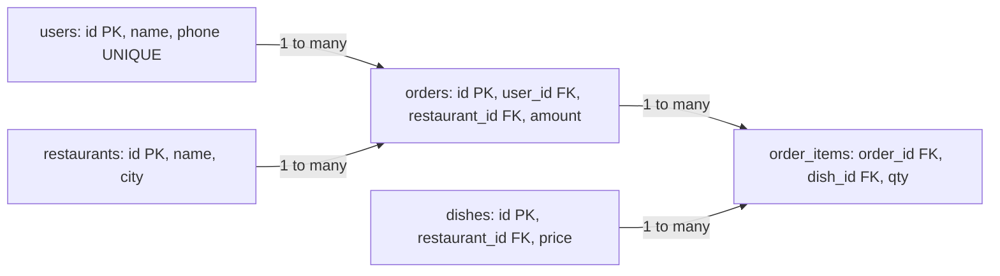
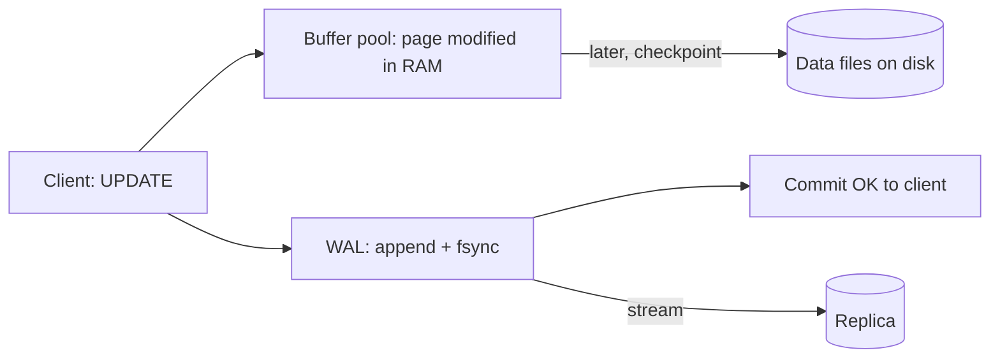

# Relational Databases: PostgreSQL & MySQL

Relational DB = data tables me, tables keys se jude hue, aur SQL se koi bhi query. System design me ye **default choice** hai, aur SDE interviews me SQL queries (2nd highest salary, top N per group) seedhe likhwaye jaate hain. Ye page tables se leke Postgres vs MySQL aur storage internals tak cover karta hai.

## ⭐ Tables, keys aur constraints

**Ek line me:** table = rows aur columns; keys rows ko uniquely pehchanti hain aur tables ko jodti hain; constraints galat data ko DB level pe hi rok dete hain.

| Concept | Matlab | Example |
|---|---|---|
| **Primary key (PK)** | har row ka unique, NOT NULL id | `orders.id` |
| **Foreign key (FK)** | dusri table ki PK ko point karta hai, referential integrity | `orders.user_id → users.id` |
| **Unique** | column me duplicate nahi | `users.phone` |
| **NOT NULL** | value zaroori | `orders.amount` |
| **CHECK** | custom rule | `CHECK (amount > 0)` |
| **DEFAULT** | value na di to ye | `status DEFAULT 'PLACED'` |
| **Composite key** | 2+ columns milke unique | `(order_id, item_id)` |
| **Surrogate vs natural key** | auto id vs business value (PAN, email) | surrogate prefer karo, natural pe UNIQUE lagao |



**Relationships:**
- **1:1** user ↔ user_profile (FK + UNIQUE).
- **1:N** user → orders (FK on many side).
- **M:N** orders ↔ dishes, beech me **junction table** `order_items`.

**Interview tip:** "PK ke liye auto-increment ya UUID?" Single DB me `BIGINT` identity (chhota, index friendly). Distributed me UUIDv7 / Snowflake (time-sortable, B-tree me random insert nahi). Detail: [Unique ID generation](../01-topics/17-unique-id-generation.md).

**Common galti:** random UUIDv4 ko PK banana bina soche. B-tree me random inserts se page splits aur cache misses badhte hain.

## ⭐ Normalization: 1NF se 3NF

**Ek line me:** normalization = data ko aise todna ki har fact ek hi jagah ho, taaki update anomalies na aayein.

**Shuru ki bad table:**

| order_id | customer | customer_phone | items | restaurant | restaurant_city |
|---|---|---|---|---|---|
| 1 | Rahul | 98xxx | "Dosa, Idli" | MTR | Bangalore |
| 2 | Rahul | 98xxx | "Vada" | MTR | Bangalore |

Problems: phone do jagah (update anomaly), items ek string me, restaurant city repeat.

| Form | Rule | Fix |
|---|---|---|
| **1NF** | har cell atomic, repeating groups nahi | `items` ko alag rows me: `order_items(order_id, item)` |
| **2NF** | 1NF + koi non-key column composite key ke **hisse** pe depend na kare (partial dependency nahi) | `order_items(order_id, dish_id, qty)` me dish ka price `dishes` table me, kyunki price sirf `dish_id` pe depend karta hai |
| **3NF** | 2NF + non-key column dusre non-key column pe depend na kare (transitive dependency nahi) | `restaurant_city` restaurant pe depend karta hai, order pe nahi → `restaurants` table me |
| **BCNF** | har determinant ek candidate key ho | 3NF ka strict version; interview me naam pata hona kaafi |

Yaad rakhne ki line: **"The key, the whole key, and nothing but the key."**

### Kab denormalize karna hai

- **Read-heavy** aur join mehnga (feed, order history page): `orders` me `restaurant_name` copy kar lo.
- **Historical value** chahiye: order ke time ka price `order_items.price` me save karo, warna menu price badla to purana bill badal jaayega. (Ye asal me denormalization nahi, alag fact hai.)
- **Counters**: `posts.like_count` rakho, har baar `COUNT(*)` mat karo.
- **Analytics**: star schema, wide fact tables.

Kimat: write pe sab copies update karni padti hain (trigger, app code, ya async event).

**Interview tip:** "Normalize by default, denormalize for specific read paths, aur denormalized copy ka update path batao."

**Common galti:** order me price ko `dishes` table se join karke dikhana. Price badla to purane orders galat ho jaayenge.

## ⭐ Joins

**Ek line me:** join do tables ki rows ko ek condition pe jodta hai.

Example data: `users(1 Rahul, 2 Priya, 3 Amit)`, `orders(101 user 1, 102 user 1, 103 user 2, 104 user 9)`.

| Join | Kya deta hai | Result example |
|---|---|---|
| **INNER JOIN** | sirf matching rows dono taraf | Rahul-101, Rahul-102, Priya-103 |
| **LEFT JOIN** | left ki saari rows, right match nahi to NULL | upar wale + Amit-NULL |
| **RIGHT JOIN** | right ki saari rows | upar ke 3 + NULL-104 |
| **FULL OUTER JOIN** | dono ki saari rows | sab + Amit-NULL + NULL-104 (MySQL me nahi, UNION se banao) |
| **CROSS JOIN** | har pair (cartesian) | 3 × 4 = 12 rows |
| **SELF JOIN** | table khud se | employee → manager |
| **Anti join** | left ki woh rows jinka match nahi | `LEFT JOIN ... WHERE o.id IS NULL` ya `NOT EXISTS` → Amit |

```sql
-- Jin users ne kabhi order nahi kiya (anti join)
SELECT u.id, u.name
FROM users u
LEFT JOIN orders o ON o.user_id = u.id
WHERE o.id IS NULL;

-- Same with NOT EXISTS (NULL-safe, aksar better plan)
SELECT u.id, u.name
FROM users u
WHERE NOT EXISTS (SELECT 1 FROM orders o WHERE o.user_id = u.id);

-- Self join: employee aur uska manager
SELECT e.name AS employee, m.name AS manager
FROM employees e
LEFT JOIN employees m ON m.id = e.manager_id;
```

**Join algorithms (EXPLAIN me dikhte hain):**
- **Nested loop**: chhoti outer table, inner pe index. Small result ke liye best.
- **Hash join**: chhoti table ka hash table, badi ko scan. Equality join, bade data.
- **Merge join**: dono sorted (index se), merge. Bade sorted inputs.

**Interview tip:** `NOT IN (subquery)` me agar subquery me ek bhi NULL hua to result empty. `NOT EXISTS` use karo.

**Common galti:** LEFT JOIN ke baad right table ki condition `WHERE` me lagana (`WHERE o.status = 'PAID'`). Ye LEFT JOIN ko INNER bana deta hai. Condition `ON` me daalo.

## ⭐ Important SQL commands

**Ek line me:** ye commands interview aur roz ke kaam ka 90% hain.

| Command | Kya karta hai | Example |
|---|---|---|
| `SELECT ... WHERE` | rows filter | `SELECT * FROM orders WHERE status = 'PAID'` |
| `GROUP BY` | group karke aggregate | `SELECT user_id, COUNT(*) FROM orders GROUP BY user_id` |
| `HAVING` | aggregate ke baad filter | `... GROUP BY user_id HAVING COUNT(*) > 5` |
| `ORDER BY` | sort | `ORDER BY created_at DESC` |
| `LIMIT / OFFSET` | page | `LIMIT 20 OFFSET 40` (deep page pe slow) |
| Keyset pagination | last seen value se aage | `WHERE id < 9876 ORDER BY id DESC LIMIT 20` |
| `JOIN` | tables jodo | `FROM orders o JOIN users u ON u.id = o.user_id` |
| `INSERT` | naya row | `INSERT INTO users(name, phone) VALUES ('Rahul', '98xxx')` |
| UPSERT (Postgres) | hai to update, nahi to insert | `INSERT ... ON CONFLICT (phone) DO UPDATE SET name = EXCLUDED.name` |
| UPSERT (MySQL) | same | `INSERT ... ON DUPLICATE KEY UPDATE name = VALUES(name)` |
| `UPDATE` | change | `UPDATE orders SET status = 'DELIVERED' WHERE id = 101` |
| `DELETE` | hatao | `DELETE FROM sessions WHERE expires_at < now()` |
| `RETURNING` (Postgres) | changed row wapas do | `UPDATE ... RETURNING id, status` |
| `ROW_NUMBER()` | har partition me 1,2,3... | `ROW_NUMBER() OVER (PARTITION BY city ORDER BY rating DESC)` |
| `RANK()` / `DENSE_RANK()` | ties ke saath rank (1,1,3 / 1,1,2) | `DENSE_RANK() OVER (ORDER BY salary DESC)` |
| `LAG()` / `LEAD()` | pichhli / agli row ki value | `LAG(amount) OVER (PARTITION BY user_id ORDER BY created_at)` |
| `SUM() OVER` | running total | `SUM(amount) OVER (ORDER BY day)` |
| CTE `WITH` | named subquery, readable | `WITH paid AS (SELECT ...) SELECT ... FROM paid` |
| Recursive CTE | tree/hierarchy | `WITH RECURSIVE chain AS (...)` |
| `EXPLAIN ANALYZE` | actual plan + timing | `EXPLAIN ANALYZE SELECT ...` |
| `CREATE INDEX` | index banao | `CREATE INDEX idx_orders_user ON orders(user_id, created_at DESC)` |
| `CREATE INDEX CONCURRENTLY` (Postgres) | bina table lock ke index | production me yahi use karo |

**SQL execution order** (likhne ka order alag hai):
`FROM/JOIN → WHERE → GROUP BY → HAVING → SELECT → window functions → DISTINCT → ORDER BY → LIMIT`.
Isliye `WHERE` me SELECT ka alias ya window function use nahi kar sakte.

### OFFSET vs keyset pagination

```sql
-- OFFSET: DB ko 100000 rows padh ke phenkni padti hain
SELECT id, amount FROM orders
WHERE user_id = 42
ORDER BY created_at DESC, id DESC
LIMIT 20 OFFSET 100000;

-- Keyset (cursor): index se seedha sahi jagah, har page O(log n + 20)
SELECT id, amount, created_at FROM orders
WHERE user_id = 42
  AND (created_at, id) < ('2026-09-01 10:00:00', 98765)   -- pichhle page ka last row
ORDER BY created_at DESC, id DESC
LIMIT 20;
```

Keyset fast hai aur naye inserts se rows skip/duplicate nahi hoti. Kami: "page 57 pe jump" nahi kar sakte. Feeds aur infinite scroll ke liye keyset hi use hota hai. Detail: [API design](../01-topics/19-api-design.md).

**Interview tip:** "WHERE vs HAVING?" WHERE rows ko group se pehle filter karta hai (index use ho sakta hai), HAVING groups ko baad me.

**Common galti:** `SELECT *` production me. Extra columns, covering index ka fayda khatam, schema change pe app toot sakta hai.

## ⭐ Realistic example: Swiggy orders schema + queries

**Ek line me:** ek chhota but real schema, aur woh queries jo interviewer ya product team poochti hai.

```sql
CREATE TABLE users (
  id          BIGINT GENERATED ALWAYS AS IDENTITY PRIMARY KEY,
  name        TEXT NOT NULL,
  phone       TEXT NOT NULL UNIQUE,
  created_at  TIMESTAMPTZ NOT NULL DEFAULT now()
);

CREATE TABLE restaurants (
  id     BIGINT GENERATED ALWAYS AS IDENTITY PRIMARY KEY,
  name   TEXT NOT NULL,
  city   TEXT NOT NULL,
  rating NUMERIC(2,1) CHECK (rating BETWEEN 0 AND 5)
);

CREATE TABLE orders (
  id             BIGINT GENERATED ALWAYS AS IDENTITY PRIMARY KEY,
  user_id        BIGINT NOT NULL REFERENCES users(id),
  restaurant_id  BIGINT NOT NULL REFERENCES restaurants(id),
  status         TEXT NOT NULL DEFAULT 'PLACED'
                 CHECK (status IN ('PLACED','PREPARING','OUT_FOR_DELIVERY','DELIVERED','CANCELLED')),
  amount         NUMERIC(10,2) NOT NULL CHECK (amount > 0),
  idempotency_key TEXT UNIQUE,              -- retry pe duplicate order nahi
  created_at     TIMESTAMPTZ NOT NULL DEFAULT now()
);

CREATE TABLE order_items (
  order_id  BIGINT NOT NULL REFERENCES orders(id) ON DELETE CASCADE,
  dish_id   BIGINT NOT NULL,
  qty       INT NOT NULL CHECK (qty > 0),
  price     NUMERIC(10,2) NOT NULL,          -- order ke time ka price
  PRIMARY KEY (order_id, dish_id)
);

-- "Meri orders" page: user ke latest orders
CREATE INDEX idx_orders_user_time ON orders (user_id, created_at DESC);
-- Restaurant dashboard: active orders
CREATE INDEX idx_orders_rest_active ON orders (restaurant_id)
  WHERE status IN ('PLACED','PREPARING');   -- partial index
```

```sql
-- 1. User ke last 10 orders, restaurant naam ke saath
SELECT o.id, r.name, o.amount, o.status, o.created_at
FROM orders o
JOIN restaurants r ON r.id = o.restaurant_id
WHERE o.user_id = 42
ORDER BY o.created_at DESC
LIMIT 10;

-- 2. Har city ka pichhle 7 din ka revenue, sirf 1 lakh se upar wali cities
SELECT r.city, SUM(o.amount) AS revenue, COUNT(*) AS orders
FROM orders o
JOIN restaurants r ON r.id = o.restaurant_id
WHERE o.status = 'DELIVERED'
  AND o.created_at >= now() - INTERVAL '7 days'
GROUP BY r.city
HAVING SUM(o.amount) > 100000
ORDER BY revenue DESC;

-- 3. Har city ke top 3 restaurants by orders (top N per group)
WITH counts AS (
  SELECT r.city, r.id, r.name, COUNT(*) AS n
  FROM orders o JOIN restaurants r ON r.id = o.restaurant_id
  GROUP BY r.city, r.id, r.name
),
ranked AS (
  SELECT *, ROW_NUMBER() OVER (PARTITION BY city ORDER BY n DESC) AS rn
  FROM counts
)
SELECT city, name, n FROM ranked WHERE rn <= 3;

-- 4. Har user ke order ke beech ka gap (repeat behaviour)
SELECT user_id, id, created_at,
       created_at - LAG(created_at) OVER (PARTITION BY user_id ORDER BY created_at) AS gap
FROM orders;

-- 5. Idempotent order create (retry safe)
INSERT INTO orders (user_id, restaurant_id, amount, idempotency_key)
VALUES (42, 7, 349.00, 'req-7f3a')
ON CONFLICT (idempotency_key) DO NOTHING
RETURNING id;
```

Related: [Food Delivery](../02-questions/t2-14-food-delivery.md), [Idempotency](../01-topics/10-idempotency-retries.md).

**Interview tip:** schema likhte waqt har index ke saath batao kaunsi query use karegi. "Index without a query" = waste of writes.

**Common galti:** paise ke liye `FLOAT`/`DOUBLE`. Rounding errors aate hain. `NUMERIC(10,2)` ya paise ko integer paise (cents) me rakho.

## ⭐ PostgreSQL vs MySQL

**Ek line me:** dono mature aur fast hain; Postgres features aur correctness me aage, MySQL simple ops aur read-heavy web workloads me popular.

| Point | PostgreSQL | MySQL (InnoDB) |
|---|---|---|
| **MVCC** | purana row version table me hi rehta (dead tuples), `VACUUM` saaf karta hai | undo log me purane versions, purge thread saaf karta hai |
| **Default isolation** | Read Committed | Repeatable Read |
| **Table storage** | heap (rows kisi bhi order me), indexes alag | clustered index: rows PK order me B-tree me hi stored |
| **Secondary index** | heap me row ka pointer (ctid) | PK value store karta hai, isliye do lookups |
| **JSON** | `JSONB` binary, GIN index, powerful operators | `JSON` type, generated columns pe index |
| **Extensions** | bahut: PostGIS, pgvector, TimescaleDB, Citus, pg_trgm | kam |
| **Index types** | B-tree, Hash, GIN, GiST, BRIN, partial, expression | mostly B-tree, full-text, spatial; functional index (8.0+) |
| **Replication** | streaming (WAL based, physical), logical replication | binlog based (row/statement), semi-sync, Group Replication |
| **Upsert** | `ON CONFLICT` | `ON DUPLICATE KEY UPDATE` |
| **DDL in transaction** | haan, rollback ho sakta | mostly nahi (implicit commit) |
| **Connections** | process per connection, PgBouncer chahiye | thread per connection, zyada connections handle |
| **Sharding tools** | Citus | Vitess (YouTube, Slack), ProxySQL |
| **Kaun use karta** | Instagram (shuru me), Zerodha, Swiggy ke kai services | Facebook, Uber (Schemaless ke neeche), Flipkart, GitHub |

**Postgres choose karo** jab complex queries, JSONB, geo (PostGIS), vectors, strict correctness chahiye.
**MySQL choose karo** jab simple read-heavy OLTP, team ka experience, Vitess se massive sharding chahiye.

**Interview tip:** "Postgres me UPDATE heavy table slow kyun ho jaata hai?" Har UPDATE naya tuple version banata hai; purana dead tuple vacuum tak padha rehta hai (bloat). Autovacuum tune karo, HOT updates ke liye `fillfactor` kam karo.

**Common galti:** sochna MySQL me PK sirf ek constraint hai. InnoDB me PK hi data ka physical order hai; random PK se insert slow.

## ⭐ Storage basics: pages aur WAL

**Ek line me:** data disk pe fixed-size pages me rehta hai, aur har change pehle WAL (log) me likha jaata hai taaki crash ke baad recover ho sake.

- **Page / block**: Postgres 8 KB, InnoDB 16 KB. DB disk se pura page padhta hai, ek row nahi. Isliye related rows paas hon to fast.
- **Buffer pool / shared buffers**: hot pages RAM me cache. Hit ratio 99%+ chahiye.
- **B-tree index**: pages ka tree; root → internal → leaf. 3–4 levels me crores rows. Detail: [Indexes](04-indexes.md).
- **WAL (Write-Ahead Log)** (MySQL me redo log): change pehle sequential log me, `fsync`, phir commit OK. Data pages baad me lazily flush (checkpoint).
  - Crash hua to WAL replay karke data pages theek.
  - Sequential write = fast; random page writes baad me batch me.
  - Replication bhi WAL ship karke hoti hai (Postgres streaming replication).
  - CDC tools (Debezium) bhi WAL / binlog padhte hain.
- **Checkpoint**: dirty pages disk pe flush, purana WAL recycle.



**Interview tip:** "Commit ke baad crash hua to data kaise bacha?" WAL me record fsync ho chuka tha; restart pe redo. Yahi ACID ka **D** hai. Detail: [Transactions & ACID](03-transactions-acid.md).

**Common galti:** sochna commit pe data file update hoti hai. Sirf WAL flush hota hai.

## ⭐ Kab SQL right default hai

**Ek line me:** jab tak strong reason na ho, relational DB se shuru karo.

**Use karo jab:**
- Data relational hai (users, orders, payments) aur joins chahiye.
- Transactions / invariants chahiye (balance negative na ho, seat double na bike).
- Queries ad-hoc ya badalti rehti hain (product team nayi reports maangti hai).
- Scale "normal" hai: TBs tak, hazaron writes/sec. Replicas + cache + partitioning se bahut door.

**Mat use karo (ya saath me kuch aur) jab:**
- Lakhon writes/sec simple key pattern (chat, IoT, logs) → Cassandra/DynamoDB.
- Full-text relevance search → Elasticsearch.
- PB scale analytics → columnar warehouse.
- Ultra-low latency cache → Redis.

**Scale karne ki seedhi:** indexes → query tuning → connection pooling (PgBouncer) → cache (Redis) → read replicas → partitioning (table partitions by date) → sharding (Citus/Vitess) → NewSQL. Detail: [Scaling Databases](14-scaling-databases.md), [Indexing & replication](../01-topics/03-indexing-replication.md).

Kin questions me: [Payment System](../02-questions/t1-11-payment-system.md), [BookMyShow](../02-questions/t1-05-bookmyshow.md), [E-commerce Inventory](../02-questions/t2-24-ecommerce-inventory.md), [Job Scheduler](../02-questions/t2-18-job-scheduler.md), [Flash Sale](../02-questions/t2-15-flash-sale.md).

**Interview tip:** bolo "Main Postgres se shuru karunga; jab write throughput limit aayegi tab `user_id` se shard karunga." Ye realistic aur senior lagta hai.

**Common galti:** pehle din se sharding design karna jab estimation ek node bata raha hai.

## ⭐ Classic interview SQL questions

**Ek line me:** ye 6 queries almost har SQL round me aati hain; window functions se sab clean ban jaati hain.

Table: `employees(id, name, salary, dept_id, manager_id)`.

```sql
-- 1. Second highest salary (NULL agar nahi hai)
SELECT MAX(salary) AS second_highest
FROM employees
WHERE salary < (SELECT MAX(salary) FROM employees);

-- 1b. Nth highest (N = 3), ties ko ek maan ke
SELECT DISTINCT salary
FROM (SELECT salary, DENSE_RANK() OVER (ORDER BY salary DESC) AS rnk
      FROM employees) t
WHERE rnk = 3;

-- 2. Har department ke top 2 earners
SELECT dept_id, name, salary
FROM (SELECT dept_id, name, salary,
             DENSE_RANK() OVER (PARTITION BY dept_id ORDER BY salary DESC) AS rnk
      FROM employees) t
WHERE rnk <= 2;

-- 3. Duplicate emails dhoondo
SELECT email, COUNT(*) FROM users
GROUP BY email
HAVING COUNT(*) > 1;

-- 3b. Duplicates delete karo, sabse chhoti id rakho
DELETE FROM users u
USING users d
WHERE u.email = d.email AND u.id > d.id;          -- Postgres syntax

-- 4. Employees jo apne manager se zyada kamaate hain
SELECT e.name
FROM employees e JOIN employees m ON m.id = e.manager_id
WHERE e.salary > m.salary;

-- 5. Har department ki salary department avg se upar wale
SELECT name, dept_id, salary
FROM (SELECT *, AVG(salary) OVER (PARTITION BY dept_id) AS dept_avg
      FROM employees) t
WHERE salary > dept_avg;

-- 6. Consecutive 3 din login karne wale users (gaps and islands)
SELECT DISTINCT user_id
FROM (SELECT user_id, login_date,
             login_date - (ROW_NUMBER() OVER (PARTITION BY user_id ORDER BY login_date))::int AS grp
      FROM (SELECT DISTINCT user_id, login_date FROM logins) d) t
GROUP BY user_id, grp
HAVING COUNT(*) >= 3;
```

| Function | Ties pe | 100, 90, 90, 80 ka result |
|---|---|---|
| `ROW_NUMBER()` | unique number, tie random order | 1, 2, 3, 4 |
| `RANK()` | same rank, gap | 1, 2, 2, 4 |
| `DENSE_RANK()` | same rank, no gap | 1, 2, 2, 3 |

**Interview tip:** "Top N per group" ka jawab hamesha window function + outer filter. Window function `WHERE` me direct nahi chalti, isliye subquery/CTE.

**Common galti:** 2nd highest ke liye `ORDER BY salary DESC LIMIT 1 OFFSET 1`. Top salary do logon ki ho to galat answer (ties). `DENSE_RANK` ya `MAX < MAX` use karo.

## Interview me bolo

- "Normalize karke shuru karta hoon, aur sirf hot read paths pe denormalize karta hoon, update path ke saath."
- "Pagination keyset se karunga, OFFSET deep pages pe O(offset) hai."

## Checklist

- [ ] PK, FK, UNIQUE, CHECK constraints aur 1:N / M:N relationships schema me dikha sakta hoon
- [ ] 1NF, 2NF, 3NF example ke saath samjha sakta hoon aur denormalize kab karna hai bata sakta hoon
- [ ] INNER, LEFT, FULL, SELF aur anti join likh sakta hoon aur NOT IN ka NULL trap bata sakta hoon
- [ ] GROUP BY/HAVING, UPSERT, window functions aur CTE wali queries likh sakta hoon
- [ ] OFFSET vs keyset pagination ka fark aur keyset query likh sakta hoon
- [ ] PostgreSQL vs MySQL ka fark (MVCC, clustered index, JSONB, replication) bata sakta hoon
- [ ] Pages, buffer pool aur WAL se commit aur crash recovery samjha sakta hoon
- [ ] 2nd highest salary, top N per group aur duplicates wale SQL sawal solve kar sakta hoon
