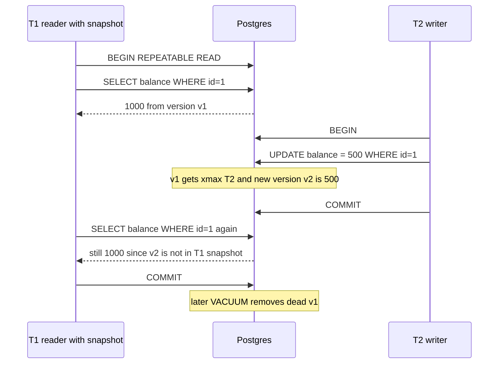
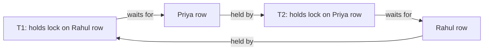

# Transactions & ACID

Transaction = kai operations ka ek group jo ya to **poora** hota hai ya **bilkul nahi**. Payments, seat booking, inventory, wallet: har jagah interviewer poochta hai "do log ek saath kare to kya hoga?". Ye page ACID, isolation levels, MVCC, locking aur deadlocks cover karta hai, jo sab SDE-1/SDE-2 interviews me aate hain.

## ⭐ Transaction kya hai

**Ek line me:** ek logical kaam (jaise "Rahul ne Priya ko ₹500 bheje") jo multiple SQL statements se banta hai, aur DB guarantee deta hai ki beech ki half-done state kisi ko dikhegi nahi aur crash pe bachegi nahi.

> **Example:** Paytm wallet transfer. Rahul ke wallet se ₹500 minus, Priya ke wallet me ₹500 plus, aur ek ledger entry. Agar pehla step ho gaya aur server crash hua, to ₹500 hawa me gayab. Transaction ye nahi hone deta.

```sql
BEGIN;
UPDATE wallets SET balance = balance - 500 WHERE user_id = 1;   -- Rahul
UPDATE wallets SET balance = balance + 500 WHERE user_id = 2;   -- Priya
INSERT INTO ledger (from_user, to_user, amount) VALUES (1, 2, 500);
COMMIT;
```

**Interview tip:** har write-flow me batao transaction boundary kahan hai: "Ye teeno statements ek transaction me hain."

**Common galti:** autocommit mode me multi-step kaam karna. Har statement apna alag transaction ban jaata hai.

## ⭐ ACID, har letter example ke saath

**Ek line me:** ACID = Atomicity, Consistency, Isolation, Durability; ye chaar guarantees mil ke transaction ko bharosemand banati hain.

| Letter | Matlab | Bank transfer me | DB kaise karta hai |
|---|---|---|---|
| **A**tomicity | sab ya kuch nahi | debit ho gaya aur credit fail → debit bhi rollback | undo log / rollback; Postgres me abort hua tuple invisible |
| **C**onsistency | transaction ke baad DB valid state me; saare constraints true | `CHECK (balance >= 0)` toota to transaction fail; total money same rehta hai | constraints, FKs, triggers + app ke invariants |
| **I**solation | concurrent transactions ek dusre ki adhoori state na dekhein | do transfers ek saath Rahul ke wallet pe, balance sahi rahe | locks + MVCC, isolation level pe depend |
| **D**urability | commit ke baad data crash me bhi bachega | "Transfer successful" dikhne ke baad power cut, paisa phir bhi transferred | WAL / redo log fsync before commit ack |

```sql
-- Consistency: DB khud galat state rokta hai
ALTER TABLE wallets ADD CONSTRAINT balance_non_negative CHECK (balance >= 0);

BEGIN;
UPDATE wallets SET balance = balance - 5000 WHERE user_id = 1;  -- balance sirf 500 tha
-- ERROR: violates check constraint "balance_non_negative"
ROLLBACK;  -- Atomicity: kuch bhi apply nahi hua
```

Note: ACID ka **C** aur CAP ka **C** alag hain. CAP ka C = saare replicas same latest value dikhayein (linearizability). Detail: [CAP & Consistency](../01-topics/06-cap-consistency.md).

**Interview tip:** "Durability kaise?" → "Commit ack se pehle WAL record disk pe fsync hota hai; crash pe WAL replay." Replication ke saath: synchronous replica ho to node loss pe bhi data bachta hai.

**Common galti:** Consistency ko sirf DB ka kaam samajhna. "Total money same rahe" jaisa invariant app logic + transaction dono se aata hai.

## ⭐ Transaction commands

**Ek line me:** BEGIN se shuru, COMMIT se pakka, ROLLBACK se wapas, SAVEPOINT se partial rollback.

| Command | Kya karta hai | Example |
|---|---|---|
| `BEGIN` / `START TRANSACTION` | transaction shuru | `BEGIN;` |
| `COMMIT` | saare changes pakke aur dusron ko visible | `COMMIT;` |
| `ROLLBACK` | saare changes undo | `ROLLBACK;` |
| `SAVEPOINT name` | beech me checkpoint | `SAVEPOINT before_coupon;` |
| `ROLLBACK TO SAVEPOINT name` | sirf checkpoint ke baad wala undo | `ROLLBACK TO SAVEPOINT before_coupon;` |
| `RELEASE SAVEPOINT name` | savepoint hatao | `RELEASE SAVEPOINT before_coupon;` |
| `SET TRANSACTION ISOLATION LEVEL ...` | is transaction ka level | `SET TRANSACTION ISOLATION LEVEL SERIALIZABLE;` |
| `BEGIN ISOLATION LEVEL ...` (Postgres) | shuru me hi level | `BEGIN ISOLATION LEVEL REPEATABLE READ;` |
| `SET autocommit = 0` (MySQL) | autocommit band | session level |
| `SELECT ... FOR UPDATE` | row pe write lock | neeche locking section |
| `SET lock_timeout = '2s'` (Postgres) | lock ka wait limit | long waits se bachne ke liye |
| `innodb_lock_wait_timeout` (MySQL) | lock wait limit (default 50s) | `SET innodb_lock_wait_timeout = 5;` |

```sql
-- Swiggy checkout: coupon fail ho to bhi order banna chahiye
BEGIN;
INSERT INTO orders (id, user_id, amount) VALUES (9001, 42, 499);

SAVEPOINT before_coupon;
UPDATE coupons SET used = used + 1
WHERE code = 'SWIGGY50' AND used < max_uses;
-- app ne dekha 0 rows updated (coupon khatam), to sirf coupon part undo
ROLLBACK TO SAVEPOINT before_coupon;

INSERT INTO payments (order_id, amount, status) VALUES (9001, 499, 'PENDING');
COMMIT;   -- order + payment pakke, coupon wala change nahi
```

**Interview tip:** Postgres me transaction ke andar ek statement error de to poora transaction "aborted" state me chala jaata hai; aage ke statements fail honge jab tak ROLLBACK na karo. SAVEPOINT se us error ko locally handle kar sakte ho.

**Common galti:** transaction ke andar network call (payment gateway, HTTP). Locks seconds tak pakde rehte hain. External call transaction ke bahar karo.

## ⭐ Isolation levels aur anomalies

**Ek line me:** isolation level decide karta hai ki concurrent transactions ek dusre ke changes kitna dekh sakte hain; level jitna strong, anomalies utni kam aur concurrency utni kam.

### Anomalies (pehle samjho)

| Anomaly | Kya hota hai | Example |
|---|---|---|
| **Dirty read** | dusre ka **uncommitted** data padh liya | T1 ne balance 0 kiya (commit nahi), T2 ne 0 padha, T1 rollback. T2 ne aisa data dekha jo kabhi tha hi nahi |
| **Non-repeatable read** | same row do baar padhi, beech me kisi ne commit karke badal di | T1 ne price 100 padha, T2 ne 120 commit kiya, T1 ne dobara 120 padha |
| **Phantom read** | same **range query** do baar, naye rows aa gaye | T1: `COUNT(*) WHERE show_id=5` = 10, T2 ne naya booking insert kiya, T1 ko 11 |
| **Lost update** | do transactions read-modify-write karein, ek ka update dusra overwrite kare | dono ne stock 10 padha, dono ne 9 likha; 2 bike, stock sirf 1 kam |
| **Write skew** | dono alag rows update karein, par ek shared rule tootey | rule "kam se kam 1 doctor on-call". Dono doctors ne dekha 2 on-call hain, dono ne apna off kiya → 0 |

### Levels

| Level | Dirty read | Non-repeatable | Phantom | Lost update | Write skew |
|---|---|---|---|---|---|
| **Read Uncommitted** | ho sakta | ho sakta | ho sakta | ho sakta | ho sakta |
| **Read Committed** | rukta | ho sakta | ho sakta | ho sakta | ho sakta |
| **Repeatable Read** | rukta | rukta | ANSI me ho sakta; Postgres me rukta, MySQL me mostly rukta | Postgres me rukta (serialization error), MySQL me ho sakta | ho sakta |
| **Serializable** | rukta | rukta | rukta | rukta | rukta |

### Postgres vs MySQL defaults

| | PostgreSQL | MySQL InnoDB |
|---|---|---|
| Default level | **Read Committed** | **Repeatable Read** |
| Read Uncommitted | Read Committed ki tarah behave karta (dirty read kabhi nahi) | sach me dirty reads |
| Repeatable Read | snapshot isolation: transaction start ka snapshot; concurrent update pe `could not serialize access` error | consistent snapshot for plain SELECT; locking reads + gap/next-key locks se phantoms rokta |
| Serializable | **SSI** (Serializable Snapshot Isolation): optimistic, conflict pe ek transaction abort, retry karna padta | saare plain SELECT ko `FOR SHARE` bana deta (locking) |

```sql
-- Postgres: write skew Serializable me pakda jaata hai
BEGIN ISOLATION LEVEL SERIALIZABLE;
SELECT COUNT(*) FROM doctors WHERE on_call = true;   -- 2
UPDATE doctors SET on_call = false WHERE id = 1;
COMMIT;
-- Dusra transaction same kaam id = 2 ke liye kare to ek ko milega:
-- ERROR: could not serialize access due to read/write dependencies among transactions
-- App ko poora transaction retry karna hai
```

**Interview tip:** "Kaunsa isolation level loge?" → "Default Read Committed, aur critical paths (stock, seat, balance) pe row lock `FOR UPDATE` ya atomic UPDATE. Bahut zaroori invariant ho to Serializable + retry loop."

**Common galti:** sochna ki Repeatable Read lost update aur write skew dono rok deta hai. MySQL RR me lost update ho sakta hai, aur write skew dono me (sirf Serializable rokta hai).

## ⭐ MVCC: readers writers ko block nahi karte

**Ek line me:** MVCC (Multi-Version Concurrency Control) me har update row ka naya version banata hai; har transaction apne snapshot ke hisaab se sahi version padhta hai, isliye reads ko lock nahi chahiye.

**Postgres me kaise:**
- Har row version (tuple) pe `xmin` (kis transaction ne banaya) aur `xmax` (kis transaction ne delete/update kiya).
- Transaction start (RR) ya har statement (RC) pe ek **snapshot** milta hai: kaunse transaction IDs committed the.
- Row version visible hai agar `xmin` committed aur snapshot me hai, aur `xmax` ya to khaali hai ya snapshot me committed nahi.
- UPDATE = purane tuple pe `xmax` set + naya tuple insert. Purane **dead tuples** ko `VACUUM` saaf karta hai.

**MySQL InnoDB me:** row me latest version, purane versions **undo log** me (roll pointer chain). Purge thread purane undo saaf karta hai.



**Fayde:** reads kabhi writes ko block nahi karte aur writes reads ko nahi. Long reports production pe chal sakti hain.
**Kimat:** dead versions ka storage (bloat), vacuum ka kaam, aur bahut lambi transactions vacuum ko rok deti hain.

**Write-write conflict** MVCC se solve nahi hota: do transactions same row update karein to dusra row lock pe wait karta hai.

**Interview tip:** "Long-running transaction Postgres me kyun bura hai?" Uska snapshot purane versions ko zinda rakhta hai, vacuum unhe hata nahi sakta, table bloat hoti hai, aur transaction ID wraparound ka risk.

**Common galti:** sochna MVCC me koi lock nahi hota. Writes abhi bhi row-level locks lete hain.

## ⭐ Locking: row locks aur SELECT ... FOR UPDATE

**Ek line me:** jab read ke baad usi data pe decision leke write karna hai (check-then-act), tab row lock lo taaki beech me koi aur na badle.

| Lock / clause | Kya karta hai | Kab use karo |
|---|---|---|
| Implicit row lock | `UPDATE`/`DELETE` row pe exclusive lock leta hai, commit tak | hamesha hota hai |
| `SELECT ... FOR UPDATE` | padhi rows pe exclusive lock; dusre `FOR UPDATE`/UPDATE wait karenge | read → decide → update (stock, seat, balance) |
| `SELECT ... FOR SHARE` | shared lock; dusre padh sakte, badal nahi sakte | parent row exist kare jab tak child insert ho |
| `FOR UPDATE NOWAIT` | lock na mile to turant error | user ko jaldi "try again" dikhana |
| `FOR UPDATE SKIP LOCKED` | locked rows chhod ke baaki do | job queue, multiple workers |
| Table lock `LOCK TABLE` | poori table | migrations; app me avoid |
| Advisory lock (Postgres) | app-defined lock by number | `pg_advisory_xact_lock(42)` cron ek hi baar chale |
| Gap / next-key lock (MySQL) | index range pe lock, phantom inserts rokta | RR me automatically |

```sql
-- BookMyShow: 2 seats book karo, double booking nahi
BEGIN;
SELECT id, status FROM seats
WHERE show_id = 77 AND seat_no IN ('A1', 'A2')
FOR UPDATE;                         -- dono rows locked, dusra user yahan wait karega
-- app check: dono AVAILABLE hain?
UPDATE seats SET status = 'BOOKED', booked_by = 42
WHERE show_id = 77 AND seat_no IN ('A1', 'A2');
COMMIT;

-- Better jab possible ho: atomic conditional UPDATE, alag SELECT ki zarurat nahi
UPDATE inventory SET stock = stock - 1
WHERE sku = 'IPHONE16' AND stock > 0;      -- 0 rows updated = out of stock

-- Job queue: har worker alag job uthaye, koi wait nahi
BEGIN;
SELECT id, payload FROM jobs
WHERE status = 'PENDING'
ORDER BY created_at
LIMIT 10
FOR UPDATE SKIP LOCKED;
-- process ...
UPDATE jobs SET status = 'DONE' WHERE id = ANY(ARRAY[101, 102]);  -- jo uthaye the
COMMIT;
```

### Optimistic locking (version column)

**Ek line me:** lock mat lo; update ke time check karo ki row padhne ke baad kisi ne badli to nahi.

```sql
-- Read
SELECT id, stock, version FROM products WHERE id = 5;    -- stock 10, version 7

-- Write only if version still 7
UPDATE products
SET stock = 9, version = version + 1
WHERE id = 5 AND version = 7;
-- 1 row updated → success
-- 0 rows updated → kisi aur ne pehle badla, dobara read karke retry
```

| | Pessimistic (`FOR UPDATE`) | Optimistic (version) |
|---|---|---|
| Kaise | pehle lock, phir kaam | kaam, phir commit pe check |
| Contention kam ho | lock overhead bekaar | best |
| Contention zyada ho (flash sale) | queue ban jaati hai par sab sahi | bahut retries, wasted work |
| User think time (form edit) | lock minutes tak, bura | best (wiki, profile edit) |
| Deadlock risk | haan | nahi |

Kin questions me: [BookMyShow](../02-questions/t1-05-bookmyshow.md), [Flash Sale](../02-questions/t2-15-flash-sale.md), [E-commerce Inventory](../02-questions/t2-24-ecommerce-inventory.md), [Job Scheduler](../02-questions/t2-18-job-scheduler.md). Detail: [Locks & contention](../01-topics/09-locks-and-contention.md).

**Interview tip:** "Flash sale me 10 lakh log 1000 iPhone ke liye?" Har request pe DB row lock = hot row. Redis `DECR` se pehle gate karo, phir DB me atomic `UPDATE ... WHERE stock > 0`.

**Common galti:** `SELECT stock` (bina lock) → app me check → `UPDATE stock = 9`. Ye classic lost update hai.

## ⭐ Deadlocks

**Ek line me:** do transactions ek dusre ke pakde hue lock ka wait karein to dono hamesha atak jaate hain; DB ek ko maar ke deadlock todta hai.

> **Example:** T1 Rahul → Priya transfer: pehle Rahul ki row lock, phir Priya ki. T2 Priya → Rahul: pehle Priya, phir Rahul. Dono ne pehla lock le liya, dusre ka wait. Cycle.



**DB kaise detect karta hai:**
- **Wait-for graph**: transactions nodes, "A B ka wait kar raha" edge. Cycle mili = deadlock.
- Postgres: lock wait `deadlock_timeout` (default 1s) se lamba ho to graph check karta hai, ek transaction ko `ERROR: deadlock detected` deke abort.
- MySQL InnoDB: turant detection (`innodb_deadlock_detect`), chhoti (kam rows modified) transaction ko rollback karta hai. `SHOW ENGINE INNODB STATUS` me latest deadlock dikhta hai.
- Distributed systems me aksar timeout based.

**Kaise bachein:**
1. **Consistent lock order**: hamesha chhoti `user_id` pehle lock karo. Transfer me `ORDER BY id ... FOR UPDATE`.
2. Transactions chhoti rakho, user input / network call andar nahi.
3. Ek hi statement me saari rows lock karo: `WHERE id IN (1, 2) ORDER BY id FOR UPDATE`.
4. Sahi indexes: bina index ke UPDATE zyada rows (MySQL me gaps) lock karta hai.
5. App me deadlock error pe **retry** with backoff (ye normal hai, bug nahi).

```sql
-- Fixed transfer: lock order hamesha id ascending
BEGIN;
SELECT id, balance FROM wallets
WHERE user_id IN (1, 2)
ORDER BY user_id
FOR UPDATE;
UPDATE wallets SET balance = balance - 500 WHERE user_id = 1;
UPDATE wallets SET balance = balance + 500 WHERE user_id = 2;
COMMIT;
```

**Interview tip:** "Deadlock aur lock wait timeout me fark?" Deadlock = cycle, DB khud detect karke turant ek ko abort karta hai. Lock timeout = bas zyada der wait hua, cycle zaroori nahi.

**Common galti:** deadlock error ko 500 bana ke user ko dikha dena. Transaction ko poora retry karo.

## ⭐ Services ke across transactions

**Ek line me:** ek DB transaction sirf ek DB ke andar kaam karta hai; jab Order service aur Payment service ke alag DB hon, tab saga ya outbox jaisa pattern chahiye.

- **2PC (Two-Phase Commit)**: coordinator pehle sabse "prepare" poochta hai, phir "commit". Strong, par blocking aur slow; coordinator down to participants atke.
- **Saga**: har service local transaction kare, fail hone pe **compensating action** (refund, release seat). Eventually consistent.
- **Outbox pattern**: business row + event ek hi local transaction me, relay event ko Kafka pe bhejta hai. Dual write problem khatam.
- **Idempotency keys**: retries pe double charge nahi. Detail: [Idempotency & retries](../01-topics/10-idempotency-retries.md).

Poori detail: [Distributed transactions](../01-topics/16-distributed-transactions.md). Payments design: [Payment System](../02-questions/t1-11-payment-system.md).

**Interview tip:** "Microservices me ACID kaise?" → "Har service ke andar local ACID, services ke beech saga + outbox + idempotency. 2PC sirf jab sab participants ek trusted setup me hon."

**Common galti:** order service se payment DB me seedha likhna "taaki ek transaction ho jaaye". Service boundary toot jaati hai.

## ⭐ BASE vs ACID

**Ek line me:** ACID = correctness pehle; BASE = availability aur scale pehle, consistency thodi der baad.

**BASE** = **B**asically **A**vailable, **S**oft state, **E**ventually consistent.

| Point | ACID | BASE |
|---|---|---|
| Focus | correctness, har read latest | availability, partition me bhi chalte raho |
| Consistency | strong, turant | eventual (ms se seconds) |
| Typical DB | Postgres, MySQL, Spanner | Cassandra, DynamoDB (default), Riak |
| Scale | vertical + careful sharding | horizontal, easy |
| Use case | payments, inventory, booking | likes count, feed, chat history, analytics |
| Conflicts | locks se pehle hi rok do | last-write-wins, vector clocks, CRDTs |

Ye black-and-white nahi hai:
- DynamoDB me `TransactWriteItems` (ACID, limited items) aur strongly consistent reads hain.
- Cassandra me lightweight transactions (`IF NOT EXISTS`, Paxos) hain, par slow.
- MongoDB 4.0+ me multi-document transactions hain.
- NewSQL (Spanner, CockroachDB) distributed + ACID dono. Detail: [NewSQL](13-newsql.md).

**Interview tip:** ek hi system me dono bolo: "Payment ledger ACID Postgres me, aur like counts BASE store me, kyunki 1–2 sec purana like count chalega."

**Common galti:** "NoSQL me transactions nahi hote" absolute bolna. Limited transactions hain, bas cost aur scope alag hai.

## Interview me bolo

- "Stock jaise counters pe main atomic `UPDATE ... WHERE stock > 0` karunga; read-then-write ke liye `FOR UPDATE`, aur kam contention wale edits pe version column se optimistic locking."
- "Postgres default Read Committed hai; write skew jaisa invariant ho to Serializable + retry, aur deadlock se bachne ke liye consistent lock order."

## Checklist

- [ ] ACID ke chaaron letters bank transfer example se samjha sakta hoon
- [ ] BEGIN, COMMIT, ROLLBACK aur SAVEPOINT ka use SQL me dikha sakta hoon
- [ ] Dirty read, non-repeatable read, phantom, lost update aur write skew example ke saath bata sakta hoon
- [ ] Har isolation level kaunsi anomaly rokta hai aur Postgres vs MySQL default bata sakta hoon
- [ ] MVCC (xmin/xmax, snapshot, vacuum, undo log) samjha sakta hoon
- [ ] FOR UPDATE, FOR SHARE, SKIP LOCKED aur version-column optimistic locking kab use karna hai bata sakta hoon
- [ ] Deadlock kaise banta hai, DB kaise detect karta hai aur lock ordering se kaise bachein bata sakta hoon
- [ ] Services ke across saga/outbox aur BASE vs ACID ka fark samjha sakta hoon
