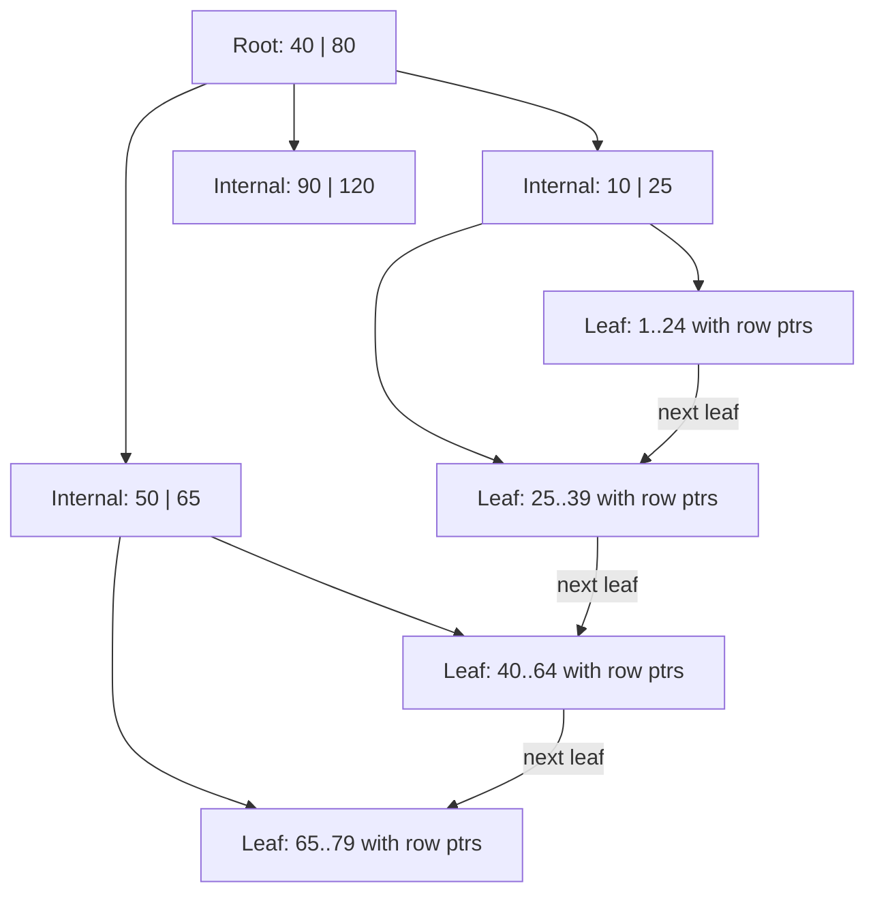
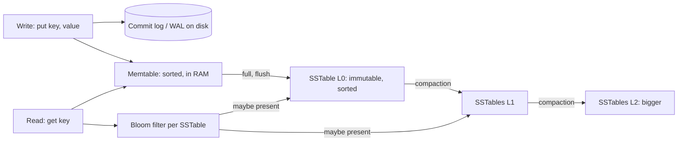

# Indexes

Index ek alag sorted (ya hashed) structure hai jo rows ki taraf point karta hai, taaki database poori table padhne ki jagah seedha data tak jump kare. "Ye query slow hai" wale lagbhag har interview sawal ka jawab index pe khatam hota hai. Structures (B+tree, hash, LSM), rules (leftmost prefix, covering) aur cost (har write har index ko update karta hai) teeno pata hone chahiye.

## ⭐ Why indexes: full scan vs lookup

**Ek line me:** index ke bina database har row padhta hai (full table scan, O(n)); B+tree index ke saath tree me kuch pages neeche jaata hai (O(log n)) aur sirf matching rows padhta hai.

> **Example:** Zomato pe 50 lakh restaurants hain. Index ke bina `WHERE city_id = 7` disk se saare 50 lakh rows padhega. `city_id` pe index ho to 3–4 index pages aur phir sirf ~40,000 Bangalore wali rows.

| | Full table scan | Index lookup |
|---|---|---|
| Kaam | Table ka har page padho | 3–4 tree pages, phir matching rows |
| Complexity | O(n) | O(log n) + matches |
| Kab accha | Table chhoti hai, ya query bahut % rows laati hai | Query selective hai (kam rows) |
| I/O pattern | Sequential (per page fast) | Random (per page slow, par pages bahut kam) |

- Database data **pages** me rakhta hai (Postgres 8 KB, InnoDB 16 KB). Cost moti baat me = "kitne pages chhue".
- Index ek trade hai: reads fast, writes slow, extra disk aur RAM.
- Index use karna hai ya nahi, ye **query planner** decide karta hai. Query table ka 40% laati hai to lakhon random index hops se sequential scan sasta hai, aur planner index ignore karega. Ye sahi behaviour hai.

**Interview tip:** "Har column pe index kyun nahi?" Har INSERT/UPDATE/DELETE ko har index update karna padta hai, indexes data cache ki RAM kha jaate hain, aur planner ek table access pe ek-do index hi use karta hai. Asli query patterns ke hisaab se index banao.

**Common galti:** sochna ki index bana diya to hamesha use hoga. Low selectivity, column pe function, ya purane statistics ho to planner seq scan chunta hai.

## ⭐ B-tree / B+tree structure

**Ek line me:** B+tree chhota (kam height) aur chauda balanced tree hai; internal nodes me sirf routing keys, leaves me keys + row pointers (ya poori rows), aur leaves left-to-right linked hoti hain taaki range scan ho sake.



- **Fan-out** bahut bada: ek 16 KB page me sainkdon keys. Fan-out ~500 ho to 3 levels = 500³ = 12.5 crore keys. Matlab lookup = 3–4 page reads, aur upar ke levels lagbhag hamesha RAM me.
- **Balanced:** har leaf same depth pe. Insert pe full page split hota hai aur ek key upar jaati hai; delete pe merge. Height sirf root se badhti hai.
- **B-tree vs B+tree:** classic B-tree internal nodes me bhi values rakhta hai. B+tree data sirf leaves me rakhta hai aur leaves ko link karta hai, isliye range scan (`BETWEEN`, `ORDER BY`, `>`) bas leaf chain pe chalta hai. Har bade RDBMS ka "B-tree index" asal me B+tree hai.
- Support: `=`, `<`, `>`, `BETWEEN`, `ORDER BY`, prefix `LIKE 'abc%'`, `MIN/MAX`.
- Updates **in place** hote hain: page dhoondho, badlo, wapas likho (durability ke liye WAL ke saath). Random writes hi main write cost hai.

**Interview tip:** "Disk pe binary search tree kyun nahi, B+tree kyun?" BST ki height log2(n) (10 crore rows pe ~27), aur har level ek random disk read. Fan-out 500 wale B+tree ki height 3–4. Disk aur SSD pages me padhte hain, to ek page me bahut keys bharo.

**Common galti:** B-tree lookup ko O(1) bolna. Ye O(log n) hai, bas log ka base bahut bada hai.

## Hash index

**Ek line me:** key se row location tak hash table; equality lookup O(1), par range aur ordering nahi.

- Postgres me `CREATE INDEX ... USING HASH` hai (v10 se crash-safe). MySQL MEMORY engine hash support karta hai; InnoDB hot B-tree pages pe khud ek **adaptive hash index** bana leta hai.
- Redis, Memcached aur Bitcask ki in-memory key directory andar se hash index hi hain.
- `>`, `<`, `BETWEEN`, `ORDER BY` ya prefix match nahi kar sakta. Postgres me B-tree se kam hi better hota hai, isliye default B-tree hi hai.

**Interview tip:** "Hash index kab chunoge?" Lambi key (session token, URL hash) pe sirf equality lookup, jahan range ya sort kabhi nahi chahiye. Tab bhi B-tree aksar theek hai.

**Common galti:** hash index banana aur phir us column pe `>` se filter karna. Index kisi kaam ka nahi.

## ⭐ LSM-tree: memtable, SSTables, compaction, bloom filters

**Ek line me:** LSM-tree random writes ko sequential writes me badal deta hai: in-memory sorted table + log me likho, use immutable sorted file (SSTable) ki tarah flush karo, aur background me files merge karo.



Write path:
1. Durability ke liye **commit log** (WAL) me append. Sequential write, fast.
2. **Memtable** me insert (RAM me sorted structure, jaise skip list).
3. Memtable full (maan lo 64 MB) to disk pe **SSTable** (Sorted String Table) ki tarah flush: immutable, sorted, chhota index aur ek **bloom filter** ke saath.
4. **Compaction** background me SSTables merge karta hai, har key ka newest version rakhta hai, deleted keys (**tombstones**) aur purani values hata deta hai.

Read path:
1. Pehle memtable. Phir SSTables newest se oldest.
2. Har SSTable ke liye pehle uska **bloom filter** poocho: "pakka nahi hai" (file skip) ya "shayad hai" (padho). Bloom filter me false positive ho sakta hai, false negative nahi.
3. Ek key kai files me ho sakti hai; newest jeet-ta hai.

Compaction strategies:
- **Size-tiered (STCS):** similar size ke SSTables merge. Writes saste, read aur space amplification zyada. Cassandra default.
- **Leveled (LCS):** har level 10x bada, key ranges overlap nahi karti. Read har level pe ~ek file chhoota hai; write amplification zyada. RocksDB default.

**Interview tip:** "LSM writes fast kyun?" In-place page update nahi hota. Har write ek sequential append (log) + RAM insert hai. Cost baad me compaction aur read time pe chukaate ho.

**Common galti:** sochna ki LSM store me delete turant space free karta hai. Delete ek tombstone likhta hai; space compaction ke baad hi wapas aata hai (Cassandra me `gc_grace_seconds` ke baad).

## ⭐ B-tree vs LSM-tree

| | B+tree | LSM-tree |
|---|---|---|
| Write pattern | Random in-place page updates | Sequential appends + background merge |
| Write throughput | Medium | High |
| Read latency | Predictable, 3–4 pages | Kai SSTables check ho sakte hain (bloom filter madad karta hai) |
| Range scans | Excellent (linked leaves) | Accha, par kai files ka result merge hota hai |
| Write amplification | Chhote change pe poora page rewrite + WAL | Har compaction pe same data dobara likha jaata hai |
| Read amplification | Kam | Zyada, khaas kar size-tiered me |
| Space amplification | Page fragmentation (~30% khaali jagah) | Compaction tak purane versions |
| Kaun use karta hai | PostgreSQL, MySQL InnoDB, Oracle, SQL Server, MongoDB WiredTiger (default) | Cassandra, ScyllaDB, RocksDB, LevelDB, HBase, Bigtable, DynamoDB storage, InfluxDB |
| Best for | Read-heavy OLTP, transactions, ranges | Write-heavy: logs, metrics, chat messages, IoT |

- **Write amplification** = disk pe likhe bytes / app ne likhe bytes. **Read amplification** = ek lookup me kitne pages padhe. **Space amplification** = disk use / live data size. Teeno me se do optimise kar sakte ho, teeno nahi (RUM conjecture).

**Interview tip:** "WhatsApp scale pe chat messages, kaunsa storage engine?" LSM (Cassandra/ScyllaDB/HBase): bahut zyada write rate, reads partition ke andar recent-first. "Bank ledger jahan reads aur transactions zyada hain?" B+tree (Postgres/MySQL).

**Common galti:** LSM ko general me "faster" bolna. Writes ke liye fast hai; reads aur compaction spikes p99 latency kharab kar sakte hain.

## ⭐ Composite index and the leftmost-prefix rule

**Ek line me:** `(a, b, c)` pe index pehle `a` se sorted hai, phir `a` ke andar `b`, phir `b` ke andar `c`; ye un queries me kaam aata hai jo leftmost prefix pe filter karein: `a`, `a,b`, ya `a,b,c`.

Phone book socho jo (last_name, first_name) se sorted hai. "Sharma, Rahul" dhoondhna fast. Saare "Rahul" dhoondhna nahi.

```sql
CREATE INDEX idx_orders_user_status_time
  ON orders (user_id, status, created_at);
```

| Query | Index use hoga? | Kyun |
|---|---|---|
| `WHERE user_id = 42` | Haan | Leftmost column |
| `WHERE user_id = 42 AND status = 'DELIVERED'` | Haan | Prefix (a, b) |
| `WHERE user_id = 42 AND status = 'DELIVERED' ORDER BY created_at DESC` | Haan, sort step nahi | Poora prefix, rows pehle se order me |
| `WHERE status = 'DELIVERED'` | Nahi (kuch DBs me skip scan) | Leftmost column chhoot gaya |
| `WHERE user_id = 42 AND created_at > now() - interval '7 days'` | Aadha | `user_id` pe seek, phir uske andar `created_at` filter (status ka gap) |
| `WHERE user_id = 42 AND status IN ('A','B')` | Haan | Prefix column pe IN theek hai |
| `WHERE user_id > 40 AND status = 'X'` | Aadha | `a` pe range ke baad `b` pe seek nahi hota |

Column order ke rules:
1. **Equality columns pehle**, **range** ya **sort** column last ("ESR": Equality, Sort, Range).
2. Equality columns me jo sabse zyada queries me aata hai use pehle rakho, taaki index zyada queries serve kare.
3. `(a, b)` index ho to alag `(a)` index redundant hai. Drop karo.

**Interview tip:** "Index (a,b) hai aur query sirf b pe?" Seek ke liye generally use nahi hota. MySQL 8 aur Oracle **skip scan** kar sakte hain jab `a` ke distinct values bahut kam hon, par uske bharose design mat karo.

**Common galti:** `user_id`, `status`, `created_at` pe alag-alag single-column indexes bana ke ek composite index jaisa behaviour expect karna. Planner unhe combine kar sakta hai (Postgres bitmap AND, MySQL index merge), par ek sahi composite index se bahut slow.

## ⭐ Covering index and index-only scan

**Ek line me:** query ko jo columns chahiye wo sab index me hon to database sirf index se jawab de deta hai, table ko chhoota hi nahi.

```sql
-- Query: order history list screen
SELECT created_at, total_amount
FROM orders
WHERE user_id = 42
ORDER BY created_at DESC
LIMIT 20;

-- Postgres: key columns + INCLUDE payload columns
CREATE INDEX idx_orders_user_time_cov
  ON orders (user_id, created_at DESC) INCLUDE (total_amount);

-- MySQL: seedha key me daal do
CREATE INDEX idx_orders_user_time_cov ON orders (user_id, created_at, total_amount);
```

- Postgres plan me `Index Only Scan` dikhega. Ye phir bhi **visibility map** check karta hai; bahut updates ke baad `VACUUM` chalao taaki pages all-visible mark hon, warna heap pe wapas jaata hai.
- MySQL `EXPLAIN` ke Extra column me `Using index` dikhta hai.
- `SELECT *` covering ko khatam kar deta hai. Sirf wahi select karo jo screen ko chahiye.

**Interview tip:** "Cache ke bina hot read query fast kaise karoge?" Covering index banao: equality columns, phir sort column, phir selected columns INCLUDE me.

**Common galti:** covering index me wide columns (jaise JSON blob) daal dena. Index bahut bada ho jaata hai aur RAM me fit nahi hota.

## Partial and expression indexes

**Ek line me:** partial index sirf `WHERE` match karne wali rows index karta hai; expression index function ka result index karta hai, taaki `WHERE lower(email) = ...` use kar sake.

```sql
-- Partial: sirf 2% orders active hain; sirf unhe index karo
CREATE INDEX idx_orders_active ON orders (restaurant_id, created_at)
  WHERE status IN ('PLACED', 'PREPARING', 'OUT_FOR_DELIVERY');

-- Partial unique: har user ka ek hi active cart
CREATE UNIQUE INDEX uq_one_active_cart ON carts (user_id) WHERE is_active;

-- Expression: case-insensitive login
CREATE INDEX idx_users_lower_email ON users (lower(email));
SELECT * FROM users WHERE lower(email) = 'rahul@paytm.com';

-- MySQL 8 functional index (double brackets dhyan do)
CREATE INDEX idx_users_lower_email ON users ((lower(email)));
```

- Partial index chhota, fast aur maintain karne me sasta. Planner tabhi use karega jab query ka `WHERE` index ke `WHERE` ko imply kare.
- MySQL me partial index nahi hai; functional index (8.0.13+) aur generated columns hain.

**Common galti:** sirf `email` pe plain index ke saath `WHERE lower(email) = ?` likhna. Function column ko index se chhupa deta hai.

## Unique index

**Ek line me:** unique index "do rows ki same key nahi ho sakti" enforce karta hai aur saath me normal lookup index bhi hai.

```sql
CREATE UNIQUE INDEX uq_users_phone ON users (phone);
ALTER TABLE payments ADD CONSTRAINT uq_payment_idem UNIQUE (merchant_id, idempotency_key);
```

- `PRIMARY KEY` ya `UNIQUE` constraint apne aap unique index banata hai.
- **Idempotency** aur double booking rokne ka sabse clean tareeka: doosra insert duplicate-key error deta hai, jise tum catch karte ho. Dekho [Idempotency & retries](../01-topics/10-idempotency-retries.md) aur [BookMyShow](../02-questions/t1-05-bookmyshow.md).
- `NULL`: Postgres aur MySQL me unique column me kai NULL allowed hain (Postgres 15 me `NULLS NOT DISTINCT` se badal sakte ho).

**Common galti:** app code me "pehle SELECT, nahi mila to INSERT" se uniqueness enforce karna. Do requests saath me SELECT paar kar jaati hain. Faisla unique index ko karne do.

## ⭐ Clustered vs secondary index (InnoDB primary key clustering)

**Ek line me:** clustered index *hi* table hai: rows B+tree leaves me primary key order me store hoti hain; secondary index keys + row tak wapas jaane ka pointer rakhta hai.


| | MySQL InnoDB | PostgreSQL |
|---|---|---|
| Table storage | Primary key pe clustered (B+tree) | Heap (unordered); har index secondary |
| Secondary index leaf me | Indexed columns + **primary key** | Indexed columns + **TID** (page, slot) |
| Secondary lookup cost | Do tree walks (secondary, phir PK) | Index walk + ek heap page fetch |
| PK pe range | Bahut fast, rows physically paas-paas | `CLUSTER` (one-time) ya BRIN chahiye |

InnoDB ke consequences:
- **Chhoti, badhti hui primary key** rakho (BIGINT auto-increment, ya Snowflake/ULID jaise time-ordered IDs). Random UUIDv4 PK poore tree me idhar-udhar insert karta hai: page splits, fragmentation, aur bade secondary indexes (PK har secondary index me copy hoti hai). Dekho [Unique ID generation](../01-topics/17-unique-id-generation.md).
- PK nahi diya? InnoDB pehli NOT NULL unique key leta hai, warna hidden 6-byte row id.
- `(email)` pe secondary index `SELECT id FROM users WHERE email = ?` ke liye apne aap "covering" hai, kyunki PK leaf me hai.

**Interview tip:** "MySQL me UUID primary key kharab kyun?" Clustered B+tree me random inserts page splits aur poor cache locality laate hain, aur 16-byte key har secondary index me repeat hoti hai. Time-ordered ID use karo.

**Common galti:** maan lena ki Postgres tables primary key se ordered hain. Wo heap hain; order wahi jo inserts aur updates ne chhoda.

## ⭐ When indexes hurt

**Ek line me:** indexes writes, RAM aur disk ki cost lete hain, aur kuch query shapes unhe use hi nahi kar sakti.

| Problem | Kyun | Fix |
|---|---|---|
| Write-heavy table pe bahut indexes | Har INSERT har index update karta hai; indexed column ka UPDATE bhi | Sirf real queries wale indexes rakho; `pg_stat_user_indexes.idx_scan = 0` check karo |
| Low cardinality column (`gender`, `is_active`) | Index bahut % rows laata hai; seq scan sasta | Rare value pe partial index, ya selective column ke saath composite |
| Column pe function: `WHERE DATE(created_at) = '2026-10-01'` | Index `created_at` pe hai, `DATE(created_at)` pe nahi | Range me likho: `created_at >= '2026-10-01' AND created_at < '2026-10-02'` |
| Leading wildcard: `LIKE '%biryani%'` | B-tree prefix se sorted hai; seek ke liye prefix nahi | Full-text search (Postgres `tsvector`/GIN, `pg_trgm`) ya Elasticsearch |
| Implicit type cast: VARCHAR pe `WHERE phone = 9876543210` | Har row ka column cast hota hai | Sahi type pass karo |
| Alag columns pe `OR` | Ek index dono sides serve nahi kar sakta | Do indexed queries ka `UNION ALL`, ya alag indexes + bitmap OR |
| Bada bulk load | Har row pe index maintenance | Indexes drop, load, phir recreate |
| InnoDB me random UUID PK | Page splits | Time-ordered IDs |

- Postgres **HOT updates**: UPDATE kisi indexed column ko na badle aur page me jagah ho to Postgres index updates skip karta hai. Baar-baar update hone wale column (jaise `last_seen_at`) ko index karna HOT khatam karta hai aur indexes bloat karta hai.

**Common galti:** logs me har slow query ke liye ek naya index. `orders` pe 10 overlapping indexes checkout writes ko utna slow karenge jitna reads ko fayda nahi.

## ⭐ Commands: create, drop, EXPLAIN

| Command / method | Kya karta hai | Example |
|---|---|---|
| `CREATE INDEX` | B-tree index banata hai (Postgres me build ke dauran table ke writes lock) | `CREATE INDEX idx_r_city ON restaurants (city_id);` |
| `CREATE INDEX CONCURRENTLY` | Postgres: writes block kiye bina build (slow, transaction ke andar nahi chalta) | `CREATE INDEX CONCURRENTLY idx_r_city ON restaurants (city_id);` |
| `CREATE UNIQUE INDEX` | Index + uniqueness constraint | `CREATE UNIQUE INDEX uq_u_phone ON users (phone);` |
| `USING gin / gist / brin / hash` | Postgres index type | `CREATE INDEX ON menu USING gin (to_tsvector('english', name));` |
| `INCLUDE (...)` | Postgres covering payload columns | `CREATE INDEX ON orders (user_id) INCLUDE (total);` |
| `ALTER TABLE ... ADD INDEX ..., ALGORITHM=INPLACE, LOCK=NONE` | MySQL online index build | `ALTER TABLE orders ADD INDEX idx_u (user_id), ALGORITHM=INPLACE, LOCK=NONE;` |
| `DROP INDEX` / `DROP INDEX CONCURRENTLY` | Index hatao | `DROP INDEX CONCURRENTLY idx_old;` |
| `REINDEX INDEX CONCURRENTLY` | Postgres: bloated index rebuild | `REINDEX INDEX CONCURRENTLY idx_r_city;` |
| `EXPLAIN` | Plan + estimated cost dikhata hai, query chalaye bina | `EXPLAIN SELECT ...;` |
| `EXPLAIN ANALYZE` | Query chala ke actual rows aur time dikhata hai | `EXPLAIN (ANALYZE, BUFFERS) SELECT ...;` |
| `ANALYZE` | Planner ke statistics refresh | `ANALYZE restaurants;` |

Postgres plan kaise padhein:

| Node | Matlab | Accha ya bura |
|---|---|---|
| `Seq Scan` | Poori table padhi | Chhoti table ya bade result pe theek; badi table pe selective filter ho to bura |
| `Index Scan` | Index walk, har matching row heap se fetch | Kam rows ke liye accha |
| `Index Only Scan` | Sirf index se jawab (`Heap Fetches: 0` ideal) | Best |
| `Bitmap Index Scan` + `Bitmap Heap Scan` | Matching row locations jama karo, phir pages order me padho | Medium result set ya indexes combine karne me accha |
| `Sort` (`external merge Disk` ke saath) | Rows sort ho rahi hain, disk pe spill | Sahi index order se aksar hat jaata hai |
| `Rows Removed by Filter: 480000` | Rows padhi aur phenk di | Index missing ya galat |

- **Estimated rows vs actual rows** compare karo. 100x ka fark = purane stats: `ANALYZE` chalao.
- `actual time=0.04..12.3` = first row..last row, ms me. `loops=1000` hai to multiply karo.
- MySQL `EXPLAIN`: `type` dekho (`ALL` = full scan, `ref`/`range`/`const` = index), `key` (kaunsa index), `rows`, aur `Extra` (`Using index` = covering, `Using filesort`, `Using temporary` = extra kaam).

**Interview tip:** "50 GB production table pe index kaise add karoge?" Postgres me `CREATE INDEX CONCURRENTLY` (MySQL me online DDL / `gh-ost` / `pt-online-schema-change`), off-peak, phir check karo index `VALID` hai, phir target query ka `EXPLAIN`.

**Common galti:** busy Postgres table pe plain `CREATE INDEX` chalana. Build khatam hone tak saare writes block karne wala lock leta hai.

## ⭐ Real example: tuning a slow Zomato restaurant search

> **Example:** "restaurants near me, open now, rating 4+, rating se sorted" API ka p99 1.8 s hai. Table me 50 lakh rows.

Query:

```sql
SELECT id, name, rating, avg_cost
FROM restaurants
WHERE city_id = 7
  AND is_open = true
  AND rating >= 4.0
  AND lower(name) LIKE '%biryani%'
ORDER BY rating DESC
LIMIT 20;
```

Step 1: `EXPLAIN (ANALYZE, BUFFERS)`:

```text
Limit  (actual time=1790.2..1790.3 rows=20 loops=1)
  ->  Sort  (Sort Method: top-N heapsort)
        ->  Seq Scan on restaurants  (actual rows=212 loops=1)
              Filter: (is_open AND rating >= 4.0 AND city_id = 7 AND lower(name) ~~ '%biryani%')
              Rows Removed by Filter: 4999788
              Buffers: shared read=98000
```

Diagnosis: 50 lakh rows pe seq scan, lagbhag sab phenk di gayi. Teen problems: `city_id` pe index nahi, `ORDER BY rating` ke liye sort, aur `LIKE '%biryani%'` B-tree use nahi kar sakta.

Step 2: ESR order me composite index, open restaurants pe partial, selected columns ko cover karta hua:

```sql
CREATE INDEX CONCURRENTLY idx_rest_city_rating_open
  ON restaurants (city_id, rating DESC)
  INCLUDE (name, avg_cost)
  WHERE is_open = true;
```

Step 3: text search alag se handle karo. Trigram index (ya search ko Elasticsearch me le jao, dekho [Search indexing](../01-topics/14-search-indexing.md)):

```sql
CREATE EXTENSION IF NOT EXISTS pg_trgm;
CREATE INDEX CONCURRENTLY idx_rest_name_trgm
  ON restaurants USING gin (lower(name) gin_trgm_ops);
ANALYZE restaurants;
```

Step 4: naya plan:

```text
Limit  (actual time=0.9..2.1 rows=20 loops=1)
  ->  Index Only Scan using idx_rest_city_rating_open on restaurants
        Index Cond: (city_id = 7 AND rating >= 4.0)
        Filter: (lower(name) ~~ '%biryani%')
        Heap Fetches: 0
```

- Rows pehle se rating order me aati hain, to `LIMIT 20` jaldi ruk jaata hai. Sort node nahi.
- 1.8 s ab ~2 ms. Writes do extra indexes ki cost dete hain; restaurants kam badalte hain, to theek hai.
- Asli "near me" location pe geohash ya PostGIS GiST use karta hai, dekho [Geospatial](../01-topics/13-geospatial.md) aur [Nearby places](../02-questions/t2-21-nearby-places.md).

**Interview tip:** aise bolo: measure (EXPLAIN ANALYZE) → rows removed / sort / seq scan dhoondho → index design (equality, sort, range, include) → naya plan verify → write cost check.

## Kin system design questions me

- [Indexing & replication](../01-topics/03-indexing-replication.md): HLD me index basics
- [SQL vs NoSQL](../01-topics/02-sql-vs-nosql.md): B-tree vs LSM engines
- [URL shortener](../02-questions/t1-01-url-shortener.md): short code pe unique index
- [BookMyShow](../02-questions/t1-05-bookmyshow.md): unique (show_id, seat_id) se double booking block
- [WhatsApp chat](../02-questions/t1-04-whatsapp-chat.md): message writes ke liye LSM store
- [Typeahead](../02-questions/t1-10-typeahead.md) aur [Search indexing](../01-topics/14-search-indexing.md): B-tree LIKE search kyun nahi hai
- [Food delivery](../02-questions/t2-14-food-delivery.md): restaurant aur order queries

## Checklist

- [ ] Full scan vs index lookup, aur planner kab sahi me index ignore karta hai, samjha sakta hoon
- [ ] B+tree draw karke fan-out, height aur leaves linked kyun hain bata sakta hoon
- [ ] LSM ka write aur read path samjha sakta hoon: WAL, memtable, SSTable, bloom filter, compaction
- [ ] B-tree vs LSM ko read/write/space amplification pe compare karke har ek ke DBs bata sakta hoon
- [ ] Leftmost-prefix rule laga ke composite index ka column order (equality, sort, range) chun sakta hoon
- [ ] Di gayi query ke liye covering, partial ya expression index design kar sakta hoon
- [ ] InnoDB clustered PK vs Postgres heap, aur random UUID PK kyun nuksaan karta hai, bata sakta hoon
- [ ] Index kab use nahi hota (column pe function, leading wildcard, low cardinality, casts) list kar sakta hoon
- [ ] EXPLAIN ANALYZE output padh ke slow query end to end tune kar sakta hoon
