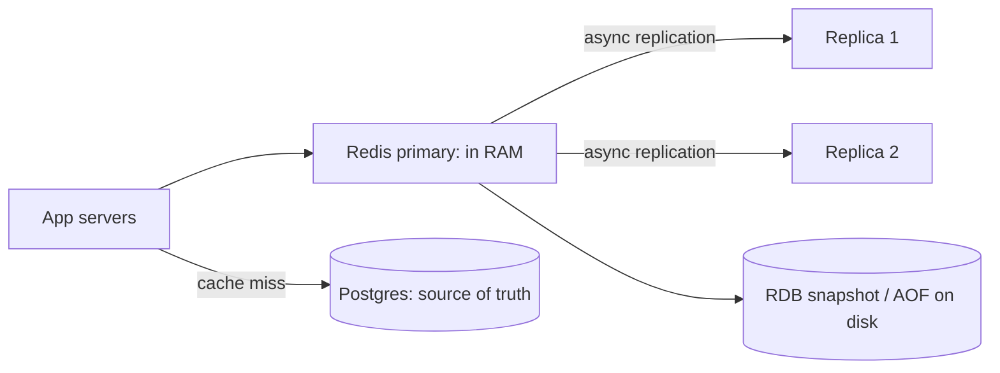
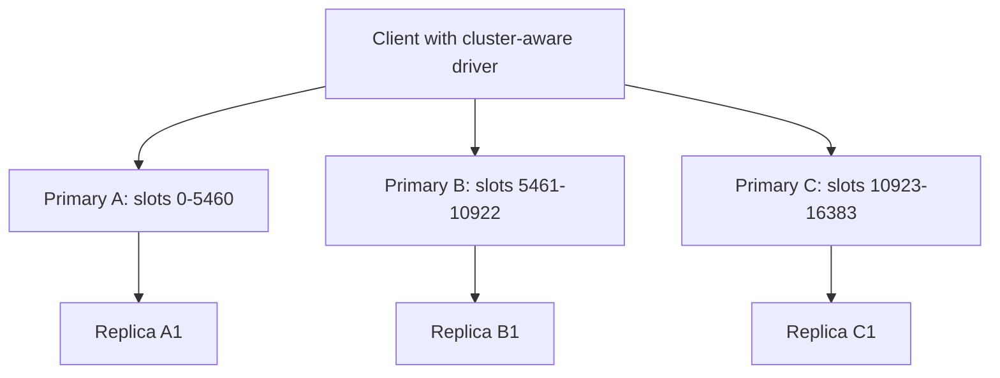
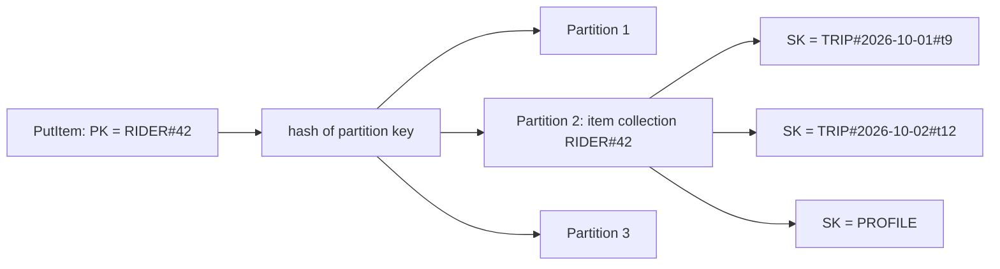

# Key-Value: Redis & DynamoDB

Key-value store tumhe `get(key)` aur `put(key, value)` deta hai, bahut kam latency aur huge scale pe, aur lagbhag kuch nahi. Redis in-memory wala hai jisme rich data structures hain (cache, counters, leaderboards, locks). DynamoDB durable, managed, infinitely scale hone wala hai jahan table access patterns ke hisaab se design hoti hai. Dono lagbhag har HLD round me aate hain.

## ⭐ Redis in one picture

**Ek line me:** Redis ek single-threaded (commands ke liye), in-memory data structure server hai; ek key pe har operation atomic hai, aur zyada tar O(1) ya O(log n) hain, isliye sub-millisecond latency milti hai.

> **Example:** Swiggy "restaurant open / busy" flag, user sessions, OTP attempts aur rate-limit counters Redis me rakhta hai. Orders ka source of truth Postgres hi rehta hai.

- **In memory:** dataset RAM me fit hona chahiye (ya cluster ki RAM me). Disk sirf persistence aur restart ke liye.
- **Single-threaded command execution:** andar locks nahi, har command atomic. Redis 6+ network read/write ke liye I/O threads use karta hai, par commands ek-ek karke hi chalti hain. Ek slow command (`KEYS *`, bada `SMEMBERS`) sabko block karti hai.
- **Sirf strings nahi, data structures:** logic server pe bhejo (`INCR`, `ZINCRBY`), app me read-modify-write mat karo.
- **Throughput:** simple commands pe ek instance ~1 lakh+ ops/sec.



**Interview tip:** "Redis single-threaded hai, phir itna fast kaise?" Sab kuch RAM me, lock contention nahi, efficient data structures, aur ek event loop (epoll) hazaron connections serve karta hai. Bottleneck aksar network hota hai, CPU nahi.

**Common galti:** production me `KEYS *` chalana. Ye O(n) hai aur server block karta hai. Cursor ke saath `SCAN` use karo.

## ⭐ Strings, counters and expiry

**Ek line me:** string 512 MB tak bytes rakhta hai (text, JSON, number, serialized object); numeric strings pe atomic `INCR` hota hai.

| Command / method | Kya karta hai | Example |
|---|---|---|
| `SET key val` | Value set (overwrite) | `SET user:42:name "Rahul"` |
| `GET key` | Value ya nil | `GET user:42:name` |
| `SET key val EX sec` | Seconds me TTL ke saath set (`PX` = ms) | `SET otp:9876543210 482913 EX 300` |
| `SET key val NX` | Sirf tab set jab key na ho | `SET lock:order:7 uuid-abc NX EX 10` |
| `SET key val XX` | Sirf tab set jab key ho | `SET session:abc data XX EX 1800` |
| `INCR` / `INCRBY` / `DECR` | Atomic counter | `INCRBY views:video:9 1` |
| `MGET` / `MSET` | Ek round trip me kai keys | `MGET price:1 price:2 price:3` |
| `EXPIRE key sec` | Existing key pe TTL | `EXPIRE cart:42 86400` |
| `TTL key` | Bache seconds (-1 TTL nahi, -2 key nahi) | `TTL otp:9876543210` |
| `PERSIST key` | TTL hatao | `PERSIST cart:42` |
| `DEL` / `UNLINK` | Delete (`UNLINK` memory background me free karta hai) | `UNLINK big:key` |
| `SCAN cursor MATCH p COUNT n` | Keys safely iterate | `SCAN 0 MATCH session:* COUNT 100` |

```bash
# Restaurant menu ke liye cache-aside (Swiggy)
GET menu:rest:501                         # miss -> nil
SET menu:rest:501 '{"items":[...]}' EX 600  # DB se bharo, 10 min TTL

# OTP: 10 minute me max 5 attempts
INCR otp_attempts:9876543210              # -> 1
EXPIRE otp_attempts:9876543210 600 NX     # TTL sirf pehle attempt pe (Redis 7)
```

- Expiry **lazy + active** hai: expired key tab delete hoti hai jab koi use chhoota hai, aur ek background job TTL wali keys sample karke expired delete karta hai.

**Common galti:** TTL wali key pe dobara `SET` karna TTL hata deta hai, jab tak `EX` (ya `KEEPTTL`) dobara na do.

## ⭐ Hashes, lists and sets

**Ek line me:** hash ek key ke andar chhota map hai (object), list linked list hai (queue/stack, latest-N), set unordered unique collection hai.

| Command / method | Kya karta hai | Example |
|---|---|---|
| `HSET key f v [f v...]` | Hash ke fields set | `HSET user:42 name Rahul city BLR` |
| `HGET` / `HMGET` | Ek / kai fields | `HGET user:42 city` |
| `HGETALL` | Saare fields (bade hash pe dhyan) | `HGETALL user:42` |
| `HINCRBY key f n` | Field ka atomic increment | `HINCRBY cart:42 item:77 1` |
| `HDEL` | Field hatao | `HDEL cart:42 item:77` |
| `LPUSH` / `RPUSH` | Head / tail pe push | `LPUSH notif:42 "order delivered"` |
| `RPOP` / `LPOP` | Tail / head se pop | `RPOP jobs:email` |
| `BLPOP key timeout` | Blocking pop, item ka wait karta hai | `BLPOP jobs:email 5` |
| `LRANGE key 0 9` | Index se range | `LRANGE notif:42 0 9` |
| `LTRIM key 0 99` | Sirf pehle 100 rakho | `LTRIM feed:42 0 99` |
| `SADD` / `SREM` | Member add / remove | `SADD liked:post:9 user:42` |
| `SISMEMBER` | O(1) membership check | `SISMEMBER liked:post:9 user:42` |
| `SCARD` | Members count | `SCARD liked:post:9` |
| `SINTER` / `SUNION` | Set intersection / union | `SINTER followers:a followers:b` |

```bash
# Cart as hash: field = item id, value = qty
HSET cart:42 item:77 2 item:81 1
HINCRBY cart:42 item:77 1
HGETALL cart:42

# Latest 100 notifications
LPUSH notif:42 '{"t":"Order out for delivery"}'
LTRIM notif:42 0 99

# Simple work queue: producer RPUSH, worker BLPOP pe block
RPUSH jobs:sms '{"to":"98xxxx","msg":"OTP 4821"}'
BLPOP jobs:sms 0
```

- Chhote hashes, lists aur sets compact encoding (listpack) use karte hain, isliye object ko hash me rakhna har field ki alag key se memory-efficient hai.
- List queue me worker `BLPOP` ke baad crash ho to job gaya. Processing list me `BLMOVE` karo, ya Streams use karo.

**Common galti:** poore user ko JSON string me rakhna aur do servers se GET, modify, SET karna. Last writer jeet-ta hai. Fields pe `HSET`/`HINCRBY` karo, ya Lua script.

## ⭐ Sorted sets (leaderboards)

**Ek line me:** sorted set aisa set hai jisme har member ka ek score hai; ye score se ordered rehta hai (skip list + hash), insert/update aur rank queries O(log n).

| Command / method | Kya karta hai | Example |
|---|---|---|
| `ZADD key score member` | Score add ya update | `ZADD lb:ipl:2026 1520 user:42` |
| `ZINCRBY key n member` | Atomic score increment | `ZINCRBY lb:ipl:2026 50 user:42` |
| `ZRANGE key start stop [REV] [WITHSCORES]` | Rank se members | `ZRANGE lb:ipl:2026 0 9 REV WITHSCORES` |
| `ZRANGE key min max BYSCORE` | Score range se members | `ZRANGE delayed:jobs 0 1727950000 BYSCORE` |
| `ZREVRANK key member` | Top se rank (0-based) | `ZREVRANK lb:ipl:2026 user:42` |
| `ZSCORE` | Member ka score | `ZSCORE lb:ipl:2026 user:42` |
| `ZREM` / `ZREMRANGEBYSCORE` | Members hatao | `ZREMRANGEBYSCORE ratelimit:42 0 1727949940000` |
| `ZCARD` / `ZCOUNT` | Size / score range me count | `ZCOUNT lb:ipl:2026 1000 +inf` |

```bash
# Dream11 jaisa fantasy leaderboard
ZINCRBY lb:match:881 64 team:42          # player ne score kiya, team ko points
ZRANGE lb:match:881 0 9 REV WITHSCORES   # top 10
ZREVRANK lb:match:881 team:42            # meri rank -> 1530 (0-based)
```

Use: leaderboards, top-K, delayed job queues (score = run-at timestamp), sliding-window rate limiter (score = request timestamp), feed ranking. Dekho [Leaderboard](../02-questions/t2-16-leaderboard.md), [Counting & top-K](../01-topics/15-counting-top-k.md).

**Interview tip:** "10 crore users ka leaderboard?" Ek sorted set kuch crore members handle kar leta hai (~100 bytes each). Usse aage score range ya region se shard karo, ya top ke liye exact rank aur long tail ke liye approximate (bucketed) rank.

**Common galti:** bade set pe `ZRANGE ... 0 -1`. Sab kuch return karta hai aur Redis block hota hai.

## Streams, HyperLogLog, bitmaps and geo

**Ek line me:** Streams consumer groups wala append-only log hai (mini Kafka), HyperLogLog 12 KB me unique items count karta hai, bitmaps har id ke liye yes/no bit array hain, aur geo lat/long ko radius search ke liye index karta hai.

| Command / method | Kya karta hai | Example |
|---|---|---|
| `XADD key * f v` | Entry append (auto id) | `XADD orders:events * order 991 status PLACED` |
| `XGROUP CREATE key g $ MKSTREAM` | Consumer group banao | `XGROUP CREATE orders:events billing $ MKSTREAM` |
| `XREADGROUP GROUP g c COUNT n BLOCK ms STREAMS key >` | Consumer `c` ki tarah nayi entries padho | `XREADGROUP GROUP billing w1 COUNT 10 BLOCK 5000 STREAMS orders:events >` |
| `XACK key g id` | Processed mark karo | `XACK orders:events billing 1727950000000-0` |
| `XPENDING` / `XAUTOCLAIM` | Atke messages dekho / le lo | `XAUTOCLAIM orders:events billing w2 60000 0` |
| `PFADD key el...` | HyperLogLog me add | `PFADD uv:2026-10-03 user:42` |
| `PFCOUNT key...` | Approx unique count (~0.81% error) | `PFCOUNT uv:2026-10-03` |
| `SETBIT key offset 1` | Ek bit set | `SETBIT active:2026-10-03 42 1` |
| `BITCOUNT key` | Set bits ginno | `BITCOUNT active:2026-10-03` |
| `GEOADD key lon lat member` | Location add | `GEOADD riders 77.5946 12.9716 rider:7` |
| `GEOSEARCH key FROMLONLAT lon lat BYRADIUS r km ASC COUNT n` | Paas ke members | `GEOSEARCH riders FROMLONLAT 77.59 12.97 BYRADIUS 3 km ASC COUNT 10` |

- **Streams vs Kafka:** ek Redis ke andar chhoti/medium event pipelines ke liye Streams badhiya; bahut lambi retention, dino ka replay aur bahut high throughput ho to Kafka. Dekho [Message queues & Kafka](../01-topics/07-message-queues-kafka.md).
- **HyperLogLog:** Flipkart ke daily unique visitors, 12 KB per key, ~1% error. Weekly uniques ke liye `PFMERGE`.
- **Bitmaps:** 10 crore users ke liye "user N aaj active tha?" = 12.5 MB per day.
- **Geo** andar se geohash scores wala sorted set hai. "Sabse paas ke delivery partners" ke liye accha, dekho [Geospatial](../01-topics/13-geospatial.md) aur [Uber](../02-questions/t1-06-uber.md).

**Common galti:** scale pe unique visitors ke liye Set use karna. Wo har id store karta hai; HyperLogLog fixed memory me near-exact count deta hai.

## ⭐ Atomicity: MULTI/EXEC and Lua

**Ek line me:** single commands already atomic hain; kai commands ke liye `MULTI/EXEC` (queue karke saath chalao) ya Lua script (server pe atomically chalti hai, values pe branch kar sakti hai).

| Command / method | Kya karta hai | Example |
|---|---|---|
| `MULTI` ... `EXEC` | Commands queue, beech me kuch aur nahi chalta | `MULTI` / `INCR a` / `INCR b` / `EXEC` |
| `WATCH key` | Optimistic lock: key badli to `EXEC` fail | `WATCH stock:sku:9` |
| `DISCARD` | Queued transaction cancel | `DISCARD` |
| `EVAL script numkeys keys... args...` | Lua atomically chalao | neeche dekho |
| `EVALSHA sha ...` | Cached script hash se chalao | `EVALSHA 3f2a... 1 lock:x id` |

```bash
# Safe lock release: sirf tab delete jab lock abhi bhi mera ho
EVAL "if redis.call('GET', KEYS[1]) == ARGV[1] then
        return redis.call('DEL', KEYS[1])
      else return 0 end" 1 lock:order:7 uuid-abc

# Fixed-window rate limit: har user 100 req per minute
EVAL "local c = redis.call('INCR', KEYS[1])
      if c == 1 then redis.call('EXPIRE', KEYS[1], 60) end
      return c" 1 rl:user:42:202610031205
```

- `MULTI/EXEC` me **rollback nahi** hai. Ek command fail ho (wrong type) to baaki phir bhi chalti hain. Sirf isolation (interleaving nahi) ki guarantee hai.
- Lua script chalte waqt server block hota hai. Chhoti rakho.
- Cluster mode me ek MULTI ya script ki saari keys **same hash slot** me honi chahiye (hash tags `{user:42}`).

**Interview tip:** "Redis me stock check aur decrement atomically?" Lua script: GET stock, > 0 ho to DECR karke 1 return, warna 0. Race nahi, kyunki Redis script ko ek unit ki tarah chalata hai. Dekho [Flash sale](../02-questions/t2-15-flash-sale.md).

**Common galti:** `MULTI/EXEC` ko SQL jaisa transaction bolna. Rollback nahi, andar conditional logic nahi; uske liye `WATCH` ya Lua.

## ⭐ Persistence: RDB vs AOF

**Ek line me:** RDB periodic point-in-time snapshot leta hai; AOF har write command log karta hai aur restart pe replay; production me aksar dono.

| | RDB snapshot | AOF (append-only file) |
|---|---|---|
| Kaise | `fork()` child poora dataset `.rdb` file me likhta hai | Har write command log me append |
| Crash pe data loss | Last snapshot se ab tak (minutes) | `appendfsync everysec`: ~1 second; `always`: zero par slow |
| File size | Compact | Bada; `BGREWRITEAOF` se rewrite (compact) |
| Restart speed | Fast load | Replay slow (Redis 7 multi-part AOF RDB base ke saath madad karta hai) |
| Cost | Bade dataset pe fork memory spike (copy-on-write) | fsync disk I/O |
| Use | Backups, fast restart, replicas full sync | Durability-sensitive data |

- Config: `save 900 1` (15 min me 1 change to snapshot), `appendonly yes`, `appendfsync everysec`.
- Sirf cache hai? Persistence off kar sakte ho; DB wapas bhar dega.

**Interview tip:** "Redis primary database ho sakta hai?" Jis data me crash pe ~1 second ka loss chalega, AOF everysec + replicas ke saath, haan. Paise ya orders ke liye durable DB source of truth rakho.

**Common galti:** replication ko durability samajhna. Replication async hai; primary write ack karke replicas tak pahunchne se pehle crash ho sakta hai.

## ⭐ Eviction policies

**Ek line me:** `maxmemory` hit hone pe eviction policy decide karti hai kaunsi keys delete hon (ya writes reject hon).

| Policy | Kya evict | Kab use |
|---|---|---|
| `noeviction` (default) | Kuch nahi; writes OOM error dete hain | Redis store hai, cache nahi (queues, locks) |
| `allkeys-lru` | Least recently used, koi bhi key | General cache (sabse common) |
| `allkeys-lfu` | Least frequently used, koi bhi key | Stable hot set wala cache (popular menus) |
| `volatile-lru` | Sirf TTL wali keys me LRU | Cache keys (TTL) + permanent keys ka mix |
| `volatile-lfu` | TTL wali keys me LFU | Same, frequency-based |
| `volatile-ttl` | Expiry ke sabse paas wali keys | TTL importance ke hisaab se set ho |
| `allkeys-random` / `volatile-random` | Random | Uniform access patterns |

- LRU/LFU **approximate** hain: Redis kuch keys sample karta hai (`maxmemory-samples 5`) aur best candidate evict. Sasta aur kaafi accurate.
- `maxmemory` RAM ka ~70–80% rakho taaki RDB/AOF rewrite ke fork ke liye jagah rahe.

**Common galti:** cache ke liye `noeviction`. Memory bharte hi har `SET` fail, app toot jaata hai. Aur: TTL wali keys na hon to `volatile-*` bhi `noeviction` jaisa behave karta hai.

## ⭐ Replication, Sentinel and Cluster

**Ek line me:** replication primary ko replicas me copy karta hai (async); Sentinel unhe dekhta hai aur failure pe replica promote karta hai; Cluster 16384 hash slots se keys ko kai primaries me shard karta hai.



| | Sentinel | Cluster |
|---|---|---|
| Kya solve | High availability (auto failover) | HA + horizontal scaling (sharding) |
| Data | Poora dataset ek primary pe | N primaries me split |
| Key mapping | n/a | `slot = CRC16(key) mod 16384` |
| Multi-key ops | Sab allowed | Sirf same slot ki keys (hash tags `{...}`) |
| Client | Sentinel se current primary poochta hai | `MOVED` / `ASK` redirects follow, slot map cache |
| Kab | Data ek machine ki RAM me fit | Data ya throughput ek machine se zyada |

- **Hash tags:** sirf `{}` ke andar ka hissa hash hota hai. `cart:{42}` aur `wishlist:{42}` same slot me, to ek Lua script dono chhoo sakti hai.
- Resharding online slots ko nodes ke beech move karta hai.
- Failover me last kuch acknowledged writes ja sakte hain (async replication). `WAIT numreplicas timeout` isse kam karta hai, khatam nahi.
- Managed options: AWS ElastiCache / MemoryDB, Redis Cloud.

**Interview tip:** "16384 slots kyun, consistent hashing kyun nahi?" Fixed slots se rebalancing explicit hoti hai (slot ranges move karo), aur slot map itna chhota hai ki heartbeats me gossip ho jaata hai. [Sharding & consistent hashing](../01-topics/04-sharding-consistent-hashing.md) se compare karo.

**Common galti:** Cluster me `MGET user:1 user:2` alag slots pe chalne ki ummeed. CROSSSLOT error aata hai jab tak keys ka hash tag same na ho.

## Pub/Sub

**Ek line me:** `PUBLISH channel msg` message har us client ko bhejta hai jo abhi `SUBSCRIBE` kiye hue hai; fire-and-forget, kuch store nahi hota.

```bash
SUBSCRIBE order:991:status          # rider app / websocket server sunta hai
PUBLISH order:991:status "PICKED_UP"
PSUBSCRIBE order:*:status           # pattern subscribe
```

- Offline subscriber message miss karta hai. Ack nahi, replay nahi. Delivery zaroori ho to Streams ya Kafka.
- Websocket servers me fan-out ke liye accha: har server subscribe karta hai, jiske paas user ka socket hai wo push karta hai. Dekho [Real-time communication](../01-topics/08-real-time-communication.md) aur [WhatsApp chat](../02-questions/t1-04-whatsapp-chat.md).

**Common galti:** Pub/Sub ko job queue banana. Us waqt koi worker nahi sun raha to job gaya.

## Redis vs Memcached

| | Redis | Memcached |
|---|---|---|
| Data types | Strings, hashes, lists, sets, sorted sets, streams, HLL, geo | Sirf strings (blobs) |
| Threads | Single-threaded commands (6+ me I/O threads) | Multi-threaded |
| Persistence | RDB, AOF | Nahi |
| Replication / HA | Replicas, Sentinel, Cluster | Built in nahi (client-side sharding) |
| Atomic ops | INCR, Lua, MULTI | `incr`, `cas` |
| Max value | 512 MB | 1 MB default |
| Kab chuno | Lagbhag hamesha: cache + counters + structures | Pure, simple, bada multi-core blob cache |

## ⭐ Redis use cases

| Use case | Structure / commands | Link |
|---|---|---|
| Cache (cache-aside, TTL) | `GET` / `SET EX`, `allkeys-lru` | [Caching](../01-topics/05-caching.md) |
| Session store | Hash + `EXPIRE` sliding TTL | [Scaling basics](../01-topics/01-scaling-basics.md) |
| Rate limiter | `INCR` + `EXPIRE` (fixed window), sorted set ya Lua token bucket | [Rate limiting](../01-topics/11-rate-limiting.md), [Rate limiter](../02-questions/t1-02-rate-limiter.md) |
| Leaderboard | Sorted set `ZINCRBY`, `ZREVRANK` | [Leaderboard](../02-questions/t2-16-leaderboard.md) |
| Distributed lock | `SET key id NX PX 10000` + Lua release | [Locks & contention](../01-topics/09-locks-and-contention.md) |
| Seat hold / inventory hold | `SET seat:x user NX EX 600` | [BookMyShow](../02-questions/t1-05-bookmyshow.md), [Flash sale](../02-questions/t2-15-flash-sale.md) |
| Idempotency keys | `SET idem:key result NX EX 86400` | [Idempotency & retries](../01-topics/10-idempotency-retries.md) |
| Nearby drivers | `GEOADD` / `GEOSEARCH` | [Uber](../02-questions/t1-06-uber.md) |
| Typeahead top suggestions | Har prefix ka sorted set | [Typeahead](../02-questions/t1-10-typeahead.md) |

**Interview tip:** Redis lock me hamesha bolo: random owner value, TTL, Lua compare-and-delete se release, aur **fencing token** agar protected resource ko stale lock holder reject karna ho (sirf Redlock pe debate hai).

## ⭐ DynamoDB data model: partition key and sort key

**Ek line me:** DynamoDB managed key-value/document store hai; har item ki ek **partition key** (hash hokar physical partition chunti hai) aur optional **sort key** (partition ke andar items ka order) hoti hai.

> **Example:** Uber trip history. Partition key `rider_id`, sort key `trip_time#trip_id`. "Rider 42 ki last 20 trips" ek partition pe ek `Query` hai, pehle se sorted.



- **Primary key** = sirf partition key (simple) ya partition key + sort key (composite). Unique honi chahiye.
- **Item collection** = same partition key wale saare items. `Query` inhe sort key conditions se padhta hai: `=`, `<`, `>`, `BETWEEN`, `begins_with`.
- Items schemaless hain (key attributes chhod ke), max **400 KB** per item.
- Har physical partition: ~**3000 RCU aur 1000 WCU** per second aur ~10 GB. Data ya traffic badhe to DynamoDB khud partitions split karta hai.
- **Consistency:** reads default eventually consistent (aadhi cost); base table pe strong read ke liye `ConsistentRead=true` (GSI pe nahi).
- Andar storage 3 AZs me replicated; write 3 me se 2 replicas ke baad ack.

**Interview tip:** "Partition key kaise chunoge?" High cardinality, traffic evenly spread, aur main queries usi pe equality filter karein. `user_id`, `order_id`, `device_id` acche; `status`, `country`, `date` bure.

**Common galti:** SQL ki tarah table design (har entity ki alag, normalized) aur phir joins chahiye. DynamoDB me joins nahi hain.

## ⭐ GSI vs LSI

**Ek line me:** secondary index query karne ke liye ek aur key deta hai; GSI ki partition key alag hoti hai (naya "table view"), LSI same partition key aur alag sort key rakhta hai.

| | GSI (Global Secondary Index) | LSI (Local Secondary Index) |
|---|---|---|
| Keys | Koi bhi partition key + optional sort key | Same partition key, alag sort key |
| Kab banta hai | Kabhi bhi | Sirf table creation pe |
| Consistency | Sirf eventually consistent | Strong ya eventual |
| Capacity | Apni RCU/WCU (throttled GSI base writes ko throttle kar sakta hai) | Table ki share karta hai |
| Size limit | Nahi | Har item collection 10 GB |
| Per table limit | 20 (default) | 5 |
| Projection | KEYS_ONLY, INCLUDE, ALL | Same |

- Base table ka har write jo indexed attributes chhoota hai, GSI me bhi likha jaata hai (extra WCU).
- **Sparse index:** jin items me GSI key attribute nahi, wo GSI me nahi hote. "Sirf active orders" ke liye badhiya.

**Common galti:** "baad ke liye" LSI bana dena. Creation pe hi banta hai aur har partition key ki collection 10 GB pe cap karta hai. GSI prefer karo.

## Capacity modes and single-table design

**Ek line me:** on-demand mode per request bill karta hai aur spikes absorb karta hai; provisioned mode RCU/WCU set karta hai (auto scaling ke saath) aur steady traffic pe sasta hai.

| | On-demand | Provisioned |
|---|---|---|
| Billing | Per read/write request unit | Set RCU/WCU ka per hour |
| Kab accha | Spiky ya unknown traffic, naye apps | Predictable load, cost-sensitive |
| Throttling | Kam (pichle peak ka 2x turant) | Capacity se upar jaane pe (burst credits thodi der madad) |

- 1 RCU = 4 KB tak ka ek strongly consistent read per second (ya do eventually consistent). 1 WCU = 1 KB tak ka ek write per second. Transactions 2x cost.

**Single-table design:** kai entity types ek table me, generic keys (`PK`, `SK`) aur prefixes ke saath, taaki ek `Query` related items saath me laaye (pre-joined).

| PK | SK | Attributes |
|---|---|---|
| `USER#42` | `PROFILE` | name, phone |
| `USER#42` | `ORDER#2026-10-03#991` | total, status |
| `USER#42` | `ADDR#home` | lat, lng |
| `ORDER#991` | `ITEM#1` | name, qty |

`Query PK = USER#42` ek call me profile + orders + addresses laata hai. `begins_with(SK, 'ORDER#')` sirf orders, `ScanIndexForward=false` se newest first.

**Common galti:** jis app ke access patterns abhi pata hi nahi, usme single-table design. Powerful hai par rigid; nayi query ko naya GSI ya migration chahiye ho sakta hai.

## ⭐ DynamoDB API methods

| Command / method | Kya karta hai | Example |
|---|---|---|
| `PutItem` | Item create ya replace | `put_item(Item={...})` |
| `GetItem` | Poori primary key se ek item | `get_item(Key={'PK':'USER#42','SK':'PROFILE'})` |
| `Query` | Ek partition ke items, sort key se filter, sorted | `KeyConditionExpression='PK = :p AND begins_with(SK, :o)'` |
| `Scan` | Poori table padhta hai (avoid: saare RCU, slow) | Sirf exports, backfills, tiny tables |
| `UpdateItem` | Attributes in place badlo, atomic counters | `UpdateExpression='SET #s = :s ADD views :one'` |
| `ConditionExpression` | Condition sahi ho tabhi write (optimistic lock, overwrite nahi) | `attribute_not_exists(PK)`, `version = :v` |
| `DeleteItem` | Key se delete (optionally conditional) | `delete_item(Key=..., ConditionExpression=...)` |
| `BatchGetItem` / `BatchWriteItem` | Ek call me 100 reads / 25 writes tak, atomic nahi | Bulk load; `UnprocessedItems` retry |
| `TransactWriteItems` | 100 actions tak, all-or-nothing, tables ke across | Wallet debit + order create |
| `TransactGetItems` | Consistent multi-item read | Order + payment saath padho |
| DynamoDB Streams | Har item ka ordered change log (24 h) → Lambda, Kinesis | Search index update, notifications |
| TTL | Epoch attribute ke baad item auto-delete (free, ~48 h ke andar) | Sessions, OTPs pe `expires_at` |

```python
import boto3
from boto3.dynamodb.conditions import Key

table = boto3.resource("dynamodb").Table("uber")

# Trip tabhi start karo jab ye trip id exist na kare (idempotent create)
table.put_item(
    Item={"PK": "RIDER#42", "SK": "TRIP#2026-10-03T09:15#t991",
          "status": "REQUESTED", "driver_id": None, "version": 1},
    ConditionExpression="attribute_not_exists(PK)",
)

# Driver tabhi assign karo jab abhi bhi REQUESTED ho (do drivers ko same trip nahi)
table.update_item(
    Key={"PK": "RIDER#42", "SK": "TRIP#2026-10-03T09:15#t991"},
    UpdateExpression="SET #s = :acc, driver_id = :d ADD version :one",
    ConditionExpression="#s = :req",
    ExpressionAttributeNames={"#s": "status"},
    ExpressionAttributeValues={":acc": "ACCEPTED", ":req": "REQUESTED",
                               ":d": "DRIVER#7", ":one": 1},
)

# Rider 42 ki last 20 trips, newest first
resp = table.query(
    KeyConditionExpression=Key("PK").eq("RIDER#42") & Key("SK").begins_with("TRIP#"),
    ScanIndexForward=False, Limit=20,
)
```

- `FilterExpression` padhne ke **baad** lagta hai; padhe gaye saare items ka paisa lagta hai. Selective conditions key me rakho.
- Results 1 MB pe paged hote hain; `LastEvaluatedKey` follow karo.

**Interview tip:** "DynamoDB me do drivers ek ride accept na karein, kaise?" `UpdateItem` with `ConditionExpression status = REQUESTED`. Haarne wale write ko `ConditionalCheckFailedException` milta hai.

**Common galti:** API path me `Scan` + `FilterExpression`. Har baar poori table padhta (aur bill karta) hai.

## ⭐ Hot partitions

**Ek line me:** hot partition = ek partition key pe baaki se bahut zyada traffic; partition ~3000 RCU / 1000 WCU pe cap hai, isliye total table capacity free hone pe bhi throttle hota hai.

| Cause | Example | Fix |
|---|---|---|
| Low cardinality key | PK = `status` ya `date` | High-cardinality key lo |
| Celebrity / viral key | Live score ke liye PK = `MATCH#IND-PAK` | Aage cache (DAX / Redis), item ki read copies |
| Ek key pe heavy writes | Ek product ke views ka counter | **Write sharding**: `PK = PRODUCT#9#<rand 0..9>`, read pe sum |
| Time-based key | Saare events ke liye PK = aaj ki date | Hash/bucket prefix, ya `device_id` |

- **Adaptive capacity** hot partitions ko capacity deta hai aur hot key range split kar sakta hai, par ek single key phir bhi limited hai.
- **DAX** DynamoDB ka in-memory read-through cache hai (microsecond reads).

**Common galti:** "DynamoDB infinitely scale karta hai" sun ke key design ignore karna. Ye keys ke across scale karta hai, ek key ke andar nahi.

## ⭐ Access-pattern-first modeling: Uber trips

**Ek line me:** DynamoDB me pehle har query list karo, phir keys aur GSIs aise design karo ki har query ek `GetItem` ya `Query` ho.

Step 1: access patterns.

| # | Access pattern | Frequency |
|---|---|---|
| 1 | Trip id se trip | Bahut high |
| 2 | Rider ki trip history, newest first | High |
| 3 | Driver ki ek din ki trips (earnings) | Medium |
| 4 | Ops dashboard ke liye city me active (ongoing) trips | Low |
| 5 | Trip status update bina lost updates ke | Bahut high |

Step 2: keys.

| Entity | PK | SK | GSI1PK | GSI1SK | GSI2PK (sparse) |
|---|---|---|---|---|---|
| Trip | `TRIP#t991` | `TRIP#t991` | `DRIVER#7` | `2026-10-03T09:15` | `ACTIVE#BLR#<0..9>` sirf ongoing hone tak |
| Rider trip ref | `RIDER#42` | `TRIP#2026-10-03T09:15#t991` | | | |

Step 3: patterns ko calls se map karo.

| # | Call |
|---|---|
| 1 | `GetItem PK=TRIP#t991, SK=TRIP#t991` |
| 2 | `Query PK=RIDER#42, begins_with(SK,'TRIP#'), ScanIndexForward=false` |
| 3 | `Query GSI1 PK=DRIVER#7, SK BETWEEN '2026-10-03' AND '2026-10-04'` |
| 4 | 10 shards `ACTIVE#BLR#0..9` me se har ek pe `Query GSI2`, merge |
| 5 | `UpdateItem ... ConditionExpression version = :v` (optimistic lock) |

- Rider history ek chhota duplicated item hai; trip aur rider ref ko `TransactWriteItems` se saath likho, ya DynamoDB Streams se ref update karo.
- Trip khatam hone pe `REMOVE GSI2PK` taaki sparse "active" index se nikal jaaye.
- Purani trips: TTL ya analytics ke liye S3 export. Dekho [Uber](../02-questions/t1-06-uber.md), [Distributed KV store](../02-questions/t2-20-distributed-kv-store.md).

**Interview tip:** DynamoDB table draw karne se pehle bolo "pehle access patterns list karta hoon". Interviewer yahi dhoondhta hai.

## When to use / when not

| Redis kab | DynamoDB kab | Dono avoid kab |
|---|---|---|
| Sub-ms reads, cache, counters, leaderboards, locks, rate limits | Kisi bhi scale pe durable KV, serverless, known access patterns | Ad-hoc queries, joins, reporting chahiye |
| Data RAM (ya cluster RAM) me fit | Single-digit ms chalega, per request predictable cost | Access patterns badalte rehte hain |
| Crash pe ~1 s writes ka loss chalega | Bina ops kaam ke multi-AZ durability | Complex multi-row transactions core hain (Postgres lo) |

## Kin system design questions me

- [Caching](../01-topics/05-caching.md), [Rate limiting](../01-topics/11-rate-limiting.md), [Locks & contention](../01-topics/09-locks-and-contention.md)
- [URL shortener](../02-questions/t1-01-url-shortener.md): short code → URL, DynamoDB/Redis me
- [Rate limiter](../02-questions/t1-02-rate-limiter.md), [Leaderboard](../02-questions/t2-16-leaderboard.md), [Flash sale](../02-questions/t2-15-flash-sale.md)
- [Uber](../02-questions/t1-06-uber.md): geo Redis me, trips DynamoDB me
- [Distributed KV store](../02-questions/t2-20-distributed-kv-store.md): Dynamo-style stores andar se kaise kaam karte hain

## Checklist

- [ ] Single-threaded Redis fast kyun hai aur kaunsi commands use block karti hain, samjha sakta hoon
- [ ] Cache, session, counter, queue, leaderboard aur unique counts ke liye sahi Redis structure aur commands chun sakta hoon
- [ ] `SET NX PX` aur Lua compare-and-delete release ke saath Redis lock likh sakta hoon
- [ ] RDB vs AOF compare karke cache ke liye eviction policy chun sakta hoon
- [ ] Sentinel vs Cluster, hash slots aur hash tags samjha sakta hoon
- [ ] DynamoDB partition key, sort key, item collections aur GSI vs LSI samjha sakta hoon
- [ ] Query, ConditionExpression wala UpdateItem aur TransactWriteItems use kar sakta hoon, aur Scan kyun avoid karte hain bata sakta hoon
- [ ] Hot partition pehchaan ke better keys ya write sharding se fix kar sakta hoon
- [ ] Kisi app ke liye DynamoDB table access-pattern-first model kar sakta hoon
