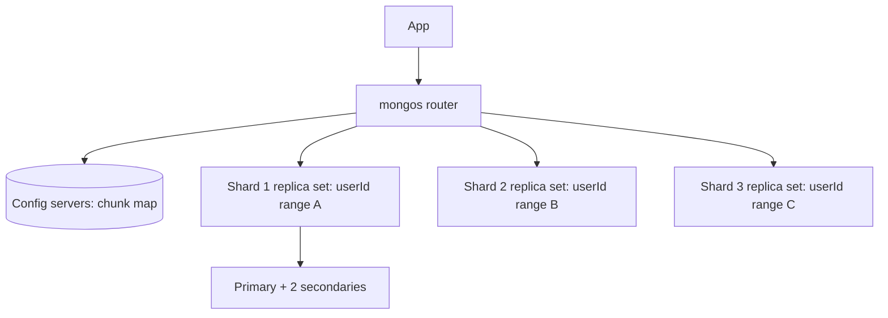
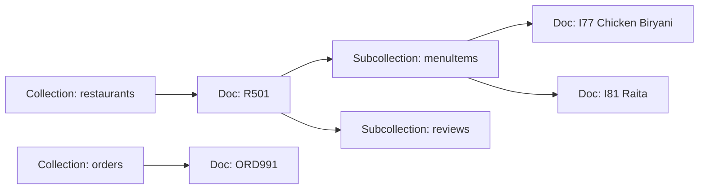

# Document: MongoDB & Firestore

Document database JSON jaise documents store karta hai, isliye ek read me poora object aa jaata hai (order apne items ke saath, restaurant apne menu ke saath), bina joins ke. MongoDB general-purpose wala hai jo tum khud chalate ho ya rent karte ho (Atlas). Firestore Google ka serverless wala hai jisme real-time listeners aur per-read pricing hai. Interview me focus: embed vs reference, schema design, indexes, shard key choice, aur kab document DB galat choice hai.

## ⭐ Document model

**Ek line me:** data documents me store hota hai (MongoDB me BSON, 16 MB tak) jo collections me group hote hain; har document me nested objects aur arrays ho sakte hain aur har ek ki apni shape.

> **Example:** Swiggy ka restaurant document name, address, cuisines, timings aur ratings summary ek jagah rakhta hai. App screen ko bilkul yahi chahiye, to ek read me page render.

```javascript
// collection: restaurants
{
  _id: ObjectId("66fe1a..."),
  name: "Meghana Foods",
  city: "Bangalore",
  cuisines: ["Biryani", "Andhra"],
  location: { type: "Point", coordinates: [77.6101, 12.9352] },
  timings: { open: "11:00", close: "23:30" },
  rating: { avg: 4.4, count: 18234 },
  isOpen: true
}
```

| SQL term | MongoDB term |
|---|---|
| Database | Database |
| Table | Collection |
| Row | Document |
| Column | Field |
| Primary key | `_id` (default ObjectId: timestamp + random + counter) |
| JOIN | Embedding, ya aggregation me `$lookup` |
| Index | Index (WiredTiger me B-tree) |

- **Flexible schema:** ek collection ke do documents me alag fields ho sakte hain. `$jsonSchema` validation se shape enforce bhi kar sakte ho.
- **Per document atomic:** single-document update hamesha atomic hai, chahe nested arrays badle. Isliye acchi modeling saath badalne wala data ek document me rakhti hai.
- **Storage engine:** WiredTiger, B-tree indexes, document-level concurrency aur compression ke saath.

**Interview tip:** "Schemaless matlab schema design nahi?" Nahi. Schema tumhare code aur access patterns me rehta hai. Design reads ke hisaab se hota hai, normalization ke hisaab se nahi.

**Common galti:** MongoDB ko SQL ki tarah use karna: har table ki ek collection, phir bahut saare `$lookup`. Joins ki cost milti hai, relational DB ka optimizer nahi.

## ⭐ Embed vs reference

**Ek line me:** jo data saath padha jaata hai aur parent ka hai use embed karo; jo bada, shared, unbounded ho ya alag se badalta ho use reference karo.

| Sawal | Embed | Reference |
|---|---|---|
| Relationship | One-to-one, one-to-few | One-to-many (bada), many-to-many |
| Saath padha jaata hai? | Lagbhag hamesha | Aksar alag se |
| Growth | Bounded (kuch se kuch sau) | Unbounded (hamesha badhta rahe) |
| Alag se update hota hai? | Kam | Aksar, alag flows se |
| Kai parents share karte hain? | Nahi | Haan (duplication dard dega) |
| Doc size risk | 16 MB se kaafi neeche | 16 MB hit karega |

| Example | Choice | Kyun |
|---|---|---|
| User → addresses (2–5) | Embed array | Chhota, hamesha user ke saath dikhta hai |
| Order → line items | Embed | Order time ka snapshot; baad me nahi badalta |
| Order → restaurant | Reference + name/logo copy | Restaurant badalta hai; order ko sirf snapshot chahiye |
| Restaurant → reviews (lakhs) | Reference (`restaurantId` wala reviews collection) | Unbounded |
| Restaurant → latest 5 reviews | Subset embed | Fast page load (subset pattern) |
| Student ↔ courses | Ids ke reference arrays | Many-to-many |
| Product → current price | Product me embed, cart se reference | Cart ko price changes dikhne chahiye |

```javascript
// Order: items embedded, restaurant referenced kuch copied fields ke saath
{
  _id: "ORD991",
  userId: "U42",
  restaurant: { _id: "R501", name: "Meghana Foods" },   // extended reference
  items: [
    { itemId: "I77", name: "Chicken Biryani", qty: 2, price: 320 },
    { itemId: "I81", name: "Raita", qty: 1, price: 40 }
  ],
  total: 680,
  status: "PLACED",
  createdAt: ISODate("2026-10-03T09:15:00Z")
}
```

**Interview tip:** rule bol ke batao: "Jo saath padha jaata hai wo saath store hota hai. Unbounded arrays apni collection me jaate hain."

**Common galti:** hamesha badhne wala array embed karna (saare comments, user ke saare orders). Document badhta hai, updates slow hote hain, aur aakhir me 16 MB hit.

## Schema design patterns

**Ek line me:** kuch named patterns common document-modeling problems solve karte hain.

| Pattern | Problem | Idea | Example |
|---|---|---|---|
| **Bucket** | Lakhon chhote docs (IoT, time series) | Ek time window ki kai readings ek doc me | Har rider ka har ghante ek doc, 360 GPS pings ke saath |
| **Subset** | Bada doc, page sirf hissa dikhata hai | Hot subset embed, baaki alag collection me | Restaurant doc me latest 5 reviews, saare reviews alag |
| **Extended reference** | Har read pe `$lookup` chahiye | Referenced doc ke kuch kam badalne wale fields copy | Order me restaurant name + logo, sirf id nahi |
| Computed | Har read pe aggregates dobara compute | Precomputed values store, write pe update | Restaurant pe `rating.avg`, `rating.count` |
| Outlier | Kuch docs bahut bade (celebrity) | Flag karke extra docs me overflow | 50k menu combos wale restaurant ke overflow docs |
| Schema versioning | Shape time ke saath badalti hai | `schemaVersion` field, lazily migrate | Purane docs v1, naye v2 |

```javascript
// Bucket pattern: ek ghante ke rider location pings
{
  riderId: "RD7",
  hour: ISODate("2026-10-03T09:00:00Z"),
  count: 3,
  pings: [
    { t: ISODate("2026-10-03T09:00:10Z"), lat: 12.9352, lng: 77.6101 },
    { t: ISODate("2026-10-03T09:00:20Z"), lat: 12.9356, lng: 77.6105 },
    { t: ISODate("2026-10-03T09:00:30Z"), lat: 12.9361, lng: 77.6110 }
  ]
}
```

- MongoDB 5+ me native **time-series collections** bhi hain jo andar bucketing khud karti hain.

**Common galti:** baar-baar badalne wale fields duplicate karna (extended reference). Phir har change hazaron docs tak fan out karna padta hai.

## ⭐ MongoDB shell methods

| Command / method | Kya karta hai | Example |
|---|---|---|
| `insertOne` / `insertMany` | Documents insert | `db.orders.insertOne({ userId: "U42", total: 680 })` |
| `find(filter, projection)` | Filter aur field selection ke saath query | `db.restaurants.find({ city: "Bangalore" }, { name: 1, rating: 1 })` |
| Comparison operators | `$eq $ne $gt $gte $lt $lte $in $nin` | `{ "rating.avg": { $gte: 4 } }` |
| Logical / array operators | `$and $or $not`, `$all $elemMatch $size`, `$exists` | `{ cuisines: { $in: ["Biryani"] } }` |
| `.sort().skip().limit()` | Order aur paginate | `.sort({ "rating.avg": -1 }).limit(20)` |
| `findOne` | Pehla matching doc | `db.users.findOne({ phone: "98xxxx" })` |
| `updateOne` / `updateMany` | Operators ke saath update | `db.orders.updateOne({ _id: "ORD991" }, { $set: { status: "DELIVERED" } })` |
| `$set` / `$unset` | Field set / remove | `{ $set: { isOpen: false } }` |
| `$inc` | Atomic increment | `{ $inc: { "rating.count": 1 } }` |
| `$push` / `$addToSet` / `$pull` | Array append / unique append / remove | `{ $push: { items: { itemId: "I90", qty: 1 } } }` |
| `upsert: true` | Match na ho to insert | `updateOne({ _id: "U42" }, { $setOnInsert: {...} }, { upsert: true })` |
| `findOneAndUpdate` | Atomically update karke doc return | `{ returnDocument: "after" }` |
| `deleteOne` / `deleteMany` | Delete | `db.carts.deleteOne({ userId: "U42" })` |
| `aggregate([...])` | Pipeline: `$match $group $lookup $sort $project $unwind $limit` | neeche dekho |
| `createIndex` | Index banao | `db.orders.createIndex({ userId: 1, createdAt: -1 })` |
| `.explain("executionStats")` | Plan: `IXSCAN` vs `COLLSCAN`, docs examined | `db.orders.find({...}).explain("executionStats")` |
| `bulkWrite` | Ek round trip me kai writes | Bulk menu price update |

```javascript
// Bangalore ke top 10 open biryani places, sirf list ke fields
db.restaurants.find(
  { city: "Bangalore", isOpen: true, cuisines: "Biryani", "rating.avg": { $gte: 4 } },
  { name: 1, "rating.avg": 1, _id: 0 }
).sort({ "rating.avg": -1 }).limit(10);

// Cart me item add, cart na ho to bana do (upsert)
db.carts.updateOne(
  { userId: "U42" },
  { $push: { items: { itemId: "I77", qty: 1 } },
    $setOnInsert: { createdAt: new Date() } },
  { upsert: true }
);

// Aaj ka per restaurant revenue, restaurant name ke saath
db.orders.aggregate([
  { $match: { status: "DELIVERED", createdAt: { $gte: ISODate("2026-10-03") } } },
  { $group: { _id: "$restaurant._id", revenue: { $sum: "$total" }, orders: { $sum: 1 } } },
  { $sort: { revenue: -1 } },
  { $limit: 5 },
  { $lookup: { from: "restaurants", localField: "_id", foreignField: "_id", as: "r" } },
  { $project: { _id: 0, name: { $first: "$r.name" }, revenue: 1, orders: 1 } }
]);
```

- Pipeline me `$match` (aur indexed field pe `$sort`) **pehle** rakho taaki index use ho aur data jaldi chhota ho.
- Bade offsets pe `skip` slow hai; range pagination use karo (`createdAt < lastSeen`).

**Interview tip:** `explain("executionStats")` me `nReturned` ko `totalDocsExamined` se compare karo. 20 returned vs 2 lakh examined = index missing ya galat. `COLLSCAN` = full collection scan.

**Common galti:** operator ke bina `updateOne({ _id }, { status: "X" })`. Purani API me ye poora document replace karta tha; modern drivers ise reject karte hain, par `replaceOne` bilkul yahi karega.

## ⭐ Indexes in MongoDB

**Ek line me:** MongoDB indexes SQL jaise B-trees hain, same leftmost-prefix aur ESR rules ke saath, plus arrays, text, geo aur TTL ke special types.

| Index type | Use | Example |
|---|---|---|
| Single field | Simple filter / sort | `createIndex({ phone: 1 }, { unique: true })` |
| Compound | Multi-field filter + sort (ESR order) | `createIndex({ userId: 1, createdAt: -1 })` |
| Multikey | Field array hai; har element ki ek entry | `createIndex({ cuisines: 1 })` |
| Text | Basic word search | `createIndex({ name: "text" })` |
| 2dsphere | Geo near / within | `createIndex({ location: "2dsphere" })` |
| TTL | Time ke baad auto-delete | `createIndex({ createdAt: 1 }, { expireAfterSeconds: 3600 })` |
| Partial | Sirf matching docs index | `{ partialFilterExpression: { status: "ACTIVE" } }` |
| Hashed | Hashed shard key | `createIndex({ userId: "hashed" })` |

- Covered query: filter aur projection sirf indexed fields use karein (aur `_id` exclude ho ya index me ho), to Mongo index se jawab deta hai (`totalDocsExamined: 0`).
- B-tree, compound aur covering indexes ki details: [Indexes](04-indexes.md).

**Common galti:** do array fields wala compound index. MongoDB ek document me ek se zyada array field pe multikey compound index allow nahi karta.

## ⭐ Transactions, write concern and read concern

**Ek line me:** single-document writes atomic hain; multi-document ACID transactions 4.0 (replica sets) aur 4.2 (sharded) se hain, par slow hain aur exception ke liye hain, norm ke liye nahi.

```javascript
const session = db.getMongo().startSession();
session.startTransaction({ readConcern: { level: "snapshot" }, writeConcern: { w: "majority" } });
try {
  const wallets = session.getDatabase("pay").wallets;
  const ledger  = session.getDatabase("pay").ledger;
  wallets.updateOne({ _id: "U42", balance: { $gte: 680 } }, { $inc: { balance: -680 } });
  ledger.insertOne({ userId: "U42", orderId: "ORD991", amount: -680, at: new Date() });
  session.commitTransaction();
} catch (e) {
  session.abortTransaction();   // TransientTransactionError pe retry
}
```

| Setting | Values | Matlab |
|---|---|---|
| Write concern `w` | `1`, `"majority"`, number | Kitne replicas ack karein. `majority` (5.0 se default) primary failover survive karta hai |
| `j: true` | journal | On-disk journal me likhne ke baad ack |
| Read concern | `local`, `majority`, `snapshot`, `linearizable` | `majority` = sirf wo data jo rollback nahi hoga |
| Read preference | `primary`, `primaryPreferred`, `secondary`, `nearest` | Reads kahan jaayein; secondaries stale ho sakti hain |

- Transactions ki default 60 s limit hai aur ye WiredTiger snapshots pakad ke rakhte hain, to chhote rakho.
- Har jagah transactions chahiye to model shayad Postgres ka hai. Dekho [Transactions & ACID](03-transactions-acid.md).

**Interview tip:** "MongoDB ACID hai?" Single documents ke liye hamesha, aur multi-document transactions 4.0 se. Acchi modeling (embedding) zyada tar multi-doc transactions bacha leti hai.

**Common galti:** `w: 1` se likhna aur secondaries se padhna, phir hairaan hona ki user ko apna update nahi dikha. Read-your-writes ke liye `majority` aur primary se read (ya causal consistency sessions).

## ⭐ Replica sets and sharding

**Ek line me:** replica set = ek primary + secondaries, automatic election ke saath; sharding ek collection ko shard key se kai replica sets me baant-ta hai, aage `mongos` routers.



Replica set:
- Writes **primary** pe jaate hain, **oplog** se secondaries me replicate.
- Primary mara → secondaries election karti hain (Raft jaisa), ~10 s me naya primary. Voting members odd rakho (3 ya 5).

Sharding:
- Data **chunks** me bata hota hai (shard key values ki ranges); balancer chunks ko shards ke beech move karta hai.
- Shard key wali queries ek shard pe **targeted** jaati hain. Bina shard key ke saare shards pe **scatter-gather**.

| Shard key choice | Accha / bura | Kyun |
|---|---|---|
| `{ userId: "hashed" }` | Even writes ke liye accha | Uniform spread; userId pe range queries har jagah jaati hain |
| `{ restaurantId: 1, createdAt: 1 }` | Restaurant ke orders ke liye accha | Targeted queries, restaurant ke andar time range |
| `{ createdAt: 1 }` | Bura | Monotonic: saare inserts last chunk pe (hot shard) |
| `{ status: 1 }` | Bura | Low cardinality: kuch huge chunks jo split nahi ho sakte |
| `{ city: 1 }` | Akela bura | Bangalore shard hot; doosra field jodo |

- Accha shard key = high cardinality, kisi ek value ki low frequency, monotonic nahi, aur zyada tar queries me present. 5.0 se online **reshard** ho sakta hai, par mehenga hai. Dekho [Sharding & consistent hashing](../01-topics/04-sharding-consistent-hashing.md).

**Common galti:** default ObjectId wale `_id` pe sharding. ObjectId time ke saath badhta hai, to har insert ek shard pe. Hashed `_id` ya better key lo.

## ⭐ Firestore model

**Ek line me:** Firestore Google ka serverless document DB hai: documents collections me, unke subcollections ho sakte hain, har query ke peeche index hona zaroori, clients live changes sun sakte hain, aur paisa per document read lagta hai.



| Feature | Kaise kaam karta hai |
|---|---|
| Data model | Collection → document (max 1 MB) → subcollection → document |
| Queries | Equality, range, `in`, `array-contains`, `orderBy`, `limit`, cursors; shallow (query ek collection ya collection group padhti hai) |
| Indexes | Single-field indexes automatic; composite indexes declare karne padte hain (query ko chahiye to console link deta hai) |
| Real-time listeners | `onSnapshot` clients (web/mobile) ko changes push karta hai |
| Offline | Mobile/web SDKs locally cache karke baad me sync |
| Security rules | Har client read/write pe declarative rules check |
| Transactions | ACID transactions aur batched writes (500 ops tak) |
| Pricing | Per document read, write, delete + storage + network |
| Limits | Har document pe ~1 write/sec sustained; high write rate pe sequential IDs avoid |

```javascript
import { collection, query, where, orderBy, limit, onSnapshot, doc, updateDoc, increment } from "firebase/firestore";

// Live order tracking screen: status badle to re-render
const unsub = onSnapshot(doc(db, "orders", "ORD991"), (snap) => {
  render(snap.data().status);   // PLACED -> PREPARING -> OUT_FOR_DELIVERY
});

// City ke top rated open restaurants (composite index city + isOpen + rating chahiye)
const q = query(collection(db, "restaurants"),
  where("city", "==", "Bangalore"), where("isOpen", "==", true),
  orderBy("rating", "desc"), limit(20));

// Counter: atomic server-side increment
await updateDoc(doc(db, "restaurants", "R501"), { likes: increment(1) });
```

```javascript
// firestore.rules: users sirf apne orders padh sakte hain
rules_version = '2';
service cloud.firestore {
  match /databases/{db}/documents {
    match /orders/{orderId} {
      allow read: if request.auth != null && resource.data.userId == request.auth.uid;
      allow write: if false;   // orders sirf backend (Admin SDK) likhta hai
    }
  }
}
```

- **Cost trap:** 500 docs return karne wali query pe listener start pe 500 reads, phir har changed doc pe ek read. Paginate karo aur listeners narrow rakho.
- Hot counters (viral post ke likes): **distributed counters** (N shard docs, read pe sum), kyunki ek doc ~1 write/sec leta hai.
- Real-time UI wale mobile apps aur chhoti teams ke liye Firestore badhiya. Analytics ya heavy server-side aggregation ke liye nahi (BigQuery me export karo).

**Interview tip:** "Firestore har query ke liye index kyun maangta hai?" Taaki har query ki cost result size ke proportional ho, collection size ke nahi. Isi se bina tuning ke scale karta hai.

**Common galti:** security rules ko filter samajhna. Rules filter nahi hain: jo query aise docs la sakti hai jo user nahi padh sakta, wo poori fail hoti hai. Query me khud `where("userId", "==", uid)` hona chahiye.

## When a document DB beats SQL, and when it does not

| Document DB jeet-ta hai | SQL jeet-ta hai |
|---|---|
| Object ek unit ki tarah padha jaata hai (catalog item, profile, CMS page) | Kai entities ke across heavy joins (reports, admin panels) |
| Har item ke fields alag (electronics vs clothes attributes) | Strict relations aur constraints (foreign keys, tables ke across unique) |
| Schema pe fast iteration | Multi-row transactions core hain (payments, ledgers, inventory) |
| Built-in sharding se horizontal scale | Ad-hoc analytical queries |
| Mobile real-time sync (Firestore) | Default me bahut records ke across strong consistency |

- Kai teams dono use karti hain: orders aur payments ke liye Postgres, catalog/menu ke liye MongoDB, search ke liye Elasticsearch. Dekho [SQL vs NoSQL](../01-topics/02-sql-vs-nosql.md) aur [Choosing a Database](01-choosing-a-database.md).
- GIN indexes ke saath Postgres `JSONB` bahut saare "flexible fields chahiye" cases bina doosre database ke cover kar leta hai.

**Interview tip:** kabhi mat bolo "MongoDB kyunki scale karta hai". Bolo "menu ek unit ki tarah padha jaata hai, har item ke attributes alag hain, aur yahan cross-entity transactions nahi hain, isliye document model fit hai; orders aur payments Postgres me rehte hain".

**Common galti:** banking ledger ya many-to-many relations aur reporting wale system ke liye MongoDB chunna. Joins aur constraints app code me dobara banane padte hain.

## ⭐ Example: Swiggy menu and catalog

> **Example:** 3 lakh restaurants, har ek me 50–500 menu items. Item attributes alag-alag (veg/non-veg, spice level, portion sizes, add-ons, combo slots). Menu page 100 ms se kam me load hona chahiye; restaurants din bhar prices aur availability badalte hain.

Access patterns:
1. Restaurant ka poora menu load (bahut high, read-heavy).
2. Item availability toggle / price change (restaurant app se baar-baar chhote writes).
3. Cart screen pe ek item add-ons ke saath.
4. Restaurants ke across dish search (Elasticsearch me jaata hai, Mongo me nahi).

Model:
- `restaurants` collection: restaurant info + **categories with embedded items** (bounded: kuch sau items). Ek read = poora menu page.
- Add-on groups har item ke andar embedded (chhote, item ke apne).
- Hazaron items wale outlier restaurants (cloud kitchens) ke liye har category ka alag doc (**outlier / bucket by category**).
- Orders order time ke item name aur price ka **extended reference** snapshot rakhte hain.

```javascript
{
  _id: "R501",
  name: "Meghana Foods",
  city: "Bangalore",
  menuVersion: 87,
  categories: [
    { name: "Biryani", items: [
      { itemId: "I77", name: "Chicken Boneless Biryani", price: 320, veg: false,
        available: true, spice: "medium",
        addons: [{ group: "Extras", options: [{ name: "Extra raita", price: 40 }] }] }
    ]}
  ]
}
```

```javascript
// Restaurant app ek item out of stock karta hai: single-document atomic update
db.restaurants.updateOne(
  { _id: "R501", "categories.items.itemId": "I77" },
  { $set: { "categories.$[].items.$[it].available": false }, $inc: { menuVersion: 1 } },
  { arrayFilters: [{ "it.itemId": "I77" }] }
);
db.restaurants.createIndex({ city: 1, "categories.items.itemId": 1 });
```

- Menu ko Redis/CDN me `R501:v87` key se cache karo; har edit pe `menuVersion` badhao taaki cache saaf invalidate ho. Dekho [Caching](../01-topics/05-caching.md).
- Change streams (`db.restaurants.watch()`) edits ko dish search ke liye Elasticsearch me bhejte hain. Dekho [Search indexing](../01-topics/14-search-indexing.md).
- Shard key `{ _id: "hashed" }` (restaurant id): har menu read ek shard pe targeted.
- Orders, payments aur refunds Postgres me, kyunki unhe cross-row transactions chahiye. Dekho [Food delivery](../02-questions/t2-14-food-delivery.md).

**Interview tip:** boundary samjhao: catalog document DB me (unit ki tarah read, flexible attributes), transactions SQL me, search Elasticsearch me, cache Redis me.

## Kin system design questions me

- [SQL vs NoSQL](../01-topics/02-sql-vs-nosql.md): data model chunna
- [Food delivery](../02-questions/t2-14-food-delivery.md): menus aur catalog
- [Instagram](../02-questions/t2-13-instagram.md): user profiles, post metadata
- [E-commerce inventory](../02-questions/t2-24-ecommerce-inventory.md): alag attributes wala product catalog
- [Google Docs](../02-questions/t2-19-google-docs.md): document metadata, real-time listeners ka idea
- [Sharding & consistent hashing](../01-topics/04-sharding-consistent-hashing.md): shard key choice

## Checklist

- [ ] Document model samjha ke SQL terms ko MongoDB terms se map kar sakta hoon
- [ ] Kisi relationship ke liye embed vs reference decide karke growth aur access pattern se justify kar sakta hoon
- [ ] Bucket, subset aur extended reference patterns bata ke laga sakta hoon
- [ ] MongoDB find, $set/$inc/$push wala updateOne, upsert aur aggregate pipeline likh sakta hoon
- [ ] Explain output padh ke compound, multikey aur TTL indexes design kar sakta hoon
- [ ] Multi-document transactions, write concern majority aur read preference ke trade-offs samjha sakta hoon
- [ ] Replica set failover samjha ke monotonic keys se bachte hue accha shard key chun sakta hoon
- [ ] Firestore collections, composite indexes, listeners, security rules aur per-read pricing samjha sakta hoon
- [ ] Swiggy menu example ke saath bata sakta hoon kab document DB SQL se better hai aur kab nahi
