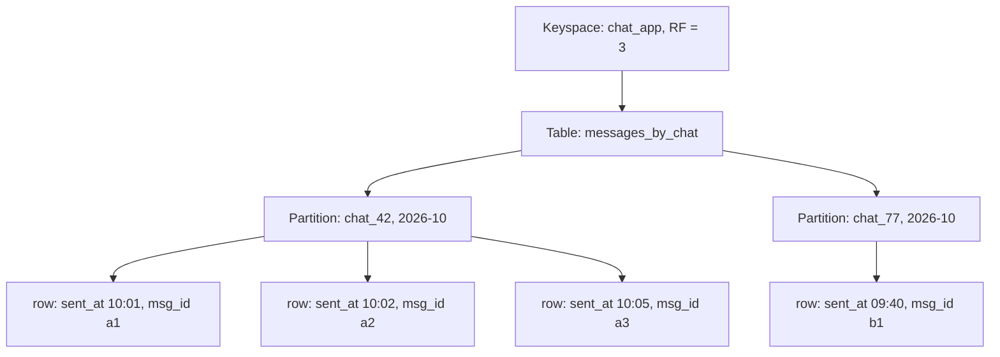
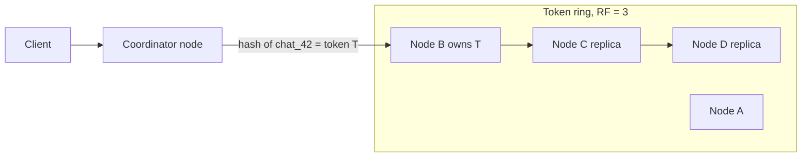
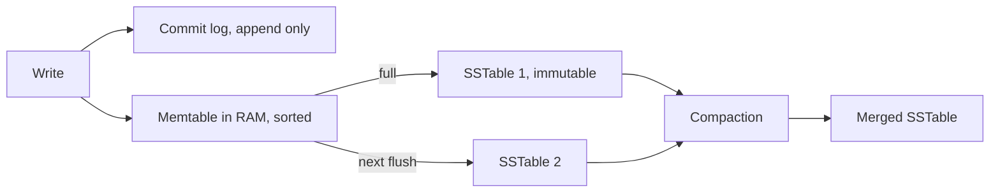

# Wide-column: Cassandra & ScyllaDB

Cassandra ek distributed, masterless, write-heavy database hai. Data partition key se nodes pe bant jaata hai, aur partition ke andar rows clustering columns se sorted rehti hain. Interview me ye tab aata hai jab writes bahut zyada hon (chat messages, events, IoT, activity feed) aur access pattern pehle se pata ho.

## ⭐ Data model: keyspace, table, partition, clustering

**Ek line me:** keyspace = database (replication setting yahan), table = rows ka group, partition key decide karti hai row kis node pe jaayegi, clustering columns decide karte hain partition ke andar order.

- **Keyspace:** SQL ka "database". Replication strategy aur replication factor (RF) yahin set hota hai.
- **Table:** columns fixed schema ke saath (CQL me schema hota hai). "Wide-column" naam isliye ki ek partition me hazaaron-laakhon rows (cells) ho sakti hain.
- **Primary key = partition key + clustering columns.** `PRIMARY KEY ((chat_id, bucket), sent_at, msg_id)`.
  - **Partition key** `(chat_id, bucket)` hash hoti hai (Murmur3) aur token banta hai. Token se node milta hai.
  - **Clustering columns** `sent_at, msg_id` partition ke andar disk pe sorted order define karte hain. Range query inhi pe chalti hai.
- **Wide partition:** ek partition key ke neeche bahut saari rows. Ye feature hai (ek disk read me ek chat ke latest 50 messages), par limit me: partition ~100 MB aur ~1 lakh rows se neeche rakho.



| Concept | SQL me equivalent | Cassandra me kya alag |
|---|---|---|
| Keyspace | Database / schema | Replication yahin define hota hai |
| Partition key | Shard key | Hash hoke node decide karti hai, query me dena zaroori |
| Clustering column | Index + ORDER BY | Disk pe hi sorted, range query free |
| Row | Row | Sparse ho sakti hai, null cells store nahi hote |

**Interview tip:** "Partition key aur clustering key me fark?" Partition key = data **kahan** (kis node pe). Clustering key = partition ke andar **kis order** me. Query me partition key equality se deni hi padti hai.

**Common galti:** low-cardinality partition key chunna (jaise `country` ya `status`). Saara India ka data ek partition me, ek node hot ho jaata hai.

## ⭐ Query-first modeling: one table per query

**Ek line me:** SQL me pehle entities banate ho phir query likhte ho; Cassandra me pehle queries list karo, phir har query ke liye ek table banao. Joins nahi hain, isliye denormalize karo.

Steps:
1. Saari access patterns likho: "chat ke latest 50 messages", "user ki chat list latest activity se sorted".
2. Har query ke liye table: partition key = jo equality se filter ho raha hai, clustering = jis pe sort/range chahiye.
3. Same data multiple tables me likho (write amplification theek hai, writes sasti hain).

**Real example: WhatsApp messages.** Query: "chat X ke latest messages, scroll pe purane". Ek popular group me saalon ke messages ek partition me daale to partition unbounded ho jaayega. Isliye **time bucket** add karo (month ya day).

```sql
-- Query 1: ek chat ke messages, latest pehle
CREATE TABLE messages_by_chat (
    chat_id   uuid,
    bucket    text,          -- '2026-10' (month bucket)
    sent_at   timestamp,
    msg_id    timeuuid,
    sender_id uuid,
    body      text,
    PRIMARY KEY ((chat_id, bucket), sent_at, msg_id)
) WITH CLUSTERING ORDER BY (sent_at DESC, msg_id DESC);

-- Query 2: user ki chat list, latest activity pehle
CREATE TABLE chats_by_user (
    user_id      uuid,
    last_msg_at  timestamp,
    chat_id      uuid,
    last_preview text,
    PRIMARY KEY ((user_id), last_msg_at, chat_id)
) WITH CLUSTERING ORDER BY (last_msg_at DESC, chat_id ASC);

-- Read: latest 50 messages is mahine ke
SELECT sender_id, body, sent_at FROM messages_by_chat
WHERE chat_id = 4f1c... AND bucket = '2026-10'
LIMIT 50;

-- Scroll up: pichhle page se purane
SELECT * FROM messages_by_chat
WHERE chat_id = 4f1c... AND bucket = '2026-10'
  AND sent_at < '2026-10-03 10:00:00'
LIMIT 50;
```

Bucket khatam (is mahine me 50 nahi mile) to app pichhle bucket `'2026-09'` pe query karta hai.

`chats_by_user` me ek dikkat: `last_msg_at` clustering column hai, update nahi ho sakta. Naya message aaye to purani row delete + nayi insert karni padti hai (tombstone banta hai). Isliye kai systems chat list ko Redis/cache me rakhte hain.

**Interview tip:** bolo "Pehle main access patterns likhta hoon, phir har pattern ke liye table. Partition size bounded rakhne ke liye time bucket." Ye line interviewer ko signal deti hai ki tumne Cassandra real me samjha hai.

**Common galti:** normalized SQL schema copy karke Cassandra me daal dena, phir `ALLOW FILTERING` se query chalana.

## ⭐ Ring, consistent hashing and vnodes

**Ek line me:** saare nodes ek token ring pe hain; partition key ka Murmur3 hash ek token deta hai, aur ring pe clockwise pehla node owner hota hai. Koi master nahi.

- Token range: -2^63 se 2^63-1. Har node kuch ranges ka owner.
- **Vnodes (virtual nodes):** har physical node ring pe ek nahi, kai (jaise 16 ya 256) chhoti ranges leta hai. Fayda: naya node aaye ya jaaye to load sab nodes se thoda-thoda shift hota hai, ek neighbour pe nahi. Heterogeneous hardware pe zyada vnodes de sakte ho.
- **Coordinator:** client kisi bhi node se baat kare, wo coordinator ban jaata hai aur sahi replicas tak request bhejta hai. Token-aware drivers seedha replica pe bhejte hain.
- **Gossip:** nodes har second aapas me state share karte hain (kaun up, kaun down). Failure detection isse hota hai.
- **Snitch:** batata hai kaunsa node kis rack/datacenter me hai, taaki replicas alag racks me jaayein.



Detail ke liye: [Sharding & consistent hashing](../01-topics/04-sharding-consistent-hashing.md).

**Interview tip:** "Cassandra me single point of failure?" Nahi. Masterless hai; har node barabar hai, koi bhi coordinator ban sakta hai.

**Common galti:** sochna ki Cassandra me sharding manually karni padti hai. Partition key do, ring khud distribute karta hai.

## ⭐ Replication factor and tunable consistency

**Ek line me:** RF = har partition ki kitni copies; consistency level (CL) = har read/write pe kitne replicas ka jawab chahiye. Isse tum har query pe latency vs consistency choose karte ho.

```sql
CREATE KEYSPACE chat_app
WITH replication = {'class': 'NetworkTopologyStrategy', 'mumbai': 3, 'singapore': 3};
```

| Consistency level | Matlab (RF = 3) | Kab use |
|---|---|---|
| `ONE` | 1 replica ka ack | Fast, logs/metrics, stale chalega |
| `QUORUM` | majority, 2 of 3 (saare DCs milake) | Default strong-ish |
| `LOCAL_QUORUM` | local DC me majority | Multi-DC me sabse common |
| `ALL` | saare 3 | Ek bhi down to fail, rarely use |
| `EACH_QUORUM` | har DC me quorum (writes) | Strict multi-DC writes |

**R + W > N rule:** N = RF, W = write CL ke replicas, R = read CL ke replicas. Agar `R + W > N` to read aur write sets overlap karte hain, aur read ko latest write dikhegi.
- RF 3, `QUORUM` write (2) + `QUORUM` read (2) = 4 > 3. Strong read.
- `ONE` + `ONE` = 2, not > 3. Eventual consistency.

Replica down ho to kya:
- **Hinted handoff:** coordinator missed write ka "hint" rakhta hai, node wapas aaye to bhej deta hai.
- **Read repair:** read ke time replicas me mismatch mila to latest (timestamp se) wapas likh deta hai.
- **Anti-entropy repair (`nodetool repair`):** Merkle trees compare karke background me sync. Regular chalana zaroori.

Conflict resolution: **last-write-wins** by cell timestamp. Vector clocks nahi. Clock skew hua to galat value jeet sakti hai.

Theory: [CAP & consistency](../01-topics/06-cap-consistency.md). Cassandra by default AP side pe hai.

**Interview tip:** "Cassandra strongly consistent ho sakta hai?" Haan, per-query `QUORUM`/`QUORUM` se read-your-writes milta hai. Par transactions/isolation nahi milta; ye linearizable multi-row nahi hai.

**Common galti:** multi-DC me `QUORUM` use karna. Cross-DC latency har request pe lagegi; `LOCAL_QUORUM` lo.

## ⭐ Write path and read path

**Ek line me:** write = commit log me append + memtable (RAM) me daalo, done. Memtable bhar jaaye to immutable SSTable disk pe flush. Ye LSM tree hai, isliye writes bahut fast hain.



**Write path:**
1. Commit log me sequential append (crash recovery ke liye).
2. Memtable me insert (sorted by partition + clustering).
3. Client ko ack. Disk pe random write nahi hua, isliye fast.
4. Memtable full hone pe SSTable flush. SSTable kabhi modify nahi hoti.
5. Update aur delete bhi naye writes hain (delete = tombstone).

**Read path:** ek partition ka data memtable + kai SSTables me bikhra ho sakta hai, isliye read mehenga.
1. Memtable check.
2. Har SSTable ke liye **bloom filter** (RAM): "ye partition is file me pakka nahi hai" bata deta hai. False positive ho sakta hai, false negative nahi.
3. **Key cache / partition summary / partition index** se SSTable me offset mila.
4. Data read, saare versions merge, latest timestamp jeetta hai.

**Compaction strategies:**

| Strategy | Kaise | Best for | Downside |
|---|---|---|---|
| STCS (Size-Tiered) | Same size ki SSTables merge | Write-heavy, default | Read me kai files, compaction ke time 2x disk space |
| LCS (Leveled) | Levels, har level me non-overlapping files | Read-heavy, updates zyada | Zyada write amplification, IO |
| TWCS (Time-Window) | Time window ki SSTables saath, purani window dobara compact nahi | Time-series + TTL data | Out-of-order writes/updates pe kharab |

Newer versions me UCS (Unified Compaction Strategy) bhi hai, par interview me ye teen kaafi hain.

**Interview tip:** "Cassandra writes fast kyun?" Sequential commit log append + memory write, koi read-before-write nahi, koi in-place update nahi. B-tree vs LSM: [Indexes](04-indexes.md).

**Common galti:** read-heavy workload ko Cassandra pe daal ke STCS chhod dena. Read latency kharab hogi; LCS socho ya dusra DB.

## ⭐ Tombstones and their problems

**Ek line me:** Cassandra delete turant nahi karta; ek tombstone marker likhta hai jo `gc_grace_seconds` (default 10 din) baad compaction me hi hatta hai.

Kyun? Agar ek replica down tha aur delete miss kar gaya, to tombstone ke bina wo purana data wapas "zinda" kar dega (zombie data). Tombstone sab replicas tak pahunchne ka time deta hai.

Tombstone kahan bante hain:
- `DELETE` statement
- TTL expire hona
- `null` value insert karna (haan, `INSERT ... body = null` bhi tombstone hai)
- Collection (list/set/map) ko poora overwrite karna

Problems:
- Read ko tombstones bhi scan karne padte hain. Queue jaisa pattern (insert, phir delete) me ek partition me lakhon tombstones ho jaate hain, read slow.
- `tombstone_warn_threshold` (1000) aur `tombstone_failure_threshold` (100000) cross hone pe query fail.
- Repair `gc_grace_seconds` se pehle nahi chala to deleted data wapas aa sakta hai.

Bachav:
- Cassandra ko queue ki tarah use mat karo.
- Time-series me TTL + TWCS, taaki poori SSTable ek saath drop ho.
- Nulls insert mat karo; column chhod do.
- Time bucket rakho taaki purane partitions kabhi read hi na hon.

**Interview tip:** "Delete ke baad bhi disk space kyun nahi ghata?" Tombstone + gc_grace + compaction. Space compaction ke baad hi free hota hai.

**Common galti:** job queue ya "pending orders" list Cassandra me banana jahan rows lagatar delete hoti hain.

## ⭐ CQL commands

**Ek line me:** CQL SQL jaisa dikhta hai, par sirf wahi queries allow karta hai jo partition key se efficiently chal sakein.

| Command / method | Kya karta hai | Example |
|---|---|---|
| `CREATE KEYSPACE` | Keyspace + replication | `CREATE KEYSPACE app WITH replication = {'class':'NetworkTopologyStrategy','dc1':3};` |
| `CREATE TABLE ... PRIMARY KEY ((pk), ck)` | Partition + clustering define | `PRIMARY KEY ((chat_id, bucket), sent_at)` |
| `WITH CLUSTERING ORDER BY` | Disk pe sort order | `WITH CLUSTERING ORDER BY (sent_at DESC)` |
| `INSERT ... USING TTL` | Auto-expire row | `INSERT INTO otp (phone, code) VALUES ('98..', '4821') USING TTL 300;` |
| `UPDATE` | Upsert (row na ho to bana deta hai) | `UPDATE users SET name='Riya' WHERE id=...;` |
| `SELECT` with pk + range | Partition + clustering range | `WHERE chat_id=? AND bucket=? AND sent_at > ?` |
| `ALLOW FILTERING` | Bina proper key ke scan allow | Avoid; poora cluster scan ho sakta hai |
| `IF NOT EXISTS` (LWT) | Paxos se compare-and-set | `INSERT INTO usernames (name, uid) VALUES ('vaibhav', ?) IF NOT EXISTS;` |
| `UPDATE ... IF` (LWT) | Conditional update | `UPDATE seats SET owner=? WHERE show=? AND seat=? IF owner = null;` |
| `BEGIN BATCH ... APPLY BATCH` | Multiple writes atomic (logged) | Denormalized tables sync rakhna |
| `CREATE MATERIALIZED VIEW` | Auto-maintained alternate table | Experimental, production me caution |
| `CREATE INDEX` (secondary) | Local index per node | Low-cardinality pe bhi har node query, mehenga |

```sql
-- OTP 5 minute me khud expire
INSERT INTO otp_by_phone (phone, code, created_at)
VALUES ('9876543210', '482193', toTimestamp(now()))
USING TTL 300;

-- Username unique: lightweight transaction (Paxos, 4 round trips)
INSERT INTO users_by_username (username, user_id)
VALUES ('vaibhav', 9b2e...) IF NOT EXISTS;
-- result: [applied] = true / false

-- Ek message ko do tables me likhna: logged batch
BEGIN BATCH
  INSERT INTO messages_by_chat (chat_id, bucket, sent_at, msg_id, sender_id, body)
  VALUES (4f1c..., '2026-10', '2026-10-03 10:05:00', now(), 77aa..., 'hi');
  INSERT INTO chats_by_user (user_id, last_msg_at, chat_id, last_preview)
  VALUES (77aa..., '2026-10-03 10:05:00', 4f1c..., 'hi');
APPLY BATCH;

-- Ye fail hoga: partition key nahi di
SELECT * FROM messages_by_chat WHERE sender_id = 77aa...;
-- "Cannot execute this query ... use ALLOW FILTERING"
```

**ALLOW FILTERING kyun avoid:** Cassandra ko pata nahi data kis partition me hai, to wo saare nodes ki saari partitions scan karta hai aur filter karta hai. Chhote dev data pe chal jaata hai, production me timeout. Sahi fix: us query ke liye nayi table.

**BATCH ka sach:** logged batch atomicity deta hai (sab apply honge, eventually), isolation nahi. Ye performance tool nahi hai. Alag-alag partitions ke 1000 rows ek batch me daalna coordinator pe load daalta hai. Same partition ke rows ka unlogged batch theek hai.

**LWT:** Paxos use karta hai, normal write se ~4x slow. Sirf uniqueness/compare-and-set ke liye (username, seat booking), har write ke liye nahi.

**Materialized views:** Cassandra me experimental flag ke peeche hain, base aur view out of sync ho sakte hain. Production me log khud app se dusri table me likhte hain.

**Interview tip:** "Cassandra me unique username kaise?" `IF NOT EXISTS` LWT. Bolo ki ye Paxos hai aur mehenga hai, isliye sirf signup pe.

**Common galti:** BATCH ko "bulk insert fast karne" ke liye use karna.

## ScyllaDB vs Cassandra

**Ek line me:** ScyllaDB Cassandra ka C++ rewrite hai, same CQL aur data model, par shard-per-core architecture se kam nodes me zyada throughput aur stable p99.

| Point | Cassandra | ScyllaDB |
|---|---|---|
| Language | Java (JVM) | C++ (Seastar framework) |
| GC pauses | Ho sakte hain, p99 spikes | Nahi |
| Threading | Shared threads | Shard-per-core, har core apna data, no locks |
| Compatibility | Original | CQL + Cassandra drivers compatible, DynamoDB-compatible API (Alternator) bhi |
| Tuning | Kaafi manual | Zyada auto-tuning |
| Example | Netflix, Apple, Instagram (pehle) | Discord (Cassandra se migrate kiya) |

Discord ne trillions messages Cassandra se ScyllaDB pe shift kiye, GC pauses aur hot partitions ki wajah se. Dekho [Discord](../02-questions/t2-25-discord.md).

**Interview tip:** "Cassandra choose kiya, par latency p99 issue?" ScyllaDB drop-in option bolo, same data model.

**Common galti:** sochna ScyllaDB data model problems (bad partition key) fix kar dega. Hot partition dono me hot hai.

## HBase and Bigtable

**Ek line me:** ye bhi wide-column hain, par Cassandra se alag: master-based, strongly consistent per row, aur row key pe sorted (range scans across keys possible).

- **Google Bigtable:** original paper (2006). Row key sorted, tablets me split. Strong consistency single-cluster me. Google Analytics, Maps, time-series ke liye.
- **HBase:** Bigtable ka open-source clone, HDFS ke upar, ZooKeeper + HMaster. Hadoop ecosystem me.
- **Fark:** Cassandra hash partitioning (range scan sirf partition ke andar), Bigtable/HBase range partitioning (row key prefix pe scan, par sequential keys se hotspot). Cassandra masterless AP, HBase CP.

**Interview tip:** Bigtable me row key design = Cassandra partition key design. Timestamp prefix mat do (hotspot); `device_id#reverse_timestamp` jaisa do.

**Common galti:** HBase aur Cassandra ko same bolna. Consistency model aur partitioning dono alag hain.

## ⭐ Cassandra vs DynamoDB

**Ek line me:** dono Dynamo paper se inspired, partition key + sort key model, par DynamoDB fully managed hai aur Cassandra tum khud chalate ho (ya Astra/Keyspaces).

| Point | Cassandra / ScyllaDB | DynamoDB |
|---|---|---|
| Hosting | Self-managed (ya Astra, AWS Keyspaces) | Fully managed, serverless |
| Keys | Partition key (composite) + multiple clustering columns | Partition key + ek sort key |
| Query language | CQL | API (`GetItem`, `Query`, `PutItem`), PartiQL |
| Consistency | Tunable per query (ONE...ALL) | Eventual ya strongly consistent read |
| Transactions | LWT (single partition), logged batch | `TransactWriteItems`, multi-item ACID (100 items tak) |
| Secondary index | Weak (local), MV experimental | GSI / LSI first-class |
| Multi-region | Multi-DC built-in, active-active | Global Tables |
| Cost model | Hardware/ops, predictable at scale | Per request/capacity; bahut high throughput pe mehenga |
| TTL | Per row/cell | Per item |
| Vendor lock-in | Nahi, open source | AWS only |

Details: [Key-Value: Redis & DynamoDB](05-key-value.md).

**Interview tip:** "Startup ho, chhoti team" to DynamoDB (ops zero). "Huge scale, multi-cloud ya cost control" to Cassandra/Scylla.

**Common galti:** DynamoDB ko "managed Cassandra" bolna. Internals alag hain (Paxos-based replication groups, ek leader per partition).

## ⭐ When to use and when not

**Use karo jab:**
- Writes bahut zyada (lakhon/sec): chat messages, activity logs, IoT sensor data, click events.
- Access patterns pehle se fixed aur key-based hon.
- Linear horizontal scale aur multi-DC/always-on chahiye (node down ho to bhi writes chalein).
- Time-series jaisa data, TTL ke saath.

**Mat use karo jab:**
- **Ad-hoc queries** chahiye ("kisi bhi column pe filter"): analytics ke liye OLAP ([Columnar](12-columnar-olap.md)), search ke liye Elasticsearch.
- **Joins, aggregations** (GROUP BY, SUM across partitions) chahiye.
- **Strong consistency + multi-row transactions** chahiye: payments, wallet balance, inventory. Postgres ya NewSQL lo.
- Data chhota hai (kuch GB). Postgres simple hai aur kaafi hai.
- Bahut updates/deletes wala, queue jaisa workload (tombstones).

| Kin system design questions me | Kyun |
|---|---|
| [WhatsApp chat](../02-questions/t1-04-whatsapp-chat.md) | Messages by chat_id + time, heavy writes |
| [Discord](../02-questions/t2-25-discord.md) | Messages by channel + bucket, Scylla migration |
| [News feed](../02-questions/t1-03-news-feed.md) | Precomputed feed per user |
| [Ad click aggregator](../02-questions/t2-17-ad-click-aggregator.md) | Raw click events store |
| [Distributed logging](../02-questions/t2-26-distributed-logging.md) | Append-only log events, TTL |
| [Distributed KV store](../02-questions/t2-20-distributed-kv-store.md) | Ring, replication, quorum, hinted handoff wahi design hai |
| [Notification system](../02-questions/t1-09-notification-system.md) | Notification history per user |

Comparison: [SQL vs NoSQL](../01-topics/02-sql-vs-nosql.md), [Choosing a Database](01-choosing-a-database.md).

**Interview tip:** Cassandra choose karte waqt ek line me partition key aur clustering key bolo, aur "partition bounded rakhne ke liye bucket" zaroor bolo.

**Common galti:** sirf "scale chahiye" bol ke Cassandra le lena, bina access pattern bataye.

## Checklist

- [ ] Partition key aur clustering columns ka fark aur `PRIMARY KEY ((pk), ck)` syntax samjha sakta hoon
- [ ] Query-first modeling se WhatsApp messages table time bucket ke saath design kar sakta hoon
- [ ] Token ring, vnodes, coordinator aur gossip samjha sakta hoon
- [ ] RF, consistency levels aur R + W > N rule example ke saath bata sakta hoon
- [ ] Write path (commit log, memtable, SSTable) aur read path (bloom filter, partition index) bata sakta hoon
- [ ] STCS, LCS, TWCS me se workload ke hisaab se choose kar sakta hoon
- [ ] Tombstones kyun bante hain aur unki problems bata sakta hoon
- [ ] ALLOW FILTERING, BATCH, LWT aur materialized views ke pitfalls bata sakta hoon
- [ ] Cassandra vs DynamoDB aur kab Cassandra nahi lena, bata sakta hoon
