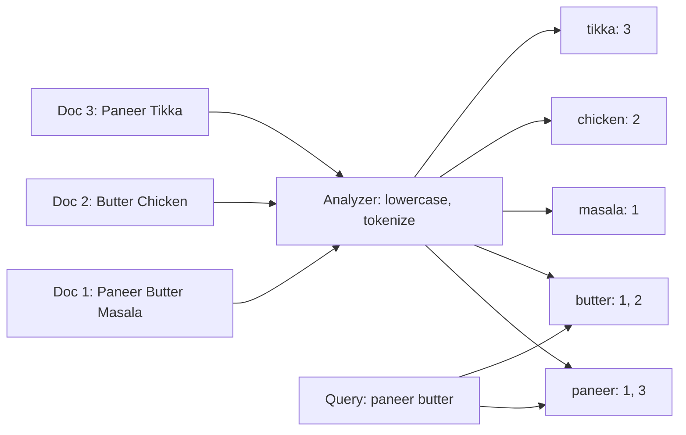
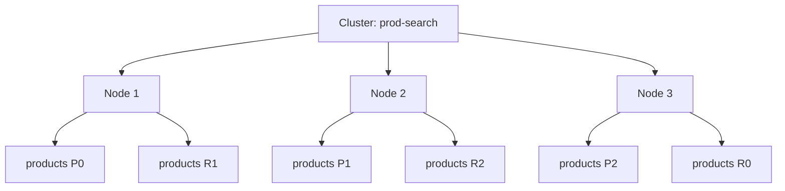
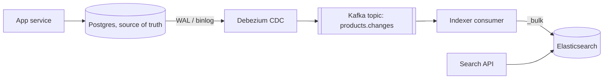

# Search: Elasticsearch

Elasticsearch (ES) ek distributed search aur analytics engine hai, Apache Lucene ke upar. Full-text search, typo-tolerant search, filters + facets, aur logs analytics ke liye ye default choice hai. Interview me jab bhi "search bar" ya "logs search" aaye, ES ka naam lo, par saath me ye bhi bolo ki ye primary database nahi hai.

## ⭐ Inverted index

**Ek line me:** har word (term) se un documents ki list jinme wo word aata hai. Book ke end wala index jaisa: word dekho, page numbers milo.

Normal DB: document → words. Inverted index: word → documents. Isliye "jinme 'paneer' aata hai" wali query `LIKE '%paneer%'` ki tarah full scan nahi karti, seedha posting list padhti hai.

Example: Swiggy dishes.
- Doc 1: "Paneer Butter Masala"
- Doc 2: "Butter Chicken"
- Doc 3: "Paneer Tikka"



Query "paneer butter": `paneer → {1,3}`, `butter → {1,2}`. Doc 1 dono me hai, isliye sabse upar. Posting list me term frequency aur positions bhi hote hain (phrase search ke liye).

Lucene internals jo interview me kaam aate hain:
- Index **segments** me banta hai. Segment immutable hai (LSM jaisa). Naye docs naye segment me, background me merge.
- Delete = doc ko "deleted" mark karna; space merge pe free hota hai. Update = delete + reinsert.
- `keyword`/numeric fields ke liye **doc values** (columnar storage) bante hain: sorting aur aggregations inhi se.

**Interview tip:** "SQL `LIKE '%x%'` se search kyun nahi?" Leading wildcard pe B-tree index use nahi hota, full table scan. Relevance ranking, typo tolerance, stemming bhi nahi milta.

**Common galti:** sochna ES document ko "scan" karke search karta hai. Wo index time pe kaam karta hai (analyze + inverted index), query time pe sirf lookup.

## ⭐ Analyzers and tokenizers

**Ek line me:** analyzer text ko terms me todta hai: character filters → tokenizer → token filters. Wahi analyzer index time aur query time dono pe chalna chahiye.

| Step | Kya karta hai | Example |
|---|---|---|
| Character filter | Raw text saaf | HTML tags hatao, `&` ko `and` |
| Tokenizer | Text ko tokens me todo | `standard`: words pe; `whitespace`; `ngram`; `edge_ngram` |
| Token filter | Tokens badlo | `lowercase`, `stop` (the, is), `stemmer` (running → run), `synonym` (mobile = phone), `asciifolding` |

- **Standard analyzer** (default): standard tokenizer + lowercase.
- **Edge n-gram:** "paneer" → `p, pa, pan, pane, panee, paneer`. Autocomplete / search-as-you-type ke liye.
- **Synonyms:** "chole" = "chana", "mobile" = "phone". Flipkart jaisi search me bahut kaam aata hai.
- Indian context: Hindi/Hinglish ke liye `icu_tokenizer` plugin, aur spelling variants ("paneer", "panir") ke liye synonyms + fuzzy.

```json
PUT /dishes
{
  "settings": {
    "analysis": {
      "filter": {
        "autocomplete_filter": { "type": "edge_ngram", "min_gram": 2, "max_gram": 15 },
        "food_synonyms": { "type": "synonym", "synonyms": ["chole, chana", "curd, dahi"] }
      },
      "analyzer": {
        "autocomplete": {
          "tokenizer": "standard",
          "filter": ["lowercase", "autocomplete_filter"]
        },
        "food_text": {
          "tokenizer": "standard",
          "filter": ["lowercase", "food_synonyms"]
        }
      }
    }
  }
}
```

Test karne ke liye: `POST /dishes/_analyze { "analyzer": "autocomplete", "text": "Paneer" }`.

**Interview tip:** autocomplete ke liye index time pe `edge_ngram` analyzer, query time pe `standard` (`search_analyzer`). Warna query bhi n-grams me tootegi aur galat matches aayenge.

**Common galti:** mapping banne ke baad analyzer badalna. Existing field ka analyzer change nahi hota; nayi index banao aur `_reindex` karo.

## ⭐ Mapping: text vs keyword

**Ek line me:** mapping = ES ka schema. `text` analyze hota hai (full-text search ke liye), `keyword` exact value rehta hai (filter, sort, aggregation ke liye).

| Type | Analyze hota hai? | Use | Example field |
|---|---|---|---|
| `text` | Haan | Full-text search, relevance | `name`, `description` |
| `keyword` | Nahi | Exact match, sort, aggs, terms | `city`, `status`, `brand`, `email` |
| `integer`, `float`, `scaled_float` | Nahi | Range, sort | `price`, `rating` |
| `date` | Nahi | Range, date_histogram | `created_at` |
| `geo_point` | Nahi | Distance search | `location` |
| `nested` | - | Array of objects jahan har object alag match ho | `variants` |

Ek field dono ho sakti hai (**multi-field**): `name` text + `name.raw` keyword.

```json
PUT /products
{
  "mappings": {
    "dynamic": "strict",
    "properties": {
      "name":       { "type": "text", "fields": { "raw": { "type": "keyword" } } },
      "brand":      { "type": "keyword" },
      "category":   { "type": "keyword" },
      "price":      { "type": "scaled_float", "scaling_factor": 100 },
      "rating":     { "type": "float" },
      "in_stock":   { "type": "boolean" },
      "created_at": { "type": "date" },
      "suggest":    { "type": "text", "analyzer": "autocomplete", "search_analyzer": "standard" }
    }
  }
}
```

- **Dynamic mapping:** naya field aaye to ES khud type guess karta hai (string → text + keyword). Production me `"dynamic": "strict"` ya templates use karo; warna logs me "mapping explosion" (hazaaron fields) ho jaata hai.
- Field ka type baad me change nahi hota. Naya index + reindex.

**Interview tip:** "`status` pe `match` query kyun galat result de rahi?" `status` text tha, analyze ho gaya. Filter/aggregation wale fields `keyword` rakho.

**Common galti:** `term` query `text` field pe chalana. "Paneer Tikka" index me `paneer`, `tikka` ban gaya; `term: "Paneer Tikka"` kuch match nahi karega.

## ⭐ Relevance scoring: BM25 basics

**Ek line me:** ES har matching doc ko `_score` deta hai, default algorithm BM25: term jitna rare aur doc me jitna zyada, score utna zyada, par saturation ke saath.

BM25 ke teen ingredients:
1. **TF (term frequency):** doc me term kitni baar. Par saturate hota hai (parameter `k1`, default 1.2): 10 baar "paneer" likhne se 10x score nahi milta.
2. **IDF (inverse document frequency):** term kitne docs me hai. "paneer" rare hai to zyada weight; "the" har jagah hai to almost zero.
3. **Field length normalization** (parameter `b`, default 0.75): chhoti field me match zyada important. Title "Paneer Tikka" me match > 500 words description me match.

Score ko tune karne ke tareeke:
- **Boost:** `"fields": ["name^3", "description"]` (name 3x important).
- **function_score:** rating, popularity, distance ko score me milao. Swiggy: text match + restaurant rating + distance.
- **filter context:** filter ka score nahi banta aur cache hota hai. Jo relevance pe asar nahi daalta, wo `filter` me daalo.

Note: IDF har shard pe locally calculate hota hai. Bahut kam data pe shards ke beech score thoda inconsistent lag sakta hai.

**Interview tip:** "TF-IDF vs BM25?" BM25 TF ko saturate karta hai aur length normalization tunable hai. ES 5.0 se default BM25.

**Common galti:** sab kuch `must` me daalna. Price/stock jaise conditions bhi score badalne lagti hain aur cache nahi hoti.

## ⭐ Cluster, node, index, shard, replica

**Ek line me:** index logically ek table jaisa; physically wo primary shards me bata hota hai (har shard ek Lucene index), aur har primary ki replica copies dusre nodes pe hoti hain.



| Term | Matlab |
|---|---|
| Cluster | Nodes ka group, ek naam |
| Node | Ek ES process. Roles: master-eligible, data, ingest, coordinating |
| Index | Documents ka collection (jaise `products`) |
| Shard (primary) | Index ka hissa; doc `hash(_routing) % num_primary_shards` se shard pe jaata hai (`_routing` default `_id`) |
| Replica | Primary ki copy, alag node pe. HA + read throughput |

- **Primary shard count index banne ke baad fix** hai (routing formula ki wajah se). Badalna hai to `_split`/`_shrink` ya reindex.
- Replica count kabhi bhi badal sakte ho.
- Search: coordinating node query sab shards ko bhejta hai (**scatter**), har shard top-N deta hai, coordinator merge karke final top-N (**gather**). Phir actual docs fetch.
- Master node cluster state sambhalta hai (kaunsa shard kahan). 3 dedicated master-eligible nodes rakho, split brain se bachne ke liye.
- Rule of thumb: shard size 10–50 GB. Bahut saare chhote shards = overhead (har shard memory leta hai).

**Interview tip:** "Shard count kaise decide?" Expected data size / ~30 GB, aur growth socho. Time-based data (logs) ke liye daily/monthly index + ILM, taaki shard count ki tension na rahe.

**Common galti:** 5 GB data ke liye 50 shards. Har search 50 shards pe jaayegi, slow aur waste.

## ⭐ Near-real-time refresh

**Ek line me:** document index karne ke baad wo turant search me nahi dikhta; **refresh** (default har 1 second) naya segment searchable banata hai. Isliye ES "near real-time" hai.

Write path:
1. Doc primary shard pe aata hai, **in-memory buffer** + **translog** (durability, WAL jaisa) me.
2. **Refresh** (1s): buffer se naya Lucene segment (filesystem cache me), ab searchable. Abhi fsync nahi hua.
3. **Flush:** segments disk pe fsync, translog clear.
4. Replicas ko same operation forward.
5. **Merge:** chhote segments background me bade segment me.

- `GET /index/_doc/id` (get by id) real-time hai: translog se bhi padh leta hai. Sirf `_search` refresh ka wait karta hai.
- Bulk load ke time: `"refresh_interval": "-1"` aur `"number_of_replicas": 0`, load ke baad wapas. Bahut fast indexing.
- `?refresh=wait_for` se write tab return hoga jab doc searchable ho jaaye (tests ke liye, production me sparingly).

**Interview tip:** "User ne product add kiya, search me turant kyun nahi dikha?" Refresh interval. Agar zaroori hai to us user ke liye primary DB se dikhao, ya `wait_for`.

**Common galti:** har write ke saath `?refresh=true` lagana. Bahut chhote segments, indexing throughput gir jaata hai.

## ⭐ Query DSL

**Ek line me:** ES ki JSON query language. Do context: **query** (kitna match karta hai, score banta hai) aur **filter** (match hai ya nahi, score nahi, cached).

**match** (full-text, analyzed):
```json
GET /products/_search
{
  "query": { "match": { "name": { "query": "paneer tikka", "operator": "and" } } }
}
```

**multi_match** (kai fields, boost ke saath):
```json
GET /products/_search
{
  "query": {
    "multi_match": {
      "query": "redmi note 13",
      "fields": ["name^3", "brand^2", "description"],
      "type": "best_fields"
    }
  }
}
```

**term** (exact, keyword field):
```json
GET /products/_search
{
  "query": { "term": { "brand": "Xiaomi" } }
}
```

**bool** (must / filter / should / must_not) + **range**: Flipkart search "redmi phone", 10k–20k, in stock, 4+ rating ko boost.
```json
GET /products/_search
{
  "query": {
    "bool": {
      "must": [
        { "match": { "name": "redmi phone" } }
      ],
      "filter": [
        { "term":  { "category": "mobiles" } },
        { "term":  { "in_stock": true } },
        { "range": { "price": { "gte": 10000, "lte": 20000 } } }
      ],
      "should": [
        { "range": { "rating": { "gte": 4 } } }
      ],
      "must_not": [
        { "term": { "brand": "refurbished" } }
      ]
    }
  }
}
```

| Clause | Match zaroori? | Score me? | Cache? |
|---|---|---|---|
| `must` | Haan | Haan | Nahi |
| `filter` | Haan | Nahi | Haan |
| `should` | Agar must/filter hain to nahi (sirf boost) | Haan | Nahi |
| `must_not` | Match nahi hona chahiye | Nahi | Haan |

**fuzzy** (typos): "panner" → "paneer". Edit distance (Levenshtein) se.
```json
GET /dishes/_search
{
  "query": {
    "match": { "name": { "query": "panner tika", "fuzziness": "AUTO", "prefix_length": 1 } }
  }
}
```
`AUTO`: 1-2 char word pe 0 edits, 3-5 pe 1, 5 se zyada pe 2. `prefix_length` pehle chars fix rakhta hai (fast aur kam garbage matches).

**Aggregations** (facets aur analytics): brand-wise count aur daily orders.
```json
GET /products/_search
{
  "size": 0,
  "query": { "match": { "name": "phone" } },
  "aggs": {
    "by_brand": { "terms": { "field": "brand", "size": 10 } },
    "price_stats": { "stats": { "field": "price" } },
    "per_day": {
      "date_histogram": { "field": "created_at", "calendar_interval": "day" }
    }
  }
}
```
Left side ke filters (Brand: Samsung (120), Xiaomi (95)) inhi `terms` aggs se bante hain. Note: `terms` agg approximate hai, har shard apna top-N bhejta hai.

**Pagination:**
```json
GET /products/_search
{ "from": 20, "size": 10, "query": { "match": { "name": "phone" } } }
```
```json
GET /products/_search
{
  "size": 10,
  "query": { "match": { "name": "phone" } },
  "sort": [ { "rating": "desc" }, { "_id": "asc" } ],
  "search_after": [4.5, "sku_8812"]
}
```

| Method | Kaise | Problem / use |
|---|---|---|
| `from` + `size` | Offset | Har shard ko `from + size` docs nikalne padte hain; deep page mehenga. Default limit `max_result_window` = 10,000 |
| `search_after` | Last doc ki sort values pass karo | Deep / infinite scroll ke liye; tiebreaker sort field zaroori. Consistent view ke liye PIT (point in time) ke saath |
| `scroll` | Snapshot cursor | Purana; bulk export ke liye, ab PIT + search_after recommended |

**Interview tip:** "Page 5000 kaise?" `from/size` nahi, `search_after` + PIT. UI me itne deep pages dikhane hi mat do.

**Common galti:** `filter` wali conditions `must` me daalna, aur `terms` agg `text` field pe chalana (error ya fielddata memory blow-up).

## ⭐ Important REST APIs

**Ek line me:** ES pura HTTP + JSON API hai; index banana, document daalna, search, update, reindex sab REST calls hain.

| Command / method | Kya karta hai | Example |
|---|---|---|
| `PUT /index` | Index banao settings + mappings ke saath | `PUT /products { "settings": {...}, "mappings": {...} }` |
| `POST /index/_doc` | Doc add, ES id generate kare | `POST /products/_doc { "name": "Redmi Note 13" }` |
| `PUT /index/_doc/{id}` | Given id pe doc create/replace | `PUT /products/_doc/sku_1 {...}` |
| `GET /index/_doc/{id}` | Id se doc (real-time) | `GET /products/_doc/sku_1` |
| `POST /_bulk` | Bahut saare index/update/delete ek request me (NDJSON) | Indexing ka sahi tareeka |
| `GET /index/_search` | Query DSL search | `{ "query": {...} }` |
| `POST /index/_update/{id}` | Partial update (andar delete + reindex) | `{ "doc": { "price": 14999 } }` |
| `POST /index/_update_by_query` | Query match wale sab update | Script ke saath |
| `POST /index/_delete_by_query` | Query match wale sab delete | Purana data saaf |
| `POST /_reindex` | Ek index se dusre me copy | Mapping change ke baad |
| `POST /_aliases` | Alias add/remove atomically | Zero-downtime reindex |
| `GET /_cat/indices?v`, `GET /_cluster/health` | Cluster status | green / yellow / red |

```bash
# Bulk indexing (NDJSON: har action line ke baad doc line, end me newline)
curl -s -X POST localhost:9200/_bulk -H 'Content-Type: application/x-ndjson' --data-binary '
{ "index": { "_index": "products_v2", "_id": "sku_1" } }
{ "name": "Redmi Note 13", "brand": "Xiaomi", "price": 16999, "in_stock": true }
{ "update": { "_index": "products_v2", "_id": "sku_2" } }
{ "doc": { "price": 12999 } }
{ "delete": { "_index": "products_v2", "_id": "sku_3" } }
'

# Mapping change: naya index, reindex, phir alias switch (zero downtime)
curl -s -X POST localhost:9200/_reindex -H 'Content-Type: application/json' -d '
{ "source": { "index": "products_v1" }, "dest": { "index": "products_v2" } }'

curl -s -X POST localhost:9200/_aliases -H 'Content-Type: application/json' -d '
{ "actions": [
  { "remove": { "index": "products_v1", "alias": "products" } },
  { "add":    { "index": "products_v2", "alias": "products" } }
] }'
```

App hamesha alias `products` se baat kare, kabhi `products_v1` se nahi. Tab reindex ke baad sirf alias switch.

Cluster health: **green** = sab primary + replica assigned; **yellow** = primary theek, kuch replica nahi (single node pe normal); **red** = koi primary missing, data unavailable.

**Interview tip:** "Mapping change bina downtime?" Naya index + `_reindex` + alias atomic swap. Reindex ke beech aane wali writes dono jagah (ya CDC se replay).

**Common galti:** ek-ek doc `POST _doc` loop me index karna. `_bulk` use karo (5–15 MB batches).

## ⭐ Syncing from the primary DB

**Ek line me:** source of truth Postgres/MySQL/Mongo me rehta hai; ES ek derived read model hai jo changes se sync hota hai. Best tareeka CDC (Change Data Capture).



**Dual writes problem:** app khud DB me likhe aur phir ES me:
- DB commit hua, ES call fail (ya app crash). ES me data missing, koi retry nahi.
- Do concurrent updates alag order me dono jagah pahunche. ES me purani value.
- Transaction rollback hua par ES me pehle hi chala gaya.

**Sahi approaches:**
| Approach | Kaise | Note |
|---|---|---|
| CDC (Debezium + Kafka) | DB ka WAL/binlog padho, events Kafka me, consumer ES me | Best. Order per key (Kafka partition by id), retry, replay |
| Transactional outbox | Same DB transaction me `outbox` table me event, relay Kafka ko bhejta hai | Jab domain events chahiye |
| Periodic batch / `updated_at` poll | Har N min changed rows uthao | Simple, par deletes miss aur delay |

Consumer idempotent rakho: doc id = DB primary key, aur `version_type: external` (DB version/`updated_at`) se purana event naya data overwrite na kare.

Full re-sync ke liye: naya index, snapshot se bulk load, phir CDC offset se catch-up, alias switch.

Topic detail: [Search indexing](../01-topics/14-search-indexing.md), [Message queues & Kafka](../01-topics/07-message-queues-kafka.md), [Distributed transactions](../01-topics/16-distributed-transactions.md).

**Interview tip:** "DB aur ES sync kaise?" Bolo "dual write nahi, CDC: Debezium WAL padhta hai, Kafka, indexer `_bulk` karta hai, external versioning se out-of-order safe."

**Common galti:** app code me `db.save(); es.index();` likh ke maan lena ki dono hamesha consistent rahenge.

## ⭐ Why not use it as the primary database

**Ek line me:** ES search ke liye optimized hai, durability aur correctness ke liye nahi. Ise derived store ki tarah treat karo.

- **Transactions nahi:** multi-document ACID nahi. Order + payment + inventory ek saath atomically nahi.
- **Near real-time:** write ke baad 1s tak search me nahi dikhta. Read-your-writes guaranteed nahi (search me).
- **Mapping rigid:** field type change = reindex poora data.
- **Updates mehenge:** har update = delete + reindex poora doc. High-frequency counters (likes, stock count) ke liye kharab.
- **Joins nahi** (bas `nested` aur `join` field, dono limited aur slow).
- **Operational risk:** split brain (purane versions), mapping explosion, heap pressure, aur history me data loss incidents. Backup snapshot pe depend.
- **Strict uniqueness** (unique email) enforce nahi kar sakte.

Logs jaise case me (data lose ho bhi jaaye to chalega, append-only) ES ko hi store bana sakte ho, ILM ke saath.

**Interview tip:** design me ES ko hamesha DB ke "peeche" dikhao, CDC arrow ke saath. "Agar ES ud jaaye to DB se rebuild kar sakte hain" ye line bolo.

**Common galti:** product ka price/stock sirf ES me rakhna aur checkout bhi ES se padhna.

## OpenSearch

**Ek line me:** OpenSearch AWS ka ES 7.10 fork hai (2021 me Elastic ke license change ke baad). Query DSL aur REST APIs almost same.

- AWS ki managed service ab "Amazon OpenSearch Service" hai.
- Kibana ka fork: OpenSearch Dashboards.
- Features thode diverge ho gaye: Elastic me ES|QL, naye vector features; OpenSearch me apne k-NN, security plugin built-in.
- Elastic ne 2024 me phir AGPL option add kiya, par fork bana hua hai.

**Interview tip:** interview me "Elasticsearch/OpenSearch" bolna theek hai; concept same hai.

**Common galti:** sochna ki dono ke latest versions 100% compatible hain. Client libraries aur naye features me fark hai.

## ⭐ Use cases

**Ek line me:** jahan text search, relevance, facets ya log analytics chahiye, wahan ES.

| Use case | Kaise use hota hai | Link |
|---|---|---|
| Product search (Flipkart, Amazon) | `multi_match` + filters + `terms` facets + `function_score` (popularity) | [Search indexing](../01-topics/14-search-indexing.md) |
| Food / restaurant search (Swiggy, Zomato) | Text + `geo_distance` filter + rating boost | [Food delivery](../02-questions/t2-14-food-delivery.md), [Nearby places](../02-questions/t2-21-nearby-places.md) |
| Autocomplete / typeahead | `edge_ngram` ya `completion` suggester; bahut high QPS pe trie/Redis better | [Typeahead](../02-questions/t1-10-typeahead.md) |
| Logs (ELK stack) | Daily indices, ILM hot-warm-cold-delete, Kibana | [Distributed logging](../02-questions/t2-26-distributed-logging.md) |
| Video / content search | Title, tags, description search | [YouTube](../02-questions/t1-07-youtube.md) |
| Message search | Chat history search (Discord ne ES use kiya) | [Discord](../02-questions/t2-25-discord.md) |
| Vector / semantic search | `dense_vector` + kNN (HNSW) | [Vector Databases](11-vector.md) |

**Autocomplete note:** typeahead question me interviewer aksar latency < 50ms aur bahut high QPS chahta hai. Tab precomputed top-K per prefix (trie ya Redis) ES se better hai. ES tab lo jab fuzzy/typo aur rich filters chahiye.

**Logs note:** time-based indices (`logs-2026.10.03`), rollover + ILM, purana data warm/cold nodes pe, phir delete. Kabhi ek giant `logs` index mat banao.

**Interview tip:** search aaye to teen cheezein bolo: inverted index, CDC se sync, aur ES primary DB nahi.

**Common galti:** typeahead ke har keystroke pe heavy ES `bool` query bina debounce/cache.

## Checklist

- [ ] Inverted index aur posting list ek example se draw kar sakta hoon
- [ ] Analyzer pipeline (char filter, tokenizer, token filter) aur edge n-gram autocomplete samjha sakta hoon
- [ ] `text` vs `keyword` ka fark aur kab kaunsa, bata sakta hoon
- [ ] BM25 ke TF, IDF, length normalization aur boosting samjha sakta hoon
- [ ] Shard, replica, routing aur primary shard count fix kyun hai, bata sakta hoon
- [ ] Refresh, translog aur near-real-time ka matlab samjha sakta hoon
- [ ] bool (must/filter/should), fuzzy, aggregations aur search_after wali query likh sakta hoon
- [ ] Reindex + alias se zero-downtime mapping change kar sakta hoon
- [ ] Dual writes problem aur CDC (Debezium + Kafka) se sync samjha sakta hoon
- [ ] ES ko primary DB kyun nahi banana, 3–4 reasons de sakta hoon
