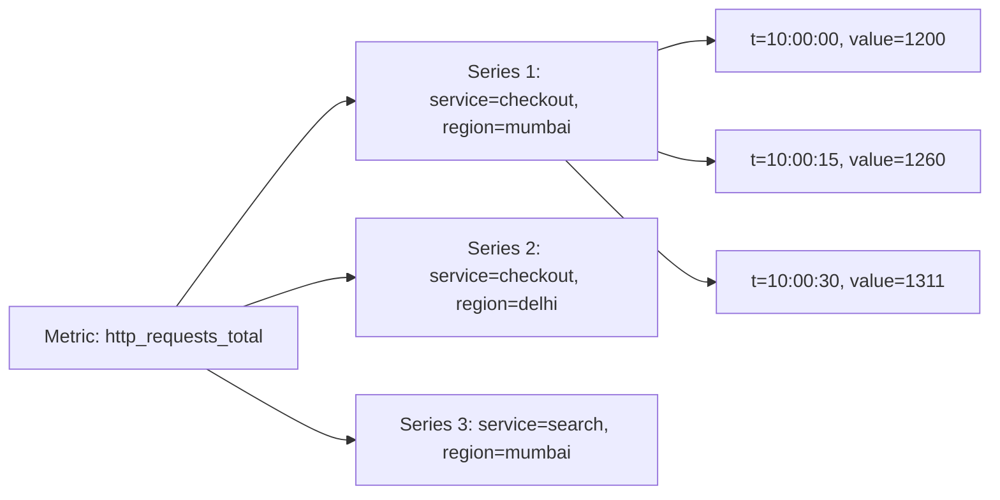
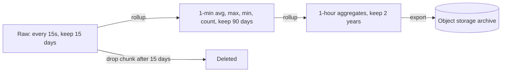
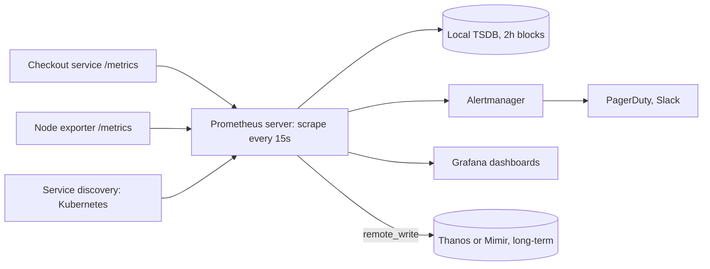
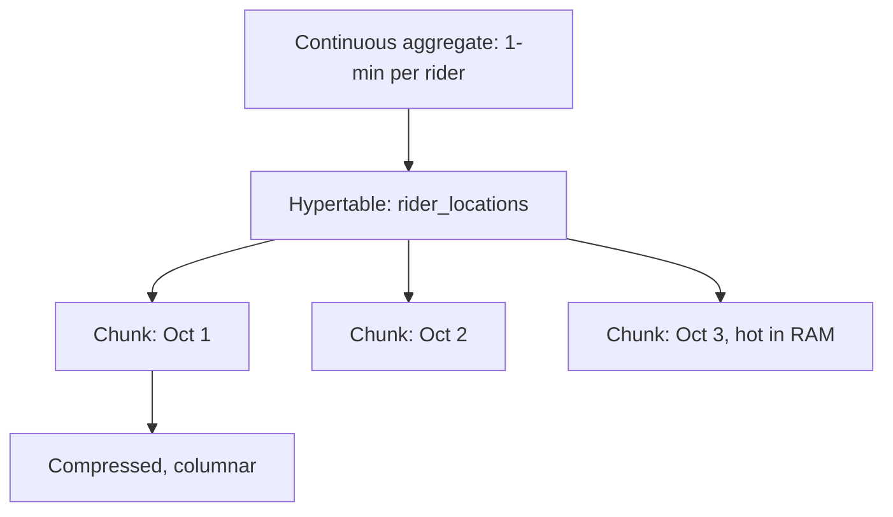

# Time-series Databases

Time-series database (TSDB) un values ke liye bana hai jo time ke saath aati hain: CPU usage har 15 second, stock price har tick, delivery partner ki location har 5 second. Inka pattern itna fixed hai (append, time range query, aggregate) ki special storage, compression aur retention se 10–20x kam disk aur fast queries milti hain. Interview me monitoring, metrics, IoT aur trading wale questions me ye aata hai.

## ⭐ What makes time-series data special

**Ek line me:** data append-only hai, time-ordered aata hai, almost kabhi update nahi hota, aur log ek point nahi balki time range ka aggregate (avg, max, rate) poochte hain.

| Property | Matlab | Design pe asar |
|---|---|---|
| Append-only | Naye points aate hain, purane change nahi hote | LSM / append storage, update path ki zarurat nahi |
| Time-ordered | Points almost order me aate hain | Time se partition (chunks/blocks), delta compression |
| Write-heavy | Lakhon points/sec (har server, har metric) | Batch writes, in-memory head block |
| Range + aggregate reads | "Last 1 hour ka p99", "har 5 min ka avg" | Pre-aggregation, downsampling |
| Recent data hot | 90% queries last 24h ki | Hot data RAM/SSD, purana object storage pe |
| Old data less valuable | 1 saal purana per-second data kisi kaam ka nahi | Retention + rollups |
| Deletes bulk me | Ek-ek row delete nahi, poora purana chunk drop | Chunk/partition drop, tombstones nahi |

**Real example:** Zerodha Kite. NSE se har instrument ka tick (price, volume) har second me kai baar. Charts ke liye 1-minute candles (OHLC: open, high, low, close) chahiye, aur 5 saal purana data sirf daily candle level pe.

**Interview tip:** "Postgres me timestamp column se kaam kyun nahi chalega?" Chhote scale pe chalega. Billions rows pe B-tree index bada, inserts slow, purana data delete karna (`DELETE`) vacuum hell, aur compression nahi. TSDB time chunks drop karta hai aur 10x compress karta hai.

**Common galti:** time-series data ko normal OLTP table me daal ke har query pe raw rows aggregate karna.

## ⭐ Data model: metric, tags, fields, timestamp

**Ek line me:** ek data point = metric name + tags (labels, kaun) + field value (kya measure kiya) + timestamp (kab). Same metric + same tags = ek **series**.



| Part | Kya hai | Indexed? | Example |
|---|---|---|---|
| Metric / measurement | Kya naap rahe ho | Haan | `cpu_usage`, `order_count`, `tick` |
| Tags / labels | Dimensions, kaun/kahan | Haan (inverted index) | `host=web-12`, `city=bengaluru`, `symbol=INFY` |
| Fields / value | Actual number | Nahi | `value=73.5`, `price=1520.4, volume=300` |
| Timestamp | Kab | Primary sort | `2026-10-03T10:00:00Z` |

- Query flow: tags se matching series dhoondo (inverted index), phir un series ke time range ke points padho.
- Prometheus me har series ek single float value; InfluxDB me ek point me multiple fields ho sakte hain.

**Interview tip:** tag vs field ka rule: jis pe filter/group by karoge aur jiski values limited hain, wo tag. Jo number measure ho raha hai ya unbounded hai, wo field.

**Common galti:** `price` ya `user_id` ko tag bana dena. Har unique value ek nayi series banati hai.

## ⭐ High cardinality problem

**Ek line me:** cardinality = unique series ki count = saare label values ka combination. Isse bahut badha diya to TSDB ka index RAM me nahi samaata aur DB gir jaata hai.

Calculation: `http_requests_total` with labels:
- `service` (50) × `endpoint` (100) × `status` (5) × `pod` (500) = **1.25 crore series**. Ab isme `user_id` (1 crore users) jod do to practically infinite.

Har series ke liye TSDB memory me index entry + in-memory chunk rakhta hai (Prometheus me roughly 3–4 KB per active series). Crores series = sau GB RAM.

Bachav:
- Labels me bounded values hi: `status_code`, `region`, `service`. **Kabhi nahi:** `user_id`, `order_id`, `request_id`, `email`, raw URL path (`/order/98213`).
- URL ko route template me badlo: `/order/{id}`.
- Per-user/per-order data chahiye to wo **logs/traces** ya OLAP store (ClickHouse) ka kaam hai, metrics ka nahi.
- Prometheus me `metric_relabel_configs` se bekaar labels drop karo; cardinality dashboards dekho.
- High-cardinality ke liye bane systems: ClickHouse, InfluxDB 3 (columnar), VictoriaMetrics kuch better handle karte hain, par cost phir bhi badhti hai.

**Interview tip:** "Har user ki API latency metric me daal do?" Bolo nahi, high cardinality. Metrics aggregate ke liye; per-user ke liye logs ya ClickHouse.

**Common galti:** dev me 10 users ke saath sab theek dikhna aur production me Prometheus OOM.

## ⭐ Compression: delta-of-delta and Gorilla

**Ek line me:** consecutive timestamps aur values ek dusre ke bahut paas hote hain, isliye pura number store karne ki jagah sirf "fark" store karo. Facebook Gorilla paper se ek point 16 bytes se ~1.37 bytes pe aa gaya.

**Timestamps: delta-of-delta.**
- Raw: `1000, 1015, 1030, 1045, 1061`
- Delta: `15, 15, 15, 16`
- Delta-of-delta: `0, 0, 1`
- Regular scrape interval pe zyada tar `0` aata hai, jo sirf **1 bit** me store hota hai.

**Values: XOR (Gorilla).**
- Current float ko pichhle float se XOR karo. Value same hai to XOR = 0, sirf 1 bit.
- Value thodi badli to XOR me leading aur trailing zeros bahut hote hain; sirf beech ke meaningful bits store karo.
- CPU 73.5, 73.5, 73.6 jaise slowly changing gauges pe bahut achha kaam karta hai.

Baaki techniques:
- **Columnar storage:** time ek column, value ek column. Same type ke values saath me, better compression (TimescaleDB, InfluxDB 3, ClickHouse).
- **Run-length encoding:** same value repeat ho (status = 1, 1, 1, 1) to `(1, ×4)`.
- **Dictionary encoding:** repeated strings (tags) ko integer ids.

Prometheus TSDB: 2-hour blocks, har series ka chunk Gorilla-compressed, ~1–2 bytes per sample.

**Interview tip:** estimation me bolo "Gorilla compression ke baad ~1.5 bytes/sample". 1 lakh series × har 15s × 1 din = ~57.6 crore samples ≈ ~0.9 GB/day. Ye number design decision badalta hai.

**Common galti:** storage estimate me har point ke 16+ bytes (8 timestamp + 8 value) + tags ke bytes gin lena. Tags har point pe store nahi hote; series ke saath ek baar.

## ⭐ Retention, downsampling and rollups

**Ek line me:** raw high-resolution data thode din rakho, phir usse 1-min/1-hour aggregates (rollups) banao aur unhe lambe time rakho; raw data drop.



- **Retention policy:** "raw data 15 din". TSDB data time chunks/blocks me rakhta hai, isliye retention = poora purana chunk drop (instant, koi tombstone ya vacuum nahi).
- **Downsampling:** resolution kam karna. 1 saal ka graph per-second points se nahi, per-hour points se banta hai.
- **Rollups me kya store karo:** sirf `avg` nahi. `min`, `max`, `sum`, `count` rakho (avg = sum/count se wapas ban jaata hai, aur avg of avgs galat hota hai). Percentiles ke liye histogram buckets ya sketch (t-digest, DDSketch), kyunki p99 of p99s bhi galat hai.
- Prometheus khud downsampling nahi karta; Thanos / Mimir / VictoriaMetrics karte hain. TimescaleDB continuous aggregates se, InfluxDB tasks se.

**Real example:** Zerodha: raw ticks kuch din, 1-minute candles kai mahine, daily candles saalon tak.

**Interview tip:** "Saalon ka data store kaise?" Tiered retention + rollups, aur purana data object storage (S3) pe (Thanos/Mimir yahi karte hain).

**Common galti:** rollup me sirf average store karna, phir baad me max ya p99 maangna.

## ⭐ Prometheus and PromQL

**Ek line me:** Prometheus ek pull-based monitoring system + local TSDB hai: wo har 15–60s targets ke `/metrics` endpoint ko scrape karta hai, aur PromQL se query/alert karte hain.



**Pull model:**
- Prometheus targets ko khud scrape karta hai. Fayda: target down hai to `up == 0` turant pata chalta hai; app ko Prometheus ka address nahi pata hona chahiye; scrape rate central control me.
- Short-lived jobs (cron) ke liye **Pushgateway**. Push-based systems: InfluxDB, Datadog agent, OpenTelemetry push.
- Single-node hai, clustering nahi. HA ke liye do identical Prometheus; long-term + global view ke liye Thanos/Mimir/VictoriaMetrics.

**Metric types:**
| Type | Kya | Example |
|---|---|---|
| Counter | Sirf badhta hai (restart pe 0) | `http_requests_total` |
| Gauge | Upar-neeche | `memory_bytes`, `active_orders` |
| Histogram | Buckets me count (`_bucket`, `_sum`, `_count`) | `http_request_duration_seconds` |
| Summary | Client-side quantiles | Aggregate nahi ho sakte, histogram prefer karo |

App ka `/metrics` output:
```text
# TYPE http_requests_total counter
http_requests_total{service="checkout",method="POST",status="200"} 128734
http_requests_total{service="checkout",method="POST",status="500"} 42
# TYPE http_request_duration_seconds histogram
http_request_duration_seconds_bucket{service="checkout",le="0.1"} 98000
http_request_duration_seconds_bucket{service="checkout",le="0.5"} 127000
http_request_duration_seconds_bucket{service="checkout",le="+Inf"} 128776
```

**PromQL commands:**

| Command / method | Kya karta hai | Example |
|---|---|---|
| Selector | Labels se series chuno | `http_requests_total{service="checkout", status=~"5.."}` |
| Range vector `[5m]` | Har series ke last 5 min ke points | `http_requests_total[5m]` |
| `rate()` | Counter ka per-second average increase (resets handle) | `rate(http_requests_total[5m])` |
| `irate()` | Last do points se instant rate | Spiky graphs ke liye |
| `increase()` | Window me total increase | `increase(orders_total[1h])` |
| `sum by (label)` | Label pe group karke sum | `sum by (service) (rate(http_requests_total[5m]))` |
| `topk()` | Top K series | `topk(5, sum by (endpoint) (rate(http_requests_total[5m])))` |
| `histogram_quantile()` | Histogram buckets se percentile | `histogram_quantile(0.99, sum by (le) (rate(http_request_duration_seconds_bucket[5m])))` |
| `avg_over_time()` | Gauge ka window average | `avg_over_time(cpu_usage_percent[10m])` |
| `max_over_time()` | Window ka max | `max_over_time(queue_depth[1h])` |
| `absent()` | Metric gayab ho to alert | `absent(up{job="payments"})` |

```promql
# Checkout ka error rate (%) last 5 min
100 * sum(rate(http_requests_total{service="checkout", status=~"5.."}[5m]))
    / sum(rate(http_requests_total{service="checkout"}[5m]))

# Har service ka p99 latency
histogram_quantile(0.99,
  sum by (service, le) (rate(http_request_duration_seconds_bucket[5m])))

# Swiggy: har city me per-minute orders
sum by (city) (rate(orders_placed_total[1m])) * 60

# CPU 10 min se 85% se upar (alert rule ka expr)
avg_over_time(node_cpu_usage_percent[10m]) > 85
```

Alert rule:
```yaml
groups:
  - name: checkout
    rules:
      - alert: CheckoutHighErrorRate
        expr: sum(rate(http_requests_total{service="checkout",status=~"5.."}[5m])) / sum(rate(http_requests_total{service="checkout"}[5m])) > 0.02
        for: 5m
        labels: { severity: page }
```

**Interview tip:** "Counter ka raw value graph kyun nahi?" Counter hamesha badhta hai aur restart pe reset hota hai; `rate()` reset handle karke per-second rate deta hai. Aur `rate` pehle, `sum` baad me: `sum(rate(x[5m]))`, ulta nahi.

**Common galti:** averages of percentiles nikalna (`avg(p99)`). Sahi: buckets ka `sum by (le)`, phir `histogram_quantile`.

## InfluxDB

**Ek line me:** InfluxDB push-based, purpose-built TSDB hai; data **line protocol** me HTTP se bhejte ho, aur InfluxQL (SQL jaisa) / Flux / SQL se query karte ho.

**Line protocol:** `measurement,tag1=v1,tag2=v2 field1=x,field2=y timestamp`
```text
ticks,symbol=INFY,exchange=NSE price=1520.40,volume=300i 1759485600000000000
ticks,symbol=TCS,exchange=NSE price=4102.10,volume=120i 1759485600000000000
sensor,device=cold-room-7,city=pune temp=3.8,humidity=71 1759485605000000000
```
Tags (`symbol`, `exchange`) indexed, fields (`price`, `volume`) nahi. `i` suffix = integer. Timestamp nanoseconds.

```bash
# Write via HTTP API (v2 style)
curl -XPOST "http://localhost:8086/api/v2/write?org=zerodha&bucket=market&precision=ns" \
  -H "Authorization: Token $INFLUX_TOKEN" \
  --data-binary 'ticks,symbol=INFY,exchange=NSE price=1520.40,volume=300i 1759485600000000000'
```

InfluxQL (1-minute OHLC-jaisa):
```sql
SELECT FIRST(price) AS open, MAX(price) AS high, MIN(price) AS low, LAST(price) AS close
FROM ticks
WHERE symbol = 'INFY' AND time > now() - 1h
GROUP BY time(1m)
```

Flux (v2) me pipe-style:
```javascript
from(bucket: "market")
  |> range(start: -1h)
  |> filter(fn: (r) => r._measurement == "ticks" and r.symbol == "INFY")
  |> aggregateWindow(every: 1m, fn: mean)
```

Versions: 1.x (InfluxQL), 2.x (Flux, buckets with retention), 3.x (Rust rewrite, Apache Arrow + Parquet columnar, SQL; Flux deprecated). Retention bucket level pe set hota hai.

**Interview tip:** InfluxDB ka naam IoT/sensor data me lo, jahan devices khud data push karte hain (pull possible nahi, devices NAT ke peeche).

**Common galti:** v1 me har unique tag value se series badhti thi, `user_id` tag = cardinality blow-up. Same rule yahan bhi.

## ⭐ TimescaleDB

**Ek line me:** TimescaleDB Postgres extension hai jo normal table ko **hypertable** bana deta hai: time ke hisaab se automatically chunks (child tables) me partition. Full SQL, joins, indexes sab milte hain.



- **Hypertable:** tum ek table se baat karte ho, andar chunks (default 7 din per chunk). Query me time filter ho to sirf relevant chunks scan (chunk exclusion).
- **Compression:** purane chunks ko columnar compress (90%+ space saving), `segmentby` column ke hisaab se.
- **Retention:** `add_retention_policy` = purane chunks `DROP` (instant).
- **Continuous aggregates:** materialized view jo incrementally refresh hota hai; sirf naye data ka aggregate dobara banta hai.
- `time_bucket()` = `date_trunc` ka flexible version (5 min, 15 min buckets).

```sql
CREATE EXTENSION IF NOT EXISTS timescaledb;

-- Swiggy/Zomato: delivery partner ki location har 5 sec
CREATE TABLE rider_locations (
    time      timestamptz NOT NULL,
    rider_id  bigint      NOT NULL,
    city      text        NOT NULL,
    lat       double precision,
    lng       double precision,
    speed_kmh real
);
SELECT create_hypertable('rider_locations', by_range('time', INTERVAL '1 day'));
CREATE INDEX ON rider_locations (rider_id, time DESC);

-- Rider ki last 10 min ki location
SELECT time, lat, lng FROM rider_locations
WHERE rider_id = 8812 AND time > now() - INTERVAL '10 minutes'
ORDER BY time DESC;

-- Continuous aggregate: har city, har 5 min avg speed
CREATE MATERIALIZED VIEW city_speed_5m
WITH (timescaledb.continuous) AS
SELECT time_bucket('5 minutes', time) AS bucket, city,
       avg(speed_kmh) AS avg_speed, count(*) AS pings
FROM rider_locations
GROUP BY bucket, city;

SELECT add_continuous_aggregate_policy('city_speed_5m',
  start_offset => INTERVAL '1 hour', end_offset => INTERVAL '5 minutes',
  schedule_interval => INTERVAL '5 minutes');

-- Compression after 2 days, delete raw after 30 days
ALTER TABLE rider_locations SET (timescaledb.compress, timescaledb.compress_segmentby = 'rider_id');
SELECT add_compression_policy('rider_locations', INTERVAL '2 days');
SELECT add_retention_policy('rider_locations', INTERVAL '30 days');
```

**Interview tip:** "Pehle se Postgres hai aur time-series bhi chahiye" to TimescaleDB best jawab hai: naya DB seekhna nahi, aur time-series ko normal tables (riders, orders) se join kar sakte ho.

**Common galti:** hypertable pe query me time filter na dena. Saare chunks scan honge.

## ⭐ Comparison table

**Ek line me:** monitoring metrics ke liye Prometheus, IoT/push events ke liye InfluxDB, SQL + joins chahiye to TimescaleDB, aur bahut high-cardinality analytics ke liye ClickHouse.

| Point | Prometheus | InfluxDB | TimescaleDB | ClickHouse (OLAP) |
|---|---|---|---|---|
| Model | Pull (scrape) | Push (line protocol) | Push (SQL INSERT) | Push (batch insert) |
| Query | PromQL | InfluxQL / Flux / SQL (v3) | Full PostgreSQL SQL | SQL |
| Joins | Label matching only | Limited | Full joins | Joins (with limits) |
| Cardinality | Low–medium | Medium (v3 better) | Medium–high | Very high |
| Retention / rollups | Local retention; downsampling via Thanos/Mimir | Bucket retention, tasks | Retention + continuous aggregates | TTL, materialized views |
| Scale out | Single node (+ Thanos/Mimir/VictoriaMetrics) | Enterprise / Cloud | Multi-node limited, mostly vertical + replicas | Native sharding |
| Best for | Infra/app metrics, alerting | IoT, sensors, events | Postgres shops, business time-series | Logs, events, high-cardinality analytics |

Aur bhi: VictoriaMetrics (Prometheus-compatible, cheaper), QuestDB (fast ingest, finance), Amazon Timestream, Druid/Pinot (real-time OLAP). Detail: [Columnar / OLAP](12-columnar-olap.md).

**Interview tip:** comparison me ek line: "Metrics + alerting = Prometheus; business time-series with joins = TimescaleDB; per-event high-cardinality analytics = ClickHouse."

**Common galti:** Prometheus me business data (har order ka amount) daalna. Prometheus monitoring ke liye hai, exact billing data ke liye nahi (scrape miss ho sakte hain, values approximate).

## ⭐ Use cases

**Ek line me:** jahan bhi "metric over time" ho: server health, sensors, market ticks, counters per minute.

| Use case | Kya store hota hai | Kaunsa DB | Link |
|---|---|---|---|
| Server / app metrics | CPU, memory, QPS, latency histograms | Prometheus + Grafana, Thanos | [Reliability & observability](../01-topics/20-reliability-observability.md) |
| IoT (cold-chain trucks, smart meters) | Temperature, humidity per device | InfluxDB / TimescaleDB | - |
| Zerodha tick data | Ticks → 1-min/daily OHLC candles | TimescaleDB / QuestDB / ClickHouse (Zerodha khud Postgres/ClickHouse heavy hai) | - |
| Ad click counts per minute | Clicks per ad per minute, rollups | Druid / Pinot / ClickHouse, Flink pre-aggregation | [Ad click aggregator](../02-questions/t2-17-ad-click-aggregator.md) |
| Rider / driver location history | Lat, lng per rider every few sec | TimescaleDB / Cassandra | [Uber](../02-questions/t1-06-uber.md), [Food delivery](../02-questions/t2-14-food-delivery.md) |
| Log-based metrics | Error count per service per minute | Prometheus (from logs) / ClickHouse | [Distributed logging](../02-questions/t2-26-distributed-logging.md) |
| Rate limiter dashboards | Rejected requests per client | Prometheus | [Rate limiter](../02-questions/t1-02-rate-limiter.md) |

Counting aur top-K patterns: [Counting & top-K](../01-topics/15-counting-top-k.md).

**Interview tip:** ad click aggregator me bolo: "Flink 1-min windows me pre-aggregate karta hai, OLAP/TSDB me per-minute rows, raw events S3 pe reconciliation ke liye."

**Common galti:** ad billing jaise exact counts Prometheus se nikalna.

## When a regular DB is enough

**Ek line me:** agar data chhota hai (crore rows tak), retention simple hai aur queries kam hain, to Postgres/MySQL me ek table + `(entity_id, time)` index + time partitioning kaafi hai.

Regular DB theek hai jab:
- Writes kuch hazaar/sec se kam aur total data kuch sau GB tak.
- Queries mostly "is entity ka last N din ka data" (index se fast).
- Aggregates dashboard pe kabhi-kabhi, real-time nahi.
- Postgres native partitioning (`PARTITION BY RANGE (time)`) se purane mahine ki partition `DROP` kar sakte ho.

```sql
CREATE TABLE wallet_balance_history (
    user_id    bigint,
    time       timestamptz,
    balance    numeric(12,2),
    PRIMARY KEY (user_id, time)
) PARTITION BY RANGE (time);

CREATE TABLE wallet_balance_history_2026_10
  PARTITION OF wallet_balance_history
  FOR VALUES FROM ('2026-10-01') TO ('2026-11-01');

-- Retention: purana mahina drop (DELETE nahi)
DROP TABLE wallet_balance_history_2025_10;
```

TSDB pe tab jao jab: lakhon points/sec, crores series, heavy compression chahiye, ya rollups/retention manually sambhalna bhaari ho jaaye.

Partitioning detail: [Scaling Databases](14-scaling-databases.md).

**Interview tip:** chhote scale pe bolo "abhi Postgres with time partitioning, scale badhe to TimescaleDB (same SQL)". Ye pragmatic lagta hai.

**Common galti:** 10 hazaar rows/day ke liye alag Prometheus/InfluxDB cluster khada karna.

## Checklist

- [ ] Time-series data ki properties (append-only, time-ordered, range aggregates) aur design pe asar bata sakta hoon
- [ ] Metric, tags/labels, fields, timestamp aur series ka matlab example se samjha sakta hoon
- [ ] High cardinality problem calculate karke bata sakta hoon aur kaunse labels avoid karne hain
- [ ] Delta-of-delta aur Gorilla XOR compression samjha sakta hoon
- [ ] Retention, downsampling aur rollups (min/max/sum/count) design kar sakta hoon
- [ ] Prometheus pull model aur PromQL (`rate`, `sum by`, `histogram_quantile`, `avg_over_time`) likh sakta hoon
- [ ] InfluxDB line protocol aur TimescaleDB hypertable + continuous aggregate likh sakta hoon
- [ ] Prometheus vs InfluxDB vs TimescaleDB vs ClickHouse compare kar sakta hoon aur kab regular DB kaafi hai bata sakta hoon
