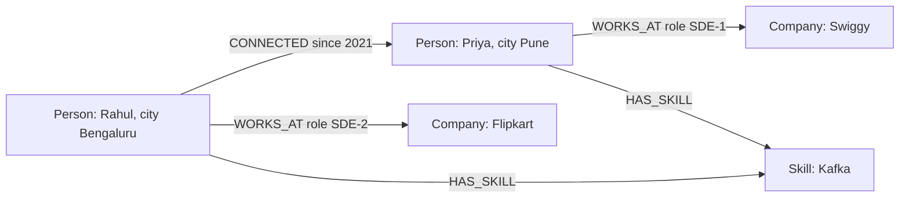
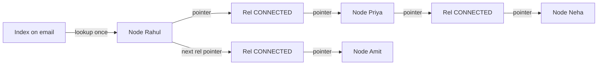

# Graph Databases

Graph DB me data nodes aur relationships ke roop me store hota hai, aur relationship khud first-class cheez hai, sirf ek foreign key nahi. Jab sawal "kaun kisse kitne hops door juda hai" type ka ho (friends-of-friends, fraud ring, recommendation), tab graph DB chamakta hai. Interview me ye poocha jaata hai ki graph DB kab chahiye aur kab Postgres hi kaafi hai.

## ⭐ Property graph model

**Ek line me:** data = nodes (entities) + relationships (directed, typed edges) + properties (dono pe key-value pairs).

- **Node:** ek entity. Uske ek ya zyada **labels** hote hain: `:Person`, `:Company`, `:Account`.
- **Relationship:** do nodes ke beech directed edge, hamesha ek **type** ke saath: `:FOLLOWS`, `:WORKS_AT`, `:SENT_MONEY`. Direction store hoti hai, par query me dono taraf traverse kar sakte ho.
- **Properties:** node aur relationship dono pe key-value: `name`, `since`, `amount`.
- Schema-optional hai. Ek `:Person` node pe `city` ho, dusre pe na ho, chalega.

> **Example:** LinkedIn pe Rahul ne Flipkart me kaam kiya, Priya se connected hai, aur Priya Swiggy me hai. Ye teen nodes aur teen relationships hain, har ek pe properties.



| Graph term | Relational me lagbhag | Fark |
|---|---|---|
| Node | row | ek node ke kai labels ho sakte hain |
| Label | table | schema fixed nahi |
| Relationship | foreign key / join table row | khud ek stored object hai, properties ke saath |
| Property | column | har node pe alag set ho sakta hai |

**Interview tip:** "RDF vs property graph?" RDF triples (subject, predicate, object) hain, SPARQL se query hote hain, semantic web/knowledge graph ke liye. Property graph (Neo4j, Neptune ka openCypher/Gremlin mode) app development me zyada common hai.

**Common galti:** har cheez ko node bana dena. `city` jaisi simple value property honi chahiye; node tab banao jab us cheez pe traverse karna ho (jaise "same city ke log").

## ⭐ Deep relationships me joins slow kyun hote hain

**Ek line me:** SQL me har hop ek aur self-join hai; har join index lookup + intermediate result set badhata hai, aur 3–4 hops pe rows ka explosion ho jaata hai.

Friends-of-friends SQL me:

```sql
-- connections(user_id, friend_id), dono pe index
-- Rahul (id 1) ke 2nd degree connections
SELECT DISTINCT c2.friend_id
FROM connections c1
JOIN connections c2 ON c2.user_id = c1.friend_id
WHERE c1.user_id = 1
  AND c2.friend_id <> 1;

-- 3rd degree: ek aur join, aur ab "already 1st/2nd degree" hatane ke liye NOT IN bhi
```

Problem samjho:
- Har user ke ~300 connections maano. 1 hop = 300 rows, 2 hops = 90,000, 3 hops = 2.7 crore (duplicates ke saath).
- Har hop pe B-tree index lookup O(log n) hai, jahan n = **poori table** ka size (arabon rows). Table badhi, har hop mehenga.
- Query planner ko pehle se hops ki ginti pata honi chahiye. "Jitne bhi hops tak" (variable depth) ke liye recursive CTE chahiye.

| Hops | SQL (index joins) | Graph DB (pointer chasing) |
|---|---|---|
| 1 | fast | fast |
| 2 | theek | fast |
| 3–4 | seconds, memory heavy | milliseconds se thoda zyada |
| 5+ / variable | aksar timeout | depth limit ke saath chalta hai |

Neo4j ke purane benchmark me (10 lakh users, depth 4–5) SQL minutes le raha tha, graph DB 1–2 sec. Exact numbers mat ratna, trend yaad rakho: **graph DB ka cost us hisse pe depend karta hai jo tum touch karte ho, poore dataset pe nahi.**

**Interview tip:** bolo "joins row count pe nahi, har hop ke fan-out pe explode karte hain. Graph DB me bhi fan-out hai, par har step ek index lookup nahi, seedha pointer follow hai."

**Common galti:** ye bolna ki SQL graph queries kar hi nahi sakta. Kar sakta hai, 1–2 hops pe achha bhi hai. Problem deep aur variable-depth traversal me hai.

## ⭐ Index-free adjacency

**Ek line me:** har node apne relationships ka direct pointer (physical address) rakhta hai, isliye neighbour tak jaana O(1) hai, global index lookup nahi.

- Neo4j me node record fixed size ka hota hai. Usme pehle relationship ka pointer hota hai; relationship records ek doubly linked list banate hain (start node ki chain, end node ki chain).
- Traverse karna = pointer follow karna. Cost ~ O(jitne edges touch kiye), table size se independent.
- Index sirf **starting point** dhoondhne ke liye lagta hai (jaise `email` se Rahul ka node). Uske baad traversal index-free hai.



**Supernode problem:** ek node jiske crore edges hain (Virat Kohli ke followers, ya ek popular merchant). Usse traverse karna = crore pointers. Fix: relationship type + direction se filter, degree pe limit, ya aise edges ko alag model karna.

**Interview tip:** "Index-free adjacency ka fayda kya?" Query time local hai: 1 crore users ho ya 100 crore, Rahul ke 3-hop network ka cost lagbhag same hai.

**Common galti:** sochna ki har graph DB native storage use karta hai. Kuch (JanusGraph on Cassandra, Neptune ka internal layer) graph API ke neeche dusra storage rakhte hain; tab har hop internally ek lookup bhi ho sakta hai.

## ⭐ Neo4j Cypher commands

**Ek line me:** Cypher ASCII-art jaisi query language hai: `(node)-[:REL]->(node)` likh ke pattern match karte ho.

| Command / method | Kya karta hai | Example |
|---|---|---|
| `CREATE` | naya node / relationship banata hai (duplicate check nahi) | `CREATE (:Person {id: 1, name: 'Rahul'})` |
| `MATCH` | pattern dhoondhta hai | `MATCH (p:Person)-[:WORKS_AT]->(c:Company) RETURN p, c` |
| `MERGE` | hai to match, nahi to create (upsert) | `MERGE (c:Company {name: 'Swiggy'})` |
| `ON CREATE SET` / `ON MATCH SET` | MERGE ke baad properties set | `MERGE (p:Person {id: 1}) ON CREATE SET p.created = timestamp()` |
| `WHERE` | filter | `WHERE p.city = 'Pune' AND r.since > 2020` |
| `-[:REL*1..3]-` | variable-length path, 1 se 3 hops | `MATCH (a)-[:CONNECTED*1..3]-(b)` |
| `shortestPath()` | do nodes ka shortest path | `shortestPath((a)-[:CONNECTED*..6]-(b))` |
| `RETURN ... count()` | aggregation, non-aggregated fields pe implicit group by | `RETURN c.name, count(p) AS employees` |
| `ORDER BY` / `LIMIT` | sort aur top-K | `ORDER BY mutual DESC LIMIT 10` |
| `SET` / `REMOVE` | property update / hatao | `SET p.city = 'Mumbai'` |
| `DELETE` / `DETACH DELETE` | delete; DETACH pehle edges hatata hai | `MATCH (p {id: 9}) DETACH DELETE p` |
| `CREATE INDEX` | starting point fast karne ke liye | `CREATE INDEX person_email FOR (p:Person) ON (p.email)` |
| `CREATE CONSTRAINT` | uniqueness (index bhi banta hai) | `CREATE CONSTRAINT FOR (p:Person) REQUIRE p.id IS UNIQUE` |
| `EXPLAIN` / `PROFILE` | query plan / actual db hits | `PROFILE MATCH ...` |

```cypher
// Unique constraint: MERGE ko fast aur safe banata hai
CREATE CONSTRAINT person_id IF NOT EXISTS FOR (p:Person) REQUIRE p.id IS UNIQUE;
CREATE INDEX person_email IF NOT EXISTS FOR (p:Person) ON (p.email);

// Data daalo: MERGE se duplicate nahi banenge
MERGE (r:Person {id: 1}) ON CREATE SET r.name = 'Rahul', r.city = 'Bengaluru';
MERGE (p:Person {id: 2}) ON CREATE SET p.name = 'Priya', p.city = 'Pune';
MERGE (f:Company {name: 'Flipkart'});
MATCH (r:Person {id: 1}), (p:Person {id: 2})
MERGE (r)-[:CONNECTED {since: 2021}]->(p);

// "People you may know": 2nd degree, mutual connections ke hisaab se rank
MATCH (me:Person {id: 1})-[:CONNECTED]-(friend)-[:CONNECTED]-(fof)
WHERE fof <> me AND NOT (me)-[:CONNECTED]-(fof)
RETURN fof.name, count(DISTINCT friend) AS mutual
ORDER BY mutual DESC
LIMIT 10;

// 1 se 3 hops me kaun Swiggy me kaam karta hai (referral dhoondhna)
MATCH (me:Person {id: 1})-[:CONNECTED*1..3]-(p:Person)-[:WORKS_AT]->(:Company {name: 'Swiggy'})
RETURN DISTINCT p.name;

// Rahul se Neha tak shortest path (LinkedIn ka "2nd" / "3rd" badge)
MATCH path = shortestPath(
  (a:Person {id: 1})-[:CONNECTED*..6]-(b:Person {name: 'Neha'})
)
RETURN [n IN nodes(path) | n.name] AS chain, length(path) AS hops;
```

**Interview tip:** variable-length path me hamesha upper bound do (`*1..3`, `*..6`). Bina bound ke `*` poora graph explore kar sakta hai.

**Common galti:** `MERGE` ko poore pattern pe chalana (`MERGE (a:Person {id:1})-[:X]->(b:Person {id:2})`). Agar pattern poora match nahi hua to MERGE **poora pattern** naya bana deta hai, duplicate nodes ke saath. Pehle nodes MERGE karo, phir relationship.

## ⭐ Real examples: LinkedIn, Paytm fraud rings, recommendations

**Ek line me:** jahan answer "connections ke pattern" me chhupa ho, wahan graph.

**1. LinkedIn connections (1st/2nd/3rd degree):**
- Profile pe "2nd" badge = shortest path length 2. "People you may know" = mutual connections count.
- LinkedIn ne apna in-memory graph service (LIquid) banaya kyunki ye query har page load pe chalti hai.

**2. Paytm / UPI fraud rings:**
- Nodes: `Account`, `Device`, `Phone`, `UPI_ID`, `Merchant`. Edges: `USES_DEVICE`, `SENT_MONEY`, `REGISTERED_WITH`.
- Fraud pattern: 20 "alag" accounts ek hi device ya phone number share kar rahe hain, aur paisa circle me ghoom ke ek mule account pe aa raha hai.
- SQL me ye 4–5 joins ki dynamic query hai. Graph me ek pattern.

```cypher
// Ek device se jude accounts jo aapas me paisa ghuma rahe hain (cycle)
MATCH (d:Device)<-[:USES_DEVICE]-(a:Account)
WITH d, collect(a) AS accts
WHERE size(accts) >= 5
MATCH cycle = (x:Account)-[:SENT_MONEY*3..5]->(x)
WHERE x IN accts
RETURN d.id, [n IN nodes(cycle) | n.id] AS ring
LIMIT 20;
```

**3. Recommendations (Flipkart / Swiggy):**
- "Jinhone ye khareeda unhone ye bhi khareeda": `(me)-[:BOUGHT]->(p)<-[:BOUGHT]-(other)-[:BOUGHT]->(rec)`.
- Real-time me chhote neighbourhood pe achha. Bade scale pe aksar offline embeddings + vector DB use hota hai ([Vector Databases](11-vector.md)).

```cypher
MATCH (me:User {id: 42})-[:BOUGHT]->(p:Product)<-[:BOUGHT]-(other:User)-[:BOUGHT]->(rec:Product)
WHERE NOT (me)-[:BOUGHT]->(rec)
RETURN rec.name, count(DISTINCT other) AS score
ORDER BY score DESC LIMIT 5;
```

**Interview tip:** fraud detection graph ka sabse strong use case hai. Bolo "shared device/phone/address = hidden link; graph me ye ek hop hai, SQL me har naye link type ke liye naya join."

**Common galti:** recommendation ke liye poore catalog pe graph traversal chalana. Popular product supernode ban jaata hai; degree limit ya precomputed scores lagao.

## Amazon Neptune, Gremlin aur SPARQL

**Ek line me:** Neptune AWS ka managed graph DB hai jo property graph (Gremlin, openCypher) aur RDF (SPARQL) dono support karta hai.

| | Neo4j | Amazon Neptune |
|---|---|---|
| Deploy | self-host ya AuraDB (managed) | fully managed AWS |
| Query language | Cypher | Gremlin, openCypher, SPARQL |
| Storage | native graph, index-free adjacency | AWS distributed storage (Aurora jaisa), 6 copies 3 AZ me |
| Scaling | read replicas; writes ek primary pe | 1 writer + 15 tak read replicas |
| Kab | rich Cypher, graph algorithms (GDS library) | AWS stack, managed ops, RDF/knowledge graph |

**Gremlin** (Apache TinkerPop) imperative traversal language hai, step by step chalti hai:

```groovy
// Rahul ke 2nd degree connections, Rahul aur 1st degree ko hata ke
g.V().has('Person', 'name', 'Rahul').as('me').
  both('CONNECTED').aggregate('first').
  both('CONNECTED').
  where(neq('me')).where(without('first')).
  dedup().values('name').limit(10)
```

**SPARQL** RDF triples pe chalti hai, knowledge graph ke liye:

```sparql
SELECT ?colleague WHERE {
  :Rahul :worksAt ?company .
  ?colleague :worksAt ?company .
  FILTER (?colleague != :Rahul)
}
```

Aur bhi naam: **JanusGraph** (Cassandra/HBase pe distributed), **TigerGraph** (MPP, analytics), **ArangoDB** (multi-model), **Memgraph** (in-memory, Cypher).

**Interview tip:** AWS-based design me bolo "Neptune with openCypher", ops ka bojh kam. Cypher vs Gremlin ka sawal aaye to: Cypher declarative (kya chahiye), Gremlin imperative (kaise traverse karna hai).

**Common galti:** Neptune ko "horizontally sharded writes" wala samajhna. Writes ek hi writer instance pe hain.

## ⭐ Kab recursive CTE wala relational DB kaafi hai

**Ek line me:** agar graph chhota hai, hops kam aur fixed hain, ya graph queries app ka chhota hissa hain, to Postgres ka `WITH RECURSIVE` kaafi hai. Naya DB mat lao.

```sql
-- Employee hierarchy: Rahul (id 1) ke neeche saare log, depth ke saath
WITH RECURSIVE reports AS (
    SELECT id, name, manager_id, 1 AS depth
    FROM employees
    WHERE manager_id = 1
  UNION ALL
    SELECT e.id, e.name, e.manager_id, r.depth + 1
    FROM employees e
    JOIN reports r ON e.manager_id = r.id
    WHERE r.depth < 5                       -- depth limit, infinite loop se bachao
)
SELECT * FROM reports ORDER BY depth;

-- Cycle wale graph (social) me path track karo, warna loop
WITH RECURSIVE fof AS (
    SELECT friend_id, ARRAY[1, friend_id] AS path, 1 AS depth
    FROM connections WHERE user_id = 1
  UNION ALL
    SELECT c.friend_id, f.path || c.friend_id, f.depth + 1
    FROM connections c
    JOIN fof f ON c.user_id = f.friend_id
    WHERE f.depth < 3 AND NOT c.friend_id = ANY(f.path)
)
SELECT DISTINCT friend_id FROM fof WHERE depth = 2;
```

Postgres 14+ me `CYCLE` clause bhi hai. Apache AGE extension Postgres me Cypher deta hai.

| Situation | Choice |
|---|---|
| Org chart, category tree, comment threads | Postgres recursive CTE / `ltree` |
| Follow graph, sirf 1 hop (followers list) | Postgres / Cassandra adjacency table |
| 2 hops, fixed, cacheable | SQL + cache |
| 3+ hops, variable depth, pattern match, real-time | graph DB |
| Fraud rings, knowledge graph, network/dependency analysis | graph DB |
| Poore graph pe PageRank/community detection, batch | Spark GraphX / Neo4j GDS, offline |

**Interview tip:** "Social network ke liye graph DB?" Bolo: follow list (1 hop) ke liye sharded KV/SQL adjacency list kaafi hai, Twitter ne bhi FlockDB (MySQL pe) use kiya tha. Graph DB tab jab mutual friends / PYMK jaise multi-hop query real-time chahiye.

**Common galti:** recursive CTE me depth limit ya cycle check na lagana. Cyclic data pe query kabhi khatam nahi hoti.

## Graph DB ki scaling limits

**Ek line me:** graph ko shard karna mushkil hai, kyunki koi bhi cut edges ko machines ke beech todta hai, aur cross-machine hop network call ban jaata hai.

- **Sharding hard:** users ko hash se baanto to Rahul ke friends 100 machines pe bikhar jaate hain. 3 hops = network calls ka explosion. Graph partitioning (min edge cut) NP-hard hai, aur graph badalta rehta hai.
- **Writes ek primary pe:** Neo4j cluster me writes leader pe (Raft), reads replicas pe. Write-heavy (har second lakhon likes) ke liye nahi.
- **Memory hungry:** fast traversal ke liye graph RAM (page cache) me hona chahiye. Disk pe gaya to pointer chasing = random IO.
- **Supernodes:** celebrity node har traversal ko slow karta hai.
- **Analytics vs OLTP:** poore graph pe aggregation ("total kitne edges type X") graph DB me slow hai; uske liye OLAP ([Columnar / OLAP](12-columnar-olap.md)).

Fixes:
- Neo4j Fabric / composite DBs: domain ke hisaab se alag graphs (har country ka alag).
- Distributed graph DBs (TigerGraph, JanusGraph, NebulaGraph) jo partition karte hain, par cross-partition hops ka cost rehta hai.
- Hot subgraph in-memory service me (LinkedIn LIquid), source of truth alag DB me.

**Interview tip:** bolo "graph DB vertical scale + read replicas karta hai; agar data ek machine ki RAM se bahut bada hai to pehle socho ki kya sirf ek hot subgraph chahiye."

**Common galti:** graph DB ko primary store bana dena saare data ke liye. Aksar graph ek **derived view** hota hai: source of truth Postgres, CDC se graph me sync.

## ⭐ Kab use karo / kab nahi

| Use karo | Mat use karo |
|---|---|
| multi-hop, variable-depth queries real-time me | simple CRUD, 1-hop lookups |
| fraud ring, money laundering detection | heavy aggregations / reports (OLAP lo) |
| PYMK, mutual friends, referral path | write-heavy event streams (likes, clicks) |
| knowledge graph, access control graph (who can see what) | data jo ek machine ki RAM me na aaye aur hops cross-shard ho |
| network/IT dependency, supply chain impact analysis | team ko graph ka experience nahi aur Postgres CTE kaam kar raha hai |

## Kin system design questions me

- [News Feed](../02-questions/t1-03-news-feed.md): follow graph. Fan-out ke liye "mere followers kaun" 1-hop query hai, jo sharded adjacency list (Cassandra/MySQL) se hoti hai. Graph DB tab jab "suggested follows" chahiye. Dekho [Fan-out](../01-topics/18-fan-out.md).
- [Instagram](../02-questions/t2-13-instagram.md): followers graph, "suggested for you".
- [Recommendation System](../02-questions/t2-23-recommendation-system.md): co-purchase graph, candidate generation.
- [Payment System](../02-questions/t1-11-payment-system.md): fraud/risk checks shared device/account links pe.
- DB choice ka bada picture: [SQL vs NoSQL](../01-topics/02-sql-vs-nosql.md), [Choosing a Database](01-choosing-a-database.md).

## Interview me bolo

- "Follow list 1-hop hai, use main sharded KV adjacency list me rakhunga. Graph DB sirf multi-hop features (PYMK, fraud rings) ke liye, CDC se sync karke."
- "Graph DB me query cost touched subgraph pe depend karta hai, total data pe nahi, kyunki index-free adjacency hai. Starting node index se milta hai, baaki pointer chasing."

## Common galtiyan

- Har social app ke liye default graph DB bolna, bina hops aur query pattern bataye.
- Variable-length path pe upper bound na dena.
- Supernodes (celebrity, popular merchant) ko ignore karna.
- Graph DB ko horizontally easily shardable maanna.
- `MERGE` poore pattern pe chala ke duplicate nodes banana.

## Checklist

- [ ] Property graph model (node, label, relationship type, property) diagram ke saath samjha sakta hoon
- [ ] Friends-of-friends me SQL joins kyun explode karte hain, numbers ke saath bata sakta hoon
- [ ] Index-free adjacency aur supernode problem samjha sakta hoon
- [ ] Cypher me MATCH, MERGE, variable-length path `*1..3`, shortestPath aur aggregation wali query likh sakta hoon
- [ ] Fraud ring aur PYMK jaise use case graph me model kar sakta hoon
- [ ] Neo4j vs Neptune aur Cypher vs Gremlin vs SPARQL ka fark bata sakta hoon
- [ ] Recursive CTE kab kaafi hai, depth limit aur cycle check ke saath, likh sakta hoon
- [ ] Graph DB ki scaling limits (sharding, single writer, RAM) aur news feed me follow graph kahan rakhna hai bata sakta hoon
