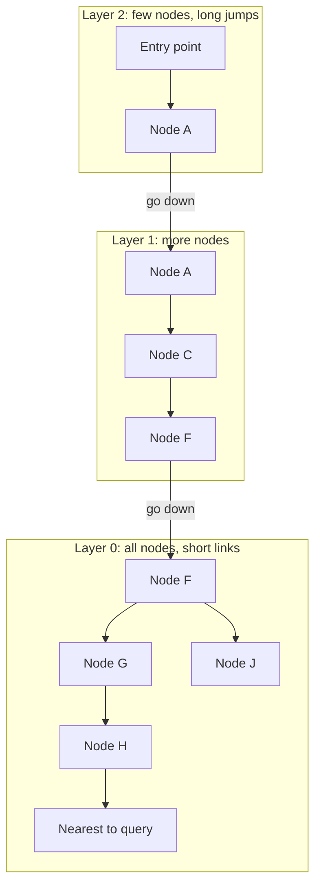
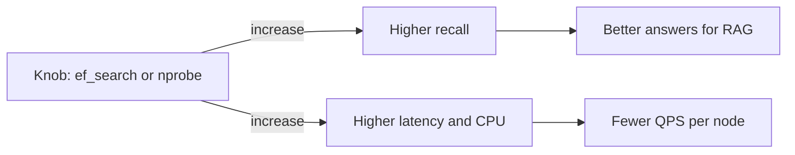
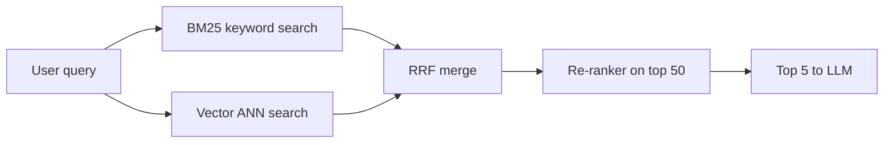
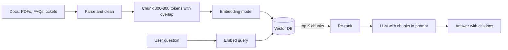

# Vector Databases

Vector DB "meaning" se search karta hai, exact words se nahi. Text, image ya product ko numbers ki ek list (embedding) me badlo, phir "is query ke sabse paas wale K items do". RAG (LLM chat apps), semantic search aur recommendations sab isi pe chalte hain. Interview me HNSW, recall vs latency, filtering aur "kya sach me vector DB chahiye" poocha jaata hai.

## ⭐ Embeddings, simple words me

**Ek line me:** embedding ek fixed-length float array hai (jaise 1536 numbers) jo kisi cheez ka matlab capture karta hai; jo cheezein matlab me paas hain, unke vectors bhi paas hote hain.

- Ek **embedding model** (OpenAI `text-embedding-3-small`, Cohere, open-source `bge`, `e5`, CLIP images ke liye) input leke vector deta hai.
- "Sasta phone 15000 ke andar" aur "budget smartphone under 15k" ke words alag hain, par vectors paas honge. Keyword search ye miss kar deta.
- Dimensions model pe depend: 384, 768, 1024, 1536, 3072. Zyada dims = zyada memory, thoda better quality.
- **Same model** se query aur documents dono embed karo. Alag models ke vectors compare nahi hote.

> **Example:** Flipkart pe "office ke liye aaram wali kursi" search kiya. Product title me "ergonomic chair" likha hai. Vector search dono ko match kar deta hai.

Memory math (interview me kaam aata hai):
- 1 crore vectors × 1536 dims × 4 bytes (float32) ≈ **61 GB** sirf raw vectors. Index (HNSW links) upar se ~10–30% aur.
- Isliye quantization (float16, int8, PQ) aur dims kam karna (`dimensions` parameter, Matryoshka embeddings) matter karta hai.

**Interview tip:** bolo "embedding = semantic coordinates. Vector DB ka kaam bas itna hai: billions points me se query ke nearest K jaldi dhoondhna, filters ke saath."

**Common galti:** embedding model badal dena bina poora corpus re-embed kiye. Purane aur naye vectors alag "space" me hain, results kachra ho jaate hain.

## ⭐ Similarity metrics: cosine, dot product, L2

**Ek line me:** do vectors kitne "paas" hain, ye teen tareeke se naapte hain: angle (cosine), dot product, ya seedhi doori (L2 / Euclidean).

| Metric | Formula (idea) | Range | Kab |
|---|---|---|---|
| Cosine similarity | `a·b / (‖a‖ ‖b‖)`, sirf angle | -1 se 1 (1 = same direction) | text embeddings, default choice |
| Dot product (inner product) | `a·b`, angle + length | unbounded | normalized vectors pe cosine jaisa, fastest; recommendation me length = popularity |
| L2 (Euclidean) distance | `sqrt(sum (a-b)^2)` | 0 se infinity (0 = same) | image embeddings, kuch models isi pe trained |

- Vectors **normalized** hain (length 1) to cosine, dot aur L2 sab same ranking dete hain. OpenAI embeddings normalized aate hain.
- Jis metric pe model train hua, wahi use karo. Model card me likha hota hai.
- Distance (chhota = better) vs similarity (bada = better) ka dhyan rakho. pgvector `<=>` cosine **distance** deta hai = 1 − cosine similarity.

**Interview tip:** "Cosine kyun?" Text me document ki length vector ki magnitude badha sakti hai; cosine sirf direction dekhta hai, isliye lamba aur chhota document same topic pe match hota hai.

**Common galti:** index ek metric pe banaya (L2) aur query dusre (cosine) se ki. Index use hi nahi hoga ya galat results aayenge.

## ⭐ Exact vs approximate nearest neighbour

**Ek line me:** exact kNN har vector se compare karta hai (100% sahi, slow); ANN ek index se sirf kuch candidates dekhta hai (95–99% sahi, bahut fast).

| | Exact kNN (brute force / flat) | ANN (HNSW, IVF, PQ) |
|---|---|---|
| Kaise | query vs har vector, top-K | index se candidates, unme top-K |
| Time | O(N × d) | ~O(log N) (HNSW) |
| Recall | 100% | 90–99%, tunable |
| Memory | sirf vectors | vectors + index |
| Kab | < 1 lakh vectors, ya chhota filtered subset | lakhon se arabon vectors |

- 1 lakh × 768 dims brute force SIMD ke saath ~10–20 ms. Chhote corpus pe ANN index ki zarurat hi nahi.
- 1 crore pe brute force ~ seconds. Yahan ANN chahiye.
- **Recall@K** = exact top-K me se kitne ANN ne laaye. ANN tune karne ka main metric yahi hai.

**Interview tip:** recall ko exact search se compare karke naapo: sample queries pe flat search chalao, ANN ke results usse match karo.

**Common galti:** "vector DB hamesha sahi nearest deta hai" maan lena. ANN approximate hai; kuch relevant results miss ho sakte hain.

## ⭐ HNSW (Hierarchical Navigable Small World)

**Ek line me:** multi-layer graph: upar ki layers me kam nodes aur lambe jumps, neeche ki layer me saare nodes aur chhote jumps; search upar se greedy chal ke neeche aata hai, jaise skip list.

Kaise kaam karta hai:
1. Har vector ek node hai. Insert pe random level milta hai (zyada nodes sirf layer 0 me, kuch layer 1 me, bahut kam layer 2 me).
2. Har layer me node apne ~`M` nearest neighbours se link hota hai.
3. **Search:** top layer ke entry point se shuru. Har step pe us neighbour pe jao jo query ke sabse paas hai. Aur paas koi nahi to ek layer neeche utro. Layer 0 me `ef_search` size ki candidate list rakh ke best K lo.



| Parameter | Kya karta hai | Badhao to |
|---|---|---|
| `M` | har node ke max links | recall up, memory up, build slow |
| `ef_construction` | build time pe candidate list size | better graph, build slow |
| `ef_search` | query time pe candidate list size | recall up, latency up |

- Fayde: bahut achha recall-latency balance, incremental inserts, koi training nahi.
- Nuksaan: memory heavy (graph RAM me), deletes mushkil (tombstones, periodic rebuild), build slow.

**Interview tip:** "HNSW skip list jaisa hai: upar se coarse navigation, neeche fine search. Query time `ef_search` se recall vs latency tune karta hoon."

**Common galti:** HNSW ko disk-friendly samajhna. Random pointer jumps hain; RAM me na ho to latency bahut badh jaati hai. Disk ke liye DiskANN jaise index hain.

## IVF aur PQ

**Ek line me:** IVF vectors ko clusters me baant ke sirf paas wale clusters search karta hai; PQ vectors ko compress karta hai taaki RAM me zyada fit hon.

**IVF (Inverted File index):**
- Training: k-means se `nlist` centroids banao (jaise 1000). Har vector apne nearest centroid ki list me jaata hai.
- Query: query ke nearest `nprobe` centroids (jaise 10) ki lists hi scan karo.
- `nprobe` badhao = recall up, latency up. Data distribution badla to re-train chahiye.
- HNSW se kam memory, build fast, par same recall pe usually thoda slow.

**PQ (Product Quantization):**
- 1536-dim vector ko 96 chhote sub-vectors me todo; har sub-vector ko 256 codes me se ek ID (1 byte) se replace karo.
- 6 KB ka vector ~96 bytes ban gaya (~64x chhota). Distance approximate ho jaata hai.
- Common combo: **IVF-PQ** (FAISS, Milvus). Pehle PQ se candidates, phir original vectors se **re-rank**.

| Index | Memory | Speed | Recall | Note |
|---|---|---|---|---|
| Flat | high | slow at scale | 100% | baseline |
| HNSW | highest | fastest | very high | default for most |
| IVF-Flat | medium | fast | high | needs training |
| IVF-PQ | very low | fast | medium | billions scale, re-rank chahiye |

**Interview tip:** "1 arab vectors RAM me nahi aayenge. IVF-PQ ya DiskANN, aur top-100 ko full-precision vectors se re-rank."

**Common galti:** IVF index khaali ya bahut chhoti table pe bana dena. Centroids data se train hote hain; pehle data load karo, phir index.

## ⭐ Recall vs latency trade-off

**Ek line me:** zyada candidates dekhoge to zyada sahi results, par zyada time; har ANN knob (`ef_search`, `nprobe`) isi dial ko ghumata hai.



Practical numbers (rough, 1 crore vectors, HNSW):
- recall 0.90 → ~2 ms, recall 0.95 → ~5 ms, recall 0.99 → ~15–20 ms.
- Aakhri 1% recall sabse mehenga hota hai.

Kaise choose karein:
- RAG: recall 0.95 kaafi hai, kyunki LLM top-5/10 chunks hi padhta hai aur re-ranker baad me hai.
- Dedup / fraud (miss nahi hona chahiye): high recall, ya exact search on filtered set.
- Bahut QPS: replicas badhao, ya quantization se memory bachao.

**Interview tip:** SLO aise bolo: "p99 < 50 ms at recall@10 ≥ 0.95". Sirf latency bolna adhoora hai.

**Common galti:** sirf latency benchmark karna aur recall naapna bhool jaana.

## ⭐ Metadata filtering: pre-filter vs post-filter

**Ek line me:** "Bengaluru ke restaurants me se similar" jaisi query me filter vector search se pehle lagao (pre) ya baad me (post), dono ke trade-off hain.

| | Pre-filter | Post-filter |
|---|---|---|
| Kaise | pehle filter, phir sirf matching vectors me search | pehle top-K ANN, phir filter |
| Accuracy | sahi K results | K se kam bach sakte hain (filter ne hata diye) |
| Problem | restrictive filter pe HNSW graph "toot" jaata hai, brute force pe girna padta hai | selective filter pe 0 results |
| Fix | filtered HNSW (Qdrant, Weaviate, Pinecone andar karte hain) | K ko oversample karo (top 200 lo, filter, top 10) |

- Modern DBs **in-filter / filtered traversal** karte hain: HNSW walk ke time hi non-matching nodes skip, par graph connectivity ke liye unke through jaate hain.
- Bahut selective filter (1% data) pe planner brute force on filtered set choose karta hai. Ye achha hai.
- Multi-tenant SaaS: tenant ke hisaab se **namespace / partition** alag karo, filter se better.

**Interview tip:** "Filter selective hai to pre-filter + flat scan, broad hai to filtered HNSW. Post-filter sirf oversampling ke saath."

**Common galti:** pgvector me `WHERE city = 'Pune' ORDER BY embedding <=> $1 LIMIT 10` likh ke maan lena ki 10 results aayenge. HNSW index scan pehle ~`ef_search` candidates laata hai, phir filter; kam aa sakte hain. pgvector 0.8+ me `hnsw.iterative_scan` on karo.

## Hybrid search: BM25 + vector

**Ek line me:** keyword search (BM25) exact terms pakadta hai, vector search matlab; dono ke results merge karo to best of both.

- Vector search me kamzori: SKU codes, naam, error codes ("ERR_402"), rare words. BM25 inhe exact pakadta hai.
- BM25 me kamzori: synonyms, paraphrase, dusri language.
- **Merge kaise:** Reciprocal Rank Fusion (RRF): `score = sum 1 / (60 + rank_i)`. Scores ko normalize karne ki zarurat nahi, sirf rank.
- Ya weighted: `alpha * vector_score + (1 - alpha) * bm25_score` (Weaviate `alpha`).
- Aksar teesra step: **cross-encoder re-ranker** top 50 ko dobara score karta hai.



Tools: Elasticsearch/OpenSearch (BM25 + kNN dono), Weaviate `hybrid`, Qdrant sparse + dense vectors, Postgres `tsvector` + pgvector. Dekho [Search: Elasticsearch](08-search.md).

**Interview tip:** RAG design me bolo "hybrid retrieval + re-ranker"; sirf vector search pe product codes aur naam miss hote hain.

**Common galti:** BM25 aur cosine scores ko seedha add kar dena. Scales alag hain; RRF ya normalization use karo.

## ⭐ pgvector: Postgres me vector search

**Ek line me:** Postgres extension jo `vector` column type, distance operators aur HNSW/IVFFlat index deta hai, taaki vectors baaki data ke saath ek hi DB me rahein.

| Command / method | Kya karta hai | Example |
|---|---|---|
| `CREATE EXTENSION vector` | pgvector enable | `CREATE EXTENSION IF NOT EXISTS vector;` |
| `vector(n)` | n-dim column | `embedding vector(1536)` |
| `<->` | L2 distance | `ORDER BY embedding <-> $1` |
| `<=>` | cosine distance (1 − similarity) | `ORDER BY embedding <=> $1` |
| `<#>` | negative inner product | `ORDER BY embedding <#> $1` |
| `USING hnsw (col vector_cosine_ops)` | HNSW index | `WITH (m = 16, ef_construction = 64)` |
| `USING ivfflat (col vector_l2_ops)` | IVF index | `WITH (lists = 1000)` |
| `SET hnsw.ef_search` | query recall knob | `SET hnsw.ef_search = 100;` |
| `SET ivfflat.probes` | IVF clusters to scan | `SET ivfflat.probes = 10;` |
| `halfvec(n)` | float16, aadhi memory | `embedding halfvec(3072)` |

```sql
CREATE EXTENSION IF NOT EXISTS vector;

CREATE TABLE doc_chunks (
    id          BIGSERIAL PRIMARY KEY,
    doc_id      BIGINT NOT NULL,
    tenant_id   BIGINT NOT NULL,
    content     TEXT NOT NULL,
    embedding   vector(1536) NOT NULL,
    created_at  TIMESTAMPTZ DEFAULT now()
);

-- HNSW index cosine ke liye (operator class query ke operator se match hona chahiye)
CREATE INDEX ON doc_chunks USING hnsw (embedding vector_cosine_ops)
    WITH (m = 16, ef_construction = 64);
CREATE INDEX ON doc_chunks (tenant_id);

-- Ya IVFFlat: data load karne ke BAAD banao, lists ~ rows/1000
-- CREATE INDEX ON doc_chunks USING ivfflat (embedding vector_cosine_ops) WITH (lists = 1000);

-- Insert (app embedding model se vector laata hai)
INSERT INTO doc_chunks (doc_id, tenant_id, content, embedding)
VALUES (7, 1, 'Refund 5-7 din me account me aata hai', '[0.012, -0.044, ...]');

-- Top 5 similar chunks, tenant filter ke saath
SET hnsw.ef_search = 100;
SET hnsw.iterative_scan = relaxed_order;   -- pgvector 0.8+: filter ke baad bhi K results
SELECT id, content, 1 - (embedding <=> $1) AS similarity
FROM doc_chunks
WHERE tenant_id = 1
ORDER BY embedding <=> $1
LIMIT 5;
```

- Fayde: ek hi DB, ACID, joins, backups, permissions. Metadata filter normal SQL `WHERE`.
- Limits: ~1–5 crore vectors per node tak comfortable; HNSW build memory heavy (`maintenance_work_mem` badhao); indexed `vector` max 2000 dims (`halfvec` 4000).

**Interview tip:** "Chhote se medium scale pe pgvector se shuru karunga, kyunki data already Postgres me hai. Scale ya QPS badhe to dedicated vector DB."

**Common galti:** `ORDER BY` me `<->` likhna jab index `vector_cosine_ops` pe bana hai. Index use nahi hoga, seq scan hoga.

## Pinecone, Milvus, Weaviate, Qdrant

**Ek line me:** dedicated vector DBs: sab upsert, top-K query + filter, delete aur namespaces/collections dete hain; fark hosting, filtering aur scale me hai.

| Command / method | Kya karta hai | Example |
|---|---|---|
| `upsert` | id + vector + metadata insert/replace | Pinecone `index.upsert(vectors=[...], namespace="t1")` |
| `query` / `search` | top-K nearest, filter ke saath | Pinecone `index.query(vector=v, top_k=5, filter={...})` |
| `delete` | ids ya filter se hatao | `index.delete(ids=["c1"], namespace="t1")` |
| namespace / partition / tenant | data ko logically alag | Pinecone namespace, Milvus partition, Weaviate tenant |
| Qdrant `query_points` | search with `query_filter` | `client.query_points("docs", query=v, limit=5)` |
| Milvus `search` | search with boolean `filter` expr | `client.search("docs", data=[v], limit=5, filter='city == "Pune"')` |
| Weaviate `near_vector` / `hybrid` | vector ya hybrid search | `col.query.hybrid(query="refund", alpha=0.5, limit=5)` |

```python
from pinecone import Pinecone

pc = Pinecone(api_key="...")
index = pc.Index("support-docs")

# Upsert: har chunk ka id, vector, metadata
index.upsert(
    vectors=[
        {"id": "doc7-c0", "values": emb0, "metadata": {"doc_id": 7, "lang": "hi", "city": "Pune"}},
        {"id": "doc7-c1", "values": emb1, "metadata": {"doc_id": 7, "lang": "en", "city": "Pune"}},
    ],
    namespace="tenant-swiggy",
)

# Query: top 5, metadata filter ke saath
res = index.query(
    vector=query_emb,
    top_k=5,
    filter={"lang": {"$eq": "en"}, "doc_id": {"$in": [7, 9]}},
    include_metadata=True,
    namespace="tenant-swiggy",
)
for m in res.matches:
    print(m.id, m.score, m.metadata["doc_id"])

# Document delete hua to uske chunks hatao
index.delete(ids=["doc7-c0", "doc7-c1"], namespace="tenant-swiggy")
```

| | Pinecone | Milvus | Weaviate | Qdrant | pgvector |
|---|---|---|---|---|---|
| Hosting | managed only (serverless) | open source + Zilliz Cloud | open source + cloud | open source + cloud | Postgres extension |
| Scale | billions | billions, distributed | crore se arab | crore se arab | crore tak per node |
| Strength | zero ops | GPU index, IVF-PQ, DiskANN | hybrid search built-in, modules | fast filtered search (Rust) | ek hi DB, SQL |
| Kab | team ops nahi chahti | bahut bada scale | hybrid + multi-tenant | heavy filtering | already Postgres |

**Interview tip:** design me naam lene se zyada zaroori hai bolna: "upsert idempotent hai id se, namespace per tenant, filter pe index hai."

**Common galti:** chunk ids random rakhna. `docId-chunkNo` jaisa deterministic id rakho, warna re-ingest pe duplicates aur delete mushkil.

## ⭐ RAG ke liye chunking aur embedding pipeline

**Ek line me:** documents ko chhote chunks me todo, har chunk embed karke vector DB me daalo; query aane pe similar chunks nikaal ke LLM ke prompt me do.



Ingestion ke decisions:
- **Chunk size:** 300–800 tokens, 10–20% overlap. Bahut chhota = context toota; bahut bada = irrelevant text, embedding blur.
- **Structure-aware chunking:** headings, paragraphs, tables pe todo, fixed character count pe nahi.
- **Metadata:** `doc_id`, `tenant_id`, `source_url`, `updated_at`, `acl`. Filtering aur citations isi se.
- **Updates:** doc badla to uske saare chunk ids delete + re-upsert. Kafka/CDC se trigger karo.
- **Batching:** embedding API batch me call karo (100–1000 per call), rate limits ke saath.
- **Versioning:** `embedding_model` metadata me rakho; model badla to naye index me re-embed, phir switch.

Query time:
- Query embed → top 20–50 (hybrid) → re-rank → top 5 prompt me.
- Permission filter (ACL) retrieval pe hi lagao, LLM ke baad nahi.

**Interview tip:** RAG me sabse zyada quality chunking aur retrieval se aati hai, LLM badalne se kam. Ye line interviewer ko pasand aati hai.

**Common galti:** ACL filter na lagana. User A ke private docs User B ke answer me aa jaayenge.

## Kab vector DB ki zarurat nahi

**Ek line me:** chhota corpus, kam QPS, ya data already Postgres me hai to alag vector DB ek extra system hai jo maintain karna padega.

| Situation | Choice |
|---|---|
| < 1 lakh vectors, kabhi kabhi query | in-memory NumPy / FAISS flat, ya brute force |
| < 1 crore vectors, data Postgres me | pgvector (HNSW) |
| Search already Elasticsearch/OpenSearch pe | uska kNN field use karo |
| Prototype / hackathon | in-process FAISS, Chroma, LanceDB |
| Crore se arab vectors, high QPS, heavy filtering | dedicated vector DB |
| Exact keyword match chahiye (SKU, order id) | normal index / BM25, vector nahi |

- 10,000 FAQ chunks × 1536 × 4 bytes = 61 MB. Ye app ki RAM me aa jaata hai; brute force < 5 ms.
- Ek aur DB = ek aur sync pipeline, backup, monitoring, consistency issue.

**Interview tip:** interviewer "vector DB kaunsa?" pooche to pehle scale poocho. "10k docs ke liye pgvector ya in-memory kaafi hai, Pinecone overkill."

**Common galti:** har AI feature me alag vector DB daal dena, bina corpus size calculate kiye.

## Kin systems me lagta hai

- [LLM Chat App](../02-questions/t2-22-llm-chat-app.md): RAG retrieval, conversation memory, semantic cache (same matlab wale sawal ka cached answer).
- [Recommendation System](../02-questions/t2-23-recommendation-system.md): two-tower model ke user/item embeddings, candidate generation ANN se, phir ranking model.
- [Typeahead](../02-questions/t1-10-typeahead.md): semantic suggestions (mostly prefix trie hi kaafi).
- [Search Indexing](../01-topics/14-search-indexing.md): hybrid search, inverted index + vectors.
- Related: [Graph Databases](10-graph.md), [Search: Elasticsearch](08-search.md).

## Interview me bolo

- "Documents ko 500-token chunks me todke embed karunga, chunk id + tenant + ACL metadata ke saath vector DB me. Query pe hybrid retrieval, re-rank, phir top 5 LLM ko."
- "ANN index HNSW, `ef_search` se recall 0.95 pe tune; scale chhota hai to pgvector, warna dedicated vector DB with namespace per tenant."

## Common galtiyan

- Query aur documents alag embedding models se embed karna.
- Index metric aur query operator mismatch.
- Filtered search me post-filter se K se kam results aana aur notice na karna.
- Sirf latency benchmark karna, recall nahi.
- Chhote corpus ke liye dedicated vector DB laana.

## Checklist

- [ ] Embedding kya hai aur 1 crore vectors ki memory calculate kar sakta hoon
- [ ] Cosine, dot product aur L2 ka fark aur kab kaunsa, bata sakta hoon
- [ ] Exact vs ANN aur recall@K samjha sakta hoon
- [ ] HNSW layers, `M`, `ef_search` aur IVF/PQ ka idea samjha sakta hoon
- [ ] Pre-filter vs post-filter aur hybrid search (BM25 + vector, RRF) samjha sakta hoon
- [ ] pgvector me table, HNSW index aur filtered top-K query likh sakta hoon
- [ ] Pinecone/Qdrant jaise DB me upsert, query with filter, delete aur namespace use kar sakta hoon
- [ ] RAG ka chunking/embedding pipeline aur "vector DB kab nahi chahiye" bata sakta hoon
