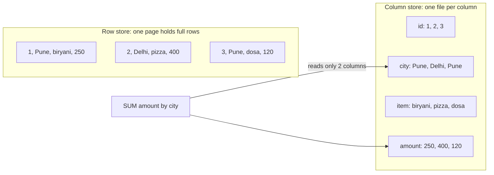
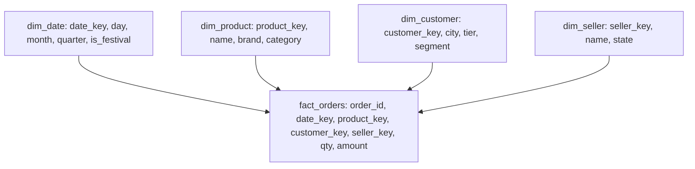
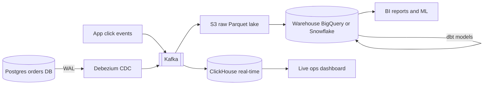

# Columnar / OLAP

OLAP databases arabon rows pe `GROUP BY`, `SUM`, `COUNT` second me chalane ke liye bane hain. Trick simple hai: data column-wise store karo, compress karo, aur sirf wahi columns padho jo query me hain. Interview me "dashboard / analytics / aggregation kahan se serve karoge" ka jawab yahi hai, aur ye bhi ki OLTP DB (Postgres/MySQL) pe ye queries kyun nahi chalani.

## ⭐ OLTP vs OLAP

**Ek line me:** OLTP = bahut saari chhoti read/write transactions (ek order place karo); OLAP = kam par bhaari queries jo crore rows scan karke aggregate karti hain (is mahine city-wise sales).

| | OLTP | OLAP |
|---|---|---|
| Example query | `SELECT * FROM orders WHERE id = 42` | `SELECT city, SUM(amount) FROM orders GROUP BY city` |
| Rows per query | 1–100 | lakhon se arabon |
| Columns per query | saare | 3–10 (out of 100+) |
| Writes | frequent, single row, UPDATE/DELETE | bulk append, rarely update |
| Latency goal | ms, high QPS | ms se seconds, kam QPS |
| Storage | row-oriented, B-tree | column-oriented, compressed |
| Schema | normalized (3NF) | denormalized, star schema |
| Examples | Postgres, MySQL, DynamoDB | ClickHouse, BigQuery, Snowflake, Redshift, Druid, Pinot |
| Users | app (customers) | analysts, dashboards, ML, kabhi user-facing analytics |

> **Example:** Swiggy pe order place karna OLTP hai (Postgres me ek row). "Pichhle 30 din me Bengaluru me har ghante kitne biryani orders aaye" OLAP hai (crore rows ka scan).

**Interview tip:** bolo "analytics queries ko primary OLTP DB pe chalaana production ko slow karta hai: buffer pool pollute hota hai, locks/IO compete karte hain. Data ko OLAP store me copy karo."

**Common galti:** "read replica pe chala lenge" kehna aur ruk jaana. Replica bhi row store hai; 50 crore rows ka GROUP BY waha bhi minutes lega.

## ⭐ Row vs column storage

**Ek line me:** row store ek row ke saare columns saath rakhta hai (ek order fetch karna fast); column store ek column ki saari values saath rakhta hai (ek column pe aggregate fast).



- 100 columns ki table, query 2 columns use karti hai. Row store poori row padhega (100 columns ka IO). Column store sirf 2 files padhega: **~50x kam IO**.
- Ek column me same type ki values hain, aur aksar repeat hoti hain (city), isliye compression bahut achha.
- Nuksaan: ek poori row padhne ke liye 100 alag files se ek ek value jodni padti hai. Single row insert/update mehenga.
- Isliye OLAP DBs **batch me likhte hain**: pehle memory/small parts me, phir background me merge (LSM jaisa).

**Interview tip:** "Column store me query cost ~ (columns touched × rows scanned) / compression ratio. Isliye `SELECT *` OLAP me sabse mehengi galti hai."

**Common galti:** column store me row-by-row `INSERT` karna (har second hazaar single inserts). Batch karo (10k–100k rows per insert) ya Kafka se ingest karo.

## ⭐ Compression aur vectorized execution

**Ek line me:** same type ki repeat hone wali values 5–20x compress hoti hain, aur CPU ek saath hazaar values pe SIMD instructions chalata hai, ek ek row pe loop nahi.

Compression techniques:

| Technique | Kaise | Kahan achha |
|---|---|---|
| Dictionary encoding | "Bengaluru" ko id 3 se replace | low-cardinality strings (city, status) |
| Run-length encoding (RLE) | "Pune ×5000" | sorted columns |
| Delta encoding | timestamps ke differences store | time, increasing ids |
| Bit packing | chhote integers kam bits me | flags, small counts |
| General codec (LZ4, ZSTD) | upar se byte-level compression | sab |

- Data jitna **sorted** hoga (ORDER BY key), utna RLE/delta better.
- Compressed data = kam disk IO, aur zyada data cache/RAM me fit.

Vectorized execution:
- Row-at-a-time engine (classic Postgres) har row ke liye function calls karta hai: `next() → eval → next()`.
- Vectorized engine ek column ka **batch** (jaise 8192 values) leke tight loop chalata hai. CPU cache friendly, SIMD (AVX2) ek instruction me 8–16 values process karta hai.
- Saath me: **late materialization** (filters pehle compressed columns pe, rows baad me jodo), **zone maps / min-max indexes** (block ka min/max dekh ke poora block skip).

**Interview tip:** ClickHouse fast kyun hai? Teen cheezein bolo: columnar + compression (kam IO), vectorized SIMD execution (kam CPU per row), aur sparse primary index se data skipping.

**Common galti:** OLAP table me high-cardinality random string (UUID) ko sort key ke pehle column me rakhna. Compression aur data skipping dono kharab.

## ⭐ Star schema: fact aur dimension

**Ek line me:** beech me ek bada **fact** table (events/transactions, numbers), charon taraf chhote **dimension** tables (kaun, kya, kahan, kab), jo descriptive attributes rakhte hain.



- **Fact:** bahut lamba (arabon rows), patla (foreign keys + measures). Grain decide karo: "ek row = ek order line item".
- **Dimension:** chhota (hazaron se lakhon rows), chauda (bahut attributes).
- **Snowflake schema:** dimensions bhi normalized (product → category table). Kam storage, zyada joins.
- **Slowly Changing Dimension (SCD Type 2):** customer ne city badli to nayi dimension row with `valid_from`/`valid_to`, taaki purane orders purani city me gine jaayein.
- Modern columnar DBs me **wide denormalized table** (One Big Table) bhi common hai: joins nahi, compression duplicates sambhal leta hai.

```sql
-- Diwali week me category-wise revenue, tier-2 cities me
SELECT p.category, SUM(f.amount) AS revenue
FROM fact_orders f
JOIN dim_date d     ON f.date_key = d.date_key
JOIN dim_product p  ON f.product_key = p.product_key
JOIN dim_customer c ON f.customer_key = c.customer_key
WHERE d.is_festival = TRUE AND d.year = 2025
  AND c.tier = 2
GROUP BY p.category
ORDER BY revenue DESC;
```

**Interview tip:** "Fact table ka grain pehle fix karo." Grain galat (daily summary) hua to baad me hourly drill-down possible nahi.

**Common galti:** fact table me descriptive strings (product name, city name) har row me daal dena row store mindset se, aur phir dimension bhi rakhna. Ya to star schema, ya conscious denormalization; dono adhoore nahi.

## Materialized views aur rollups

**Ek line me:** baar baar chalne wali aggregation ka result pehle se calculate karke store karo, taaki dashboard raw events ki jagah chhoti summary table padhe.

- **Rollup:** raw clicks (1 arab/day) → per minute per ad (1 crore/day) → per hour (20 lakh/day). Har level 10–100x chhota.
- **Materialized view (MV):**
  - Postgres: `CREATE MATERIALIZED VIEW ...; REFRESH MATERIALIZED VIEW CONCURRENTLY ...` (poora dobara compute, schedule pe).
  - ClickHouse: MV ek **insert trigger** hai: har naye insert block pe query chalake target table me likhta hai. Incremental, real-time.
  - BigQuery / Snowflake: automatic incremental refresh, aur optimizer query ko MV pe rewrite kar sakta hai.
- Druid/Pinot ingestion ke time hi rollup karte hain (raw row store hi nahi hota agar rollup on hai).

| Raw rakhna | Sirf rollup rakhna |
|---|---|
| koi bhi naya sawal pooch sakte ho | storage aur query bahut sasti |
| mehenga | detail chali gayi (unique users, debugging) |
| usual: raw 30–90 din, rollups saalon tak | |

**Interview tip:** "Raw events object storage me sasta rakhta hoon (replay ke liye), hot rollups OLAP me dashboard ke liye."

**Common galti:** distinct count (unique users) ko rollups me add kar dena. Hourly unique users ko jodne se daily unique nahi milte; HyperLogLog sketches (`uniqState`, `HLL_COUNT`) store karo.

## ⭐ ClickHouse

**Ek line me:** open-source columnar DB (Yandex se nikla) jo ek ya kuch servers pe arabon rows per second scan karta hai; real-time ingestion aur sub-second dashboards ke liye.

Core concepts:
- **MergeTree engine:** insert ek naya immutable "part" banata hai (sorted by ORDER BY). Background me parts merge hote hain (LSM jaisa).
- **ORDER BY key = primary key (sorting key):** data isi order me disk pe. **Sparse primary index:** har 8192 rows (granule) ka ek entry. Filter jo ORDER BY ke prefix pe ho, wo granules skip karta hai.
- **PARTITION BY:** usually month (`toYYYYMM`). Purana data drop karna sasta (`DROP PARTITION`), TTL bhi.
- Variants: `ReplacingMergeTree` (same key pe latest rakho, dedup/upsert ke liye), `SummingMergeTree` / `AggregatingMergeTree` (merge pe sum/aggregate), `ReplicatedMergeTree` (replication via Keeper).
- `Distributed` table engine se sharding: query saare shards pe jaati hai, results merge.

| Command / method | Kya karta hai | Example |
|---|---|---|
| `ENGINE = MergeTree` | main columnar table | `ENGINE = MergeTree ORDER BY (campaign_id, event_time)` |
| `PARTITION BY` | data ko partitions me baanto | `PARTITION BY toYYYYMM(event_time)` |
| `ORDER BY` | sort + sparse primary index | `ORDER BY (campaign_id, ad_id, event_time)` |
| `TTL` | purana data auto delete / move | `TTL event_time + INTERVAL 90 DAY` |
| `toStartOfHour()` | time ko ghante pe round | `GROUP BY toStartOfHour(event_time)` |
| `uniq()` / `uniqExact()` | approx / exact distinct | `uniq(user_id)` |
| `quantile(0.99)()` | percentile | `quantile(0.99)(latency_ms)` |
| `CREATE MATERIALIZED VIEW ... TO` | insert pe incremental rollup | niche example |
| `FINAL` | query time pe merge (Replacing/Summing) | `SELECT ... FROM t FINAL` |
| `ALTER TABLE ... DROP PARTITION` | poora partition hatao, instant | `ALTER TABLE ad_clicks DROP PARTITION 202501` |
| `ENGINE = Kafka` | Kafka topic se direct ingest | MV ke saath MergeTree me |

```sql
-- Raw ad clicks
CREATE TABLE ad_clicks
(
    event_time   DateTime,
    click_id     UUID,
    ad_id        UInt64,
    campaign_id  UInt32,
    city         LowCardinality(String),
    device       LowCardinality(String),
    cost_paise   UInt32
)
ENGINE = MergeTree
PARTITION BY toYYYYMM(event_time)
ORDER BY (campaign_id, ad_id, event_time)
TTL event_time + INTERVAL 90 DAY;

-- Batch insert (app ya Kafka consumer 10k+ rows ek saath bhejta hai)
INSERT INTO ad_clicks VALUES
    ('2025-10-20 21:05:11', generateUUIDv4(), 501, 12, 'Bengaluru', 'android', 150),
    ('2025-10-20 21:05:12', generateUUIDv4(), 502, 12, 'Pune', 'ios', 150);

-- Campaign 12 ke hourly clicks aur spend, pichhle 24 ghante
SELECT
    toStartOfHour(event_time) AS hour,
    ad_id,
    count()                    AS clicks,
    sum(cost_paise) / 100      AS spend_rs
FROM ad_clicks
WHERE campaign_id = 12
  AND event_time >= now() - INTERVAL 24 HOUR
GROUP BY hour, ad_id
ORDER BY hour, clicks DESC;

-- Hourly rollup table + MV jo har insert pe update hota hai
CREATE TABLE ad_clicks_hourly
(
    hour         DateTime,
    campaign_id  UInt32,
    ad_id        UInt64,
    clicks       UInt64,
    cost_paise   UInt64
)
ENGINE = SummingMergeTree
ORDER BY (campaign_id, ad_id, hour);

CREATE MATERIALIZED VIEW ad_clicks_hourly_mv TO ad_clicks_hourly AS
SELECT toStartOfHour(event_time) AS hour, campaign_id, ad_id,
       count() AS clicks, sum(cost_paise) AS cost_paise
FROM ad_clicks
GROUP BY hour, campaign_id, ad_id;

-- Dashboard rollup padhta hai; merge async hai isliye phir bhi sum() lagao
SELECT hour, sum(clicks) AS clicks
FROM ad_clicks_hourly
WHERE campaign_id = 12
GROUP BY hour ORDER BY hour;
```

**Interview tip:** ORDER BY key aise chuno ki sabse common filter uska prefix ho, aur low-cardinality columns pehle (`campaign_id` phir `ad_id` phir `event_time`). Isse data skipping aur compression dono achhe.

**Common galti:** ClickHouse me `UPDATE`/`DELETE` OLTP jaisa use karna. `ALTER TABLE ... UPDATE` ek heavy "mutation" hai jo parts rewrite karta hai. Upserts ke liye `ReplacingMergeTree` + version column.

## ⭐ BigQuery

**Ek line me:** Google ka serverless data warehouse: na server, na index; SQL likho, Google hazaron workers pe chala deta hai, aur paisa scanned bytes ke hisaab se lagta hai.

- **Serverless:** storage (Colossus) aur compute (slots, Dremel engine) alag. Koi cluster size nahi.
- **Columnar storage (Capacitor):** sirf touched columns ke bytes gine jaate hain.
- **Pricing:** on-demand me per TiB scanned (lagbhag $6.25/TiB, region pe depend), ya capacity pricing (reserved slots). Storage alag, sasti.
- **Partitioned tables:** date/timestamp column (ya integer range) pe. Filter lagao to sirf wo partitions scan.
- **Clustered tables:** partition ke andar data kuch columns (max 4) pe sorted; filter pe blocks skip.
- `--dry_run` ya UI ka estimate query chalane se pehle bytes bata deta hai.
- Streaming inserts / Storage Write API se near real-time, par point lookup ke liye nahi.

```sql
-- Flipkart orders: date pe partition, category + city pe cluster
CREATE TABLE shop.orders (
  order_id   STRING,
  order_ts   TIMESTAMP,
  city       STRING,
  category   STRING,
  seller_id  STRING,
  amount     NUMERIC
)
PARTITION BY DATE(order_ts)
CLUSTER BY category, city
OPTIONS (
  require_partition_filter = TRUE,     -- bina date filter ki query reject: bill bachao
  partition_expiration_days = 730
);

-- Big Billion Days ke 5 din, Mobiles, city-wise GMV aur orders
SELECT
  city,
  COUNT(*)            AS orders,
  SUM(amount)         AS gmv,
  APPROX_COUNT_DISTINCT(seller_id) AS sellers
FROM shop.orders
WHERE DATE(order_ts) BETWEEN '2025-09-23' AND '2025-09-27'   -- sirf 5 partitions
  AND category = 'Mobiles'                                     -- cluster pruning
GROUP BY city
ORDER BY gmv DESC
LIMIT 20;
```

Cost ka example: 2 TB ki table, `SELECT *` = 2 TB billed. Upar wali query 5 din × 3 columns (+ clustering) = shayad 5–10 GB. **~200x sasta.**

**Interview tip:** "BigQuery me `LIMIT` se cost kam nahi hota; scanned columns aur partitions se hota hai."

**Common galti:** `SELECT *` aur bina partition filter ki query, dashboard pe har minute refresh. Bill lakhon me. BI Engine / MV / cached results use karo.

## Apache Druid aur Pinot: real-time analytics

**Ek line me:** Kafka se seconds me data ingest karke, hazaron concurrent users ko sub-second aggregation dene wale OLAP stores; user-facing analytics ke liye.

- **Use case:** jab analytics end users dekhte hain, sirf analysts nahi. LinkedIn "Who viewed your profile" (Pinot), Uber Eats restaurant manager dashboard (Pinot), Swiggy/Zomato restaurant partner app ke live orders, Airbnb/Netflix metrics (Druid).
- **Kaise:**
  - Real-time ingestion Kafka se; data seconds me query-able.
  - Data time-based **segments** me; purane segments deep storage (S3) me, historical nodes pe cache.
  - **Ingestion-time rollup**: same dimensions wali rows merge hoke counts ban jaati hain.
  - Indexes: bitmap/inverted indexes (Druid), star-tree index (Pinot) pre-aggregations ke liye.
- **Limits:** joins kamzor (ab improve ho rahe hain), updates mushkil (Pinot upsert tables support karta hai), operate karna complex (bahut node types).

| | ClickHouse | Druid / Pinot | BigQuery / Snowflake |
|---|---|---|---|
| Latency | ms se sec | sub-second, high concurrency | seconds |
| Freshness | seconds (Kafka engine) | seconds | minutes (streaming possible) |
| Concurrency | hundreds QPS | thousands QPS | low-medium |
| Ops | moderate | complex | none (serverless) |
| Best for | internal + external dashboards, logs | user-facing real-time analytics | ad-hoc analytics, BI, data warehouse |

**Interview tip:** "Analysts ke liye BigQuery/Snowflake, product me user-facing live counters ke liye Pinot/Druid/ClickHouse."

**Common galti:** user-facing high-QPS dashboard seedha BigQuery pe banana. Latency aur cost dono problem.

## Data warehouse vs data lake vs lakehouse

**Ek line me:** warehouse = structured, cleaned, SQL-ready data; lake = sab kuch raw files me (S3) sasta; lakehouse = lake ki files pe warehouse jaisi tables (ACID, schema, fast SQL).

| | Data warehouse | Data lake | Lakehouse |
|---|---|---|---|
| Storage | proprietary columnar, managed | object storage (S3/GCS) files | object storage + open table format |
| Format | internal | Parquet, ORC, JSON, CSV, images | Parquet + Iceberg / Delta Lake / Hudi |
| Schema | schema-on-write (pehle define) | schema-on-read | schema enforced, evolution supported |
| ACID / updates | haan | nahi (files overwrite) | haan (table format se) |
| Cost | zyada | sabse sasta | sasta storage, compute alag |
| Users | BI, analysts | data scientists, ML, raw archive | dono |
| Examples | BigQuery, Snowflake, Redshift | S3 + Athena/Spark | Databricks, Iceberg on S3 + Trino/Spark |

**Interview tip:** "Raw events S3 pe Parquet + Iceberg (lakehouse), curated tables warehouse me ya Iceberg pe hi Trino se. Ek copy, kai engines."

**Common galti:** data lake me bina catalog/schema ke files phenkte rehna. "Data swamp" ban jaata hai; koi nahi jaanta kaunsi file kya hai.

## ⭐ ETL / ELT aur OLTP se CDC

**Ek line me:** OLTP se data OLAP tak lana: ETL me pehle transform phir load; ELT me pehle raw load phir warehouse ke andar SQL se transform; CDC se changes real-time stream hote hain.

| | ETL | ELT |
|---|---|---|
| Transform kahan | alag engine (Spark, Airflow job) | warehouse ke andar SQL (dbt) |
| Raw data | aksar nahi bachta | warehouse me raw bhi hai |
| Kab | purane warehouses, heavy cleansing, PII hatana load se pehle | modern cloud warehouses (default) |

**CDC (Change Data Capture):**
- Postgres WAL / MySQL binlog padho (Debezium), har insert/update/delete Kafka event ban jaata hai.
- OLTP pe query load zero (nightly `SELECT *` dump nahi).
- Freshness seconds me. Deletes/updates bhi aate hain, isliye OLAP side pe `ReplacingMergeTree` / `MERGE INTO` se upsert.



**Interview tip:** "Analytics ke liye OLTP se nightly dump nahi, CDC via Debezium → Kafka → OLAP. Primary pe load nahi, freshness seconds."

**Common galti:** CDC pipeline me deletes ignore karna. Postgres me cancel/delete hua order OLAP me zinda rehta hai aur GMV galat aata hai.

## Real examples: Flipkart sales dashboard, ad click aggregation

**Ek line me:** dono me raw events stream hote hain, OLAP me aggregate hote hain, aur dashboard rollups padhta hai.

**1. Flipkart Big Billion Days sales dashboard:**
- Orders Postgres/MySQL me (OLTP). CDC → Kafka → ClickHouse/Druid.
- Live dashboard: per minute GMV, category-wise orders, top sellers, city heatmap. Rollup per minute per category per city.
- Next day: warehouse (BigQuery) me poora star schema, finance reconciliation, ML features.
- Peak: lakhon orders per minute; OLAP batch inserts handle karta hai, OLTP pe koi analytic load nahi.

**2. Ad click aggregation:**
- Clicks Kafka me (arabon per din). Stream processor (Flink) dedup + per-minute aggregate karta hai, ya ClickHouse Kafka engine + MV.
- Advertiser dashboard: "campaign 12 ke last 24h hourly clicks aur spend" = upar wali ClickHouse query.
- Raw clicks S3 me reconciliation/billing ke liye; daily batch job stream counts se match karta hai.
- Poora design: [Ad Click Aggregator](../02-questions/t2-17-ad-click-aggregator.md).

**Interview tip:** ad click jaise question me bolo "real-time path (Flink/ClickHouse) approx fast numbers deta hai, batch path (S3 + Spark) billing ke liye exact; dono reconcile."

**Common galti:** ek hi click retry/duplicate ho ke do baar gin jaana. `click_id` se dedup (Flink state ya `ReplacingMergeTree`).

## Kab use nahi karna

**Ek line me:** jahan single row chahiye, ya rows baar baar update hoti hain, ya strong transactions chahiye, wahan columnar DB galat tool hai.

| Kaam | Kyun nahi | Kya lo |
|---|---|---|
| Point lookups (`WHERE order_id = ?`) high QPS | sparse index, poora granule (8192 rows) padhna, har column alag file | Postgres, DynamoDB, Redis |
| Frequent updates (order status, wallet balance) | immutable parts, update = rewrite | OLTP DB |
| Transactions (payment, inventory decrement) | ACID multi-row transactions weak/nahi | Postgres, MySQL |
| Row-by-row tiny inserts | too many parts, merge pressure | batch karo ya Kafka buffer |
| Full-text search | inverted index nahi (basic hi) | Elasticsearch |
| Chhota data (< 1 crore rows) | Postgres hi kaafi tez hai | Postgres + indexes |

**Interview tip:** "OLAP store source of truth nahi hai; source of truth OLTP DB hai, OLAP derived copy hai jo dobara build ho sakti hai."

**Common galti:** ClickHouse ko main app DB bana dena kyunki "bahut fast hai". Fast sirf scans/aggregations me hai.

## Kin systems me lagta hai

- [Ad Click Aggregator](../02-questions/t2-17-ad-click-aggregator.md): ClickHouse/Druid rollups, real-time + batch reconciliation.
- [Distributed Logging](../02-questions/t2-26-distributed-logging.md): logs ClickHouse me (columnar + compression), TTL.
- [YouTube](../02-questions/t1-07-youtube.md): view counts, creator analytics.
- [Flash Sale](../02-questions/t2-15-flash-sale.md) / [E-commerce Inventory](../02-questions/t2-24-ecommerce-inventory.md): sales dashboards CDC se.
- [Counting & Top-K](../01-topics/15-counting-top-k.md), [Message Queues & Kafka](../01-topics/07-message-queues-kafka.md).
- Related: [Time-series Databases](09-time-series.md), [Object Storage: S3](15-object-storage.md).

## Interview me bolo

- "OLTP aur OLAP alag rakhunga: orders Postgres me, CDC se Kafka, phir ClickHouse me hourly rollups via materialized view. Dashboard rollup padhega, raw 90 din TTL ke saath."
- "Column store fast hai kyunki sirf zaroori columns padhta hai, compression 10x deta hai, aur vectorized execution SIMD use karta hai. Par point lookups aur updates ke liye ye galat tool hai."

## Common galtiyan

- Analytics queries production OLTP DB (ya uski replica) pe chalana.
- Column store me single-row inserts aur frequent UPDATE.
- ORDER BY / partition / cluster key query pattern ke hisaab se na chunna.
- BigQuery me `SELECT *` aur bina partition filter ki queries.
- Distinct counts ko rollups me jod dena, CDC me deletes bhool jaana.

## Checklist

- [ ] OLTP vs OLAP ka fark (query shape, storage, schema, examples) table se bata sakta hoon
- [ ] Row vs column storage aur column store me IO kyun kam hota hai samjha sakta hoon
- [ ] Compression techniques aur vectorized execution samjha sakta hoon
- [ ] Star schema me fact aur dimension tables design kar sakta hoon, grain ke saath
- [ ] ClickHouse MergeTree table ORDER BY key ke saath aur toStartOfHour wali GROUP BY query + MV likh sakta hoon
- [ ] BigQuery me partitioned + clustered table bana ke cost (bytes scanned) kam karna bata sakta hoon
- [ ] Druid/Pinot kab, aur warehouse vs lake vs lakehouse ka fark bata sakta hoon
- [ ] ETL vs ELT, CDC pipeline, ad click aggregation design aur columnar DB kab nahi, bata sakta hoon
