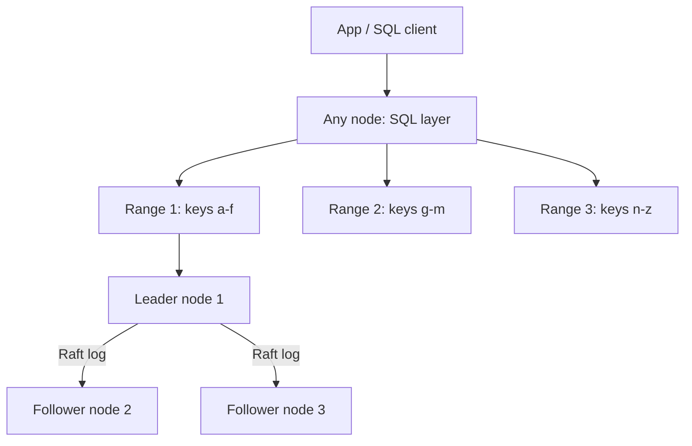
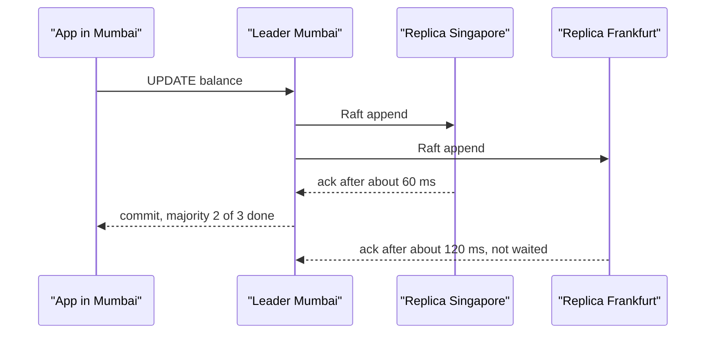

# NewSQL / Distributed SQL

NewSQL = SQL + ACID transactions + horizontal scale, teeno ek saath. Postgres ek machine pe atak jaata hai, Cassandra scale karta hai par joins aur transactions chhod deta hai. Spanner, CockroachDB, YugabyteDB, TiDB beech ka raasta hain. Interview me ye page tab kaam aata hai jab sawal ho: "global payments ya multi-region app, strong consistency bhi chahiye aur scale bhi."

## ⭐ Problem: SQL guarantees + horizontal scale

**Ek line me:** single-node SQL me ACID hai par scale limited; NoSQL me scale hai par transactions/joins weak. NewSQL dono dena chahta hai.

| Option | Kya milta hai | Kya chhootta hai |
|---|---|---|
| Single Postgres + replicas | ACID, joins, rich SQL | writes ek leader pe atke, ek region |
| Manually sharded MySQL | write scale | cross-shard transaction aur join app ko karna padta hai |
| Cassandra / DynamoDB | massive scale, multi-region | joins nahi, transactions limited, eventual consistency default |
| **NewSQL** | SQL + ACID + auto-sharding + multi-region | har write pe consensus latency, ops complexity, cost |

> **Real example:** Paytm ya Razorpay jaisa payments ledger jo India + Southeast Asia dono me chal raha hai. Balance kabhi negative nahi hona chahiye (ACID), aur ek region down ho to bhi payments chalne chahiye (multi-region). Manual sharding me cross-shard transfer ka two-phase commit khud likhna padta. NewSQL ye DB ke andar deta hai.

**Interview tip:** NewSQL ko "magic" mat bolo. Bolo: "Ye CAP me CP side choose karta hai. Partition ke time minority side writes reject karegi, par data galat nahi hoga."

**Common galti:** sochna ki NewSQL Postgres jitna fast hoga. Single-row write pe bhi consensus round trip lagta hai, isliye latency zyada hoti hai.

## ⭐ Kaise kaam karta hai: ranges, Raft, distributed transactions

**Ek line me:** table ko key-range ke chunks (range / tablet / region) me todo, har chunk ko 3 ya 5 replicas pe Raft se replicate karo, aur multi-range transaction ke liye 2PC jaisa protocol chalao.

Building blocks:
1. **Ranges / tablets:** data primary key order me sorted hai. ~512 MB (CockroachDB default) hone pe range split ho jaati hai, load kam ho to merge. Ye automatic sharding hai.
2. **Raft per range:** har range ka apna Raft group (3 replicas). Ek **leaseholder/leader** reads aur writes serve karta hai. Write tab commit jab majority (2 of 3) ne log me likh liya.
3. **Distributed transactions:** transaction kai ranges chhue to ek transaction record banta hai, writes pehle "intents" (provisional) ki tarah likhe jaate hain, commit pe transaction record COMMITTED hota hai aur intents resolve ho jaate hain. Ye 2PC ka optimized roop hai, aur coordinator crash ho to bhi recover hota hai kyunki state khud Raft me replicated hai.
4. **MVCC + timestamps:** har version ka timestamp. Snapshot reads aur serializable isolation ke liye clocks chahiye.
5. **SQL layer:** upar ek stateless SQL layer jo query plan banake sahi ranges tak bhejta hai. Koi bhi node query le sakta hai.



### Clocks: TrueTime vs Hybrid Logical Clocks

Distributed DB me "kaunsa transaction pehle hua" decide karne ke liye timestamps chahiye, par machines ki clocks drift karti hain.

| Approach | Kaun use karta hai | Kaise |
|---|---|---|
| **TrueTime** | Google Spanner | GPS + atomic clocks har datacenter me. API `TT.now()` ek interval `[earliest, latest]` deta hai, uncertainty ~1–7 ms. |
| **Hybrid Logical Clock (HLC)** | CockroachDB, YugabyteDB | physical time + logical counter. Max clock offset (default 500 ms) assume karta hai, uncertainty window me read aaye to restart/retry. |
| **Timestamp Oracle (TSO)** | TiDB (PD server) | ek central service monotonic timestamps deti hai. Simple, par TSO ek hop aur bottleneck. |

**Interview tip:** "Spanner ko atomic clocks kyun chahiye?" Taaki clock uncertainty chhoti aur bounded rahe. Commit wait utni hi der karna padta hai jitni uncertainty hai.

**Common galti:** NTP ko accurate maan lena. NTP pe 100+ ms drift ho sakta hai, isliye CockroachDB node ko band kar deta hai agar offset limit cross ho.

## ⭐ Google Spanner

**Ek line me:** Google ka globally distributed SQL database jo TrueTime se **external consistency** deta hai (strict serializability).

- **TrueTime + commit wait:** transaction ko timestamp `s = TT.now().latest` milta hai, phir leader tab tak wait karta hai jab tak `TT.now().earliest > s` na ho jaaye. Iske baad commit visible. Matlab agar T1 commit hone ke baad T2 shuru hua, to T2 ka timestamp T1 se bada hi hoga, duniya me kahin bhi.
- **External consistency:** real-time order = DB order. Ye linearizability ka transaction version hai.
- **Splits + Paxos:** data splits me, har split Paxos group (Raft nahi, Paxos) se replicate.
- **Interleaved tables:** child rows parent ke saath physically store hote hain (same split), isliye parent-child join local aur fast.
- **Lock-free read-only transactions** past timestamp pe (stale reads) kisi bhi replica se.
- Cloud Spanner managed service hai, GoogleSQL aur PostgreSQL dialect dono.

```sql
-- Spanner: interleaved table. Orders apne Customer ke saath hi store honge
CREATE TABLE Customers (
  CustomerId INT64 NOT NULL,
  Name       STRING(100),
) PRIMARY KEY (CustomerId);

CREATE TABLE Orders (
  CustomerId INT64 NOT NULL,
  OrderId    INT64 NOT NULL,
  Amount     NUMERIC,
) PRIMARY KEY (CustomerId, OrderId),
  INTERLEAVE IN PARENT Customers ON DELETE CASCADE;

-- Stale read (10 sec purana data), kisi bhi nearby replica se, lock nahi
-- Client library me: read_timestamp / exact_staleness = 10s
```

**Interview tip:** primary key me monotonically increasing value (timestamp, auto-increment) mat rakho. Saare inserts ek hi split pe jaayenge = hotspot. UUIDv4 ya bit-reversed sequence use karo.

**Common galti:** interleaving ko foreign key jaisa maan lena. Ye physical layout decision hai, sirf tab jab parent-child hamesha saath padhe jaate hon.

## ⭐ CockroachDB

**Ek line me:** open-source (source-available) Spanner-inspired DB jo **Postgres wire protocol** bolta hai, ranges + Raft + HLC pe chalta hai, aur bina atomic clocks ke commodity hardware/cloud pe chalta hai.

Features:
- **Postgres compatible:** `psql`, JDBC Postgres driver, most ORMs chal jaate hain. Par sab Postgres features nahi (kuch extensions, triggers limited).
- **Default isolation SERIALIZABLE.** Conflicts pe `40001` retry error aata hai, client ko retry loop chahiye. (Naye versions me READ COMMITTED bhi available.)
- **Ranges:** automatic split/merge/rebalance. Node add karo, data khud phail jaata hai.
- **Survival goals:** database level pe bolo kitna failure jhelna hai: `ZONE` (ek AZ fail) ya `REGION` (poora region fail, 5 replicas lagte hain, writes slow).
- **Table locality (multi-region):** `REGIONAL BY ROW` (har row apne user ke region me), `REGIONAL BY TABLE` (poori table ek home region me), `GLOBAL` (reads har jagah fast, writes slow; reference data ke liye).
- Change data capture (`CREATE CHANGEFEED`) Kafka me.

### Important commands

| Command | Kya karta hai | Example |
|---|---|---|
| `ALTER DATABASE ... PRIMARY REGION` | multi-region DB ka home region | `ALTER DATABASE pay PRIMARY REGION "ap-south-1";` |
| `ALTER DATABASE ... ADD REGION` | naya region add | `ALTER DATABASE pay ADD REGION "ap-southeast-1";` |
| `ALTER DATABASE ... SURVIVE` | survival goal | `ALTER DATABASE pay SURVIVE REGION FAILURE;` |
| `ALTER TABLE ... SET LOCALITY` | table placement | `ALTER TABLE users SET LOCALITY REGIONAL BY ROW;` |
| `SHOW RANGES` | table kitni ranges me bata hai | `SHOW RANGES FROM TABLE payments;` |
| `AS OF SYSTEM TIME` | stale/follower read, kam latency | `SELECT * FROM t AS OF SYSTEM TIME '-10s';` |
| `CREATE CHANGEFEED` | CDC stream | `CREATE CHANGEFEED FOR payments INTO 'kafka://...';` |
| `SELECT ... FOR UPDATE` | row lock, retries kam | `SELECT balance FROM accounts WHERE id=1 FOR UPDATE;` |

```sql
-- Multi-region payments DB
ALTER DATABASE pay PRIMARY REGION "ap-south-1";       -- Mumbai
ALTER DATABASE pay ADD REGION "ap-southeast-1";       -- Singapore
ALTER DATABASE pay ADD REGION "eu-west-1";
ALTER DATABASE pay SURVIVE REGION FAILURE;

CREATE TABLE accounts (
  id      UUID PRIMARY KEY DEFAULT gen_random_uuid(),  -- UUID: hotspot nahi
  user_id UUID NOT NULL,
  balance DECIMAL(18,2) NOT NULL CHECK (balance >= 0)
) LOCALITY REGIONAL BY ROW;  -- hidden crdb_region column, row user ke region me

CREATE TABLE currencies (code STRING PRIMARY KEY, name STRING)
  LOCALITY GLOBAL;           -- har region se fast read

-- Transfer: dono rows alag ranges me ho sakti hain, phir bhi ACID
BEGIN;
UPDATE accounts SET balance = balance - 500 WHERE id = 'a1...';
UPDATE accounts SET balance = balance + 500 WHERE id = 'b2...';
COMMIT;  -- 40001 aaya to poora transaction retry karo
```

**Interview tip:** "CockroachDB me SERIALIZABLE default hai, isliye app me retry loop zaroori hai." Ye line bolne se lagta hai tumne use kiya hai.

**Common galti:** `SERIAL` / auto-increment primary key. Saare inserts last range pe = hot range. `gen_random_uuid()` ya hash-sharded index (`USING HASH`) use karo.

## YugabyteDB

**Ek line me:** Postgres ka actual query layer (fork) + distributed storage (DocDB, RocksDB based) jisme tablets Raft se replicate hote hain.

- **YSQL** (Postgres compatible, Postgres code reuse karta hai, isliye compatibility CockroachDB se zyada) aur **YCQL** (Cassandra jaisa API).
- Tablets hash ya range sharded. Default hash sharding pe first PK column.
- HLC use karta hai. xCluster async replication bhi deta hai (region ke beech, kam latency, par eventual).
- Kab: Postgres app ko scale-out karna hai aur extensions/stored procedures zyada use hote hain.

```sql
-- Yugabyte: hash vs range sharding PK me hi bolte hain
CREATE TABLE orders (
  user_id  BIGINT,
  order_id BIGINT,
  amount   NUMERIC,
  PRIMARY KEY (user_id HASH, order_id ASC)   -- user pe hash, order sorted
) SPLIT INTO 16 TABLETS;
```

## TiDB and Vitess: MySQL ko scale karna

| | TiDB | Vitess |
|---|---|---|
| Kya hai | MySQL-compatible distributed SQL (PingCAP) | MySQL ke upar sharding middleware (YouTube se nikla, ab PlanetScale) |
| Storage | TiKV (Raft per region, RocksDB) + TiFlash (columnar, HTAP) | asli MySQL instances, har shard ek MySQL |
| Sharding | automatic region split | VSchema me vindex (shard key) define karo, resharding tools |
| Transactions | distributed ACID (Percolator model, TSO) | single-shard ACID, cross-shard best-effort/2PC optional |
| Kab | MySQL app ko auto-scale + analytics bhi | existing bada MySQL fleet, Slack/GitHub/YouTube scale |

**Interview tip:** "Vitess NewSQL nahi, sharding layer hai. Ye MySQL ko hi rakhta hai, bas routing aur resharding automate karta hai."

## ⭐ Comparison: Postgres vs NewSQL vs Cassandra

| | Postgres (single primary) | CockroachDB / Spanner / Yugabyte | Cassandra |
|---|---|---|---|
| Data model | relational | relational | wide-column, partition key based |
| Transactions | full ACID | full ACID, distributed, serializable | single partition LWT (Paxos), costly |
| Joins | haan, fast | haan, cross-range me network cost | nahi |
| Write scale | ek leader | horizontal (har range ka alag leader) | horizontal, leaderless |
| Consistency | strong (leader pe) | strong / linearizable | tunable, default eventual |
| Write latency | ~1–5 ms | ~5–20 ms single region, cross-region 100+ ms | ~1–5 ms |
| Multi-region | async replicas, manual failover | built-in, auto failover | built-in, multi-DC |
| Ops | simple, mature | medium, naya tooling | medium-hard (compaction, repair) |
| Best for | 90% apps | global ACID at scale | huge write-heavy, simple access |

## ⭐ Consensus ki latency cost

**Ek line me:** har write ko majority replicas tak jaana padta hai, isliye write latency = leader se nearest majority tak ka round trip.

| Setup | Majority round trip | Typical write latency |
|---|---|---|
| 3 replicas, ek region, 3 AZ | ~1–2 ms | ~5–10 ms |
| 3 regions: Mumbai, Singapore, Frankfurt | Mumbai → Singapore ~60 ms | ~70–150 ms |
| 5 replicas across continents | 2nd nearest region tak | 150 ms+ |

Latency kam karne ke tareeke:
- **Leaseholder ko user ke paas rakho** (`REGIONAL BY ROW`). Read local, write ko majority ke liye ek remote ack chahiye.
- **Follower / stale reads** (`AS OF SYSTEM TIME '-10s'`, Spanner bounded staleness) jahan thoda purana data chalta hai.
- **Transactions chhote rakho**, ek transaction me kam ranges chhuo. Cross-region multi-range transaction sabse mehenga.
- **Batch writes** ek round trip me.



**Interview tip:** ye number bolo: "Single region me consensus write ~5–10 ms, cross-region ~100 ms+. Isliye home region pinning karte hain."

## ⭐ Kab use karo / kab nahi

| Use karo | Mat karo |
|---|---|
| Global payments / ledger: ACID + multi-region survival (Paytm, Stripe jaisa) | Startup ya normal app jo ek Postgres + replicas me fit hai (99% cases) |
| Multi-region SaaS jahan data residency chahiye (EU data EU me) | Analytics / OLAP: [Columnar](12-columnar-olap.md) lo |
| Inventory / booking jahan oversell nahi chalega aur scale bada hai | Super low latency (<2 ms) writes, ya simple KV access: Redis / DynamoDB |
| Postgres sharding manually karne ki naubat aa gayi | Write-heavy append-only logs/metrics: Cassandra, time-series DB |
| Region failure pe zero data loss (RPO = 0) chahiye | Budget tight hai: 3–5x replicas + license/cloud cost |

**Bolo:** "Pehle Postgres + read replicas + caching. Jab single primary ki write limit ya multi-region strong consistency ki zarurat aaye, tab CockroachDB/Spanner. Uski keemat consensus latency hai."

## Kin system design questions me

- [Payment System](../02-questions/t1-11-payment-system.md): ledger ke liye strong consistency, multi-region
- [BookMyShow](../02-questions/t1-05-bookmyshow.md): seat booking jahan double booking nahi chalegi
- [E-commerce Inventory](../02-questions/t2-24-ecommerce-inventory.md): stock decrement ACID ke saath
- [Distributed KV Store](../02-questions/t2-20-distributed-kv-store.md): Raft/replication concepts
- Background: [Distributed Transactions](../01-topics/16-distributed-transactions.md), [CAP & Consistency](../01-topics/06-cap-consistency.md), [Sharding](../01-topics/04-sharding-consistent-hashing.md)

## Common galtiyan

- NewSQL ko default choice banana. Ops aur latency cost bina zarurat ke.
- Sequential primary key: hot range. UUID ya hash-sharded keys.
- Retry logic na likhna. Serializable me `40001` normal hai.
- Har table ko `GLOBAL` banana: writes har region me slow ho jaate hain.
- 3 regions ke bina `SURVIVE REGION FAILURE` expect karna. Majority ke liye kam se kam 3 regions chahiye.

## Checklist

- [ ] NewSQL kya problem solve karta hai, Postgres aur Cassandra se compare karke bata sakta hoon
- [ ] Ranges/tablets, Raft per range aur write intents wala distributed commit samjha sakta hoon
- [ ] TrueTime, commit wait aur external consistency 2 line me samjha sakta hoon
- [ ] HLC aur max clock offset ka role aur TiDB ka TSO approach bata sakta hoon
- [ ] CockroachDB me multi-region DB, survival goal aur `REGIONAL BY ROW` / `GLOBAL` table ka SQL likh sakta hoon
- [ ] Sequential primary key se hot range kyun banti hai aur fix kya hai bata sakta hoon
- [ ] Consensus write latency ke numbers aur use kam karne ke 3 tareeke bata sakta hoon
- [ ] NewSQL kab worth it hai aur kab overkill, ek decision line me bol sakta hoon
