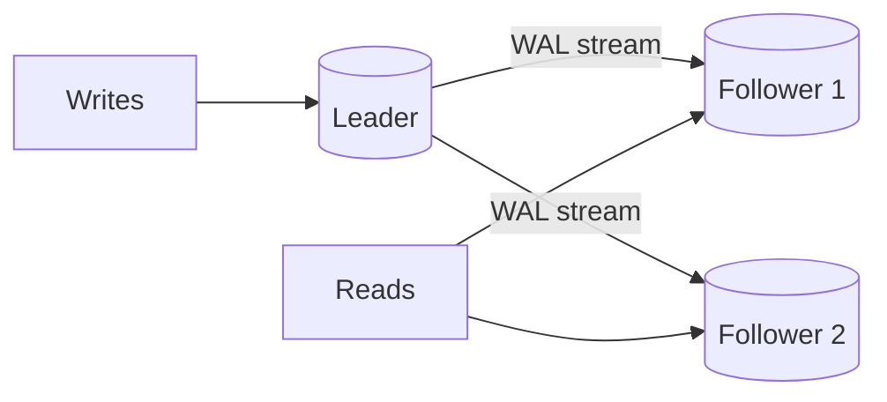
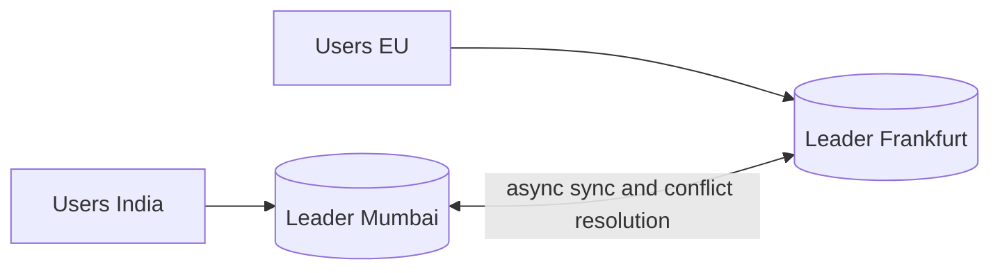
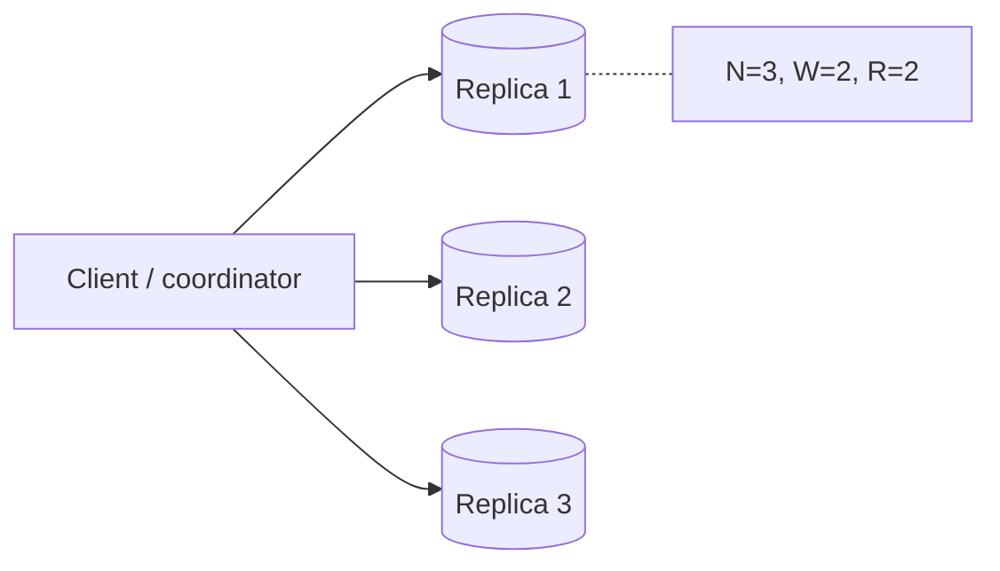
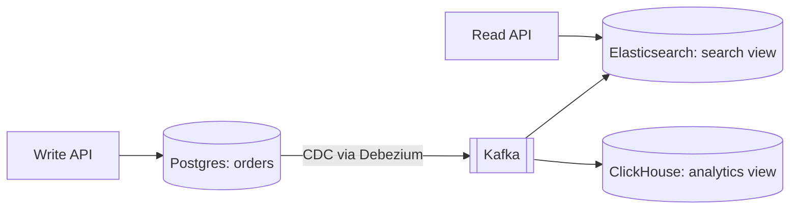
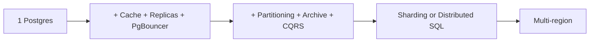

# Scaling Databases

App servers stateless hote hain, unhe scale karna aasaan hai. Asli bottleneck database hota hai. Is page me woh poori seedhi hai jo interview me chadhni hoti hai: bada machine → read replicas → caching → partitioning → sharding → multi-region. Har step ka trade-off bolna hi interviewer check karta hai.

## ⭐ Vertical vs horizontal scaling

**Ek line me:** vertical = badi machine (zyada CPU/RAM/IOPS); horizontal = zyada machines me load ya data baanto.

| | Vertical (scale up) | Horizontal (scale out) |
|---|---|---|
| Kaise | `db.r6g.2xlarge` → `db.r6g.16xlarge` | replicas, shards, partitions |
| Code change | koi nahi | routing, consistency handle karni padti hai |
| Limit | hardware ki ceiling, cost exponential | almost unlimited |
| Failure | ek machine = single point of failure | ek node gaya to baaki chalte hain |
| Kab | pehla step, hamesha | jab vertical khatam ya HA chahiye |

> **Real example:** Zerodha ne saalon tak bade Postgres machines pe kaam chalaya. Ek modern machine (64 cores, 512 GB RAM, NVMe) pe Postgres ~10k–50k simple writes/sec aur kai TB data aaram se le leta hai.

**Interview tip:** "Pehle vertical scale karo, measure karo, phir horizontal." Seedha sharding bolna red flag hai.

**Common galti:** sharding ko pehla step bolna. Sharding sabse aakhri aur sabse mehenga step hai.

## ⭐ Read replicas aur replication lag

**Ek line me:** primary saare writes leta hai, WAL/binlog replicas ko stream karta hai, aur reads replicas pe baant dete hain.

- Read-heavy apps (90% reads: feeds, catalog, profiles) ke liye best.
- **Async replication** (default): primary wait nahi karta. Fast, par replica peeche ho sakti hai (lag ms se seconds tak). Primary crash = last few writes lost.
- **Sync replication:** commit tab jab kam se kam ek replica ne confirm kiya. Zero data loss, par write latency badhti hai. Postgres me `synchronous_standby_names`.
- **Semi-sync** (MySQL): ek replica ne receive kiya (apply nahi) to commit.

### Replication lag ki problems aur fix

| Problem | Example | Fix |
|---|---|---|
| **Read-your-writes** toota | user ne profile update kiya, refresh pe purana dikha | apni writes ke baad X sec tak user ko primary se padho; ya session me last-write LSN rakho aur replica tab tak use mat karo jab tak woh LSN replay na kar le |
| **Monotonic reads** toota | pehli request naye replica se, dusri purane se: data "peeche" gaya | user ko sticky replica do (user_id hash se) |
| **Consistent prefix** toota | reply pehle dikha, sawal baad me | related writes same partition me, ya causal ordering |

```sql
-- Primary pe: replicas kitne peeche hain
SELECT client_addr, state, sent_lsn, replay_lsn,
       replay_lag
FROM pg_stat_replication;

-- Replica pe: last replayed transaction kitna purana hai
SELECT now() - pg_last_xact_replay_timestamp() AS lag;
```

**Interview tip:** read replicas bolte hi khud bolo: "Replication lag ki wajah se read-your-writes ke liye critical reads primary pe bhejunga."

**Common galti:** replicas ko write scaling samajhna. Replicas sirf reads scale karte hain, saare writes abhi bhi ek primary pe.

## ⭐ Replication topologies: leader-follower, multi-leader, leaderless

**Leader-follower (single leader):** ek leader writes leta hai, followers copy karte hain. Postgres, MySQL, MongoDB replica set. Simple, conflicts nahi.



**Multi-leader:** har region me ek leader, dono writes lete hain aur aapas me async sync karte hain. Multi-region low-latency writes, offline apps (Google Docs jaisa). Problem: **write conflicts** (do jagah same row badli). Fix: last-write-wins (data loss risk), CRDTs, ya app-level merge.



**Leaderless:** client ya coordinator N replicas ko likhta hai, W acks ka wait karta hai; R replicas se padhta hai. `W + R > N` ho to read me latest write milega (quorum). Cassandra, DynamoDB, Riak. Repair: read repair, hinted handoff, anti-entropy (Merkle trees).



| | Leader-follower | Multi-leader | Leaderless |
|---|---|---|---|
| Write path | ek leader | har region ka leader | koi bhi W replicas |
| Conflicts | nahi | haan, resolve karne padte | haan, versions/LWW |
| Failover | promote follower | doosra leader already hai | koi failover nahi chahiye |
| Examples | Postgres, MySQL | multi-region MySQL, CouchDB | Cassandra, DynamoDB |

## ⭐ Sharding strategies

**Ek line me:** data ko shard key ke basis pe alag DB instances me baanto, taaki writes aur storage dono scale ho jaayein.

| Strategy | Kaise | Pros | Cons |
|---|---|---|---|
| **Range** | `user_id 1–1M` shard 1, `1M–2M` shard 2 | range queries fast, simple | hotspot (naye users last shard pe), uneven |
| **Hash** | `hash(user_id) % N` ya consistent hashing | even distribution | range queries sab shards pe (scatter-gather), resharding mushkil agar `% N` |
| **Directory / lookup** | lookup table: `tenant_id → shard` | flexible, tenant move kar sakte ho | lookup service extra hop + SPOF, cache karna padta |
| **Geo** | India users → Mumbai shard, EU → Frankfurt | low latency, data residency (GDPR) | region-wise uneven load, cross-region queries slow |

### Shard key kaise chuno

- **High cardinality:** bahut saari distinct values (`user_id` haan, `country` nahi).
- **Even distribution:** ek key pe zyada traffic na ho.
- **Query pattern se match:** zyada tar queries ek hi shard pe khatam hon. Swiggy orders: `customer_id` se shard karo to "meri orders" ek shard pe; restaurant dashboard ke liye alag read model.
- **Cross-shard transactions avoid:** jo data saath badalta hai woh ek shard pe (tenant ka saara data ek shard pe, SaaS me common).
- **Monotonic key se bacho** range sharding me (timestamp, auto-increment): saare inserts last shard pe.

**Interview tip:** shard key bolte hi do cheezein justify karo: "Distribution even rahega kyunki ..., aur main query single-shard rahegi kyunki ..."

**Common galti:** sharding ke baad joins, unique constraints aur auto-increment IDs ka plan na batana. Global IDs ke liye Snowflake jaisa [ID generator](../01-topics/17-unique-id-generation.md) chahiye.

## ⭐ Resharding aur consistent hashing

**Ek line me:** `hash % N` me N badla to almost saari keys move hoti hain; consistent hashing me sirf ~1/N keys move hoti hain.

- **Consistent hashing:** keys aur nodes dono ek ring pe. Key apne clockwise next node pe. Node add = sirf padosi ki keys move. Virtual nodes se load even. Detail: [Sharding & Consistent Hashing](../01-topics/04-sharding-consistent-hashing.md).
- **Fixed many partitions:** shuru me hi 1024 logical partitions bana do, 8 physical nodes pe map karo. Node add = kuch partitions move, key → partition mapping kabhi nahi badalti. (Cassandra vnodes, Elasticsearch shards, Vitess.)
- **Online resharding steps:** naye shards pe copy (snapshot + CDC se catch up) → dual write ya replication → verify → read switch → write switch → purana cleanup.

## ⭐ Hot partitions aur unke fixes

**Ek line me:** ek shard key pe disproportionate traffic (celebrity, IPL match, flash sale item) ek shard ko pighla deta hai jabki baaki khaali baithe hain.

| Fix | Kaise | Trade-off |
|---|---|---|
| **Salting / key suffix** | `item_123#0` … `item_123#9`, writes random suffix pe | reads ko 10 jagah se merge karna |
| **Split hot range** | auto-split (DynamoDB, CockroachDB) ya manually us key ko alag shard | sirf range-based systems me easy |
| **Cache in front** | hot reads Redis/CDN se | sirf reads ke liye |
| **Write buffering / aggregation** | counters ko memory/Redis me jodo, har 1 sec DB me flush | thoda delay, crash pe loss risk |
| **Dedicated shard** | celebrity/tenant ko apna shard | directory sharding chahiye |

```sql
-- Salting: IPL match ke like counter ko 16 rows me baanto
INSERT INTO like_counter (match_id, bucket, cnt)
VALUES ('ipl-final', floor(random() * 16)::int, 1)
ON CONFLICT (match_id, bucket) DO UPDATE SET cnt = like_counter.cnt + 1;

-- Read: sab buckets jodo
SELECT sum(cnt) FROM like_counter WHERE match_id = 'ipl-final';
```

Link: [Counting & Top-K](../01-topics/15-counting-top-k.md), [Flash Sale](../02-questions/t2-15-flash-sale.md).

## ⭐ Connection pooling

**Ek line me:** DB connections mehenge hain (Postgres me har connection ek process, ~5–10 MB), isliye app connections reuse karo aur total limit me rakho.

- **App-side pool:** HikariCP (Java), `pg-pool` (Node), SQLAlchemy pool. Har app instance ka apna pool.
- **Proxy pool:** PgBouncer, RDS Proxy, ProxySQL (MySQL). Hazaron client connections ko kuch sau server connections pe multiplex.
- **PgBouncer modes:** `session` (client ke saath poora session), `transaction` (transaction khatam to connection wapas, most common), `statement` (rare). Transaction mode me session features (session-level prepared statements, `SET`, advisory locks) dhyan se.

**HikariCP sizing:** chhota pool better hai. Formula (PostgreSQL wiki): `connections = (core_count * 2) + effective_spindle_count`. 8-core DB ≈ 20 connections kaafi. 50 app pods × 20 pool = 1000 connections → Postgres pighlega, isliye beech me PgBouncer.

```properties
# HikariCP (Spring Boot application.properties)
spring.datasource.hikari.maximum-pool-size=10
spring.datasource.hikari.minimum-idle=10
spring.datasource.hikari.connection-timeout=3000
spring.datasource.hikari.max-lifetime=1700000
```

```ini
; pgbouncer.ini
[databases]
orders = host=10.0.0.5 port=5432 dbname=orders
[pgbouncer]
pool_mode = transaction
max_client_conn = 5000
default_pool_size = 40
```

**Common galti:** "load badha to pool size 200 kar do." Zyada connections = context switching + lock contention, throughput girta hai.

## ⭐ Caching in front of DB

**Ek line me:** hot reads ko Redis/Memcached se serve karo taaki DB tak sirf misses jaayein.

- **Cache-aside** (most common): read pe cache miss → DB → cache set with TTL. Write pe DB update + cache delete.
- Read-heavy load ka 80–95% cache absorb kar leta hai. Stampede, invalidation, hot keys ka dhyan rakho.
- Detail: [Caching](../01-topics/05-caching.md).

## CQRS aur materialized read models

**Ek line me:** write model (normalized, OLTP) aur read model (denormalized, query ke shape me) alag rakho; CDC/events se read model update karo.

- Flipkart: orders Postgres me (write), "seller dashboard" ke liye Elasticsearch/ClickHouse me denormalized view (read).
- Postgres me chhote case ke liye `MATERIALIZED VIEW` + `REFRESH MATERIALIZED VIEW CONCURRENTLY`.
- Trade-off: read model eventually consistent hai.



## ⭐ Partitioning inside one DB

**Ek line me:** ek badi table ko ek hi DB ke andar kai child tables me baanto (by date, region, hash). Sharding nahi hai: same server, same transaction.

Fayde: partition pruning (query sirf relevant partition padhe), purana data `DROP PARTITION` se turant hatao (DELETE nahi), chhote indexes, vacuum fast.

```sql
-- Postgres declarative partitioning: orders by month
CREATE TABLE orders (
  id          BIGINT GENERATED ALWAYS AS IDENTITY,
  customer_id BIGINT NOT NULL,
  amount      NUMERIC(12,2),
  created_at  TIMESTAMPTZ NOT NULL,
  PRIMARY KEY (id, created_at)          -- partition key PK me hona chahiye
) PARTITION BY RANGE (created_at);

CREATE TABLE orders_2026_09 PARTITION OF orders
  FOR VALUES FROM ('2026-09-01') TO ('2026-10-01');
CREATE TABLE orders_2026_10 PARTITION OF orders
  FOR VALUES FROM ('2026-10-01') TO ('2026-11-01');

CREATE INDEX ON orders (customer_id, created_at);  -- har partition pe ban jaata hai

-- Pruning: sirf orders_2026_10 scan hogi
EXPLAIN SELECT * FROM orders WHERE created_at >= '2026-10-01';

-- Purana data archive: detach karo, S3 me export, drop
ALTER TABLE orders DETACH PARTITION orders_2026_09 CONCURRENTLY;
DROP TABLE orders_2026_09;
```

Hash/list bhi: `PARTITION BY HASH (customer_id)` ke saath `FOR VALUES WITH (MODULUS 8, REMAINDER 0)`, `PARTITION BY LIST (region)`. Partitions auto-create ke liye `pg_partman`.

**Common galti:** query me partition key filter na dena. Tab saari partitions scan hoti hain, fayda zero.

## Cold data archiving

- 90% queries last 3 months ke data pe hoti hain. Purana data hot DB me rakhna = bade indexes, slow backups, mehenga storage.
- Pattern: time-partition → purani partition detach → Parquet me [S3](15-object-storage.md) pe export → Athena/Trino/BigQuery se query.
- DynamoDB/Mongo me TTL se auto-delete + stream se archive.

## ⭐ Backups, PITR aur failover

**Backups:**
- **Logical** (`pg_dump`, `mysqldump`): portable, slow, bade DB ke liye nahi.
- **Physical** (`pg_basebackup`, EBS snapshots, pgBackRest): fast restore.
- **PITR (point-in-time recovery):** base backup + continuous WAL archive. "Kal 3:42 PM pe kisi ne `DELETE` bina `WHERE` chala diya" → 3:41 tak restore. RDS me 1–35 din retention.
- **RPO** (kitna data kho sakte ho) aur **RTO** (kitni der me wapas) numbers bolo. Restore ka test regularly karo, untested backup = koi backup nahi.

**Failover:**
- Health check fail → sabse up-to-date replica promote → clients ko naya endpoint (DNS/VIP/proxy).
- Tools: Patroni (Postgres + etcd), RDS Multi-AZ (~60–120 sec), Orchestrator (MySQL).
- **Split brain** se bacho: purane primary ko fence karo (STONITH), consensus store se leader election.
- Async replica promote = last few writes lost ho sakte hain (RPO > 0).

```bash
# Postgres replica ko primary banao
pg_ctl promote -D /var/lib/postgresql/data
# ya SQL se (PG 12+)
psql -c "SELECT pg_promote();"
```

## ⭐ Practical commands aur config

| Command / config | Kya karta hai | Example |
|---|---|---|
| `CREATE PUBLICATION` | logical replication ka source (primary pe) | `CREATE PUBLICATION orders_pub FOR TABLE orders;` |
| `CREATE SUBSCRIPTION` | doosre DB me subscribe (migration, upgrade, CDC) | `CREATE SUBSCRIPTION orders_sub CONNECTION 'host=pg1 dbname=shop' PUBLICATION orders_pub;` |
| `pg_stat_replication` | replicas ka state aur lag | `SELECT client_addr, replay_lag FROM pg_stat_replication;` |
| `pg_last_xact_replay_timestamp()` | replica pe lag | `SELECT now() - pg_last_xact_replay_timestamp();` |
| `PARTITION BY RANGE` | declarative partitioning | `CREATE TABLE logs (...) PARTITION BY RANGE (ts);` |
| `ATTACH / DETACH PARTITION` | partition jodo/hatao | `ALTER TABLE logs DETACH PARTITION logs_2025;` |
| `synchronous_standby_names` | sync replication | `synchronous_standby_names = 'ANY 1 (r1, r2)'` |
| `wal_level = logical` | logical replication enable | `postgresql.conf` me |
| `pg_basebackup` | physical backup / naya replica | `pg_basebackup -h pg1 -D /data -R -X stream` |
| `pg_promote()` | replica → primary | `SELECT pg_promote();` |
| `CHANGE REPLICATION SOURCE TO` | MySQL replica setup (8.0.23+) | `CHANGE REPLICATION SOURCE TO SOURCE_HOST='m1';` |
| `SHOW REPLICA STATUS` | MySQL lag (`Seconds_Behind_Source`) | `SHOW REPLICA STATUS\G` |

## ⭐ Scaling journey example: startup → 1M users → 100M

**Stage 1: launch (0–10k users).** Ek managed Postgres (RDS), daily backups + PITR, Multi-AZ. App me HikariCP. Bas. Yahan sharding ki baat karna over-engineering hai.

**Stage 2: 1M users (~1k QPS peak).**
- Slow queries ke indexes (`pg_stat_statements`), N+1 fix.
- Vertical scale ek size upar.
- Redis cache-aside hot reads ke liye (menu, profile).
- 1–2 read replicas, read-your-writes ke liye critical reads primary pe.
- PgBouncer kyunki pods badh gaye.
- Images/files [S3 + CDN](15-object-storage.md) pe, DB me sirf URL.

**Stage 3: 10M users (~10k QPS).**
- Badi tables (orders, events) time-partitioned, purana data S3 pe archive.
- Search Elasticsearch me, analytics ClickHouse/BigQuery me (CDC se). Primary pe reporting queries band.
- Async kaam (notifications, emails) Kafka/queue pe.
- Service-wise alag DBs (orders DB, payments DB, users DB): vertical partitioning.

**Stage 4: 100M users (~100k+ QPS).**
- Write limit hit: sabse badi tables shard (`customer_id` hash, 1024 logical shards) via Vitess/Citus, ya CockroachDB/Spanner pe migrate, ya high-write cheezein Cassandra/DynamoDB pe (chat messages, feeds).
- Multi-region: geo-sharding ya multi-region DB, global ID generator.
- Hot key handling (salting, dedicated shards), CQRS read models.



**Bolo:** "Har stage pe metrics dekh ke agla step lunga: CPU, replication lag, p99 latency, connection count. Sharding tab jab writes ek primary se zyada ho jaayein."

## Kin system design questions me

- [News Feed](../02-questions/t1-03-news-feed.md), [Instagram](../02-questions/t2-13-instagram.md): read replicas, cache, fan-out
- [WhatsApp](../02-questions/t1-04-whatsapp-chat.md), [Discord](../02-questions/t2-25-discord.md): message sharding by chat/channel
- [Flash Sale](../02-questions/t2-15-flash-sale.md), [Leaderboard](../02-questions/t2-16-leaderboard.md): hot partitions
- [Distributed KV Store](../02-questions/t2-20-distributed-kv-store.md): leaderless quorum, consistent hashing
- Topics: [Scaling Basics](../01-topics/01-scaling-basics.md), [Indexing & Replication](../01-topics/03-indexing-replication.md), [Sharding](../01-topics/04-sharding-consistent-hashing.md), [Caching](../01-topics/05-caching.md)

## Interview me bolo

> "Main DB ko is order me scale karunga: indexes aur vertical scale, phir cache aur read replicas, phir partitioning aur archiving, phir service-wise DB split, aur last me sharding by `customer_id`. Har step ka trigger metric se decide hoga."

## Checklist

- [ ] Vertical vs horizontal ka trade-off aur "pehle vertical" ka reason bata sakta hoon
- [ ] Replication lag ki 3 problems aur read-your-writes ke 2 fixes bata sakta hoon
- [ ] Leader-follower, multi-leader aur leaderless (W + R > N) compare kar sakta hoon
- [ ] Range, hash, directory, geo sharding ke pros/cons aur achhi shard key ke rules bata sakta hoon
- [ ] Hot partition ko salting/splitting/caching se fix karna samjha sakta hoon
- [ ] PgBouncer modes aur HikariCP pool size kyun chhota rakhte hain bata sakta hoon
- [ ] Postgres declarative partitioning ka SQL aur partition pruning samjha sakta hoon
- [ ] PITR, RPO/RTO aur failover me split brain ka risk bata sakta hoon
- [ ] Startup se 100M users tak ki scaling journey stage-wise bol sakta hoon
