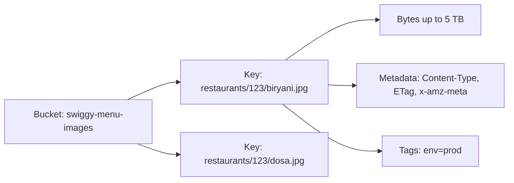
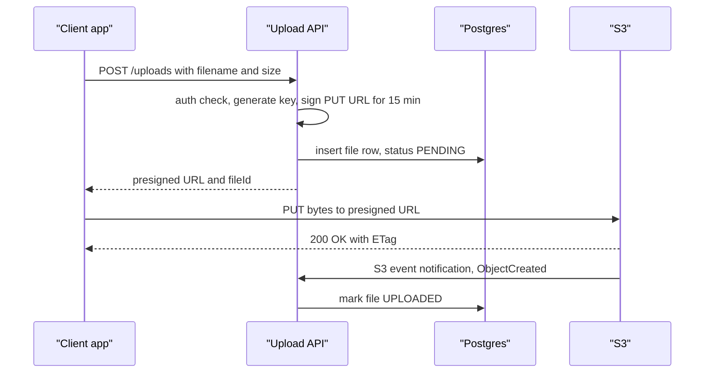
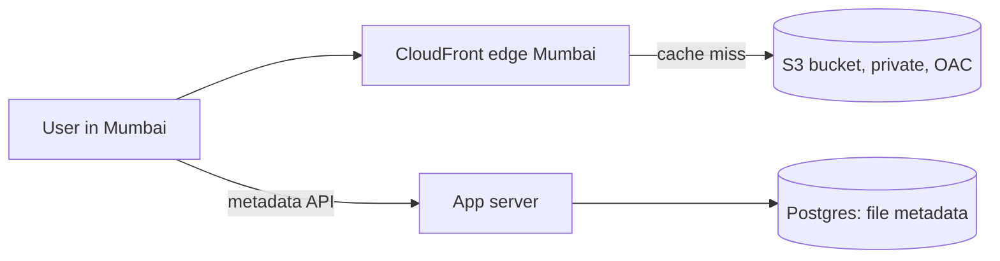

# Object Storage: S3

Photos, videos, PDFs, backups, logs: ye sab database me nahi, object storage me jaata hai. Amazon S3 iska standard hai (GCS, Azure Blob, MinIO sab S3 jaise hi kaam karte hain). System design me almost har "upload" wale sawal me S3 + CDN + pre-signed URL aata hai.

## ⭐ Object model: bucket, key, metadata

**Ek line me:** S3 ek flat key-value store hai jahan key = string path, value = file bytes (5 TB tak), saath me metadata.

- **Bucket:** top-level container, globally unique naam, ek region me (`swiggy-menu-images` in `ap-south-1`).
- **Key:** object ka poora naam, e.g. `restaurants/123/menu/biryani.jpg`. Folders asli me nahi hote; `/` sirf naam ka hissa hai, console prefix ko folder jaisa dikhata hai.
- **Object:** data + **metadata** (system: `Content-Type`, `Content-Length`, `ETag`, `Last-Modified`; user: `x-amz-meta-uploaded-by`) + optional **tags** (lifecycle/billing ke liye).
- **Immutable:** object ka beech ka hissa edit nahi hota. Badalna = poora object dobara PUT.
- Address: `s3://bucket/key` ya `https://bucket.s3.ap-south-1.amazonaws.com/key`.



> **Real example:** Swiggy app me restaurant ki dish photo. Postgres me `menu_items` table me sirf `image_key = 'restaurants/123/biryani.jpg'`, asli image S3 pe, user tak CloudFront CDN se.

## ⭐ Files DB me kyun nahi rakhte

| DB me BLOB | S3 me object |
|---|---|
| DB size balloon, backups/replication slow | DB chhota, sirf metadata |
| Har image read DB connection aur buffer cache khata hai | S3/CDN directly serve karta hai, app server beech me nahi |
| Storage mehenga (SSD + replicas) | ~$0.023/GB-month Standard, archive me aur sasta |
| Streaming, range requests, CDN mushkil | HTTP range GET, CDN, pre-signed URL built-in |
| Scale limited | practically unlimited objects |

Chhoti cheezein (avatar thumbnail <100 KB, kam traffic) DB me chal sakti hain, par default answer: **blob S3 me, metadata DB me**.

**Interview tip:** "Video/image upload app server ke through nahi jayega. Client pre-signed URL se seedha S3 pe upload karega." Ye ek line bandwidth aur scale dono solve karti hai.

## ⭐ Durability, availability aur consistency

| Number | Value | Matlab |
|---|---|---|
| Durability | **99.999999999%** (11 nines) | 10M objects rakho to ~10,000 saal me 1 object khoye. Data 3+ AZs me redundantly store |
| Availability (Standard) | 99.99% design | saal me ~53 min downtime possible |
| Availability (One Zone-IA) | 99.5% | ek AZ me hi data |
| Max object size | 5 TB | single PUT max 5 GB, upar multipart |
| Request rate | 3,500 PUT/s aur 5,500 GET/s **per prefix** | zyada chahiye to prefixes baanto |

**Consistency:** Dec 2020 se S3 **strong read-after-write consistency** deta hai: PUT/DELETE ke turant baad GET aur LIST naya data dikhate hain, sab regions me, bina extra cost. Pehle overwrite/delete eventually consistent the, purani books me abhi bhi wahi likha hai.

- Concurrent writes same key pe: last writer wins (koi locking nahi). Conditional writes (`If-None-Match: *`, `If-Match: <etag>`) se overwrite rok sakte ho.
- Cross-Region Replication async hai (minutes).

**Common galti:** durability aur availability ko same samajhna. Durability = data khoyega nahi; availability = abhi access ho payega ya nahi.

## ⭐ Storage classes aur lifecycle rules

| Class | Kab | Retrieval |
|---|---|---|
| **S3 Standard** | hot data, roz access | ms |
| **Intelligent-Tiering** | access pattern pata nahi; auto move karta hai | ms (archive tiers optional) |
| **Standard-IA** | mahine me kabhi kabhi, 30 din min | ms, per-GB retrieval fee |
| **One Zone-IA** | recreate ho sakne wala data (thumbnails) | ms, ek AZ |
| **Glacier Instant Retrieval** | quarter me ek baar, turant chahiye | ms |
| **Glacier Flexible Retrieval** | backups, archive | minutes se 12 hours |
| **Glacier Deep Archive** | compliance, 7–10 saal | 12–48 hours, sabse sasta (~$1/TB-month) |

**Lifecycle rules:** prefix/tag ke basis pe auto transition aur expiry.

```json
{
  "Rules": [{
    "ID": "invoices-archive",
    "Filter": { "Prefix": "invoices/" },
    "Status": "Enabled",
    "Transitions": [
      { "Days": 30,  "StorageClass": "STANDARD_IA" },
      { "Days": 180, "StorageClass": "GLACIER" }
    ],
    "Expiration": { "Days": 2555 },
    "AbortIncompleteMultipartUpload": { "DaysAfterInitiation": 7 }
  }]
}
```

**Interview tip:** Paytm invoices: 30 din baad IA, 6 mahine baad Glacier, 7 saal baad delete (compliance). Ek line me cost 80%+ kam.

## ⭐ Multipart upload

**Ek line me:** badi file ko parts (5 MB–5 GB, max 10,000 parts) me todo, parallel upload karo, fail hua part sirf wahi retry, end me complete call se jod do.

- 100 MB se upar recommended, 5 GB se upar zaroori.
- Parallel parts = fast upload; resumable (mobile network pe YouTube/Dropbox jaise uploads).
- Har part ka `ETag` yaad rakho, `CompleteMultipartUpload` me bhejo.
- Incomplete uploads ke parts ka bhi paisa lagta hai: lifecycle me `AbortIncompleteMultipartUpload` rakho.
- Client direct upload ke liye har `UploadPart` ka pre-signed URL bhi bana sakte ho.

## ⭐ Pre-signed URLs

**Ek line me:** server apne credentials se ek time-limited signed URL banata hai; client usse seedha S3 pe PUT/GET karta hai, bina AWS credentials ke aur bina app server se bytes guzarne ke.



- Expiry chhoti rakho (5–15 min upload, download ke liye minutes se hours).
- Signature me method, key aur content-type bound hote hain. Size limit ke liye **presigned POST** with `content-length-range` condition.
- Upload complete confirm karne ke liye S3 event (SNS/SQS/Lambda/EventBridge) ya client ka confirm call + `HeadObject`.
- Private downloads: bucket private rakho, har download pe chhota pre-signed GET ya CloudFront signed URL.

**Common galti:** bucket public kar dena taaki images dikhein. Block Public Access on rakho, CDN ke through Origin Access Control se serve karo.

## Versioning

- Bucket pe enable karo to har overwrite naya version (`VersionId`) banata hai; delete sirf **delete marker** lagata hai, purana version restore ho sakta hai.
- Accidental delete/ransomware se bachav. Cross-Region Replication ke liye zaroori.
- Cost: har version ka storage. Lifecycle me `NoncurrentVersionExpiration` (e.g. 30 din) rakho.
- **Object Lock** (WORM): compliance ke liye, retention period tak delete nahi ho sakta.

## ⭐ Important API methods

| Method | Kya karta hai | Example |
|---|---|---|
| `PutObject` | object upload (5 GB tak) | `s3.put_object(Bucket=b, Key=k, Body=data, ContentType="image/jpeg")` |
| `GetObject` | object download, `Range` header se partial | `s3.get_object(Bucket=b, Key=k, Range="bytes=0-1023")` |
| `HeadObject` | sirf metadata (size, ETag, type), body nahi | `s3.head_object(Bucket=b, Key=k)` |
| `DeleteObject` | delete (versioning on ho to delete marker) | `s3.delete_object(Bucket=b, Key=k)` |
| `DeleteObjects` | ek call me 1000 tak delete | `s3.delete_objects(Bucket=b, Delete={"Objects": [...]})` |
| `ListObjectsV2` | prefix ke andar keys, 1000 per page, `ContinuationToken` se next page | `s3.list_objects_v2(Bucket=b, Prefix="users/42/", Delimiter="/")` |
| `CreateMultipartUpload` | multipart shuru, `UploadId` milta hai | `s3.create_multipart_upload(Bucket=b, Key=k)` |
| `UploadPart` | ek part upload, `ETag` return | `s3.upload_part(..., PartNumber=1, UploadId=uid, Body=chunk)` |
| `CompleteMultipartUpload` | parts jod ke final object | `s3.complete_multipart_upload(..., MultipartUpload={"Parts": parts})` |
| `AbortMultipartUpload` | adhoora upload cancel, parts delete | `s3.abort_multipart_upload(Bucket=b, Key=k, UploadId=uid)` |
| `generate_presigned_url` | signed GET/PUT URL (SDK me local signing, API call nahi) | `s3.generate_presigned_url("put_object", Params={...}, ExpiresIn=900)` |
| `CopyObject` | server-side copy (rename = copy + delete), 5 GB tak | `s3.copy_object(Bucket=b, Key=new, CopySource={"Bucket": b, "Key": old})` |

```python
import boto3

s3 = boto3.client("s3", region_name="ap-south-1")
BUCKET = "swiggy-menu-images"

# 1. Chhoti file upload with metadata
s3.put_object(Bucket=BUCKET, Key="restaurants/123/biryani.jpg",
              Body=open("biryani.jpg", "rb"), ContentType="image/jpeg",
              Metadata={"uploaded-by": "user-42"})

# 2. Sirf metadata check
head = s3.head_object(Bucket=BUCKET, Key="restaurants/123/biryani.jpg")
print(head["ContentLength"], head["ETag"])

# 3. Prefix ke andar saari keys, pagination ke saath
token = None
while True:
    kwargs = {"Bucket": BUCKET, "Prefix": "restaurants/123/"}
    if token:
        kwargs["ContinuationToken"] = token
    page = s3.list_objects_v2(**kwargs)
    for obj in page.get("Contents", []):
        print(obj["Key"], obj["Size"])
    if not page.get("IsTruncated"):
        break
    token = page["NextContinuationToken"]

# 4. Client ke liye 15 min ka upload URL
url = s3.generate_presigned_url(
    "put_object",
    Params={"Bucket": BUCKET, "Key": "uploads/user-42/a1b2.jpg",
            "ContentType": "image/jpeg"},
    ExpiresIn=900)

# 5. Badi file: multipart (manual steps)
mpu = s3.create_multipart_upload(Bucket=BUCKET, Key="videos/v1.mp4")
parts, part_no = [], 1
with open("v1.mp4", "rb") as f:
    while chunk := f.read(8 * 1024 * 1024):          # 8 MB parts
        r = s3.upload_part(Bucket=BUCKET, Key="videos/v1.mp4", PartNumber=part_no,
                           UploadId=mpu["UploadId"], Body=chunk)
        parts.append({"PartNumber": part_no, "ETag": r["ETag"]})
        part_no += 1
s3.complete_multipart_upload(Bucket=BUCKET, Key="videos/v1.mp4",
                             UploadId=mpu["UploadId"],
                             MultipartUpload={"Parts": parts})
# Asli code me s3.upload_file() khud multipart + parallel threads karta hai
```

**Interview tip:** "S3 me rename nahi hota, `CopyObject` + `DeleteObject` hota hai. Isliye keys aisi design karo jo badalni na padein (UUID based)."

**Common galti:** `ListObjectsV2` ko DB query ki tarah use karna ("user ki saari files size ke order me"). LIST slow aur paginated hai. Ye metadata DB me rakho.

## ⭐ CDN in front of S3

- CloudFront (ya Akamai/Cloudflare) edge pe cache karta hai: Mumbai user ko Mumbai edge se image, S3 tak sirf cache miss.
- **Origin Access Control (OAC):** bucket private, sirf CloudFront padh sake.
- Cache-busting: content badle to naya key (`biryani.v2.jpg` ya hash in key) use karo, invalidation mehenga aur slow.
- Video ke liye HLS/DASH segments S3 pe, CDN se stream.
- Detail: [Blob Storage & CDN](../01-topics/12-blob-storage-cdn.md).



## ⭐ Pattern: metadata DB me, blob S3 me

**Ek line me:** DB me file ki row (owner, key, size, type, status, checksum), S3 me bytes. DB queries fast, S3 bytes ke liye.

```sql
CREATE TABLE files (
  id          UUID PRIMARY KEY,
  owner_id    BIGINT NOT NULL,
  s3_key      TEXT NOT NULL UNIQUE,      -- uploads/{owner}/{uuid}
  size_bytes  BIGINT,
  mime_type   TEXT,
  sha256      TEXT,                      -- dedup aur integrity
  status      TEXT NOT NULL DEFAULT 'PENDING',  -- PENDING, UPLOADED, DELETED
  created_at  TIMESTAMPTZ DEFAULT now()
);
CREATE INDEX ON files (owner_id, created_at DESC);
```

- Upload: row `PENDING` → pre-signed PUT → S3 event → `UPLOADED`.
- Delete: row `DELETED` (soft) → async job S3 se delete. Ulta karoge to DB me dangling row.
- Orphans: periodic job jo `PENDING` > 24h rows aur bina row ke S3 objects saaf kare.
- Dedup (Dropbox): content hash (`sha256`) ko key banao, same file dobara upload nahi.

## GCS, Azure Blob, MinIO

| | Amazon S3 | Google Cloud Storage | Azure Blob Storage | MinIO |
|---|---|---|---|---|
| Container | bucket | bucket | storage account + container | bucket |
| Signed URL | pre-signed URL | signed URL | SAS token | pre-signed (S3 API) |
| Classes | Standard, IA, Glacier... | Standard, Nearline, Coldline, Archive | Hot, Cool, Cold, Archive | self-managed |
| Note | standard API | strong consistency hamesha se | block/append/page blobs | self-hosted, S3-compatible, on-prem/dev |

Bahut saare tools (Cloudflare R2, Backblaze B2, Ceph) **S3-compatible API** dete hain, isliye boto3 code sirf endpoint badal ke chal jaata hai.

## ⭐ Kab use karo / kab nahi

| Use karo | Mat karo |
|---|---|
| Images, videos, documents, user uploads | Chhote, baar baar update hone wale records (row-level updates) |
| Backups, logs, data lake (Parquet + Athena) | Low latency (<10 ms) random reads: DB/cache lo |
| Static website assets + CDN | File ke beech me append/edit chahiye (POSIX FS: EFS) |
| ML datasets, model files | Rich queries "size > X order by date": metadata DB me |

## Kin system design questions me

- [YouTube](../02-questions/t1-07-youtube.md): raw video multipart upload, transcoded segments S3 pe, CDN se stream
- [Dropbox](../02-questions/t1-08-dropbox.md): chunking, content-hash dedup, metadata DB + blob store
- [Instagram](../02-questions/t2-13-instagram.md): photos S3 + CDN, pre-signed upload
- [Distributed Logging](../02-questions/t2-26-distributed-logging.md): cold logs S3 pe archive
- Topic: [Blob Storage & CDN](../01-topics/12-blob-storage-cdn.md)

## Interview me bolo

> "Bytes S3 me, metadata Postgres me. Client pre-signed URL se seedha S3 pe multipart upload karega, S3 event se status update hoga, aur reads CloudFront ke through private bucket se. Lifecycle rule purani files ko IA/Glacier me le jaayega."

## Checklist

- [ ] Bucket, key, metadata aur "folders asli nahi hote" samjha sakta hoon
- [ ] Files DB me kyun nahi rakhte, 3 reasons ke saath bata sakta hoon
- [ ] 11 nines durability vs 99.99% availability aur S3 ki strong read-after-write consistency bata sakta hoon
- [ ] Storage classes aur ek lifecycle rule (IA → Glacier → expire) design kar sakta hoon
- [ ] Multipart upload ke steps aur fayde bata sakta hoon
- [ ] Pre-signed URL upload ka poora flow sequence diagram me bana sakta hoon
- [ ] PutObject, GetObject, HeadObject, ListObjectsV2 pagination aur CopyObject ka use bata sakta hoon
- [ ] Metadata-in-DB + blob-in-S3 pattern aur orphan cleanup samjha sakta hoon
