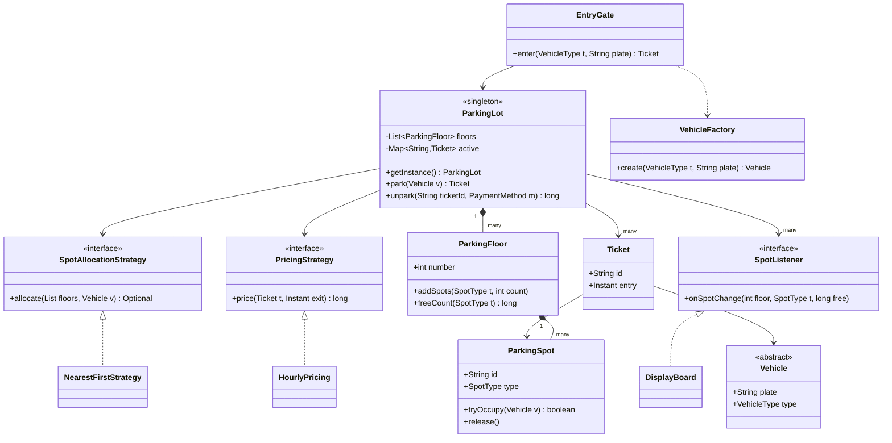

# Parking Lot

**Ek line me:** multi-floor parking design karo: gate pe vehicle aaye, sahi spot mile, ticket bane, exit pe price lage aur payment ho. Interviewer check karta hai: clean entities, OCP (naya vehicle/pricing bina purana code tode), aur **do gates ek hi spot na de dein**.

---

## Step 1: Requirements confirm karo

| Tum poochho | Typical jawab | Design pe asar |
|---|---|---|
| "Kitne floors, kitne gates?" | Multiple floors, 2+ entry aur exit gates | Gates parallel chalenge → concurrency |
| "Vehicle types?" | Bike, Car, Truck, EV | `VehicleType` enum + Factory |
| "Spot types? Chhota vehicle bade spot me ja sakta hai?" | SMALL, MEDIUM, LARGE, EV. Haan, fallback chalega | Har vehicle ki "fits" list (preference order) |
| "Pricing?" | Hourly per spot type. Kuch lots flat rate | `PricingStrategy` |
| "Payment modes?" | UPI, Card, Cash | `PaymentMethod` interface |
| "Display board?" | Har floor pe free spots per type | Observer |
| "Ek lot ya chain of lots?" | Ek lot | Singleton (chain ho to registry) |
| "Reservation / monthly pass?" | Abhi nahi | Out of scope, extension me bolo |

**Functional:**
- Entry gate pe vehicle aaye → free compatible spot assign → ticket do.
- Exit gate pe ticket scan → duration se price → payment → spot free.
- Display board pe har floor ka free count live update ho.
- Lot full ho to entry pe saaf mana karo.

**Out of scope:** online pre-booking, valet, number-plate camera (ANPR), multi-lot chain.

> **Bolo:** "Main pehle entities aur class diagram banata hoon, phir park/unpark ka flow code karta hoon, aur end me do gates wali race handle karunga."

## Step 2: Core entities

- **ParkingLot:** poora system, Singleton. Floors, active tickets, strategies rakhta hai.
- **ParkingFloor:** ek floor, type-wise spots ki list.
- **ParkingSpot:** id, floor, `SpotType`, abhi kaunsa vehicle khada hai.
- **Vehicle** (Bike, Car, Truck, ElectricCar): plate + `VehicleType`. `VehicleFactory` banata hai.
- **Ticket:** id, vehicle, spot, entry time. Exit pe yahi price ka base hai.
- **SpotAllocationStrategy:** kaunsa spot dena hai (nearest-first, floor-wise fill…).
- **PricingStrategy:** kitna charge karna hai (hourly, flat).
- **PaymentMethod:** UPI / Card / Cash.
- **SpotListener / DisplayBoard:** spot change hone pe update.
- **EntryGate / ExitGate:** thin classes, lot ko call karte hain.

## Step 3: Class diagram



`FlatPricing`, `ExitGate`, `PaymentMethod` aur Vehicle ke subclasses diagram chhota rakhne ke liye skip kiye. Code me hain.

## Step 4: Design patterns kyun

| Pattern | Kahan | Kyun | Alternative |
|---|---|---|---|
| [Strategy](../03-lld/05-behavioral.md) | `PricingStrategy` (hourly/flat), `SpotAllocationStrategy` | Weekend pricing ya "upar wale floor pehle bharo" bina `ParkingLot` touch kiye | `if (type == ...)` chain: har naye rule pe purana code khulega |
| [Factory](../03-lld/03-creational.md) | `VehicleFactory`, `ParkingFloor.addSpots` | Gate ko sirf type + plate pata hai. `new Car()` har jagah scatter nahi | Constructor direct call: naya type = har caller badlega |
| [Singleton](../03-lld/03-creational.md) | `ParkingLot` | Ek hi physical lot, ek hi source of truth for spots | DI container me single instance (testing ke liye better) |
| [Observer](../03-lld/05-behavioral.md) | `DisplayBoard`, mobile app, analytics | Lot ko pata nahi kaun sun raha. Naya listener = zero change | Board har second poll kare: waste + stale |

> **Bolo:** "Singleton bolunga, par production me main isko DI se single instance banata, kyunki static Singleton test me mock karna mushkil hai."

## Step 5: Code

Vehicles, spots aur factory:

```java
import java.time.*;
import java.util.*;
import java.util.concurrent.*;
import java.util.concurrent.atomic.*;

enum SpotType { SMALL, MEDIUM, LARGE, EV }

enum VehicleType {
    BIKE(List.of(SpotType.SMALL, SpotType.MEDIUM)),
    CAR(List.of(SpotType.MEDIUM, SpotType.LARGE)),
    TRUCK(List.of(SpotType.LARGE)),
    EV_CAR(List.of(SpotType.EV, SpotType.MEDIUM));

    final List<SpotType> fits;   // preference order: pehla best fit
    VehicleType(List<SpotType> fits) { this.fits = fits; }
}

abstract class Vehicle {
    final String plate; final VehicleType type;
    Vehicle(String plate, VehicleType type) { this.plate = plate; this.type = type; }
}
class Bike extends Vehicle { Bike(String p) { super(p, VehicleType.BIKE); } }
class Car extends Vehicle { Car(String p) { super(p, VehicleType.CAR); } }
class Truck extends Vehicle { Truck(String p) { super(p, VehicleType.TRUCK); } }
class ElectricCar extends Vehicle { ElectricCar(String p) { super(p, VehicleType.EV_CAR); } }

class VehicleFactory {
    static Vehicle create(VehicleType type, String plate) {
        return switch (type) {   // naya type aaya to compiler yahin yaad dilayega
            case BIKE -> new Bike(plate);
            case CAR -> new Car(plate);
            case TRUCK -> new Truck(plate);
            case EV_CAR -> new ElectricCar(plate);
        };
    }
}

class ParkingSpot {
    final String id; final int floor; final SpotType type;
    private final AtomicReference<Vehicle> parked = new AtomicReference<>();
    ParkingSpot(String id, int floor, SpotType type) { this.id = id; this.floor = floor; this.type = type; }

    boolean isFree() { return parked.get() == null; }
    boolean tryOccupy(Vehicle v) { return parked.compareAndSet(null, v); } // CAS: do gates me se ek hi jeetega
    void release() { parked.set(null); }
}

class ParkingFloor {
    final int number;
    private final Map<SpotType, List<ParkingSpot>> spots = new EnumMap<>(SpotType.class);
    ParkingFloor(int number) { this.number = number; }

    void addSpots(SpotType type, int count) {   // spot factory: id format ek jagah
        List<ParkingSpot> list = spots.computeIfAbsent(type, t -> new ArrayList<>());
        for (int i = 0; i < count; i++)
            list.add(new ParkingSpot("F" + number + "-" + type + "-" + (list.size() + 1), number, type));
    }
    List<ParkingSpot> spotsOf(SpotType t) { return spots.getOrDefault(t, List.of()); }
    long freeCount(SpotType t) { return spotsOf(t).stream().filter(ParkingSpot::isFree).count(); }
}
```

Strategies, ticket, payment, observer:

```java
record Ticket(String id, Vehicle vehicle, ParkingSpot spot, Instant entry) {}

interface SpotAllocationStrategy { Optional<ParkingSpot> allocate(List<ParkingFloor> floors, Vehicle v); }

class NearestFirstStrategy implements SpotAllocationStrategy {
    public Optional<ParkingSpot> allocate(List<ParkingFloor> floors, Vehicle v) {
        for (SpotType type : v.type.fits)            // pehle best-fit type
            for (ParkingFloor f : floors)            // floor 0 = gate ke sabse paas
                for (ParkingSpot s : f.spotsOf(type))
                    if (s.isFree() && s.tryOccupy(v)) return Optional.of(s); // CAS fail = agla spot try
        return Optional.empty();
    }
}

interface PricingStrategy { long price(Ticket t, Instant exit); }

class HourlyPricing implements PricingStrategy {
    private final Map<SpotType, Integer> ratePerHour;
    HourlyPricing(Map<SpotType, Integer> ratePerHour) { this.ratePerHour = ratePerHour; }
    public long price(Ticket t, Instant exit) {
        long mins = Duration.between(t.entry(), exit).toMinutes();
        long hours = Math.max(1, (mins + 59) / 60);  // shuru ka ghanta poora, baaki round up
        return hours * ratePerHour.get(t.spot().type);
    }
}

class FlatPricing implements PricingStrategy {
    private final long amount;
    FlatPricing(long amount) { this.amount = amount; }
    public long price(Ticket t, Instant exit) { return amount; }
}

interface PaymentMethod { boolean pay(long amount); }
class UpiPayment implements PaymentMethod {
    public boolean pay(long amount) { System.out.println("UPI se paid Rs " + amount); return true; }
}

interface SpotListener { void onSpotChange(int floor, SpotType type, long free); }

class DisplayBoard implements SpotListener {
    public void onSpotChange(int floor, SpotType type, long free) {
        System.out.println("Board: floor " + floor + " " + type + " free=" + free);
    }
}
```

ParkingLot (Singleton), gates aur main flow:

```java
class ParkingLot {
    private static final ParkingLot INSTANCE = new ParkingLot();   // eager, thread-safe
    static ParkingLot getInstance() { return INSTANCE; }
    private ParkingLot() {}

    private final List<ParkingFloor> floors = new CopyOnWriteArrayList<>(); // index = floor number
    private final Map<String, Ticket> active = new ConcurrentHashMap<>();
    private final Set<String> platesInside = ConcurrentHashMap.newKeySet();
    private final List<SpotListener> listeners = new CopyOnWriteArrayList<>();
    private final AtomicLong seq = new AtomicLong();
    private volatile SpotAllocationStrategy allocator = new NearestFirstStrategy();
    private volatile PricingStrategy pricing = new FlatPricing(50);

    void addFloor(ParkingFloor f) { floors.add(f); }
    void addListener(SpotListener l) { listeners.add(l); }
    void setPricing(PricingStrategy p) { pricing = p; }
    void setAllocator(SpotAllocationStrategy a) { allocator = a; }

    Ticket park(Vehicle v) {
        if (!platesInside.add(v.plate)) throw new IllegalStateException("Already inside: " + v.plate);
        Optional<ParkingSpot> spot = allocator.allocate(floors, v);
        if (spot.isEmpty()) {
            platesInside.remove(v.plate);
            throw new IllegalStateException("Lot full for " + v.type);
        }
        Ticket t = new Ticket("T" + seq.incrementAndGet(), v, spot.get(), Instant.now());
        active.put(t.id(), t);
        notifyChange(spot.get());
        return t;
    }

    long unpark(String ticketId, PaymentMethod method) {
        Ticket t = active.remove(ticketId);          // atomic claim: same ticket do exit pe nahi chalega
        if (t == null) throw new IllegalArgumentException("Invalid ya used ticket: " + ticketId);
        long amount = pricing.price(t, Instant.now());
        if (!method.pay(amount)) {
            active.put(ticketId, t);                 // payment fail: ticket wapas, spot occupied hi rahega
            throw new IllegalStateException("Payment failed");
        }
        t.spot().release();
        platesInside.remove(t.vehicle().plate);
        notifyChange(t.spot());
        return amount;
    }

    private void notifyChange(ParkingSpot s) {
        long free = floors.get(s.floor).freeCount(s.type);
        listeners.forEach(l -> l.onSpotChange(s.floor, s.type, free));
    }
}

class EntryGate {
    Ticket enter(VehicleType type, String plate) {
        return ParkingLot.getInstance().park(VehicleFactory.create(type, plate));
    }
}

class ExitGate {
    long exit(String ticketId, PaymentMethod m) { return ParkingLot.getInstance().unpark(ticketId, m); }
}

public class ParkingLotDemo {
    public static void main(String[] args) throws Exception {
        ParkingLot lot = ParkingLot.getInstance();
        ParkingFloor f0 = new ParkingFloor(0);
        f0.addSpots(SpotType.SMALL, 2);
        f0.addSpots(SpotType.MEDIUM, 1);
        f0.addSpots(SpotType.LARGE, 1);
        f0.addSpots(SpotType.EV, 1);
        lot.addFloor(f0);
        lot.addListener(new DisplayBoard());
        lot.setPricing(new HourlyPricing(Map.of(
            SpotType.SMALL, 20, SpotType.MEDIUM, 40, SpotType.LARGE, 100, SpotType.EV, 60)));

        // do gates ek saath ek hi MEDIUM spot ke liye race karte hain
        ExecutorService pool = Executors.newFixedThreadPool(2);
        Future<Ticket> a = pool.submit(() -> new EntryGate().enter(VehicleType.CAR, "KA01AB1234"));
        Future<Ticket> b = pool.submit(() -> new EntryGate().enter(VehicleType.CAR, "MH12XY9999"));
        Ticket t1 = a.get(), t2 = b.get();
        System.out.println(t1.spot().id + " / " + t2.spot().id);  // alag spots: MEDIUM aur LARGE
        pool.shutdown();

        System.out.println("Paid: " + new ExitGate().exit(t1.id(), new UpiPayment()));
    }
}
```

## Step 6: Concurrency & edge cases

**Do gates, ek spot (main sawal):**
- Race: Gate A aur Gate B dono ne spot F0-MEDIUM-1 ko free dekha, dono ne assign kar diya → double allocation.
- Fix: `tryOccupy` = `compareAndSet(null, vehicle)`. Check aur occupy ek atomic step. Haarne wala gate agla spot try karta hai.
- Alternatives:
  - Ek global `synchronized park()`: sahi hai, simple hai, par saare gates serialize. Chhote lot ke liye chalega, bolo zaroor.
  - Per-floor lock: beech ka raasta.
  - DB me: `UPDATE spot SET vehicle_id=? WHERE id=? AND vehicle_id IS NULL` (rows affected = 1 tabhi jeeta) ya `SELECT ... FOR UPDATE SKIP LOCKED`. Detail: [Locks & contention](../01-topics/09-locks-and-contention.md).
- `isFree()` check CAS se pehle sirf sasta filter hai. Correctness CAS deta hai.

**Edge cases:**
- **Lot full:** allocator `Optional.empty()` → gate pe "Full" dikhao, barrier mat kholo.
- **Same plate do baar entry:** `platesInside.add` false → reject (cloned plate ya galti).
- **Same ticket do exit gates pe:** `active.remove` atomic claim, dusra gate "used ticket" paayega.
- **Payment fail:** ticket wapas `active` me, spot free nahi hota, barrier band.
- **Lost ticket:** plate se ticket dhoondho, ya din ka max charge lo.
- **Time:** `Instant.now()` ki jagah `Clock` inject karo, taaki pricing test ho sake. Midnight cross ya 3 din ki parking hourly me hi aa jaati hai.
- **Display stale:** listener ko event ke saath count bhejte hain. Async listener ho to thoda stale chalega, board sirf info hai, truth spot ka CAS hai.

## Step 7: Extensions

- **EV charging chahiye:** `EV` spot pehle se hai. Charging fee ke liye pricing pe Decorator: `new ChargingFee(new HourlyPricing(...))`. `ParkingLot` same.
- **Weekend / surge pricing:** naya `PricingStrategy`, ya ek `TimeBasedPricing` jo din dekh ke andar ki strategy choose kare.
- **Naya vehicle (bus):** enum value + class + factory case + `fits` list. Allocator aur pricing untouched.
- **"Floor 3 pehle bharo" ya "EV ko hamesha EV spot":** naya `SpotAllocationStrategy`.
- **Reservation / pre-booking:** spot pe `RESERVED` state + expiry. Allocator reserved spot skip kare.
- **Multiple lots (chain, jaise mall + airport):** Singleton hatao, `Map<lotId, ParkingLot>` registry.
- **Fast allocation (10k spots):** har type ke liye `ConcurrentLinkedQueue<ParkingSpot>` free pool. Poll = O(1), release pe offer.
- **Monthly pass:** `PricingStrategy` me pass check, ya `PassPricing` decorator.

## Step 8: Interview flow (45 min)

| Minute | Kya karo |
|---|---|
| 0–5 | Requirements table: vehicle/spot types, pricing, gates, out of scope |
| 5–10 | Entities list, kaun kiska owner hai |
| 10–17 | Class diagram. Strategy/Factory/Observer/Singleton yahin naam lo |
| 17–35 | Code: `ParkingSpot.tryOccupy`, allocator, pricing, `park`/`unpark` |
| 35–40 | Do gates wali race + CAS/lock/DB options |
| 40–45 | Extensions: EV, surge pricing, reservation. Trade-offs bolo |

## 2-minute recap

Lot ek Singleton hai jisme floors hain, floor me type-wise spots. Vehicle `VehicleFactory` se banta hai, har type ke paas "fits" list hai (bike → SMALL ya MEDIUM, EV → EV ya MEDIUM). Entry pe `SpotAllocationStrategy` spot dhoondhti hai aur `tryOccupy` CAS se lock karti hai, isse do gates kabhi same spot nahi dete. Ticket me entry time hai. Exit pe `active.remove` se ticket atomically claim hota hai, `PricingStrategy` (hourly/flat) amount nikaalti hai, `PaymentMethod` pay karta hai, fail ho to ticket wapas. Spot free hote hi Observer se display board update hota hai. Naya vehicle, pricing ya allocation rule = nayi class, purana code untouched (OCP).

## Checklist

- [ ] 5 min me requirements table aur out-of-scope bol sakta hoon.
- [ ] Class diagram bana sakta hoon: Lot → Floor → Spot, Ticket, do strategies, listener.
- [ ] Har pattern (Strategy, Factory, Singleton, Observer) kahan aur kyun laga, bata sakta hoon.
- [ ] `park` aur `unpark` ka code bina dekhe likh sakta hoon.
- [ ] Do gates same spot wali race samjha sakta hoon aur CAS, lock aur DB conditional update compare kar sakta hoon.
- [ ] Lost ticket, payment fail, lot full, double exit jaise edge cases handle kar sakta hoon.
- [ ] EV charging, surge pricing aur reservation design me kaise fit honge, bata sakta hoon.
