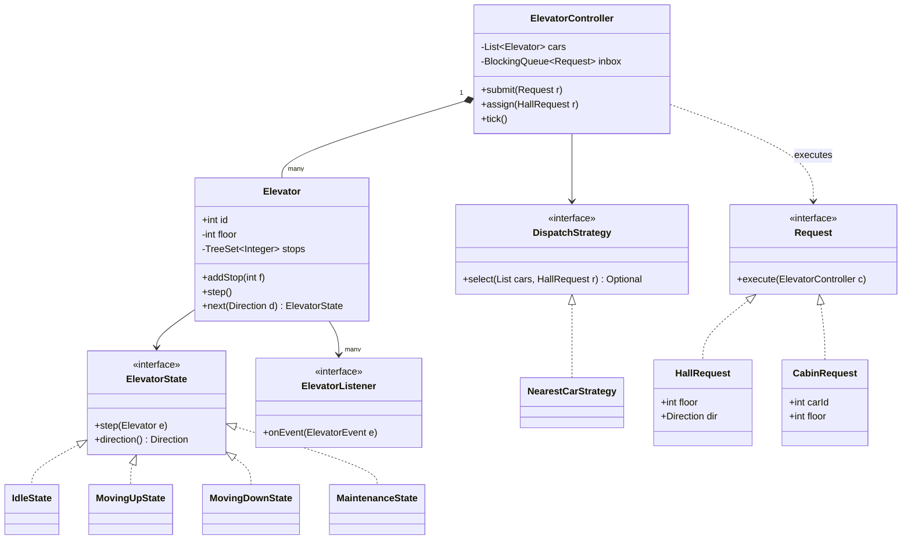

# Elevator System

**Ek line me:** ek building me N elevators design karo: floor pe UP/DOWN button aur cabin ke andar floor button, sahi car assign ho, car ek order me stops serve kare. Interviewer check karta hai: State machine, dispatch algorithm (SCAN/LOOK, nearest car), aur concurrency + starvation pe clear soch.

---

## Step 1: Requirements confirm karo

| Tum poochho | Typical jawab | Design pe asar |
|---|---|---|
| "Kitni cars, kitne floors?" | 3–4 cars, 0 se 20 floors | `List<Elevator>`, floor range validation |
| "Request kahan se aati hai?" | Floor pe UP/DOWN (hall), cabin ke andar floor number | Do request types → Command |
| "Car kaun choose karega?" | Central controller | `DispatchStrategy` |
| "Car ke andar stops kis order me?" | Ek direction me sab, phir palto | LOOK algorithm, sorted stops |
| "Car ki states?" | Idle, moving up, moving down, maintenance | State pattern |
| "Door?" | Stop pe khule, kuch time baad band. Khula ho to move nahi | Door timer, safety check |
| "Display?" | Har floor pe car ka current floor + direction | Observer |
| "Weight limit, fire mode, VIP car?" | Abhi nahi | Extensions me bolo |

**Functional:**
- Hall request (floor + direction) → controller best car ko assign kare.
- Cabin request (car + floor) → wahi car ka stop ban jaaye.
- Car LOOK order me stops serve kare, har stop pe door khule aur band ho.
- Car maintenance me jaa sake, uske pending stops doosri cars ko milein.
- Displays ko har move/door event mile.

**Out of scope:** hardware motor control, weight sensor, fire/emergency mode, destination-dispatch kiosk.

> **Bolo:** "Do level ke decisions hain: controller decide karta hai kaunsi car (dispatch), aur car khud decide karti hai stops ka order (LOOK). Dono ko alag rakhunga."

## Step 2: Core entities

- **ElevatorController:** saari cars ka owner. Requests leta hai, dispatch karta hai, har tick cars ko step karata hai.
- **Elevator (car):** id, current floor, sorted stops, current state, door timer.
- **ElevatorState** (Idle, MovingUp, MovingDown, Maintenance): har state me "ek tick me kya karna hai" alag.
- **Direction:** UP, DOWN, IDLE.
- **Request** (HallRequest, CabinRequest, MaintenanceRequest): button press ek object (Command).
- **DispatchStrategy:** hall request ke liye car chunna (nearest car, zoning…).
- **ElevatorListener:** floor display, monitoring dashboard.
- **ElevatorEvent:** immutable snapshot (car, floor, direction, door) jo listeners ko jaata hai.

## Step 3: Class diagram



`MaintenanceRequest` aur `ElevatorEvent` diagram chhota rakhne ke liye skip kiye. Code me hain.

## Step 4: Design patterns kyun

| Pattern | Kahan | Kyun | Alternative |
|---|---|---|---|
| [State](../03-lld/05-behavioral.md) | `IdleState`, `MovingUpState`, `MovingDownState`, `MaintenanceState` | Har state ka behaviour alag class me. Naya state (fire mode) = nayi class | `switch (status)` har method me: naya state = har method badlo |
| [Strategy](../03-lld/05-behavioral.md) | `DispatchStrategy` (nearest car, zoning) | Office me 9 baje lobby-heavy algo, raat ko energy-saving. Runtime pe swap | Controller me hardcoded `if`: test aur tune karna mushkil |
| [Observer](../03-lld/05-behavioral.md) | `ElevatorListener` (floor display, dashboard) | Car ko pata nahi kitne displays hain | Displays har second poll karein: waste |
| [Command](../03-lld/05-behavioral.md) | `HallRequest`, `CabinRequest`, `MaintenanceRequest` | Button press ek object: queue me daalo, log karo, retry/re-dispatch karo, ek hi thread pe execute | Direct method call: buttons ke threads seedhe car state ko chhuenge → races |

> **Bolo:** "State aur Strategy dono me interface + classes hain, par fark ye hai: State car khud badalti hai (moving up → idle), Strategy bahar se set hoti hai (controller ka dispatch algo)."

## Step 5: Code

Requests (Command), events (Observer) aur states (State):

```java
import java.util.*;
import java.util.concurrent.*;

enum Direction { UP, DOWN, IDLE }

record ElevatorEvent(int carId, int floor, Direction dir, boolean doorOpen) {}
interface ElevatorListener { void onEvent(ElevatorEvent e); }

// Command: har button press ek object, controller thread pe execute hota hai
interface Request { void execute(ElevatorController c); }
record HallRequest(int floor, Direction dir) implements Request {
    public void execute(ElevatorController c) { c.assign(this); }
}
record CabinRequest(int carId, int floor) implements Request {
    public void execute(ElevatorController c) { c.car(carId).addStop(floor); }
}
record MaintenanceRequest(int carId) implements Request {
    public void execute(ElevatorController c) { c.maintenance(carId); }
}

interface ElevatorState {
    void step(Elevator e);       // ek tick me kya karna hai
    Direction direction();
}
class IdleState implements ElevatorState {
    public void step(Elevator e) { e.setState(e.next(Direction.UP)); }  // stop aaya to chal pado
    public Direction direction() { return Direction.IDLE; }
}
class MovingUpState implements ElevatorState {
    public void step(Elevator e) { e.move(+1); e.setState(e.next(Direction.UP)); }
    public Direction direction() { return Direction.UP; }
}
class MovingDownState implements ElevatorState {
    public void step(Elevator e) { e.move(-1); e.setState(e.next(Direction.DOWN)); }
    public Direction direction() { return Direction.DOWN; }
}
class MaintenanceState implements ElevatorState {
    public void step(Elevator e) { }   // kuch nahi: technician ka kaam
    public Direction direction() { return Direction.IDLE; }
}
final class States {                   // states stateless hain, isliye shared instances
    static final ElevatorState IDLE = new IdleState(), UP = new MovingUpState(),
            DOWN = new MovingDownState(), MAINTENANCE = new MaintenanceState();
    private States() {}
}
```

Elevator (car) with LOOK and door handling:

```java
class Elevator {
    private static final int DOOR_TICKS = 3;
    final int id;
    private final int minFloor, maxFloor;
    private final List<ElevatorListener> listeners;
    private final TreeSet<Integer> stops = new TreeSet<>();  // sorted: higher/lower O(log n)
    private volatile int floor;                               // volatile: displays/dispatcher padh sakein
    private volatile ElevatorState state = States.IDLE;
    private int doorTicks;                                    // > 0 matlab door khula hai

    Elevator(int id, int minFloor, int maxFloor, List<ElevatorListener> listeners) {
        this.id = id; this.minFloor = minFloor; this.maxFloor = maxFloor;
        this.floor = minFloor; this.listeners = listeners;
    }

    int floor() { return floor; }
    int stopCount() { return stops.size(); }
    Direction direction() { return state.direction(); }
    boolean isAvailable() { return state != States.MAINTENANCE; }
    void setState(ElevatorState s) { state = s; }

    void addStop(int f) {
        if (f < minFloor || f > maxFloor || !isAvailable()) return;      // invalid floor ya maintenance
        if (f == floor && (state == States.IDLE || doorTicks > 0)) { openDoor(); return; } // yahin khade hain
        stops.add(f);                                                     // TreeSet: 5 baar dabao, ek stop
    }

    void step() {
        if (doorTicks > 0) {                 // door khula hai to move karna mana (safety)
            if (--doorTicks == 0) publish(); // door band
            return;
        }
        state.step(this);
    }

    void move(int delta) {                   // sirf state classes call karti hain, door band hai
        floor += delta;
        if (stops.remove(floor)) openDoor(); else publish();
    }

    // LOOK: jis direction me ja rahe ho, usme aage stop hai to chalte raho, warna palto
    ElevatorState next(Direction preferred) {
        if (stops.remove(floor)) openDoor(); // isi floor ka stop pending tha
        if (stops.isEmpty()) return States.IDLE;
        boolean above = stops.higher(floor) != null, below = stops.lower(floor) != null;
        if (preferred == Direction.UP && above) return States.UP;
        if (preferred == Direction.DOWN && below) return States.DOWN;
        return above ? States.UP : States.DOWN;
    }

    List<Integer> enterMaintenance() {       // pending stops wapas do, controller re-dispatch karega
        List<Integer> orphan = new ArrayList<>(stops);
        stops.clear();
        state = States.MAINTENANCE;
        publish();
        return orphan;
    }

    private void openDoor() { doorTicks = DOOR_TICKS; publish(); }
    private void publish() {
        ElevatorEvent e = new ElevatorEvent(id, floor, direction(), doorTicks > 0);
        listeners.forEach(l -> l.onEvent(e));
    }
}
```

Dispatch strategy, controller aur main:

```java
interface DispatchStrategy { Optional<Elevator> select(List<Elevator> cars, HallRequest r); }

class NearestCarStrategy implements DispatchStrategy {
    private final int floors;
    NearestCarStrategy(int floors) { this.floors = floors; }

    public Optional<Elevator> select(List<Elevator> cars, HallRequest r) {
        return cars.stream().filter(Elevator::isAvailable)
                .min(Comparator.comparingInt(c -> cost(c, r)));
    }

    private int cost(Elevator c, HallRequest r) {
        int d = Math.abs(c.floor() - r.floor());
        Direction dir = c.direction();
        boolean onTheWay = dir == Direction.IDLE || (dir == r.dir()
                && (dir == Direction.UP ? r.floor() >= c.floor() : r.floor() <= c.floor()));
        int base = onTheWay ? d : d + 2 * floors;  // ulta ja rahi hai: pehle apna sweep poora karegi
        return base + c.stopCount();               // busy car ko thoda penalty: load balance
    }
}

class ElevatorController {
    private final List<Elevator> cars = new ArrayList<>();
    private final BlockingQueue<Request> inbox = new LinkedBlockingQueue<>(); // buttons: kai threads
    private final Deque<HallRequest> pending = new ArrayDeque<>();            // abhi koi car nahi mili
    private volatile DispatchStrategy strategy;

    ElevatorController(int n, int minFloor, int maxFloor, DispatchStrategy s, List<ElevatorListener> ls) {
        for (int i = 0; i < n; i++) cars.add(new Elevator(i, minFloor, maxFloor, ls));
        this.strategy = s;
    }

    void submit(Request r) { inbox.offer(r); }           // thread-safe, kisi bhi thread se
    void setStrategy(DispatchStrategy s) { strategy = s; }
    Elevator car(int id) { return cars.get(id); }

    void assign(HallRequest r) {
        strategy.select(cars, r).ifPresentOrElse(c -> c.addStop(r.floor()), () -> pending.add(r));
    }

    void maintenance(int carId) {
        Elevator c = car(carId);
        for (int f : c.enterMaintenance())               // original direction pata nahi: approx
            assign(new HallRequest(f, f > c.floor() ? Direction.UP : Direction.DOWN));
    }

    // Sirf ek controller thread tick chalata hai = single writer, Elevator pe lock nahi chahiye
    void tick() {
        for (int i = pending.size(); i > 0; i--) assign(pending.poll()); // purani requests pehle
        List<Request> batch = new ArrayList<>();
        inbox.drainTo(batch);
        batch.forEach(r -> r.execute(this));
        cars.forEach(Elevator::step);
    }
}

public class ElevatorDemo {
    public static void main(String[] args) {
        ElevatorListener lobbyDisplay = e -> System.out.println(e);  // Observer
        ElevatorController ctrl = new ElevatorController(2, 0, 10,
                new NearestCarStrategy(10), List.of(lobbyDisplay));

        ctrl.submit(new HallRequest(5, Direction.DOWN));  // floor 5 pe DOWN dabaya → car 0
        ctrl.submit(new HallRequest(2, Direction.UP));    // car 0 busy (penalty) → car 1
        for (int t = 0; t < 4; t++) ctrl.tick();          // car 0 ab floor 3 pe, 5 ki taraf
        ctrl.submit(new CabinRequest(1, 8));              // car 1 ke andar 8 dabaya
        ctrl.submit(new MaintenanceRequest(0));           // car 0 service me, floor 5 ab car 1 ko
        for (int t = 0; t < 20; t++) ctrl.tick();
        // Real system: Executors.newSingleThreadScheduledExecutor() se har 500 ms tick()
    }
}
```

## Step 6: Concurrency & edge cases

**Concurrency model:**
- Buttons alag threads se press hote hain. Woh sirf `submit()` karte hain (`LinkedBlockingQueue`, thread-safe).
- Ek controller thread `tick()` chalata hai aur saari car state ka akela writer hai. Isliye `Elevator` pe lock nahi, race nahi. Ye actor/event-loop jaisa model hai.
- `floor` aur `state` `volatile` hain taaki koi doosra thread (dashboard) latest value padh sake. Listeners ko immutable `ElevatorEvent` record milta hai.
- Agar har car ka apna thread ho (real hardware controller): `Elevator` ke methods `synchronized` ya `ReentrantLock`. Dispatcher snapshot padhega jo ek floor purana ho sakta hai. Chalega, kyunki cost waise bhi heuristic hai.
- Slow listener (network display) tick ko block karega → listener ke andar async executor.

**Starvation:**
- **SSTF** (hamesha sabse paas wala stop) me door ke floors starve hote hain: beech ke floors pe requests aati rahein to floor 20 wala intezaar karta rahega.
- **LOOK** (yahan use kiya) ek direction me aage ke saare stops khatam karke hi palatta hai. Kisi bhi stop ka wait max ~2 sweeps. **SCAN** same hai par hamesha last floor tak jaata hai (bekaar travel), LOOK aakhri request pe hi palat jaata hai.
- Dispatcher level: `pending` queue har tick me naye requests se **pehle** try hoti hai (FIFO). Aur strong guarantee chahiye to aging: `cost - waitSeconds * k`, ya max-wait SLA cross ho to sabse paas wali free car force-assign.
- Peak hour (9 baje lobby se sab upar): zoning (car 0–1 floors 0–10, car 2–3 floors 11–20) ek nayi `DispatchStrategy`.

**Edge cases:**
- **Same button 5 baar:** `TreeSet` dedup. Hall button already lit ho to naya request mat banao.
- **Door khula hai, kisi ne usi floor ka button dabaya:** door timer reset (`openDoor()`), car move nahi karti.
- **Door obstruction sensor:** `doorTicks` reset karo. Move sirf `doorTicks == 0` pe.
- **Invalid floor / maintenance car ko cabin request:** `addStop` ignore karta hai (real me button disable).
- **Maintenance beech me:** pehle nearest floor pe ruk ke door kholo, phir maintenance. Pending stops `assign()` se doosri cars ko.
- **Koi car available nahi (sab maintenance):** request `pending` me rehti hai, drop nahi hoti.
- **Car moving up floor 5 pe hai aur 5 dabaya:** stop add hota hai, LOOK sweep me wapas aake serve hoga (car ko beech me jhatke se rokna safe nahi).

## Step 7: Extensions

- **Weight limit / overload:** `Elevator` me load sensor, overload pe door band mat karo. Ek nayi state `OverloadState` bhi bana sakte ho.
- **Fire / emergency mode:** `EmergencyState`: sab stops clear, ground floor pe jao, door kholo, requests ignore. Controller saari cars ko ek `EmergencyRequest` (Command) bhejta hai.
- **VIP / express car (sirf kuch floors):** `Elevator` me `Set<Integer> servedFloors`, strategy filter kare.
- **Destination dispatch (lobby kiosk pe floor daalo):** `HallRequest` me destination add, strategy same destination wale logon ko ek car me group kare. Sirf nayi strategy + request type.
- **Time-of-day algorithm:** subah lobby-priority, raat ko energy-saving (idle cars lobby pe park). `setStrategy()` se runtime swap.
- **Undo / cancel request:** Command object hai, to `CancelRequest` jo stop hata de.
- **Audit / replay:** saare Commands log karo, bug aaye to wahi sequence replay karke reproduce.

## Step 8: Interview flow (45 min)

| Minute | Kya karo |
|---|---|
| 0–5 | Requirements: cars, floors, hall vs cabin request, states, out of scope |
| 5–10 | Entities + "do level decisions" (dispatch vs stop order) bolo |
| 10–17 | Class diagram. State, Strategy, Command, Observer ke naam yahin |
| 17–35 | Code: `Elevator.step/move/next` (LOOK), states, `NearestCarStrategy.cost`, `tick()` |
| 35–41 | Concurrency (single writer + queue) aur starvation (SSTF vs SCAN vs LOOK, aging) |
| 41–45 | Extensions: fire mode, VIP car, destination dispatch |

## 2-minute recap

Controller saari cars ka owner hai. Har button press ek Command (`HallRequest`, `CabinRequest`) hai jo `BlockingQueue` me jaata hai, aur ek hi controller thread `tick()` me unhe execute karta hai, isliye car state pe koi race nahi. Hall request ke liye `DispatchStrategy` car chunti hai: nearest car, raste me ho to sasta, ulti direction me ho to penalty, busy ho to thoda penalty. Car ke andar stops `TreeSet` me hain aur LOOK chalti hai: current direction me aage stop hai to chalo, warna palto, isse koi stop starve nahi hota (SSTF ke ulat). Car ka behaviour State pattern se: Idle, MovingUp, MovingDown, Maintenance. Door khula ho to car move nahi karti. Har move/door event Observer se displays ko jaata hai. Maintenance me car ke pending stops doosri cars ko re-dispatch hote hain.

## Checklist

- [ ] Hall request aur cabin request ka fark aur dono ka flow bata sakta hoon.
- [ ] Class diagram bana sakta hoon: Controller, Elevator, states, dispatch strategy, requests, listener.
- [ ] State vs Strategy ka fark is problem ke example se samjha sakta hoon.
- [ ] LOOK ka `next()` logic aur door handling bina dekhe code kar sakta hoon.
- [ ] SSTF, SCAN aur LOOK compare kar sakta hoon aur starvation kaise rokte hain bata sakta hoon.
- [ ] Nearest-car cost function (on the way, opposite direction, load) samjha sakta hoon.
- [ ] Single-writer controller + queue wala concurrency model aur per-car lock wala alternative bata sakta hoon.
- [ ] Fire mode, VIP car aur maintenance jaise extensions design me kaise aayenge, bata sakta hoon.
